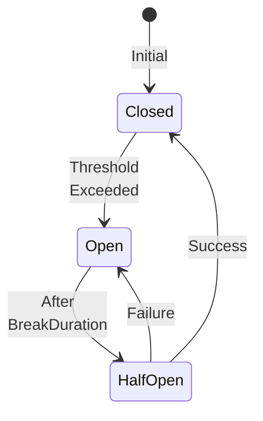

# Policy Engine Component


## Version History

:::new
**New in v1.0.0**: Basic policies - Retry, Timeout, Cache, and CircuitBreaker
:::


## Overview

The Policy Engine provides cross-cutting concerns as composable, declarative policies. Instead of cluttering your business logic with retry loops, timeout handling, and caching code, you declare policies that the framework applies automatically. In v1.0.0, we provide four essential policies to handle the most common scenarios.

## What is a Policy?

A Policy:
- **Wraps** component execution with additional behavior
- **Handles** cross-cutting concerns declaratively
- **Composes** with other policies
- **Applies** automatically via source generation

Think of policies as aspects that modify how your components execute without changing their core logic.

## Core Interface (v1.0.0)

:::new
The basic policy interface for wrapping execution:
:::

```csharp
public interface IPolicyOf<T> {
    Task<TResult> Execute<TResult>(
        Func<Task<TResult>> operation,
        IMessageContext context
    );
}
```

## Available Policies in v1.0.0

### 1. Retry Policy

:::new
Automatically retry failed operations with configurable backoff strategies:
:::

```csharp
// Basic retry with fixed delay
[Retry(3)]
public class PaymentReceptor : IReceptor<ProcessPayment, PaymentProcessed> {
    public async Task<PaymentProcessed> Receive(ProcessPayment cmd) {
        // If this throws, it will retry up to 3 times
        return ProcessPayment(cmd);
    }
}

// Exponential backoff
[Retry(3, BackoffStrategy.Exponential)]
public class OrderReceptor : IReceptor<CreateOrder, OrderCreated> {
    // Retries with delays: 1s, 2s, 4s
}

// Custom delays
[Retry(Delays = new[] { 100, 500, 2000 })]
public class InventoryReceptor : IReceptor<ReserveStock> {
    // Retries with specific delays: 100ms, 500ms, 2s
}
```

#### Configuration Options

```csharp
[Retry(
    MaxAttempts = 3,
    BackoffStrategy = BackoffStrategy.Exponential,
    InitialDelayMs = 100,
    MaxDelayMs = 30000,
    RetryOn = typeof(TransientException),
    ExcludeOn = typeof(ValidationException)
)]
```

### 2. Timeout Policy

:::new
Prevent operations from running indefinitely:
:::

```csharp
// Simple timeout
[Timeout(5000)]  // 5 seconds
public class DatabaseReceptor : IReceptor<QueryData> {
    public QueryResult Receive(QueryData cmd) {
        // Cancelled if takes longer than 5 seconds
        return ExecuteQuery(cmd);
    }
}

// Timeout with custom exception
[Timeout(3000, ThrowOnTimeout = true)]
public class CriticalReceptor : IReceptor<CriticalCommand> {
    // Throws TimeoutException instead of returning default
}
```

### 3. Cache Policy

:::new
Cache results to avoid redundant processing:
:::

```csharp
// Cache for 5 minutes
[Cache(Duration = 300)]  // seconds
public class ProductLens : IProductLens {
    public Product Focus(Guid productId) {
        // Result cached for 5 minutes
        return LoadProduct(productId);
    }
}

// Cache with sliding expiration
[Cache(Duration = 600, Sliding = true)]
public class CustomerLens : ICustomerLens {
    // Cache extends on each access
}

// Cache with custom key
[Cache(Duration = 300, KeyProperty = "CustomerId")]
public class OrderHistoryReceptor : IReceptor<GetOrderHistory> {
    // Cached by CustomerId property
}
```

### 4. Circuit Breaker Policy

:::new
Prevent cascading failures by breaking the circuit after repeated failures:
:::

```csharp
// Basic circuit breaker
[CircuitBreaker(
    FailureThreshold = 0.5,  // 50% failure rate
    SamplingDuration = 10,   // Over 10 seconds
    MinimumThroughput = 5,   // At least 5 calls
    BreakDuration = 30       // Break for 30 seconds
)]
public class ExternalServiceReceptor : IReceptor<CallExternalService> {
    public ServiceResult Receive(CallExternalService cmd) {
        // Circuit opens after 50% failures
        // Stays open for 30 seconds
        // Then half-open to test recovery
    }
}
```

#### Circuit States



## Applying Policies

### Via Attributes

:::new
The simplest way to apply policies is via attributes:
:::

```csharp
[Retry(3)]
[Timeout(5000)]
[Cache(300)]
[CircuitBreaker(0.5, 10)]
public class ResilientReceptor : IReceptor<ImportantCommand> {
    public CommandResult Receive(ImportantCommand cmd) {
        // All policies applied in order:
        // 1. Check cache
        // 2. Check circuit breaker
        // 3. Apply timeout
        // 4. Retry on failure
        return ProcessCommand(cmd);
    }
}
```

### Policy Execution Order

Policies execute in a specific order (innermost to outermost):
1. **Cache** - Check cache first
2. **CircuitBreaker** - Check if circuit is open
3. **Timeout** - Apply timeout to operation
4. **Retry** - Retry if operation fails

## Custom Policies

:::new
Create custom policies for specific needs:
:::

```csharp
[WhizbangPolicy]
public class LoggingPolicy : IPolicyOf<IReceptor> {
    private readonly ILogger _logger;
    
    public async Task<TResult> Execute<TResult>(
        Func<Task<TResult>> operation,
        IMessageContext context
    ) {
        var stopwatch = Stopwatch.StartNew();
        try {
            _logger.LogInformation("Executing {Operation}", context.MessageType);
            var result = await operation();
            _logger.LogInformation("Completed in {ElapsedMs}ms", stopwatch.ElapsedMilliseconds);
            return result;
        }
        catch (Exception ex) {
            _logger.LogError(ex, "Failed after {ElapsedMs}ms", stopwatch.ElapsedMilliseconds);
            throw;
        }
    }
}

// Usage
[LoggingPolicy]
[Retry(3)]
public class AuditedReceptor : IReceptor<AuditedCommand> { }
```

## Source Generation

:::new
Policies are woven at compile time for zero overhead:
:::

```csharp
// Generated by Whizbang.Generators
public static class PolicyWeaver {
    public static OrderReceptor WrapWithPolicies(OrderReceptor receptor) {
        return new RetryPolicyWrapper(
            new TimeoutPolicyWrapper(
                new CachePolicyWrapper(
                    new CircuitBreakerPolicyWrapper(receptor)
                )
            )
        );
    }
}
```

## Testing with Policies

```csharp
[Test]
public class PolicyTests {
    [Test]
    public async Task Retry_ShouldRetryThreeTimes() {
        // Arrange
        var attempts = 0;
        var receptor = new TestReceptor(() => {
            attempts++;
            if (attempts < 3) throw new TransientException();
            return new TestResult();
        });
        
        var retryPolicy = new RetryPolicy(3);
        
        // Act
        var result = await retryPolicy.Execute(
            () => receptor.Receive(new TestCommand()),
            new MessageContext()
        );
        
        // Assert
        Assert.Equal(3, attempts);
        Assert.NotNull(result);
    }
    
    [Test]
    public async Task CircuitBreaker_ShouldOpenAfterFailures() {
        // Arrange
        var breaker = new CircuitBreakerPolicy(0.5, 10, 5, 30);
        var failingOperation = () => throw new Exception();
        
        // Act - cause failures
        for (int i = 0; i < 5; i++) {
            try {
                await breaker.Execute(failingOperation, new MessageContext());
            }
            catch { }
        }
        
        // Assert - circuit should be open
        Assert.Throws<CircuitBreakerOpenException>(
            () => breaker.Execute(failingOperation, new MessageContext())
        );
    }
}
```

## IDE Features

```csharp
// IDE shows: "Policies: Retry(3), Timeout(5s), Cache(5m)"
[Retry(3)][Timeout(5000)][Cache(300)]
public class PolicyReceptor : IReceptor<Command> { }

// IDE shows: "Circuit breaker state: Closed | Success: 95% | Calls: 1,234"
[CircuitBreaker(0.5, 10)]
public class ServiceReceptor { }

// IDE shows: "Cache hit rate: 78% | Entries: 234 | Memory: 5.2MB"
[Cache(300)]
public class CachedLens { }
```

## Performance Characteristics

| Policy | Overhead | Memory Impact |
|--------|----------|---------------|
| Retry | < 10ns per attempt | Minimal |
| Timeout | < 100ns | Timer allocation |
| Cache | < 50ns lookup | Depends on cache size |
| CircuitBreaker | < 20ns check | State tracking |

## Limitations in v1.0.0

:::info
These limitations are addressed in future versions:
:::

- **No policy composition** - Cannot combine policies dynamically
- **Basic configuration** - Limited to attribute parameters
- **In-memory state** - Policy state not persisted
- **No distributed coordination** - Policies are instance-local

## Migration Path

### To v0.2.0 (Enhanced Policies)

:::planned
v0.2.0 adds composition and new policy types:
:::

```csharp
// v0.2.0 - Policy composition
[PolicySet("Resilient")]
public class OrderReceptor { }

// Define policy sets
services.AddPolicySet("Resilient", policies => {
    policies.AddRetry(3);
    policies.AddTimeout(5000);
    policies.AddBulkhead(10);  // New in v0.2.0
    policies.AddRateLimit(100, TimeSpan.FromMinute(1));  // New in v0.2.0
});
```

### To v0.6.0 (Security Policies)

:::planned
v0.6.0 adds security and compliance policies:
:::

```csharp
// v0.6.0 - Security policies
[Authorize(Roles = "Admin")]
[Audit(Level = AuditLevel.Full)]
[EncryptPII]
public class SecureReceptor { }
```

## Best Practices

1. **Order matters** - Apply policies in the right order
2. **Configure appropriately** - Don't retry non-transient errors
3. **Monitor policy metrics** - Track success rates and performance
4. **Test with policies** - Include policies in your tests
5. **Use circuit breakers** - Protect external dependencies
6. **Cache judiciously** - Consider memory and staleness

## Related Documentation

- [Receptors](receptors.md) - Applying policies to receptors
- [Perspectives](perspectives.md) - Applying policies to perspectives
- [Dispatcher](dispatcher.md) - How policies are executed
- [Testing](../testing/foundation.md) - Testing with policies
- [Feature Evolution](../../roadmap/FEATURE-EVOLUTION.md) - How policies evolve

## Next Steps

- See [v0.2.0 Enhancements](../../v0.2.0/enhancements/policies.md) for composition and new policies
- See [v0.6.0 Production](../../future/v0.6.0-production.md) for security policies
- Review [Examples](../examples/resilient-patterns.md) for policy patterns
