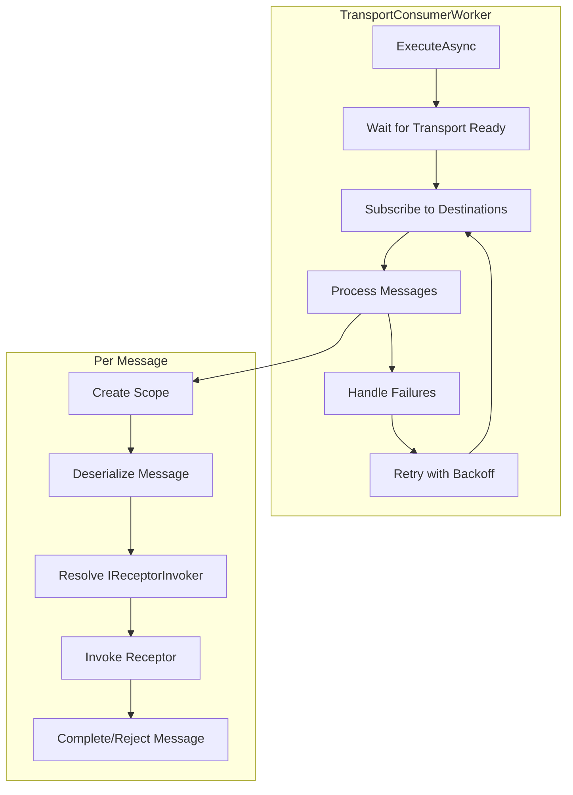
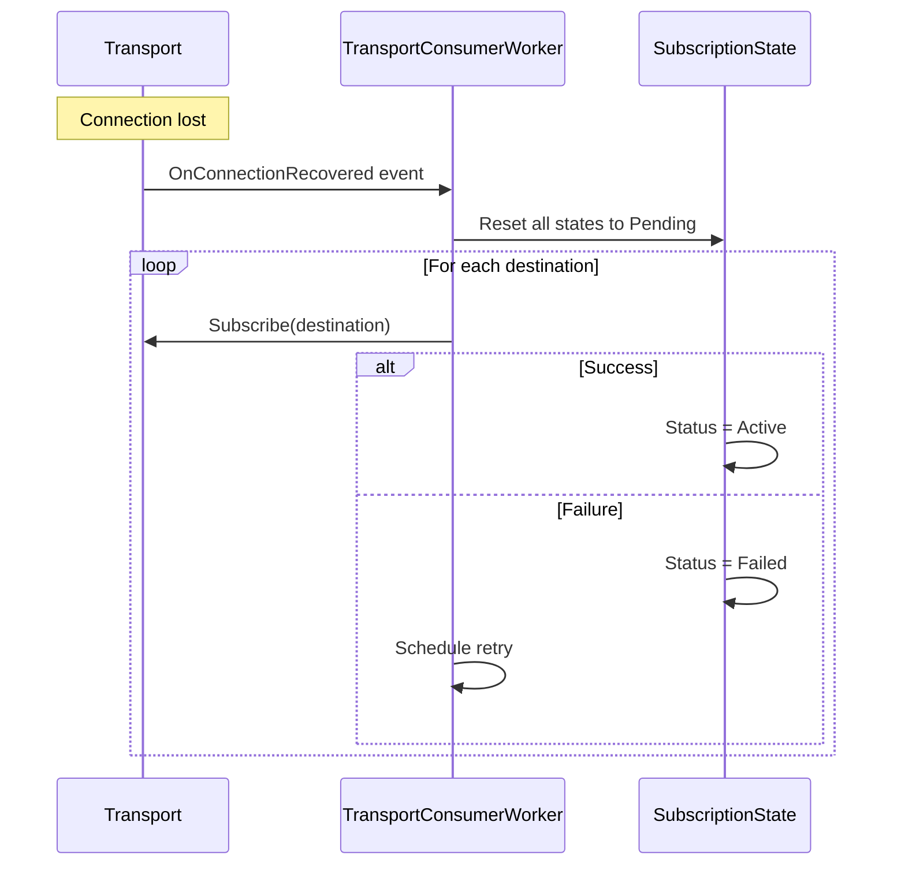

# Transport Consumer Worker

The **TransportConsumerWorker** is a background service (BackgroundService) that consumes messages from transport destinations with built-in resilience. It supports exponential backoff retry, connection recovery, and health monitoring.

## Overview

### What the Transport Consumer Worker Does

The TransportConsumerWorker orchestrates message consumption from any transport:

1. **Subscribes** to configured destinations (topics, exchanges, queues)
2. **Deserializes** incoming messages using configured JSON options
3. **Invokes** receptors via scoped `IReceptorInvoker`
4. **Handles** failures with exponential backoff retry
5. **Recovers** from connection losses automatically
6. **Reports** health status for monitoring

**Key Insight**: The TransportConsumerWorker is transport-agnostic. The same worker configuration works with Azure Service Bus, RabbitMQ, or any custom `ITransport` implementation.

---

## TransportConsumerWorker

### Core Responsibilities



### Constructor Dependencies

```csharp
public TransportConsumerWorker(
  ITransport transport,                           // Transport to consume from
  TransportConsumerOptions options,               // Destination configuration
  SubscriptionResilienceOptions resilienceOptions, // Retry behavior
  IServiceScopeFactory scopeFactory,              // Per-message scoping
  JsonSerializerOptions jsonOptions,              // Message deserialization
  OrderedStreamProcessor orderedProcessor,        // Message ordering
  ILifecycleMessageDeserializer? lifecycleMessageDeserializer, // Optional
  ILifecycleInvoker? lifecycleInvoker,           // Optional lifecycle hooks
  ILogger<TransportConsumerWorker> logger
)
```

**Important**: `IReceptorInvoker` is **scoped**, not injected. It is resolved from the per-message service scope, following industry patterns (MediatR, MassTransit) where handlers are scoped per request.

### Subscription States

The worker tracks state for each destination:

```csharp
public IReadOnlyDictionary<TransportDestination, SubscriptionState> SubscriptionStates => _states;
```

**SubscriptionState Properties**:
- `Status`: Current subscription status (Pending, Active, Failed, Recovering)
- `RetryCount`: Number of retry attempts
- `LastError`: Most recent error message
- `LastAttempt`: Timestamp of last subscription attempt

---

## TransportConsumerOptions

Configuration for the worker specifying which destinations to subscribe to.

### Properties

```csharp
public class TransportConsumerOptions {
  /// <summary>
  /// Gets the list of destinations to subscribe to.
  /// Each destination will create a separate subscription.
  /// </summary>
  public List<TransportDestination> Destinations { get; } = [];

  /// <summary>
  /// Subscriber name used for generating queue names.
  /// For RabbitMQ, this becomes the queue name prefix: "{SubscriberName}-{exchange}".
  /// If not set, a default name will be generated.
  /// </summary>
  public string? SubscriberName { get; set; }
}
```

### TransportDestination

Each destination represents a subscription target:

```csharp
public record TransportDestination(
  string Address,        // Topic, exchange, or queue name
  string? RoutingKey     // Optional routing key filter
);
```

### Configuration Example

```csharp
// Manual configuration (typically auto-generated via WithRouting)
services.Configure<TransportConsumerOptions>(options => {
  options.SubscriberName = "OrderService";
  options.Destinations.Add(new TransportDestination("myapp.orders.commands", "#"));
  options.Destinations.Add(new TransportDestination("myapp.payments.events", "#"));
});
```

---

## Resilience Features

### Exponential Backoff Retry

Failed subscriptions are retried with exponential backoff:

```
Attempt 1: Wait 1 second
Attempt 2: Wait 2 seconds
Attempt 3: Wait 4 seconds
Attempt 4: Wait 8 seconds
...
Capped at MaxRetryDelay (default: 120 seconds)
```

### Configuration

```csharp
services.Configure<SubscriptionResilienceOptions>(options => {
  options.InitialRetryDelay = TimeSpan.FromSeconds(1);  // Starting delay
  options.MaxRetryDelay = TimeSpan.FromMinutes(2);      // Cap on backoff
  options.BackoffMultiplier = 2.0;                      // Delay multiplier
  options.InitialRetryAttempts = 5;                     // Attempts before reducing logs
  options.RetryIndefinitely = true;                     // Never give up
  options.AllowPartialSubscriptions = false;            // All or nothing
});
```

### Connection Recovery

For transports implementing `ITransportWithRecovery`, the worker automatically handles connection loss:



**Supported Transports**:
- RabbitMQ (via `RabbitMQTransport`)
- Azure Service Bus (via `AzureServiceBusTransport`)

---

## Message Processing Flow

### Per-Message Scope

Each message is processed in its own DI scope:

```csharp
// Internal flow (simplified)
async Task ProcessMessageAsync(TransportMessage message) {
  using var scope = _scopeFactory.CreateScope();

  // Deserialize the message
  var envelope = await DeserializeAsync(message, scope.ServiceProvider);

  // Resolve scoped receptor invoker
  var receptorInvoker = scope.ServiceProvider.GetRequiredService<IReceptorInvoker>();

  // Invoke the receptor
  await receptorInvoker.InvokeAsync(envelope, cancellationToken);
}
```

### Lifecycle Hooks

Optional lifecycle invoker for test/runtime hooks:

```csharp
// Lifecycle stages for transport consumer
public enum LifecycleStage {
  PreReceptorAsync,     // Before receptor invocation
  PostReceptorAsync,    // After receptor invocation
  OnReceptorError,      // On receptor exception
  // ... other stages
}
```

---

## Health Monitoring

### Health Check Integration

The worker exposes subscription states for health checks:

```csharp
public class TransportConsumerHealthCheck : IHealthCheck {
  private readonly TransportConsumerWorker _worker;

  public Task<HealthCheckResult> CheckHealthAsync(
      HealthCheckContext context,
      CancellationToken cancellationToken) {

    var states = _worker.SubscriptionStates;

    var failedCount = states.Count(s => s.Value.Status == SubscriptionStatus.Failed);
    var activeCount = states.Count(s => s.Value.Status == SubscriptionStatus.Active);

    if (failedCount == states.Count) {
      return Task.FromResult(HealthCheckResult.Unhealthy("All subscriptions failed"));
    }

    if (failedCount > 0) {
      return Task.FromResult(HealthCheckResult.Degraded($"{failedCount} subscriptions recovering"));
    }

    return Task.FromResult(HealthCheckResult.Healthy($"{activeCount} subscriptions active"));
  }
}
```

### Diagnostic Data

Health check results include:
- `failed_destinations`: List of failed subscription addresses
- `recovering_destinations`: List of subscriptions currently retrying
- `active_destinations`: List of healthy subscriptions

---

## Integration with Routing

The preferred approach uses `WithRouting()` and `AddTransportConsumer()`:

```csharp
services.AddWhizbang()
    .WithRouting(routing => {
        routing
            .OwnDomains("myapp.orders.commands")
            .SubscribeTo("myapp.payments.events", "myapp.users.events")
            .Inbox.UseSharedTopic("inbox");
    })
    .WithEFCore<OrderDbContext>()
    .WithDriver.Postgres
    .AddTransportConsumer();
```

This auto-generates `TransportConsumerOptions.Destinations` from:
- **OwnDomains**: Creates inbox subscription with namespace filter
- **SubscribeTo**: Creates event subscriptions for each namespace
- **Auto-discovered events**: Events handled by perspectives and receptors

See [Transport Consumer](../../core-concepts/transport-consumer.md) for detailed routing integration.

---

## Best Practices

### DO

- **Use auto-configuration** via `WithRouting()` + `AddTransportConsumer()`
- **Register transport first** before adding consumer
- **Monitor health checks** in production
- **Configure appropriate retry delays** for your environment
- **Allow indefinite retries** (`RetryIndefinitely = true`) in production

### DON'T

- Manually configure destinations when routing is available
- Set retry delay too short (causes thrashing)
- Disable resilience in production (`EnableResilience = false`)
- Ignore subscription health status

---

## Troubleshooting

### Problem: Subscriptions Keep Failing

**Symptoms**: Subscription status stuck in `Failed`, retrying indefinitely.

**Causes**:
1. Transport not reachable (network issue)
2. Invalid credentials or permissions
3. Topic/exchange does not exist
4. Routing key pattern invalid

**Solution**:
```bash
# Check transport connectivity
curl -s http://rabbitmq:15672/api/overview  # RabbitMQ

# Check subscription state
var states = worker.SubscriptionStates;
foreach (var (dest, state) in states) {
    Console.WriteLine($"{dest.Address}: {state.Status} - {state.LastError}");
}
```

### Problem: Messages Not Being Processed

**Symptoms**: Subscriptions active but messages not received.

**Causes**:
1. Wrong routing key (messages not matching filter)
2. Queue bound to wrong exchange
3. Consumer not acknowledging messages
4. Receptor invoker throwing exceptions

**Solution**:
```csharp
// Enable detailed logging
builder.Logging.AddFilter("Whizbang.Core.Workers", LogLevel.Debug);

// Check if receptor is registered
var registry = services.GetRequiredService<IReceptorRegistry>();
var handlers = registry.GetHandlers(typeof(MyCommand));
```

### Problem: Health Check Shows Degraded

**Symptoms**: Some subscriptions active, others recovering.

**Causes**:
1. Partial transport availability
2. Specific topic/exchange issues
3. Permission differences between destinations

**Solution**:
```csharp
// Get detailed state for diagnostics
var degradedDestinations = worker.SubscriptionStates
    .Where(s => s.Value.Status != SubscriptionStatus.Active)
    .Select(s => new {
        Address = s.Key.Address,
        Status = s.Value.Status,
        RetryCount = s.Value.RetryCount,
        Error = s.Value.LastError
    });
```

---

## Related Documentation

**Workers**:
- [Perspective Worker](../../workers/perspective-worker.md) - Perspective checkpoint processing
- [Execution Lifecycle](../../workers/execution-lifecycle.md) - Startup/shutdown coordination
- [Database Readiness](../../workers/database-readiness.md) - Database dependency checks

**Core Concepts**:
- [Transport Consumer](../../core-concepts/transport-consumer.md) - Routing integration and auto-configuration
- [Routing](../../core-concepts/routing.md) - Namespace-based routing configuration

**Transports**:
- [RabbitMQ Transport](../transports/rabbitmq.md) - RabbitMQ transport configuration
- [Azure Service Bus Transport](../transports/azure-service-bus.md) - Azure Service Bus transport configuration

---

*Version 1.0.0 - Foundation Release | Last Updated: 2026-03-03*
