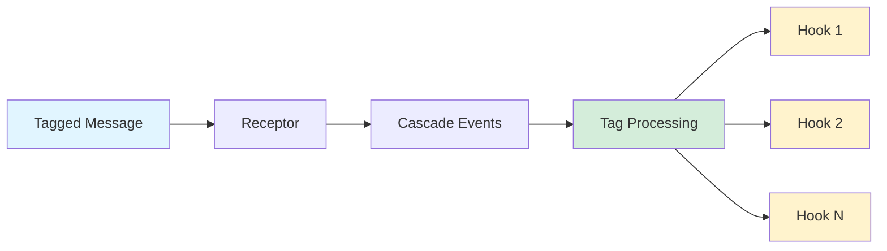

# Message Tags

Message tags enable **declarative cross-cutting concerns** - attach attributes to messages and hooks execute automatically when those messages are processed. Build notifications, telemetry, metrics, and audit logs without polluting business logic.

## Core Concept



**Tag Processing Flow**:
1. Message is dispatched and processed by receptor
2. After receptor completion, `MessageTagProcessor` checks for tag attributes
3. Registered hooks execute in priority order
4. Each hook receives the message, attribute, and extracted payload

## Quick Start

### 1. Configure Tag Hooks

```csharp{title="Configuring Tag Hooks" description="Register hooks for tag attributes in AddWhizbang" category="Configuration" difficulty="BEGINNER" tags=["Tags", "Configuration", "Hooks"]}
services.AddWhizbang(options => {
  // Register hooks for built-in tag types
  options.Tags.UseHook<NotificationTagAttribute, SignalRNotificationHook>();
  options.Tags.UseHook<TelemetryTagAttribute, OpenTelemetryHook>();
  options.Tags.UseHook<MetricTagAttribute, PrometheusMetricHook>();

  // Register hooks for custom tag attributes
  options.Tags.UseHook<AuditEventAttribute, AuditLogHook>();

  // Optional: Universal hook for ALL tagged messages
  options.Tags.UseUniversalHook<LoggingHook>();
});
```

### 2. Tag Your Messages

```csharp{title="Tagging Messages" description="Apply tag attributes to events and commands" category="Usage" difficulty="BEGINNER" tags=["Tags", "Events", "Attributes"]}
// Notification tag - for real-time notifications
[NotificationTag(Tag = "order-created", Properties = ["OrderId", "CustomerId"])]
public record OrderCreatedEvent(Guid OrderId, Guid CustomerId, decimal Total) : IEvent;

// Telemetry tag - for distributed tracing
[TelemetryTag(Tag = "payment-processed", SpanName = "ProcessPayment")]
public record PaymentProcessedEvent(Guid PaymentId, decimal Amount) : IEvent;

// Metric tag - for counters/gauges
[MetricTag(Tag = "orders-metric", MetricName = "orders.created", Type = MetricType.Counter)]
public record OrderCountEvent(Guid OrderId) : IEvent;
```

### 3. Implement a Hook

```csharp{title="Implementing a Tag Hook" description="Create a hook that responds to tagged messages" category="Implementation" difficulty="INTERMEDIATE" tags=["Tags", "Hooks", "SignalR"]}
public class SignalRNotificationHook : IMessageTagHook<NotificationTagAttribute> {
  private readonly IHubContext<NotificationHub> _hubContext;
  private readonly MyDbContext _dbContext; // Scoped services work!

  public SignalRNotificationHook(
      IHubContext<NotificationHub> hubContext,
      MyDbContext dbContext) {
    _hubContext = hubContext;
    _dbContext = dbContext;
  }

  public async ValueTask<JsonElement?> OnTaggedMessageAsync(
      TagContext<NotificationTagAttribute> context,
      CancellationToken ct) {

    // Access the tag identifier
    var tag = context.Attribute.Tag;  // e.g., "order-created"

    // Access the payload (JSON with extracted properties)
    var payload = context.Payload;

    // Access scope data (tenant, user, correlation ID)
    var tenantId = context.Scope?["TenantId"];

    // Send notification via SignalR
    await _hubContext.Clients.All.SendAsync(
        "Notification",
        new { Tag = tag, Data = payload },
        ct);

    // Return null to keep original payload
    // Or return modified JsonElement for subsequent hooks
    return null;
  }
}
```

## Built-in Tag Attributes

| Attribute | Purpose | Key Properties |
|-----------|---------|----------------|
| `NotificationTagAttribute` | Real-time notifications | `Tag`, `Properties`, `IncludeEvent` |
| `TelemetryTagAttribute` | Distributed tracing | `Tag`, `SpanName`, `Kind` |
| `MetricTagAttribute` | Metrics/counters | `Tag`, `MetricName`, `Type` |

### NotificationTagAttribute Properties

```csharp{title="NotificationTag Properties" description="Full property reference for NotificationTagAttribute" category="Reference" difficulty="BEGINNER" tags=["Tags", "Notifications", "API"]}
[NotificationTag(
    Tag = "order-created",              // Unique identifier
    Properties = ["OrderId", "Total"],  // Properties to extract into payload
    IncludeEvent = true,                // Include full event as "__event"
    ExtraJson = """{"source": "api"}""" // Merge extra JSON into payload
)]
public record OrderCreatedEvent(Guid OrderId, decimal Total, string InternalNote);
```

## TagContext Properties

The `TagContext<TAttribute>` provides access to all tag processing data:

| Property | Type | Description |
|----------|------|-------------|
| `Attribute` | `TAttribute` | The tag attribute instance with configured values |
| `Message` | `object` | The original message object |
| `MessageType` | `Type` | The message's runtime type |
| `Payload` | `JsonElement` | JSON payload with extracted properties |
| `Scope` | `IReadOnlyDictionary<string, object?>?` | Scope data (tenant, user, correlation ID) |

## Hook Priority

Hooks execute in **ascending priority order** (lower values first):

```csharp{title="Hook Priority Configuration" description="Control hook execution order with priority values" category="Configuration" difficulty="INTERMEDIATE" tags=["Tags", "Hooks", "Priority"]}
options.Tags.UseHook<NotificationTagAttribute, ValidationHook>(priority: -100);  // First
options.Tags.UseHook<NotificationTagAttribute, NotificationHook>(priority: 0);   // Default
options.Tags.UseHook<NotificationTagAttribute, AuditHook>(priority: 500);        // Last
```

## Processing Modes

### AfterReceptorCompletion (Default)

Tags are processed immediately after receptor completion:

```
Message → Receptor → Cascade Events → TAG PROCESSING → Lifecycle Stages
```

### AsLifecycleStage

Tags are processed during lifecycle invocation (use when hooks depend on lifecycle receptors):

```
Message → Receptor → Cascade Events → Lifecycle Stages → TAG PROCESSING
```

```csharp{title="Lifecycle Stage Mode" description="Process tags during lifecycle stage instead of immediately" category="Configuration" difficulty="INTERMEDIATE" tags=["Tags", "Configuration", "Lifecycle"]}
services.AddWhizbang(options => {
  options.TagProcessingMode = TagProcessingMode.AsLifecycleStage;
});
```

## Custom Tag Attributes

Create custom attributes by inheriting from `MessageTagAttribute`:

```csharp{title="Custom Tag Attribute" description="Create a custom tag attribute for domain-specific concerns" category="Extensibility" difficulty="INTERMEDIATE" tags=["Tags", "Custom-Attributes", "Extensibility"]}
// Custom attribute must inherit from MessageTagAttribute
[AttributeUsage(AttributeTargets.Class | AttributeTargets.Struct, AllowMultiple = false)]
public class SlackNotificationAttribute : MessageTagAttribute {
  public string Channel { get; set; } = "#general";
  public string Emoji { get; set; } = ":bell:";
}

// Use it on messages
[SlackNotification(Tag = "deploy-complete", Channel = "#deployments", Emoji = ":rocket:")]
public record DeploymentCompletedEvent(string Version, string Environment) : IEvent;

// Create a hook for it
public class SlackNotificationHook : IMessageTagHook<SlackNotificationAttribute> {
  public async ValueTask<JsonElement?> OnTaggedMessageAsync(
      TagContext<SlackNotificationAttribute> context,
      CancellationToken ct) {

    var channel = context.Attribute.Channel;
    var emoji = context.Attribute.Emoji;
    // Send to Slack...

    return null;
  }
}

// Register the hook
services.AddWhizbang(options => {
  options.Tags.UseHook<SlackNotificationAttribute, SlackNotificationHook>();
});
```

## DI Lifetime Behavior

**Important**: `IMessageTagProcessor` is registered as **Singleton** but hooks are **Scoped**.

### How It Works

- `Dispatcher` (Singleton) → `IMessageTagProcessor` (Singleton)
- Each `ProcessTagsAsync()` call creates a **new scope**
- All hooks within that call share the **same scope**
- Scope is disposed after processing completes

### What This Means

- ✅ Hooks **CAN** inject scoped services (`DbContext`, `IHttpContextAccessor`, etc.)
- ✅ Multiple hooks in the same processing call share the same `DbContext` instance
- ✅ Each message dispatch gets a fresh scope
- ⚠️ Don't store scope-dependent state in hook fields across calls

## Auto-Registration

Tagged messages are automatically discovered and registered at startup via source generator:

1. Source generator finds all tag attributes on messages
2. Generates `IMessageTagRegistry` implementation per assembly
3. Uses `[ModuleInitializer]` to register before `Main()` runs
4. No manual registration needed - just tag messages and register hooks!

```csharp{title="Generated Auto-Registration" description="Source generator creates ModuleInitializer for auto-registration" category="Internals" difficulty="ADVANCED" tags=["Tags", "Source-Generators", "Auto-Registration"]}
// Generated code (you don't write this):
[ModuleInitializer]
internal static void Initialize() {
  MessageTagRegistry.Register(
      GeneratedMessageTagRegistry_YourAssembly.Instance,
      priority: 100);
}
```

## Multi-Assembly Support

Tags can be defined in different assemblies:

- **Contracts assembly**: Define tagged messages, priority 100 (checked first)
- **Services assembly**: Define handlers, priority 1000

Both assemblies' registries are combined at runtime.

## Complete Example

```csharp{title="Complete Notification System" description="End-to-end example of tag-based notifications" category="Example" difficulty="INTERMEDIATE" tags=["Tags", "Notifications", "SignalR", "Example"]}
// 1. Define the event with notification tag
[NotificationTag(Tag = "order-status-changed", Properties = ["OrderId", "NewStatus"])]
public record OrderStatusChangedEvent(
    Guid OrderId,
    OrderStatus NewStatus,
    OrderStatus OldStatus) : IEvent;

// 2. Create the hook
public class OrderNotificationHook : IMessageTagHook<NotificationTagAttribute> {
  private readonly IHubContext<CustomerHub> _hub;
  private readonly INotificationService _notifications;

  public OrderNotificationHook(
      IHubContext<CustomerHub> hub,
      INotificationService notifications) {
    _hub = hub;
    _notifications = notifications;
  }

  public async ValueTask<JsonElement?> OnTaggedMessageAsync(
      TagContext<NotificationTagAttribute> context,
      CancellationToken ct) {

    var orderId = context.Payload.GetProperty("OrderId").GetGuid();
    var status = context.Payload.GetProperty("NewStatus").GetString();
    var customerId = context.Scope?["CustomerId"] as Guid?;

    // Send real-time update
    if (customerId.HasValue) {
      await _hub.Clients.User(customerId.Value.ToString())
          .SendAsync("OrderStatusUpdate", new { orderId, status }, ct);
    }

    // Queue push notification
    await _notifications.QueuePushNotificationAsync(
        customerId,
        $"Order {orderId} is now {status}",
        ct);

    return null;
  }
}

// 3. Register in startup
services.AddWhizbang(options => {
  options.Tags.UseHook<NotificationTagAttribute, OrderNotificationHook>();
});
```

## Troubleshooting

### Tags not being processed?

1. Verify `EnableTagProcessing` is true (default)
2. Check that hooks are registered with `UseHook<>`
3. Ensure message type is `public` (private types are not discovered)
4. Verify the attribute inherits from `MessageTagAttribute`

### Hook not firing?

1. Check hook is registered for the correct attribute type
2. Verify hook is registered with DI (automatically done by UseHook)
3. Check `TagProcessingMode` - if using `AsLifecycleStage`, hooks fire later

### Multi-assembly issues?

1. Ensure both assemblies reference `Whizbang.Generators`
2. Check that `[ModuleInitializer]` is running
3. Contracts assembly should use priority 100, services priority 1000

## See Also

- [Lifecycle Stages](./lifecycle-stages) - When tags are processed in the pipeline
- [Dispatcher](./dispatcher) - Message dispatch and routing
- [WhizbangCoreOptions](../configuration/whizbang-options) - Configuration reference
