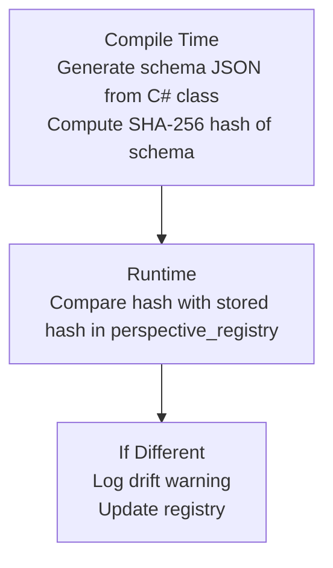

# Schema Migration

Whizbang provides automatic schema management for perspective tables, with built-in drift detection and safe rename operations. This page covers how Whizbang handles schema changes across deployments.

## Automatic Schema Creation

When your application starts, Whizbang automatically creates all required infrastructure tables and perspective tables:

```csharp{title="Automatic Schema Creation" description="When your application starts, Whizbang automatically creates all required infrastructure tables and perspective tables:" category="Implementation" difficulty="BEGINNER" tags=["Data", "C#", "Automatic", "Schema", "Creation"]}
// In your startup code
await dbContext.EnsureWhizbangDatabaseInitializedAsync();
```

This single call:
1. Creates infrastructure tables (`wh_inbox`, `wh_outbox`, `wh_event_store`, etc.)
2. Creates perspective tables for all discovered perspectives
3. Registers perspectives in the [perspective registry](../fundamentals/perspectives/registry.md)
4. Detects and logs any schema drift

## Schema Drift Detection

Schema drift occurs when your C# perspective definition doesn't match the database table. Whizbang detects this by comparing SHA-256 hashes of the schema definition.

### Detection Flow



### What Causes Drift

The hash covers the *table* schema — the fixed `PerspectiveRow` columns plus any physical/vector columns and their indexes. Plain model properties live inside the JSONB `data` column and do not affect the hash.

| Change Type | Example | Drift Detected? |
|-------------|---------|-----------------|
| Add plain property (JSONB-only) | Add `Email` to `CustomerData` | No* |
| Add physical field | Add `[PhysicalField]` attribute | Yes |
| Remove physical field | Remove `[PhysicalField]` attribute | Yes |
| Change physical field type | `int Total` → `decimal Total` | Yes |
| Add vector field | Add `[VectorField(1536)]` or change dimensions | Yes |
| Add index | Set `[PhysicalField(Indexed = true)]` | Yes |
| Rename physical field | `Name` → `FullName` (column rename) | Yes |
| Reorder properties | Move `Email` before `Name` | No** |

*JSONB-only changes need no table change — new rows simply serialize the new shape.
**Columns and indexes are sorted canonically before hashing, so order never matters.

### Handling Drift

When drift is detected during registry reconciliation, Whizbang logs a warning and updates the registry with the new schema JSON and hash:

```
[WRN] Schema drift detected for perspective: MyApp.CustomerProjection (wh_per_customer)
```

:::updated{version="1.0.0"}
There is no configurable drift behavior (no `SchemaDriftBehavior` option). Shipped behavior is fixed: drift is logged as a warning and the registry entry is updated — initialization never throws or recreates tables because of drift. New tables and new *infrastructure* columns are created idempotently (`CREATE TABLE IF NOT EXISTS` + `ALTER TABLE ADD COLUMN IF NOT EXISTS`), but structural changes to existing perspective tables (new physical columns, type changes) require a manual migration.
:::

Your options when you see the warning:

#### Option 1: Ignore

If the change only affects data inside the JSONB `data` column (adding or removing model properties), no table change is needed — new rows simply serialize the new shape. The warning is informational.

#### Option 2: Manual Migration

For changes that affect physical columns or need backfill, create a migration:

```sql{title="Option 3: Manual Migration" description="For breaking changes, create a migration:" category="Implementation" difficulty="BEGINNER" tags=["Data", "Sql", "Option", "Manual", "Migration"]}
-- Add new column
ALTER TABLE wh_per_customer
ADD COLUMN email VARCHAR(255);

-- Update existing rows if needed
UPDATE wh_per_customer
SET data = jsonb_set(data, '{email}', '"unknown@example.com"')
WHERE data->>'email' IS NULL;
```

## Automatic Table Renaming

When you rename a perspective class or change its [table naming](../fundamentals/perspectives/table-naming.md) configuration, Whizbang automatically renames the table:

### How It Works

1. Source generator computes new table name
2. Application starts and calls reconciliation
3. Registry finds existing entry for the CLR type
4. Detects table name mismatch
5. Executes `ALTER TABLE ... RENAME TO ...`
6. Updates registry with new name

### Example

```csharp{title="Example" description="Example" category="Implementation" difficulty="BEGINNER" tags=["Data", "Example"]}
// Before: Table is wh_per_customer_dto
public class CustomerDto : IPerspectiveFor<CustomerData, CustomerEvent> { }

// After: You enable suffix stripping (default in v1.0.0)
// Table becomes wh_per_customer
public class CustomerDto : IPerspectiveFor<CustomerData, CustomerEvent> { }
```

On deployment:
```sql{title="Example (2)" description="On deployment:" category="Implementation" difficulty="BEGINNER" tags=["Data", "Example"]}
-- Executed automatically
ALTER TABLE wh_per_customer_dto RENAME TO wh_per_customer;
```

### Rename Safety

The rename operation is safe because:
- It's atomic (single DDL statement)
- No data is modified or lost
- Indexes and constraints are preserved
- Registry tracks the change for auditing

## Multi-Environment Considerations

### Development vs Production

In development, the simplest way to absorb a breaking perspective schema change is to drop the affected `wh_per_*` table (and its `wh_perspective_registry` row) and restart — initialization recreates the table and perspectives rebuild from the event store. In production, treat drift warnings as a signal to write a manual migration before relying on the new shape.

### CI/CD Pipeline

Drift warnings surface in startup logs (`Schema drift detected for perspective: ...`). Since drift never fails startup, monitor deployment logs (or your log aggregation alerts) for these warnings after each deploy and follow up with a manual migration when a physical column is affected.

## Infrastructure Schema

Whizbang infrastructure tables are versioned and migrated automatically. Key tables include:

| Table | Purpose |
|-------|---------|
| `wh_inbox` | Message deduplication |
| `wh_outbox` | Transactional messaging |
| `wh_event_store` | Event persistence |
| `wh_perspective_registry` | CLR type → table mapping |
| `wh_perspective_cursors` | Projection progress tracking |
| `wh_service_instances` | Distributed coordination |

### Migration Files

Infrastructure migrations are embedded in the Whizbang.Data.Postgres package (numbered `000`–`064` at this commit):

```
Migrations/
├── 000_MigrationTracking.sql
├── 001_CreateComputePartitionFunction.sql
├── ...
├── 029_ProcessWorkBatch.sql          (hosts claim_work + focused work-pump functions)
├── 030_ReconcilePerspectiveRegistry.sql
├── 033_RenamePerspectiveCheckpointsToCursors.sql
├── ...
└── 064_ReconcileMessageTypeRegistry_LedgerAware.sql
```

Migrations are applied automatically and idempotently — each file's hash is tracked in `wh_schema_migrations`, so unchanged migrations are skipped on subsequent startups.

## Schema JSON Format

The registry stores full schema definitions as canonical JSON (columns and indexes sorted by name, camelCase keys, `false`/`null` values omitted — this guarantees byte-stable SHA-256 hashes across platforms):

```json{title="Schema JSON Format" description="The registry stores full schema definitions as canonical JSON:" category="Implementation" difficulty="INTERMEDIATE" tags=["Data", "Json", "Schema", "JSON", "Format"]}
{
  "columns": [
    {
      "name": "customer_id",
      "nullable": true,
      "type": "uuid"
    },
    {
      "name": "data",
      "type": "jsonb"
    },
    {
      "isPrimaryKey": true,
      "name": "id",
      "type": "uuid"
    }
  ],
  "indexes": [
    {
      "columns": ["customer_id"],
      "name": "idx_customer_customer_id",
      "type": "btree"
    }
  ]
}
```

Vector columns additionally carry `"isVector": true` and `"vectorDimensions": n`.

### Supported Column Types

| C# Type | PostgreSQL | JSON Key |
|---------|------------|----------|
| `Guid` | `UUID` | `"uuid"` |
| `string` | `TEXT` | `"text"` |
| `int` | `INTEGER` | `"integer"` |
| `long` | `BIGINT` | `"bigint"` |
| `bool` | `BOOLEAN` | `"boolean"` |
| `DateTime` | `TIMESTAMPTZ` | `"timestamptz"` |
| `byte[]` | `BYTEA` | `"bytea"` |
| JSON data | `JSONB` | `"jsonb"` |
| `Vector` | `VECTOR(n)` | `"vector"` |

### Index Types

| Index Type | PostgreSQL | Use Case |
|------------|------------|----------|
| `btree` | B-Tree | General queries, sorting |
| `gin` | GIN | JSONB containment, full-text |
| `ivfflat` | IVF Flat | Vector similarity (approximate) |
| `hnsw` | HNSW | Vector similarity (fast) |

## Rollback Strategies

### Preserve Old Table

Before making breaking changes, rename the old table:

```sql{title="Preserve Old Table" description="Before making breaking changes, rename the old table:" category="Implementation" difficulty="BEGINNER" tags=["Data", "Sql", "Preserve", "Old", "Table"]}
-- Before deployment
ALTER TABLE wh_per_customer RENAME TO wh_per_customer_backup;

-- After verifying new version works
DROP TABLE wh_per_customer_backup;
```

### Dual-Write Period

For zero-downtime migrations:

1. Deploy new code that writes to both old and new tables
2. Backfill new table from old table
3. Switch reads to new table
4. Remove dual-write code
5. Drop old table

## Troubleshooting

### "Schema drift detected" Warning

**Cause**: C# class changed but database table wasn't updated.

**Solutions**:
1. For JSONB-only model changes: Safe to ignore (warning is informational)
2. For physical-column changes: Run a manual migration
3. For development: Drop the `wh_per_*` table and its registry row, then restart to recreate and rebuild

### "Table rename failed"

**Cause**: Old table doesn't exist or name collision.

**Solutions**:
1. Check if table was already renamed manually
2. Check for existing table with new name
3. Run `SELECT * FROM wh_perspective_registry` to see current state

### "Perspective not found in registry"

**Cause**: First deployment or registry was cleared.

**Solutions**:
1. Expected on first run - table will be created
2. If registry was cleared, tables still exist but aren't tracked
3. Manually insert registry entries if needed

## See Also

- [Perspective Registry](../fundamentals/perspectives/registry.md) - CLR type tracking
- [Table Naming](../fundamentals/perspectives/table-naming.md) - Naming conventions
- [EF Core JSON Configuration](efcore-json-configuration.md) - JSON column setup
