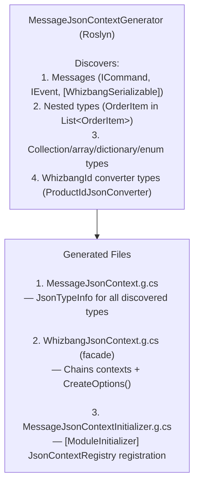

# JSON Contexts

The **MessageJsonContextGenerator** discovers all message types (`ICommand`, `IEvent`) at compile-time and generates a `JsonSerializerContext` with `JsonTypeInfo` for **AOT-compatible JSON serialization**. This enables Native AOT deployments with zero reflection overhead.

## Why JSON Source Generation?

**Problem**: Traditional `JsonSerializer` uses **reflection** at runtime:

```csharp{title="Why JSON Source Generation?" description="Problem: Traditional JsonSerializer uses reflection at runtime:" category="Internals" difficulty="BEGINNER" tags=["Extending", "Source-Generators", "Why", "JSON"]}
// ❌ Reflection-based (not AOT-compatible)
var json = JsonSerializer.Serialize(message);  // Scans type at runtime!
var deserialized = JsonSerializer.Deserialize<CreateOrder>(json);  // Reflection!
```

**Issues with Reflection**:
- ❌ **Not AOT Compatible**: Native AOT trims reflection metadata
- ❌ **Slow First Call**: ~50-100ms to scan type and build metadata
- ❌ **Runtime Overhead**: Type analysis on every new type
- ❌ **Large Binary Size**: Includes all reflection infrastructure

**Solution**: **Source-Generated JsonSerializerContext**:

```csharp{title="Why JSON Source Generation? (2)" description="Solution: Source-Generated JsonSerializerContext:" category="Internals" difficulty="BEGINNER" tags=["Extending", "Source-Generators", "Why", "JSON"]}
// ✅ AOT-compatible (compile-time metadata)
var options = new JsonSerializerOptions {
    TypeInfoResolver = new WhizbangJsonContext()  // Generated at compile-time
};

var json = JsonSerializer.Serialize(message, options);  // Zero reflection!
var deserialized = JsonSerializer.Deserialize<CreateOrder>(json, options);
```

**Benefits**:
- ✅ **AOT Compatible**: No reflection, full Native AOT support
- ✅ **Fast**: Zero runtime type analysis (~100x faster first call)
- ✅ **Small Binary**: No reflection infrastructure needed
- ✅ **Explicit**: All serialized types visible at compile-time

---

## How It Works

### 1. Compile-Time Discovery



---

### 2. Generated Code

**WhizbangJsonContext.g.cs** (facade) — note this is a hand-rolled resolver chain, **not** an STJ `[JsonSerializable]` attribute context:

```csharp{title="Generated Code" description="**WhizbangJsonContext." category="Internals" difficulty="INTERMEDIATE" tags=["Extending", "Source-Generators", "Generated", "Code"]}
namespace MyApp.Generated;

/// <summary>
/// Generated JSON type resolver for MyApp.
/// Chains four contexts:
/// 1. WhizbangIdJsonContext from Whizbang.Core (MessageId, CorrelationId)
/// 2. WhizbangIdJsonContext from this assembly (local WhizbangId types)
/// 3. MessageJsonContext (discovered messages in this assembly)
/// 4. InfrastructureJsonContext (MessageHop, SecurityContext, etc. from Whizbang.Core)
/// </summary>
public class WhizbangJsonContext : JsonSerializerContext, IJsonTypeInfoResolver {
    public static WhizbangJsonContext Default { get; } = new();

    public static JsonSerializerOptions CreateOptions() {
        var resolvers = new[] {
            (IJsonTypeInfoResolver)global::Whizbang.Core.Generated.WhizbangIdJsonContext.Default,
            (IJsonTypeInfoResolver)WhizbangIdJsonContext.Default,   // local WhizbangId types
            (IJsonTypeInfoResolver)MessageJsonContext.Default,
            (IJsonTypeInfoResolver)global::Whizbang.Core.Generated.InfrastructureJsonContext.Default
        };

        var options = new JsonSerializerOptions {
            TypeInfoResolver = JsonTypeInfoResolver.Combine(resolvers),
            DefaultIgnoreCondition = JsonIgnoreCondition.WhenWritingNull
        };

        // Register WhizbangId converters (inferred by naming convention)
        options.Converters.Add(new ProductIdJsonConverter());
        options.Converters.Add(new OrderIdJsonConverter());

        return options;
    }

    // GetTypeInfo delegates to the combined resolver (both the
    // JsonSerializerContext override and the IJsonTypeInfoResolver implementation)
}
```

**MessageJsonContext.g.cs** (implementation):
```csharp{title="Generated Code - MessageJsonContext" description="**MessageJsonContext." category="Internals" difficulty="ADVANCED" tags=["Extending", "Source-Generators", "Generated", "Code"]}
using System;
using System.Text.Json;
using System.Text.Json.Serialization;
using System.Text.Json.Serialization.Metadata;

namespace MyApp.Generated;

public partial class MessageJsonContext : JsonSerializerContext, IJsonTypeInfoResolver {
    // Singleton used in resolver chains
    public static MessageJsonContext Default { get; } = new();

    // Generated JsonTypeInfo factory for CreateOrder (cached behind a lazy property)
    private JsonTypeInfo<CreateOrder> Create_CreateOrder(JsonSerializerOptions options) {
        var properties = new JsonPropertyInfo[3];

        properties[0] = JsonMetadataServices.CreatePropertyInfo<Guid>(
            options,
            propertyName: "OrderId",
            getter: static obj => ((CreateOrder)obj).OrderId,
            setter: null  // Init-only property
        );

        properties[1] = JsonMetadataServices.CreatePropertyInfo<Guid>(
            options,
            propertyName: "CustomerId",
            getter: static obj => ((CreateOrder)obj).CustomerId,
            setter: null
        );

        properties[2] = JsonMetadataServices.CreatePropertyInfo<List<OrderItem>>(
            options,
            propertyName: "Items",
            getter: static obj => ((CreateOrder)obj).Items,
            setter: null
        );

        // Constructor parameters for record with primary constructor
        var ctorParams = new JsonParameterInfoValues[3];
        ctorParams[0] = new JsonParameterInfoValues { Name = "OrderId", ParameterType = typeof(Guid) };
        ctorParams[1] = new JsonParameterInfoValues { Name = "CustomerId", ParameterType = typeof(Guid) };
        ctorParams[2] = new JsonParameterInfoValues { Name = "Items", ParameterType = typeof(List<OrderItem>) };

        var objectInfo = new JsonObjectInfoValues<CreateOrder> {
            ObjectWithParameterizedConstructorCreator = static args => new CreateOrder(
                (Guid)args[0],
                (Guid)args[1],
                (List<OrderItem>)args[2]
            ),
            PropertyMetadataInitializer = _ => properties,
            ConstructorParameterMetadataInitializer = () => ctorParams
        };

        var jsonTypeInfo = JsonMetadataServices.CreateObjectInfo(options, objectInfo);
        jsonTypeInfo.OriginatingResolver = this;
        return jsonTypeInfo;
    }

    // Type resolver - matches type to JsonTypeInfo
    public override JsonTypeInfo? GetTypeInfo(Type type) {
        if (type == typeof(CreateOrder)) {
            return Create_CreateOrder(Options);
        }

        if (type == typeof(OrderCreated)) {
            return Create_OrderCreated(Options);
        }

        // ... more types

        return null;  // Not handled by this context
    }
}
```

---

## Serializing Additional Types {#serializing-additional-types}

By default, the `MessageJsonContextGenerator` automatically discovers types that implement `ICommand` or `IEvent`. However, many applications have additional types that need JSON serialization but don't fall into these categories.

### WhizbangSerializableAttribute

Use the `[WhizbangSerializable]` attribute to mark any type for automatic inclusion in the generated JSON context:

```csharp{title="WhizbangSerializableAttribute" description="Use the [WhizbangSerializable] attribute to mark any type for automatic inclusion in the generated JSON context:" category="Internals" difficulty="INTERMEDIATE" tags=["Extending", "Source-Generators", "WhizbangSerializableAttribute"]}
namespace Whizbang;

/// <summary>
/// Marks a type for automatic inclusion in the generated JSON serialization context.
/// </summary>
/// <remarks>
/// Use this attribute on types that need JSON serialization but don't implement
/// ICommand or IEvent (e.g., DTOs, value objects, JSONB column types).
/// The MessageJsonContextGenerator will discover these types and include them
/// in the generated JsonSerializerContext for AOT-compatible serialization.
/// </remarks>
[AttributeUsage(AttributeTargets.Class | AttributeTargets.Struct, AllowMultiple = false, Inherited = false)]
public sealed class WhizbangSerializableAttribute : Attribute { }
```

**Usage Example**:

```csharp{title="WhizbangSerializableAttribute - ProductDto" description="Usage Example:" category="Internals" difficulty="INTERMEDIATE" tags=["Extending", "Source-Generators", "WhizbangSerializableAttribute"]}
using Whizbang;

// Perspective lens DTOs (read models)
[WhizbangSerializable]
public record ProductDto {
  public required Guid ProductId { get; init; }
  public required string Name { get; init; }
  public required decimal Price { get; init; }
}

// API response models
[WhizbangSerializable]
public record OrderSummary {
  public required Guid OrderId { get; init; }
  public required string Status { get; init; }
  public required decimal Total { get; init; }
}

// JSONB column types
[WhizbangSerializable]
public record AddressDetails {
  public required string Street { get; init; }
  public required string City { get; init; }
  public required string PostalCode { get; init; }
}

// Value objects
[WhizbangSerializable]
public record MoneyValue {
  public required decimal Amount { get; init; }
  public required string Currency { get; init; }
}
```

### Common Use Cases

| Type | Description | Example |
|------|-------------|---------|
| **Perspective DTOs** | Read models returned by lens queries | `ProductDto`, `OrderSummary` |
| **API Responses** | Custom response types for REST/GraphQL | `PagedResult<T>`, `ApiError` |
| **JSONB Columns** | Complex types stored as JSON in PostgreSQL | `AddressDetails`, `Metadata` |
| **Value Objects** | Domain value types | `MoneyValue`, `GeoLocation` |
| **Nested Types** | Types used within commands/events | `OrderItem`, `LineItem` |

### How It Works

1. **Discovery**: Generator scans for `[WhizbangSerializable]` attribute at compile-time
2. **Registration**: Marked types are added to the generated `JsonSerializerContext`
3. **AOT Compatible**: Full Native AOT support with zero reflection

**Generated Code**: marked types get `JsonTypeInfo` factories in `MessageJsonContext.g.cs` alongside commands and events, and are registered by name with `JsonContextRegistry` in the module initializer so cross-assembly, by-name resolution works:

```csharp{title="How It Works" description="Generated Code:" category="Internals" difficulty="BEGINNER" tags=["Extending", "Source-Generators", "Works"]}
// MessageJsonContextInitializer.g.cs (module initializer, runs at assembly load)
public static class MessageJsonContextInitializer {
    [ModuleInitializer]
    public static void Initialize() {
        JsonContextRegistry.RegisterContext(MessageJsonContext.Default);
        // + RegisterTypeName / RegisterDerivedType calls for each discovered type:
        //   CreateOrder (ICommand), OrderCreated (IEvent),
        //   ProductDto, OrderSummary, AddressDetails ([WhizbangSerializable])
    }
}
```

### Best Practices

**DO**:
- Mark all DTOs returned from lens queries
- Mark complex types stored in JSONB columns
- Mark value objects used across API boundaries

**DON'T**:
- Mark types that implement `ICommand` or `IEvent` (already discovered)
- Mark internal implementation types (not needed)
- Mark types from external assemblies (use their own context)

---

## Discovery Patterns

### Pattern 1: Command/Event Discovery

```csharp{title="Pattern 1: Command/Event Discovery" description="Pattern 1: Command/Event Discovery" category="Internals" difficulty="INTERMEDIATE" tags=["Extending", "Source-Generators", "Pattern", "Command"]}
// Commands and events are auto-discovered
public record CreateOrder(
    Guid OrderId,
    Guid CustomerId,
    List<OrderItem> Items
) : ICommand;  // ← Discovered

public record OrderCreated(
    Guid OrderId,
    Guid CustomerId,
    decimal Total,
    DateTimeOffset CreatedAt
) : IEvent;  // ← Discovered
```

**Result**: `JsonTypeInfo<CreateOrder>` and `JsonTypeInfo<OrderCreated>` generated.

---

### Pattern 2: Nested Type Discovery

```csharp{title="Pattern 2: Nested Type Discovery" description="Pattern 2: Nested Type Discovery" category="Internals" difficulty="INTERMEDIATE" tags=["Extending", "Source-Generators", "Pattern", "Nested"]}
// Command uses OrderItem (nested type)
public record CreateOrder(
    Guid OrderId,
    Guid CustomerId,
    List<OrderItem> Items  // ← OrderItem discovered automatically
) : ICommand;

// Nested type (not ICommand or IEvent)
public record OrderItem(
    Guid ProductId,
    int Quantity,
    decimal UnitPrice
);
```

**Result**: `JsonTypeInfo<OrderItem>` also generated (needed for `List<OrderItem>`).

---

### Pattern 3: Collection Type Discovery

```csharp{title="Pattern 3: Collection Type Discovery" description="Pattern 3: Collection Type Discovery" category="Internals" difficulty="BEGINNER" tags=["Extending", "Source-Generators", "Pattern", "Collection"]}
// List<T> types discovered from properties
public record CreateOrder(
    Guid OrderId,
    List<OrderItem> Items  // ← List<OrderItem> discovered
) : ICommand;
```

**Result**: `JsonTypeInfo<List<OrderItem>>` generated for AOT compatibility.

---

### Pattern 4: WhizbangId Converter Discovery

```csharp{title="Pattern 4: WhizbangId Converter Discovery" description="Pattern 4: WhizbangId Converter Discovery" category="Internals" difficulty="BEGINNER" tags=["Extending", "Source-Generators", "Pattern", "WhizbangId"]}
// Generator infers converters for *Id types
public record CreateOrder(
    ProductId ProductId,  // ← Infers ProductIdJsonConverter
    CustomerId CustomerId  // ← Infers CustomerIdJsonConverter
) : ICommand;
```

**Result**: Converters automatically registered in `CreateOptions()`:
```csharp{title="Pattern 4: WhizbangId Converter Discovery (2)" description="Result: Converters automatically registered in CreateOptions():" category="Internals" difficulty="BEGINNER" tags=["Extending", "Source-Generators", "Pattern", "WhizbangId"]}
options.Converters.Add(new ProductIdJsonConverter());
options.Converters.Add(new CustomerIdJsonConverter());
```

---

## Usage

### Basic Serialization

```csharp{title="Basic Serialization" description="Basic Serialization" category="Internals" difficulty="BEGINNER" tags=["Extending", "Source-Generators", "Basic", "Serialization"]}
using MyApp.Generated;

// Create options with generated context
var options = WhizbangJsonContext.CreateOptions();

// Serialize (AOT-compatible, zero reflection)
var command = new CreateOrder(orderId, customerId, items);
var json = JsonSerializer.Serialize(command, options);

// Deserialize (AOT-compatible)
var deserialized = JsonSerializer.Deserialize<CreateOrder>(json, options);
```

---

### Dependency Injection

```csharp{title="Dependency Injection" description="Dependency Injection" category="Internals" difficulty="BEGINNER" tags=["Extending", "Source-Generators", "Dependency", "Injection"]}
// Program.cs
using MyApp.Generated;

var builder = WebApplication.CreateBuilder(args);

// Register JsonSerializerOptions with generated context
builder.Services.AddSingleton(WhizbangJsonContext.CreateOptions());

// Or configure JsonOptions for ASP.NET Core
builder.Services.Configure<JsonOptions>(options => {
    options.JsonSerializerOptions.TypeInfoResolver = new WhizbangJsonContext();
    options.JsonSerializerOptions.PropertyNamingPolicy = JsonNamingPolicy.CamelCase;
});
```

---

### Outbox/Inbox Serialization

```csharp{title="Outbox/Inbox Serialization" description="Outbox/Inbox Serialization" category="Internals" difficulty="INTERMEDIATE" tags=["Extending", "Source-Generators", "Outbox", "Inbox"]}
public class OutboxPublisher {
    private readonly JsonSerializerOptions _jsonOptions;

    public OutboxPublisher() {
        _jsonOptions = WhizbangJsonContext.CreateOptions();
    }

    public async Task PublishAsync(object message, CancellationToken ct = default) {
        // Serialize with AOT-compatible context
        var json = JsonSerializer.Serialize(message, _jsonOptions);

        await _db.ExecuteAsync(
            "INSERT INTO wh_outbox (message_id, payload, ...) VALUES (@MessageId, @Payload::jsonb, ...)",
            new { MessageId = TrackedGuid.NewMedo(), Payload = json },  // UUIDv7, time-ordered
            cancellationToken: ct
        );
    }
}
```

---

## Performance

### Benchmark: First Serialization

| Method | Overhead | Notes |
|--------|----------|-------|
| **Generated Context** | ~5ms | Compile-time metadata |
| **Reflection** | ~100ms | Runtime type analysis |

**20x faster** on first call!

### Subsequent Calls

| Method | Overhead | Notes |
|--------|----------|-------|
| **Generated Context** | ~100ns | Direct property access |
| **Reflection** | ~150ns | Cached reflection metadata |

**1.5x faster** on subsequent calls (minimal difference after warm-up).

---

## Native AOT Compatibility

### Publish Native AOT

```xml{title="Publish Native AOT" description="Publish Native AOT" category="Internals" difficulty="BEGINNER" tags=["Extending", "Source-Generators", "Publish", "Native"]}
<!-- MyApp.csproj -->
<PropertyGroup>
  <PublishAot>true</PublishAot>
</PropertyGroup>
```

**Build**:
```bash{title="Publish Native AOT (2)" description="Publish Native AOT" category="Internals" difficulty="BEGINNER" tags=["Extending", "Source-Generators", "Publish", "Native"]}
dotnet publish -c Release

# Output:
Generating native code...
  MyApp.dll -> MyApp.exe (Native AOT)
  Binary size: 12.5 MB (includes JSON context)
  Startup time: < 10ms
```

**Verification**:
```bash{title="Publish Native AOT (3)" description="Verification:" category="Internals" difficulty="BEGINNER" tags=["Extending", "Source-Generators", "Publish", "Native"]}
# Check binary doesn't use reflection
nm MyApp.exe | grep -i "reflection"
# No results = success!
```

---

## Diagnostics

### WHIZ011: JSON Serializable Type Discovered

**Severity**: Info

**Message**: `Found {1} type '{0}' - adding to JsonSerializerContext for AOT-compatible serialization`

**Example**:
```
info WHIZ011: Found command type 'CreateOrder' - adding to JsonSerializerContext for AOT-compatible serialization
info WHIZ011: Found nested type 'OrderItem' - adding to JsonSerializerContext for AOT-compatible serialization
info WHIZ011: Found collection type 'List<OrderItem>' - adding to JsonSerializerContext for AOT-compatible serialization
info WHIZ011: Found enum type 'OrderStatus' - adding to JsonSerializerContext for AOT-compatible serialization
```

Reported for every discovered message, nested type, collection/array/dictionary type, and enum.

---

### WHIZ071: Polymorphic Base Type Discovered

**Severity**: Info

**Message**: `Discovered polymorphic base type '{0}' with {1} derived type(s) for automatic JSON serialization`

See [Polymorphic Serialization](polymorphic-serialization.md) for details.

---

## Best Practices

### DO ✅

- ✅ **Use WhizbangJsonContext.CreateOptions()** for all JSON serialization
- ✅ **Mark all messages as public** (generator only processes public types)
- ✅ **Use records with primary constructors** for best JSON support
- ✅ **Test Native AOT** deployment early (catches issues sooner)
- ✅ **Include nested types** in same assembly as messages

### DON'T ❌

- ❌ Use reflection-based JsonSerializer (defeats AOT)
- ❌ Mark messages as internal (won't be discovered)
- ❌ Use complex custom converters (may not be AOT-compatible)
- ❌ Serialize types from other assemblies without their context
- ❌ Skip testing with `PublishAot=true`

---

## Troubleshooting

### Problem: Type Not Serializable in Native AOT

**Symptoms**: Serialization throws `NotSupportedException` in AOT build.

**Cause**: Type not included in generated context.

**Solution**:
1. Verify type is public
2. Verify type implements `ICommand`/`IEvent`, or mark it with `[WhizbangSerializable]`
3. Rebuild project to regenerate context

```csharp{title="Problem: Type Not Serializable in Native AOT" description="Solution: 1." category="Internals" difficulty="BEGINNER" tags=["Extending", "Source-Generators", "Problem:", "Type"]}
// ❌ Internal type (not discovered)
internal record CreateOrder(...) : ICommand;

// ✅ Public type (discovered)
public record CreateOrder(...) : ICommand;
```

### Problem: Nested Type Not Found

**Symptoms**: `List<OrderItem>` fails to serialize.

**Cause**: `OrderItem` not public or in different assembly.

**Solution**: Make nested types public in same assembly:
```csharp{title="Problem: Nested Type Not Found" description="Solution: Make nested types public in same assembly:" category="Internals" difficulty="BEGINNER" tags=["Extending", "Source-Generators", "Problem:", "Nested"]}
// ✅ Public nested type
public record OrderItem(Guid ProductId, int Quantity);
```

### Problem: WhizbangId Converter Not Registered

**Symptoms**: `ProductId` serializes as `{}` instead of GUID value.

**Cause**: Converter not auto-discovered (name doesn't match convention).

**Solution**: Ensure converter follows naming convention:
```csharp{title="Problem: WhizbangId Converter Not Registered" description="Solution: Ensure converter follows naming convention:" category="Internals" difficulty="BEGINNER" tags=["Extending", "Source-Generators", "Problem:", "WhizbangId"]}
// Type: ProductId
// Converter: ProductIdJsonConverter (must match!)
public class ProductIdJsonConverter : JsonConverter<ProductId> {
    // Implementation...
}
```

---

## Further Reading

**Source Generators**:
- [Receptor Discovery](receptor-discovery.md) - Compile-time receptor discovery
- [Perspective Discovery](perspective-discovery.md) - Compile-time perspective discovery
- [Message Registry](message-registry.md) - VSCode extension integration
- [Aggregate IDs](aggregate-ids.md) - [StreamId] discovery and extraction

**Core Concepts**:
- [Message Context](../../fundamentals/messages/message-context.md) - MessageId, CorrelationId, CausationId

**Messaging**:
- [Outbox Pattern](../../messaging/outbox-pattern.md) - Reliable event publishing
- [Inbox Pattern](../../messaging/inbox-pattern.md) - Exactly-once processing

**Advanced**:
- [Native AOT Deployment](../../operations/deployment/native-aot.md) - Full AOT deployment guide

---

*Version 1.0.0 - Foundation Release | Last Updated: 2024-12-12*
