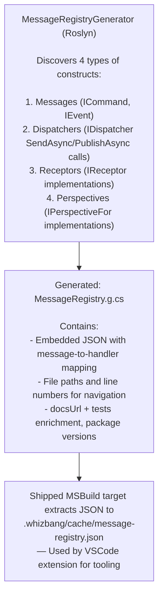

# Message Registry

The **MessageRegistryGenerator** discovers all messages, dispatchers, receptors, and perspectives at compile-time and generates a JSON registry file for the **Whizbang VSCode Extension**. This enables rich IDE features like CodeLens annotations, hover tooltips, and "Go to Handler" navigation.

## VSCode Extension Integration

### IDE Features Enabled

| Feature | Description | Example |
|---------|-------------|---------|
| **CodeLens** | Inline annotations showing handler counts | `CreateOrder` → 3 dispatchers, 1 receptor |
| **Hover Tooltip** | Rich markdown with handler locations | Mouse over message → see all handlers |
| **Go to Handler** | Navigate from message to implementation | Click CodeLens → jump to receptor |
| **Find References** | List all dispatchers for a message | Right-click → Find dispatchers |

**Visual Example**:
```csharp{title="IDE Features Enabled" description="Visual Example:" category="Internals" difficulty="BEGINNER" tags=["Extending", "Source-Generators", "IDE", "Features"]}
// In your code editor:
public record CreateOrder(Guid CustomerId, OrderItem[] Items) : ICommand;
             ↑↑↑↑↑↑↑↑↑↑↑
             [3 dispatchers] [1 receptor] [0 perspectives]  ← CodeLens

// Click [1 receptor] → Jump to OrderReceptor.HandleAsync()
```

---

## How It Works

### 1. Compile-Time Discovery



### 2. Generated File

**MessageRegistry.g.cs** (simplified):
```csharp{title="Generated File" description="**MessageRegistry." category="Internals" difficulty="ADVANCED" tags=["Extending", "Source-Generators", "Generated", "File"]}
// <auto-generated/>
// Generated by Whizbang.Generators.MessageRegistryGenerator
#nullable enable

namespace Whizbang.Generated;

/// <summary>
/// Auto-generated message registry containing metadata about all discovered messages,
/// dispatchers, receptors, and perspectives in the application.
/// </summary>
internal static class MessageRegistry {
  internal const string Json = @"{
  ""messages"": [
    {
      ""type"": ""MyApp.Commands.CreateOrder"",
      ""isCommand"": true,
      ""isEvent"": false,
      ""filePath"": ""src/Commands/CreateOrder.cs"",
      ""lineNumber"": 5,
      ""docsUrl"": """",
      ""tests"": [],
      ""dispatchers"": [
        {
          ""class"": ""MyApp.Controllers.OrderController"",
          ""method"": ""CreateAsync"",
          ""filePath"": ""src/Controllers/OrderController.cs"",
          ""lineNumber"": 42,
          ""docsUrl"": """",
          ""tests"": []
        }
      ],
      ""receptors"": [
        {
          ""class"": ""MyApp.Receptors.OrderReceptor"",
          ""method"": ""HandleAsync"",
          ""filePath"": ""src/Receptors/OrderReceptor.cs"",
          ""lineNumber"": 12,
          ""docsUrl"": """",
          ""tests"": []
        }
      ],
      ""perspectives"": []
    },
    {
      ""type"": ""MyApp.Events.OrderCreated"",
      ""isCommand"": false,
      ""isEvent"": true,
      ""filePath"": ""src/Events/OrderCreated.cs"",
      ""lineNumber"": 3,
      ""docsUrl"": """",
      ""tests"": [],
      ""dispatchers"": [],
      ""receptors"": [],
      ""perspectives"": [
        {
          ""class"": ""MyApp.Perspectives.OrderSummaryPerspective"",
          ""method"": ""Update"",
          ""filePath"": ""src/Perspectives/OrderSummaryPerspective.cs"",
          ""lineNumber"": 8,
          ""docsUrl"": """",
          ""tests"": []
        }
      ]
    }
  ],
  ""whizbangPackages"": [
    { ""id"": ""SoftwareExtravaganza.Whizbang.Core"", ""versionPrefix"": ""0.500.1"" }
  ]
}";
}
```

**Key Information**:
- Message type (fully qualified name)
- Message kind (command vs event)
- Definition location (file path + line number)
- All dispatchers calling this message
- All receptors handling this message
- All perspectives listening to this event
- `docsUrl`/`tests` enrichment (from the docs repo's `code-docs-map.json` / `code-tests-map.json` when found — WHIZ053/WHIZ054 report when they can't be loaded)
- `whizbangPackages`: referenced Whizbang assembly versions, so the extension can match NuGet folders by prefix

---

## Discovery Patterns

### Pattern 1: Message Discovery

Discovers **ICommand** and **IEvent** implementations:

```csharp{title="Pattern 1: Message Discovery" description="Discovers ICommand and IEvent implementations:" category="Internals" difficulty="INTERMEDIATE" tags=["Extending", "Source-Generators", "Pattern", "Message"]}
// Command
public record CreateOrder(
    Guid CustomerId,
    OrderItem[] Items
) : ICommand;  // ← Discovered

// Event
public record OrderCreated(
    Guid OrderId,
    Guid CustomerId,
    decimal Total,
    DateTimeOffset CreatedAt
) : IEvent;  // ← Discovered
```

**Generator finds**:
- Type name: `MyApp.Commands.CreateOrder`
- File: `src/Commands/CreateOrder.cs`
- Line: 5
- IsCommand: `true`
- IsEvent: `false`

---

### Pattern 2: Dispatcher Discovery

Discovers **SendAsync** and **PublishAsync** call sites — but only when the containing type **is or implements `Whizbang.Core.IDispatcher`**. Same-named methods on mocks (Rocks/Moq expectations) or unrelated wrappers are skipped:

```csharp{title="Pattern 2: Dispatcher Discovery" description="Discovers SendAsync and PublishAsync call sites:" category="Internals" difficulty="INTERMEDIATE" tags=["Extending", "Source-Generators", "Pattern", "Dispatcher"]}
public class OrderController : ControllerBase {
    private readonly IDispatcher _dispatcher;

    public async Task<IActionResult> CreateAsync(CreateOrderRequest request) {
        var command = new CreateOrder(request.CustomerId, request.Items);

        // ← Dispatcher call discovered
        var @event = await _dispatcher.SendAsync(command);

        return Ok(@event);
    }
}
```

**Generator finds**:
- Message type: `CreateOrder`
- Class: `OrderController`
- Method: `CreateAsync`
- File: `src/Controllers/OrderController.cs`
- Line: 42

**Also discovers PublishAsync**:
```csharp{title="Pattern 2: Dispatcher Discovery (2)" description="Also discovers PublishAsync:" category="Internals" difficulty="BEGINNER" tags=["Extending", "Source-Generators", "Pattern", "Dispatcher"]}
// Inside OrderReceptor
var @event = new OrderCreated(/* ... */);
await _dispatcher.PublishAsync(@event);  // ← Discovered
```

---

### Pattern 3: Receptor Discovery

Discovers **IReceptor<TMessage, TResponse>** implementations:

```csharp{title="Pattern 3: Receptor Discovery" description="Discovers IReceptor<TMessage, TResponse> implementations:" category="Internals" difficulty="BEGINNER" tags=["Extending", "Source-Generators", "Pattern", "Receptor"]}
public class OrderReceptor : IReceptor<CreateOrder, OrderCreated> {
    public async ValueTask<OrderCreated> HandleAsync(  // ← Method discovered
        CreateOrder message,
        CancellationToken ct = default) {

        // Business logic...
        return new OrderCreated(/* ... */);
    }
}
```

**Generator finds**:
- Message type: `CreateOrder`
- Class: `OrderReceptor`
- Method: `HandleAsync`
- File: `src/Receptors/OrderReceptor.cs`
- Line: 12 (HandleAsync method location)

---

### Pattern 4: Perspective Discovery

Discovers **IPerspectiveFor<TModel, TEvent...>** (and `IPerspectiveWithActionsFor`) implementations — event types are the type arguments after the model:

```csharp{title="Pattern 4: Perspective Discovery" description="Discovers IPerspectiveFor<TModel, TEvent...> implementations:" category="Internals" difficulty="INTERMEDIATE" tags=["Extending", "Source-Generators", "Pattern", "Perspective"]}
public class OrderSummaryPerspective :
    IPerspectiveFor<OrderSummary, OrderCreated, OrderShipped, OrderCancelled> {
    // ↑ Model first, then all discovered event types

    public OrderSummary Apply(OrderSummary currentData, OrderCreated eventData) { /* ... */ }
    public OrderSummary Apply(OrderSummary currentData, OrderShipped eventData) { /* ... */ }
    public OrderSummary Apply(OrderSummary currentData, OrderCancelled eventData) { /* ... */ }
}
```

**Generator finds**:
- Event types: `OrderCreated`, `OrderShipped`, `OrderCancelled`
- Class: `OrderSummaryPerspective`
- File: `src/Perspectives/OrderSummaryPerspective.cs`
- Line: 8 (class declaration)

**Result**: One perspective, three event type mappings.

---

## JSON Structure

### Complete Example

```json{title="Complete Example" description="Complete Example" category="Internals" difficulty="ADVANCED" tags=["Extending", "Source-Generators", "Complete", "Example"]}
{
  "messages": [
    {
      "type": "MyApp.Commands.CreateOrder",
      "isCommand": true,
      "isEvent": false,
      "filePath": "src/Commands/CreateOrder.cs",
      "lineNumber": 5,
      "docsUrl": "",
      "tests": [
        {
          "testFile": "tests/MyApp.Tests/CreateOrderTests.cs",
          "testMethod": "CreateOrder_Valid_SucceedsAsync",
          "testLine": 27,
          "testClass": "CreateOrderTests"
        }
      ],
      "dispatchers": [
        {
          "class": "MyApp.Controllers.OrderController",
          "method": "CreateAsync",
          "filePath": "src/Controllers/OrderController.cs",
          "lineNumber": 42,
          "docsUrl": "",
          "tests": []
        }
      ],
      "receptors": [
        {
          "class": "MyApp.Receptors.OrderReceptor",
          "method": "HandleAsync",
          "filePath": "src/Receptors/OrderReceptor.cs",
          "lineNumber": 12,
          "docsUrl": "",
          "tests": []
        }
      ],
      "perspectives": []
    },
    {
      "type": "MyApp.Events.OrderCreated",
      "isCommand": false,
      "isEvent": true,
      "filePath": "src/Events/OrderCreated.cs",
      "lineNumber": 3,
      "docsUrl": "",
      "tests": [],
      "dispatchers": [],
      "receptors": [],
      "perspectives": [
        {
          "class": "MyApp.Perspectives.OrderSummaryPerspective",
          "method": "Update",
          "filePath": "src/Perspectives/OrderSummaryPerspective.cs",
          "lineNumber": 8,
          "docsUrl": "",
          "tests": []
        }
      ]
    }
  ],
  "whizbangPackages": [
    { "id": "SoftwareExtravaganza.Whizbang.Core", "versionPrefix": "0.500.1" }
  ]
}
```

### Field Descriptions

| Field | Type | Description |
|-------|------|-------------|
| `type` | string | Fully qualified message type name |
| `isCommand` | boolean | True if implements ICommand (inferred from receptors for referenced-assembly messages) |
| `isEvent` | boolean | True if implements IEvent (inferred from perspectives/dispatchers for referenced-assembly messages) |
| `filePath` | string | Source path (empty for messages defined in referenced assemblies) |
| `lineNumber` | number | Line number (1-based; 0 for referenced-assembly messages) |
| `docsUrl` | string | Documentation URL enriched from `code-docs-map.json` (empty if unavailable) |
| `tests` | array | Linked tests enriched from `code-tests-map.json` (`testFile`, `testMethod`, `testLine`, `testClass`) |
| `dispatchers` | array | All `IDispatcher` SendAsync/PublishAsync call sites (`class`, `method`, `filePath`, `lineNumber`, `docsUrl`, `tests`) |
| `receptors` | array | All IReceptor implementations (same entry shape) |
| `perspectives` | array | All IPerspectiveFor implementations (`method` is always `"Update"`) |
| `whizbangPackages` | array | Referenced Whizbang assemblies (`id` = `SoftwareExtravaganza.*` package id, `versionPrefix` = `Major.Minor.Build`) |

---

## VSCode Extension Usage

### Installing the Extension

```bash{title="Installing the Extension" description="Installing the Extension" category="Internals" difficulty="BEGINNER" tags=["Extending", "Source-Generators", "Installing", "Extension"]}
# From VSCode Extensions panel:
# Search: "Whizbang"
# Install: Whizbang Message Flow Visualizer

# Or from command line:
code --install-extension whizbang.whizbang-vscode
```

### Extension Features

#### 1. CodeLens Annotations

Inline annotations above message types:

```csharp{title="CodeLens Annotations" description="Inline annotations above message types:" category="Internals" difficulty="BEGINNER" tags=["Extending", "Source-Generators", "CodeLens", "Annotations"]}
// [3 dispatchers] [1 receptor] [0 perspectives]
public record CreateOrder(Guid CustomerId, OrderItem[] Items) : ICommand;
```

**Click counts** to navigate:
- `[3 dispatchers]` → List of dispatcher locations
- `[1 receptor]` → Jump to receptor HandleAsync
- `[0 perspectives]` → No perspectives for this command

#### 2. Hover Tooltips

Rich markdown tooltips on hover:

```
CreateOrder

Type: Command
Handlers: 1 receptor

Dispatchers (3):
  • OrderController.CreateAsync (Controllers/OrderController.cs:42)
  • OrderSaga.ProcessAsync (Sagas/OrderSaga.cs:18)
  • OrderScheduler.ScheduleAsync (Schedulers/OrderScheduler.cs:105)

Receptors (1):
  • OrderReceptor.HandleAsync (Receptors/OrderReceptor.cs:12)
    Returns: OrderCreated
```

#### 3. Go to Handler Command

Right-click message → **"Go to Whizbang Handler"**:

```
Jump to:
  • OrderReceptor.HandleAsync (Receptors/OrderReceptor.cs:12)
```

#### 4. Message Flow Visualization

Command palette → **"Whizbang: Show Message Flow"**:

```
CreateOrder
  ├─ Dispatcher: OrderController.CreateAsync
  │   └─ Receptor: OrderReceptor.HandleAsync
  │       └─ Publishes: OrderCreated
  │           ├─ Perspective: OrderSummaryPerspective
  │           └─ Perspective: CustomerStatisticsPerspective
  └─ Dispatcher: OrderSaga.ProcessAsync
      └─ (Remote via Outbox)
```

---

## Build Integration

### Shipped MSBuild Targets (No Custom Setup Needed)

The `SoftwareExtravaganza.Whizbang.Generators` NuGet package ships `.props`/`.targets` files that automate the whole flow — you do **not** write your own target or extraction script:

- **`SoftwareExtravaganza.Whizbang.Generators.props`** defaults `WhizbangEmitMessageRegistry` to `true`, enables `EmitCompilerGeneratedFiles`, and points `CompilerGeneratedFilesOutputPath` at `$(MSBuildProjectDirectory)/.whizbang/cache` (unless you've set these yourself).
- **`SoftwareExtravaganza.Whizbang.Generators.targets`** defines the `WhizbangExtractMessageRegistry` target (`AfterTargets="Build"`), which extracts the embedded JSON from `MessageRegistry.g.cs` and writes it to **`.whizbang/cache/message-registry.json`** — skipping the write when the content hash is unchanged, to avoid file-watcher churn.

```xml{title="Opting Out" description="Consumers can opt out per project" category="Internals" difficulty="BEGINNER" tags=["Extending", "Source-Generators", "MSBuild", "Target"]}
<!-- MyApp.csproj — only needed to OPT OUT -->
<PropertyGroup>
  <WhizbangEmitMessageRegistry>false</WhizbangEmitMessageRegistry>
</PropertyGroup>
```

**Run a build**:
```bash{title="Build Writes the Registry" description="Run after build:" category="Internals" difficulty="BEGINNER" tags=["Extending", "Source-Generators", "Extract", "JSON"]}
dotnet build
# Writes .whizbang/cache/message-registry.json automatically
```

### The .whizbang/ Folder Convention

- **`.whizbang/cache/`** — regenerable artifacts (generated `.cs`, `message-registry.json`); add `**/.whizbang/cache/` to `.gitignore`
- **`.whizbang/` root** — committed files (e.g., `pinned-type-ledger.json`, the folder README); commit these

---

## Generator Performance

### Multi-Pipeline Architecture

Generator uses **4 independent pipelines** for optimal caching:

```csharp{title="Multi-Pipeline Architecture" description="Generator uses 4 independent pipelines for optimal caching:" category="Internals" difficulty="INTERMEDIATE" tags=["Extending", "Source-Generators", "Multi-Pipeline", "Architecture"]}
// Pipeline 1: Messages
var messageTypes = context.SyntaxProvider.CreateSyntaxProvider(
    predicate: static (node, _) => node is RecordDeclarationSyntax { BaseList.Types.Count: > 0 },
    transform: static (ctx, ct) => ExtractMessageType(ctx, ct)
);

// Pipeline 2: Dispatchers
var dispatchers = context.SyntaxProvider.CreateSyntaxProvider(
    predicate: static (node, _) => node is InvocationExpressionSyntax { ... },
    transform: static (ctx, ct) => ExtractDispatcher(ctx, ct)
);

// Pipeline 3: Receptors
var receptors = context.SyntaxProvider.CreateSyntaxProvider(
    predicate: static (node, _) => node is ClassDeclarationSyntax { BaseList.Types.Count: > 0 },
    transform: static (ctx, ct) => ExtractReceptor(ctx, ct)
);

// Pipeline 4: Perspectives
var perspectives = context.SyntaxProvider.CreateSyntaxProvider(
    predicate: static (node, _) => node is ClassDeclarationSyntax { BaseList.Types.Count: > 0 },
    transform: static (ctx, ct) => ExtractPerspective(ctx, ct)
);

// Combine at the end
var allData = messageTypes.Collect()
    .Combine(dispatchers.Collect())
    .Combine(receptors.Collect())
    .Combine(perspectives.Collect());
```

**Why 4 pipelines?**
- **Independent caching**: Changing a dispatcher doesn't invalidate message cache
- **Optimized predicates**: Each pipeline filters for its specific construct
- **Parallel execution**: Roslyn runs pipelines concurrently

### Performance Characteristics

| Phase | First compilation (100 messages, 200 handlers) | Incremental compilation (change 1 receptor) |
|-------|-----------------------------------------------|---------------------------------------------|
| Message discovery | 30ms | 0ms (cache, unchanged) |
| Dispatcher discovery | 40ms | 0ms (cache, unchanged) |
| Receptor discovery | 20ms | 20ms (changed) |
| Perspective discovery | 15ms | 0ms (cache, unchanged) |
| JSON generation | 5ms | 5ms |
| **Total** | **110ms** | **25ms (85ms saved!)** |

---

## Cross-Assembly Messages

Generator handles messages **from referenced assemblies**:

```csharp{title="Cross-Assembly Messages" description="Generator handles messages from referenced assemblies:" category="Internals" difficulty="BEGINNER" tags=["Extending", "Source-Generators", "Cross-Assembly", "Messages"]}
// In Whizbang.Core (referenced assembly)
public interface ICommand { }

// In MyApp (your project)
public record CreateOrder(Guid CustomerId) : ICommand;  // ← Discovered

// Also in MyApp
public class OrderReceptor : IReceptor<CreateOrder, OrderCreated> {
    // ← Receptor discovered, links to CreateOrder
}
```

**Result**: CreateOrder appears in registry even though `ICommand` is external.

**External Messages**:
```csharp{title="Cross-Assembly Messages - CustomerCreated" description="External Messages:" category="Internals" difficulty="BEGINNER" tags=["Extending", "Source-Generators", "Cross-Assembly", "Messages"]}
// In SharedMessages (referenced assembly)
public record CustomerCreated([property: StreamId] Guid CustomerId) : IEvent;

// In MyApp
public class CustomerStatsPerspective : IPerspectiveFor<CustomerStats, CustomerCreated> {
    // ← Perspective discovered, links to CustomerCreated
    public CustomerStats Apply(CustomerStats currentData, CustomerCreated eventData) { /* ... */ }
}
```

**JSON output** (message kind inferred from usage; empty location):
```json{title="Cross-Assembly Messages (3)" description="JSON output:" category="Internals" difficulty="INTERMEDIATE" tags=["Extending", "Source-Generators", "Cross-Assembly", "Messages"]}
{
  "type": "SharedMessages.CustomerCreated",
  "isCommand": false,
  "isEvent": true,
  "filePath": "",
  "lineNumber": 0,
  "docsUrl": "",
  "tests": [],
  "dispatchers": [],
  "receptors": [],
  "perspectives": [
    {
      "class": "MyApp.Perspectives.CustomerStatsPerspective",
      "method": "Update",
      "filePath": "src/Perspectives/CustomerStatsPerspective.cs",
      "lineNumber": 8,
      "docsUrl": "",
      "tests": []
    }
  ]
}
```

**Benefit**: Complete message flow visualization across assemblies.

---

## Debugging

### View Generated File

```
obj/Debug/net10.0/generated/Whizbang.Generators/MessageRegistryGenerator/
└── MessageRegistry.g.cs
```

Or configured output:
```xml{title="View Generated File" description="Or configured output:" category="Internals" difficulty="BEGINNER" tags=["Extending", "Source-Generators", "View", "Generated"]}
<PropertyGroup>
  <EmitCompilerGeneratedFiles>true</EmitCompilerGeneratedFiles>
  <CompilerGeneratedFilesOutputPath>.whizbang/cache</CompilerGeneratedFilesOutputPath>
</PropertyGroup>
```

### Validate JSON

```bash{title="Validate JSON" description="Validate JSON" category="Internals" difficulty="INTERMEDIATE" tags=["Extending", "Source-Generators", "Validate", "JSON"]}
# Extract JSON from generated file
dotnet run --project tools/extract-message-registry.csproj

# Validate JSON
cat .whizbang/cache/message-registry.json | jq .

# Output:
{
  "messages": [
    {
      "type": "MyApp.Commands.CreateOrder",
      "isCommand": true,
      ...
    }
  ]
}
```

### VSCode Extension Logs

View extension logs:
1. **View** → **Output**
2. Select **"Whizbang"** from dropdown
3. See message registry loading and parsing

```
[Whizbang] Loading message registry from .whizbang/cache/message-registry.json
[Whizbang] Found 15 messages
[Whizbang] Registered 42 CodeLens providers
[Whizbang] Registry loaded successfully
```

---

## Best Practices

### DO ✅

- ✅ **Use ICommand and IEvent** markers for all messages
- ✅ **Keep messages in dedicated folders** (Commands/, Events/)
- ✅ **Use descriptive names** (CreateOrder, not Order1)
- ✅ **Commit .whizbang/cache/message-registry.json** to source control (helps team)
- ✅ **Rebuild after adding new messages** (F5 in VSCode to reload extension)

### DON'T ❌

- ❌ Modify MessageRegistry.g.cs manually (regenerated on build)
- ❌ Use abstract message types (can't be instantiated)
- ❌ Mix commands and events (implement one interface only)
- ❌ Delete .whizbang/ folder (VSCode extension needs it)

---

## Troubleshooting

### Problem: CodeLens Not Showing

**Symptoms**: No `[X dispatchers]` annotations above messages.

**Causes**:
1. Extension not installed
2. Message registry not generated
3. Extension not loaded

**Solution**:
```bash{title="Problem: CodeLens Not Showing" description="Problem: CodeLens Not Showing" category="Internals" difficulty="BEGINNER" tags=["Extending", "Source-Generators", "Problem:", "CodeLens"]}
# 1. Verify extension installed
code --list-extensions | grep whizbang

# 2. Rebuild project (generates registry)
dotnet build

# 3. Check .whizbang/cache/message-registry.json exists
ls -la .whizbang/

# 4. Reload VSCode window
Ctrl+Shift+P → "Developer: Reload Window"
```

### Problem: Wrong Handler Count

**Symptoms**: CodeLens shows `[1 receptor]` but you have 2 receptors.

**Causes**:
1. Stale message-registry.json
2. Receptor not discovered (missing IReceptor interface)

**Solution**:
```bash{title="Problem: Wrong Handler Count" description="Problem: Wrong Handler Count" category="Internals" difficulty="BEGINNER" tags=["Extending", "Source-Generators", "Problem:", "Wrong"]}
# Clean and rebuild
dotnet clean && dotnet build

# Check generated file
cat .whizbang/cache/message-registry.json | jq '.messages[] | select(.type == "MyApp.Commands.CreateOrder")'

# Verify receptor implements interface correctly
public class OrderReceptor : IReceptor<CreateOrder, OrderCreated> {
    // Must have HandleAsync method
}
```

### Problem: External Messages Not Found

**Symptoms**: Messages from referenced assemblies don't appear in registry.

**Causes**:
1. Message not used in any dispatcher/receptor/perspective
2. Assembly reference missing

**Solution**: Generator only includes messages that are actually **used** in the project. If you want external messages in registry, add at least one handler:

```csharp{title="Problem: External Messages Not Found" description="Solution: Generator only includes messages that are actually used in the project." category="Internals" difficulty="BEGINNER" tags=["Extending", "Source-Generators", "Problem:", "External"]}
// Add a perspective for external event
public class ExternalEventPerspective : IPerspectiveOf<SharedMessages.CustomerCreated> {
    public async Task UpdateAsync(CustomerCreated @event, CancellationToken ct) {
        // Now CustomerCreated appears in registry!
    }
}
```

---

## Further Reading

**Source Generators**:
- [Receptor Discovery](receptor-discovery.md) - Compile-time receptor discovery
- [Perspective Discovery](perspective-discovery.md) - Compile-time perspective discovery
- [Aggregate IDs](aggregate-ids.md) - UUIDv7 generation for identity value objects
- [JSON Contexts](json-contexts.md) - AOT-compatible JSON serialization

**Core Concepts**:
- [Dispatcher](../../fundamentals/dispatcher/dispatcher.md) - Message routing patterns
- [Receptors](../../fundamentals/receptors/receptors.md) - Message handlers
- [Perspectives](../../fundamentals/perspectives/perspectives.md) - Event-driven read models

**Tools**:
- VSCode Extension - IDE integration features

---

*Version 1.0.0 - Foundation Release | Last Updated: 2024-12-12*
