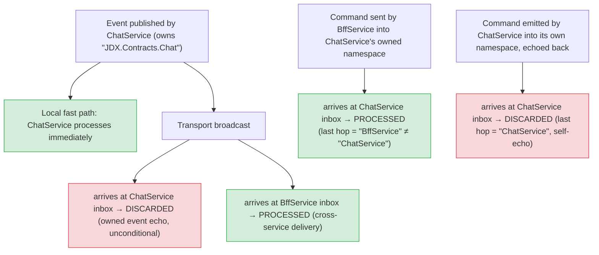

# Namespace-Based Routing

Whizbang uses namespace-based routing to determine where messages flow. Commands and events follow distinct routing patterns optimized for their specific use cases.

## Overview {#routing-options}

Routing in Whizbang is built on two key principles:

1. **Commands → Shared Inbox**: All commands route to a single shared "inbox" topic. Services filter by owned namespaces using routing key patterns.
2. **Events → Namespace Topics**: Events publish to namespace-specific topics. Services subscribe directly to namespaces they care about.

This separation provides:
- **Point-to-point delivery** for commands (exactly one handler)
- **Pub/sub distribution** for events (multiple subscribers)
- **Automatic subscription discovery** via source generation

## Command Flow {#inbox-routing}

Commands follow a point-to-point pattern with namespace-based filtering:

```
BFF sends CreateTenantCommand (namespace: MyApp.Users.Commands)
    ↓
BFF Outbox → Broker "inbox" topic
    ↓
    RoutingKey: "myapp.users.commands.createtenantcommand"
    ↓
ALL services subscribed to "inbox" (single shared topic)
    ↓
Each service filters by owned namespaces:
    - User Service owns "myapp.users.commands" → RECEIVES
    - Workflow Service owns "myapp.workflow.commands" → FILTERED OUT
    ↓
User Service processes command
```

### How Command Filtering Works {#own-namespace-of}

When a service starts, it declares which command namespaces it owns:

```csharp{title="How Command Filtering Works" description="When a service starts, it declares which command namespaces it owns:" category="Architecture" difficulty="BEGINNER" tags=["Fundamentals", "Dispatcher", "Command", "Filtering"]}
services.Configure<RoutingOptions>(opts => {
  opts.OwnDomains("myapp.users.commands");
  opts.OwnDomains("myapp.inventory.commands");
});
```

The `SharedTopicInboxStrategy` builds routing patterns from these namespaces:

```csharp{title="How Command Filtering Works (2)" description="The SharedTopicInboxStrategy builds routing patterns from these namespaces:" category="Architecture" difficulty="BEGINNER" tags=["Fundamentals", "Dispatcher", "Command", "Filtering"]}
// Generated routing patterns:
// - "whizbang.core.commands.system.#"  (always included)
// - "myapp.users.commands.#"
// - "myapp.inventory.commands.#"
```

**Note**: All services automatically subscribe to system commands (`whizbang.core.commands.system.#`) for framework-level operations.

### Wildcard Namespaces

Support pattern matching for flexible ownership:

```csharp{title="Wildcard Namespaces" description="Support pattern matching for flexible ownership:" category="Architecture" difficulty="BEGINNER" tags=["Fundamentals", "Dispatcher", "Wildcard", "Namespaces"]}
// Own all commands under myapp.orders
opts.OwnDomains("myapp.orders.*");
// Converts to pattern: "myapp.orders.#"
```

## Event Flow {#outbox-routing}

Events follow a pub/sub pattern with namespace-based topics:

```
User Service publishes TenantCreatedEvent (namespace: MyApp.Users.Events)
    ↓
User Service Outbox → Broker topic "myapp.users.events"
    ↓
    RoutingKey: "tenantcreatedevent"
    ↓
Services subscribed to "myapp.users.events":
    - BFF → RECEIVES
    - Workflow Service → RECEIVES
    - Notifications Service → RECEIVES
```

### Automatic Event Subscription Discovery {#event-subscription-discovery}

Event subscriptions are **automatically discovered** from your code via source generation:

1. **Perspectives**: Events your service projects
2. **Receptors**: Events your service handles

```csharp{title="Automatic Event Subscription Discovery" description="Automatic Event Subscription Discovery" category="Architecture" difficulty="INTERMEDIATE" tags=["Fundamentals", "Dispatcher", "Automatic", "Event"]}
// This perspective automatically subscribes to "myapp.orders.events"
public class OrderSummaryPerspective : IPerspectiveFor<OrderSummary, OrderCreatedEvent> {
  // OrderCreatedEvent is in namespace MyApp.Orders.Events
  public OrderSummary Apply(OrderSummary currentData, OrderCreatedEvent eventData) => /* ... */;
}

// This receptor automatically subscribes to "myapp.payments.events"
public class PaymentReceptor : IReceptor<PaymentCompletedEvent> {
  // PaymentCompletedEvent is in namespace MyApp.Payments.Events
}
```

The `EventNamespaceRegistryGenerator` source generator extracts these namespaces at compile time. It emits an `IEventNamespaceSource` per assembly and registers it with the static `EventNamespaceRegistry` {#event-namespace-registry}:

```csharp{title="Automatic Event Subscription Discovery -" description="The EventNamespaceRegistryGenerator source generator extracts these namespaces at compile time." category="Architecture" difficulty="INTERMEDIATE" tags=["Fundamentals", "Dispatcher", "Automatic", "Event"]}
// Generated code (example)
internal sealed class EventNamespaceSource : IEventNamespaceSource {
  public IReadOnlySet<string> GetPerspectiveEventNamespaces() =>
    new HashSet<string>(StringComparer.OrdinalIgnoreCase) {
      "myapp.orders.events"
    };

  public IReadOnlySet<string> GetReceptorEventNamespaces() =>
    new HashSet<string>(StringComparer.OrdinalIgnoreCase) {
      "myapp.payments.events"
    };
}
```

### Manual Event Subscriptions {#subscribe-to-namespace-of}

Override or supplement auto-discovery with manual subscriptions:

```csharp{title="Manual Event Subscriptions" description="Override or supplement auto-discovery with manual subscriptions:" category="Architecture" difficulty="BEGINNER" tags=["Fundamentals", "Dispatcher", "Manual", "Event"]}
services.Configure<RoutingOptions>(opts => {
  // Explicitly subscribe to additional event namespaces
  opts.SubscribeTo("myapp.notifications.events");
  opts.SubscribeTo("myapp.audit.events");
});
```

## System Commands

All services automatically subscribe to system commands (`whizbang.core.commands.system.#`) for framework-level operations. These include commands for pausing/resuming processing, rebuilding perspectives, clearing caches, and collecting diagnostics.

For the full list of system commands with signatures, parameters, and usage examples, see [Lifecycle Management](../lifecycle/lifecycle.md).

### Sending System Commands

```csharp{title="Sending System Commands" description="Sending System Commands" category="Architecture" difficulty="INTERMEDIATE" tags=["Fundamentals", "Dispatcher", "Sending", "System"]}
// Rebuild a specific perspective across all services
await dispatcher.SendAsync(new RebuildPerspectiveCommand(
    PerspectiveNames: ["OrderSummary"]));

// Cancel an in-progress rebuild
await dispatcher.SendAsync(new CancelPerspectiveRebuildCommand("OrderSummary"));

// Clear all caches
await dispatcher.SendAsync(new ClearCacheCommand());

// Pause processing for 5 minutes
await dispatcher.SendAsync(new PauseProcessingCommand(
    DurationSeconds: 300,
    Reason: "Scheduled maintenance"
));
```

## Configuration

### Fluent Configuration with WithRouting {#with-routing}

The recommended approach uses the fluent `WithRouting()` extension method:

```csharp{title="Fluent Configuration with WithRouting" description="The recommended approach uses the fluent WithRouting() extension method:" category="Architecture" difficulty="BEGINNER" tags=["Fundamentals", "Dispatcher", "Fluent", "Configuration"]}
services.AddWhizbang()
    .WithRouting(routing => {
        routing
            .OwnDomains("myapp.users.commands")
            .SubscribeTo("myapp.notifications.events")
            .Inbox.UseSharedTopic("inbox");
    })
    .WithEFCore<MyDbContext>()
    .WithDriver.Postgres
    .AddTransportConsumer();  // Auto-generates subscriptions!
```

This approach:
- **Chains with other Whizbang configuration** - Integrates with EF Core, drivers, and transport setup
- **Auto-generates subscriptions** - When paired with `AddTransportConsumer()`, subscriptions are created automatically
- **Type-safe** - All configuration is compile-time verified

### Complete Example

```csharp{title="Complete Example" description="Complete Example" category="Architecture" difficulty="INTERMEDIATE" tags=["Fundamentals", "Dispatcher", "Complete", "Example"]}
// User Service - handles user commands, subscribes to order events
services.AddWhizbang()
    .WithRouting(routing => {
        // Commands this service handles
        routing.OwnDomains("myapp.users.commands");

        // Events are auto-discovered from perspectives/receptors
        // Manual override (adds to auto-discovered):
        routing.SubscribeTo("myapp.notifications.events");

        // Inbox strategy
        routing.Inbox.UseSharedTopic("inbox");
    })
    .AddTransportConsumer();

// BFF Service - sends commands, receives events
services.AddWhizbang()
    .WithRouting(routing => {
        // No OwnDomains (BFF doesn't handle commands directly)
        // Events auto-discovered from its receptors/perspectives
        routing.Inbox.UseSharedTopic("inbox");
    })
    .AddTransportConsumer();
```

### Legacy Configuration

For backwards compatibility, you can still configure routing options directly:

```csharp{title="Legacy Configuration" description="For backwards compatibility, you can still configure routing options directly:" category="Architecture" difficulty="BEGINNER" tags=["Fundamentals", "Dispatcher", "Legacy", "Configuration"]}
services.Configure<RoutingOptions>(opts => {
  opts.OwnDomains("myapp.users.commands");
  opts.SubscribeTo("myapp.notifications.events");
});
```

### Strongly-Typed Configuration

Use the generic overloads for compile-time safety and refactor-friendly configuration:

```csharp{title="Strongly-Typed Configuration" description="Use the generic overloads for compile-time safety and refactor-friendly configuration:" category="Architecture" difficulty="INTERMEDIATE" tags=["Fundamentals", "Dispatcher", "Strongly-Typed", "Configuration"]}
services.Configure<RoutingOptions>(opts => {
  // Strongly-typed: extracts namespace from the type
  opts.OwnNamespaceOf<CreateUserCommand>()      // "myapp.users.commands"
      .OwnNamespaceOf<UpdateInventoryCommand>() // "myapp.inventory.commands"
      .SubscribeToNamespaceOf<OrderCreatedEvent>()   // "myapp.orders.events"
      .SubscribeToNamespaceOf<PaymentCompletedEvent>(); // "myapp.payments.events"

  // Can mix with string-based for wildcards
  opts.OwnDomains("myapp.legacy.*");
});
```

**Benefits:**
- **Compile-time safety** - Invalid types won't compile
- **Refactor-friendly** - Rename/move types automatically updates references
- **IDE navigation** - Ctrl+click to go to type definition
- **No magic strings** - For known namespaces

### Inbox Strategies {#inbox-subscription}

Two inbox routing strategies are available:

#### SharedTopicInboxStrategy (Default) {#shared-topic-inbox}

All commands go to a single "inbox" topic with namespace-based filtering:

```csharp{title="SharedTopicInboxStrategy (Default)" description="All commands go to a single 'inbox' topic with namespace-based filtering:" category="Architecture" difficulty="BEGINNER" tags=["Fundamentals", "Dispatcher", "SharedTopicInboxStrategy", "Default"]}
services.Configure<RoutingOptions>(opts => {
  opts.Inbox.UseSharedTopic("inbox");  // Default strategy; no-arg default topic is "whizbang.inbox"
});
```

#### DomainTopicInboxStrategy {#domain-topic-inbox}

Each domain gets its own inbox topic:

```csharp{title="DomainTopicInboxStrategy" description="Each domain gets its own inbox topic:" category="Architecture" difficulty="BEGINNER" tags=["Fundamentals", "Dispatcher", "DomainTopicInboxStrategy", "Domain-topic-inbox"]}
services.Configure<RoutingOptions>(opts => {
  opts.Inbox.UseDomainTopics(".in");
  // Creates topics: "myapp.users.in", "myapp.orders.in", etc.
});
```

## Event Namespace Registry {#event-namespace-registry}

The `IEventNamespaceRegistry` is a zero-reflection, AOT-compatible interface that provides access to event namespaces discovered from perspectives and receptors at compile time.

### How It Works

The source generator (`EventNamespaceRegistryGenerator`) scans your assembly for:
- **Perspectives**: Types implementing `IPerspectiveFor<TModel, TEvent1, ...>`
- **Receptors**: Types implementing `IReceptor<TEvent>` (and `IReceptor<TEvent, TResponse>`) where `TEvent : IEvent`

It extracts the namespaces of all event types into a per-assembly `IEventNamespaceSource`. The `IEventNamespaceRegistry` interface aggregates those sources:

```csharp{title="How It Works" description="The IEventNamespaceRegistry interface aggregating per-assembly namespace sources" category="Architecture" difficulty="INTERMEDIATE" tags=["Fundamentals", "Dispatcher", "Works"]}
public interface IEventNamespaceRegistry {
    IReadOnlySet<string> GetPerspectiveEventNamespaces();
    IReadOnlySet<string> GetReceptorEventNamespaces();
    IReadOnlySet<string> GetAllEventNamespaces();
}
```

### Usage

Discovered namespaces are used internally by `EventSubscriptionDiscovery` to determine which event namespaces your service should subscribe to. For diagnostics, read the static `EventNamespaceRegistry` (each assembly's generated source self-registers via a `[ModuleInitializer]`):

```csharp{title="Usage" description="Reading discovered event namespaces from the static EventNamespaceRegistry" category="Architecture" difficulty="INTERMEDIATE" tags=["Fundamentals", "Dispatcher", "Usage"]}
// Typically not needed directly — EventSubscriptionDiscovery consumes this for you
public class MyService {
    public void LogSubscriptions() {
        var namespaces = EventNamespaceRegistry.GetAllNamespaces();
        foreach (var ns in namespaces) {
            Console.WriteLine($"Subscribing to: {ns}");
        }
    }
}
```

**Benefits:**
- **Zero reflection** - All namespace discovery happens at compile time
- **AOT compatible** - Works with Native AOT compilation
- **Type safe** - Compiler catches missing or renamed event types
- **Fast startup** - No runtime reflection or assembly scanning

## Transport Subscription Builder {#transport-subscription-builder}

The `TransportSubscriptionBuilder` combines inbox (command) and event subscriptions into transport destinations for broker configuration.

### Overview

This builder integrates three key components:
1. **InboxRoutingStrategy**: Determines command subscription (topic + filter)
2. **EventSubscriptionDiscovery**: Discovers event namespaces from perspectives/receptors
3. **RoutingOptions**: Contains manual subscriptions and owned domains

### Creating the Builder

```csharp{title="Creating the Builder" description="Creating the Builder" category="Architecture" difficulty="BEGINNER" tags=["Fundamentals", "Dispatcher", "Creating", "Builder"]}
var builder = new TransportSubscriptionBuilder(
    routingOptions: serviceProvider.GetRequiredService<IOptions<RoutingOptions>>(),
    discovery: serviceProvider.GetRequiredService<EventSubscriptionDiscovery>(),
    serviceName: "OrderService"
);
```

### Building Destinations

```csharp{title="Building Destinations" description="Building Destinations" category="Architecture" difficulty="BEGINNER" tags=["Fundamentals", "Dispatcher", "Building", "Destinations"]}
// Build all destinations (inbox + events)
var destinations = builder.BuildDestinations();

// Or build separately
var inboxDestination = builder.BuildInboxDestination();
var eventDestinations = builder.BuildEventDestinations();
```

### Destination Structure

Each destination contains:

```csharp{title="Destination Structure" description="Each destination contains:" category="Architecture" difficulty="BEGINNER" tags=["Fundamentals", "Dispatcher", "Destination", "Structure"]}
public record TransportDestination(
    string Address,                                          // Topic/queue name (e.g., "inbox", "myapp.orders.events")
    string? RoutingKey = null,                               // Routing key pattern (e.g., "#", "myapp.users.commands.#")
    IReadOnlyDictionary<string, JsonElement>? Metadata = null
);
```

**Metadata fields:**
- `SubscriberName`: Service name for deterministic queue naming
- `RoutingPatterns`: (RabbitMQ) Array of routing key patterns for filtering

### Example Destinations

For a User Service that handles user commands and subscribes to order events:

```csharp{title="Example Destinations" description="For a User Service that handles user commands and subscribes to order events:" category="Architecture" difficulty="INTERMEDIATE" tags=["Fundamentals", "Dispatcher", "Example", "Destinations"]}
// Inbox destination (commands)
new TransportDestination(
    Address: "inbox",
    RoutingKey: "#",  // Subscribe to all messages in topic
    Metadata: new Dictionary<string, JsonElement> {
        ["SubscriberName"] = JsonElement("UserService"),
        ["RoutingPatterns"] = JsonElement(["myapp.users.commands.#"])
    }
);

// Event destination (orders)
new TransportDestination(
    Address: "myapp.orders.events",
    RoutingKey: "#",  // Subscribe to all messages in namespace
    Metadata: new Dictionary<string, JsonElement> {
        ["SubscriberName"] = JsonElement("UserService")
    }
);
```

### Automatic Configuration

When using `AddTransportConsumer()`, the builder is used automatically:

```csharp{title="Automatic Configuration" description="When using AddTransportConsumer(), the builder is used automatically:" category="Architecture" difficulty="BEGINNER" tags=["Fundamentals", "Dispatcher", "Automatic", "Configuration"]}
services.AddWhizbang()
    .WithRouting(routing => {
        routing.OwnDomains("myapp.users.commands");
    })
    .AddTransportConsumer();  // Uses TransportSubscriptionBuilder internally
```

## Shared Topic Inbox {#shared-topic-inbox}

The `SharedTopicInboxStrategy` routes all commands to a single shared "inbox" topic, with each service filtering by owned namespaces.

### How It Works

1. **All services subscribe to the same inbox topic** (e.g., "inbox")
2. **Commands are published with namespace-based routing keys** (e.g., "myapp.users.commands.createtenantcommand")
3. **Each service filters messages by owned namespaces** using broker-side routing patterns

### Configuration

```csharp{title="Configuration" description="Configuration" category="Architecture" difficulty="BEGINNER" tags=["Fundamentals", "Dispatcher", "Configuration"]}
services.Configure<RoutingOptions>(opts => {
    opts.OwnDomains("myapp.users.commands");
    opts.Inbox.UseSharedTopic("inbox");  // Default strategy; no-arg default topic is "whizbang.inbox"
});
```

### Routing Patterns

The strategy generates routing patterns from owned namespaces:

```csharp{title="Routing Patterns" description="The strategy generates routing patterns from owned namespaces:" category="Architecture" difficulty="BEGINNER" tags=["Fundamentals", "Dispatcher", "Routing", "Patterns"]}
// Owned namespaces:
opts.OwnDomains("myapp.users.commands", "myapp.inventory.commands");

// Generated routing patterns:
// - "whizbang.core.commands.system.#"  (always included for system commands)
// - "myapp.users.commands.#"
// - "myapp.inventory.commands.#"
```

### Benefits

- **Simple topology** - Only one inbox topic/exchange for all commands
- **Broker-side filtering** - No application-level filtering needed
- **Automatic system commands** - All services receive framework commands

### Broker Implementation

**RabbitMQ:**
```
Exchange: inbox (topic)
  Binding: myapp.users.commands.# → queue: user-service-inbox
  Binding: myapp.inventory.commands.# → queue: inventory-service-inbox
  Binding: whizbang.core.commands.system.# → all service queues
```

**Azure Service Bus:**
```
Topic: inbox
  Subscription: user-service (filter: RoutingKey LIKE 'myapp.users.commands.%')
  Subscription: inventory-service (filter: RoutingKey LIKE 'myapp.inventory.commands.%')
```

## Shared Topic Outbox {#shared-topic-outbox}

The `SharedTopicOutboxStrategy` publishes events to namespace-specific topics, allowing multiple services to subscribe.

### How It Works

1. **Events are published to their namespace topic** (e.g., "myapp.orders.events")
2. **Routing key is the event type name** (e.g., "ordercreatedevent")
3. **Services subscribe directly to namespace topics** they care about

### Configuration

```csharp{title="Configuration (2)" description="Configuration" category="Architecture" difficulty="BEGINNER" tags=["Fundamentals", "Dispatcher", "Configuration"]}
services.Configure<RoutingOptions>(opts => {
    opts.Outbox.UseSharedTopic("inbox");  // Commands → shared inbox topic; events → namespace topics
});
```

### Publishing Flow

```csharp{title="Publishing Flow" description="Publishing Flow" category="Architecture" difficulty="BEGINNER" tags=["Fundamentals", "Dispatcher", "Publishing", "Flow"]}
// Event: OrderCreatedEvent (namespace: MyApp.Orders.Events)
await dispatcher.PublishAsync(new OrderCreatedEvent(...));

// Published to:
// - Topic: "myapp.orders.events"
// - RoutingKey: "ordercreatedevent"
```

### Subscription Flow

Services subscribe to event namespaces automatically based on their perspectives and receptors:

```csharp{title="Subscription Flow" description="Services subscribe to event namespaces automatically based on their perspectives and receptors:" category="Architecture" difficulty="BEGINNER" tags=["Fundamentals", "Dispatcher", "Subscription", "Flow"]}
// This perspective automatically subscribes to "myapp.orders.events"
public class OrderSummaryPerspective : IPerspectiveFor<OrderSummary, OrderCreatedEvent> {
    // ...
}
```

### Benefits

- **Pub/sub pattern** - Multiple services can subscribe to the same events
- **Namespace isolation** - Each bounded context has its own event topic
- **Automatic discovery** - No manual subscription configuration needed

## Domain Topic Inbox {#domain-topic-inbox}

The `DomainTopicInboxStrategy` creates a separate inbox topic for each owned domain namespace.

### How It Works

Instead of a single shared inbox, each domain gets its own topic:

```csharp{title="How It Works (2)" description="Instead of a single shared inbox, each domain gets its own topic:" category="Architecture" difficulty="BEGINNER" tags=["Fundamentals", "Dispatcher", "Works"]}
// Owned domains
opts.OwnDomains("myapp.users", "myapp.inventory");

// Created topics with suffix ".in":
// - myapp.users.in
// - myapp.inventory.in
```

### Configuration

```csharp{title="Configuration (3)" description="Configuration" category="Architecture" difficulty="BEGINNER" tags=["Fundamentals", "Dispatcher", "Configuration"]}
services.Configure<RoutingOptions>(opts => {
    opts.OwnDomains("myapp.users.commands");
    opts.Inbox.UseDomainTopics(".in");  // Suffix is customizable
});
```

### Benefits

- **Domain isolation** - Each domain has dedicated infrastructure
- **Independent scaling** - Scale domains independently
- **Clear ownership** - Topic name indicates owning service

### Trade-offs

- **More topics** - Requires more broker resources
- **Less flexibility** - Can't easily route to multiple domains

## Domain Topic Outbox {#domain-topic-outbox}

The `DomainTopicOutboxStrategy` (the **default** outbox strategy) publishes every message — commands and events alike — to its namespace-derived topic. The topic is the message type's lowercased namespace; the routing key is the lowercased type name.

### How It Works

```csharp{title="How It Works (3)" description="Messages are published to their namespace topic with the type name as routing key:" category="Architecture" difficulty="BEGINNER" tags=["Fundamentals", "Dispatcher", "Works"]}
// Event: OrderCreatedEvent (namespace: MyApp.Orders.Events)

// Published to:
// - Topic: "myapp.orders.events"  (full namespace)
// - RoutingKey: "ordercreatedevent"
```

### Configuration

```csharp{title="Configuration (4)" description="Configuration" category="Architecture" difficulty="BEGINNER" tags=["Fundamentals", "Dispatcher", "Configuration"]}
services.Configure<RoutingOptions>(opts => {
    opts.Outbox.UseDomainTopics();  // Default; namespace-derived topics for all messages
});

// Custom topic resolution via ITopicRoutingStrategy
var strategy = new DomainTopicOutboxStrategy(new NamespaceRoutingStrategy());
```

### When to Use

- **Pure pub/sub topologies** - Every message flows through namespace topics
- **Domain-based routing** - When domains should own their entire message flow
- **Infrastructure isolation** - Separate broker resources per namespace

Use `Outbox.UseSharedTopic(...)` instead when commands should funnel through a single shared inbox topic (with namespace routing keys) while events still publish to namespace topics.

## Domain Topic Provisioning {#domain-topic-provisioning}

:::new
When a service declares domain ownership via `OwnDomains()`, Whizbang automatically provisions the corresponding topics/exchanges on the message broker at worker startup. This ensures the domain owner (publisher) creates infrastructure that subscribers will use.
:::

### How It Works

At `TransportConsumerWorker` startup, before creating subscriptions:

1. The worker checks for a registered `IInfrastructureProvisioner`
2. If present, it calls `ProvisionOwnedDomainsAsync()` with the service's owned domains
3. The provisioner creates topics/exchanges for each owned domain
4. Then subscriptions are created as normal

```csharp{title="How It Works (4)" description="How It Works" category="Architecture" difficulty="BEGINNER" tags=["Fundamentals", "Dispatcher", "Works"]}
// When you configure:
services.AddWhizbang()
    .WithRouting(routing => {
        routing.OwnDomains("myapp.users", "myapp.orders");
    })
    .AddTransportConsumer();

// At startup, these topics are automatically provisioned:
// - myapp.users (topic/exchange)
// - myapp.orders (topic/exchange)
```

### Transport-Specific Behavior

| Transport | Provisioned Resource | Idempotent |
|-----------|---------------------|------------|
| RabbitMQ | Topic exchange (durable) | Yes |
| Azure Service Bus | Topic | Yes |

### RabbitMQ

For RabbitMQ, `RabbitMQInfrastructureProvisioner` declares topic exchanges:

```csharp{title="RabbitMQ" description="For RabbitMQ, RabbitMQInfrastructureProvisioner declares topic exchanges:" category="Architecture" difficulty="BEGINNER" tags=["Fundamentals", "Dispatcher", "RabbitMQ"]}
// Provisioning is automatic when using AddRabbitMQTransport
services.AddRabbitMQTransport(connectionString);

// Results in ExchangeDeclareAsync for each owned domain:
// - Exchange: "myapp.users", Type: "topic", Durable: true
// - Exchange: "myapp.orders", Type: "topic", Durable: true
```

Exchange creation is idempotent - calling `ExchangeDeclareAsync` multiple times is safe.

### Azure Service Bus

For Azure Service Bus, `ServiceBusInfrastructureProvisioner` creates topics via the Administration API:

```csharp{title="Azure Service Bus" description="For Azure Service Bus, ServiceBusInfrastructureProvisioner creates topics via the Administration API:" category="Architecture" difficulty="BEGINNER" tags=["Fundamentals", "Dispatcher", "Azure", "Service"]}
// Add transport and provisioner separately
// (provisioning requires Manage permissions)
services.AddAzureServiceBusTransport(connectionString);
services.AddAzureServiceBusProvisioner(adminConnectionString);

// Results in CreateTopicIfNotExistsAsync for each owned domain:
// - Topic: "myapp.users"
// - Topic: "myapp.orders"
```

**Note**: Topic provisioning requires a connection string with **Manage** permissions. In production, topics are often pre-provisioned via infrastructure-as-code, so `AddAzureServiceBusProvisioner` is optional.

### IInfrastructureProvisioner Interface

Implement `IInfrastructureProvisioner` for custom transport providers:

```csharp{title="IInfrastructureProvisioner Interface" description="Implement IInfrastructureProvisioner for custom transport providers:" category="Architecture" difficulty="INTERMEDIATE" tags=["Fundamentals", "Dispatcher", "IInfrastructureProvisioner", "Interface"]}
public interface IInfrastructureProvisioner {
    /// <summary>
    /// Provisions infrastructure for domains this service owns.
    /// Creates topics, exchanges, or other resources needed for publishing events.
    /// </summary>
    /// <param name="ownedDomains">The set of domain namespaces this service owns.</param>
    /// <param name="cancellationToken">Cancellation token to cancel the provisioning.</param>
    /// <returns>Task that completes when provisioning is finished.</returns>
    Task ProvisionOwnedDomainsAsync(
        IReadOnlySet<string> ownedDomains,
        CancellationToken cancellationToken = default);

    /// <summary>
    /// Ensures a single topic/exchange exists (on-demand provisioning during publish).
    /// Default implementation is a no-op for transports that don't need pre-creation.
    /// </summary>
    Task EnsureTopicExistsAsync(
        string topicName,
        CancellationToken cancellationToken = default) => Task.CompletedTask;
}
```

### Custom Implementation Example

```csharp{title="Custom Implementation Example" description="Custom Implementation Example" category="Architecture" difficulty="ADVANCED" tags=["Fundamentals", "Dispatcher", "Custom", "Implementation"]}
public class MyCustomProvisioner : IInfrastructureProvisioner {
    private readonly IMyBrokerClient _client;

    public MyCustomProvisioner(IMyBrokerClient client) {
        _client = client;
    }

    public async Task ProvisionOwnedDomainsAsync(
        IReadOnlySet<string> ownedDomains,
        CancellationToken cancellationToken = default) {
        foreach (var domain in ownedDomains) {
            var topicName = domain.ToLowerInvariant();
            await _client.CreateTopicIfNotExistsAsync(
                topicName,
                cancellationToken);
        }
    }
}

// Registration
services.AddSingleton<IInfrastructureProvisioner, MyCustomProvisioner>();
```

## Transport Subscription Builder {#transport-subscription-builder}

The `TransportSubscriptionBuilder` combines inbox and event subscriptions for transport configuration:

```csharp{title="Transport Subscription Builder" description="The TransportSubscriptionBuilder combines inbox and event subscriptions for transport configuration:" category="Architecture" difficulty="INTERMEDIATE" tags=["Fundamentals", "Dispatcher", "Transport", "Subscription"]}
// Build all destinations for transport subscription
var builder = new TransportSubscriptionBuilder(
    routingOptions,
    eventSubscriptionDiscovery,
    serviceName: "OrderService"
);

var destinations = builder.BuildDestinations();
// Returns:
// - Inbox destination with command filtering
// - Event namespace destinations (auto + manual)

// Configure transport options
builder.ConfigureOptions(transportOptions);
```

### Destination Structure

Each destination contains:

```csharp{title="Destination Structure - TransportDestination" description="Each destination contains:" category="Architecture" difficulty="BEGINNER" tags=["Fundamentals", "Dispatcher", "Destination", "Structure"]}
public record TransportDestination(
    string Address,                                          // Topic/queue name
    string? RoutingKey = null,                               // Routing key pattern (e.g., "#" for all)
    IReadOnlyDictionary<string, JsonElement>? Metadata = null
);
```

## Inbox Subscription {#inbox-subscription}

The `InboxSubscription` record represents the configuration for subscribing to command messages via an inbox strategy.

### Structure

```csharp{title="Structure" description="Structure" category="Architecture" difficulty="BEGINNER" tags=["Fundamentals", "Dispatcher", "Structure"]}
public sealed record InboxSubscription(
    string Topic,                                    // Topic/exchange to subscribe to
    string? FilterExpression = null,                 // Broker-specific filter
    IReadOnlyDictionary<string, object>? Metadata = null  // Transport metadata
);
```

### Fields

**Topic**: The topic or exchange name to subscribe to (e.g., "inbox", "myapp.users.in")

**FilterExpression**: Broker-specific filtering:
- **RabbitMQ**: Routing key pattern (e.g., "#", null means topic IS the filter)
- **Azure Service Bus**: CorrelationFilter expression (e.g., SQL filter on properties)

**Metadata**: Transport-specific configuration:
- `RoutingPatterns`: Array of routing patterns for RabbitMQ filtering
- `DestinationFilter`: Custom filtering logic
- `SubscriberName`: Service name for queue naming

### Examples

**Shared inbox with filtering:**

```csharp{title="Examples" description="Shared inbox with filtering:" category="Architecture" difficulty="INTERMEDIATE" tags=["Fundamentals", "Dispatcher", "Examples"]}
var subscription = new InboxSubscription(
    Topic: "inbox",
    FilterExpression: "#",  // Subscribe to all
    Metadata: new Dictionary<string, object> {
        ["RoutingPatterns"] = new[] {
            "myapp.users.commands.#",
            "whizbang.core.commands.system.#"
        }
    }
);
```

**Domain-specific inbox:**

```csharp{title="Examples (2)" description="Domain-specific inbox:" category="Architecture" difficulty="BEGINNER" tags=["Fundamentals", "Dispatcher", "Examples"]}
var subscription = new InboxSubscription(
    Topic: "myapp.users.in",
    FilterExpression: null,  // Topic IS the filter
    Metadata: null
);
```

### Usage

Inbox subscriptions are created by routing strategies and consumed by the `TransportSubscriptionBuilder`:

```csharp{title="Usage (2)" description="Inbox subscriptions are created by routing strategies and consumed by the TransportSubscriptionBuilder:" category="Architecture" difficulty="INTERMEDIATE" tags=["Fundamentals", "Dispatcher", "Usage"]}
// Routing strategy creates subscription
var strategy = new SharedTopicInboxStrategy("inbox");
var subscription = strategy.GetSubscription(
    ownedDomains: new HashSet<string> { "myapp.users.commands" },
    serviceName: "UserService",
    kind: MessageKind.Command
);

// Builder converts to TransportDestination
var builder = new TransportSubscriptionBuilder(...);
var destination = builder.BuildInboxDestination();
```

## Outbox Routing {#outbox-routing}

Outbox routing determines where events are published after being saved to the outbox table. Whizbang supports two strategies:

### Strategy Selection

```csharp{title="Strategy Selection" description="Strategy Selection" category="Architecture" difficulty="BEGINNER" tags=["Fundamentals", "Dispatcher", "Strategy", "Selection"]}
// Namespace-derived topics for all messages (default)
opts.Outbox.UseDomainTopics();

// Commands → shared inbox topic; events → namespace topics
opts.Outbox.UseSharedTopic("inbox");

// Custom strategy
opts.Outbox.UseCustom(new MyOutboxRoutingStrategy());
```

### How Outbox Routing Works

1. **Message is saved to outbox** with destination metadata
2. **Outbox publisher reads message** from database
3. **Routing strategy resolves the destination** based on message type and kind
4. **Message is published** to the resolved topic with routing key

### Routing Strategy Interface

```csharp{title="Routing Strategy Interface" description="Routing Strategy Interface" category="Architecture" difficulty="INTERMEDIATE" tags=["Fundamentals", "Dispatcher", "Routing", "Strategy"]}
public interface IOutboxRoutingStrategy {
    /// <summary>
    /// Gets the destination for publishing a message.
    /// </summary>
    /// <param name="messageType">The message type being published.</param>
    /// <param name="ownedDomains">Domains this service owns (from OwnDomains() registration).</param>
    /// <param name="kind">Message kind (usually Event).</param>
    /// <returns>Transport destination for publishing.</returns>
    TransportDestination GetDestination(
        Type messageType,
        IReadOnlySet<string> ownedDomains,
        MessageKind kind);
}
```

### Example: SharedTopicOutboxStrategy

```csharp{title="Example: SharedTopicOutboxStrategy" description="Example: SharedTopicOutboxStrategy" category="Architecture" difficulty="INTERMEDIATE" tags=["Fundamentals", "Dispatcher", "Example:", "SharedTopicOutboxStrategy"]}
var strategy = new SharedTopicOutboxStrategy("inbox");
var ownedDomains = new HashSet<string>();

// Command resolution
var dest = strategy.GetDestination(
    typeof(CreateUserCommand),
    ownedDomains,
    MessageKind.Command
);
// Result: Address = "inbox", RoutingKey = "myapp.users.commands.createusercommand"

// Event resolution
var dest = strategy.GetDestination(
    typeof(UserCreatedEvent),
    ownedDomains,
    MessageKind.Event
);
// Result: Address = "myapp.users.events", RoutingKey = "usercreatedevent"
```

### Example: DomainTopicOutboxStrategy

```csharp{title="Example: DomainTopicOutboxStrategy" description="Example: DomainTopicOutboxStrategy" category="Architecture" difficulty="BEGINNER" tags=["Fundamentals", "Dispatcher", "Example:", "DomainTopicOutboxStrategy"]}
var strategy = new DomainTopicOutboxStrategy();

// Event resolution
var dest = strategy.GetDestination(
    typeof(UserCreatedEvent),
    new HashSet<string>(),
    MessageKind.Event
);
// Result: Address = "myapp.users.events", RoutingKey = "usercreatedevent"
```

## Inbox Routing {#inbox-routing}

Inbox routing determines where commands are received. Whizbang supports two strategies:

### Strategy Selection

```csharp{title="Strategy Selection (2)" description="Strategy Selection" category="Architecture" difficulty="BEGINNER" tags=["Fundamentals", "Dispatcher", "Strategy", "Selection"]}
// Shared inbox topic with filtering (default)
opts.Inbox.UseSharedTopic("inbox");

// Domain-specific inbox topics
opts.Inbox.UseDomainTopics(".in");
```

### How Inbox Routing Works

1. **Service declares owned namespaces** via `OwnDomains()`
2. **Inbox strategy creates subscription** with appropriate filters
3. **TransportConsumerWorker subscribes** to the topic/exchange
4. **Broker filters messages** based on routing patterns

### Routing Strategy Interface

```csharp{title="Routing Strategy Interface - IInboxRoutingStrategy" description="Routing Strategy Interface - IInboxRoutingStrategy" category="Architecture" difficulty="INTERMEDIATE" tags=["Fundamentals", "Dispatcher", "Routing", "Strategy"]}
public interface IInboxRoutingStrategy {
    /// <summary>
    /// Gets the subscription configuration for receiving commands.
    /// </summary>
    /// <param name="ownedDomains">Domains this service owns.</param>
    /// <param name="serviceName">Name of this service.</param>
    /// <param name="kind">Message kind (Command or Query).</param>
    /// <returns>Subscription configuration with topic and filter.</returns>
    InboxSubscription GetSubscription(
        IReadOnlySet<string> ownedDomains,
        string serviceName,
        MessageKind kind);
}
```

### Example: SharedTopicInboxStrategy

```csharp{title="Example: SharedTopicInboxStrategy" description="Example: SharedTopicInboxStrategy" category="Architecture" difficulty="INTERMEDIATE" tags=["Fundamentals", "Dispatcher", "Example:", "SharedTopicInboxStrategy"]}
var strategy = new SharedTopicInboxStrategy("inbox");

var subscription = strategy.GetSubscription(
    ownedDomains: new HashSet<string> { "myapp.users.commands", "myapp.inventory.commands" },
    serviceName: "UserService",
    kind: MessageKind.Command
);

// Result:
// - Topic: "inbox"
// - FilterExpression: "whizbang.core.commands.system.#,myapp.users.commands.#,myapp.inventory.commands.#"
//   (comma-joined routing patterns)
// - Metadata["RoutingPatterns"]: [
//     "whizbang.core.commands.system.#",  // Always included
//     "myapp.users.commands.#",
//     "myapp.inventory.commands.#"
//   ]
```

### Example: DomainTopicInboxStrategy

```csharp{title="Example: DomainTopicInboxStrategy" description="Example: DomainTopicInboxStrategy" category="Architecture" difficulty="INTERMEDIATE" tags=["Fundamentals", "Dispatcher", "Example:", "DomainTopicInboxStrategy"]}
var strategy = new DomainTopicInboxStrategy(".in");

var subscription = strategy.GetSubscription(
    ownedDomains: new HashSet<string> { "myapp.users.commands" },
    serviceName: "UserService",
    kind: MessageKind.Command
);

// Result:
// - Topic: "myapp.users.commands.in"  (first owned domain + suffix)
// - FilterExpression: null (topic is the filter)
// - Metadata: null
```

## Event Namespace Source {#event-namespace-source}

The `IEventNamespaceSource` interface provides runtime access to event namespaces discovered at compile time. It's implemented by source-generated classes.

### Interface Definition

```csharp{title="Interface Definition" description="Interface Definition" category="Architecture" difficulty="INTERMEDIATE" tags=["Fundamentals", "Dispatcher", "Interface", "Definition"]}
public interface IEventNamespaceSource {
    /// <summary>
    /// Gets all event namespaces discovered from perspectives in this assembly.
    /// </summary>
    IReadOnlySet<string> GetPerspectiveEventNamespaces();

    /// <summary>
    /// Gets all event namespaces discovered from receptors handling events in this assembly.
    /// </summary>
    IReadOnlySet<string> GetReceptorEventNamespaces();

    /// <summary>
    /// Gets all unique event namespaces from both perspectives and receptors.
    /// </summary>
    IReadOnlySet<string> GetAllEventNamespaces();
}
```

### How Source Generation Works

1. **Generator scans assembly** for perspective and receptor implementations
2. **Extracts event type namespaces** from generic type arguments
3. **Generates IEventNamespaceSource implementation** with namespace sets
4. **Registers source via ModuleInitializer** with `EventNamespaceRegistry`

### Generated Code Example

```csharp{title="Generated Code Example" description="Generated Code Example" category="Architecture" difficulty="INTERMEDIATE" tags=["Fundamentals", "Dispatcher", "Generated", "Code"]}
// In MyApp.Orders.Perspectives assembly

[System.Runtime.CompilerServices.ModuleInitializer]
internal static void RegisterEventNamespaces() {
    EventNamespaceRegistry.Register(EventNamespaceSource.Instance);
}

internal sealed class EventNamespaceSource : IEventNamespaceSource {
    public static readonly EventNamespaceSource Instance = new();

    private static readonly IReadOnlySet<string> _perspectiveNamespaces =
        new HashSet<string>(StringComparer.OrdinalIgnoreCase) {
            "myapp.orders.events",
            "myapp.payments.events"
        };

    private static readonly IReadOnlySet<string> _receptorNamespaces =
        new HashSet<string>(StringComparer.OrdinalIgnoreCase) {
            "myapp.users.events"
        };

    public IReadOnlySet<string> GetPerspectiveEventNamespaces() =>
        _perspectiveNamespaces;

    public IReadOnlySet<string> GetReceptorEventNamespaces() =>
        _receptorNamespaces;

    public IReadOnlySet<string> GetAllEventNamespaces() {
        var all = new HashSet<string>(StringComparer.OrdinalIgnoreCase);
        all.UnionWith(_perspectiveNamespaces);
        all.UnionWith(_receptorNamespaces);
        return all;
    }
}
```

### Usage via EventNamespaceRegistry

Typically accessed through the static `EventNamespaceRegistry`:

```csharp{title="Usage via EventNamespaceRegistry" description="Typically accessed through the static EventNamespaceRegistry:" category="Architecture" difficulty="BEGINNER" tags=["Fundamentals", "Dispatcher", "Usage", "EventNamespaceRegistry"]}
// Get all namespaces from all registered sources
var allNamespaces = EventNamespaceRegistry.GetAllNamespaces();

foreach (var ns in allNamespaces) {
    Console.WriteLine($"Event namespace: {ns}");
}
```

### Benefits

- **Zero reflection** - Namespaces discovered at compile time
- **AOT compatible** - Works with Native AOT
- **Fast** - No runtime assembly scanning
- **Automatic registration** - ModuleInitializer runs before main()

## Namespace Routing {#namespace-routing}

The `NamespaceRoutingStrategy` routes messages based on their full .NET namespace, enabling namespace-based message organization.

### How It Works

The strategy extracts the full namespace from a message type and uses it as the topic:

```csharp{title="How It Works (5)" description="The strategy extracts the full namespace from a message type and uses it as the topic:" category="Architecture" difficulty="BEGINNER" tags=["Fundamentals", "Dispatcher", "Works"]}
// Message type: MyApp.Users.Commands.CreateTenantCommand
// Namespace: MyApp.Users.Commands
// Topic: "myapp.users.commands"
```

### Configuration

```csharp{title="Configuration (5)" description="Configuration" category="Architecture" difficulty="INTERMEDIATE" tags=["Fundamentals", "Dispatcher", "Configuration"]}
// Used internally by SharedTopicOutboxStrategy
var strategy = new NamespaceRoutingStrategy();

// Resolve topic for a message type
var topic = strategy.ResolveTopic(
    messageType: typeof(CreateUserCommand),
    baseTopic: "ignored",  // Not used by this strategy
    context: null
);
// Result: "myapp.users.commands"
```

### Custom Namespace Extraction

You can provide custom logic for extracting topics from types:

```csharp{title="Custom Namespace Extraction" description="You can provide custom logic for extracting topics from types:" category="Architecture" difficulty="BEGINNER" tags=["Fundamentals", "Dispatcher", "Custom", "Namespace"]}
// Custom extraction - use only the last two segments
var strategy = new NamespaceRoutingStrategy(type => {
    var ns = type.Namespace ?? throw new InvalidOperationException();
    var segments = ns.Split('.');
    return string.Join('.', segments.TakeLast(2)).ToLowerInvariant();
});

// MyApp.Users.Commands.CreateUserCommand → "users.commands"
```

### Interface

```csharp{title="Interface" description="Interface" category="Architecture" difficulty="BEGINNER" tags=["Fundamentals", "Dispatcher", "Interface"]}
public interface ITopicRoutingStrategy {
    string ResolveTopic(
        Type messageType,
        string baseTopic,
        IReadOnlyDictionary<string, object>? context = null);
}
```

### Use Cases

**Commands → Shared inbox:**
```csharp{title="Use Cases" description="Commands → Shared inbox:" category="Architecture" difficulty="BEGINNER" tags=["Fundamentals", "Dispatcher", "Cases"]}
// CreateUserCommand (MyApp.Users.Commands)
// Published to: "inbox" with routing key: "myapp.users.commands.createusercommand"
```

**Events → Namespace topics:**
```csharp{title="Use Cases (2)" description="Events → Namespace topics:" category="Architecture" difficulty="BEGINNER" tags=["Fundamentals", "Dispatcher", "Cases"]}
// UserCreatedEvent (MyApp.Users.Events)
// Published to: "myapp.users.events" with routing key: "usercreatedevent"
```

## Message Kind {#message-kind}

The `MessageKind` enum classifies messages for routing purposes. It determines whether a message flows through inbox (commands/queries) or outbox (events) routing.

### Enum Values

```csharp{title="Enum Values" description="Enum Values" category="Architecture" difficulty="INTERMEDIATE" tags=["Fundamentals", "Dispatcher", "Enum", "Values"]}
public enum MessageKind {
    /// <summary>Could not determine message kind.</summary>
    Unknown = 0,

    /// <summary>Intent to change state - routes to owner's inbox.</summary>
    Command,

    /// <summary>Notification of state change - routes to owner's outbox.</summary>
    Event,

    /// <summary>Request for data - routes to owner's inbox, expects response.</summary>
    Query
}
```

### Detection Priority

Message kind is determined by (in order of precedence):

1. **Attribute**: `[MessageKind(MessageKind.Event)]`
2. **Interface**: `ICommand`, `IEvent`, `IQuery`
3. **Namespace convention**: Contains ".commands", ".events", ".queries"
4. **Type name suffix**: Ends with "Command", "Event", "Query"

### Examples

**Explicit attribute:**

```csharp{title="Examples - CustomNotification" description="Explicit attribute:" category="Architecture" difficulty="BEGINNER" tags=["Fundamentals", "Dispatcher", "Examples"]}
[MessageKind(MessageKind.Event)]
public record CustomNotification(Guid Id) : IMessage;
```

**Interface-based:**

```csharp{title="Examples - CreateUserCommand" description="Interface-based:" category="Architecture" difficulty="BEGINNER" tags=["Fundamentals", "Dispatcher", "Examples"]}
public record CreateUserCommand(string Username) : ICommand;
// Detected as: Command

public record UserCreatedEvent(Guid UserId) : IEvent;
// Detected as: Event

public record GetUserQuery(Guid UserId) : IQuery<User>;
// Detected as: Query
```

**Namespace convention:**

```csharp{title="Examples - CreateUser" description="Namespace convention:" category="Architecture" difficulty="BEGINNER" tags=["Fundamentals", "Dispatcher", "Examples"]}
namespace MyApp.Users.Commands;
public record CreateUser(string Username) : IMessage;
// Detected as: Command (namespace contains ".commands")

namespace MyApp.Users.Events;
public record UserCreated(Guid Id) : IMessage;
// Detected as: Event (namespace contains ".events")
```

**Type name suffix:**

```csharp{title="Examples - CreateUserCommand" description="Type name suffix:" category="Architecture" difficulty="BEGINNER" tags=["Fundamentals", "Dispatcher", "Examples"]}
namespace MyApp.Users;
public record CreateUserCommand(string Username) : IMessage;
// Detected as: Command (ends with "Command")

public record UserCreatedEvent(Guid Id) : IMessage;
// Detected as: Event (ends with "Event")
```

### Usage in Routing

Message kind determines the routing strategy:

```csharp{title="Usage in Routing" description="Message kind determines the routing strategy:" category="Architecture" difficulty="INTERMEDIATE" tags=["Fundamentals", "Dispatcher", "Usage", "Routing"]}
// In an IOutboxRoutingStrategy implementation
var kind = MessageKindDetector.Detect(typeof(CreateUserCommand));
// Result: MessageKind.Command

if (kind == MessageKind.Command) {
    // Route to inbox
    return new TransportDestination(
        Address: "inbox",
        RoutingKey: "myapp.users.commands.createusercommand"
    );
} else if (kind == MessageKind.Event) {
    // Route to namespace topic
    return new TransportDestination(
        Address: "myapp.users.events",
        RoutingKey: "usercreatedevent"
    );
}
```

### Best Practices

1. **Use interfaces** - Most explicit and refactor-safe: `ICommand`, `IEvent`, `IQuery`
2. **Follow namespace conventions** - Organize by message type: `.Commands`, `.Events`, `.Queries`
3. **Use type name suffixes** - Clear and searchable: `CreateUserCommand`, `UserCreatedEvent`
4. **Avoid Unknown** - Ensure all messages have a determinable kind


## Owned-Domain Routing {#owned-domain-routing}

When a service declares domain ownership via `OwnDomains()` (see [Command Filtering](#own-namespace-of)),
Whizbang applies **asymmetric routing** between commands and events. The rule is *not* "owned messages
stay local" — it is:

- **Owned commands** with no local receptor stay local. They are never written to the outbox and never
  reach the transport.
- **Owned events always reach the transport.** Other services subscribe to your events, so ownership
  never suppresses event publication. Self-delivery is handled later, at the consumer, by
  [echo suppression](#transport-echo-suppression).

### The command/event asymmetry

| Scenario | Outbox | Event Store | Transport |
|----------|:------:|:-----------:|:---------:|
| Non-owned command (no local receptor) | Yes | — | Yes |
| Owned command (no local receptor) | **No** | — | **No** |
| Non-owned event | Yes | Yes | Yes |
| Owned event | Yes | Yes | **Yes** |

Owned-command suppression is applied in two places. Both test `msg is not IEvent` first, so events are
never affected.

**1. Direct dispatch.** When `SendAsync` finds no local receptor and the message's namespace is owned, it
returns an accepted receipt immediately — the owning service is expected to have a local receptor, so
there is nothing to deliver cross-service and the outbox is skipped entirely:

```csharp{title="Owned command with no local receptor skips the outbox" description="Dispatcher.SendAsync returns an accepted receipt for an owned-namespace command that has no local receptor, so it is never written to the outbox or sent to the transport." category="Architecture" difficulty="ADVANCED" tags=["Dispatcher", "Routing", "OwnedDomains", "Outbox"]}
// Dispatcher.SendAsync — reached only when there is no local receptor (invoker == null)
if (_isOwnedNamespace(messageType.Namespace)) {
  // Owned-domain command: the owner is expected to handle it locally; skip outbox routing.
  return DeliveryReceipt.Accepted(MessageId.New(), messageType.Name);
}
// Non-owned command → route to the outbox for cross-service delivery.
return await _sendToOutboxViaScopeAsync(message, messageType, context, /* … */);
```

**2. Cascade from a receptor.** When a receptor returns an unwrapped message in `Outbox` mode, the cascade
paths (`_dispatchByModeAsync` and `CascadeMessageAsync`) downgrade an owned non-event to `Local` — local
handlers plus event store, no transport. Events are explicitly excluded, so a cascaded owned event still
broadcasts:

```csharp{title="Owned-domain downgrade applies to commands, not events" description="In the receptor cascade paths, an owned non-event dispatched in Outbox mode is downgraded to Local; events are excluded so they always reach the transport." category="Architecture" difficulty="INTERMEDIATE" tags=["Dispatcher", "Routing", "OwnedDomains", "Cascade"]}
// Owned-domain commands cascaded from receptors stay local (event store + local handlers).
// Events ALWAYS go to transport — other services subscribe to our events.
if (mode == DispatchModes.Outbox && msg is not IEvent && _isOwnedNamespace(messageType.Namespace)) {
  mode = DispatchModes.Local; // local dispatch + event store, no transport
}
```

`_resolveEventTopic()` has **no** owned-namespace short-circuit: an owned event resolves to the same
topic a non-owned event would, so it lands in the outbox with a real destination and is published.

### Namespace matching {#owned-namespace-matching}

Ownership uses **hierarchical matching**, the same logic as `EventSubscriptionDiscovery`: a namespace is
owned if it exactly matches an owned domain, or is a **child** of one (prefix followed by a `.`
separator). Matching is case-insensitive.

```csharp{title="Hierarchical owned-namespace matching" description="A namespace is owned when it exactly matches an owned domain or is a child of one (owned prefix plus a dot separator); matching is case-insensitive." category="Architecture" difficulty="BEGINNER" tags=["Dispatcher", "Routing", "OwnedDomains", "Namespaces"]}
routing.OwnDomains("JDX.Contracts.Chat");

// "JDX.Contracts.Chat"         → owned (exact match)
// "JDX.Contracts.Chat.Common"  → owned (child namespace)
// "JDX.Contracts.ChatArchive"  → NOT owned (no '.' boundary after the owned prefix)
```

If a service declares no owned domains, nothing is treated as owned and none of this special-casing
applies.

### Why this matters

Owned-command suppression keeps a service from flooding its own inbox topic with commands only it can
handle — the command is dispatched to the local receptor directly and never makes a broker round-trip.
Owned *events*, by contrast, must broadcast: other services (e.g. a BFF projecting the domain, a
notifications service reacting to it) subscribe to them. The originating service also receives its own
event back from the broker, which is where echo suppression comes in.

## Transport Echo Suppression {#transport-echo-suppression}

Because owned events are broadcast, the transport (RabbitMQ, Azure Service Bus, …) delivers a copy back
to the **originating** service. The `TransportConsumerWorker` discards these echoes at the consumer
layer, before they reach the inbox, in `_shouldDiscardOwnedEcho`. Events and commands are suppressed by
**different** rules:

| Message | Owned namespace? | Echo detection | Discarded? |
|---------|:----------------:|----------------|:----------:|
| Event   | Yes | **Unconditional** — an event in your owned namespace can only have been published by you | Always |
| Event   | No  | None — it's from another service | Never |
| Command | Yes | **Hop-based** — compare the last hop's service name to this service's name | Only on self-echo |
| Command | No  | None — routed to this service intentionally | Never |

Two guard conditions come first: if the service declares **no owned domains**, or the incoming
namespace is **not owned**, the message passes through untouched.

### Events: always echo

An event whose type lives in an owned namespace is discarded **regardless of the hop's service name** —
even if a hop claims the event came from another service. Only the namespace owner ever publishes events
in that namespace, so any owned-namespace event arriving from the transport is a self-echo that was
already processed locally.

The worker decides "is this an event?" from the `IEventTypeProvider` registry
(`_isKnownEventType(envelopeType)`), **not** from `payload is IEvent` — over the wire the payload is a
`JsonElement`, so a runtime type check would not work. This unconditional-discard branch therefore
depends on an `IEventTypeProvider` being registered (every running service registers one); if none is,
`_isKnownEventType` returns `false` and the owned event falls through to the same hop-based self-echo
check that commands use.

### Commands: hop-based self-echo

A command in an owned namespace **may** legitimately arrive from another service (cross-service command
dispatch — e.g. a BFF sending a command into another service's domain). So commands use a last-hop
service-name check:

- Last hop's service name **equals** this service → self-echo → discard.
- Last hop's service name **differs** → legitimate cross-service command → process.



Both discard paths log at `Debug`: an owned-event echo logs *"Owned event echo discarded: {MessageType}
(owned events never arrive from external services)"*, and a command self-echo logs *"Self-echo
discarded: {MessageType} from {ServiceName}"*.

### Explicit routing wrappers

Receptors control cascade routing by returning `Route.Local(...)`, `Route.Outbox(...)`,
`Route.Both(...)`, `Route.EventStoreOnly(...)`, `Route.LocalNoPersist(...)`, or `Route.None()` from
`Whizbang.Core.Dispatch.Route`. These wrappers set the `DispatchModes` the cascade paths above consume;
an unwrapped return value uses the default cascade mode (`Outbox`). Because the owned-command downgrade
excludes events, an owned event returned unwrapped or published via `PublishAsync` already reaches the
transport — you do **not** need `Route.Outbox(...)`/`Route.Both(...)` to force it.

### Related

- [Namespace-Based Routing](#routing-options) — the command/event routing model this builds on.
- [Transport Consumer](../../messaging/transports/transport-consumer.md) — where the consumer-side echo
  check runs, plus subscription resilience and recovery.
- Source: `Dispatcher._isOwnedNamespace` / `_dispatchByModeAsync` / `CascadeMessageAsync` /
  `_resolveEventTopic` (`src/Whizbang.Core/Dispatcher.cs`); `TransportConsumerWorker._shouldDiscardOwnedEcho`
  / `_isSelfEcho` / `_isKnownEventType` (`src/Whizbang.Core/Workers/TransportConsumerWorker.cs`).
- Tests: `DispatcherOwnedDomainTests`, `TransportConsumerWorkerOwnedEventDiscardTests`.

## Broker Integration

### RabbitMQ

- **Commands**: Single "inbox" exchange with routing key pattern matching
- **Events**: One exchange per namespace with topic routing

```
Exchange: inbox
  Binding: myapp.users.commands.# → queue: user-service-inbox
  Binding: myapp.inventory.commands.# → queue: inventory-service-inbox

Exchange: myapp.orders.events
  Binding: # → queue: user-service-orders
  Binding: # → queue: bff-orders
```

### Azure Service Bus

- **Commands**: Single "inbox" topic with CorrelationFilter on routing key
- **Events**: One topic per namespace with subscriptions

```
Topic: inbox
  Subscription: user-service (filter: RoutingKey LIKE 'myapp.users.commands.%')
  Subscription: inventory-service (filter: RoutingKey LIKE 'myapp.inventory.commands.%')

Topic: myapp.orders.events
  Subscription: user-service
  Subscription: bff
```

## Best Practices

### 1. Use Consistent Namespace Conventions

```csharp{title="Use Consistent Namespace Conventions" description="Use Consistent Namespace Conventions" category="Architecture" difficulty="BEGINNER" tags=["Fundamentals", "Dispatcher", "Consistent", "Namespace"]}
// ✅ GOOD: Clear, hierarchical namespaces
namespace MyApp.Users.Commands;
namespace MyApp.Users.Events;
namespace MyApp.Orders.Commands;
namespace MyApp.Orders.Events;

// ❌ BAD: Flat or inconsistent namespaces
namespace MyAppCommands;
namespace OrderEvents;
```

### 2. Prefer Strongly-Typed Configuration

```csharp{title="Prefer Strongly-Typed Configuration" description="Prefer Strongly-Typed Configuration" category="Architecture" difficulty="BEGINNER" tags=["Fundamentals", "Dispatcher", "Prefer", "Strongly-Typed"]}
// ✅ GOOD: Strongly-typed, refactor-safe
opts.OwnNamespaceOf<CreateUserCommand>()
    .SubscribeToNamespaceOf<OrderCreatedEvent>();

// ❌ BAD: Magic strings, typo-prone
opts.OwnDomains("myapp.users.comands");  // Typo won't be caught until runtime
```

### 3. Let Auto-Discovery Do the Work

```csharp{title="Let Auto-Discovery Do the Work" description="Let Auto-Discovery Do the Work" category="Architecture" difficulty="INTERMEDIATE" tags=["Fundamentals", "Dispatcher", "Let", "Auto-Discovery"]}
// ✅ GOOD: Events discovered automatically
public class OrderSummaryPerspective : IPerspectiveFor<OrderSummary, OrderCreatedEvent> {
  // Auto-subscribes to "myapp.orders.events"
}

// ❌ BAD: Manually subscribing to everything
opts.SubscribeTo("myapp.orders.events");
opts.SubscribeTo("myapp.payments.events");
opts.SubscribeTo("myapp.users.events");
// ... 20 more manual subscriptions
```

### 4. Use Manual Subscriptions for Cross-Cutting Concerns

```csharp{title="Use Manual Subscriptions for Cross-Cutting Concerns" description="Use Manual Subscriptions for Cross-Cutting Concerns" category="Architecture" difficulty="BEGINNER" tags=["Fundamentals", "Dispatcher", "Manual", "Subscriptions"]}
// ✅ GOOD: Manual subscription for audit/logging service
services.Configure<RoutingOptions>(opts => {
  opts.SubscribeTo("myapp.*.events");  // All events for auditing
});
```

### 5. Validate Subscriptions at Startup

```csharp{title="Validate Subscriptions at Startup" description="Validate Subscriptions at Startup" category="Architecture" difficulty="BEGINNER" tags=["Fundamentals", "Dispatcher", "Validate", "Subscriptions"]}
// Ensure all expected namespaces are subscribed
var discovery = services.GetRequiredService<EventSubscriptionDiscovery>();
var namespaces = discovery.DiscoverEventNamespaces();

logger.LogInformation(
    "Subscribed to {Count} event namespaces: {Namespaces}",
    namespaces.Count,
    string.Join(", ", namespaces)
);
```

## Related Documentation

- [Transport Consumer](../../messaging/transports/transport-consumer.md) - Auto-generated transport subscriptions
- [System Events](../events/system-events.md) - System-level event auditing
- [Security](../security/security.md) - Permissions and access control
- [Scoping](../../apis/graphql/scoping.md) - Multi-tenancy and data isolation
