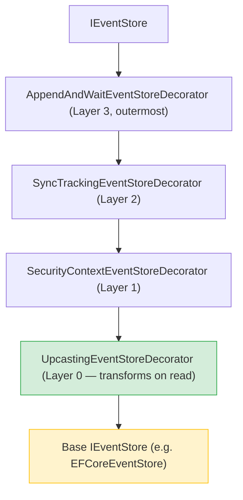

# Event upcasting

Events are immutable, but the shapes you project from them are not. Over a
system's life a stream's events change form — a field is added or renamed, an
event type is superseded (`FooV1` → `FooV2`), or the **routing key** changes
(events written onto stream A should now materialize onto stream B).

**Upcasting** transforms a stored event into its current shape **on read** —
after deserialization, before routing / perspective `Apply` — without ever
rewriting the event log. It is the durable alternative to freezing old `Apply`
methods forever or re-emitting migrated event copies (which permanently doubles
event volume).

The load-bearing guarantee is the **seam**: upcasters run on *every* polymorphic
read path (drain, replay, lifecycle), so projected state never depends on how an
event was read.

The API lives in `Whizbang.Core.Messaging`.

## When to reach for it

Reach for an upcaster when **stored events** need to project differently than
they were written, and you want that correction to survive every future
projection rebuild:

- A new field must be backfilled with a default for old events.
- An old event type should project as a newer type.
- Old events must be re-keyed onto a different stream (e.g. moving a per-item
  saga event off the saga stream onto its own per-item stream — see
  `src/Whizbang.Sagas/SagaItemStreams.cs`).

Do **not** use it for forward-only changes you can make in the producer, or for
one-off data fixes (those belong in a migration). Upcasting is for the *read
model of history*.

## The `IEventUpcaster` contract

An upcaster is a cheap predicate plus a transform, with two optional
type-declaration members used only for the type-change case (see
[Type-change scoping](#type-change-scoping-foreign-inputs)).

```csharp{title="The IEventUpcaster contract" description="A cheap CanUpcast predicate, an Upcast transform, and optional SourceTypes/TargetTypes that a type-change upcaster declares." framework="NET10" category="Messaging" difficulty="INTERMEDIATE" tags=["event-upcasting", "ieventupcaster", "schema-evolution", "aot"]}
public interface IEventUpcaster {
  // Cheap predicate — true only for events you transform. Called on every event
  // of every read, so keep it allocation-light and side-effect free.
  bool CanUpcast(IEvent storedEvent);

  // Transform; only called when CanUpcast returned true. May return a NEW
  // instance (type change) or the SAME instance mutated (re-key / backfill).
  IEvent Upcast(IEvent storedEvent);

  // Optional — declare only for a type-change upcast (see "Type-change scoping").
  // Default empty: re-key and backfill upcasters keep the same type.
  IReadOnlyList<Type> SourceTypes => Array.Empty<Type>();
  IReadOnlyList<Type> TargetTypes => Array.Empty<Type>();
}
```

`Upcast` casts to the concrete type you own — that is how it stays
reflection-free.

```csharp{title="Backfill + type-change upcaster" description="Upcast OrderV1Event to OrderV2Event, backfilling a default Version by returning a new instance of the newer type." framework="NET10" category="Messaging" difficulty="INTERMEDIATE" tags=["event-upcasting", "type-change", "backfill", "versioning"]}
// Backfill + type change: OrderV1 -> OrderV2 (adds a default Version).
public sealed class V1ToV2Upcaster : IEventUpcaster {
  public bool CanUpcast(IEvent e) => e is OrderV1Event;
  public IEvent Upcast(IEvent e) {
    var v1 = (OrderV1Event)e;
    return new OrderV2Event { StreamId = v1.StreamId, Data = v1.Data, Version = 2 };
  }
}
```

```csharp{title="Re-key upcaster" description="Cast to the concrete type, set the [StreamId]-marked property to land the event on a different stream, and return the same mutated instance." framework="NET10" category="Messaging" difficulty="ADVANCED" tags=["event-upcasting", "re-key", "stream-id", "sagas"]}
// Re-key: set the [StreamId]-marked property to land the event on a different
// stream. Cast to the concrete type, mutate the key, return the SAME instance.
// KeyFor here is illustrative — a real per-item saga key uses SagaItemStreams.Of.
public sealed class RekeyUpcaster : IEventUpcaster {
  public bool CanUpcast(IEvent e) => e is RekeyableEvent;
  public IEvent Upcast(IEvent e) {
    var r = (RekeyableEvent)e;
    r.StreamId = KeyFor(r.SagaId, r.Item);   // the [StreamId] property
    return r;
  }
}
```

## The three transform shapes

| Shape | Returns | Notes |
|-------|---------|-------|
| **Backfill** | same or new instance | Populate fields added since the event was written. |
| **Type change** | a different concrete `IEvent` (`FooV1` → `FooV2`) | The target type must be registered in the source-generated JSON context (it is, for any normal event). |
| **Re-key** | same instance, `[StreamId]` mutated | Lands the event on a different stream. Re-routes onto the new row on a perspective **rebuild** (see below). |

## Registration & ordering

Registration is explicit — no assembly scanning, so it is AOT-safe and the
apply order is the call order. Register upcasters **oldest-shape → newest-shape**
so a stale event walks the whole chain in one pass.

```csharp{title="Register upcasters oldest-shape first" description="Chain AddEventUpcaster calls in ascending version order so a V1 event composes through V2 to V3 in a single forward pass." framework="NET10" category="Messaging" difficulty="BEGINNER" tags=["event-upcasting", "registration", "dependency-injection", "ordering"]}
services
  .AddEventUpcaster<OrderV1ToV2Upcaster>()   // applied first
  .AddEventUpcaster<OrderV2ToV3Upcaster>();  // then this — a V1 event reaches V3 in one pass
```

`AddEventUpcaster<T>()` registers the upcaster as a **singleton** (upcasters are
pure and stateless) and ensures the `EventUpcasterPipeline` is resolvable. It
uses `AddSingleton` (append, not `TryAdd`) so DI preserves call order in
`IEnumerable<IEventUpcaster>` — and that order is the upcast-pass order.

The pipeline runs each registered upcaster once, in order; the output of one
feeds the next upcaster's `CanUpcast`. A single forward pass is **bounded**
(at most one visit per upcaster) and **cannot loop**, even if an upcaster's
output would re-match an earlier one. Register newest-first and a `V1` input
stops at `V2` — so keep them oldest-first.

When no upcasters are registered the read path is a passthrough: the decorator
is not even wrapped (`EventUpcasterPipeline.HasAny` is `false`), so non-upcasting
consumers pay nothing.

## What runs where (the seam)

`UpcastingEventStoreDecorator` sits **innermost** in the `IEventStore` decorator
stack, so every outer decorator and consumer observes upcasted events:



It applies the pipeline on all three **polymorphic** read paths:

| Path | Method | Used by |
|------|--------|---------|
| Drain (hot path) | `DeserializeStreamEvents` | perspective runner, live projection |
| Replay / rebuild | `ReadPolymorphicAsync` | rebuild, rewind, ad-hoc polymorphic reads |
| Lifecycle | `GetEventsBetweenPolymorphicAsync` | post-perspective lifecycle receptors |

This is the **unified-seam invariant**: the same pipeline on every path — the
same stored event always projects to the same state. It is enforced by a
contract test that proves each polymorphic entrypoint applies the pipeline
(`UpcastingEventStoreDecoratorTests`).

**Typed reads delegate unchanged.** `ReadAsync<TMessage>` and
`GetEventsBetweenAsync<TMessage>` return a concrete `TMessage`, so a
type-changing upcast can't be expressed there — and those are not
projection-rebuild paths. Type-change and re-key apply on the polymorphic paths,
which are exactly the rebuild paths.

## Type-change scoping (foreign inputs)

A type-change upcaster consumes a stored type the target perspective does **not**
subscribe to (`LegacyA` → `GenericB`, where the perspective subscribes to
`GenericB`, not `LegacyA`). Because both the rebuild stream-enumeration and the
polymorphic read are scoped to a perspective's subscribed event types, that
foreign input would be filtered out *before* the upcaster ever runs.

To include it, a type-change upcaster declares its `SourceTypes` and
`TargetTypes`:

```csharp{title="Type-change upcaster for a foreign input" description="Declaring SourceTypes/TargetTypes opts a type-change upcaster into read-widening so a stored type the perspective does not subscribe to can still reach it." framework="NET10" category="Messaging" difficulty="ADVANCED" tags=["event-upcasting", "type-change", "read-seam", "perspective-rebuild"]}
public sealed class ForeignToNewUpcaster : IEventUpcaster {
  public IReadOnlyList<Type> SourceTypes => [typeof(ForeignEvent)];
  public IReadOnlyList<Type> TargetTypes => [typeof(NewEvent)];
  public bool CanUpcast(IEvent e) => e is ForeignEvent;
  public IEvent Upcast(IEvent e) => new NewEvent { StreamId = ((ForeignEvent)e).StreamId };
}
```

Two cooperating widenings make that foreign input reachable, each keyed to the
piece it must match:

- **The read seam** (`ReadPolymorphicAsync`, the replay/rebuild path) widens the
  inner read with the declared source types via `ExtraInputTypesFor(...)`
  (Type-based), runs the upcaster, and **filters the results back** to the
  originally-requested set — dropping any upcast output whose target the caller
  did not ask for, so there is no cross-projection contamination. The other two
  polymorphic paths (`GetEventsBetweenPolymorphicAsync` and
  `DeserializeStreamEvents`) apply the same pipeline but do **not** widen or
  filter — they already receive the requested type set.
- **The rebuild stream-enumeration** widens which physical streams it visits via
  the name-based twin `ExtraInputTypeNamesFor(...)`, matched against the event
  store's `EventType` string column, so a stream that carries only the legacy
  input is not skipped before the upcaster can run.

The pipeline exposes whether any of this applies via `HasTypeChanges`. Re-key
and backfill upcasters declare nothing, so both widenings are a no-op for them —
the common case.

## Re-key re-routes on rebuild, not on live drain

During a perspective **rebuild** the generated runner's `RunRebuildAsync` reads
a physical stream's events (upcasted on the polymorphic read seam), partitions
them by their **post-upcast** `[StreamId]` (`ResolveTargetStreamId`), and
projects each partition onto its own row — so a re-keyed historical event lands
on its new stream's row, not the stored one. When no event re-keys, every event
maps back to the physical stream id: a single partition that behaves exactly
like the un-partitioned rebuild.

The **live drain** path is deliberately untouched: new events are already
written to their correct stream, so only rebuild of historically mis-keyed
events needs re-routing. This is validated end-to-end (Testcontainers) by
`RekeyThroughRebuildTests` — two events appended on one physical stream, the
first re-keyed to a target stream; after `RebuildInPlaceAsync` the re-keyed
event lands on the target row and the untouched event on the physical row.

Rebuild does **not** truncate the read model first (`RebuildInPlaceAsync`
resolves the streams that carry the perspective's events and replays each,
**upserting** rows). Re-running the rebuild re-materializes the same target rows
to the same state — it is idempotent. But because there is no purge-first, the
runner only writes a row for a stream that a partition targets, so a stale row
that an earlier projection wrote for a since-re-keyed stream is not
automatically removed. Plan a re-key rebuild as a deliberate, one-time history
migration rather than a routine re-projection.

## Rules & constraints (AOT, purity)

- **Pure / deterministic** — same constraints as a perspective `Apply`: no I/O,
  no clock, no randomness. Same input ⇒ same output, on every read. Upcasters run
  constantly; keep `CanUpcast` allocation-light.
- **No reflection / AOT-safe** — operate on `IEvent` and cast to the concrete
  types you own. Registration carries the trim annotations needed for native AOT.
- **One event at a time** — an upcaster cannot fold multiple events into one
  (that would break per-row replay). `Upcast` takes one event and returns one.
- The pipeline throws `ArgumentNullException` if you pass a null event, or if an
  upcaster returns null.

## Snapshots

Snapshots are a derived cache of the perspective model and carry their own shape,
separate from event upcasting. Snapshot versioning is governed by
`PerspectiveSnapshotOptions.UpgradePolicy` (`SnapshotUpgradePolicy`), whose
default is `RebuildFromEvents` — when a stored snapshot's serialization version
does not match the current version it is discarded and the model is rebuilt from
events (at which point upcasters run on the read path). This is the snapshot
analogue of event upcasting.

## Testing

- Pipeline composition, ordering, passthrough, null-guarding, and type-change
  scoping (`HasTypeChanges` / `ExtraInputTypesFor` / `ExtraInputTypeNamesFor`):
  `tests/Whizbang.Core.Tests/Messaging/EventUpcasterPipelineTests.cs`
- Registration & DI order (singleton, call-order = apply-order):
  `tests/Whizbang.Core.Tests/Messaging/EventUpcasterRegistrationTests.cs`
- Seam contract (pipeline applied on every polymorphic entrypoint; type-change
  read-widening + filter-back):
  `tests/Whizbang.Core.Tests/Messaging/UpcastingEventStoreDecoratorTests.cs`
- Re-key re-routes on rebuild (Testcontainers):
  `tests/Whizbang.Data.EFCore.Postgres.Tests/Perspectives/RekeyThroughRebuildTests.cs`
