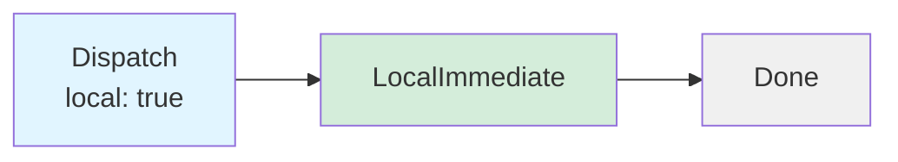
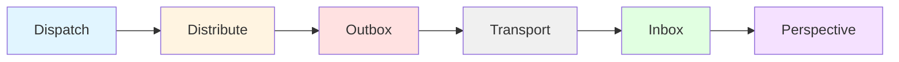
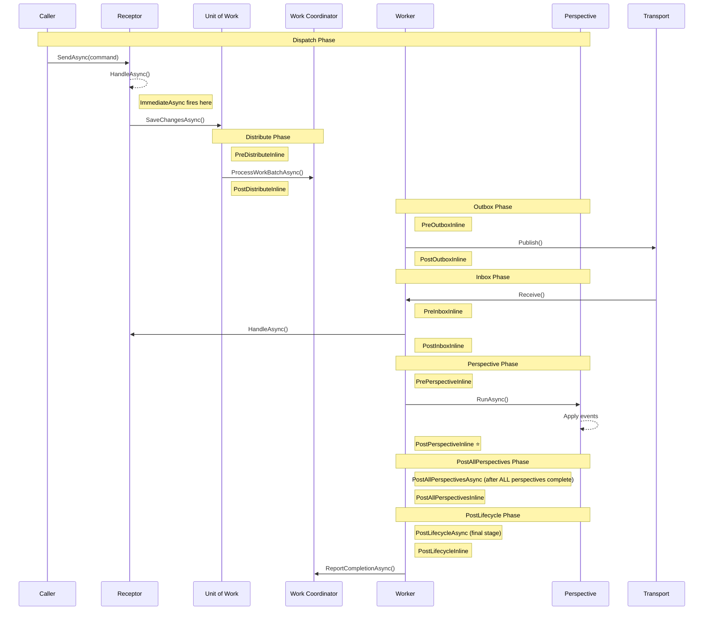

# Lifecycle Stages

Whizbang provides lifecycle stages where custom logic can execute during message processing. Lifecycle stages enable observability, metrics collection, test synchronization, and custom side effects without modifying core framework code.

:::updated
The [Lifecycle Coordinator](lifecycle-coordinator.md) now manages all stage transitions, guaranteeing each stage fires **exactly once per event**. Tags fire at every stage as lifecycle observers.
:::

## Core Concept

Messages flow through **two mutually exclusive paths**:

### Local Path (Mediator Pattern)



**Local dispatch** acts as an in-memory mediator - no persistence, no transport. Messages are processed immediately.

### Distributed Path (Outbox/Inbox)



**Distributed dispatch** persists to outbox, publishes via transport (RabbitMQ, Service Bus), and processes in inbox on receiver side.

---

## Two Mutually Exclusive Paths

:::new
Understanding the two dispatch paths is critical for using lifecycle stages correctly.
:::

| Path | Description | Default Stages | Persistence |
|------|-------------|---------------|-------------|
| **Local** | `DispatchAsync(msg, local: true)` | `LocalImmediateInline` | ❌ None (mediator) |
| **Distributed** | `DispatchAsync(msg)` or via transport | `PreOutboxInline` (sender) + `PostInboxInline` (receiver) | ✅ Outbox/Inbox |

**Key Points**:
- A message goes through ONE path, not both
- Default receptors (no `[FireAt]`) fire ONCE per path
- `[FireAt]` attributes opt into specific stages and OUT of default behavior

At each stage, **lifecycle receptors** can execute to:
- Track metrics and telemetry
- Log diagnostic information
- Synchronize integration tests
- Trigger custom business logic
- Implement cross-cutting concerns

---

## All 24 Lifecycle Stages

:::updated
The `LifecycleStage` enum contains 25 values total: 24 true lifecycle stages plus one special value (`AfterReceptorCompletion = -1`). `AfterReceptorCompletion` is **not** a true lifecycle stage — it is a hook that fires synchronously after a receptor completes in the Dispatcher, before any lifecycle stages are invoked. It exists as the default for backward compatibility with tag hooks.
:::

### Immediate Stage

#### `ImmediateAsync`

**Timing**: Immediately after receptor `HandleAsync()` returns, before any database operations.

**Use Cases**:
- Log command execution timing
- Track user activity
- Record metrics before persistence

**Guarantees**:
- Fires in same transaction scope as receptor
- No database writes have occurred yet
- Errors propagate to caller

**Example**:
```csharp{title="`ImmediateAsync`" description="ImmediateAsync" category="Architecture" difficulty="BEGINNER" tags=["Fundamentals", "Lifecycle", "ImmediateAsync"]}
[FireAt(LifecycleStage.ImmediateAsync)]
public class CommandMetricsReceptor : IReceptor<ICommand> {
    private readonly IMetricsCollector _metrics;

    public ValueTask HandleAsync(ICommand cmd, CancellationToken ct) {
        _metrics.RecordCommand(cmd.GetType().Name);
        return ValueTask.CompletedTask;
    }
}
```

---

### LocalImmediate Stages (2 stages) ⭐ NEW

:::new
LocalImmediate stages are new in v1.0.0 and enable in-memory mediator-style message handling.
:::

#### `LocalImmediateInline` ⭐ **Default Stage for Local Path**

**Timing**: After `DispatchAsync(message, local: true)` completes, blocking.

**Use Cases**:
- **Business logic receptors** (this is where your command handlers fire!)
- Request-response patterns in same process
- In-memory mediator workflows
- Synchronous local dispatch

**Guarantees**:
- **Blocking** - dispatch waits for completion
- **NO persistence** - message never hits outbox/inbox
- **Default stage** for receptors WITHOUT `[FireAt]` on local path
- Errors propagate to caller

**Example**:
```csharp{title="`LocalImmediateInline` ⭐ **Default Stage for Local Path**" description="LocalImmediateInline` " category="Architecture" difficulty="INTERMEDIATE" tags=["Fundamentals", "Lifecycle", "LocalImmediateInline", "**Default"]}
// Receptor WITHOUT [FireAt] fires here when dispatched locally!
public class CreateTenantCommandHandler : IReceptor<CreateTenantCommand, TenantCreatedEvent> {
    public async ValueTask<TenantCreatedEvent> HandleAsync(CreateTenantCommand cmd, CancellationToken ct) {
        // Business logic executes at LocalImmediateInline stage
        var tenant = new Tenant(cmd.Name);
        await _dbContext.Tenants.AddAsync(tenant, ct);
        return new TenantCreatedEvent(tenant.Id);
    }
}

// Use local dispatch for in-process handling
await dispatcher.DispatchAsync(new CreateTenantCommand("Acme"), local: true);
```

#### `LocalImmediateAsync`

**Timing**: After `DispatchAsync(message, local: true)` completes, non-blocking.

**Use Cases**:
- Non-critical logging after local dispatch
- Fire-and-forget metrics
- Background notifications

**Guarantees**:
- **Non-blocking** - dispatch returns immediately
- **NO persistence** - message never hits outbox/inbox
- Runs via `Task.Run`
- Errors logged but don't affect caller

**Example**:
```csharp{title="`LocalImmediateAsync`" description="LocalImmediateAsync" category="Architecture" difficulty="BEGINNER" tags=["Fundamentals", "Lifecycle", "LocalImmediateAsync"]}
[FireAt(LifecycleStage.LocalImmediateAsync)]
public class LocalDispatchLogger : IReceptor<ICommand> {
    public ValueTask HandleAsync(ICommand cmd, CancellationToken ct) {
        Console.WriteLine($"Local dispatch completed for {cmd.GetType().Name}");
        return ValueTask.CompletedTask;
    }
}
```

---

### Distribute Stages (5 stages)

:::planned
All five Distribute stages (`PreDistributeInline`, `PreDistributeAsync`, `DistributeAsync`, `PostDistributeAsync`, `PostDistributeInline`) are planned for coordinator-managed execution. The enum values exist in `LifecycleStage` but are not yet wired into the pipeline. They will fire for both outbox (publishing) and inbox (consuming) paths — use `MessageSource` to distinguish.
:::

#### `PreDistributeInline`

**Timing**: Before `ProcessWorkBatchAsync()` call in unit of work strategy.

**Use Cases**:
- Pre-processing before batch distribution
- Validation before work coordination

**Guarantees**:
- Blocking - distribution waits for completion
- Runs before any work is sent to coordinator

#### `PreDistributeAsync`

**Timing**: Before `ProcessWorkBatchAsync()` call in unit of work strategy (non-blocking, backgrounded).

**Use Cases**:
- Non-critical logging before batch distribution
- Async metrics collection
- Pre-distribution notifications

**Guarantees**:
- Non-blocking - fires in background via `Task.Run`
- Errors are logged but don't affect distribution
- May still be running when distribution occurs

#### `DistributeAsync`

**Timing**: In parallel with `ProcessWorkBatchAsync()` call (non-blocking, backgrounded).

**Use Cases**:
- Side effects that don't need to block (notifications, caching)
- Fire-and-forget operations
- Background metrics collection

**Guarantees**:
- Non-blocking - fires in background via `Task.Run`
- Errors are logged but don't affect distribution
- May complete after distribution finishes

#### `PostDistributeAsync`

**Timing**: After `ProcessWorkBatchAsync()` completes (non-blocking, backgrounded).

**Use Cases**:
- Post-distribution metrics
- Cleanup operations
- Async notifications

**Guarantees**:
- Non-blocking - fires in background via `Task.Run`
- Errors are logged but don't affect next steps
- Work has been queued to coordinator

#### `PostDistributeInline`

**Timing**: After `ProcessWorkBatchAsync()` completes (blocking).

**Use Cases**:
- Synchronization points in tests
- Critical post-distribution validation

**Guarantees**:
- Blocking - next step waits for completion
- Work has been queued to coordinator

---

### Outbox Stages (4 stages)

#### `PreOutboxInline` ⭐ **Default Stage for Distributed Sender**

**Timing**: Before publishing message to transport (Service Bus, RabbitMQ, etc.).

**Use Cases**:
- **Business logic receptors** (this is where your command handlers fire on sender side!)
- Pre-publish validation
- Message enrichment
- Transport-specific preparation

**Guarantees**:
- **Blocking** - publish waits for completion
- Message not yet sent to transport
- **Default stage** for receptors WITHOUT `[FireAt]` on distributed path (sender side)

#### `PreOutboxAsync`

**Timing**: Parallel with transport publish (non-blocking).

**Use Cases**:
- Async logging of outbound messages
- Non-critical metrics

**Guarantees**:
- Non-blocking - publish continues in parallel
- Message may already be sent when receptor completes

#### `PostOutboxAsync`

**Timing**: After message published to transport (non-blocking).

**Use Cases**:
- Delivery confirmation logging
- Success metrics

**Guarantees**:
- Non-blocking
- Message successfully published to transport

#### `PostOutboxInline`

**Timing**: After message published to transport (blocking).

**Use Cases**:
- Test synchronization for message publishing
- Critical post-publish operations

**Guarantees**:
- Blocking
- Message successfully published to transport

---

### Inbox Stages (4 stages)

#### `PreInboxInline`

**Timing**: Before invoking local receptor for received message.

**Use Cases**:
- Pre-processing received messages
- Validation before handler invocation
- Message deduplication checks

**Guarantees**:
- Blocking - receptor invocation waits
- Message received from transport but not yet processed

#### `PreInboxAsync`

**Timing**: Parallel with receptor invocation (non-blocking).

**Use Cases**:
- Async logging of inbound messages
- Non-critical metrics

**Guarantees**:
- Non-blocking - receptor invocation continues in parallel
- Receptor may complete before this stage finishes

#### `PostInboxAsync`

**Timing**: After receptor completes (non-blocking).

**Use Cases**:
- Post-processing metrics
- Success logging

**Guarantees**:
- Non-blocking
- Receptor has completed successfully

#### `PostInboxInline` ⭐ **Default Stage for Distributed Receiver**

**Timing**: After message received from transport and stored in inbox (blocking).

**Use Cases**:
- **Business logic receptors** (this is where your command handlers fire on receiver side!)
- Test synchronization for message reception
- Critical post-processing

**Guarantees**:
- **Blocking** - completion waits for all handlers
- Message stored in inbox and deduplicated
- **Default stage** for receptors WITHOUT `[FireAt]` on distributed path (receiver side)

---

### Perspective Stages (4 stages)

:::new
Perspective lifecycle stages are new in v1.0.0 and enable deterministic test synchronization.
:::

#### `PrePerspectiveInline`

**Timing**: Before perspective `RunAsync()` processes events.

**Use Cases**:
- Pre-processing before perspective updates
- Checkpoint validation
- Event enrichment

**Guarantees**:
- Blocking - perspective processing waits
- No events processed yet

**Hook Location**: Generated perspective runner (from `PerspectiveRunnerTemplate.cs`) before event processing loop begins

#### `PrePerspectiveAsync`

**Timing**: Parallel with perspective `RunAsync()` (non-blocking).

**Use Cases**:
- Async logging
- Non-critical metrics

**Guarantees**:
- Non-blocking - perspective continues in parallel
- Perspective may complete before this stage finishes

**Hook Location**: Generated perspective runner (from `PerspectiveRunnerTemplate.cs`) before event processing loop begins

#### `PostPerspectiveAsync`

**Timing**: After perspective completes, before checkpoint reported (non-blocking).

**Use Cases**:
- Post-processing metrics
- Event logging
- Custom indexing

**Guarantees**:
- Non-blocking
- Perspective has processed all events
- Checkpoint not yet reported to coordinator

**Hook Location**: Generated perspective runner (from `PerspectiveRunnerTemplate.cs`) during event processing loop, after `Apply()` and before checkpoint save

**Example**:
```csharp{title="`PostPerspectiveAsync`" description="PostPerspectiveAsync" category="Architecture" difficulty="BEGINNER" tags=["Fundamentals", "Lifecycle", "PostPerspectiveAsync"]}
[FireAt(LifecycleStage.PostPerspectiveAsync)]
public class PerspectiveMetricsReceptor : IReceptor<IEvent> {
    private readonly IMetricsCollector _metrics;

    public ValueTask HandleAsync(IEvent evt, CancellationToken ct) {
        _metrics.RecordPerspectiveUpdate(evt.GetType().Name);
        return ValueTask.CompletedTask;
    }
}
```

#### `PostPerspectiveInline` ⭐ **Critical for Testing**

**Timing**: After perspective completes, before checkpoint reported (blocking).

**Use Cases**:
- **Test synchronization** - wait for perspective data to be saved
- Critical post-processing that must complete before checkpoint

**Guarantees**:
- **Blocking** - checkpoint reporting waits for completion
- Perspective has processed all events
- **Database writes are committed** - safe to query perspective data
- Checkpoint not yet reported to coordinator

**Hook Location**: Generated perspective runner (from `PerspectiveRunnerTemplate.cs`) during event processing loop, after `Apply()` and before checkpoint save

**Example** (Test Synchronization):
```csharp{title="`PostPerspectiveInline` ⭐ **Critical for Testing**" description="Example (Test Synchronization):" category="Architecture" difficulty="INTERMEDIATE" tags=["Fundamentals", "Lifecycle", "PostPerspectiveInline", "**Critical"]}
[FireAt(LifecycleStage.PostPerspectiveInline)]
public class PerspectiveCompletionReceptor<TEvent> : IReceptor<TEvent>
    where TEvent : IEvent {

    private readonly TaskCompletionSource<bool> _completion;

    public ValueTask HandleAsync(TEvent evt, CancellationToken ct) {
        _completion.SetResult(true);  // Signal test to proceed
        return ValueTask.CompletedTask;
    }
}
```

See [Lifecycle Synchronization](../../operations/testing/lifecycle-synchronization.md) for complete test patterns.

---

### PostAllPerspectives Stages (2 stages)

:::new
PostAllPerspectives stages are new in v1.0.0 and fire **once per event** after **all** perspectives have finished processing it. They sit between PostPerspective (per-perspective) and PostLifecycle (end-of-lifecycle) in the pipeline.
:::

#### `PostAllPerspectivesAsync`

**Timing**: After ALL perspectives have completed processing this event (WhenAll pattern), before PostLifecycle stages. Non-blocking.

**Use Cases**:
- Cross-perspective aggregation that needs all perspective data committed
- Notifications that require all perspectives to be up-to-date
- Derived computations spanning multiple perspectives

**Guarantees**:
- **Fires exactly once per event** — managed by [Lifecycle Coordinator](lifecycle-coordinator.md) via WhenAll
- Non-blocking — does not delay PostLifecycle
- All perspective checkpoints have been saved
- Fires **before** PostLifecycle stages

**Example**:
```csharp{title="`PostAllPerspectivesAsync`" description="Cross-perspective aggregation after all perspectives complete" category="Architecture" difficulty="INTERMEDIATE" tags=["Fundamentals", "Lifecycle", "PostAllPerspectivesAsync"]}
[FireAt(LifecycleStage.PostAllPerspectivesAsync)]
public class CrossPerspectiveAggregator : IReceptor<OrderPlacedEvent> {
  private readonly IOrderSummaryService _summaryService;

  public async ValueTask HandleAsync(OrderPlacedEvent evt, CancellationToken ct) {
    // Safe to read all perspectives — every perspective has processed this event
    await _summaryService.RebuildSummaryAsync(evt.OrderId, ct);
  }
}
```

#### `PostAllPerspectivesInline`

**Timing**: Same as `PostAllPerspectivesAsync` but **blocking** — the worker waits for completion before proceeding to PostLifecycle.

**Use Cases**:
- Critical cross-perspective consistency checks
- Aggregation that must complete before PostLifecycle fires
- Test synchronization after all perspectives finish

**Guarantees**:
- **Fires exactly once per event** — managed by Lifecycle Coordinator via WhenAll
- **Blocking** — PostLifecycle stages wait for completion
- All perspective checkpoints have been saved

---

### PostLifecycle Stages (2 stages)

:::new
PostLifecycle stages are the **final stages** in an event's lifecycle, managed by the [Lifecycle Coordinator](lifecycle-coordinator.md).
:::

#### `PostLifecycleAsync`

**Timing**: After ALL processing completes for this event — all perspectives have processed it, or inbox processing is done (for events without perspectives), or local dispatch is complete.

**Use Cases**:
- Final notifications (SignalR, email, push) — guaranteed to fire exactly once per event
- Cross-perspective aggregation
- Analytics and reporting
- Cleanup operations

**Guarantees**:
- **Fires exactly once per event** — managed by [Lifecycle Coordinator](lifecycle-coordinator.md)
- Non-blocking — does not delay next batch
- For `Route.Both()` events, fires only after ALL paths complete ([WhenAll pattern](lifecycle-coordinator.md#whenall))
- Fired by whichever worker is the **last to act** on the event:

| Scenario | Who fires PostLifecycle |
|----------|----------------------|
| Local dispatch | Dispatcher |
| Distributed, no perspectives | TransportConsumer |
| Distributed, with perspectives | PerspectiveWorker |
| `Route.Both()` | Last path to complete (WhenAll) |

**Example**:
```csharp{title="`PostLifecycleAsync`" description="Final notification after all processing completes" category="Architecture" difficulty="INTERMEDIATE" tags=["Fundamentals", "Lifecycle", "PostLifecycleAsync"]}
[FireAt(LifecycleStage.PostLifecycleAsync)]
public class OrderNotificationReceptor : IReceptor<OrderPlacedEvent> {
  private readonly INotificationService _notifications;

  public async ValueTask HandleAsync(OrderPlacedEvent evt, CancellationToken ct) {
    // Safe to send notification — all perspectives have processed the event
    // This fires exactly once, regardless of how many perspectives exist
    await _notifications.SendAsync($"Order {evt.OrderId} confirmed", ct);
  }
}
```

#### `PostLifecycleInline`

**Timing**: Same as `PostLifecycleAsync` but **blocking** — the worker waits for completion.

**Use Cases**:
- Critical final processing that must complete before the batch ends
- Guaranteed-delivery notifications
- Test synchronization for end-of-lifecycle events

**Guarantees**:
- **Fires exactly once per event** — managed by Lifecycle Coordinator
- **Blocking** — worker waits for all handlers to complete
- Same "last worker to act" semantics as `PostLifecycleAsync`

---

### Pipeline Overview

Each worker processes a specific **segment** of the lifecycle. `PostLifecycle` fires at the end of whichever worker is the last to act on the event:

```
Dispatcher                    OutboxWorker              TransportConsumer         PerspectiveWorker
─────────────────────────    ─────────────────────    ─────────────────────    ─────────────────────
ENTRY: dispatch               ENTRY: load from DB      ENTRY: receive            ENTRY: load from DB
  ┌─ LocalImmediateAsync       ┌─ PreOutboxAsync        ┌─ PreInboxAsync          ┌─ PrePerspectiveAsync
  ├─ LocalImmediateInline      ├─ PreOutboxInline       ├─ PreInboxInline         ├─ PrePerspectiveInline
  ├─ PostLifecycleAsync†       ├─ PostOutboxAsync       ├─ PostInboxAsync         ├─ PostPerspectiveAsync
  └─ PostLifecycleInline†      ├─ PostOutboxInline      ├─ PostInboxInline        ├─ PostPerspectiveInline
EXIT: done / WhenAll          ├─ PostLifecycleAsync‡   ├─ PostLifecycleAsync*    ├─ PostAllPerspectivesAsync
                              └─ PostLifecycleInline‡   └─ PostLifecycleInline*   ├─ PostAllPerspectivesInline
                             EXIT: transport / WhenAll  EXIT: done / WhenAll      ├─ PostLifecycleAsync**
                                                                                  └─ PostLifecycleInline**
                                                                                 EXIT: done / WhenAll

† fires if this is the only processing path (Route.Local), OR via WhenAll
‡ fires if no further processing (event leaves service), OR via WhenAll
* fires for events WITHOUT perspectives, OR via WhenAll
** fires AFTER ALL perspectives complete (PostAllPerspectives → PostLifecycle), OR via WhenAll
```

See [Lifecycle Coordinator](lifecycle-coordinator.md) for details on entry/exit points, WhenAll, and tracking.

---

## Lifecycle Stage Timing Diagram



---

## Async vs Inline Stages

Most lifecycle stages come in pairs:

| Stage Type | Timing | Blocks Next Step | Use Case |
|------------|--------|------------------|----------|
| `*Inline` | Before/After | ✅ Yes | Critical operations, test sync |
| `*Async` | Parallel | ❌ No | Metrics, logging, non-critical |

**Guidelines**:
- **Use Inline** for: Test synchronization, validation, critical operations
- **Use Async** for: Logging, metrics, observability

---

## Registering Lifecycle Receptors

### Compile-Time (Production)

Use `[FireAt]` attribute for compile-time registration:

```csharp{title="Compile-Time (Production)" description="Use [FireAt] attribute for compile-time registration:" category="Architecture" difficulty="BEGINNER" tags=["Fundamentals", "Lifecycle", "Compile-Time", "Production"]}
[FireAt(LifecycleStage.PostPerspectiveAsync)]
public class MyMetricsReceptor : IReceptor<ProductCreatedEvent> {
    public ValueTask HandleAsync(ProductCreatedEvent evt, CancellationToken ct) {
        // Track metrics
        return ValueTask.CompletedTask;
    }
}
```

Source generators discover and wire these automatically.

### Runtime (Testing)

Use `ILifecycleReceptorRegistry` for dynamic registration:

```csharp{title="Runtime (Testing)" description="Use ILifecycleReceptorRegistry for dynamic registration:" category="Architecture" difficulty="INTERMEDIATE" tags=["Fundamentals", "Lifecycle", "Runtime", "Testing"]}
var registry = host.Services.GetRequiredService<ILifecycleReceptorRegistry>();
var receptor = new PerspectiveCompletionReceptor<ProductCreatedEvent>(completionSource);

registry.Register<ProductCreatedEvent>(receptor, LifecycleStage.PostPerspectiveInline);
try {
    // Dispatch command
    await dispatcher.SendAsync(command);

    // Wait for completion
    await completionSource.Task;
} finally {
    registry.Unregister<ProductCreatedEvent>(receptor, LifecycleStage.PostPerspectiveInline);
}
```

See [Lifecycle Receptors](../receptors/lifecycle-receptors.md) for API details.

---

## Performance Considerations

**Lifecycle receptors execute synchronously in the message processing path**. Keep them fast:

✅ **Good Practices**:
- Quick in-memory operations
- Async logging (non-blocking)
- Metrics collection
- Test signaling

❌ **Avoid**:
- Database queries
- HTTP calls
- Heavy computation
- Blocking operations (in Async stages)

**Exception Handling**:
- Lifecycle receptor errors are logged but don't fail message processing
- Checkpoint progress continues even if lifecycle receptors fail
- Critical operations should use Inline stages to detect failures

---

## Hook Locations in Source Code

| Stage | File | Method/Location |
|-------|------|-----------------|
| `ImmediateAsync` | `Dispatcher.cs` | After receptor `HandleAsync()` |
| `PreDistribute*` / `DistributeAsync` / `PostDistribute*` | `*WorkCoordinatorStrategy.cs` | Around `ProcessWorkBatchAsync()` (Immediate/Scoped/Interval) |
| `PreOutbox*` / `PostOutbox*` | `WorkCoordinatorPublisherWorker.cs` | Around `ProcessOutboxWorkAsync()` |
| `PreInbox*` / `PostInbox*` | `ServiceBusConsumerWorker.cs` | Around `ProcessInboxWorkAsync()` |
| `PrePerspective*` | `PerspectiveRunnerTemplate.cs` | Before event processing loop |
| `PostPerspective*` | `PerspectiveRunnerTemplate.cs` | During event processing loop (after `Apply()`, before checkpoint save) |
| `PostAllPerspectives*` | `PerspectiveWorker.cs` | After ALL perspectives complete (WhenAll) — managed by [Lifecycle Coordinator](lifecycle-coordinator.md) |
| `PostLifecycle*` | `PerspectiveWorker.cs`, `TransportConsumerWorker.cs`, `Dispatcher.cs` | After all processing completes — managed by [Lifecycle Coordinator](lifecycle-coordinator.md) |

---

## Related Topics

- [Lifecycle Coordinator](lifecycle-coordinator.md) - Centralized stage management, WhenAll pattern, tracking
- [Lifecycle Receptors API](../receptors/lifecycle-receptors.md) - Using `[FireAt]` and `ILifecycleContext`
- [Testing: Lifecycle Synchronization](../../operations/testing/lifecycle-synchronization.md) - Test patterns with lifecycle hooks
- [PerspectiveWorker](../../operations/workers/perspective-worker.md) - Perspective processing worker
- [Work Coordination](../../messaging/work-coordination.md) - Distributed work coordination

---

## Summary

- **24 lifecycle stages** across 8 phases (Immediate, LocalImmediate, Distribute, Outbox, Inbox, Perspective, PostAllPerspectives, PostLifecycle) plus 1 special value (`AfterReceptorCompletion`)
- **Two mutually exclusive paths**: Local (mediator) and Distributed (outbox/inbox)
- **Default stages** for receptors without `[FireAt]`:
  - **Local path**: `LocalImmediateInline`
  - **Distributed path**: `PreOutboxInline` (sender) + `PostInboxInline` (receiver)
- **PostLifecycle** fires exactly once per event at the end of whichever worker is last to act
- **Lifecycle Coordinator** guarantees each stage fires once per event — no duplicate firings
- **Tags fire at ALL stages** as lifecycle observers
- **Inline stages** block next step - use for critical operations
- **Async stages** run in parallel - use for metrics and logging
- **`PostPerspectiveInline`** is critical for test synchronization
- **Compile-time registration** via `[FireAt]` attribute
- **Runtime registration** via `ILifecycleReceptorRegistry` for tests
- **Zero reflection** - fully AOT-compatible via `IReceptorInvoker` and `IReceptorRegistry`
- **Performance** - keep lifecycle receptors fast and lightweight
