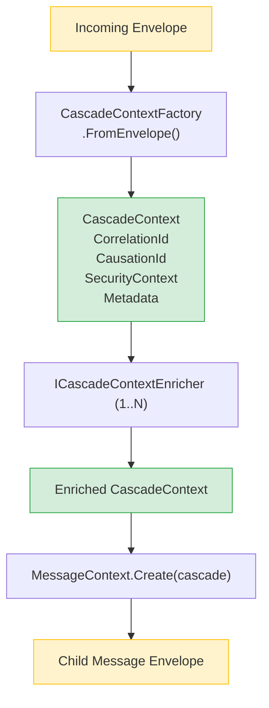
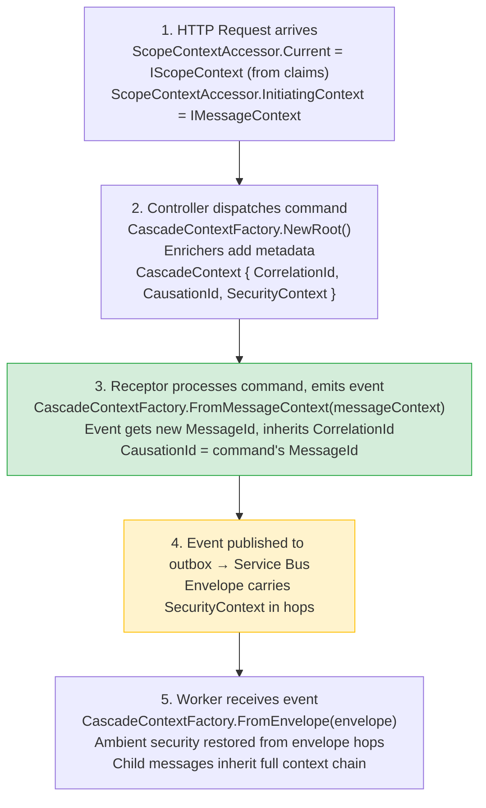

# Cascade Context & Security Propagation

When a message produces child messages, **CascadeContext** carries everything those children need: correlation tracking, causation chains, security identity, and custom metadata. It is the single transfer object for context propagation, replacing manual extraction of individual properties.

## How It Fits Together



---

## CascadeContext

A lightweight, immutable record containing only the data that must propagate from parent to child messages.

```csharp{title="CascadeContext" description="Immutable record carrying propagation data" category="Architecture" difficulty="BEGINNER" tags=["Fundamentals", "Messages", "CascadeContext"]}
public sealed record CascadeContext {
    public required CorrelationId CorrelationId { get; init; }
    public required MessageId CausationId { get; init; }
    public SecurityContext? SecurityContext { get; init; }
    public IReadOnlyDictionary<string, object>? Metadata { get; init; }
}
```

### Properties

| Property | Type | Purpose |
|----------|------|---------|
| `CorrelationId` | `CorrelationId` | Links all messages in a workflow (inherited from parent) |
| `CausationId` | `MessageId` | The parent message's `MessageId` (forms the causation chain) |
| `SecurityContext` | `SecurityContext?` | UserId and TenantId for multi-tenant security |
| `Metadata` | `IReadOnlyDictionary<string, object>?` | Extensible key-value store populated by enrichers |

### Creating a Root Context

When starting a brand-new message flow with no parent, use the static factory methods:

```csharp{title="Root Context Creation" description="Starting a new message flow" category="Architecture" difficulty="BEGINNER" tags=["Fundamentals", "Messages", "CascadeContext", "Root"]}
// No security context
var root = CascadeContext.NewRoot();

// Inherits UserId/TenantId from ambient AsyncLocal scope
var rootWithSecurity = CascadeContext.NewRootWithAmbientSecurity();
```

`NewRoot()` generates fresh `CorrelationId` and `CausationId` values. `NewRootWithAmbientSecurity()` additionally reads the current `ImmutableScopeContext` from `ScopeContextAccessor` (if propagation is enabled) and copies `UserId`/`TenantId` into a `SecurityContext`.

### Adding Metadata

CascadeContext is immutable. The `WithMetadata` methods return new instances:

```csharp{title="WithMetadata" description="Adding custom metadata to cascade context" category="Architecture" difficulty="INTERMEDIATE" tags=["Fundamentals", "Messages", "CascadeContext", "Metadata"]}
// Add a single key
var enriched = cascade.WithMetadata("FeatureFlag", "new-checkout-v2");

// Merge a dictionary (overwrites existing keys)
var additional = new Dictionary<string, object> {
    ["ExperimentId"] = "exp-42",
    ["Region"] = "eu-west-1"
};
var merged = cascade.WithMetadata(additional);
```

### SecurityContext (Observability)

The `SecurityContext` carried by `CascadeContext` is a simple record capturing authentication identity at a point in time:

```csharp{title="SecurityContext" description="Authentication identity in cascade context" category="Architecture" difficulty="BEGINNER" tags=["Fundamentals", "Messages", "SecurityContext"]}
public record SecurityContext {
    public string? UserId { get; init; }
    public string? TenantId { get; init; }
}
```

This is distinct from the richer `IScopeContext` (which includes roles, permissions, and claims). `SecurityContext` is intentionally minimal because it travels inside message envelopes across service boundaries.

---

## CascadeContextFactory {#factory}

The factory centralizes creation and enrichment of `CascadeContext`. Register it as a singleton:

```csharp{title="CascadeContextFactory Registration" description="DI registration for CascadeContextFactory" category="Architecture" difficulty="BEGINNER" tags=["Fundamentals", "Messages", "CascadeContext", "Factory"]}
services.AddSingleton<CascadeContextFactory>();
```

### Factory Methods

```csharp{title="CascadeContextFactory API" description="Factory methods for creating CascadeContext" category="Architecture" difficulty="INTERMEDIATE" tags=["Fundamentals", "Messages", "CascadeContext", "Factory"]}
public sealed class CascadeContextFactory(IEnumerable<ICascadeContextEnricher>? enrichers) {
    // From an incoming envelope (most common in workers)
    public CascadeContext FromEnvelope(IMessageEnvelope envelope);

    // From an existing IMessageContext (e.g., in receptors)
    public CascadeContext FromMessageContext(IMessageContext messageContext);

    // New root for entry points (HTTP controllers, background jobs)
    public CascadeContext NewRoot();
}
```

| Method | CorrelationId | CausationId | Security |
|--------|---------------|-------------|----------|
| `FromEnvelope` | From envelope's first hop (or new) | Envelope's `MessageId` | Ambient preferred, envelope fallback |
| `FromMessageContext` | From message context | Message context's `MessageId` | Message context preferred, ambient fallback |
| `NewRoot` | New | New | Ambient |

All three methods apply registered `ICascadeContextEnricher` instances in registration order before returning.

### Typical Usage

```csharp{title="Using CascadeContextFactory in a Worker" description="Extracting cascade context from incoming envelope" category="Architecture" difficulty="INTERMEDIATE" tags=["Fundamentals", "Messages", "CascadeContext", "Factory", "Worker"]}
public class OrderWorker {
    private readonly CascadeContextFactory _cascadeFactory;
    private readonly IDispatcher _dispatcher;

    public OrderWorker(CascadeContextFactory cascadeFactory, IDispatcher dispatcher) {
        _cascadeFactory = cascadeFactory;
        _dispatcher = dispatcher;
    }

    public async Task HandleAsync(IMessageEnvelope envelope, CancellationToken ct) {
        // Extract cascade context from the incoming envelope
        var cascade = _cascadeFactory.FromEnvelope(envelope);

        // Create a child message context inheriting correlation + security
        var childContext = MessageContext.Create(cascade);

        // The child message carries the same CorrelationId,
        // has CausationId pointing to the parent, and
        // inherits UserId/TenantId for multi-tenant filtering
    }
}
```

---

## ICascadeContextEnricher {#enrichers}

Enrichers inject custom data into the cascade context during factory creation. They run in registration order and must be stateless, idempotent, and thread-safe.

```csharp{title="ICascadeContextEnricher" description="Interface for enriching cascade context" category="Architecture" difficulty="INTERMEDIATE" tags=["Fundamentals", "Messages", "CascadeContext", "Enricher"]}
public interface ICascadeContextEnricher {
    CascadeContext Enrich(CascadeContext context, IMessageEnvelope? sourceEnvelope);
}
```

### Example: Feature Flag Enricher

```csharp{title="FeatureFlagEnricher" description="Custom enricher adding feature flags to cascade metadata" category="Architecture" difficulty="INTERMEDIATE" tags=["Fundamentals", "Messages", "CascadeContext", "Enricher", "Example"]}
public class FeatureFlagEnricher : ICascadeContextEnricher {
    private readonly IFeatureFlagService _flags;

    public FeatureFlagEnricher(IFeatureFlagService flags) {
        _flags = flags;
    }

    public CascadeContext Enrich(CascadeContext context, IMessageEnvelope? sourceEnvelope) {
        var activeFlags = _flags.GetActiveFlags(context.SecurityContext?.TenantId);

        return context.WithMetadata("ActiveFeatureFlags", activeFlags);
    }
}

// Register in DI
services.AddSingleton<ICascadeContextEnricher, FeatureFlagEnricher>();
```

### Enricher Guidelines

- Return the **same instance** if no enrichment is needed (avoid unnecessary allocations)
- Use `with` expressions or `WithMetadata()` to create modified copies
- **Never throw exceptions** - log and return the original context if enrichment fails
- Enrichers receive `null` for `sourceEnvelope` when called from `NewRoot()` or `FromMessageContext()`

---

## IScopeContext & Scope Context Accessor {#scope-context}

`IScopeContext` provides the **rich** security context (roles, permissions, claims, security principals) for the current operation. It is populated from HTTP claims, message headers, or explicit injection.

```csharp{title="IScopeContext" description="Rich authorization context interface" category="Architecture" difficulty="INTERMEDIATE" tags=["Fundamentals", "Messages", "ScopeContext", "Security"]}
public interface IScopeContext {
    PerspectiveScope Scope { get; }              // TenantId, UserId
    IReadOnlySet<string> Roles { get; }
    IReadOnlySet<Permission> Permissions { get; }
    IReadOnlySet<SecurityPrincipalId> SecurityPrincipals { get; }
    IReadOnlyDictionary<string, string> Claims { get; }
    string? ActualPrincipal { get; }
    string? EffectivePrincipal { get; }
    SecurityContextType ContextType { get; }

    bool HasPermission(Permission permission);
    bool HasRole(string roleName);
    bool IsMemberOfAny(params SecurityPrincipalId[] principals);
    // ... additional authorization methods
}
```

### IMessageContext.ScopeContext

Messages **own and carry** their scope context. When `IMessageContext` is created, it captures the current `IScopeContext` so that the message carries its authorization state throughout its lifecycle:

```csharp{title="IMessageContext ScopeContext" description="Messages carry their authorization state" category="Architecture" difficulty="INTERMEDIATE" tags=["Fundamentals", "Messages", "ScopeContext", "MessageContext"]}
public interface IMessageContext {
    // ... MessageId, CorrelationId, CausationId, etc.

    // The message OWNS and CARRIES its scope context
    IScopeContext? ScopeContext { get; }
}
```

This is critical for deferred lifecycle stages (like `PostPerspectiveAsync`) where the original HTTP context is no longer available. The scope context persists because the message carries it.

---

## Initiating Context {#initiating-context}

The **Initiating Context** is the `IMessageContext` that started the current scope. It serves as the **source of truth** for security identity (`UserId`, `TenantId`).

```csharp{title="IScopeContextAccessor" description="Accessor with InitiatingContext as source of truth" category="Architecture" difficulty="INTERMEDIATE" tags=["Fundamentals", "Messages", "InitiatingContext", "ScopeContextAccessor"]}
public interface IScopeContextAccessor {
    IScopeContext? Current { get; set; }

    // SOURCE OF TRUTH for security context
    IMessageContext? InitiatingContext { get; set; }

    // Pointer properties - read directly from InitiatingContext
    string? UserId => InitiatingContext?.UserId;
    string? TenantId => InitiatingContext?.TenantId;

    // Rich authorization context
    IScopeContext? ScopeContext => Current;
}
```

### Why InitiatingContext Matters

In event-sourcing systems, **messages carry state**. The `InitiatingContext` stores the `IMessageContext` that began the current processing scope, providing:

- **Single source of truth** for `UserId` and `TenantId`
- **Full tracing context** (`MessageId`, `CorrelationId`, `CausationId`)
- **Debugging support** - inspect the exact message that initiated the scope

### ScopeContextAccessor (AsyncLocal Implementation)

`ScopeContextAccessor` uses `AsyncLocal<T>` for ambient context that flows across async calls:

```csharp{title="ScopeContextAccessor Static Accessors" description="Static accessors for singleton services" category="Architecture" difficulty="ADVANCED" tags=["Fundamentals", "Messages", "ScopeContextAccessor", "AsyncLocal"]}
public sealed class ScopeContextAccessor : IScopeContextAccessor {
    // Static accessors for singleton services (e.g., Dispatcher)
    public static IScopeContext? CurrentContext { get; set; }
    public static IMessageContext? CurrentInitiatingContext { get; set; }
    public static string? CurrentUserId => CurrentInitiatingContext?.UserId;
    public static string? CurrentTenantId => CurrentInitiatingContext?.TenantId;
}
```

#### Priority Resolution

`CurrentContext` resolves with the following priority:

1. `_current` if it is an `ImmutableScopeContext` with `ShouldPropagate = true` (set by `ReceptorInvoker` for security propagation to cascaded events)
2. `InitiatingContext.ScopeContext` (the message context's owned scope)
3. `_current` (backward-compatibility fallback)

This ensures that when security infrastructure explicitly sets an `ImmutableScopeContext` with propagation enabled, it takes precedence.

### Correlation Propagation — One Resolver {#correlation-propagation}

Correlation and causation must flow **unchanged** down a whole causal tree: an inbound command, every event it produces, every event *those* events produce, and so on, all share **one** correlation id, while causation links each message to its immediate parent. Whizbang decides this in exactly **two** places — a matched pair — so the rule lives in one spot instead of being re-implemented at every context-establishment site:

| Resolver | Side | Used when |
|----------|------|-----------|
| `CascadeContext.ResolveCascadeIdentity(sourceEnvelope)` | **publish** | stamping the hop of an event being *emitted* (outbox / event-store writers) |
| `CascadeContext.ResolveInheritedIdentity(sourceEnvelope)` | **handle** | establishing the message context of a message being *processed* (transport workers, the local cascade, the receptor invoker, the perspective worker, composite fan-out) |

`ResolveInheritedIdentity` applies a fixed priority:

1. **The message's own envelope hop** — an inbound message carries its authoritative correlation/causation.
2. **The ambient parent message context** — a *locally-cascaded* message has no envelope, so it inherits from the receptor whose handler emitted it. This branch also **rescues** an inbound message whose hop somehow lost its correlation, so a dropped hop can never silently fork a fresh correlation tree (defence in depth).
3. **A fresh root** — only when there is genuinely no parent (a true entry point), aligned to the ambient OpenTelemetry trace.

```csharp{title="ResolveInheritedIdentity" description="The single handle-side correlation resolver" category="Architecture" difficulty="ADVANCED" tags=["Fundamentals", "Messages", "Correlation", "Cascade"]}
// Every message-context establishment site routes through this — never re-implement the rule inline.
var (correlation, causation) = CascadeContext.ResolveInheritedIdentity(envelope);
var messageContext = new MessageContext {
    MessageId = envelope.MessageId,
    CorrelationId = correlation,   // hop -> ambient parent (rescue) -> fresh root
    CausationId = causation,
    // ... scope, user, tenant ...
};
```

> **Why one resolver?** Correlation resolution used to be copy-pasted (`envelope.GetCorrelationId() ?? CorrelationId.New()`) across every establishment site. Each copy independently decided what to do when the correlation was missing, and one site at a time drifted into minting a *fresh* correlation — which orphaned everything downstream (for example, a saga-trigger's event and its completion notification) onto a brand-new tree. Routing every site through `ResolveInheritedIdentity` means there is a **single place** to get this right, and the ambient-parent rescue removes the silent-fresh failure mode entirely.

---

## Pointer Properties {#pointer-properties}

Both `IScopeContextAccessor` and `ScopeContextAccessor` expose `UserId` and `TenantId` as **pointer properties**. They are not copies - they read directly from `InitiatingContext`:

```csharp{title="Pointer Properties" description="UserId and TenantId read from InitiatingContext" category="Architecture" difficulty="INTERMEDIATE" tags=["Fundamentals", "Messages", "PointerProperties", "ScopeContextAccessor"]}
// IScopeContextAccessor interface default implementations
string? UserId => InitiatingContext?.UserId;
string? TenantId => InitiatingContext?.TenantId;

// ScopeContextAccessor static equivalents
public static string? CurrentUserId => CurrentInitiatingContext?.UserId;
public static string? CurrentTenantId => CurrentInitiatingContext?.TenantId;
```

If `InitiatingContext` changes (e.g., a new message enters the processing scope), the pointer properties automatically reflect the new values with no stale-copy risk.

---

## ScopedMessageContext {#scoped-message-context}

`ScopedMessageContext` is an internal DI-injectable `IMessageContext` that reads from both `IMessageContextAccessor` and `IScopeContextAccessor`. It provides the correct `UserId` and `TenantId` by applying a priority chain:

| Priority | Source | When Used |
|----------|--------|-----------|
| 1 | `InitiatingContext` | SOURCE OF TRUTH - the IMessageContext that started this scope |
| 2 | `IScopeContext.Scope` | Populated from envelope hop SecurityContext |
| 3 | `IMessageContextAccessor.Current` | Backward-compatibility fallback |

This ensures tenant context is always available, even in deferred lifecycle stages like `PostPerspectiveAsync` where the original HTTP context is gone.

---

## MessageContext.New() {#message-context-new}

`MessageContext.New()` captures the current ambient scope so the message **owns and carries** its security context:

```csharp{title="MessageContext.New()" description="Creates message context with ambient security capture" category="Architecture" difficulty="INTERMEDIATE" tags=["Fundamentals", "Messages", "MessageContext", "New"]}
// Priority for UserId/TenantId:
// 1. InitiatingContext (SOURCE OF TRUTH)
// 2. CurrentContext.Scope (backward-compatibility fallback)

var context = MessageContext.New();
// context.UserId = captured from ambient scope
// context.TenantId = captured from ambient scope
// context.ScopeContext = captured IScopeContext (message now OWNS it)
```

### Creating from CascadeContext

When creating child messages from a cascade:

```csharp{title="MessageContext.Create(cascade)" description="Creates message context from cascade context" category="Architecture" difficulty="INTERMEDIATE" tags=["Fundamentals", "Messages", "MessageContext", "CascadeContext"]}
var cascade = cascadeFactory.FromEnvelope(envelope);
var childContext = MessageContext.Create(cascade);

// childContext.CorrelationId = cascade.CorrelationId (inherited)
// childContext.CausationId = cascade.CausationId (parent's MessageId)
// childContext.UserId = cascade.SecurityContext?.UserId
// childContext.TenantId = cascade.SecurityContext?.TenantId
// childContext.MessageId = new (unique per message)
```

---

## End-to-End Flow

Here is how cascade context flows through a complete message lifecycle:



---

## Best Practices

### DO

- Let `CascadeContextFactory` handle context creation (never manually assemble `CascadeContext`)
- Register enrichers as singletons - they must be stateless
- Use `InitiatingContext` as the source of truth for `UserId`/`TenantId`
- Rely on `ScopedMessageContext` in receptors for correct security resolution

### DON'T

- Mutate `CascadeContext` directly (use `with` or `WithMetadata`)
- Store sensitive data in `Metadata` (it travels across service boundaries)
- Bypass the factory to create `CascadeContext` manually in production code
- Assume `SecurityContext` is always non-null (it is null for unauthenticated or system-initiated flows)

---

## Further Reading

**Message Infrastructure**:
- [Message Context & Tracing](message-context.md) - MessageId, CorrelationId, CausationId deep dive
- [Message Context Extraction](message-context-extraction.md) - How context is extracted from envelopes

**Security**:
- [Security](../security/security.md) - IScopeContext, authorization, and multi-tenant security

**Messaging**:
- [Message Envelopes](../../messaging/message-envelopes.md) - Hop-based observability and envelope structure
- [Outbox Pattern](../../messaging/outbox-pattern.md) - Reliable messaging with context propagation

---

*Version 1.0.0 - Foundation Release | Last Updated: 2026-03-26*
