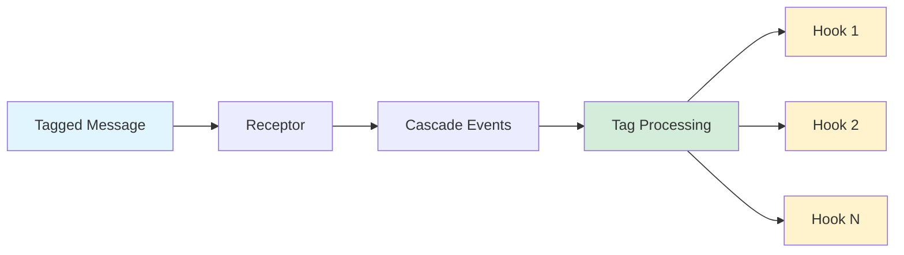
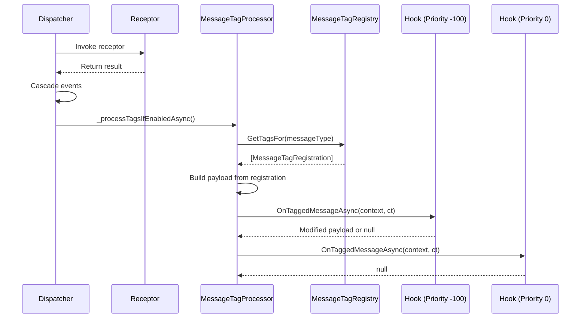

# Message Tags

Message tags enable **declarative cross-cutting concerns** - attach attributes to messages and hooks execute automatically when those messages are processed. Build notifications, telemetry, metrics, and audit logs without polluting business logic.

## Core Concept



**Tag Processing Flow**:
1. Message is dispatched and processed by receptor
2. After receptor completion, `MessageTagProcessor` checks for tag attributes
3. Registered hooks execute in priority order
4. Each hook receives the message, attribute, and extracted payload

## What Are Message Tags?

Message tags provide a **declarative way** to apply cross-cutting concerns to messages without coupling your business logic to infrastructure concerns like notifications, tracing, or metrics.

**Key Benefits**:
- **Separation of Concerns**: Business logic stays focused on domain behavior
- **Compile-Time Discovery**: Source generator discovers tags at build time (zero reflection)
- **Type-Safe**: Full IntelliSense support and compile-time checking
- **Extensible**: Create custom tag attributes for your domain needs
- **AOT Compatible**: No runtime reflection or dynamic code generation

### How It Works

```csharp{title="Tag Processing Pipeline" description="Understanding the message tag processing flow" category="Architecture" difficulty="INTERMEDIATE" tags=["Tags", "Architecture", "Pipeline"]}
// 1. Decorate messages with tag attributes
[NotificationTag(Tag = "order-created", Properties = ["OrderId", "CustomerId"])]
[TelemetryTag(Tag = "order-telemetry", SpanName = "CreateOrder")]
public record OrderCreatedEvent(Guid OrderId, Guid CustomerId, decimal Total) : IEvent;

// 2. Message flows through dispatcher
dispatcher.Dispatch(new OrderCreatedEvent(...));
  // → Receptor executes
  // → Cascade events (if any)
  // → _processTagsIfEnabledAsync() called
  //   → MessageTagRegistry.GetTagsFor(typeof(OrderCreatedEvent))
  //   → For each registration:
  //     → Build payload from Properties/ExtraJson
  //     → Invoke matching hooks in priority order

// 3. Hooks process the tagged message
public class NotificationHook : IMessageTagHook<NotificationTagAttribute> {
  public async ValueTask<JsonElement?> OnTaggedMessageAsync(
      TagContext<NotificationTagAttribute> context,
      CancellationToken ct) {
    // Send notification using context.Payload
    return null;
  }
}
```

## Quick Start

### 1. Configure Tag Hooks {#configuration} {#hook-registration}

Register hooks in your `Program.cs` or `Startup.cs`:

```csharp{title="Configuring Tag Hooks" description="Register hooks for tag attributes in AddWhizbang" category="Configuration" difficulty="BEGINNER" tags=["Tags", "Configuration", "Hooks"]}
services.AddWhizbang(options => {
  // Register hooks for built-in tag types
  options.Tags.UseHook<NotificationTagAttribute, SignalRNotificationHook>();
  options.Tags.UseHook<TelemetryTagAttribute, OpenTelemetryHook>();
  options.Tags.UseHook<MetricTagAttribute, PrometheusMetricHook>();

  // Register hooks for custom tag attributes
  options.Tags.UseHook<AuditEventAttribute, AuditLogHook>();

  // Optional: Universal hook for ALL tagged messages
  options.Tags.UseUniversalHook<LoggingHook>();
});
```

**Priority Control**: Hooks execute in ascending priority order (lower values first):

```csharp{title="Hook Priority Configuration" description="Control hook execution order with priority values" category="Configuration" difficulty="INTERMEDIATE" tags=["Tags", "Hooks", "Priority"]}
options.Tags.UseHook<NotificationTagAttribute, ValidationHook>(priority: -100);  // First
options.Tags.UseHook<NotificationTagAttribute, NotificationHook>(priority: 0);   // Default
options.Tags.UseHook<NotificationTagAttribute, AuditHook>(priority: 500);        // Last
```

### 2. Tag Your Messages

Apply tag attributes to events and commands:

```csharp{title="Tagging Messages" description="Apply tag attributes to events and commands" category="Usage" difficulty="BEGINNER" tags=["Tags", "Events", "Attributes"]}
// Notification tag - for real-time notifications
[NotificationTag(
    Tag = "order-created",
    Properties = ["OrderId", "CustomerId"],
    Group = "customer-{CustomerId}",
    Priority = NotificationPriority.Normal)]
public record OrderCreatedEvent(Guid OrderId, Guid CustomerId, decimal Total) : IEvent;

// Telemetry tag - for distributed tracing
[TelemetryTag(
    Tag = "payment-processed",
    SpanName = "ProcessPayment",
    Kind = SpanKind.Internal,
    RecordAsEvent = true)]
public record PaymentProcessedEvent(Guid PaymentId, decimal Amount) : IEvent;

// Metric tag - for counters/gauges
[MetricTag(
    Tag = "orders-metric",
    MetricName = "orders.created",
    Type = MetricType.Counter,
    Properties = ["TenantId", "Region"])]
public record OrderCountEvent(Guid OrderId, string TenantId, string Region) : IEvent;

// Multiple tags on one message
[NotificationTag(Tag = "payment-completed", Properties = ["PaymentId", "Amount"])]
[TelemetryTag(Tag = "payment-trace", SpanName = "CompletePayment")]
[MetricTag(Tag = "payment-amount", MetricName = "payments.total", Type = MetricType.Histogram, ValueProperty = "Amount")]
public record PaymentCompletedEvent(Guid PaymentId, decimal Amount) : IEvent;
```

### 3. Implement a Hook {#hooks}

Create hooks that respond to tagged messages:

```csharp{title="Implementing a Tag Hook" description="Create a hook that responds to tagged messages" category="Implementation" difficulty="INTERMEDIATE" tags=["Tags", "Hooks", "SignalR"]}
public class SignalRNotificationHook : IMessageTagHook<NotificationTagAttribute> {
  private readonly IHubContext<NotificationHub> _hubContext;
  private readonly MyDbContext _dbContext; // Scoped services work!

  public SignalRNotificationHook(
      IHubContext<NotificationHub> hubContext,
      MyDbContext dbContext) {
    _hubContext = hubContext;
    _dbContext = dbContext;
  }

  public async ValueTask<JsonElement?> OnTaggedMessageAsync(
      TagContext<NotificationTagAttribute> context,
      CancellationToken ct) {

    // Access the tag identifier
    var tag = context.Attribute.Tag;  // e.g., "order-created"

    // Access notification-specific properties
    var group = context.Attribute.Group;      // e.g., "customer-{CustomerId}"
    var priority = context.Attribute.Priority; // NotificationPriority.High

    // Resolve group template placeholders
    var resolvedGroup = _resolveGroupTemplate(group, context.Payload);

    // Access the payload (JSON with extracted properties)
    var payload = context.Payload;
    var orderId = payload.GetProperty("OrderId").GetGuid();

    // Access scope data (tenant, user, correlation ID)
    var tenantId = context.Scope?["TenantId"];

    // Send notification via SignalR
    await _hubContext.Clients.Group(resolvedGroup).SendAsync(
        "Notification",
        new { Tag = tag, Data = payload, Priority = priority },
        ct);

    // Return null to keep original payload
    // Or return modified JsonElement for subsequent hooks
    return null;
  }

  private string _resolveGroupTemplate(string? template, JsonElement payload) {
    if (template is null) return "all";

    // Replace {PropertyName} placeholders with values from payload
    var resolved = template;
    foreach (var prop in payload.EnumerateObject()) {
      resolved = resolved.Replace($"{{{prop.Name}}}", prop.Value.ToString());
    }
    return resolved;
  }
}
```

## Tag Processing Pipeline {#processing}

The `MessageTagProcessor` orchestrates tag hook execution after successful receptor completion. This is invoked by the dispatcher's `_processTagsIfEnabledAsync()` method.

### Processing Flow



### Processing Modes

#### AfterReceptorCompletion (Default)

Tags are processed immediately after receptor completion:

```
Message → Receptor → Cascade Events → TAG PROCESSING → Lifecycle Stages
```

This is the most common mode and ensures tags are processed as soon as the message handler completes.

#### AsLifecycleStage

Tags are processed during lifecycle invocation (use when hooks depend on lifecycle receptors):

```
Message → Receptor → Cascade Events → Lifecycle Stages → TAG PROCESSING
```

```csharp{title="Lifecycle Stage Mode" description="Process tags during lifecycle stage instead of immediately" category="Configuration" difficulty="INTERMEDIATE" tags=["Tags", "Configuration", "Lifecycle"]}
services.AddWhizbang(options => {
  options.TagProcessingMode = TagProcessingMode.AsLifecycleStage;
});
```

### When Tag Processing Is Skipped

Tag processing is skipped when:
- `EnableTagProcessing` is set to `false`
- `TagProcessingMode` is set to `AsLifecycleStage` (processed later during lifecycle)
- No `IMessageTagProcessor` is registered
- No tags are registered for the message type

## Tag Context {#tag-context}

The `TagContext<TAttribute>` provides hooks with all necessary data for processing tagged messages:

| Property | Type | Description |
|----------|------|-------------|
| `Attribute` | `TAttribute` | The tag attribute instance with configured values (Tag, Properties, etc.) |
| `AttributeType` | `Type` | The attribute type for generic handling |
| `Message` | `object` | The original message object |
| `MessageType` | `Type` | The message's runtime type |
| `Payload` | `JsonElement` | JSON payload with extracted properties, event data, and extra JSON |
| `Scope` | `IScopeContext?` | Security scope context (tenant, user, roles, permissions) from the message envelope |
| `Stage` | `LifecycleStage` | The lifecycle stage at which this hook is being invoked |

### Lifecycle Stage {#lifecycle-stage}

The `Stage` property tells hooks **when** in the message lifecycle they are being called. Hooks fire at every stage — use `Stage` to decide whether to act.

This is especially useful when the same hook is invoked from multiple callers (Dispatcher, ReceptorInvoker, PerspectiveWorker). Instead of server-side filtering, hooks inspect the stage and decide locally:

```csharp{title="Filtering by Lifecycle Stage" description="Hook that only sends notifications after perspective checkpoint commits" category="Implementation" difficulty="INTERMEDIATE" tags=["Tags", "LifecycleStage", "Hooks"]}
public class SignalRNotificationHook : IMessageTagHook<NotificationTagAttribute> {
  private readonly IHubContext<NotificationHub> _hubContext;

  public SignalRNotificationHook(IHubContext<NotificationHub> hubContext) {
    _hubContext = hubContext;
  }

  public async ValueTask<JsonElement?> OnTaggedMessageAsync(
      TagContext<NotificationTagAttribute> context, CancellationToken ct) {
    // Only send notifications after perspective checkpoint is committed
    if (context.Stage != LifecycleStage.PostPerspectiveInline)
      return null;

    await _hubContext.Clients.All.SendAsync(
        "Notification",
        new { Tag = context.Attribute.Tag, Data = context.Payload },
        ct);

    return null;
  }
}
```

:::tip
The `LifecycleStage` enum has 20 values. The special value `AfterReceptorCompletion` (-1) fires synchronously after the receptor completes, before any lifecycle stages are invoked.
:::

### Payload Structure

The payload is a flat JSON object built from two sources:

1. **Extracted Properties**: Fields listed in the `Properties` array
2. **Extra JSON**: Merged content from the `ExtraJson` property

`Properties` controls what lands in the payload:

- **Explicit array** like `["OrderId", "CustomerId"]` — only those fields are extracted.
- **Explicit empty array** `[]` — no fields are extracted; the tag fires with just a tag name and any `ExtraJson`. Use this when the tag itself (not its data) is the signal.
- **Omitted** (null) — the generator falls back to every public property on the event type. Preserved for backward compat; **not recommended** because payloads travel over real-time transports and oversized payloads are easy to create by accident.

```csharp{title="Understanding Payload Structure" description="How tag payloads are constructed" category="Internals" difficulty="INTERMEDIATE" tags=["Tags", "Payload", "JSON"]}
[NotificationTag(
    Tag = "order-created",
    Properties = ["OrderId", "CustomerId"],
    ExtraJson = """{"source": "api", "version": 2}""")]
public record OrderCreatedEvent(Guid OrderId, Guid CustomerId, decimal Total, string InternalNote);

// When dispatched: new OrderCreatedEvent(Guid.NewGuid(), Guid.NewGuid(), 99.99m, "Internal note")
// Payload structure:
// {
//   "OrderId": "3fa85f64-5717-4562-b3fc-2c963f66afa6",
//   "CustomerId": "6ba7b810-9dad-11d1-80b4-00c04fd430c8",
//   "source": "api",
//   "version": 2
// }
```

### Accessing Payload Data

```csharp{title="Working with Payload Data" description="Reading values from the tag payload JsonElement" category="Implementation" difficulty="BEGINNER" tags=["Tags", "Payload", "JSON"]}
public async ValueTask<JsonElement?> OnTaggedMessageAsync(
    TagContext<NotificationTagAttribute> context,
    CancellationToken ct) {

  var payload = context.Payload;

  // Access extracted properties
  var orderId = payload.GetProperty("OrderId").GetGuid();
  var customerId = payload.GetProperty("CustomerId").GetGuid();

  // Access extra JSON (merged into the same flat object)
  if (payload.TryGetProperty("source", out var source)) {
    var sourceValue = source.GetString(); // "api"
  }

  // Need a field that wasn't in Properties? Read it from the strongly-typed
  // Message instead — the full event is on TagContext.Message.
  if (context.Message is OrderCreatedEvent evt) {
    var total = evt.Total;
  }

  return null;
}
```

### Payload Size Thresholds

The processor measures each built payload and flags oversized ones via `TagOptions`:

| Option | Default | Behavior |
|--------|---------|----------|
| `PayloadSizeWarningThresholdBytes` | `8192` | Logs a warning with message type, tag, and size |
| `PayloadSizeErrorThresholdBytes` | `null` (disabled) | Throws `InvalidOperationException`; the hook does not fire |

```csharp{title="Configuring payload size thresholds" description="Catch runaway tag payloads before they ship" category="Configuration" difficulty="BEGINNER" tags=["Tags", "Configuration"]}
services.AddWhizbang(options => {
  options.Tags.PayloadSizeWarningThresholdBytes = 4096;
  options.Tags.PayloadSizeErrorThresholdBytes = 65_536;
});
```

Typical root cause when this fires: a tag attribute omitted `Properties`, so the generator extracted every public property on the event — including fields the hook does not need.

## Built-in Tag Attributes {#built-in-tags}

Whizbang includes three built-in tag attributes for common observability scenarios:

| Attribute | Purpose | Key Properties |
|-----------|---------|----------------|
| `NotificationTagAttribute` | Real-time notifications | `Tag`, `Properties`, `Group`, `Priority` |
| `TelemetryTagAttribute` | Distributed tracing | `Tag`, `SpanName`, `Kind`, `RecordAsEvent` |
| `MetricTagAttribute` | Metrics/counters | `Tag`, `MetricName`, `Type`, `ValueProperty`, `Unit` |

All tag attributes inherit from `MessageTagAttribute` and support these base properties:

| Property | Type | Description |
|----------|------|-------------|
| `Tag` | `string` (required) | Unique identifier for this tag |
| `Properties` | `string[]?` | Property names to extract into payload. `null` = every public property (backward-compat fallback), `[]` = no fields extracted |
| `ExtraJson` | `string?` | Additional JSON to merge into payload |

### NotificationTagAttribute {#notification-tag}

Tags messages for real-time notification delivery through SignalR, WebSockets, or other push mechanisms:

```csharp{title="NotificationTag Properties" description="Full property reference for NotificationTagAttribute" category="Reference" difficulty="BEGINNER" tags=["Tags", "Notifications", "API"]}
[NotificationTag(
    Tag = "order-shipped",              // Unique identifier for this notification type
    Properties = ["OrderId", "TrackingNumber"],  // Properties to extract into payload
    Group = "customer-{CustomerId}",    // Target group with {PropertyName} placeholders
    Priority = NotificationPriority.High, // Delivery priority
    ExtraJson = """{"category": "shipping"}"""  // Extra metadata
)]
public record OrderShippedEvent(
    Guid OrderId,
    Guid CustomerId,
    string TrackingNumber,
    DateTime ShippedAt);
```

**Properties**:

| Property | Type | Default | Description |
|----------|------|---------|-------------|
| `Tag` | `string` | (required) | Unique identifier for the notification |
| `Group` | `string?` | `null` | Target group/channel, supports `{PropertyName}` placeholders |
| `Priority` | `NotificationPriority` | `Normal` | Notification priority level |
| `Properties` | `string[]?` | `null` | Properties to extract from message (see Payload Structure for null vs `[]` semantics) |
| `ExtraJson` | `string?` | `null` | Additional JSON to merge |

**Group Templates**:

The `Group` property supports dynamic resolution using property placeholders:

```csharp{title="Dynamic Group Resolution" description="Using property placeholders in notification groups" category="Usage" difficulty="INTERMEDIATE" tags=["Tags", "Notifications", "Groups"]}
// Target specific customer
[NotificationTag(Tag = "order-update", Group = "customer-{CustomerId}")]

// Target specific tenant
[NotificationTag(Tag = "user-action", Group = "tenant-{TenantId}")]

// Target specific user
[NotificationTag(Tag = "direct-message", Group = "user-{UserId}")]

// Broadcast to all
[NotificationTag(Tag = "system-alert", Group = "all")]

// Multiple segments
[NotificationTag(Tag = "order-event", Group = "tenant-{TenantId}-orders")]
```

#### NotificationPriority {#notification-priority}

The `NotificationPriority` enum controls notification delivery urgency:

| Value | Description | Use Cases |
|-------|-------------|-----------|
| `Low` | Background notifications, may be batched | Informational updates, digest emails |
| `Normal` | Standard priority (default) | Regular notifications, status updates |
| `High` | Immediate delivery, prominent display | Order confirmations, important updates |
| `Critical` | Urgent system alerts, bypass user preferences | System failures, security alerts |

```csharp{title="Using Notification Priority" description="Apply appropriate priority levels to notifications" category="Usage" difficulty="BEGINNER" tags=["Tags", "Notifications", "Priority"]}
// Low priority - can be batched
[NotificationTag(Tag = "weekly-summary", Priority = NotificationPriority.Low)]
public record WeeklySummaryEvent(...);

// Normal priority - standard delivery
[NotificationTag(Tag = "order-status", Priority = NotificationPriority.Normal)]
public record OrderStatusChangedEvent(...);

// High priority - immediate attention
[NotificationTag(Tag = "payment-failed", Priority = NotificationPriority.High)]
public record PaymentFailedEvent(...);

// Critical priority - urgent system alert
[NotificationTag(Tag = "security-breach", Priority = NotificationPriority.Critical)]
public record SecurityBreachEvent(...);
```

### TelemetryTagAttribute {#telemetry-tag}

Tags messages for OpenTelemetry distributed tracing integration:

```csharp{title="TelemetryTag Properties" description="Full property reference for TelemetryTagAttribute" category="Reference" difficulty="BEGINNER" tags=["Tags", "Telemetry", "API"]}
[TelemetryTag(
    Tag = "payment-processed",          // Unique identifier
    SpanName = "ProcessPayment",        // OpenTelemetry span name
    Kind = SpanKind.Internal,           // Span kind (Internal, Server, Client, etc.)
    RecordAsEvent = true,               // Record as span event (default)
    Properties = ["PaymentId", "Amount"] // Properties to include as span attributes
)]
public record PaymentProcessedEvent(Guid PaymentId, decimal Amount, string Currency);
```

**Properties**:

| Property | Type | Default | Description |
|----------|------|---------|-------------|
| `Tag` | `string` | (required) | Unique identifier for the telemetry tag |
| `SpanName` | `string?` | `Tag` value | OpenTelemetry span name (defaults to Tag if not specified) |
| `Kind` | `SpanKind` | `Internal` | Span kind for distributed tracing |
| `RecordAsEvent` | `bool` | `true` | Record message as span event with properties |
| `Properties` | `string[]?` | `null` | Properties to include as span attributes (see Payload Structure for null vs `[]` semantics) |
| `ExtraJson` | `string?` | `null` | Additional metadata |

#### SpanKind {#span-kind}

The `SpanKind` enum specifies the relationship of a span to its parent in distributed traces:

| Value | Description | Use Cases |
|-------|-------------|-----------|
| `Internal` | Internal operation (default) | Local function calls, database queries, business logic |
| `Server` | Server-side request handling | HTTP endpoints, gRPC service handlers |
| `Client` | Client-side outgoing request | HTTP client calls, database client queries |
| `Producer` | Message publishing | Publishing to message broker, event bus |
| `Consumer` | Message consumption | Consuming from queue, processing events |

```csharp{title="Using SpanKind" description="Choose appropriate span kinds for different scenarios" category="Usage" difficulty="INTERMEDIATE" tags=["Tags", "Telemetry", "Tracing"]}
// Internal - default for business logic
[TelemetryTag(Tag = "order-validation", SpanName = "ValidateOrder", Kind = SpanKind.Internal)]
public record OrderValidatedEvent(...);

// Server - handling incoming requests
[TelemetryTag(Tag = "api-request", SpanName = "HandleOrderRequest", Kind = SpanKind.Server)]
public record OrderRequestReceivedEvent(...);

// Client - making outgoing calls
[TelemetryTag(Tag = "payment-gateway", SpanName = "CallPaymentGateway", Kind = SpanKind.Client)]
public record PaymentGatewayCalledEvent(...);

// Producer - publishing messages
[TelemetryTag(Tag = "order-published", SpanName = "PublishOrderEvent", Kind = SpanKind.Producer)]
public record OrderPublishedEvent(...);

// Consumer - processing messages
[TelemetryTag(Tag = "order-consumed", SpanName = "ConsumeOrderEvent", Kind = SpanKind.Consumer)]
public record OrderConsumedEvent(...);
```

### MetricTagAttribute {#metric-tag}

Tags messages for OpenTelemetry metrics recording:

```csharp{title="MetricTag Properties" description="Full property reference for MetricTagAttribute" category="Reference" difficulty="BEGINNER" tags=["Tags", "Metrics", "API"]}
// Counter metric - counts occurrences
[MetricTag(
    Tag = "order-created",
    MetricName = "orders.created",      // Metric name following OpenTelemetry conventions
    Type = MetricType.Counter,          // Counter type (default)
    Properties = ["TenantId", "Region"], // Dimensions/labels for segmentation
    Unit = "count"                      // Optional unit of measurement
)]
public record OrderCreatedEvent(Guid OrderId, string TenantId, string Region);

// Histogram metric - records value distribution
[MetricTag(
    Tag = "order-amount",
    MetricName = "orders.amount",
    Type = MetricType.Histogram,
    ValueProperty = "TotalAmount",      // Property to use as metric value
    Properties = ["TenantId"],
    Unit = "USD"
)]
public record OrderCompletedEvent(Guid OrderId, decimal TotalAmount, string TenantId);

// Gauge metric - point-in-time value
[MetricTag(
    Tag = "queue-depth",
    MetricName = "orders.queue.depth",
    Type = MetricType.Gauge,
    ValueProperty = "QueueDepth",
    Unit = "items"
)]
public record OrderQueueDepthEvent(int QueueDepth, string QueueName);
```

**Properties**:

| Property | Type | Default | Description |
|----------|------|---------|-------------|
| `Tag` | `string` | (required) | Unique identifier for the metric tag |
| `MetricName` | `string` | (required) | OpenTelemetry metric name (e.g., "orders.created") |
| `Type` | `MetricType` | `Counter` | Type of metric to record |
| `ValueProperty` | `string?` | `null` | Property name to use as metric value (required for Histogram/Gauge) |
| `Unit` | `string?` | `null` | Unit of measurement (e.g., "ms", "bytes", "USD") |
| `Properties` | `string[]?` | `null` | Properties to use as metric dimensions/labels (see Payload Structure for null vs `[]` semantics) |
| `ExtraJson` | `string?` | `null` | Additional metadata |

#### MetricType {#metric-type}

The `MetricType` enum specifies the type of metric to record:

| Value | Description | Use Cases | Value Source |
|-------|-------------|-----------|--------------|
| `Counter` | Monotonically increasing value | Request counts, orders created, errors | Defaults to 1 if `ValueProperty` not specified |
| `Histogram` | Distribution of values | Request duration, order amounts, payload sizes | Requires `ValueProperty` |
| `Gauge` | Point-in-time value | Current memory usage, queue depth, active connections | Requires `ValueProperty` |

```csharp{title="Using Metric Types" description="Choose appropriate metric types for different measurements" category="Usage" difficulty="INTERMEDIATE" tags=["Tags", "Metrics", "Types"]}
// Counter - count occurrences (increments by 1)
[MetricTag(
    Tag = "order-created",
    MetricName = "orders.created.total",
    Type = MetricType.Counter,
    Properties = ["TenantId", "Region"])]
public record OrderCreatedEvent(Guid OrderId, string TenantId, string Region);

// Counter with custom value - weighted count
[MetricTag(
    Tag = "items-ordered",
    MetricName = "orders.items.total",
    Type = MetricType.Counter,
    ValueProperty = "ItemCount",  // Increment by ItemCount instead of 1
    Properties = ["TenantId"])]
public record OrderCreatedEvent(Guid OrderId, int ItemCount, string TenantId);

// Histogram - measure distribution
[MetricTag(
    Tag = "order-amount",
    MetricName = "orders.amount",
    Type = MetricType.Histogram,
    ValueProperty = "Total",
    Properties = ["TenantId", "Currency"],
    Unit = "USD")]
public record OrderCompletedEvent(Guid OrderId, decimal Total, string TenantId, string Currency);

// Gauge - current value snapshot
[MetricTag(
    Tag = "queue-size",
    MetricName = "processing.queue.size",
    Type = MetricType.Gauge,
    ValueProperty = "CurrentSize",
    Unit = "messages")]
public record QueueSizeChangedEvent(string QueueName, int CurrentSize);
```

**Common Units**: Following OpenTelemetry conventions:

| Unit | Description | Examples |
|------|-------------|----------|
| `ms` | Milliseconds | Request duration, processing time |
| `s` | Seconds | Timeout values, uptime |
| `bytes` | Byte count | Payload size, memory usage |
| `count` | Item count | Order count, user count |
| `requests` | Request count | API calls, database queries |
| `USD`, `EUR`, `GBP` | Currency | Order amounts, revenue |
| `%` | Percentage | CPU usage, success rate |

## Message Tag Registry {#registry}

The `MessageTagRegistry` is the central registry that aggregates tag registrations from all loaded assemblies. It uses the `AssemblyRegistry<IMessageTagRegistry>` pattern for multi-assembly support.

### How It Works

1. **Compile Time**: Source generator discovers tag attributes and generates `IMessageTagRegistry` implementation
2. **Module Initialization**: `[ModuleInitializer]` registers the generated registry before `Main()` runs
3. **Runtime**: `MessageTagProcessor` queries registry to find tags for message types

```csharp{title="Registry Architecture" description="Understanding how tag registries work across assemblies" category="Architecture" difficulty="ADVANCED" tags=["Tags", "Registry", "Multi-Assembly"]}
// Generated by MessageTagDiscoveryGenerator per assembly:
internal sealed class GeneratedMessageTagRegistry_MyAssembly : IMessageTagRegistry {
  public static readonly GeneratedMessageTagRegistry_MyAssembly Instance = new();

  public IEnumerable<MessageTagRegistration> GetTagsFor(Type messageType) {
    // Generated lookup logic
    if (messageType == typeof(OrderCreatedEvent)) {
      yield return new MessageTagRegistration {
        MessageType = typeof(OrderCreatedEvent),
        AttributeType = typeof(NotificationTagAttribute),
        Tag = "order-created",
        Properties = new[] { "OrderId", "CustomerId" },
        PayloadBuilder = _buildPayloadForOrderCreatedEvent,
        AttributeFactory = () => new NotificationTagAttribute {
          Tag = "order-created",
          Properties = new[] { "OrderId", "CustomerId" }
        }
      };
    }
  }

  private static JsonElement _buildPayloadForOrderCreatedEvent(object message) {
    var evt = (OrderCreatedEvent)message;
    return JsonSerializer.SerializeToElement(new {
      OrderId = evt.OrderId,
      CustomerId = evt.CustomerId
    });
  }
}

// Generated module initializer:
file static class ModuleInitializer {
  [ModuleInitializer]
  internal static void Initialize() {
    MessageTagRegistry.Register(
        GeneratedMessageTagRegistry_MyAssembly.Instance,
        priority: 100);  // Contracts = 100, Services = 1000
  }
}
```

### Static Registry API

```csharp{title="Using MessageTagRegistry" description="Querying the static tag registry" category="API" difficulty="ADVANCED" tags=["Tags", "Registry", "API"]}
// Query tags for a message type
var tags = MessageTagRegistry.GetTagsFor(typeof(OrderCreatedEvent));

foreach (var registration in tags) {
  Console.WriteLine($"Tag: {registration.Tag}");
  Console.WriteLine($"Attribute Type: {registration.AttributeType.Name}");
  Console.WriteLine($"Properties: {string.Join(", ", registration.Properties ?? [])}");
}

// Register a custom registry (usually done by [ModuleInitializer])
MessageTagRegistry.Register(customRegistry, priority: 500);

// Diagnostic: count registered registries
var registryCount = MessageTagRegistry.Count;
```

### Multi-Assembly Support

Tags can be defined in different assemblies with priority-based resolution:

- **Contracts assembly**: Priority 100 (checked first)
- **Services assembly**: Priority 1000 (checked after contracts)

```csharp{title="Multi-Assembly Tag Discovery" description="How tags are discovered across multiple assemblies" category="Architecture" difficulty="ADVANCED" tags=["Tags", "Multi-Assembly", "Registry"]}
// MyApp.Contracts (Priority 100)
[NotificationTag(Tag = "order-created", Properties = ["OrderId"])]
public record OrderCreatedEvent(Guid OrderId) : IEvent;

// MyApp.Services (Priority 1000)
// Tags from Contracts assembly are discovered first due to lower priority value

// At runtime:
MessageTagRegistry.GetTagsFor(typeof(OrderCreatedEvent))
  // → Queries MyApp.Contracts registry (priority 100) first
  // → Finds tag registration
  // → Returns registration
```

### Custom Attribute Dispatcher {#dispatcher-registry}

For custom tag attributes (not built-in Whizbang types), the source generator also produces a `MessageTagHookDispatcher` that enables AOT-compatible hook invocation:

```csharp{title="Generated Dispatcher Architecture" description="How custom attribute hooks are dispatched without reflection" category="Architecture" difficulty="ADVANCED" tags=["Tags", "Custom-Attributes", "AOT", "Source-Generation"]}
// Generated by MessageTagDiscoveryGenerator per assembly (only for custom attributes):
internal sealed class GeneratedMessageTagHookDispatcher_MyAssembly : IMessageTagHookDispatcher {
  public static readonly GeneratedMessageTagHookDispatcher_MyAssembly Instance = new();

  // Creates typed TagContext for each custom attribute type
  public object? TryCreateContext(
      Type attributeType,
      MessageTagAttribute attribute,
      object message,
      Type messageType,
      JsonElement payload,
      IReadOnlyDictionary<string, object?>? scope) {

    if (attributeType == typeof(AuditLogAttribute)) {
      return new TagContext<AuditLogAttribute> {
        Attribute = (AuditLogAttribute)attribute,
        Message = message,
        MessageType = messageType,
        Payload = payload,
        Scope = scope
      };
    }

    return null;
  }

  // Dispatches to typed hook interface without reflection
  public async ValueTask<JsonElement?> TryDispatchAsync(
      object hookInstance,
      object context,
      Type attributeType,
      CancellationToken ct) {

    if (attributeType == typeof(AuditLogAttribute) &&
        hookInstance is IMessageTagHook<AuditLogAttribute> typedHook &&
        context is TagContext<AuditLogAttribute> typedContext) {
      return await typedHook.OnTaggedMessageAsync(typedContext, ct);
    }

    return null;
  }
}

// Generated module initializer registers the dispatcher:
file static class DispatcherModuleInitializer {
  [ModuleInitializer]
  internal static void Initialize() {
    MessageTagHookDispatcherRegistry.Register(
        GeneratedMessageTagHookDispatcher_MyAssembly.Instance,
        priority: 100);
  }
}
```

**Key Points**:
- Built-in types (NotificationTagAttribute, TelemetryTagAttribute, MetricTagAttribute) have fast paths in `MessageTagProcessor`
- Custom attributes get generated dispatchers for AOT-compatible hook invocation
- Zero reflection at runtime - all dispatch code is source-generated
- Each assembly with custom attributes gets its own dispatcher

## Message Tag Registration {#registration}

Each `MessageTagRegistration` contains metadata for a tagged message type:

| Property | Type | Description |
|----------|------|-------------|
| `MessageType` | `Type` | The message type with the tag attribute |
| `AttributeType` | `Type` | The tag attribute type (e.g., `NotificationTagAttribute`) |
| `Tag` | `string` | The tag value from the attribute |
| `Properties` | `string[]?` | Property names to extract |
| `ExtraJson` | `string?` | Additional JSON to merge |
| `PayloadBuilder` | `Func<object, JsonElement>` | Compiled delegate for building payload (zero reflection) |
| `AttributeFactory` | `Func<MessageTagAttribute>` | Factory for creating attribute instance |

**Key Point**: `PayloadBuilder` is a **source-generated delegate** that extracts properties without reflection, ensuring AOT compatibility and high performance.

## Custom Tag Attributes {#custom-tags}

Create domain-specific tag attributes by inheriting from `MessageTagAttribute`:

```csharp{title="Custom Tag Attribute" description="Create a custom tag attribute for domain-specific concerns" category="Extensibility" difficulty="INTERMEDIATE" tags=["Tags", "Custom-Attributes", "Extensibility"]}
// 1. Define the attribute
[AttributeUsage(AttributeTargets.Class | AttributeTargets.Struct, AllowMultiple = true, Inherited = true)]
public sealed class AuditLogAttribute : MessageTagAttribute {
  /// <summary>
  /// The audit category (e.g., "Security", "Compliance", "Operations")
  /// </summary>
  public required string Category { get; init; }

  /// <summary>
  /// The audit severity level
  /// </summary>
  public AuditSeverity Severity { get; init; } = AuditSeverity.Information;

  /// <summary>
  /// Whether to archive this audit log for long-term retention
  /// </summary>
  public bool Archive { get; init; }
}

public enum AuditSeverity {
  Information,
  Warning,
  Critical
}

// 2. Apply to messages
[AuditLog(
    Tag = "user-login",
    Category = "Security",
    Severity = AuditSeverity.Information,
    Properties = ["UserId", "IpAddress", "Timestamp"],
    Archive = true)]
public record UserLoginEvent(Guid UserId, string IpAddress, DateTime Timestamp) : IEvent;

[AuditLog(
    Tag = "payment-failed",
    Category = "Compliance",
    Severity = AuditSeverity.Warning,
    Properties = ["PaymentId", "Amount", "Reason"],
    Archive = true)]
public record PaymentFailedEvent(Guid PaymentId, decimal Amount, string Reason) : IEvent;

// 3. Implement hook
public class AuditLogHook : IMessageTagHook<AuditLogAttribute> {
  private readonly IAuditService _auditService;
  private readonly ILogger<AuditLogHook> _logger;

  public AuditLogHook(IAuditService auditService, ILogger<AuditLogHook> logger) {
    _auditService = auditService;
    _logger = logger;
  }

  public async ValueTask<JsonElement?> OnTaggedMessageAsync(
      TagContext<AuditLogAttribute> context,
      CancellationToken ct) {

    var tag = context.Attribute.Tag;
    var category = context.Attribute.Category;
    var severity = context.Attribute.Severity;
    var archive = context.Attribute.Archive;

    // Extract tenant from scope
    var tenantId = context.Scope?["TenantId"]?.ToString();

    // Create audit entry
    var auditEntry = new AuditEntry {
      Tag = tag,
      Category = category,
      Severity = severity,
      Timestamp = DateTime.UtcNow,
      TenantId = tenantId,
      MessageType = context.MessageType.Name,
      Payload = context.Payload,
      Archive = archive
    };

    // Write to audit log
    await _auditService.WriteAuditLogAsync(auditEntry, ct);

    _logger.LogInformation(
        "Audit log written: {Tag} (Category: {Category}, Severity: {Severity})",
        tag, category, severity);

    return null;
  }
}

// 4. Register hook
services.AddWhizbang(options => {
  options.Tags.UseHook<AuditLogAttribute, AuditLogHook>();
});
```

### Advanced Custom Tag Example

Create a Slack notification tag with rich formatting options:

```csharp{title="Advanced Custom Tag" description="Create a sophisticated custom tag with multiple properties" category="Extensibility" difficulty="ADVANCED" tags=["Tags", "Custom-Attributes", "Slack", "Notifications"]}
[AttributeUsage(AttributeTargets.Class | AttributeTargets.Struct, AllowMultiple = true, Inherited = true)]
public sealed class SlackNotificationAttribute : MessageTagAttribute {
  public required string Channel { get; init; }
  public string Emoji { get; init; } = ":bell:";
  public string? Username { get; init; }
  public SlackColor Color { get; init; } = SlackColor.Info;
  public bool MentionOnCall { get; init; }
}

public enum SlackColor {
  Good,   // Green
  Info,   // Blue
  Warning, // Yellow
  Danger  // Red
}

// Apply to events
[SlackNotification(
    Tag = "deployment-started",
    Channel = "#deployments",
    Emoji = ":rocket:",
    Color = SlackColor.Info,
    Properties = ["Version", "Environment"])]
public record DeploymentStartedEvent(string Version, string Environment) : IEvent;

[SlackNotification(
    Tag = "deployment-failed",
    Channel = "#deployments",
    Emoji = ":rotating_light:",
    Color = SlackColor.Danger,
    MentionOnCall = true,
    Properties = ["Version", "Environment", "Error"])]
public record DeploymentFailedEvent(string Version, string Environment, string Error) : IEvent;

// Hook implementation
public class SlackNotificationHook : IMessageTagHook<SlackNotificationAttribute> {
  private readonly ISlackClient _slackClient;

  public SlackNotificationHook(ISlackClient slackClient) {
    _slackClient = slackClient;
  }

  public async ValueTask<JsonElement?> OnTaggedMessageAsync(
      TagContext<SlackNotificationAttribute> context,
      CancellationToken ct) {

    var attr = context.Attribute;

    // Build Slack message
    var message = new SlackMessage {
      Channel = attr.Channel,
      Username = attr.Username ?? "Whizbang Bot",
      IconEmoji = attr.Emoji,
      Attachments = new[] {
        new SlackAttachment {
          Color = _mapColor(attr.Color),
          Title = attr.Tag,
          Fields = _buildFields(context.Payload),
          Timestamp = DateTimeOffset.UtcNow.ToUnixTimeSeconds()
        }
      }
    };

    // Add @oncall mention if critical
    if (attr.MentionOnCall) {
      message.Text = "<!subteam^oncall> Critical alert";
    }

    await _slackClient.SendMessageAsync(message, ct);

    return null;
  }

  private string _mapColor(SlackColor color) => color switch {
    SlackColor.Good => "good",
    SlackColor.Info => "#439FE0",
    SlackColor.Warning => "warning",
    SlackColor.Danger => "danger",
    _ => "#000000"
  };

  private SlackField[] _buildFields(JsonElement payload) {
    var fields = new List<SlackField>();
    foreach (var prop in payload.EnumerateObject()) {
      fields.Add(new SlackField {
        Title = prop.Name,
        Value = prop.Value.ToString(),
        Short = true
      });
    }
    return fields.ToArray();
  }
}
```

## Hook Implementation Patterns

### Payload Modification

Hooks can modify the payload for subsequent hooks in the chain:

```csharp{title="Payload Modification Hook" description="Modify payload for subsequent hooks" category="Advanced" difficulty="ADVANCED" tags=["Tags", "Hooks", "Payload-Modification"]}
public class EnrichmentHook : IMessageTagHook<NotificationTagAttribute> {
  private readonly IUserService _userService;

  public EnrichmentHook(IUserService userService) {
    _userService = userService;
  }

  public async ValueTask<JsonElement?> OnTaggedMessageAsync(
      TagContext<NotificationTagAttribute> context,
      CancellationToken ct) {

    // Get customer ID from payload
    var customerId = context.Payload.GetProperty("CustomerId").GetGuid();

    // Enrich with customer name
    var customerName = await _userService.GetCustomerNameAsync(customerId, ct);

    // Build modified payload
    var enriched = new Dictionary<string, object?>();

    // Copy existing properties
    foreach (var prop in context.Payload.EnumerateObject()) {
      enriched[prop.Name] = prop.Value;
    }

    // Add enrichment
    enriched["CustomerName"] = customerName;

    // Return modified payload for next hook
    return JsonSerializer.SerializeToElement(enriched);
  }
}

// Register enrichment hook first (lower priority)
options.Tags.UseHook<NotificationTagAttribute, EnrichmentHook>(priority: -200);
options.Tags.UseHook<NotificationTagAttribute, NotificationHook>(priority: 0);
```

### Universal Hook (All Tag Types)

Create a hook that handles all tag types using the base `MessageTagAttribute`:

```csharp{title="Universal Tag Hook" description="Hook that processes all tag types" category="Advanced" difficulty="ADVANCED" tags=["Tags", "Hooks", "Universal"]}
public class UniversalTagLoggerHook : IMessageTagHook<MessageTagAttribute> {
  private readonly ILogger<UniversalTagLoggerHook> _logger;

  public UniversalTagLoggerHook(ILogger<UniversalTagLoggerHook> logger) {
    _logger = logger;
  }

  public ValueTask<JsonElement?> OnTaggedMessageAsync(
      TagContext<MessageTagAttribute> context,
      CancellationToken ct) {

    _logger.LogInformation(
        "Tagged message processed: {MessageType} with {AttributeType} (Tag: {Tag})",
        context.MessageType.Name,
        context.AttributeType.Name,
        context.Attribute.Tag);

    // Log payload keys (not full payload for privacy)
    var keys = context.Payload.EnumerateObject()
        .Select(p => p.Name)
        .ToArray();

    _logger.LogDebug("Payload keys: {Keys}", string.Join(", ", keys));

    // Don't modify payload
    return ValueTask.FromResult<JsonElement?>(null);
  }
}

// Register universal hook
options.Tags.UseUniversalHook<UniversalTagLoggerHook>(priority: -1000);
```

### Conditional Processing

```csharp{title="Conditional Hook Processing" description="Only process certain tags or messages" category="Advanced" difficulty="INTERMEDIATE" tags=["Tags", "Hooks", "Conditional"]}
public class ConditionalNotificationHook : IMessageTagHook<NotificationTagAttribute> {
  private readonly IHubContext<NotificationHub> _hubContext;
  private readonly IFeatureManager _featureManager;

  public ConditionalNotificationHook(
      IHubContext<NotificationHub> hubContext,
      IFeatureManager featureManager) {
    _hubContext = hubContext;
    _featureManager = featureManager;
  }

  public async ValueTask<JsonElement?> OnTaggedMessageAsync(
      TagContext<NotificationTagAttribute> context,
      CancellationToken ct) {

    // Skip processing if feature is disabled
    if (!await _featureManager.IsEnabledAsync("RealTimeNotifications", ct)) {
      return null;
    }

    // Only process high priority notifications
    if (context.Attribute.Priority < NotificationPriority.High) {
      return null;
    }

    // Only process for specific tenants
    var tenantId = context.Scope?["TenantId"]?.ToString();
    if (tenantId is null || !_isPremiumTenant(tenantId)) {
      return null;
    }

    // Send notification
    await _hubContext.Clients.All.SendAsync("Notification", context.Payload, ct);

    return null;
  }

  private bool _isPremiumTenant(string tenantId) {
    // Implementation
    return true;
  }
}
```

## DI Lifetime and Scoping {#di-lifetime}

Understanding how tag hooks interact with dependency injection is crucial for correct usage.

### Lifetime Configuration

- `IMessageTagProcessor`: **Singleton** (registered automatically)
- Tag Hooks: **Scoped** (new instance per message dispatch)

### How Scoping Works

```csharp{title="Tag Hook DI Scoping" description="Understanding scope creation for tag hooks" category="Architecture" difficulty="ADVANCED" tags=["Fundamentals", "Messages", "C#", "Tag", "Hook"]}
// 1. Dispatcher is Singleton, holds Singleton IMessageTagProcessor
public class Dispatcher : IDispatcher {
  private readonly IMessageTagProcessor _tagProcessor; // Singleton

  public async Task DispatchAsync<TMessage>(TMessage message) {
    // Invoke receptor...

    // 2. Tag processor creates NEW SCOPE for this message dispatch
    await _tagProcessor.ProcessTagsAsync(message, typeof(TMessage));
    // Scope is disposed after ProcessTagsAsync completes
  }
}

// 3. MessageTagProcessor creates scope
public class MessageTagProcessor : IMessageTagProcessor {
  private readonly IServiceScopeFactory _scopeFactory;

  public async ValueTask ProcessTagsAsync(object message, Type messageType, ...) {
    // Create async scope for this processing call
    await using var scope = _scopeFactory.CreateAsyncScope();

    // All hooks resolved from this scope share same scope
    foreach (var hookRegistration in hooks) {
      var hook = scope.ServiceProvider.GetService(hookRegistration.HookType);
      // Hook instance is SCOPED to this message dispatch
    }
    // Scope disposed here - DbContext, HttpContext, etc. are cleaned up
  }
}
```

### What This Enables

✅ **Scoped Services Work**: Inject `DbContext`, `IHttpContextAccessor`, etc.

```csharp{title="Scoped Service Injection" description="Using scoped services in tag hooks" category="Usage" difficulty="INTERMEDIATE" tags=["Tags", "DI", "Scoped-Services"]}
public class DatabaseAuditHook : IMessageTagHook<AuditLogAttribute> {
  private readonly MyDbContext _dbContext;  // Scoped service
  private readonly IHttpContextAccessor _httpContextAccessor;  // Scoped service

  public DatabaseAuditHook(
      MyDbContext dbContext,
      IHttpContextAccessor httpContextAccessor) {
    _dbContext = dbContext;
    _httpContextAccessor = httpContextAccessor;
  }

  public async ValueTask<JsonElement?> OnTaggedMessageAsync(
      TagContext<AuditLogAttribute> context,
      CancellationToken ct) {

    // Access HTTP context if available
    var ipAddress = _httpContextAccessor.HttpContext?.Connection.RemoteIpAddress?.ToString();

    // Write to database using scoped DbContext
    var auditLog = new AuditLog {
      Tag = context.Attribute.Tag,
      Category = context.Attribute.Category,
      Payload = context.Payload.GetRawText(),
      IpAddress = ipAddress,
      Timestamp = DateTime.UtcNow
    };

    _dbContext.AuditLogs.Add(auditLog);
    await _dbContext.SaveChangesAsync(ct);

    return null;
  }
}
```

✅ **Shared Scope**: Multiple hooks in same processing call share `DbContext`

```csharp{title="Shared Scope Across Hooks" description="Multiple hooks share the same scope and DbContext" category="Architecture" difficulty="ADVANCED" tags=["Tags", "DI", "Shared-Scope"]}
// Hook 1 - creates entities
public class Hook1 : IMessageTagHook<NotificationTagAttribute> {
  private readonly MyDbContext _db;

  public async ValueTask<JsonElement?> OnTaggedMessageAsync(...) {
    _db.Notifications.Add(new Notification { ... });
    await _db.SaveChangesAsync(ct);
    return null;
  }
}

// Hook 2 - reads entities created by Hook 1 (SAME DbContext instance!)
public class Hook2 : IMessageTagHook<NotificationTagAttribute> {
  private readonly MyDbContext _db;

  public async ValueTask<JsonElement?> OnTaggedMessageAsync(...) {
    // Can see entities added by Hook1 in same scope
    var count = await _db.Notifications.CountAsync(ct);
    return null;
  }
}

// Register both hooks
options.Tags.UseHook<NotificationTagAttribute, Hook1>(priority: -10);
options.Tags.UseHook<NotificationTagAttribute, Hook2>(priority: 0);
```

✅ **Fresh Scope Per Dispatch**: Each message gets new scope

⚠️ **Don't Store Scope-Dependent State**: Hook fields should not hold scoped service references across calls

```csharp{title="Scope Lifetime Pitfalls" description="Common mistakes with scoped services" category="Pitfalls" difficulty="INTERMEDIATE" tags=["Tags", "DI", "Pitfalls"]}
// ❌ WRONG - storing scoped service in field across calls
public class BadHook : IMessageTagHook<NotificationTagAttribute> {
  private readonly MyDbContext _db;
  private List<Notification> _pending = new();  // ❌ State stored across calls!

  public async ValueTask<JsonElement?> OnTaggedMessageAsync(...) {
    // This DbContext instance is SCOPED to one ProcessTagsAsync call
    // Next call will have a DIFFERENT DbContext instance
    _pending.Add(new Notification { ... });  // ❌ Wrong!
    await _db.SaveChangesAsync(ct);
    return null;
  }
}

// ✅ CORRECT - only use scoped services within method scope
public class GoodHook : IMessageTagHook<NotificationTagAttribute> {
  private readonly MyDbContext _db;

  public async ValueTask<JsonElement?> OnTaggedMessageAsync(...) {
    // Create notification
    var notification = new Notification { ... };

    // Save immediately within this call
    _db.Notifications.Add(notification);
    await _db.SaveChangesAsync(ct);

    return null;
  }
}
```

## Complete Examples

### Real-Time Order Notifications

```csharp{title="Complete Order Notification System" description="End-to-end example of tag-based order notifications" category="Example" difficulty="INTERMEDIATE" tags=["Tags", "Notifications", "SignalR", "Example"]}
// 1. Define events with notification tags
[NotificationTag(
    Tag = "order-created",
    Properties = ["OrderId", "CustomerId", "Total"],
    Group = "customer-{CustomerId}",
    Priority = NotificationPriority.Normal)]
public record OrderCreatedEvent(
    Guid OrderId,
    Guid CustomerId,
    decimal Total,
    DateTime CreatedAt) : IEvent;

[NotificationTag(
    Tag = "order-shipped",
    Properties = ["OrderId", "CustomerId", "TrackingNumber"],
    Group = "customer-{CustomerId}",
    Priority = NotificationPriority.High)]
public record OrderShippedEvent(
    Guid OrderId,
    Guid CustomerId,
    string TrackingNumber,
    DateTime ShippedAt) : IEvent;

[NotificationTag(
    Tag = "order-delivered",
    Properties = ["OrderId", "CustomerId"],
    Group = "customer-{CustomerId}",
    Priority = NotificationPriority.Normal)]
public record OrderDeliveredEvent(
    Guid OrderId,
    Guid CustomerId,
    DateTime DeliveredAt) : IEvent;

// 2. Create notification hook
public class OrderNotificationHook : IMessageTagHook<NotificationTagAttribute> {
  private readonly IHubContext<CustomerHub> _hubContext;
  private readonly ILogger<OrderNotificationHook> _logger;

  public OrderNotificationHook(
      IHubContext<CustomerHub> hubContext,
      ILogger<OrderNotificationHook> logger) {
    _hubContext = hubContext;
    _logger = logger;
  }

  public async ValueTask<JsonElement?> OnTaggedMessageAsync(
      TagContext<NotificationTagAttribute> context,
      CancellationToken ct) {

    var tag = context.Attribute.Tag;
    var group = context.Attribute.Group;
    var priority = context.Attribute.Priority;

    // Resolve group template (e.g., "customer-{CustomerId}" → "customer-abc123")
    var resolvedGroup = _resolveGroupTemplate(group, context.Payload);

    // Build notification message
    var notification = new {
      Type = tag,
      Priority = priority.ToString(),
      Data = context.Payload,
      Timestamp = DateTime.UtcNow
    };

    // Send to SignalR group
    await _hubContext.Clients.Group(resolvedGroup)
        .SendAsync("OrderNotification", notification, ct);

    _logger.LogInformation(
        "Sent {Tag} notification to group {Group} (Priority: {Priority})",
        tag, resolvedGroup, priority);

    return null;
  }

  private string _resolveGroupTemplate(string? template, JsonElement payload) {
    if (template is null) return "all";

    var resolved = template;
    foreach (var prop in payload.EnumerateObject()) {
      resolved = resolved.Replace($"{{{prop.Name}}}", prop.Value.ToString());
    }
    return resolved;
  }
}

// 3. Register hook in Program.cs
builder.Services.AddWhizbang(options => {
  options.Tags.UseHook<NotificationTagAttribute, OrderNotificationHook>();
});

builder.Services.AddSignalR();

// 4. SignalR Hub
public class CustomerHub : Hub {
  public async Task JoinCustomerGroup(string customerId) {
    await Groups.AddToGroupAsync(Context.ConnectionId, $"customer-{customerId}");
  }

  public async Task LeaveCustomerGroup(string customerId) {
    await Groups.RemoveFromGroupAsync(Context.ConnectionId, $"customer-{customerId}");
  }
}
```

### Multi-Concern Example

Combine multiple tag types on a single message:

```csharp{title="Multi-Concern Event Tagging" description="Apply multiple tag types to one event" category="Example" difficulty="ADVANCED" tags=["Tags", "Multi-Concern", "Telemetry", "Metrics", "Notifications"]}
// Event with multiple cross-cutting concerns
[NotificationTag(
    Tag = "payment-completed",
    Properties = ["PaymentId", "OrderId", "Amount"],
    Group = "customer-{CustomerId}",
    Priority = NotificationPriority.High)]
[TelemetryTag(
    Tag = "payment-trace",
    SpanName = "CompletePayment",
    Kind = SpanKind.Internal,
    Properties = ["PaymentId", "Gateway"])]
[MetricTag(
    Tag = "payment-amount",
    MetricName = "payments.amount",
    Type = MetricType.Histogram,
    ValueProperty = "Amount",
    Properties = ["Gateway", "Currency"],
    Unit = "USD")]
[MetricTag(
    Tag = "payment-count",
    MetricName = "payments.total",
    Type = MetricType.Counter,
    Properties = ["Gateway", "Currency"])]
[AuditLog(
    Tag = "payment-completed-audit",
    Category = "Financial",
    Severity = AuditSeverity.Information,
    Properties = ["PaymentId", "OrderId", "Amount", "Gateway"],
    Archive = true)]
public record PaymentCompletedEvent(
    Guid PaymentId,
    Guid OrderId,
    Guid CustomerId,
    decimal Amount,
    string Currency,
    string Gateway,
    DateTime CompletedAt) : IEvent;

// All hooks fire automatically when this event is dispatched
await dispatcher.DispatchAsync(new PaymentCompletedEvent(
    PaymentId: Guid.NewGuid(),
    OrderId: orderId,
    CustomerId: customerId,
    Amount: 99.99m,
    Currency: "USD",
    Gateway: "Stripe",
    CompletedAt: DateTime.UtcNow));

// Result:
// 1. SignalR notification sent to customer-{CustomerId} group
// 2. OpenTelemetry span created/enriched
// 3. Histogram metric recorded for payment amount
// 4. Counter metric incremented for payment count
// 5. Audit log written to database
```

## Troubleshooting {#troubleshooting}

### Tags not being processed?

**Checklist**:
1. ✅ Verify `EnableTagProcessing` is `true` (default)
2. ✅ Check that hooks are registered with `UseHook<>()`
3. ✅ Ensure message type is `public` (private types are not discovered by generator)
4. ✅ Verify the attribute inherits from `MessageTagAttribute`
5. ✅ Confirm `[AttributeUsage]` allows `AllowMultiple = true` if using multiple tags
6. ✅ Check that the assembly references `Whizbang.Generators`

**Diagnostic**:

```csharp{title="Debugging Tag Processing" description="Check if tags are registered for message type" category="Troubleshooting" difficulty="BEGINNER" tags=["Tags", "Debugging", "Troubleshooting"]}
// Check if tags are registered
var tags = MessageTagRegistry.GetTagsFor(typeof(OrderCreatedEvent));

if (!tags.Any()) {
  Console.WriteLine("No tags registered for OrderCreatedEvent");
  Console.WriteLine($"Registry count: {MessageTagRegistry.Count}");
} else {
  foreach (var tag in tags) {
    Console.WriteLine($"Tag: {tag.Tag}, Attribute: {tag.AttributeType.Name}");
  }
}
```

### Hook not firing?

**Checklist**:
1. ✅ Check hook is registered for the correct attribute type
2. ✅ Verify hook is registered with DI (automatically done by `UseHook`)
3. ✅ Check `TagProcessingMode` - if using `AsLifecycleStage`, hooks fire later
4. ✅ Ensure receptor completed successfully (hooks only fire after success)
5. ✅ Check for exceptions in hook implementation

**Diagnostic**:

```csharp{title="Debugging Hook Registration" description="Verify hooks are registered correctly" category="Troubleshooting" difficulty="BEGINNER" tags=["Tags", "Debugging", "Hooks"]}
// Add universal logger hook to see all tag processing
public class DebugTagLoggerHook : IMessageTagHook<MessageTagAttribute> {
  private readonly ILogger<DebugTagLoggerHook> _logger;

  public DebugTagLoggerHook(ILogger<DebugTagLoggerHook> logger) {
    _logger = logger;
  }

  public ValueTask<JsonElement?> OnTaggedMessageAsync(
      TagContext<MessageTagAttribute> context,
      CancellationToken ct) {

    _logger.LogWarning(
        "TAG PROCESSED: {MessageType} with {AttributeType} (Tag: {Tag})",
        context.MessageType.Name,
        context.AttributeType.Name,
        context.Attribute.Tag);

    return ValueTask.FromResult<JsonElement?>(null);
  }
}

// Register with highest priority to run first
options.Tags.UseUniversalHook<DebugTagLoggerHook>(priority: -10000);
```

### Multi-assembly issues?

**Checklist**:
1. ✅ Ensure both assemblies reference `Whizbang.Generators`
2. ✅ Check that `[ModuleInitializer]` is running (add breakpoint or logging)
3. ✅ Contracts assembly should use priority 100, services priority 1000
4. ✅ Verify assemblies are loaded at runtime

**Diagnostic**:

```csharp{title="Multi-Assembly Diagnostics" description="Debug multi-assembly tag discovery" category="Troubleshooting" difficulty="ADVANCED" tags=["Tags", "Multi-Assembly", "Debugging"]}
// Add logging to module initializer
file static class ModuleInitializer {
  [ModuleInitializer]
  internal static void Initialize() {
    Console.WriteLine($"Registering tag registry for {typeof(ModuleInitializer).Assembly.GetName().Name}");

    MessageTagRegistry.Register(
        GeneratedMessageTagRegistry_MyAssembly.Instance,
        priority: 100);

    Console.WriteLine($"Total registries: {MessageTagRegistry.Count}");
  }
}
```

### Payload not containing expected data?

**Checklist**:
1. ✅ Verify property names in `Properties` array match event property names (case-sensitive)
2. ✅ Check that properties are public
3. ✅ Ensure properties have getters
4. ✅ If you need a field that isn't in `Properties`, read it from `TagContext.Message` directly rather than from `Payload`

**Diagnostic**:

```csharp{title="Debugging Payload Content" description="Inspect payload structure" category="Troubleshooting" difficulty="BEGINNER" tags=["Fundamentals", "Messages", "C#", "Debugging", "Payload"]}
public async ValueTask<JsonElement?> OnTaggedMessageAsync(
    TagContext<NotificationTagAttribute> context,
    CancellationToken ct) {

  // Log full payload JSON
  Console.WriteLine($"Payload: {context.Payload.GetRawText()}");

  // Enumerate properties
  foreach (var prop in context.Payload.EnumerateObject()) {
    Console.WriteLine($"  {prop.Name}: {prop.Value}");
  }

  return null;
}
```

## Performance Considerations

### Zero Reflection

Tag processing uses **zero reflection** at runtime:
- Payload builders are **source-generated delegates**
- Attribute factories are **compiled lambda expressions**
- No `typeof()`, `MethodInfo.Invoke()`, or `Activator.CreateInstance()` at runtime

### AOT Compatibility

Full Native AOT support:
- Source generator discovers tags at compile time
- All delegates compiled ahead-of-time
- No dynamic code generation

### Memory Efficiency

- `MessageTagProcessor` is singleton (one instance)
- Scopes are created per-dispatch (not per-hook)
- Payload `JsonElement` uses shared memory (no allocations per hook)

### Async Performance

- `ValueTask` return type minimizes allocations
- Hooks can return completed `ValueTask` synchronously
- Scope creation uses `IAsyncDisposable` for async cleanup

## See Also

- [Lifecycle Stages](../lifecycle/lifecycle-stages.md) - When tags are processed in the pipeline
- [Dispatcher](../dispatcher/dispatcher.md) - Message dispatch and routing
- [WhizbangCoreOptions](../../operations/configuration/whizbang-options) - Configuration reference
- [Observability](../persistence/observability.md) - Integrating with OpenTelemetry
- [Assembly Registry](../identity/assembly-registry.md) - Multi-assembly pattern used by tag registry
