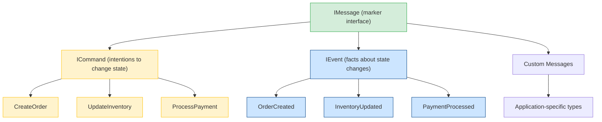

# Messages

The `IMessage` interface is the foundation of Whizbang's messaging system. All message types - commands, events, and queries - derive from this marker interface.

## Overview

Messages are the **data carriers** in Whizbang applications. They represent:

- **Commands**: Intentions to change state (e.g., `CreateOrder`)
- **Events**: Facts about state changes (e.g., `OrderCreated`)
- **Queries**: Requests for information (e.g., `GetOrderDetails`)

## IMessage Interface {#imessage}

```csharp{title="IMessage Interface" description="IMessage Interface" category="Architecture" difficulty="INTERMEDIATE" tags=["Fundamentals", "Messages", "IMessage", "Interface"]}
namespace Whizbang.Core;

/// <summary>
/// Marker interface for all messages in the system (commands, events, queries, etc.).
/// Used for generic constraints and type safety in receptors, dispatchers, and lifecycle systems.
/// </summary>
/// <remarks>
/// This interface serves as the base for all message types:
/// <list type="bullet">
/// <item><description>ICommand - Messages that represent intentions to change state</description></item>
/// <item><description>IEvent - Messages that represent facts about state changes</description></item>
/// <item><description>Custom message types - Any application-specific message</description></item>
/// </list>
/// </remarks>
public interface IMessage;
```

## Message Type Hierarchy



## Defining Messages

### Commands

Commands represent **intentions** - requests to perform actions:

```csharp{title="Commands" description="Commands represent intentions - requests to perform actions:" category="Architecture" difficulty="INTERMEDIATE" tags=["Fundamentals", "Messages", "Commands"]}
public record CreateOrder : ICommand {
  public required Guid CustomerId { get; init; }
  public required OrderItem[] Items { get; init; }
  public string? CouponCode { get; init; }
}

public record CancelOrder : ICommand {
  public required Guid OrderId { get; init; }
  public required string Reason { get; init; }
}
```

### Events

Events represent **facts** - things that have happened:

```csharp{title="Events" description="Events represent facts - things that have happened:" category="Architecture" difficulty="INTERMEDIATE" tags=["Fundamentals", "Messages", "Events"]}
public record OrderCreated : IEvent {
  [StreamId]
  public required Guid OrderId { get; init; }
  public required Guid CustomerId { get; init; }
  public required OrderItem[] Items { get; init; }
  public required decimal Total { get; init; }
  public required DateTimeOffset CreatedAt { get; init; }
}

public record OrderCancelled : IEvent {
  [StreamId]
  public required Guid OrderId { get; init; }
  public required string Reason { get; init; }
  public required DateTimeOffset CancelledAt { get; init; }
}
```

## Message Design Guidelines

### Use Records for Immutability

```csharp{title="Use Records for Immutability" description="Use Records for Immutability" category="Architecture" difficulty="INTERMEDIATE" tags=["Fundamentals", "Messages", "Records", "Immutability"]}
// ✅ GOOD: Immutable record with init-only properties
public record CreateOrder : ICommand {
  public required Guid CustomerId { get; init; }
  public required OrderItem[] Items { get; init; }
}

// ❌ BAD: Mutable class with setters
public class CreateOrder : ICommand {
  public Guid CustomerId { get; set; }  // Mutable!
  public OrderItem[] Items { get; set; }
}
```

### Make Messages Self-Contained

```csharp{title="Make Messages Self-Contained" description="Make Messages Self-Contained" category="Architecture" difficulty="INTERMEDIATE" tags=["Fundamentals", "Messages", "Make", "Self-Contained"]}
// ✅ GOOD: All data needed to process the command
public record CreateOrder : ICommand {
  public required Guid CustomerId { get; init; }
  public required OrderItem[] Items { get; init; }
  public required Address ShippingAddress { get; init; }
  public string? CouponCode { get; init; }
}

// ❌ BAD: Missing data, requires external lookups
public record CreateOrder : ICommand {
  public required Guid CustomerId { get; init; }
  // Where do items and shipping come from?
}
```

### Use Value Objects for Type Safety

```csharp{title="Use Value Objects for Type Safety" description="Use Value Objects for Type Safety" category="Architecture" difficulty="INTERMEDIATE" tags=["Fundamentals", "Messages", "Value", "Objects"]}
// ✅ GOOD: Type-safe value objects
public record CreateOrder : ICommand {
  public required CustomerId CustomerId { get; init; }  // Strongly-typed
  public required OrderItem[] Items { get; init; }
}

// ❌ BAD: Primitive obsession
public record CreateOrder : ICommand {
  public required string CustomerId { get; init; }  // What format?
}
```

## Message Constraints

`IMessage` enables generic constraints throughout Whizbang:

```csharp{title="Message Constraints" description="IMessage enables generic constraints throughout Whizbang:" category="Architecture" difficulty="INTERMEDIATE" tags=["Fundamentals", "Messages", "Message", "Constraints"]}
// Receptors handle specific message types
public interface IReceptor<in TMessage, TResponse> {
  ValueTask<TResponse> HandleAsync(TMessage message, CancellationToken cancellationToken = default);
}

// Dispatcher constrains message type parameters to notnull
public interface IDispatcher {
  ValueTask<TResult> LocalInvokeAsync<TMessage, TResult>(TMessage message)
      where TMessage : notnull;
  Task<IDeliveryReceipt> SendAsync<TMessage>(TMessage message)
      where TMessage : notnull;
  Task<IDeliveryReceipt> PublishAsync<TEvent>(TEvent eventData);
  // ... plus context / options / caller-info overloads
}
```

## Message Flow

```
[Client/API]
    |
    v
[Command: CreateOrder]
    |
    v
[Dispatcher] ----> [Receptor] ----> [Event: OrderCreated]
                                           |
                                           v
                                    [Perspectives]
                                           |
                                           v
                                    [Read Models]
```

1. Client sends a **Command**
2. Dispatcher routes to appropriate **Receptor**
3. Receptor processes command, returns **Event**
4. Event is published to **Perspectives**
5. Perspectives update **Read Models**

## Message Envelopes

Messages are wrapped in envelopes for routing and tracing:

```csharp{title="Message Envelopes" description="Messages are wrapped in envelopes for routing and tracing:" category="Architecture" difficulty="BEGINNER" tags=["Fundamentals", "Messages", "Message", "Envelopes"]}
// The dispatcher wraps every message in a MessageEnvelope<TMessage>.
// Correlation/causation ride on the hop list, not top-level fields.
var envelope = new MessageEnvelope<CreateOrder> {
  MessageId = MessageId.New(),
  Payload = message,
  Hops = [originHop],   // at least one hop — the origin
  DispatchContext = new MessageDispatchContext {
    Mode = DispatchModes.Local,
    Source = MessageSource.Local
  }
};
```

See [Message Envelopes](../../messaging/message-envelopes.md) for details.

## Best Practices

### Naming Conventions

**Commands** use imperative verbs:
- `CreateOrder`, `UpdateProfile`, `ProcessPayment`

**Events** use past tense:
- `OrderCreated`, `ProfileUpdated`, `PaymentProcessed`

### Single Responsibility

Each message should represent **one** logical operation:

```csharp{title="Single Responsibility" description="Each message should represent one logical operation:" category="Architecture" difficulty="BEGINNER" tags=["Fundamentals", "Messages", "Single", "Responsibility"]}
// ✅ GOOD: Specific commands
public record CreateOrder : ICommand { ... }
public record UpdateOrderAddress : ICommand { ... }
public record AddOrderItem : ICommand { ... }

// ❌ BAD: Generic catch-all
public record ModifyOrder : ICommand {
  public string Operation { get; init; }  // "create", "update", "delete"?
}
```

### Event Data Completeness

Events should capture **all relevant state**:

```csharp{title="Event Data Completeness" description="Events should capture all relevant state:" category="Architecture" difficulty="INTERMEDIATE" tags=["Fundamentals", "Messages", "Event", "Data"]}
// ✅ GOOD: Complete state snapshot
public record ProductPriceChanged : IEvent {
  [StreamId]
  public required Guid ProductId { get; init; }
  public required decimal OldPrice { get; init; }  // Before
  public required decimal NewPrice { get; init; }  // After
  public required DateTimeOffset ChangedAt { get; init; }
  public required string ChangedBy { get; init; }
}

// ❌ BAD: Incomplete - can't reconstruct history
public record ProductPriceChanged : IEvent {
  public required Guid ProductId { get; init; }
  public required decimal NewPrice { get; init; }
  // Missing: old price, when, by whom
}
```

## Related Documentation

- [Commands and Events](../../messaging/commands-events.md) - Detailed command/event patterns
- [Message Envelopes](../../messaging/message-envelopes.md) - Envelope structure
- [Receptors](../receptors/receptors.md) - Message handlers
- [Dispatcher](../dispatcher/dispatcher.md) - Message routing

### For Contributors

Looking to understand how messages are discovered and registered? See:
- [Message Registry](../../extending/source-generators/message-registry.md) — How source generators build the message type registry for routing and serialization

---

*Version 1.0.0 - Foundation Release*
