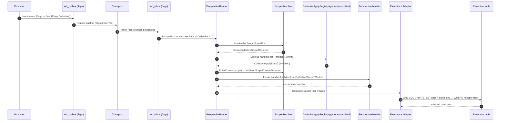

# Collective events

A first-class persistable event that mutates **every stream in a scope**
as a unit. The producer expresses scope + mutation; the projection
runner applies it as **one SQL UPDATE per affected projection table**
whose `WHERE` clause is just the scope predicate. No per-row enumeration,
no per-row tracking, no per-row tax.

Canonical use cases:

- "Archive every non-active job in tenant T"
- "Remove all jobs in tenant T"
- "Change state of every matching job"
- "Flag all entities older than Y" (where Y is captured on the event payload)

When the producer expresses **intent + scope** rather than a list of
events, this is the primitive — one event row, one SQL UPDATE, one
category-level observed event.

## When to reach for it

```
Producer wants to mutate multiple streams in one operation
  │
  ├─ Is the mutation uniform across all targeted streams?
  │   ├─ NO  → ICompositeEvent (hand-crafted per-stream batch)
  │   └─ YES
  │       │
  │       ├─ Does the producer want to name an explicit list of streams?
  │       │   ├─ YES → ICompositeEvent (enumerate them)
  │       │   └─ NO  → ICollectiveEvent ← THIS — scope IS the descriptor
```

## Composite vs collective — pick one per producer intent

`ICollectiveEvent` sits **next to** `ICompositeEvent` — additive, not a
replacement. They solve different problems and ship on different runtime
paths.

| Dimension | `ICompositeEvent` | `ICollectiveEvent` |
|---|---|---|
| Producer expresses | Explicit list of `(streamId, event)` pairs | Scope + uniform mutation |
| Materialization | Receiver expands to N per-stream events | One event persists; one SQL UPDATE per projection |
| Per-stream history | Each stream gets its own event row | Streams have no per-stream record |
| Apply contract | Existing pure `Apply(model, evt)` per stream | New `Apply(evt) → ICollectiveSpec<TModel>` per projection |
| Replay path | Composite envelope never reaches replay; inner events do | Collective event itself replays; predicate re-evaluates at replay time |
| Cost shape (10k matches) | 10k events, 10k Applies, 10k SignalR pushes | 1 event, 1 SQL UPDATE, 1 category-level push |
| Right when | Hand-crafted heterogeneous batches | Uniform mutation across a scope |

Both can coexist in the same workflow — a bulk import emits composite
per-job events; a tenant cleanup emits a collective event. The two
contracts share **no inheritance** — separate code paths end-to-end.

## Determinism is at scope level, not stream level

This is the defining design choice and it deserves its own section.

**The principle**: a collective event is a *descriptor*. It says
"apply this mutation to everything in scope-X at this point in the event
sequence." It does NOT enumerate the streams that happened to be in
scope at the moment the producer emitted the event.

Replay re-evaluates the predicate against the projection state at the
moment the collective event is being processed. Because event sourcing
guarantees that the projection state at any point in a replay is fully
determined by the event sequence up to that point, the predicate's
result is deterministic — **but it reflects the logically correct state,
not the original execution's state**.

### Why this is *better* than snapshot determinism

Consider a worked example:

> A producer fires a collective event: "disable every job in tenant T."
> At the moment of the original write, 10 jobs are visible in the
> projection (`j₁`…`j₁₀`). A late-arriving event for an 11th job
> (`j₁₁`) had been emitted *before* the collective event in correct
> stream order, but its delivery was delayed by transport hiccups, so
> it hadn't materialized in the projection yet when the collective
> event fired. The original execution disabled 10 jobs.
>
> Later, you replay the projection from scratch. Replay processes the
> event log in correct order: `j₁₁`'s event arrives at its logically
> correct position **before** the collective event. By the time the
> collective event is being applied during replay, `j₁₁` is visible
> in the projection. The predicate matches `j₁₁` too. Replay disables
> **11 jobs**.

That's correct. The original execution was *temporarily wrong* because
of out-of-order delivery; replay produces the result that should have
happened if events had arrived in their logical order. The projection
self-heals on replay.

A snapshot model (where the event carries the captured `[j₁..j₁₀]` set)
would lock in the original execution's mistake forever — replay would
also disable only 10 jobs, leaving `j₁₁` in the wrong state.

**Determinism is at the scope level (tenant T) and the event-sequence
level. Not at the stream-enumeration level.** That's stricter, more
correct, and simpler.

### What this requires of the developer

The handler's predicate (encoded in `ICollectiveScopeResolver.ScopeFilter`)
must be **a pure function of the projection's persistent state and the
event payload**. No `DateTime.UtcNow`, no external lookups, no random
numbers. The framework can't enforce this — it's the same discipline
event-sourcing requires of regular `Apply` functions. If you need a
moment-in-time threshold, capture it on the event payload at write time
(e.g. `e.OlderThan = clock.GetUtcNow()`), not at apply time.

## The event IS the descriptor

A collective event carries:

- **`Scope`** — the resolver lookup key (e.g. `TenantCollectiveScope("t-A")`) and the payload the resolver consumes to build its `WHERE` predicate
- **The event's own runtime type** — dispatches to the matching handlers via the generator-emitted registry
- **The event's payload** — fields the handler reads (e.g. `e.OccurredAt`, `e.NewStatus`, `e.OlderThan`)

That's the entire descriptor. There is no captured matched-stream-id
set. There is no per-row audit pointer. There is no per-stream
amplification on the inbox. The event's identity (its `event_id`) plus
the wh_event_store row is the complete audit trail — anyone wanting "did
event E mutate row R" answers it by re-applying the predicate to the
relevant projection snapshot.

## `EventFlags` — categorizing events without column churn

Whizbang categorizes events on `wh_event_store` / `wh_outbox` /
`wh_inbox` using a single `flags INTEGER NOT NULL DEFAULT 0` column
that's a bitmask of the `EventFlags` enum:

```csharp
[Flags]
public enum EventFlags {
  None       = 0,
  Collective = 1 << 0,
  Composite  = 1 << 1,
  // future categories add new flags without schema migrations
}
```

The dispatcher branches on `(envelope.Flags & EventFlags.Collective) != 0`
to route to the collective-event path. New event categories ship by
adding a flag value — no boolean column per category, no migration tax.

## Authoring a handler

```csharp
[CollectiveApplyFor]
public ICollectiveSpec<JobModel> ArchiveJobs(ArchiveJobsCollectiveEvent e) =>
  new CollectiveSpec<JobModel>(s => s
    .SetProperty(j => j.Status, "Archived")
    .SetProperty(j => j.ArchivedAt, e.OccurredAt));
```

The handler describes **only the mutation**. The `WHERE` clause that
gates the SQL UPDATE is composed by the framework from the scope
resolver's `ScopeFilter(evt.Scope)` — nothing else.

`SetProperty` overloads:

- **`SetProperty(selector, value)`** — assign a constant or
  event-supplied value
- **`SetProperty(selector, computed)`** — assign an expression of the
  row's own current state (increment, timestamp-touch, conditional)

### Worked examples

```csharp
// 1. Constant — "archive every job in tenant T"
[CollectiveApplyFor]
public ICollectiveSpec<JobModel> ArchiveJobs(ArchiveJobsCollectiveEvent e) =>
  new CollectiveSpec<JobModel>(s => s
    .SetProperty(j => j.Status, "Archived")
    .SetProperty(j => j.ArchivedAt, e.OccurredAt));

// 2. Increment — "bump view count on every job in tenant T"
[CollectiveApplyFor]
public ICollectiveSpec<JobModel> BumpViewCount(BumpJobViewCountCollectiveEvent e) =>
  new CollectiveSpec<JobModel>(s => s
    .SetProperty(j => j.ViewCount, j => j.ViewCount + 1)
    .SetProperty(j => j.LastViewedAt, e.OccurredAt));

// 3. Event-supplied delta — "credit X tokens to every matched user"
[CollectiveApplyFor]
public ICollectiveSpec<UserModel> CreditTokens(CreditTokensCollectiveEvent e) =>
  new CollectiveSpec<UserModel>(s => s
    .SetProperty(u => u.TokenBalance, u => u.TokenBalance + e.Amount));

// 4. Conditional flag — "mark stale if older than the captured threshold"
//    Threshold is captured at write time on the event payload, NOT at apply time.
[CollectiveApplyFor]
public ICollectiveSpec<EntityModel> FlagStale(FlagStaleEntitiesCollectiveEvent e) =>
  new CollectiveSpec<EntityModel>(s => s
    .SetProperty(x => x.IsStale, x => x.UpdatedAt < e.OlderThan));

// 5. Opt-out for custom scope handling
[CollectiveApplyFor(ScopeHandling = CollectiveScopeHandling.Custom)]
public ICollectiveSpec<JobModel> ComplexUpdate(ComplexCollectiveEvent e) {
  var ctx = ScopeContextAccessor.CurrentContext;
  return /* full WHERE including scope, via the spec API */;
}

// 6. Opt-out for raw SQL (jsonb merges too complex for the LINQ surface)
[CollectiveApplyFor(SpecKind = CollectiveSpecKind.RawSql)]
public ICollectiveSpec<JobModel> JsonbMerge(JsonbHeavyEvent e) =>
  new RawSqlCollectiveSpec(
    "data = jsonb_set(data, '{X}', case when ... end)",
    parameters: new { ... });
```

### What the LINQ surface CAN express
- Scalar `SetProperty` to a constant or event-supplied value
- Scalar `SetProperty` to an expression of the row's own current
  properties (increment, decrement, arithmetic, string concat, date
  arithmetic, boolean-from-other-property logic) — EF driver only in
  v1.0
- Multiple `SetProperty` calls in one spec — composed into a single SQL
  UPDATE

### What the LINQ surface CANNOT express (use `SpecKind = RawSql`)
- Cross-row aggregates (window functions, CTEs)
- Subqueries against other tables
- Conditional updates whose target column depends on another column's
  *new* value (multi-step assignment ordering)
- Nested jsonb path manipulation more complex than top-level property
  assignment
- DELETE semantics — collective deletes are out of scope; model as
  `SetProperty(x => x.IsDeleted, true)` against a soft-delete schema

The Dapper driver in v1.0 restricts further to **constant-value**
`SetProperty` shapes — computed `j => j.X + 1` selectors throw
`NotSupportedException` and need the raw-SQL escape hatch.

## Apply pipeline at runtime



Note what's NOT in this diagram: no matched-id membership clause, no
audit-pointer write, no expansion to per-stream markers.

## Schema additions

The collective-events feature adds **one column**, total:

- `wh_event_store.flags INTEGER NOT NULL DEFAULT 0`
- `wh_outbox.flags INTEGER NOT NULL DEFAULT 0`
- `wh_inbox.flags INTEGER NOT NULL DEFAULT 0`

(All three are the same `EventFlags` enum value, preserved through
transport.)

No new columns on perspective tables (`wh_per_*`). No GIN index on a
new array column. Perspectives that never receive collective events
pay no schema tax.

## Built-in scopes

### `TenantCollectiveScope`

Built-in `ICollectiveScope` for tenant-scoped collective mutations:

```csharp
var evt = new ArchiveJobsCollectiveEvent {
  Scope = new TenantCollectiveScope("t-1"),
  OccurredAt = clock.GetUtcNow(),
};
await outbox.PublishAsync(evt);
```

`TenantCollectiveScopeResolver` auto-registers via DI and composes
`row.Scope.TenantId == "t-1"` as the `WHERE` predicate.

### Custom scopes

To add a new scope kind (e.g. `OrganizationCollectiveScope`,
`RegionCollectiveScope`):

1. Implement `ICollectiveScope` with a unique `ScopeKind` string.
2. Implement `ICollectiveScopeResolver` for that kind — return the
   correct `Expression<Func<PerspectiveRow<TModel>, bool>>` for your
   `PerspectiveRow<TModel>` shape.
3. Register the resolver in DI:
   `services.AddSingleton<ICollectiveScopeResolver, OrgCollectiveScopeResolver>();`

The runner indexes resolvers by `ScopeKind`. Registration conflicts
(two resolvers claiming the same kind) are caught at registration time.

## Observer model

A collective event surfaces as **one observed event** at the category
level. Receptors, sagas, and SignalR pushes see a single
`ICollectiveEvent` and branch on type. No per-stream amplification on
the observer side.

Consumers that genuinely need per-stream side effects subscribe at the
projection-write hook — the same hook that fires for regular event
applies — and observe the resulting row changes directly. This is the
existing mechanism; there's no special expansion path for collective
events.

## Discovery and AOT story

`[CollectiveApplyFor]` is read at compile time by
`CollectiveApplyDiscoveryGenerator`. The generator emits a static
dispatch table per assembly:

```csharp
// Auto-generated
public static class CollectiveApplyRegistry {
  public static readonly IReadOnlyList<CollectiveApplyEntry> Entries =
    new CollectiveApplyEntry[] {
      new CollectiveApplyEntry(
        ModelType: typeof(JobModel),
        EventType: typeof(ArchiveJobsCollectiveEvent),
        HandlerType: typeof(JobCollectivePerspective),
        MethodName: "ArchiveJobs",
        ScopeHandling: CollectiveScopeHandling.Framework,
        SpecKind: CollectiveSpecKind.Linq,
        Invoker: static (handler, evt) =>
          ((JobCollectivePerspective)handler).ArchiveJobs((ArchiveJobsCollectiveEvent)evt)
      ),
    };
}
```

At runtime the projection runner indexes by `(ModelType, EventType)` and
dispatches via the typed `Invoker` lambda — no reflection, AOT-clean by
construction.

Expression-tree LINQ is allowed because the compiler constructs the tree
from the source literal; the EF adapter and Dapper compiler walk it with
`ExpressionVisitor`. The EF adapter emits `jsonb_set(...)` SQL via a
custom `EF.Functions.JsonbSet` translator (`WhizbangJsonDbFunctions` +
`JsonbSetTranslator`), so parameter binding, escaping, and type mapping
all flow through EF Core's normal pipeline — no raw SQL strings in C#.

## Driver-specific notes

### EF Core (Postgres)

Implemented in `Whizbang.Data.EFCore.Postgres`. Translates the spec's
LINQ into EF Core 10's `ExecuteUpdateAsync(UpdateSettersBuilder<>)`.
The adapter composes:

- Resolver's `ScopeFilter<TModel>(scope)` → outer `WHERE` predicate
- Spec's `Setters` → translated `SET data = jsonb_set(...)` chain via
  the custom `EF.Functions.JsonbSet` translator

That's the entire query. No matched-id membership clause. No audit
write.

### Dapper (Postgres)

Implemented in `Whizbang.Data.Dapper.Postgres.Collective`. The
`DapperCollectiveSpecCompiler<TModel>.Compile(spec, jsonOptions)` returns
a `CompiledSetClause`:

- `SqlFragment`: `data = jsonb_set(jsonb_set(data, '{A}', @set_0_a::jsonb), '{B}', @set_1_b::jsonb)`
- `Parameters`: `{ "set_0_a": "<json>", "set_1_b": "<json>" }`

Restricted to scalar constant-value `SetProperty` in v1.0; computed
expressions (`j => j.X + 1`) and nested paths (`j => j.Nested.X`) throw
`NotSupportedException` with a pointer to `SpecKind = RawSql`.

## Failure semantics

- The SQL UPDATE either commits or rolls back — no per-row soft-fail
  (unlike per-stream `ApplyResult.Delete`/`Purge`).
- If the resolver rejects the perspective (`AcceptsPerspective<TModel>()`
  returns false), the runner skips the handler and logs a structured
  rejection.
- If the resolver's `EnterContext` throws, the runner surfaces the
  exception and the event remains un-acked (will be retried).

## Out of scope (v1.0)

- **Cross-projection atomic coordination** — a collective event that
  mutates multiple projection tables in lockstep. Likely a follow-up if
  needed.
- **Computed expressions on the Dapper driver** — constant-value only
  in v1.0; the LINQ surface that EF supports comes later.
- **Replacing existing receptor / composite-event paths** —
  `ICollectiveEvent` is an additional primitive, not a replacement.
- **Complex jsonb manipulation in the typed LINQ API** — escape hatch via
  `SpecKind = RawSql` until a future iteration adds richer expression
  translation.

## Sample project

A self-contained walkthrough lives at
[`samples/CollectiveEvents/`](https://github.com/JDXpert/whizbang/tree/main/samples/CollectiveEvents)
in the library repo. It shows a tiny `JobModel`, two collective events
(constant-value + computed-value), the handler with two
`[CollectiveApplyFor]` methods, and the DI registration.
