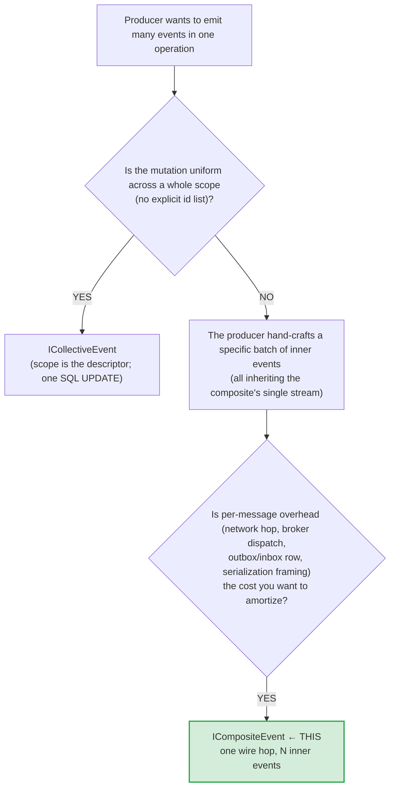
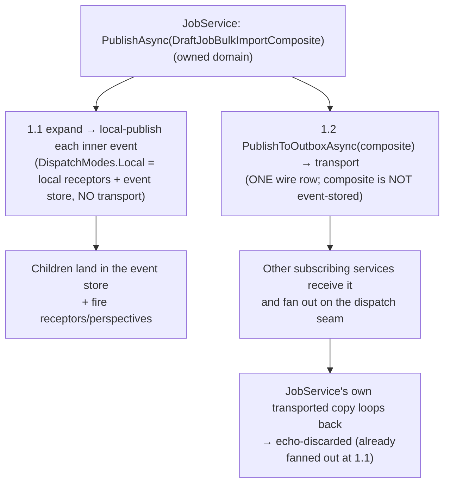

# Composite events

A **composite event** bundles many inner events into one transport hop. A bulk
operation that produces N domain events (e.g. "350 jobs imported" emitting
hundreds of field events) sends **one** wire message instead of N — one outbox
row, one publish, one receive — then **fans out** into the N inner events at the
receiver. The composite itself is **never written to the event store**; only the
expanded inner events are persisted, so replay reads the inner events back as if
no composite ever existed.

A composite travels over transport **exactly like an ordinary `IEvent`** (one
outbox row, one publish) — the single difference is that it is **not**
event-stored. It **fans out at every destination service**, and the children,
wherever they fan out, are **local-published** (event store + receptors +
perspectives) and **never rebroadcast**.

## When to reach for it



Composites pay off when the per-message overhead dominates the actual
processing cost. Canonical cases:

- A bulk import producing N `JobCreatedEvent` instances.
- A migration tool that emits one event per affected record as a single unit.
- Any batch operation that yields many domain events from one action.

Composites sit **next to** [collective events](/docs/fundamentals/messaging/collective-events) —
a composite is a hand-crafted batch of inner events (all landing on the
composite's one stream); a collective event is a scope-wide uniform mutation
applied as one SQL UPDATE. They share no inheritance and run on separate code
paths; both can appear in the same workflow (a bulk import emits a composite; a
tenant cleanup emits a collective event).

For high inner-event counts, pair composites with the
[message-body offload](/docs/fundamentals/offloads/message-body-store): a
5,000-inner-event composite easily exceeds the Azure Service Bus Standard 256 KB
ceiling, so the offload path moves the body to blob storage transparently and
substitutes a small claim envelope on the wire.

## Two fan-out points

A composite fans out at **every** destination that receives it — and the
publishing service is itself a destination:

- **The publishing service, at publish** — when a service publishes a composite
  in its **own** domain, it expands and local-publishes each inner event right
  there, materializing its own children immediately. The composite *also* goes
  over transport; its own transported copy loops back and is **echo-discarded**
  (it already fanned out), so there is no double fan-out. See
  [Publish-time local fan-out](#publish-time-local-fan-out).
- **Every other subscribing service, on receive** — the composite arrives over
  transport and fans out at the **dispatch seam** (`InboxDispatchWorker`), the
  same way. See [Dispatch lifecycle](#dispatch-lifecycle).

Both paths reuse the ordinary local-publish / receive machinery — there is no
bespoke fan-out transport.

The load-bearing principle:

> A composite is an **ordinary message** everywhere except **one seam — the
> fan-out** — and that seam sits **inside the durable inbox / dispatch / retry /
> DLQ envelope**, not outside it at the transport edge.

That is what makes a composite recoverable: if fan-out fails, the composite is
just *an inbox row that failed* → normal retry → dead-letter via the existing
`IDeadLetterStore.MoveAsync(wh_inbox, …)`. There is no separate
composite-failure path.

> **Historical note.** In an earlier design the receiver expanded a composite at
> the **transport edge** (`TransportConsumerWorker`) before it became an inbox
> row. That was removed: expanding there orphaned the composite from
> durability/retry. Today `TransportConsumerWorker` stores a composite as an
> ordinary inbox row (`IsEvent == false`) and does **not** expand it — the
> dispatch seam does. This is locked by
> `TransportConsumerWorkerCompositeNoExpandTests`.

## The three message roles

1. **Composite** — dispatchable but **never event-stored**. Lives transiently as
   an inbox row: received → (pre-fanout receptors) → fan out → deleted.
2. **Children (inner events)** — ordinary received events, produced by fan-out as
   inbox rows, processed normally (event store + perspectives + receptors). They
   **never outbox** (see the [no-rebroadcast invariant](#the-no-rebroadcast-invariant)).
3. Everything downstream of fan-out sees only children — no composite awareness.

## The contract

```csharp{
title: "The ICompositeEvent contract"
description: "The composite-event marker interface that yields inner events, caps the count, and declares fan-out trigger and per-child failure policy."
framework: "NET10"
category: "Messaging"
difficulty: "INTERMEDIATE"
tags: ["composite-events", "fan-out", "bulk", "inner-events", "contract"]
}
public interface ICompositeEvent : IMessage {
  // Inner events this composite expands into, in producer-yielded order.
  // Enumerated once at receive time.
  IEnumerable<IMessage> InnerEvents { get; }

  // Defensive cap. A producer that yields, say, 100,000 inner events from a bug
  // is caught here rather than corrupting the receiver. Default 10,000.
  int MaxInnerEventsAllowed => 10_000;

  // How fan-out is triggered (Auto by default; Manual defers to a pre-fanout receptor).
  FanoutMode FanoutMode => FanoutMode.Auto;

  // Per-child failure policy (Independent by default; Atomic = all-or-nothing).
  FanoutAtomicity Atomicity => FanoutAtomicity.Independent;
}
```

`ICompositeEvent` extends `IMessage`, so composites flow through the existing
dispatcher / outbox / transport surface — no parallel pipeline. The dispatcher
stamps `EventFlags.Composite` on the outgoing envelope; the receiver stores the
composite as an inbox row and the **dispatch worker** recognizes the typed
`ICompositeEvent` payload and fans it out.

### Resolved design decisions

| Question | Decision |
|---|---|
| Inner-event `StreamId` | All inner events inherit the composite's `StreamId`. Producers needing per-inner streams emit separate envelopes (no composite). |
| Ordering | Producer-yielded order (the order `InnerEvents` enumerates). Matches single-row outbox storage semantics. |
| Event-store replay | Composite is wire-only; only expanded inner events persist. Producers can stop emitting a composite type at any time without affecting historical replay. |
| Lifecycle hooks | Fire per-inner-event. Downstream never sees the composite. |
| Failure atomicity | Configurable per composite via `Atomicity` — `Independent` (default) or `Atomic`. A cap breach always dead-letters the whole composite regardless. |

## Authoring

Derive from `CompositeEventBase` — one line for the common case:

```csharp{
title: "Author and publish a composite with CompositeEventBase"
description: "The turnkey base carries the shared StreamId, the concrete List<IMessage> Inner, the cap, and EnsureWithinCap for producer-side fail-fast before publishing."
framework: "NET10"
category: "Messaging"
difficulty: "INTERMEDIATE"
tags: ["composite-events", "composite-event-base", "authoring", "stream-id", "publish"]
}
public sealed class DraftJobBulkImportComposite : CompositeEventBase;

// producer:
var composite = new DraftJobBulkImportComposite {
  StreamId = jobStreamId,      // every inner event inherits this stream at the receiver
  Inner    = jobFieldEvents,   // List<IMessage>, in producer-yielded order
};
composite.EnsureWithinCap();   // producer-side fail-fast before publishing
await dispatcher.PublishAsync(composite, ct);
```

The base carries the shared `[StreamId]`, the `List<IMessage> Inner` (typed
concretely so each element serializes with its polymorphic `$type`
discriminator — an interface-typed collection loses that on the source-gen
path), an `init` `MaxInnerEventsAllowed` (default 10,000), and
`EnsureWithinCap()` (throws `InvalidOperationException` when the inner count
exceeds the cap). `InnerEvents` is a `[JsonIgnore]` computed view over `Inner`;
inner events share the composite's stream.

## Dispatch lifecycle

On the receive side, fan-out happens at the dispatch seam
(`InboxDispatchWorker.ProcessOneInnerAsync`), inside the durable retry/DLQ
envelope:

```
claim composite inbox row (InboxDispatchWorker.ProcessOneInnerAsync)
  → deserialize payload → typed ICompositeEvent
  → PRE-FANOUT: fire inline receptors under an ambient DispatchOutboxCollector
  → FANOUT:     CompositeInboxFanout.TryExpand → N child inbox messages
  → COMMIT:     one HandlerCommitRequest {
                  NewInboxMessages  = children,
                  NewOutboxMessages = pre-fanout emissions,
                  InboxCompletion.Status = EventStored }
                → process_inbox_completions stores children + pre-fanout events
                  AND DELETEs the composite (one transaction)
  → children dispatch normally
```

- **Recognition** — the source generator (`ReceptorRegistryQueryGenerator`)
  discovers every **concrete** `ICompositeEvent` type and lists it in
  `AnyConsumerTypes`, so the receive-boundary drop-gate keeps a composite alive
  long enough to reach the dispatch seam (a composite has no receptor /
  perspective / tag of its own). The abstract `CompositeEventBase` is skipped —
  it is never dispatched.
- **Fan-out is AOT-clean** — `CompositeInboxFanout` builds each child as a
  `MessageEnvelope<IMessage>` and serializes it through
  `IEnvelopeSerializer.SerializeEnvelope`, which derives the wire type from the
  inner event's **runtime** type. No runtime reflection (it sidesteps the
  `Activator.CreateInstance` + `MakeGenericMethod` hops the removed
  transport-edge expander used).
- **Atomicity** — the children and the composite-row deletion commit in one
  transaction (`process_inbox_completions`). The `EventStored` status bit (value
  `2`, i.e. `1 << 1`) drives the DELETE of the composite row.
- **Failure** — a cap breach (`MaxInnerEventsAllowed`) or a child-serialization
  error under `Atomic` returns **no** partial fan-out; the composite row is
  dead-lettered with `MessageFailureReason.CompositeInnerEventLimitExceeded` (15)
  or `MessageFailureReason.CompositeExpansionFailure` (16) via
  `IDeadLetterStore.MoveAsync`. When no `IDeadLetterStore` is wired, it falls
  back to a terminal mark-`Published` completion so the row never re-claims.

### What each child inherits

`CompositeInboxFanout._buildChildInbox` builds one child inbox message per inner
event:

| Field | Behavior |
|---|---|
| `Version`, `DispatchContext`, `SourceServiceId`, `SourceCommitSequence`, `CausedByServiceId`, `CausedByCommitSequence` | Copied from the composite envelope. |
| `Hops` | A composite-lineage chain: a fresh creation hop whose `CausationId` is the composite's `MessageId` and `CausationType` is the composite type name, followed by the composite's own hops. Built once and shared by reference across the whole batch, so "these events came from composite X" is queryable. |
| `MessageId` | Fresh UUIDv7 per child, so inbox dedup keeps each inner event distinct. |
| `StreamId` | The composite's stream (recorded as the first hop's `AggregateId`), falling back to the child's own `MessageId` when absent. |
| `Flags` | Stamped `EventFlags.NoRebroadcast` on both the persisted inbox row and the in-memory envelope. |

## Pre-fanout hook

A composite's **inline** receptors fire **before** fan-out, inside the dispatch
step, so a receptor can validate the batch, stamp per-batch metadata, or emit a
durable `BatchReceivedEvent`. Their inline emissions are captured by an ambient
`DispatchOutboxCollector` (which diverts the would-be outbox write into an
in-memory buffer) and folded into the **same** `HandlerCommitRequest` as the
fan-out children — so pre-fanout side-effects and children commit
**all-or-nothing**. A pre-fanout receptor that throws fails the composite inbox
row → normal retry → DLQ, exactly like any other dispatch failure.

Only a composite's **inline** receptors run at all — `_invokePreFanoutHookAsync`
invokes just its `PreInboxInline` / `PostInboxInline` stages, and only their
emissions fold into the atomic commit. After fan-out, `ProcessOneInnerAsync`
returns early, so the composite's own **detached** (`[FireAt(...Detached)]`)
receptors never fire: a composite has no lifecycle of its own past fan-out. The
children then dispatch normally post-fan-out, running their full per-inner-event
lifecycle — there is no composite awareness downstream.

`DispatchOutboxCollector` is `AsyncLocal`-backed so it flows across the fresh DI
scope the dispatcher's outbox seam opens. When no collector is open, outbox
writes go through normally — zero behavior change off the collecting path.

## Fan-out control

Fan-out is zero-config by default, with a declarative knob on the composite and
an imperative override from a pre-fanout receptor.

**Declarative** (on the composite type / `CompositeEventBase`):

- `FanoutMode` — `Auto` (default, fans out `InnerEvents`) | `Manual` (a
  pre-fanout receptor drives it; nothing fans out without an explicit directive).
- `Atomicity` — `Independent` (default; a child that fails to serialize is
  dropped and the rest fan out — "one bad child doesn't sink the batch") |
  `Atomic` (any child failure dead-letters the whole composite — use when the
  inner events are one logical unit). A cap breach always dead-letters the whole
  composite regardless of atomicity.

```csharp{
title: "Make a composite's inner events one atomic unit"
description: "Set Atomicity = Atomic on the composite so any child-serialization failure dead-letters the whole batch instead of dropping one child."
framework: "NET10"
category: "Messaging"
difficulty: "INTERMEDIATE"
tags: ["composite-events", "fanout-atomicity", "atomic", "authoring"]
}
public sealed class DraftJobBulkImportComposite : CompositeEventBase {
  public DraftJobBulkImportComposite() {
    Atomicity = FanoutAtomicity.Atomic;   // a job's field events are one unit
  }
}
```

**Imperative** — a pre-fanout receptor calls `DispatchFanoutControl.Set(...)`
(ambient, like the collector) to impose a `FanoutDirective`, which takes
precedence over `FanoutMode`:

- `Proceed` (default) — fan out the composite's own `InnerEvents`.
- `Skip` — suppress fan-out; the receptor handled the composite. The composite
  row is still deleted and any emitted events still commit.
- `ReplaceWith(children)` — fan out a receptor-supplied set instead (filter /
  transform / re-key before the children are created).

`DispatchFanoutControl` is `AsyncLocal`-backed. The dispatch worker opens a
control before invoking the composite's receptor and reads the directive after;
when no control is open, `Set` is a no-op, so a misfired call outside the
pre-fanout window cannot corrupt unrelated dispatch.

## The no-rebroadcast invariant

> One composite on the wire; children are received-events confined to the
> inbox → event-store → local-processing path. Children never outbox.

Correct by construction — fan-out writes children to the **inbox/received**
path, never `PublishAsync`; the composite was already delivered to every
subscriber of its topic. Defended in depth:

1. **Hop-based echo suppression (primary).** Children carry the composite's hop
   lineage, so the owned-echo suppressor treats them as received-from-upstream
   and won't re-publish them. This covers the persisted-and-re-claimed child too.
2. **`EventFlags.NoRebroadcast` guard (explicit).** Fan-out stamps every child —
   both its persisted `InboxMessage.Flags` and its in-memory envelope `Flags` —
   with `NoRebroadcast`. The outbox-enqueue boundary
   (`Dispatcher.PublishToOutboxAsync` / `PublishToOutboxDynamicAsync`, via
   `NoRebroadcastGuard.ShouldSuppress`) hard-drops any publish whose source
   envelope carries the flag. Even a receptor that explicitly re-publishes a
   fan-out child it is processing is stopped at the gate.

## Publish-time local fan-out

A composite fans out at **every** destination that receives it — and the
publishing service is itself a destination. Rather than make the publishing
service wait to receive its own transported copy back, it fans the composite out
**locally, at publish** (`Dispatcher._fanOutCompositeLocallyAtPublishAsync`):



- **1.1** is gated on the composite being in an **owned** namespace
  (`_isOwnedNamespace`) — a service only fans out locally for composites in a
  domain it owns. Inner events are local-published through the ordinary
  `CascadeMessageAsync(DispatchModes.Local)` path, so they reuse the exact
  event-store + receptor + perspective machinery a normal `PublishAsync` uses,
  minus the per-event outbox row. `Atomicity` governs child failure at publish:
  `Atomic` propagates (the whole publish fails); `Independent` logs and
  continues. An over-cap composite throws `InvalidOperationException` at publish
  (producer-side fail-fast). A non-owned composite does **not** fan out at
  publish — it fans out on receive at the owning services.
- **1.2** is the ordinary outbox publish — the composite travels like any owned
  event.
- **No double fan-out** — because the publishing service already fanned out at
  1.1, its own loopback copy is echo-discarded by the normal owned-echo
  suppression (no special case: a composite in its own namespace is a self-echo
  just like an owned event).

Net effect: the inner events land in the event store and trigger their receptor
cascades **exactly as if they had been published individually**, at every
service that consumes the domain — the composite is purely a transport/packaging
optimization, not a change in downstream semantics.

## Treatment flags (extending `EventFlags`)

The no-rebroadcast guard generalizes into a small convention. `EventFlags` (the
per-event bitmask on the envelope / inbox / outbox / event-store rows) holds two
kinds of bit:

- **Category** — what the event *is*: `Composite` (`1 << 1`), `Collective`
  (`1 << 0`).
- **Treatment** — tell the framework to *bypass or alter* some functionality for
  this event: `NoRebroadcast` (`1 << 2`) today; future candidates like
  `SuppressNotifications` or `SkipPerspectives`.

Treatment flags are **not composite-specific** — *any* event can carry one. An
event opts in by a **marker interface** (the builders already derive
`Composite`/`Collective` via `payload is IXxxEvent`, so a new treatment slots
into the same `|`-chain) for a type-level treatment, or by setting the
**per-instance** `IMessageEnvelope.Flags` carrier at publish. Composites are just
one producer: fan-out **propagates** the composite's treatment flags to every
child (today the child stamp carries `NoRebroadcast`).

The rule that keeps this honest: **a treatment flag ships with the gate that
reads it** — a bit nothing branches on is dead code. The mechanism (the bitmask,
the marker-interface derivation, the per-instance carrier, composite→child
propagation) is in place; each new bit is a small, localized addition shipped
with its consumer.

## Failure modes

| Failure mode | Reason code | Behavior |
|---|---|---|
| Composite yields more than `MaxInnerEventsAllowed` inner events | `CompositeInnerEventLimitExceeded` (15) | Dead-letter the whole composite regardless of atomicity — a runaway producer/enumerator. |
| Inner event is null / child serialization fails under `Atomic` | `CompositeExpansionFailure` (16) | All-or-nothing — no partial inner events recorded; whole composite dead-letters. |
| Inner event is null / child serialization fails under `Independent` | — | Drop the bad child (logged), fan out the rest. |
| Producer builds an over-cap composite | — | `EnsureWithinCap()` throws `InvalidOperationException`; at publish, `_fanOutCompositeLocallyAtPublishAsync` throws the same synchronously. |

## Code ↔ tests

| Concern | Code | Tests |
|---|---|---|
| Composite marker / authoring | `ICompositeEvent`, `CompositeEventBase` | `Messaging/CompositeEventBaseTests.cs` |
| Dispatch recognition (drop-gate) | `ReceptorRegistryQueryGenerator` (`_extractCompositeEntry` → `AnyConsumerTypes`) | `Generators.Tests/ReceptorRegistryQueryGeneratorTests.cs` (`Generator_WithCompositeEvent_HasAnyConsumerReturnsTrueAsync`) |
| Dispatch-time fan-out | `CompositeInboxFanout`, `InboxDispatchWorker` | `Messaging/CompositeInboxFanoutTests.cs`, `Workers/InboxDispatchWorkerTests.cs` (`CompositeMessage_FansOut*`, `CompositeOverCap_DeadLetters*`) |
| Publish-time local fan-out (1.1) | `Dispatcher._fanOutCompositeLocallyAtPublishAsync`, `Dispatcher.PublishAsync` | `Dispatcher/DispatcherCompositePublishFanoutTests.cs` |
| Pre-fanout hook (atomic emit) | `DispatchOutboxCollector`, `InboxDispatchWorker._invokePreFanoutHookAsync` | `Messaging/DispatchOutboxCollectorTests.cs`, `Workers/InboxDispatchWorkerTests.cs` (`CompositeWithPreFanoutReceptor_*`) |
| Fan-out control | `FanoutMode`/`FanoutAtomicity`/`FanoutDirective`, `DispatchFanoutControl` | `Messaging/DispatchFanoutControlTests.cs`, `Messaging/CompositeInboxFanoutTests.cs`, `Workers/InboxDispatchWorkerTests.cs` (`CompositeDirective_*`, `CompositeFanoutMode_Manual_*`) |
| No-rebroadcast guard | `EventFlags.NoRebroadcast`, `NoRebroadcastGuard`, `CompositeInboxFanout` stamp | `Messaging/NoRebroadcastGuardTests.cs`, `Messaging/CompositeInboxFanoutTests.cs` (`TryExpand_ChildrenCarryNoRebroadcastFlag`), `Dispatcher/DispatcherNoRebroadcastGuardTests.cs` |
| Treatment-flag convention (`EventFlags`) | `EventFlags` (category vs treatment) | `Messaging/EventFlagsTests.cs` (bit-position locks), `Messaging/EventFlagsTransportTests.cs` |
| No transport-edge expansion | `TransportConsumerWorker` | `Workers/TransportConsumerWorkerCompositeNoExpandTests.cs` |
