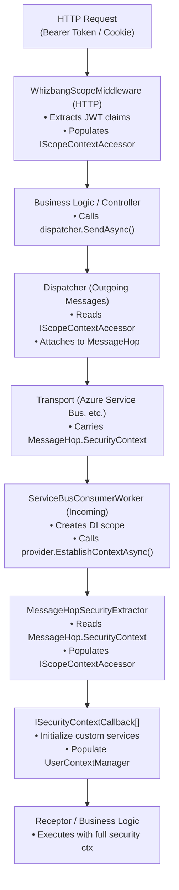

# Security Context Propagation

Security context propagation ensures that security identity (TenantId, UserId, roles, permissions) flows seamlessly across service boundaries in distributed systems. Whizbang provides automatic propagation from HTTP requests through message processing without manual intervention.

## Overview

In distributed systems, security context must flow across multiple hops:

1. **HTTP Request** → API receives authenticated user request
2. **Message Dispatch** → API sends command/event to message bus
3. **Message Transport** → Azure Service Bus, RabbitMQ, etc.
4. **Message Receipt** → Consumer service receives message
5. **Business Logic** → Handler executes with original security context

**Without propagation**, each service must manually extract and forward security information. **With Whizbang**, security context flows automatically.

## Architecture



## HTTP to Message Propagation

### Step 1: HTTP Request Establishes Context

The `WhizbangScopeMiddleware` (shipped in `Whizbang.Transports.HotChocolate`) extracts security context from HTTP headers and JWT claims. Register with `AddWhizbangScope()` / `UseWhizbangScope()` and configure via `WhizbangScopeOptions`:

```csharp{title="Step 1: HTTP Request Establishes Context" description="The WhizbangScopeMiddleware extracts security context from HTTP requests:" category="Best-Practices" difficulty="INTERMEDIATE" tags=["Fundamentals", "Security", "Step", "HTTP"]}
// Program.cs
builder.Services.AddWhizbangScope(options => {
  options.TenantIdClaimTypes = ["tenant_id"];        // JWT claim(s) for tenant
  options.UserIdClaimTypes = ["sub", "oid"];         // JWT claim(s) for user
  options.TenantIdHeaderName = "X-Tenant-Id";        // header fallback
});

app.UseWhizbangScope();
```

This middleware:
- Extracts claims from JWT bearer tokens (and header fallbacks)
- Maps claims to `IScopeContext` properties
- Populates `IScopeContextAccessor.Current`
- Makes context available to downstream code

### Step 2: Dispatcher Reads Ambient Context

When business logic dispatches a message, the dispatcher automatically reads the ambient security context:

```csharp{title="Step 2: Dispatcher Reads Ambient Context" description="When business logic dispatches a message, the dispatcher automatically reads the ambient security context:" category="Best-Practices" difficulty="INTERMEDIATE" tags=["Fundamentals", "Security", "Step", "Dispatcher"]}
// In your controller or service
public class OrderController : ControllerBase {
  private readonly IDispatcher _dispatcher;

  [HttpPost]
  public async Task<IActionResult> CreateOrder(CreateOrderRequest request) {
    // Dispatcher reads IScopeContextAccessor.Current automatically
    await _dispatcher.SendAsync(new CreateOrder {
      CustomerId = request.CustomerId,
      Items = request.Items
    });

    return Ok();
  }
}
```

No manual context passing required - the dispatcher finds it via `IScopeContextAccessor`.

### Step 3: Security Context Attached to MessageHop

The dispatcher attaches the scope to the message's hop as a **`ScopeDelta`** (`MessageHop.Scope`) — only the *changes* from the previous hop are serialized (see [Scope Propagation](scope-propagation.md)):

```csharp{title="Step 3: Scope Attached to MessageHop" description="The dispatcher attaches the scope delta to the message's hop:" category="Best-Practices" difficulty="INTERMEDIATE" tags=["Fundamentals", "Security", "C#", "Step", "Context"]}
// Inside the dispatcher (conceptual)
var scopeContext = _scopeContextAccessor.Current;

if (scopeContext is ImmutableScopeContext immutable && immutable.ShouldPropagate) {
  var hop = new MessageHop {
    Type = HopType.Current,
    ServiceInstance = _serviceInstance,
    // Full scope on the first hop; only the delta from the previous hop afterwards
    Scope = ScopeDelta.CreateDelta(previousScope, scopeContext)
  };

  envelope.Hops.Add(hop);
}
```

**Key Point**: `ImmutableScopeContext.ShouldPropagate` controls whether security flows to downstream services. `MessageHop` has no `SecurityContext` property — the scope travels as `ScopeDelta` on `MessageHop.Scope` (wire name `"sc"`).

### Step 4: Message Serialized with SecurityContext

The message envelope, including the hop chain with its scope delta, is serialized and sent to the transport. Hop properties use abbreviated wire names (`ty` = Type, `si` = ServiceInstance, `ts` = Timestamp, `sc` = Scope delta):

```json{title="Step 4: Message Serialized with Scope Delta" description="The message envelope, including hop chain with scope delta, is serialized and sent to the transport:" category="Best-Practices" difficulty="INTERMEDIATE" tags=["Fundamentals", "Security", "Step", "Message"]}
{
  "messageId": "123e4567-e89b-12d3-a456-426614174000",
  "messageType": "MyApp.Orders.CreateOrder",
  "payload": { "customerId": "cust-456", "items": [] },
  "hops": [
    {
      "ty": 0,
      "si": { "sn": "OrderApi", "ii": "3f6b…", "hn": "orderapi-prod-1", "pi": 1234 },
      "ts": "2026-03-03T10:00:00Z",
      "sc": {
        "v": { "Sc": { "t": "tenant-123", "u": "user-789", "o": "org-456" } }
      }
    }
  ]
}
```

## Message to Handler Propagation

### Step 5: Consumer Receives Message

The `ServiceBusConsumerWorker` receives the message from the transport and deserializes the envelope:

```csharp{title="Step 5: Consumer Receives Message" description="The ServiceBusConsumerWorker receives the message from the transport and deserializes the envelope:" category="Best-Practices" difficulty="INTERMEDIATE" tags=["Fundamentals", "Security", "Step", "Consumer"]}
// Inside ServiceBusConsumerWorker (conceptual)
var envelope = await DeserializeEnvelopeAsync(serviceBusMessage);

// Create DI scope for this message
await using var scope = _serviceProvider.CreateAsyncScope();

// Establish security context BEFORE executing handlers
// (IMessageSecurityContextProvider.EstablishContextAsync returns the IScopeContext)
await _securityContextProvider.EstablishContextAsync(
  envelope,
  scope.ServiceProvider,
  cancellationToken);

// Now dispatch the message to its receptors (internal consumer path)
await DispatchToReceptorsAsync(envelope, scope.ServiceProvider, cancellationToken);
```

### Step 6: Security Context Extracted from Hops

The `MessageHopSecurityExtractor` merges the `ScopeDelta` from every `Current` hop (via `ScopeDelta.ApplyTo`) to rebuild the full scope — roles, permissions, principals, claims, and impersonation info included:

```csharp{title="Step 6: Security Context Extracted from Hops" description="The MessageHopSecurityExtractor merges hop scope deltas into a full extraction:" category="Best-Practices" difficulty="INTERMEDIATE" tags=["Fundamentals", "Security", "C#", "Step", "Context"]}
public sealed partial class MessageHopSecurityExtractor : ISecurityContextExtractor {
  // Extractors run in ascending Priority order (lower runs first).
  public int Priority => 100;

  public ValueTask<SecurityExtraction?> ExtractAsync(
    IMessageEnvelope envelope,
    MessageSecurityOptions options,
    CancellationToken cancellationToken = default) {

    // Merge ScopeDelta from all Current hops to produce the full ScopeContext
    var scopeContext = _mergeScopeDeltas(envelope.Hops, _logger, envelope.MessageId);

    // No scope in the hop chain, or empty scope (no TenantId/UserId) → nothing to extract
    if (scopeContext is null ||
        (string.IsNullOrEmpty(scopeContext.Scope.TenantId) &&
         string.IsNullOrEmpty(scopeContext.Scope.UserId))) {
      return ValueTask.FromResult<SecurityExtraction?>(null);
    }

    // Map to SecurityExtraction with FULL context from the merged deltas
    return ValueTask.FromResult<SecurityExtraction?>(new SecurityExtraction {
      Scope = scopeContext.Scope,
      Roles = scopeContext.Roles,
      Permissions = scopeContext.Permissions,
      SecurityPrincipals = scopeContext.SecurityPrincipals,
      Claims = scopeContext.Claims,
      ActualPrincipal = scopeContext.ActualPrincipal,
      EffectivePrincipal = scopeContext.EffectivePrincipal,
      ContextType = scopeContext.ContextType,
      Source = "MessageHop"
    });
  }
}
```

### Step 7: Context Populated and Callbacks Invoked

The `DefaultMessageSecurityContextProvider` establishes the context:

```csharp{title="Step 7: Context Populated and Callbacks Invoked" description="The DefaultMessageSecurityContextProvider establishes the context:" category="Best-Practices" difficulty="INTERMEDIATE" tags=["Fundamentals", "Security", "Step", "Context"]}
// 1. Extract security (via MessageHopSecurityExtractor)
var extraction = await extractor.ExtractAsync(envelope, options, ct);

// 2. Wrap in ImmutableScopeContext
var context = new ImmutableScopeContext(extraction, shouldPropagate: true);

// 3. Set accessor for this scope
scopeAccessor.Current = context;

// 4. Invoke all callbacks
foreach (var callback in callbacks) {
  await callback.OnContextEstablishedAsync(context, envelope, scopedProvider, ct);
}

// 5. Invoke the audit callback (if EnableAuditLogging and a callback is wired)
if (options.EnableAuditLogging) {
  onAuditEvent?.Invoke(new ScopeContextEstablished {
    Scope = context.Scope,
    Roles = context.Roles,
    Permissions = context.Permissions,
    Source = "MessageHop",
    Timestamp = DateTimeOffset.UtcNow
  });
}
```

### Step 8: Handler Executes with Context

The receptor now has full access to the original security context:

```csharp{title="Step 8: Handler Executes with Context" description="The receptor now has full access to the original security context:" category="Best-Practices" difficulty="INTERMEDIATE" tags=["Fundamentals", "Security", "Step", "Handler"]}
public class CreateOrderReceptor : IReceptor<CreateOrder> {
  private readonly IScopeContextAccessor _scopeAccessor;
  private readonly IScopedLensFactory _lensFactory;

  public async ValueTask HandleAsync(CreateOrder message, CancellationToken ct) {
    var context = _scopeAccessor.Current!;

    // Same TenantId and UserId from original HTTP request
    Console.WriteLine($"Tenant: {context.Scope.TenantId}");
    Console.WriteLine($"User: {context.Scope.UserId}");

    // Scoped READS use the propagated context (lenses are read models —
    // writes happen through events applied by perspectives)
    var orderLens = _lensFactory.GetUserLens<IOrderLens>();
    var myOrders = await orderLens.Query.ToListAsync(ct);
  }
}
```

## Controlling Propagation

### Enable/Disable Globally

```csharp{title="Enable/Disable Globally" description="Enable/Disable Globally" category="Best-Practices" difficulty="BEGINNER" tags=["Fundamentals", "Security", "Enable", "Disable"]}
services.AddWhizbangMessageSecurity(options => {
  // Enable/disable propagation globally
  options.PropagateToOutgoingMessages = true; // default
});
```

### Per-Context Control

```csharp{title="Per-Context Control" description="Per-Context Control" category="Best-Practices" difficulty="BEGINNER" tags=["Fundamentals", "Security", "Per-Context", "Control"]}
// Create context with propagation enabled
var extraction = new SecurityExtraction { /* ... */ };
var propagate = new ImmutableScopeContext(extraction, shouldPropagate: true);

// Create context that stays local (no propagation)
var local = new ImmutableScopeContext(extraction, shouldPropagate: false);
```

### Explicit Context Override

For system operations or impersonation, use explicit context:

```csharp{title="Explicit Context Override" description="For system operations or impersonation, use explicit context:" category="Best-Practices" difficulty="BEGINNER" tags=["Fundamentals", "Security", "Explicit", "Context"]}
// System context (no user) — a tenant strategy is REQUIRED before SendAsync
await dispatcher.AsSystem().KeepTenant().SendAsync(new MaintenanceCommand());
// Scope delta on hop: { ContextType = System, EffectivePrincipal = "SYSTEM" }

// Impersonation context — same tenant-strategy requirement
await dispatcher.RunAs("target-user@example.com").ForTenant("user-tenant").SendAsync(command);
// Scope delta on hop: { ContextType = Impersonated, ActualPrincipal = "admin@...", EffectivePrincipal = "target-user@..." }
```

## Multi-Hop Propagation

Security context flows across multiple service hops:

```
HTTP → Service A → Service B → Service C

User makes request
    ↓ (JWT)
Service A (API)
    ↓ MessageHop.SecurityContext = { TenantId, UserId }
Service B (Worker)
    ↓ MessageHop.SecurityContext = { TenantId, UserId }
Service C (Processor)
    ↓ All services see same TenantId, UserId
```

Each service adds a new hop to the chain. A hop without an `"sc"` (ScopeDelta) property inherits the scope unchanged from the previous hop — nothing is re-serialized when nothing changed:

```json{title="Multi-Hop Propagation" description="Each service adds a new hop to the chain, preserving the security context:" category="Best-Practices" difficulty="INTERMEDIATE" tags=["Fundamentals", "Security", "Multi-Hop", "Propagation"]}
{
  "hops": [
    {
      "ty": 0,
      "si": { "sn": "ServiceA" },
      "sc": { "v": { "Sc": { "t": "t1", "u": "u1" } } }
    },
    {
      "ty": 0,
      "si": { "sn": "ServiceB" }
    }
  ]
}
```

(`ty: 0` = `HopType.Current`; `ty: 1` = `HopType.Causation`, a hop carried forward from the parent message for distributed tracing.)

## Audit Trail

Every security context establishment is audited (when `EnableAuditLogging = true`):

```csharp{title="Audit Trail" description="Every security context establishment is audited (when EnableAuditLogging = true):" category="Best-Practices" difficulty="BEGINNER" tags=["Fundamentals", "Security", "Audit", "Trail"]}
public sealed record ScopeContextEstablished : ISystemEvent {
  public Guid Id { get; init; } = TrackedGuid.NewMedo();
  public required PerspectiveScope Scope { get; init; }
  public required IReadOnlySet<string> Roles { get; init; }
  public required IReadOnlySet<Permission> Permissions { get; init; }
  public required string Source { get; init; }  // "MessageHop", "JwtPayload", etc.
  public required DateTimeOffset Timestamp { get; init; }
}
```

This enables:
- **Security audits**: Who accessed what, when
- **Compliance**: GDPR, HIPAA, SOC 2 audit trails
- **Debugging**: Trace security context flow across services
- **Monitoring**: Detect unauthorized access attempts

## Security Considerations

### 1. Trust Boundaries

**Problem**: Services within the trust boundary should accept `MessageHop.SecurityContext` from other services, but messages from external sources should not.

**Solution**: Use different extractors for internal vs external messages:

```csharp{title="Trust Boundaries" description="Solution: Use different extractors for internal vs external messages:" category="Best-Practices" difficulty="BEGINNER" tags=["Fundamentals", "Security", "Trust", "Boundaries"]}
// Internal service-to-service: Trust MessageHop (built-in, Priority 100)
services.AddSecurityExtractor<MessageHopSecurityExtractor>();

// External API: your own extractor that validates a JWT in the payload.
// Extractors run in ascending Priority order — Priority 50 runs BEFORE 100.
services.AddSecurityExtractor<JwtPayloadExtractor>(); // custom ISecurityContextExtractor, Priority 50
```

### 2. Token Expiration

**Problem**: Long-running message processing may outlive the original JWT token.

**Solution**: Extract security at message ingress, not at processing time. The `MessageHop.SecurityContext` is a snapshot, not a live token.

### 3. Privilege Escalation

**Problem**: Malicious service could forge `MessageHop.SecurityContext` to impersonate users.

**Solution**:
- Use message signing/encryption for cross-service communication
- Validate message signatures before trusting security context
- Use `AsSystem()` or `RunAs()` with explicit audit trails for elevated operations

### 4. Cross-Tenant Isolation

**Problem**: Bug in one service could leak data across tenants.

**Solution**:
- Always use `IScopedLensFactory` for queries (automatic tenant filtering)
- Enable audit logging to detect cross-tenant access attempts
- Use database-level row-level security (RLS) as defense-in-depth

## Integration with UserContextManager

For legacy systems with existing `UserContextManager`, use a callback to bridge:

```csharp{title="Integration with UserContextManager" description="For legacy systems with existing UserContextManager, use a callback to bridge:" category="Best-Practices" difficulty="INTERMEDIATE" tags=["Fundamentals", "Security", "Integration", "UserContextManager"]}
public class UserContextManagerCallback : ISecurityContextCallback {
  private readonly UserContextManager _userContextManager;

  public UserContextManagerCallback(UserContextManager userContextManager) {
    _userContextManager = userContextManager;
  }

  public ValueTask OnContextEstablishedAsync(
    IScopeContext context,
    IMessageEnvelope envelope,
    IServiceProvider scopedProvider,
    CancellationToken cancellationToken = default) {

    // Populate UserContextManager from Whizbang security context
    if (context?.Scope != null) {
      _userContextManager.SetFromScopeContext(
        tenantId: context.Scope.TenantId,
        userId: context.Scope.UserId
      );
    }

    return ValueTask.CompletedTask;
  }
}

// Register callback
services.AddSecurityContextCallback<UserContextManagerCallback>();
```

This ensures `UserContextManager` is populated **before** any receptor code runs.

## Best Practices

### DO

- **Enable audit logging** for compliance and debugging
- **Use IScopedLensFactory** for all queries to ensure tenant isolation
- **Trust MessageHop security context** within your service boundary
- **Use callbacks** to initialize custom services with security context
- **Test cross-service flows** to verify security propagation

### DON'T

- **Don't bypass scoped lenses** with raw SQL or global queries
- **Don't trust security context from external/untrusted sources** without validation
- **Don't cache security context** across requests (it's request-scoped)
- **Don't disable propagation** unless you have a strong reason
- **Don't forget to test** security isolation in multi-tenant scenarios

## Related Documentation

- [Message Security](./message-security.md) - Security context establishment for messages
- [Security](./security.md) - Permissions, roles, and access control
- [Scoping](./scoping.md) - Multi-tenancy and data isolation
- [Scoped Lenses](../lenses/scoped-lenses.md) - Automatic scope-based filtering
- [System Events](../events/system-events.md) - Audit events and monitoring

---

*Version 1.0.0 - Foundation Release*
