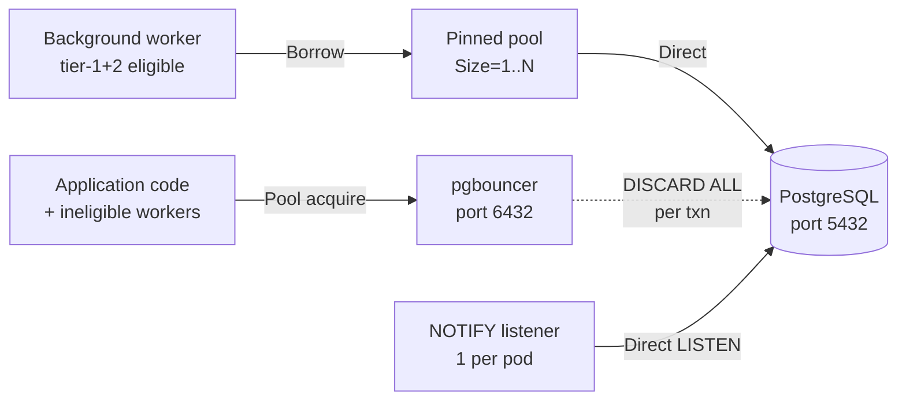

# Pinned Worker Connection Pool

Whizbang background workers normally share the pgbouncer-fronted connection pool with application traffic. Each transaction's return to the pool triggers `DISCARD ALL` to reset session state — a cheap call individually (~60 µs) but one that fires on *every* transaction, including the hot polling loops.

On a measured production-shaped workload (slot 3 dev, alpha `0.674.1-alpha.32`, 16,759-event import), `DISCARD ALL` accounted for **22.5 % of total database time**. The pinned worker connection pool eliminates that overhead for the workers that actually drive the hot path.

## When to enable

The pinned pool is **opt-in** and **off by default**. Enable it when:

- Hot worker `DISCARD ALL` cost is observably eating a meaningful slice of DB time (use `pg_stat_statements`, filtered by `dbid` to isolate your service's database).
- You have a way to provide a direct PostgreSQL connection string that bypasses pgbouncer (typically pointing at port `5432` rather than the pgbouncer port `6432`).
- The host environment can spare the extra direct PG connections — see [Connection budget](#connection-budget) below.

Leave it off for development, single-instance deployments, or any environment where the pgbouncer hop is already low-latency and the worker fleet is small.

## How it works



Eligible workers borrow a connection from the pinned pool for the duration of their transaction, then return it. The connection itself stays open for `ConnectionLifetimeSeconds` (default 30 min) before being recycled. No `DISCARD ALL` fires because the connection never re-enters a multi-tenant pool.

## Worker eligibility (tiers)

Eligibility is **tier-driven**, not per-worker config. The tiers reflect measured DB pressure, not arbitrary categorization.

### Tier 1 — always pinned when enabled

| Worker | Why it's tier 1 |
|---|---|
| `ClaimWorker` | Hot poll loop — calls `claim_work` + 3× `claim_orphaned_*` per wake; biggest single DB-time consumer |
| `OutboxPublishWorker` | Polls `fetch_outbox_batch`, publishes, flushes completions |
| `HeartbeatWorker` | Upserts `wh_service_instances` every ~5 s; always-on |
| `LeaseRenewalWorker` | Updates `wh_active_streams.lease_expiry` every ~10 s; always-on |

### Tier 2 — flush channels (opt-in, default on)

Controlled by `IncludeFlushWorkers` (default `true` once `Enabled=true`).

| Worker | What it flushes |
|---|---|
| `InboxHandlerWorker` | Calls `commit_handler_batch` (the two-tier handler-commit orchestrator) |
| `OutboxCompletionFlushWorker` | Calls `complete_outbox_published` for completed sends |
| `PerspectiveCompletionFlushWorker` | Calls `process_perspective_event_completions` for projected events |
| `FailureFlushWorker` | Calls `report_failures` for batched failure rollups |

### Not eligible

These workers do not borrow from the pinned pool — pinning them would cost a connection slot for marginal benefit.

- `TransportConsumerWorker`, `ServiceBusConsumerWorker` — transport I/O dominates; DB time is a small share.
- `PerspectiveMigrationWorker` — one-shot at startup.
- `MaintenanceWorker`, `BackupTickCoordinator`, `WhizbangShutdownService`, `IdleActivityTouchHookBinder` — periodic at minute-scale or lifecycle-only.
- `OrphanInboxJanitor`, `DeadLetterRecoveryWorker`, `RecentlyProcessedEventCacheSweepWorker` — periodic at minute-scale, marginal benefit.

### Opting in a custom worker

Consumer code (typically inside a service that defines its own background worker) can add custom workers to the eligibility set:

```csharp{
title: "Opt a custom worker into the pinned pool"
description: "Registers a consumer-defined background worker as pinned-pool eligible so it borrows a direct connection alongside the tier-1+2 defaults."
framework: "NET10"
category: "Workers"
difficulty: "INTERMEDIATE"
tags: ["pinned-pool", "custom-worker", "eligibility", "hosted-service", "opt-in"]
}
services.AddHostedService<MyBulkImportPollingWorker>();
services.AddPinnedWorker<MyBulkImportPollingWorker>();
```

The opt-in is additive; the tier-1+2 defaults remain in effect. Use `ExcludeWorkers` (below) to remove a tier-default worker by short name.

## Configuration

The options class is `WhizbangPinnedPoolOptions`. The registration helper takes a configure callback so the consumer can bind from any configuration source — typically `Whizbang:Workers:PinnedPool` in `appsettings.json` / env vars (kept consistent with devops conventions), but the binding itself happens in the consumer (matches the pattern used by `AddWhizbangAzureBlobOffload` and keeps `Whizbang.Core` AOT-clean).

| Property | Type | Default | Description |
|---|---|---|---|
| `ConnectionStringName` | string? | `null` | **Preferred.** Name of a key under standard `ConnectionStrings:*` configuration to resolve the direct conn string from (e.g. `"bffservice-db-direct"`). Wins over `ConnectionString` when both are set. |
| `ConnectionString` | string? | `null` | Inline direct (non-pgbouncer) PG conn string. Fallback when `ConnectionStringName` is unset or unresolved. At least one of the two sources must resolve for the pool to take effect. |
| `Enabled` | bool | `false` | Master switch. `false` → workers stay on pgbouncer. |
| `Size` | int | `1` | Number of pinned connections held open. |
| `IncludeFlushWorkers` | bool | `true` | Whether tier-2 flush workers also pin. |
| `ExcludeWorkers` | string[] | `[]` | CLR short names of workers to skip. Escape hatch. |
| `ConnectionLifetimeSeconds` | int | `1800` | Auto-recycle a connection after this many seconds. |
| `BorrowTimeoutMilliseconds` | int | `5000` | How long a worker waits to borrow before throwing. |

### Connection-string source: name vs inline

The pool resolves its connection string in this order:

1. **`ConnectionStringName`** — looked up via `IConfiguration.GetConnectionString(name)`. Recommended for production because it keeps the secret-bearing string under standard `ConnectionStrings:*` configuration alongside the rest of the app's database secrets — key-vault, env-var, and log-redaction conventions all apply uniformly.
2. **`ConnectionString`** — used when `ConnectionStringName` is unset OR the named key doesn't resolve. Convenient for tests / dev rigs / single-line registration.
3. Neither set → silent no-op (pool returns `NoOpPinnedConnectionPool`, workers stay on pgbouncer). Matches `Enabled=false` behaviour so the registration is safe to call unconditionally.

When configuring a real service, the typical pattern is a sibling under `ConnectionStrings:*`:

```jsonc{
title: "Configure a direct connection string for the pinned pool"
description: "Adds a direct (port 5432) sibling under ConnectionStrings and points the pinned pool at it by name, bypassing pgbouncer for hot-path workers."
category: "Workers"
difficulty: "BEGINNER"
tags: ["pinned-pool", "connection-string", "pgbouncer", "appsettings", "configuration"]
}
// appsettings.json
{
  "ConnectionStrings": {
    "bffservice-db":        "Host=…;Port=6432;…", // pgbouncer (existing)
    "bffservice-db-direct": "Host=…;Port=5432;…"  // direct (new)
  },
  "Whizbang": {
    "Workers": {
      "PinnedPool": {
        "Enabled": true,
        "ConnectionStringName": "bffservice-db-direct"
      }
    }
  }
}
```

### Minimal registration

```csharp{
title: "Register the pinned pool from configuration"
description: "Binds the full WhizbangPinnedPoolOptions from the Whizbang:Workers:PinnedPool section so every setting is config-driven, keeping Whizbang.Core AOT-clean."
framework: "NET10"
category: "Workers"
difficulty: "BEGINNER"
tags: ["pinned-pool", "registration", "options-binding", "configuration", "dependency-injection"]
}
services.AddWhizbangPinnedWorkerPool(opts => {
  // Bind everything from the configured section — both ConnectionStringName
  // and any other settings come through this single call.
  builder.Configuration.GetSection("Whizbang:Workers:PinnedPool").Bind(opts);
});
```

The simpler "everything in code" shape, when you don't want config-driven values (test/dev):

```csharp{
title: "Register the pinned pool entirely in code"
description: "Sets the direct connection string and enables the pool inline without a config section — the minimal test/dev shape for the pinned worker pool."
framework: "NET10"
category: "Workers"
difficulty: "BEGINNER"
tags: ["pinned-pool", "registration", "connection-string", "dev", "dependency-injection"]
}
services.AddWhizbangPinnedWorkerPool(opts => {
  opts.ConnectionString = builder.Configuration.GetConnectionString("WorkerDirect");
  opts.Enabled = true;
});
```

### Tuning size

```csharp{
title: "Tune the pinned pool size"
description: "Raises the pinned pool to two connections so the hot ClaimWorker no longer shares a single wire with the tier-2 flush workers, easing borrow contention."
framework: "NET10"
category: "Workers"
difficulty: "INTERMEDIATE"
tags: ["pinned-pool", "pool-size", "tuning", "flush-workers", "throughput"]
}
services.AddWhizbangPinnedWorkerPool(opts => {
  opts.ConnectionString = builder.Configuration.GetConnectionString("WorkerDirect");
  opts.Enabled = true;
  opts.Size = 2;                                // splits ClaimWorker from flush workers
  opts.IncludeFlushWorkers = true;
});
```

### Surgical exclusion

```csharp{
title: "Exclude a specific worker from the pinned pool"
description: "Uses ExcludeWorkers to drop a tier-default worker by short name so it stays on pgbouncer while the rest of the fleet remains pinned."
framework: "NET10"
category: "Workers"
difficulty: "ADVANCED"
tags: ["pinned-pool", "exclude-workers", "heartbeat", "eligibility", "escape-hatch"]
}
services.AddWhizbangPinnedWorkerPool(opts => {
  opts.ConnectionString = builder.Configuration.GetConnectionString("WorkerDirect");
  opts.Enabled = true;
  opts.Size = 1;
  opts.ExcludeWorkers = new[] { "HeartbeatWorker" };  // investigating heartbeat under pinning
});
```

## Connection budget

The total direct PG connections per pod increases by `Size`. Sizing math:

```
direct_pg_conns_per_pod = 1 (LISTEN)
                       + Size (pinned pool)
total_direct_pg_conns   = num_pods × direct_pg_conns_per_pod
```

At `Size=1` and 50 pods, that's **100 direct PG conns** plus whatever pgbouncer is using. Match this against your PostgreSQL `max_connections` and pgbouncer's `default_pool_size`. If you have headroom for more direct conns, raising `Size` is reasonable.

`Size=1` is the right starting point. Raise to `2` if you observe pinned-pool borrow timeouts in logs (worker queuing on a single wire is hurting flush latency).

## Validation

When `Enabled=true`, the registration extension validates `Size > 0` at startup. If neither `ConnectionStringName` nor `ConnectionString` resolves to a non-empty string, the feature silently no-ops — workers continue using pgbouncer. This is intentional: it lets you ship the registration code into all environments and toggle on per-environment via configuration.

## Observability

Two metrics surface the pinned pool's behaviour:

| Metric | Type | Tags | What it shows |
|---|---|---|---|
| `whizbang.workers.pinned_pool.borrow.duration` | histogram (ms) | `worker_name` | Time from borrow request to connection handed out — should be near-zero in steady state. |
| `whizbang.workers.pinned_pool.borrow.timeouts` | counter | `worker_name` | Borrow-timeout count — if non-zero, raise `Size` or investigate which worker is holding too long. |

Pair these with the `pg_stat_statements` query in [Connection budget](#connection-budget) to confirm the post-enable `DISCARD ALL` share has dropped.

## Migration from un-pinned

The feature is purely additive — no code changes required in workers. Worker classes don't know they're being pinned; the borrow is plumbed through the existing `IWorkCoordinator` resolution path. Toggling `Enabled` between `true` and `false` is safe at any time (a rolling deploy is sufficient — no migration window required).

## Related

- [pgbouncer topology overview](../work-coordinator/notifications-and-pgbouncer.md) — how NOTIFY + worker traffic split across direct and pooled connections.
- [Slot-3 perf measurement (2026-06-10)](../../proposals/slot-3-perf-baseline.md) — the measurement that motivated this feature.
