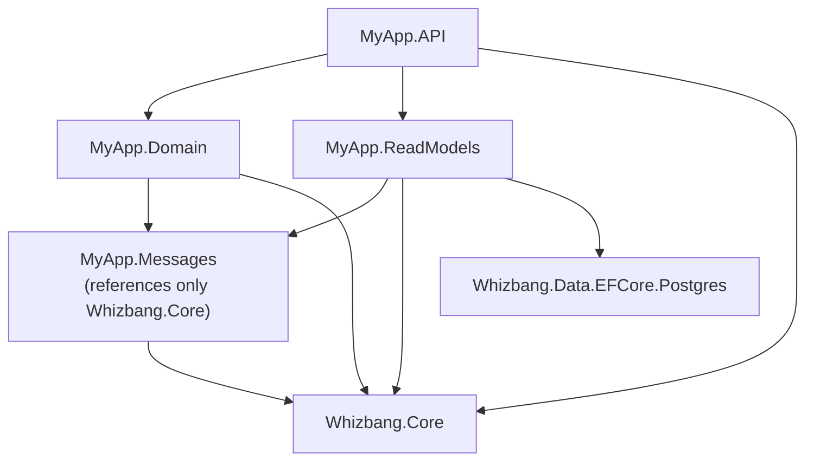

# Project Structure Guide

This guide shows recommended project structures for Whizbang applications, from simple single-project apps to complex multi-service architectures.

## Quick Reference

| Architecture | When to Use | Example |
|--------------|-------------|---------|
| [Single Project](#single-project-structure) | Simple apps, prototypes, learning | Todo app, simple API |
| [Clean Architecture](#clean-architecture-structure) | Medium apps, clear boundaries | E-commerce site, CRM |
| [Microservices](#microservices-structure) | Distributed systems, team scaling | Multi-tenant SaaS, complex domains |

## Core Principles

Regardless of project size, follow these principles:

1. **Separate Messages from Logic** - Commands/Events in dedicated projects
2. **Stateless Receptors** - No state in message handlers
3. **Read Model Isolation** - Perspectives maintain their own data
4. **Explicit Dependencies** - Clear project references, no circular dependencies
5. **Configuration by Environment** - appsettings.{Environment}.json pattern

---

## Single Project Structure

**Best for**: Learning, prototypes, simple APIs (< 10 message types)

```
MyApp/
├── MyApp.API/                          # Single ASP.NET Core project
│   ├── Program.cs                      # DI configuration + app setup
│   ├── appsettings.json
│   ├── appsettings.Development.json
│   │
│   ├── Messages/                       # Commands and Events
│   │   ├── Commands/
│   │   │   ├── CreateOrder.cs
│   │   │   └── CancelOrder.cs
│   │   └── Events/
│   │       ├── OrderCreated.cs
│   │       └── OrderCancelled.cs
│   │
│   ├── Receptors/                      # Message handlers
│   │   ├── CreateOrderReceptor.cs
│   │   └── CancelOrderReceptor.cs
│   │
│   ├── Perspectives/                   # Read model updaters
│   │   └── OrderSummaryPerspective.cs
│   │
│   ├── Lenses/                         # Query interfaces
│   │   └── OrderLens.cs
│   │
│   ├── Endpoints/                      # HTTP endpoints
│   │   └── OrdersController.cs
│   │
│   └── Models/                         # Read models / DTOs
│       └── OrderSummary.cs
│
└── MyApp.API.Tests/                    # Tests
    ├── Receptors/
    │   └── CreateOrderReceptorTests.cs
    └── Perspectives/
        └── OrderSummaryPerspectiveTests.cs
```

### Program.cs Setup

```csharp{title="Program.cs Setup" description="Program.cs Setup" category="Configuration" difficulty="INTERMEDIATE" tags=["Getting-started", "C#", "Program.cs", "Setup"]}
using Microsoft.EntityFrameworkCore;
using Whizbang.Core;
using Whizbang.Data.EFCore.Postgres;

var builder = WebApplication.CreateBuilder(args);

// EF Core DbContext (provides Inbox/Outbox/EventStore via [WhizbangDbContext])
var connectionString = builder.Configuration.GetConnectionString("DefaultConnection")!;
builder.Services.AddDbContext<AppDbContext>(options =>
    options.UseNpgsql(connectionString));

// Unified Whizbang registration with the EF Core Postgres driver
builder.Services
    .AddWhizbang()
    .WithEFCore<AppDbContext>()
    .WithDriver.Postgres;

// Generated registrations (produced by Whizbang.Generators)
builder.Services.AddReceptors();
builder.Services.AddWhizbangDispatcher();

// Controllers
builder.Services.AddControllers();
builder.Services.AddEndpointsApiExplorer();
builder.Services.AddSwaggerGen();

var app = builder.Build();

// Initialize Whizbang schema (generated, idempotent)
using (var scope = app.Services.CreateScope()) {
    var dbContext = scope.ServiceProvider.GetRequiredService<AppDbContext>();
    await dbContext.EnsureWhizbangDatabaseInitializedAsync();
}

if (app.Environment.IsDevelopment()) {
    app.UseSwagger();
    app.UseSwaggerUI();
}

app.UseHttpsRedirection();
app.UseAuthorization();
app.MapControllers();

app.Run();
```

### Message Organization

**Commands** (imperative - intent to change state):
```csharp{title="Message Organization" description="Commands (imperative - intent to change state):" category="Configuration" difficulty="INTERMEDIATE" tags=["Getting-started", "C#", "Message", "Organization"]}
// Messages/Commands/CreateOrder.cs
using Whizbang.Core;

namespace MyApp.API.Messages.Commands;

public record CreateOrder(
    [property: StreamId] Guid OrderId,
    Guid CustomerId,
    OrderLineItem[] Items
) : ICommand;

public record OrderLineItem(
    Guid ProductId,
    int Quantity,
    decimal UnitPrice
);
```

**Events** (past tense - fact of what happened):
```csharp{title="Message Organization - OrderCreated" description="Events (past tense - fact of what happened):" category="Configuration" difficulty="INTERMEDIATE" tags=["Getting-started", "C#", "Message", "Organization", "OrderCreated"]}
// Messages/Events/OrderCreated.cs
using Whizbang.Core;

namespace MyApp.API.Messages.Events;

public record OrderCreated(
    [property: StreamId] Guid OrderId,
    Guid CustomerId,
    OrderLineItem[] Items,
    decimal Total,
    DateTimeOffset CreatedAt
) : IEvent;
```

### Pros and Cons

**Pros**:
- ✅ Simple to understand and navigate
- ✅ Fast to set up and iterate
- ✅ Single deployment unit
- ✅ Easy debugging (single process)

**Cons**:
- ❌ Limited scalability (single service)
- ❌ Can become cluttered as app grows
- ❌ All logic in one deployable
- ❌ Hard to scale specific components independently

---

## Clean Architecture Structure

**Best for**: Medium-sized applications with clear domain boundaries

```
MyApp/
├── src/
│   ├── MyApp.Messages/                 # Shared message contracts
│   │   ├── Commands/
│   │   │   ├── CreateOrder.cs
│   │   │   └── CancelOrder.cs
│   │   ├── Events/
│   │   │   ├── OrderCreated.cs
│   │   │   └── OrderCancelled.cs
│   │   └── MyApp.Messages.csproj
│   │
│   ├── MyApp.Domain/                   # Business logic (receptors)
│   │   ├── Receptors/
│   │   │   ├── CreateOrderReceptor.cs
│   │   │   └── CancelOrderReceptor.cs
│   │   └── MyApp.Domain.csproj         # References: Messages, Whizbang.Core
│   │
│   ├── MyApp.ReadModels/               # Perspectives and Lenses
│   │   ├── Perspectives/
│   │   │   ├── OrderSummaryPerspective.cs
│   │   │   └── InventoryPerspective.cs
│   │   ├── Lenses/
│   │   │   ├── OrderLens.cs
│   │   │   └── InventoryLens.cs
│   │   ├── Models/
│   │   │   ├── OrderSummary.cs
│   │   │   └── InventoryLevel.cs
│   │   └── MyApp.ReadModels.csproj     # References: Messages, Whizbang.Core
│   │
│   └── MyApp.API/                      # HTTP API
│       ├── Program.cs
│       ├── Endpoints/
│       │   ├── OrderEndpoints.cs
│       │   └── InventoryEndpoints.cs
│       └── MyApp.API.csproj            # References: Domain, ReadModels
│
├── tests/
│   ├── MyApp.Domain.Tests/
│   │   └── Receptors/
│   │       └── CreateOrderReceptorTests.cs
│   ├── MyApp.ReadModels.Tests/
│   │   └── Perspectives/
│   │       └── OrderSummaryPerspectiveTests.cs
│   └── MyApp.Integration.Tests/
│       └── OrderWorkflowTests.cs
│
└── MyApp.sln
```

### Project Dependencies



**Key Point**: The Messages project references **only Whizbang.Core** (for `ICommand`, `IEvent`, `[StreamId]`, `[WhizbangId]`) - making it easy to share across services.

### Central Package Management

Use `Directory.Packages.props` for version consistency:

```xml{title="Central Package Management" description="Use `Directory." category="Configuration" difficulty="INTERMEDIATE" tags=["Getting-started", "Xml", "Central", "Package", "Management"]}
<!-- Directory.Packages.props (solution root) -->
<Project>
  <PropertyGroup>
    <ManagePackageVersionsCentrally>true</ManagePackageVersionsCentrally>
  </PropertyGroup>

  <ItemGroup>
    <PackageVersion Include="Whizbang.Core" Version="x.x.x" />
    <PackageVersion Include="Whizbang.Generators" Version="x.x.x" />
    <PackageVersion Include="Whizbang.Data.Dapper.Postgres" Version="x.x.x" />
    <PackageVersion Include="Whizbang.Transports.AzureServiceBus" Version="x.x.x" />
  </ItemGroup>
</Project>
```

Then in project files:
```xml{title="Central Package Management (2)" description="Then in project files:" category="Configuration" difficulty="BEGINNER" tags=["Getting-started", "Xml", "Central", "Package", "Management"]}
<!-- MyApp.API.csproj -->
<ItemGroup>
  <PackageReference Include="Whizbang.Core" />  <!-- Version comes from Directory.Packages.props -->
  <PackageReference Include="Whizbang.Generators" />
</ItemGroup>
```

### Shared Build Properties

Use `Directory.Build.props` for consistent settings:

```xml{title="Shared Build Properties" description="Use `Directory." category="Configuration" difficulty="INTERMEDIATE" tags=["Getting-started", "Xml", "Shared", "Build", "Properties"]}
<!-- Directory.Build.props (solution root) -->
<Project>
  <PropertyGroup>
    <TargetFramework>net10.0</TargetFramework>
    <LangVersion>13</LangVersion>
    <Nullable>enable</Nullable>
    <ImplicitUsings>enable</ImplicitUsings>
    <TreatWarningsAsErrors>true</TreatWarningsAsErrors>
  </PropertyGroup>

  <PropertyGroup>
    <!-- Source Generator Settings -->
    <EmitCompilerGeneratedFiles>true</EmitCompilerGeneratedFiles>
    <CompilerGeneratedFilesOutputPath>$(MSBuildProjectDirectory)/.whizbang/cache</CompilerGeneratedFilesOutputPath>
  </PropertyGroup>
</Project>
```

### Pros and Cons

**Pros**:
- ✅ Clear separation of concerns
- ✅ Testable in isolation
- ✅ Reusable message contracts
- ✅ Easy to understand dependencies
- ✅ Can grow to microservices later

**Cons**:
- ❌ More projects to manage
- ❌ Still a single deployable
- ❌ Some indirection (navigate across projects)

---

## Microservices Structure

**Best for**: Distributed systems, team scaling, independent deployment needs

This is the structure used in the **ECommerce sample** (12 projects).

```
ECommerce/
├── ECommerce.Contracts/                # Shared contracts (commands + events + IDs)
│   ├── Commands/
│   │   ├── CreateOrderCommand.cs
│   │   ├── ReserveInventoryCommand.cs
│   │   └── ProcessPaymentCommand.cs
│   ├── Events/
│   │   ├── OrderCreatedEvent.cs
│   │   ├── InventoryReservedEvent.cs
│   │   └── PaymentProcessedEvent.cs
│   ├── Lenses/                         # Shared read model DTOs
│   │   ├── ProductDto.cs
│   │   └── InventoryLevelDto.cs
│   └── Ids.cs                          # [WhizbangId] strongly-typed IDs
│
├── ECommerce.BFF.API/                  # Backend for Frontend (UI layer)
│   ├── Program.cs
│   ├── Perspectives/                   # Read models for UI (pure Apply)
│   ├── Lenses/                         # Custom query services
│   ├── Hubs/                           # SignalR real-time
│   ├── GraphQL/                        # HotChocolate queries
│   └── Endpoints/                      # FastEndpoints REST API
│
├── ECommerce.OrderService.API/         # Order management service
│   ├── Program.cs
│   ├── OrderDbContext.cs               # [WhizbangDbContext] partial DbContext
│   ├── Receptors/
│   │   └── CreateOrderReceptor.cs
│   ├── Endpoints/                      # FastEndpoints REST API
│   └── GraphQL/                        # HotChocolate mutations/queries
│
├── ECommerce.InventoryWorker/          # Inventory reservation (background worker)
│   ├── Program.cs
│   ├── InventoryDbContext.cs
│   ├── Receptors/
│   ├── Perspectives/
│   └── Worker.cs
│
├── ECommerce.PaymentWorker/            # Payment processing (background worker)
├── ECommerce.ShippingWorker/           # Fulfillment coordination (background worker)
├── ECommerce.NotificationWorker/       # Cross-cutting notifications (background worker)
│
├── ECommerce.UI/                       # Angular frontend
│
├── ECommerce.AppHost/                  # .NET Aspire orchestration
│   └── Program.cs
├── ECommerce.ServiceDefaults/          # Shared telemetry/health-check defaults
│
├── ECommerce.Contracts.Tests/          # Contract tests (TUnit)
└── ECommerce.IntegrationTests/         # End-to-end tests (TUnit)
```

### Service Responsibilities

| Service | Type | Responsibilities |
|---------|------|------------------|
| **BFF.API** | ASP.NET Core API | UI aggregation, SignalR, read models, GraphQL |
| **OrderService.API** | ASP.NET Core API | Order creation, REST + GraphQL |
| **InventoryWorker** | Background Worker | Inventory reservation, stock management |
| **PaymentWorker** | Background Worker | Payment processing, refunds |
| **ShippingWorker** | Background Worker | Fulfillment coordination |
| **NotificationWorker** | Background Worker | Email, SMS, push notifications |

### Communication Pattern

```mermaid
sequenceDiagram
    participant UI
    participant BFF as BFF.API
    participant Dispatcher as Dispatcher (local)
    participant Receptor
    participant Outbox
    participant Publisher as WorkCoordinatorPublisher
    participant ASB as Azure Service Bus
    participant Inventory as InventoryWorker
    participant Payment as PaymentWorker
    participant Perspectives as BFF Perspectives

    UI->>BFF: 1. Send CreateOrder command (via HTTP POST)
    BFF->>Dispatcher: 2. LocalInvokeAsync&lt;CreateOrder, OrderCreated&gt;()
    Receptor->>Outbox: 3. Stores OrderCreated event in outbox
    Publisher->>ASB: 4. Publishes OrderCreated to topic
    ASB->>Inventory: 5. Subscribes to OrderCreated - processes event, publishes InventoryReserved
    ASB->>Payment: 6. Subscribes to InventoryReserved - processes event, publishes PaymentProcessed
    ASB->>Perspectives: 7. Subscribe to all events - update read models, trigger SignalR updates to UI
```

### .NET Aspire Orchestration

**ECommerce.AppHost/Program.cs**:
```csharp{title=".NET Aspire Orchestration" description="**ECommerce." category="Configuration" difficulty="ADVANCED" tags=["Getting-started", "C#", "Aspire", "Orchestration"]}
var builder = DistributedApplication.CreateBuilder(args);

// Infrastructure - one PostgreSQL server, one database per service
var postgres = builder.AddPostgres("postgres")
    .WithPgAdmin();

var ordersDb = postgres.AddDatabase("ordersdb");
var inventoryDb = postgres.AddDatabase("inventorydb");
var paymentDb = postgres.AddDatabase("paymentdb");
var shippingDb = postgres.AddDatabase("shippingdb");
var notificationDb = postgres.AddDatabase("notificationdb");
var bffDb = postgres.AddDatabase("bffdb");

// Azure Service Bus emulator with topics + per-service subscriptions
var serviceBus = builder.AddAzureServiceBus("servicebus")
    .RunAsEmulator();

// Services (each references its own database + the shared transport)
var orderService = builder.AddProject<Projects.ECommerce_OrderService_API>("orderservice")
    .WithReference(ordersDb)
    .WithReference(serviceBus);

var inventoryWorker = builder.AddProject<Projects.ECommerce_InventoryWorker>("inventoryworker")
    .WithReference(inventoryDb)
    .WithReference(serviceBus);

var paymentWorker = builder.AddProject<Projects.ECommerce_PaymentWorker>("paymentworker")
    .WithReference(paymentDb)
    .WithReference(serviceBus);

var shippingWorker = builder.AddProject<Projects.ECommerce_ShippingWorker>("shippingworker")
    .WithReference(shippingDb)
    .WithReference(serviceBus);

var notificationWorker = builder.AddProject<Projects.ECommerce_NotificationWorker>("notificationworker")
    .WithReference(notificationDb)
    .WithReference(serviceBus);

var ui = builder.AddNpmApp("ui", "../ECommerce.UI", "start")
    .WithHttpEndpoint(port: 4200, env: "PORT")
    .WithExternalHttpEndpoints();

var bff = builder.AddProject<Projects.ECommerce_BFF_API>("bff")
    .WithReference(bffDb)
    .WithReference(serviceBus)
    .WithReference(ui)  // BFF discovers the Angular URL for CORS
    .WithExternalHttpEndpoints();

builder.Build().Run();
```

**Benefits**:
- One-command local development: `dotnet run --project ECommerce.AppHost`
- Automatic service discovery
- Built-in Aspire dashboard
- PostgreSQL and Service Bus emulators
- Health checks and observability

### Pros and Cons

**Pros**:
- ✅ Independent deployment per service
- ✅ Scalability (scale specific services)
- ✅ Team autonomy (own services)
- ✅ Technology diversity (different stacks per service if needed)
- ✅ Fault isolation

**Cons**:
- ❌ Complexity (distributed system challenges)
- ❌ Eventual consistency
- ❌ Debugging across services
- ❌ Infrastructure overhead

---

## Configuration Patterns

### appsettings.json Structure

**Development** (`appsettings.Development.json`):
```json{title="appsettings.json Structure" description="Development (`appsettings." category="Configuration" difficulty="INTERMEDIATE" tags=["Getting-started", "Json", "Structure"]}
{
  "Logging": {
    "LogLevel": {
      "Default": "Information",
      "Whizbang": "Debug",
      "Microsoft.AspNetCore": "Warning"
    }
  },
  "ConnectionStrings": {
    "DefaultConnection": "Host=localhost;Database=myapp;Username=postgres;Password=dev_password"
  },
  "WorkCoordinatorPublisher": {
    "PollingIntervalMilliseconds": 1000,
    "LeaseSeconds": 300,
    "DebugMode": true
  },
  "PerspectiveWorker": {
    "PollingIntervalMilliseconds": 1000,
    "LeaseSeconds": 300
  }
}
```

**Production** (`appsettings.Production.json`):
```json{title="appsettings.json Structure (2)" description="Production (`appsettings." category="Configuration" difficulty="INTERMEDIATE" tags=["Getting-started", "Json", "Structure"]}
{
  "Logging": {
    "LogLevel": {
      "Default": "Warning",
      "Whizbang": "Information"
    }
  },
  "ConnectionStrings": {
    "DefaultConnection": "${DATABASE_URL}"  // Injected from environment
  },
  "WorkCoordinatorPublisher": {
    "PollingIntervalMilliseconds": 5000,
    "LeaseSeconds": 600,
    "DebugMode": false
  }
}
```

### Environment Variables

Use environment variables for secrets:

```bash{title="Environment Variables" description="Use environment variables for secrets:" category="Configuration" difficulty="BEGINNER" tags=["Getting-started", "Bash", "Environment", "Variables"]}
# .env (local development - NOT committed)
DATABASE_URL=Host=localhost;Database=myapp;Username=postgres;Password=dev_password
SERVICE_BUS_CONNECTION_STRING=Endpoint=sb://localhost;...

# Kubernetes/Docker secrets
kubectl create secret generic myapp-db --from-literal=connection-string="Host=..."
```

---

## Dependency Injection Patterns

### Service Registration Layers

**Layer 1: DbContext + Unified Whizbang API** (EF Core Postgres driver):
```csharp{title="Service Registration Layers" description="Layer 1: DbContext + Unified Whizbang API:" category="Configuration" difficulty="BEGINNER" tags=["Getting-started", "C#", "Service", "Registration", "Layers"]}
builder.Services.AddDbContext<AppDbContext>(options =>
    options.UseNpgsql(connectionString));

builder.Services
    .AddWhizbang()                 // IDispatcher, workers, envelope infrastructure
    .WithEFCore<AppDbContext>()    // IInbox, IOutbox, IEventStore via EF Core
    .WithDriver.Postgres;          // IPerspectiveStore<T> + ILensQuery<T> per model
```

**Layer 2: Generated Registrations** (produced by Whizbang.Generators):
```csharp{title="Service Registration Layers (2)" description="Layer 2: Generated Registrations:" category="Configuration" difficulty="BEGINNER" tags=["Getting-started", "C#", "Service", "Registration", "Layers"]}
builder.Services.AddReceptors();           // All discovered IReceptor implementations
builder.Services.AddWhizbangDispatcher();  // Generated zero-reflection dispatcher
builder.Services.AddPerspectiveRunners();  // All discovered perspective runners
```

**Layer 3: Transports**:
```csharp{title="Service Registration Layers (3)" description="Layer 3: Transports:" category="Configuration" difficulty="BEGINNER" tags=["Getting-started", "C#", "Service", "Registration", "Layers"]}
builder.Services.AddAzureServiceBusTransport(serviceBusConnection);
// OR
builder.Services.AddRabbitMQTransport(rabbitMqConnection);
```

**Layer 4: Application Services**:
```csharp{title="Service Registration Layers (4)" description="Layer 4: Application Services:" category="Configuration" difficulty="BEGINNER" tags=["Getting-started", "C#", "Service", "Registration", "Layers"]}
builder.Services.AddTransient<OrderQueryService>();  // Wraps ILensQuery<OrderSummary>
builder.Services.AddSingleton<IEmailService, SendGridEmailService>();
```

### Lifetime Guidelines

| Component | Lifetime | Reason |
|-----------|----------|--------|
| `IDispatcher` | Singleton | Shared router, no state |
| `IReceptor<,>` | Transient | May inject scoped services (DbContext) |
| `IPerspectiveFor<,...>` | Stateless | Pure Apply functions - no injected services |
| `ILensQuery<T>` | Scoped | Wraps the scoped EF Core `DbContext` |
| `DbContext` | Scoped | Per-request database context |

---

## Testing Structure

### Unit Tests

**Test receptors in isolation**:
```csharp{title="Unit Tests" description="Test receptors in isolation:" category="Configuration" difficulty="INTERMEDIATE" tags=["Getting-started", "C#", "Unit", "Tests"]}
// tests/MyApp.Domain.Tests/Receptors/CreateOrderReceptorTests.cs
public class CreateOrderReceptorTests {
    [Test]
    public async Task HandleAsync_ValidOrder_ReturnsOrderCreatedAsync() {
        // Arrange
        var receptor = new CreateOrderReceptor(/* mock dependencies */);
        var command = new CreateOrder(/* ... */);

        // Act
        var result = await receptor.HandleAsync(command);

        // Assert
        await Assert.That(result.OrderId).IsNotEqualTo(Guid.Empty);
    }
}
```

### Integration Tests

**Test full message flow**:
```csharp{title="Integration Tests" description="Test full message flow:" category="Configuration" difficulty="INTERMEDIATE" tags=["Getting-started", "C#", "Integration", "Tests"]}
// tests/MyApp.Integration.Tests/OrderWorkflowTests.cs
public class OrderWorkflowTests {
    private WebApplicationFactory<Program> _factory;
    private IDispatcher _dispatcher;

    [Before(Test)]
    public async Task SetupAsync() {
        _factory = new WebApplicationFactory<Program>();
        _dispatcher = _factory.Services.GetRequiredService<IDispatcher>();
    }

    [Test]
    public async Task CreateOrder_FullWorkflow_UpdatesReadModelAsync() {
        // Arrange
        var command = new CreateOrder(/* ... */);

        // Act - dispatch command (returned event cascades to perspectives)
        var result = await _dispatcher.LocalInvokeAsync<CreateOrder, OrderCreated>(command);

        // Assert - query read model via lens (use a completion signal in real tests
        // rather than polling; see AppendAndWaitAsync / lifecycle hooks)
        using var scope = _factory.Services.CreateScope();
        var lens = scope.ServiceProvider.GetRequiredService<ILensQuery<OrderSummary>>();
        var order = await lens.DefaultScope.GetByIdAsync(result.OrderId);

        await Assert.That(order).IsNotNull();
        await Assert.That(order!.Status).IsEqualTo("Created");
    }
}
```

---

## Migration Paths

### Single → Clean Architecture

1. Create `MyApp.Messages` project
2. Move commands/events to Messages project
3. Create `MyApp.Domain` project
4. Move receptors to Domain project
5. Create `MyApp.ReadModels` project
6. Move perspectives/lenses to ReadModels project
7. Update API project to reference Domain + ReadModels

**Timeline**: 1-2 hours for small app

### Clean Architecture → Microservices

1. Identify service boundaries (order, inventory, payment, etc.)
2. Create service projects (API or Worker)
3. Add transport (Azure Service Bus)
4. Implement Outbox/Inbox patterns
5. Split receptors across services
6. Create BFF for UI aggregation
7. Add .NET Aspire AppHost for orchestration

**Timeline**: 1-2 weeks for initial split, iterative refinement

---

## Best Practices

### DO ✅

- ✅ Use central package management (`Directory.Packages.props`)
- ✅ Use shared build properties (`Directory.Build.props`)
- ✅ Keep messages in separate project (no dependencies)
- ✅ Use auto-discovery for receptors/perspectives (Whizbang.Generators)
- ✅ Follow namespace conventions (Messages.Commands, Messages.Events)
- ✅ Use environment-specific appsettings
- ✅ Keep receptors stateless
- ✅ Test receptors in isolation

### DON'T ❌

- ❌ Put business logic in controllers/endpoints
- ❌ Create circular dependencies between projects
- ❌ Reference domain projects from Messages project
- ❌ Hard-code connection strings
- ❌ Share database contexts across services
- ❌ Use static state in receptors
- ❌ Mix read and write logic in same class

---

## Example: Adding a New Feature

**Scenario**: Add "Cancel Order" feature to Clean Architecture app

### Step 1: Define Message

```csharp{title="Step 1: Define Message" description="Step 1: Define Message" category="Configuration" difficulty="INTERMEDIATE" tags=["Getting-started", "C#", "Step", "Define", "Message"]}
// MyApp.Messages/Commands/CancelOrder.cs
public record CancelOrder(
    [property: StreamId] Guid OrderId,
    string Reason
) : ICommand;

// MyApp.Messages/Events/OrderCancelled.cs
public record OrderCancelled(
    [property: StreamId] Guid OrderId,
    string Reason,
    DateTimeOffset CancelledAt
) : IEvent;
```

### Step 2: Create Receptor

```csharp{title="Step 2: Create Receptor" description="Step 2: Create Receptor" category="Configuration" difficulty="ADVANCED" tags=["Getting-started", "C#", "Step", "Create", "Receptor"]}
// MyApp.Domain/Receptors/CancelOrderReceptor.cs
using Whizbang.Core;
using MyApp.Messages.Commands;
using MyApp.Messages.Events;

public class CancelOrderReceptor(ILensQuery<OrderSummary> orders)
    : IReceptor<CancelOrder, OrderCancelled> {

    public async ValueTask<OrderCancelled> HandleAsync(
        CancelOrder message,
        CancellationToken ct = default) {

        // Validation against the read model
        var order = await orders.DefaultScope.GetByIdAsync(message.OrderId, ct);

        if (order is null) {
            throw new InvalidOperationException($"Order {message.OrderId} not found");
        }

        if (order.Status == "Shipped") {
            throw new InvalidOperationException("Cannot cancel shipped order");
        }

        // Return event (cascades to event store / outbox automatically)
        return new OrderCancelled(
            OrderId: message.OrderId,
            Reason: message.Reason,
            CancelledAt: DateTimeOffset.UtcNow
        );
    }
}
```

### Step 3: Update Perspective

```csharp{title="Step 3: Update Perspective" description="Step 3: Update Perspective" category="Configuration" difficulty="INTERMEDIATE" tags=["Getting-started", "C#", "Step", "Update", "Perspective"]}
// MyApp.ReadModels/Perspectives/OrderSummaryPerspective.cs
public class OrderSummaryPerspective :
    IPerspectiveFor<OrderSummary, OrderCreated, OrderCancelled> {  // Add new event type

    public OrderSummary Apply(OrderSummary currentData, OrderCreated eventData) =>
        currentData with {
            OrderId = eventData.OrderId,
            Status = "Created",
            Total = eventData.Total,
            CreatedAt = eventData.CreatedAt
        };

    public OrderSummary Apply(OrderSummary currentData, OrderCancelled eventData) =>
        currentData with {
            Status = "Cancelled",
            CancelledAt = eventData.CancelledAt
        };
}
```

### Step 4: Add Endpoint

```csharp{title="Step 4: Add Endpoint" description="Step 4: Add Endpoint" category="Configuration" difficulty="INTERMEDIATE" tags=["Getting-started", "C#", "Step", "Add", "Endpoint"]}
// MyApp.API/Endpoints/OrdersController.cs
[HttpPost("{orderId:guid}/cancel")]
public async Task<ActionResult> CancelOrder(
    Guid orderId,
    [FromBody] CancelOrderRequest request,
    CancellationToken ct) {

    var command = new CancelOrder(orderId, request.Reason);

    var result = await _dispatcher.LocalInvokeAsync<CancelOrder, OrderCancelled>(command);

    return Ok(result);
}
```

### Step 5: Test

```csharp{title="Step 5: Test" description="Step 5: Test" category="Configuration" difficulty="INTERMEDIATE" tags=["Getting-started", "C#", "Step", "Test"]}
// MyApp.Domain.Tests/Receptors/CancelOrderReceptorTests.cs
[Test]
public async Task HandleAsync_ValidOrder_ReturnsOrderCancelledAsync() {
    // Arrange
    var receptor = new CancelOrderReceptor(mockDb);
    var command = new CancelOrder(Guid.NewGuid(), "Customer request");

    // Act
    var result = await receptor.HandleAsync(command);

    // Assert
    await Assert.That(result.Reason).IsEqualTo("Customer request");
}
```

**Done!** Auto-discovery registers the receptor automatically on next build.

---

## Further Reading

**Architecture Patterns**:
- [Core Concepts: Dispatcher](../fundamentals/dispatcher/dispatcher.md)
- [Core Concepts: Receptors](../fundamentals/receptors/receptors.md)
- [Core Concepts: Perspectives](../fundamentals/perspectives/perspectives.md)

**Messaging**:
- [Outbox Pattern](../messaging/outbox-pattern.md)
- [Inbox Pattern](../messaging/inbox-pattern.md)
- [Work Coordination](../messaging/work-coordinator.md)

**Examples**:
- [ECommerce Sample Overview](../../drafts/metrics/overview.md)
- BFF Pattern

---

**Next**: Dive into [Core Concepts: Dispatcher](../fundamentals/dispatcher/dispatcher.md) to master message routing patterns.

---

*Version 1.0.0 - Foundation Release | Last Updated: 2024-12-12*
