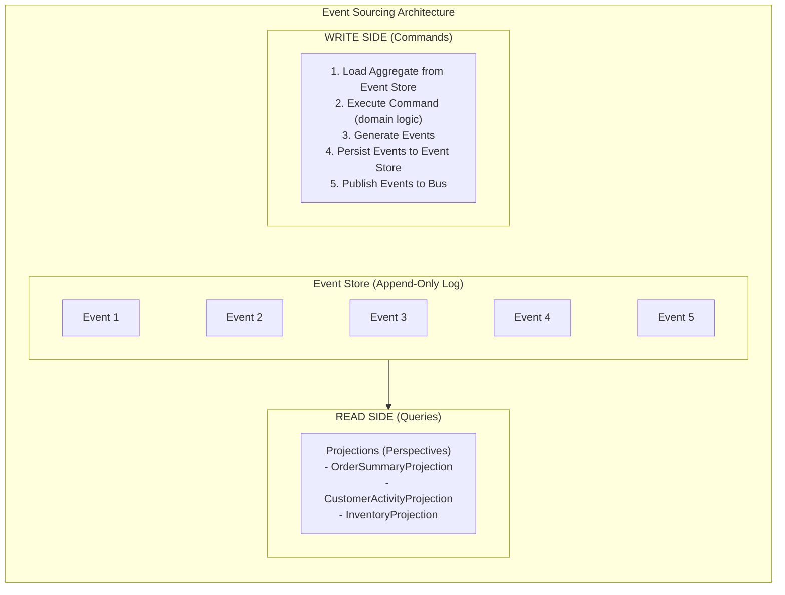

# Event Sourcing & CQRS

Implement **full event sourcing with CQRS** using Whizbang - event store, aggregate reconstruction, snapshots, temporal queries, and read model projections.

:::updated
Whizbang **ships an event store**: `IEventStore` (append via `MessageEnvelope`, `wh_events` table in Postgres), `IEventStoreQuery` for stream reads, and `IPerspectiveSnapshotStore` for snapshots — all registered by `AddWhizbang().WithEFCore<TDbContext>().WithDriver.Postgres`. In a Whizbang application you normally publish events with `IDispatcher.PublishAsync` and let perspectives (`IPerspectiveFor<TModel, TEvents...>`) materialize read models. The hand-rolled store and repository below are a **teaching walkthrough of the mechanics** — useful for understanding what the framework does under the hood, not something you need to build yourself.
:::

---

## Architecture



---

## Event Store Schema

**Migrations/001_CreateEventStore.sql**:

```sql{title="Event Store Schema" description="**Migrations/001_CreateEventStore." category="Example" difficulty="INTERMEDIATE" tags=["Learn", "Examples", "Event", "Store"]}
CREATE TABLE event_store (
  event_id UUID PRIMARY KEY DEFAULT gen_random_uuid(),
  stream_id UUID NOT NULL,
  stream_type TEXT NOT NULL,
  event_type TEXT NOT NULL,
  event_version INTEGER NOT NULL,
  event_data JSONB NOT NULL,
  metadata JSONB NOT NULL DEFAULT '{}'::jsonb,
  timestamp TIMESTAMP NOT NULL DEFAULT NOW(),
  CONSTRAINT unique_stream_version UNIQUE (stream_id, event_version)
);

CREATE INDEX idx_event_store_stream_id ON event_store(stream_id);
CREATE INDEX idx_event_store_timestamp ON event_store(timestamp DESC);
CREATE INDEX idx_event_store_event_type ON event_store(event_type);

-- Snapshots for performance (optional)
CREATE TABLE event_store_snapshots (
  snapshot_id UUID PRIMARY KEY DEFAULT gen_random_uuid(),
  stream_id UUID NOT NULL UNIQUE,
  stream_type TEXT NOT NULL,
  version INTEGER NOT NULL,
  state JSONB NOT NULL,
  timestamp TIMESTAMP NOT NULL DEFAULT NOW()
);

CREATE INDEX idx_snapshots_stream_id ON event_store_snapshots(stream_id);
```

---

## Domain Events

**OrderEvents.cs**:

```csharp{title="Domain Events" description="**OrderEvents." category="Example" difficulty="INTERMEDIATE" tags=["Learn", "Examples", "Domain", "Events"]}
using Whizbang.Core;

public record OrderCreatedEvent(
  [property: StreamId] Guid OrderId,
  string CustomerId,
  OrderItem[] Items,
  decimal TotalAmount,
  DateTime CreatedAt
) : IEvent;

public record PaymentProcessedEvent(
  [property: StreamId] Guid OrderId,
  string PaymentId,
  decimal Amount,
  DateTime ProcessedAt
) : IEvent;

public record OrderShippedEvent(
  [property: StreamId] Guid OrderId,
  string TrackingNumber,
  DateTime ShippedAt
) : IEvent;

public record OrderCancelledEvent(
  [property: StreamId] Guid OrderId,
  string Reason,
  DateTime CancelledAt
) : IEvent;
```

Events implement `IEvent`, and `[StreamId]` marks the stream (aggregate) identifier — Whizbang's source generator derives a zero-reflection stream ID extractor from it.

---

## Aggregate Root

**OrderAggregate.cs**:

```csharp{title="Aggregate Root" description="**OrderAggregate." category="Example" difficulty="ADVANCED" tags=["Learn", "Examples", "Aggregate", "Root"]}
public class OrderAggregate {
  private readonly List<object> _uncommittedEvents = [];

  // State
  public Guid OrderId { get; private set; }
  public string? CustomerId { get; private set; }
  public decimal TotalAmount { get; private set; }
  public OrderStatus Status { get; private set; }
  public int Version { get; private set; }

  // Create new aggregate
  public static OrderAggregate Create(
    Guid orderId,
    string customerId,
    OrderItem[] items
  ) {
    var aggregate = new OrderAggregate();
    var totalAmount = items.Sum(i => i.Quantity * i.UnitPrice);

    var @event = new OrderCreatedEvent(
      OrderId: orderId,
      CustomerId: customerId,
      Items: items,
      TotalAmount: totalAmount,
      CreatedAt: DateTime.UtcNow
    );

    aggregate.Apply(@event);
    aggregate._uncommittedEvents.Add(@event);

    return aggregate;
  }

  // Load from event history
  public static OrderAggregate LoadFromHistory(IEnumerable<object> events) {
    var aggregate = new OrderAggregate();
    foreach (var @event in events) {
      aggregate.Apply(@event);
      aggregate.Version++;
    }
    return aggregate;
  }

  // Commands
  public void ProcessPayment(string paymentId, decimal amount) {
    if (Status != OrderStatus.Pending) {
      throw new InvalidOperationException($"Cannot process payment for order in {Status} status");
    }

    var @event = new PaymentProcessedEvent(
      OrderId: OrderId,
      PaymentId: paymentId,
      Amount: amount,
      ProcessedAt: DateTime.UtcNow
    );

    Apply(@event);
    _uncommittedEvents.Add(@event);
  }

  public void Ship(string trackingNumber) {
    if (Status != OrderStatus.PaymentProcessed) {
      throw new InvalidOperationException($"Cannot ship order in {Status} status");
    }

    var @event = new OrderShippedEvent(
      OrderId: OrderId,
      TrackingNumber: trackingNumber,
      ShippedAt: DateTime.UtcNow
    );

    Apply(@event);
    _uncommittedEvents.Add(@event);
  }

  public void Cancel(string reason) {
    if (Status == OrderStatus.Shipped || Status == OrderStatus.Delivered) {
      throw new InvalidOperationException($"Cannot cancel order in {Status} status");
    }

    var @event = new OrderCancelledEvent(
      OrderId: OrderId,
      Reason: reason,
      CancelledAt: DateTime.UtcNow
    );

    Apply(@event);
    _uncommittedEvents.Add(@event);
  }

  // Event application (state transitions)
  private void Apply(OrderCreatedEvent @event) {
    OrderId = @event.OrderId;
    CustomerId = @event.CustomerId;
    TotalAmount = @event.TotalAmount;
    Status = OrderStatus.Pending;
  }

  private void Apply(PaymentProcessedEvent @event) {
    Status = OrderStatus.PaymentProcessed;
  }

  private void Apply(OrderShippedEvent @event) {
    Status = OrderStatus.Shipped;
  }

  private void Apply(OrderCancelledEvent @event) {
    Status = OrderStatus.Cancelled;
  }

  // Apply dynamic event
  private void Apply(object @event) {
    switch (@event) {
      case OrderCreatedEvent e:
        Apply(e);
        break;
      case PaymentProcessedEvent e:
        Apply(e);
        break;
      case OrderShippedEvent e:
        Apply(e);
        break;
      case OrderCancelledEvent e:
        Apply(e);
        break;
      default:
        throw new InvalidOperationException($"Unknown event type: {@event.GetType().Name}");
    }
  }

  // Get uncommitted events for persistence
  public IEnumerable<object> GetUncommittedEvents() => _uncommittedEvents;

  // Clear after persistence
  public void MarkChangesAsCommitted() => _uncommittedEvents.Clear();
}

public enum OrderStatus {
  Pending,
  PaymentProcessed,
  Shipped,
  Delivered,
  Cancelled
}
```

---

## Event Store Repository

**EventStoreRepository.cs**:

```csharp{title="Event Store Repository" description="**EventStoreRepository." category="Example" difficulty="ADVANCED" tags=["Learn", "Examples", "Event", "Store"]}
public class EventStoreRepository {
  private readonly NpgsqlConnection _db;
  private readonly ILogger<EventStoreRepository> _logger;

  public async Task<OrderAggregate?> LoadAsync(
    Guid streamId,
    CancellationToken ct = default
  ) {
    // 1. Try to load from snapshot
    var snapshot = await _db.QuerySingleOrDefaultAsync<SnapshotRow>(
      """
      SELECT version, state
      FROM event_store_snapshots
      WHERE stream_id = @StreamId
      """,
      new { StreamId = streamId }
    );

    var fromVersion = 0;
    OrderAggregate? aggregate = null;

    if (snapshot != null) {
      // Deserialize snapshot
      var state = JsonSerializer.Deserialize<OrderAggregateState>(snapshot.State);
      aggregate = OrderAggregate.FromSnapshot(state!);
      fromVersion = snapshot.Version + 1;

      _logger.LogInformation(
        "Loaded aggregate {StreamId} from snapshot at version {Version}",
        streamId,
        snapshot.Version
      );
    }

    // 2. Load events after snapshot
    var events = await _db.QueryAsync<EventRow>(
      """
      SELECT event_type, event_data, event_version
      FROM event_store
      WHERE stream_id = @StreamId AND event_version >= @FromVersion
      ORDER BY event_version ASC
      """,
      new { StreamId = streamId, FromVersion = fromVersion }
    );

    if (!events.Any() && aggregate == null) {
      return null;  // Aggregate doesn't exist
    }

    // 3. Reconstruct aggregate from events
    var domainEvents = events.Select(e => DeserializeEvent(e.EventType, e.EventData));

    if (aggregate == null) {
      aggregate = OrderAggregate.LoadFromHistory(domainEvents);
    } else {
      aggregate.ApplyEvents(domainEvents);
    }

    _logger.LogInformation(
      "Loaded aggregate {StreamId} with {EventCount} events",
      streamId,
      events.Count()
    );

    return aggregate;
  }

  public async Task SaveAsync(
    OrderAggregate aggregate,
    CancellationToken ct = default
  ) {
    var uncommittedEvents = aggregate.GetUncommittedEvents().ToArray();
    if (!uncommittedEvents.Any()) {
      return;  // No changes to persist
    }

    await using var tx = await _db.BeginTransactionAsync(ct);

    try {
      var currentVersion = aggregate.Version - uncommittedEvents.Length;

      // Persist events
      foreach (var @event in uncommittedEvents) {
        currentVersion++;

        await _db.ExecuteAsync(
          """
          INSERT INTO event_store (stream_id, stream_type, event_type, event_version, event_data, metadata)
          VALUES (@StreamId, @StreamType, @EventType, @EventVersion, @EventData::jsonb, @Metadata::jsonb)
          """,
          new {
            StreamId = aggregate.OrderId,
            StreamType = "Order",
            EventType = @event.GetType().Name,
            EventVersion = currentVersion,
            EventData = JsonSerializer.Serialize(@event),
            Metadata = JsonSerializer.Serialize(new { Timestamp = DateTime.UtcNow })
          },
          transaction: tx
        );
      }

      // Optional: Create snapshot every N events
      if (currentVersion % 100 == 0) {
        await SaveSnapshotAsync(aggregate, currentVersion, tx, ct);
      }

      await tx.CommitAsync(ct);

      aggregate.MarkChangesAsCommitted();

      _logger.LogInformation(
        "Saved {EventCount} events for aggregate {StreamId}, version {Version}",
        uncommittedEvents.Length,
        aggregate.OrderId,
        currentVersion
      );
    } catch {
      await tx.RollbackAsync(ct);
      throw;
    }
  }

  private async Task SaveSnapshotAsync(
    OrderAggregate aggregate,
    int version,
    NpgsqlTransaction tx,
    CancellationToken ct
  ) {
    var state = aggregate.ToSnapshot();

    await _db.ExecuteAsync(
      """
      INSERT INTO event_store_snapshots (stream_id, stream_type, version, state)
      VALUES (@StreamId, @StreamType, @Version, @State::jsonb)
      ON CONFLICT (stream_id) DO UPDATE SET
        version = @Version,
        state = @State::jsonb,
        timestamp = NOW()
      """,
      new {
        StreamId = aggregate.OrderId,
        StreamType = "Order",
        Version = version,
        State = JsonSerializer.Serialize(state)
      },
      transaction: tx
    );

    _logger.LogInformation(
      "Created snapshot for aggregate {StreamId} at version {Version}",
      aggregate.OrderId,
      version
    );
  }

  private object DeserializeEvent(string eventType, string eventData) {
    var type = Type.GetType($"YourNamespace.{eventType}")
      ?? throw new InvalidOperationException($"Unknown event type: {eventType}");

    return JsonSerializer.Deserialize(eventData, type)!;
  }
}

public record EventRow(string EventType, string EventData, int EventVersion);
public record SnapshotRow(int Version, string State);
```

---

## Command Handler (Receptor)

**CreateOrderReceptor.cs**:

```csharp{title="Command Handler (Receptor)" description="**CreateOrderReceptor." category="Example" difficulty="ADVANCED" tags=["Learn", "Examples", "Command", "Handler"]}
using Whizbang.Core;
using Whizbang.Core.ValueObjects;

public class CreateOrderReceptor(
  EventStoreRepository eventStore,
  IDispatcher dispatcher,
  ILogger<CreateOrderReceptor> logger
) : IReceptor<CreateOrder, OrderCreatedEvent> {

  public async ValueTask<OrderCreatedEvent> HandleAsync(
    CreateOrder message,
    CancellationToken cancellationToken = default
  ) {
    // 1. Create aggregate (TrackedGuid.NewMedo() = time-ordered UUIDv7)
    var aggregate = OrderAggregate.Create(
      orderId: TrackedGuid.NewMedo().Value,
      customerId: message.CustomerId,
      items: message.Items
    );

    // 2. Save to event store
    await eventStore.SaveAsync(aggregate, cancellationToken);

    // 3. Publish events (dispatcher routes to local perspectives + outbox)
    foreach (var @event in aggregate.GetUncommittedEvents()) {
      await dispatcher.PublishAsync(@event);
    }

    logger.LogInformation(
      "Order {OrderId} created for customer {CustomerId}",
      aggregate.OrderId,
      message.CustomerId
    );

    return new OrderCreatedEvent(
      OrderId: aggregate.OrderId,
      CustomerId: message.CustomerId,
      Items: message.Items,
      TotalAmount: aggregate.TotalAmount,
      CreatedAt: DateTime.UtcNow
    );
  }
}
```

Note the receptor contract: `ValueTask<TResponse> HandleAsync(TMessage message, CancellationToken cancellationToken = default)` — and `IDispatcher.PublishAsync(eventData)` (no CancellationToken parameter; it returns `Task<IDeliveryReceipt>`).

---

## Temporal Queries

**Get aggregate state at specific point in time**:

```csharp{title="Temporal Queries" description="Get aggregate state at specific point in time:" category="Example" difficulty="INTERMEDIATE" tags=["Learn", "Examples", "Temporal", "Queries"]}
public class EventStoreQueryService {
  private readonly NpgsqlConnection _db;

  public async Task<OrderAggregate?> LoadAsOfAsync(
    Guid streamId,
    DateTime asOf,
    CancellationToken ct = default
  ) {
    // Load events up to specified timestamp
    var events = await _db.QueryAsync<EventRow>(
      """
      SELECT event_type, event_data
      FROM event_store
      WHERE stream_id = @StreamId AND timestamp <= @AsOf
      ORDER BY event_version ASC
      """,
      new { StreamId = streamId, AsOf = asOf }
    );

    if (!events.Any()) {
      return null;
    }

    var domainEvents = events.Select(e => DeserializeEvent(e.EventType, e.EventData));
    return OrderAggregate.LoadFromHistory(domainEvents);
  }
}
```

**Usage**:

```csharp{title="Temporal Queries (2)" description="Temporal Queries" category="Example" difficulty="BEGINNER" tags=["Learn", "Examples", "Temporal", "Queries"]}
// Get order state as of yesterday
var orderYesterday = await queryService.LoadAsOfAsync(
  orderId,
  asOf: DateTime.UtcNow.AddDays(-1)
);

Console.WriteLine($"Order status yesterday: {orderYesterday?.Status}");
```

---

## Projections (Read Models)

In Whizbang, projections are **perspectives**: `IPerspectiveFor<TModel, TEvent1, ..., TEventN>` with pure `Apply` functions. The framework loads the current model by stream ID, calls `Apply`, and persists the result — no SQL in your code.

**OrderSummaryPerspective.cs**:

```csharp{title="Projections (Read Models)" description="**OrderSummaryPerspective." category="Example" difficulty="ADVANCED" tags=["Learn", "Examples", "Projections", "Read"]}
using Whizbang;
using Whizbang.Core;
using Whizbang.Core.Perspectives;

[WhizbangSerializable]
public record OrderSummary {
  [StreamId]
  public Guid OrderId { get; init; }
  public string CustomerId { get; init; } = "";
  public decimal TotalAmount { get; init; }
  public string Status { get; init; } = "Pending";
  public DateTime CreatedAt { get; init; }
  public DateTime? PaymentProcessedAt { get; init; }
  public DateTime? ShippedAt { get; init; }
  public string? TrackingNumber { get; init; }
}

public class OrderSummaryPerspective :
  IPerspectiveFor<OrderSummary, OrderCreatedEvent, PaymentProcessedEvent, OrderShippedEvent> {

  public OrderSummary Apply(OrderSummary currentData, OrderCreatedEvent @event) {
    return new OrderSummary {
      OrderId = @event.OrderId,
      CustomerId = @event.CustomerId,
      TotalAmount = @event.TotalAmount,
      Status = "Pending",
      CreatedAt = @event.CreatedAt
    };
  }

  public OrderSummary Apply(OrderSummary currentData, PaymentProcessedEvent @event) {
    return currentData with {
      Status = "PaymentProcessed",
      PaymentProcessedAt = @event.ProcessedAt
    };
  }

  public OrderSummary Apply(OrderSummary currentData, OrderShippedEvent @event) {
    return currentData with {
      Status = "Shipped",
      ShippedAt = @event.ShippedAt,
      TrackingNumber = @event.TrackingNumber
    };
  }
}
```

**Rules for `Apply` methods**: pure functions — no I/O, no side effects, deterministic. Use event timestamps, never `DateTime.UtcNow`. The `[StreamId]` on the model ties each row to its event stream.

---

## Rebuilding Projections

Because perspectives are pure `Apply` functions over an append-only event log, a read model can always be rebuilt by replaying the stream. Whizbang ships this as a first-class API — `IPerspectiveRebuilder`:

```csharp{title="Rebuilding Projections" description="Rebuild projections from the event store:" category="Example" difficulty="ADVANCED" tags=["Learn", "Examples", "Rebuilding", "Projections"]}
using Whizbang.Core.Perspectives;

public class RebuildService(IPerspectiveRebuilder rebuilder, ILogger<RebuildService> logger) {

  public async Task RebuildOrderSummaryAsync(CancellationToken ct = default) {
    logger.LogInformation("Starting perspective rebuild...");

    // Blue-green: builds into a shadow table, then swaps — zero read downtime
    var result = await rebuilder.RebuildBlueGreenAsync("OrderSummary", ct);

    // Alternatives:
    // await rebuilder.RebuildInPlaceAsync("OrderSummary", ct);        // truncate + replay
    // await rebuilder.RebuildStreamsAsync("OrderSummary", streamIds, ct); // targeted streams

    logger.LogInformation("Rebuild complete: {Result}", result);
  }
}
```

Conceptually the rebuild loop is: truncate (or shadow) the read model, read every event for the stream type in order, and fold each one through the perspective's `Apply` — exactly what the framework does, with checkpointing and progress tracking (`GetRebuildStatusAsync`) included.

---

## Key Takeaways

✅ **Event Store** - Append-only log of all domain events
✅ **Aggregate Reconstruction** - Rebuild state from event history
✅ **Snapshots** - Performance optimization for large event streams
✅ **Temporal Queries** - Query state at any point in time
✅ **Projections** - Event-driven read models (CQRS)
✅ **Projection Rebuilding** - Replay events to rebuild read models

---

## Performance Optimizations

### 1. Snapshots

Create snapshots every 100 events to avoid replaying thousands of events.

### 2. Caching

Cache frequently accessed aggregates in memory:

```csharp{title="Caching" description="Cache frequently accessed aggregates in memory:" category="Example" difficulty="INTERMEDIATE" tags=["Learn", "Examples", "Caching"]}
public class CachedEventStoreRepository {
  private readonly EventStoreRepository _inner;
  private readonly IMemoryCache _cache;

  public async Task<OrderAggregate?> LoadAsync(Guid streamId, CancellationToken ct) {
    if (_cache.TryGetValue(streamId, out OrderAggregate? cached)) {
      return cached;
    }

    var aggregate = await _inner.LoadAsync(streamId, ct);
    if (aggregate != null) {
      _cache.Set(streamId, aggregate, TimeSpan.FromMinutes(5));
    }

    return aggregate;
  }
}
```

---

*Version 1.0.0 - Foundation Release | Last Updated: 2024-12-12*
