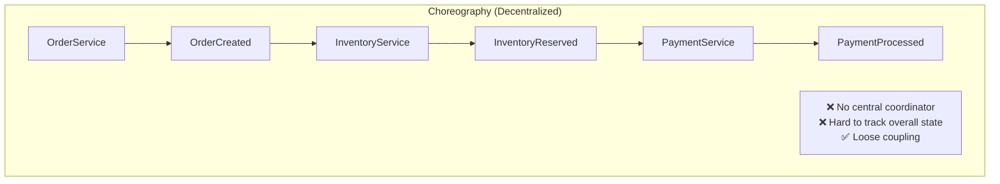
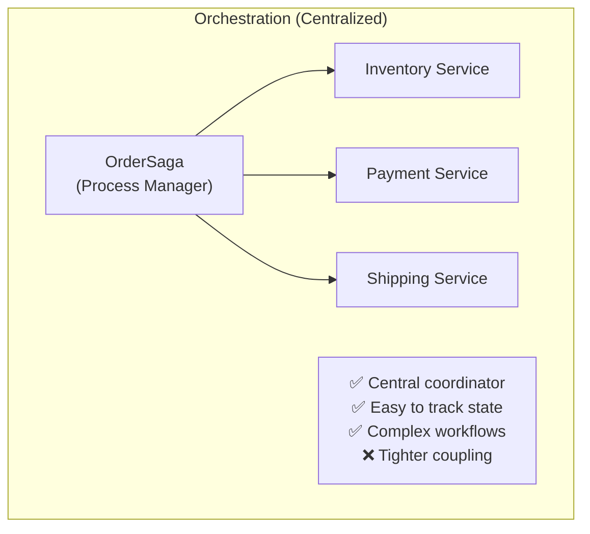

# Microservices Orchestration

Implement **saga orchestration patterns** with Whizbang for distributed workflows, compensation handling, and complex multi-service coordination.

:::updated
Whizbang ships a dedicated **Whizbang.Sagas** package (saga state repositories, completion watchdogs, abandonment events — see `SagaServiceCollectionExtensions`). The hand-rolled orchestrator below teaches the underlying pattern using core primitives: **event receptors** (`IReceptor<TEvent, TCommand>`) that advance saga state and dispatch the next command via `IDispatcher.SendAsync`. The ECommerce sample's `PaymentShippingReceptor` is a minimal single-step version of exactly this pattern.
:::

---

## Orchestration vs. Choreography





---

## Saga State Machine

**OrderSagaState.cs**:

```csharp{title="Saga State Machine" description="**OrderSagaState." category="Example" difficulty="INTERMEDIATE" tags=["Learn", "Examples", "Saga", "State"]}
public record OrderSagaState {
  public required string SagaId { get; init; }
  public required string OrderId { get; init; }
  public required SagaStatus Status { get; init; }
  public required SagaStep CurrentStep { get; init; }
  public string? PaymentId { get; init; }
  public string? ShipmentId { get; init; }
  public string? ErrorMessage { get; init; }
  public DateTime CreatedAt { get; init; }
  public DateTime UpdatedAt { get; init; }
  public Dictionary<string, string> Metadata { get; init; } = new();
}

public enum SagaStatus {
  Started,
  InProgress,
  Completed,
  Compensating,
  Compensated,
  Failed
}

public enum SagaStep {
  OrderCreated,
  InventoryReserving,
  InventoryReserved,
  PaymentProcessing,
  PaymentProcessed,
  ShipmentCreating,
  ShipmentCreated,
  OrderCompleted
}
```

---

## Saga Orchestrator (Event Receptors)

The orchestrator is a set of **event receptors** — each saga step reacts to an event, persists saga state, and dispatches the next command with `IDispatcher.SendAsync`. This is the same shape as the ECommerce sample's `PaymentShippingReceptor` (`IReceptor<PaymentProcessedEvent, CreateShipmentCommand>`), extended with durable saga state.

**OrderSagaReceptors.cs**:

```csharp{title="Saga Orchestrator" description="**OrderSagaReceptors." category="Example" difficulty="ADVANCED" tags=["Learn", "Examples", "Saga", "Orchestrator"]}
using Whizbang.Core;
using Whizbang.Core.ValueObjects;

// Start saga: OrderCreated → ReserveInventory
public class OrderCreatedSagaReceptor(
  SagaStateStore store,
  IDispatcher dispatcher,
  ILogger<OrderCreatedSagaReceptor> logger
) : IReceptor<OrderCreated, ReserveInventory> {

  public async ValueTask<ReserveInventory> HandleAsync(
    OrderCreated message,
    CancellationToken cancellationToken = default
  ) {
    var state = new OrderSagaState {
      SagaId = TrackedGuid.NewMedo().Value.ToString("N"),
      OrderId = message.OrderId,
      Status = SagaStatus.InProgress,
      CurrentStep = SagaStep.InventoryReserving,
      CreatedAt = DateTime.UtcNow,
      UpdatedAt = DateTime.UtcNow
    };
    await store.SaveAsync(state, cancellationToken);

    var command = new ReserveInventory(OrderId: message.OrderId, Items: message.Items);
    await dispatcher.SendAsync(command);

    logger.LogInformation("Order saga {SagaId} started for order {OrderId}", state.SagaId, message.OrderId);
    return command;
  }
}

// Continue saga: InventoryReserved → ProcessPayment
public class InventoryReservedSagaReceptor(
  SagaStateStore store,
  IDispatcher dispatcher,
  ILogger<InventoryReservedSagaReceptor> logger
) : IReceptor<InventoryReserved, ProcessPayment> {

  public async ValueTask<ProcessPayment> HandleAsync(
    InventoryReserved message,
    CancellationToken cancellationToken = default
  ) {
    var state = await store.LoadByOrderIdAsync(message.OrderId, cancellationToken)
      ?? throw new InvalidOperationException($"Saga not found for order {message.OrderId}");

    state = state with { CurrentStep = SagaStep.PaymentProcessing, UpdatedAt = DateTime.UtcNow };
    await store.SaveAsync(state, cancellationToken);

    var command = new ProcessPayment(OrderId: message.OrderId, Amount: message.TotalAmount);
    await dispatcher.SendAsync(command);

    logger.LogInformation("Saga {SagaId}: Inventory reserved, processing payment", state.SagaId);
    return command;
  }
}

// Compensate: PaymentFailed → ReleaseInventory
public class PaymentFailedSagaReceptor(
  SagaStateStore store,
  IDispatcher dispatcher,
  ILogger<PaymentFailedSagaReceptor> logger
) : IReceptor<PaymentFailed, ReleaseInventory> {

  public async ValueTask<ReleaseInventory> HandleAsync(
    PaymentFailed message,
    CancellationToken cancellationToken = default
  ) {
    var state = await store.LoadByOrderIdAsync(message.OrderId, cancellationToken)
      ?? throw new InvalidOperationException($"Saga not found for order {message.OrderId}");

    state = state with {
      Status = SagaStatus.Compensating,
      CurrentStep = SagaStep.InventoryReserved,
      ErrorMessage = message.Reason,
      UpdatedAt = DateTime.UtcNow
    };
    await store.SaveAsync(state, cancellationToken);

    var command = new ReleaseInventory(OrderId: message.OrderId);
    await dispatcher.SendAsync(command);

    logger.LogWarning("Saga {SagaId}: Payment failed, releasing inventory", state.SagaId);
    return command;
  }
}

// Remaining steps follow the same pattern:
// - InventoryInsufficientSagaReceptor : IReceptor<InventoryInsufficient, CancelOrder>
// - PaymentProcessedSagaReceptor     : IReceptor<PaymentProcessed, CreateShipment>
// - ShipmentCreatedSagaReceptor      : IReceptor<ShipmentCreated>  (void receptor — marks saga Completed)
```

**SagaStateStore.cs** (durable saga state via Dapper):

```csharp{title="Saga State Store" description="**SagaStateStore." category="Example" difficulty="ADVANCED" tags=["Learn", "Examples", "Saga", "State"]}
public class SagaStateStore(NpgsqlDataSource dataSource) {

  public async Task SaveAsync(OrderSagaState state, CancellationToken ct) {
    await using var db = await dataSource.OpenConnectionAsync(ct);
    await db.ExecuteAsync(
      """
      INSERT INTO saga_state (
        saga_id, order_id, status, current_step, payment_id, shipment_id, error_message, created_at, updated_at, metadata
      )
      VALUES (@SagaId, @OrderId, @Status, @CurrentStep, @PaymentId, @ShipmentId, @ErrorMessage, @CreatedAt, @UpdatedAt, @Metadata::jsonb)
      ON CONFLICT (saga_id) DO UPDATE SET
        status = @Status,
        current_step = @CurrentStep,
        payment_id = @PaymentId,
        shipment_id = @ShipmentId,
        error_message = @ErrorMessage,
        updated_at = @UpdatedAt
      """,
      new {
        state.SagaId,
        state.OrderId,
        Status = state.Status.ToString(),
        CurrentStep = state.CurrentStep.ToString(),
        state.PaymentId,
        state.ShipmentId,
        state.ErrorMessage,
        state.CreatedAt,
        state.UpdatedAt,
        Metadata = JsonSerializer.Serialize(state.Metadata)
      }
    );
  }

  public async Task<OrderSagaState?> LoadByOrderIdAsync(string orderId, CancellationToken ct) {
    await using var db = await dataSource.OpenConnectionAsync(ct);
    return await db.QuerySingleOrDefaultAsync<OrderSagaState>(
      """
      SELECT saga_id, order_id, status, current_step, payment_id, shipment_id, error_message, created_at, updated_at
      FROM saga_state
      WHERE order_id = @OrderId
      """,
      new { OrderId = orderId }
    );
  }
}
```

:::updated
Perspectives are **pure `Apply` functions** and cannot dispatch commands — orchestration logic that sends the next command belongs in **receptors** (events can have receptors). Use `PublishOnceAsync(claimKey, eventData)` on `IDispatcher` when concurrent handlers might emit the same saga event twice — the conventional claim key is the saga id.
:::

---

## Saga Database Schema

**Migrations/001_CreateSagaTables.sql**:

```sql{title="Saga Database Schema" description="**Migrations/001_CreateSagaTables." category="Example" difficulty="INTERMEDIATE" tags=["Learn", "Examples", "Saga", "Database"]}
CREATE TABLE saga_state (
  saga_id TEXT PRIMARY KEY,
  order_id TEXT NOT NULL UNIQUE,
  status TEXT NOT NULL,
  current_step TEXT NOT NULL,
  payment_id TEXT,
  shipment_id TEXT,
  error_message TEXT,
  created_at TIMESTAMP NOT NULL DEFAULT NOW(),
  updated_at TIMESTAMP NOT NULL DEFAULT NOW(),
  metadata JSONB NOT NULL DEFAULT '{}'::jsonb
);

CREATE INDEX idx_saga_state_order_id ON saga_state(order_id);
CREATE INDEX idx_saga_state_status ON saga_state(status);
CREATE INDEX idx_saga_state_created_at ON saga_state(created_at DESC);
```

---

## Timeout Handling

**Saga timeouts for hung processes**:

**SagaTimeoutMonitor.cs**:

```csharp{title="Timeout Handling" description="**SagaTimeoutMonitor." category="Example" difficulty="ADVANCED" tags=["Learn", "Examples", "Timeout", "Handling"]}
public class SagaTimeoutMonitor : BackgroundService {
  private readonly NpgsqlDataSource _dataSource;
  private readonly IDispatcher _dispatcher;
  private readonly ILogger<SagaTimeoutMonitor> _logger;

  protected override async Task ExecuteAsync(CancellationToken stoppingToken) {
    while (!stoppingToken.IsCancellationRequested) {
      try {
        await using var db = await _dataSource.OpenConnectionAsync(stoppingToken);

        // Find sagas stuck in progress for > 10 minutes
        var stuckSagas = await db.QueryAsync<OrderSagaState>(
          """
          SELECT saga_id, order_id, status, current_step, updated_at
          FROM saga_state
          WHERE status = 'InProgress'
            AND updated_at < NOW() - INTERVAL '10 minutes'
          """
        );

        foreach (var saga in stuckSagas) {
          _logger.LogWarning(
            "Saga {SagaId} timed out at step {CurrentStep}, compensating",
            saga.SagaId,
            saga.CurrentStep
          );

          // Trigger compensation
          await CompensateSagaAsync(saga, stoppingToken);
        }

        await Task.Delay(TimeSpan.FromMinutes(1), stoppingToken);
      } catch (Exception ex) when (ex is not OperationCanceledException) {
        _logger.LogError(ex, "Error in saga timeout monitor");
        await Task.Delay(TimeSpan.FromSeconds(30), stoppingToken);
      }
    }
  }

  private async Task CompensateSagaAsync(
    OrderSagaState saga,
    CancellationToken ct
  ) {
    // Send compensation commands based on current step
    switch (saga.CurrentStep) {
      case SagaStep.PaymentProcessing:
        // Release inventory
        await _dispatcher.SendAsync(new ReleaseInventory(saga.OrderId));
        break;

      case SagaStep.ShipmentCreating:
        // Refund payment and release inventory
        await _dispatcher.SendAsync(new RefundPayment(saga.OrderId, saga.PaymentId!));
        await _dispatcher.SendAsync(new ReleaseInventory(saga.OrderId));
        break;
    }

    // Update saga to compensating
    await using var db = await _dataSource.OpenConnectionAsync(ct);
    await db.ExecuteAsync(
      """
      UPDATE saga_state
      SET status = 'Compensating', error_message = 'Timeout', updated_at = NOW()
      WHERE saga_id = @SagaId
      """,
      new { SagaId = saga.SagaId }
    );
  }
}
```

---

## Saga Visualization API

**SagasController.cs**:

```csharp{title="Saga Visualization API" description="**SagasController." category="Example" difficulty="ADVANCED" tags=["Learn", "Examples", "Saga", "Visualization"]}
[ApiController]
[Route("api/[controller]")]
public class SagasController : ControllerBase {
  private readonly NpgsqlConnection _db;

  [HttpGet("{sagaId}")]
  public async Task<IActionResult> GetSaga(string sagaId) {
    var saga = await _db.QuerySingleOrDefaultAsync<OrderSagaState>(
      "SELECT * FROM saga_state WHERE saga_id = @SagaId",
      new { SagaId = sagaId }
    );

    if (saga == null) {
      return NotFound();
    }

    return Ok(new {
      saga.SagaId,
      saga.OrderId,
      saga.Status,
      saga.CurrentStep,
      saga.PaymentId,
      saga.ShipmentId,
      saga.ErrorMessage,
      saga.CreatedAt,
      saga.UpdatedAt,
      Steps = GetSagaSteps(saga)
    });
  }

  private object[] GetSagaSteps(OrderSagaState saga) {
    var steps = new[] {
      new { Step = "OrderCreated", Status = "Completed", Timestamp = saga.CreatedAt },
      new { Step = "InventoryReserving", Status = GetStepStatus(saga, SagaStep.InventoryReserving), Timestamp = (DateTime?)null },
      new { Step = "InventoryReserved", Status = GetStepStatus(saga, SagaStep.InventoryReserved), Timestamp = (DateTime?)null },
      new { Step = "PaymentProcessing", Status = GetStepStatus(saga, SagaStep.PaymentProcessing), Timestamp = (DateTime?)null },
      new { Step = "PaymentProcessed", Status = GetStepStatus(saga, SagaStep.PaymentProcessed), Timestamp = (DateTime?)null },
      new { Step = "ShipmentCreating", Status = GetStepStatus(saga, SagaStep.ShipmentCreating), Timestamp = (DateTime?)null },
      new { Step = "ShipmentCreated", Status = GetStepStatus(saga, SagaStep.ShipmentCreated), Timestamp = (DateTime?)null }
    };

    return steps;
  }

  private string GetStepStatus(OrderSagaState saga, SagaStep step) {
    if (saga.CurrentStep == step) return "InProgress";
    if ((int)saga.CurrentStep > (int)step) return "Completed";
    return "Pending";
  }
}
```

**Response**:

```json{title="Saga Visualization API (2)" description="Saga Visualization API" category="Example" difficulty="INTERMEDIATE" tags=["Learn", "Examples", "Saga", "Visualization"]}
{
  "sagaId": "abc123",
  "orderId": "order-456",
  "status": "InProgress",
  "currentStep": "PaymentProcessing",
  "steps": [
    { "step": "OrderCreated", "status": "Completed", "timestamp": "2024-12-12T10:00:00Z" },
    { "step": "InventoryReserving", "status": "Completed", "timestamp": "2024-12-12T10:01:00Z" },
    { "step": "InventoryReserved", "status": "Completed", "timestamp": "2024-12-12T10:02:00Z" },
    { "step": "PaymentProcessing", "status": "InProgress", "timestamp": null },
    { "step": "PaymentProcessed", "status": "Pending", "timestamp": null },
    { "step": "ShipmentCreating", "status": "Pending", "timestamp": null },
    { "step": "ShipmentCreated", "status": "Pending", "timestamp": null }
  ]
}
```

---

## Key Takeaways

✅ **Centralized Coordination** - Saga orchestrator manages workflow
✅ **State Tracking** - Saga state persisted at each step
✅ **Compensation** - Automatic rollback on failures
✅ **Timeout Handling** - Monitor and compensate hung sagas
✅ **Visualization** - API for tracking saga progress

---

## When to Use Orchestration

| Scenario | Orchestration | Choreography |
|----------|--------------|--------------|
| **Simple workflows** | ❌ Overkill | ✅ Recommended |
| **Complex workflows** | ✅ Recommended | ❌ Hard to track |
| **Long-running processes** | ✅ Recommended | ❌ No visibility |
| **High failure rates** | ✅ Better control | ❌ Hard to compensate |
| **Loose coupling** | ❌ Tighter coupling | ✅ Decoupled |

---

*Version 1.0.0 - Foundation Release | Last Updated: 2024-12-12*
