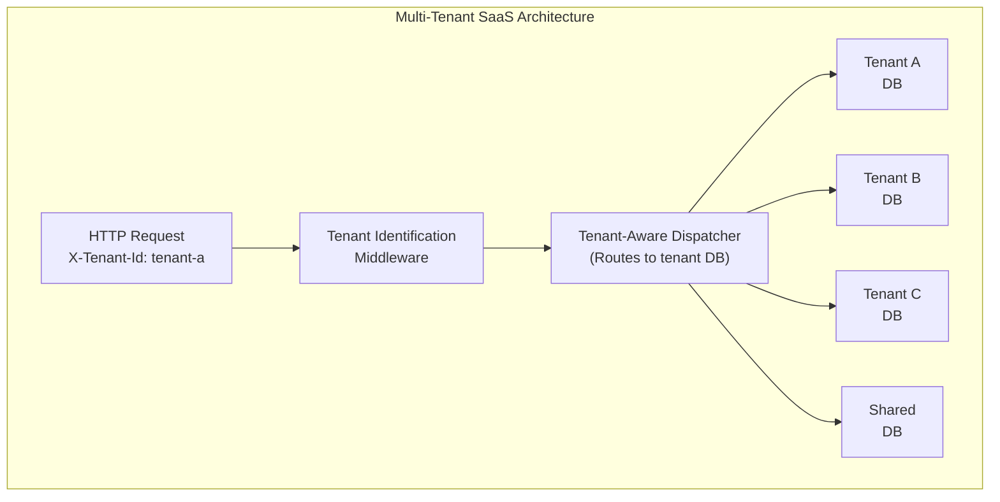

# Multi-Tenant SaaS

Build **multi-tenant SaaS applications** with Whizbang featuring tenant isolation, per-tenant databases, cross-tenant analytics, and tenant-specific customizations.

:::updated
Tenancy is **first-class in Whizbang**: every `IMessageContext` carries a `TenantId`, perspective rows carry a tenant scope (`row.Scope.TenantId`), and the dispatcher exposes explicit tenant-scope builders — `dispatcher.AsSystem().ForTenant("tenant-123")`, `.ForAllTenants()` (uses `TenantConstants.AllTenants`, `"*"`), and `.KeepTenant()`. The per-tenant-database plumbing below (middleware, connection resolver) is one deployment architecture layered on top; the shipped ECommerce sample instead uses shared tables with tenant-scoped rows queried through lenses.
:::

---

## Architecture



**Key features**:
- ✅ Database per tenant (strongest isolation)
- ✅ Tenant context propagation
- ✅ Cross-tenant analytics
- ✅ Tenant-specific customizations
- ✅ Tenant onboarding automation

---

## Tenant Identification

### Tenant Context

**TenantContext.cs**:

```csharp{title="Tenant Context" description="**TenantContext." category="Example" difficulty="INTERMEDIATE" tags=["Learn", "Examples", "Tenant", "Context"]}
public class TenantContext {
  private static readonly AsyncLocal<string?> _tenantId = new();

  public static string? CurrentTenantId {
    get => _tenantId.Value;
    set => _tenantId.Value = value;
  }

  public static void Set(string tenantId) {
    if (string.IsNullOrWhiteSpace(tenantId)) {
      throw new ArgumentException("Tenant ID cannot be null or empty", nameof(tenantId));
    }
    _tenantId.Value = tenantId;
  }

  public static void Clear() {
    _tenantId.Value = null;
  }
}
```

### Tenant Middleware

**TenantIdentificationMiddleware.cs**:

```csharp{title="Tenant Middleware" description="**TenantIdentificationMiddleware." category="Example" difficulty="ADVANCED" tags=["Learn", "Examples", "Tenant", "Middleware"]}
public class TenantIdentificationMiddleware {
  private readonly RequestDelegate _next;
  private readonly ILogger<TenantIdentificationMiddleware> _logger;

  public TenantIdentificationMiddleware(
    RequestDelegate next,
    ILogger<TenantIdentificationMiddleware> logger
  ) {
    _next = next;
    _logger = logger;
  }

  public async Task InvokeAsync(HttpContext context) {
    // 1. Extract tenant ID from header
    var tenantId = context.Request.Headers["X-Tenant-Id"].FirstOrDefault();

    // 2. Fallback: Extract from subdomain (e.g., tenant-a.example.com)
    if (string.IsNullOrWhiteSpace(tenantId)) {
      var host = context.Request.Host.Host;
      var parts = host.Split('.');
      if (parts.Length > 2) {
        tenantId = parts[0];
      }
    }

    // 3. Fallback: Extract from JWT claim
    if (string.IsNullOrWhiteSpace(tenantId)) {
      tenantId = context.User.FindFirst("tenant_id")?.Value;
    }

    if (string.IsNullOrWhiteSpace(tenantId)) {
      context.Response.StatusCode = 400;
      await context.Response.WriteAsJsonAsync(new {
        error = "Tenant ID is required"
      });
      return;
    }

    // 4. Set tenant context
    TenantContext.Set(tenantId);
    _logger.LogInformation("Request for tenant {TenantId}", tenantId);

    try {
      await _next(context);
    } finally {
      TenantContext.Clear();
    }
  }
}
```

**Program.cs registration**:

```csharp{title="Tenant Middleware (2)" description="Tenant Middleware" category="Example" difficulty="BEGINNER" tags=["Learn", "Examples", "Tenant", "Middleware"]}
app.UseMiddleware<TenantIdentificationMiddleware>();
```

---

## Database Per Tenant

### Tenant Database Resolver

**ITenantDatabaseResolver.cs**:

```csharp{title="Tenant Database Resolver" description="**ITenantDatabaseResolver." category="Example" difficulty="INTERMEDIATE" tags=["Learn", "Examples", "Tenant", "Database"]}
public interface ITenantDatabaseResolver {
  string GetConnectionString(string tenantId);
}

public class TenantDatabaseResolver : ITenantDatabaseResolver {
  private readonly Dictionary<string, string> _tenantConnectionStrings;

  public TenantDatabaseResolver(IConfiguration configuration) {
    _tenantConnectionStrings = configuration
      .GetSection("Tenants")
      .Get<Dictionary<string, TenantConfig>>()
      ?.ToDictionary(
        kvp => kvp.Key,
        kvp => kvp.Value.ConnectionString
      ) ?? new Dictionary<string, string>();
  }

  public string GetConnectionString(string tenantId) {
    if (_tenantConnectionStrings.TryGetValue(tenantId, out var connectionString)) {
      return connectionString;
    }

    throw new InvalidOperationException($"Tenant {tenantId} not found");
  }
}

public record TenantConfig(
  string ConnectionString,
  string? CustomDomain,
  Dictionary<string, string>? Settings
);
```

**appsettings.json**:

```json{title="Tenant Database Resolver (2)" description="**appsettings." category="Example" difficulty="INTERMEDIATE" tags=["Learn", "Examples", "Tenant", "Database"]}
{
  "Tenants": {
    "tenant-a": {
      "ConnectionString": "Host=localhost;Database=tenant_a;Username=postgres;Password=postgres",
      "CustomDomain": "tenant-a.example.com",
      "Settings": {
        "MaxUsers": "100",
        "Features": "analytics,exports"
      }
    },
    "tenant-b": {
      "ConnectionString": "Host=localhost;Database=tenant_b;Username=postgres;Password=postgres",
      "CustomDomain": "tenant-b.example.com",
      "Settings": {
        "MaxUsers": "500",
        "Features": "analytics,exports,api-access"
      }
    }
  }
}
```

### Tenant-Aware Database Connection

**Program.cs**:

```csharp{title="Tenant-Aware Database Connection" description="Tenant-Aware Database Connection" category="Example" difficulty="BEGINNER" tags=["Learn", "Examples", "Tenant-Aware", "Database"]}
builder.Services.AddScoped<NpgsqlConnection>(sp => {
  var tenantId = TenantContext.CurrentTenantId
    ?? throw new InvalidOperationException("Tenant context not set");

  var resolver = sp.GetRequiredService<ITenantDatabaseResolver>();
  var connectionString = resolver.GetConnectionString(tenantId);

  return new NpgsqlConnection(connectionString);
});

builder.Services.AddSingleton<ITenantDatabaseResolver, TenantDatabaseResolver>();
```

---

## Tenant-Aware Receptors

**CreateOrderReceptor.cs**:

```csharp{title="Tenant-Aware Receptors" description="**CreateOrderReceptor." category="Example" difficulty="ADVANCED" tags=["Learn", "Examples", "Tenant-Aware", "Receptors"]}
using Whizbang.Core;

public class CreateOrderReceptor(
  IDispatcher dispatcher,
  ILogger<CreateOrderReceptor> logger
) : IReceptor<CreateOrderCommand, OrderCreatedEvent> {

  public async ValueTask<OrderCreatedEvent> HandleAsync(
    CreateOrderCommand message,
    CancellationToken cancellationToken = default
  ) {
    // The tenant travels with the message: IMessageContext.TenantId was stamped
    // when the command was dispatched, and Whizbang persists it on the envelope,
    // the event store rows, and the perspective row scope.
    logger.LogInformation(
      "Creating order {OrderId} for customer {CustomerId}",
      message.OrderId,
      message.CustomerId
    );

    var orderCreated = new OrderCreatedEvent {
      OrderId = message.OrderId,
      CustomerId = message.CustomerId,
      LineItems = message.LineItems,
      TotalAmount = message.TotalAmount,
      CreatedAt = DateTime.UtcNow
    };

    // Published event inherits the tenant scope from the command's envelope
    await dispatcher.PublishAsync(orderCreated);

    return orderCreated;
  }
}
```

The receptor body contains **no tenant plumbing** — tenant scope flows through the message envelope. If you run database-per-tenant, resolve the tenant connection in your DI registration (as shown above) rather than inside receptors.

---

## Message Context Propagation

Tenant propagation is built in — `IMessageContext` has a first-class `TenantId` property:

```csharp{title="Message Context Propagation" description="IMessageContext tenant support" category="Example" difficulty="INTERMEDIATE" tags=["Learn", "Examples", "Message", "Context"]}
public interface IMessageContext {
  MessageId MessageId { get; }
  CorrelationId CorrelationId { get; }
  MessageId CausationId { get; }
  DateTimeOffset Timestamp { get; }
  string? UserId { get; }
  string? TenantId { get; }   // ← first-class tenant scope
  IReadOnlyDictionary<string, object> Metadata { get; }
  // ... plus security scope and caller info
}
```

**Explicit tenant scoping at dispatch** — for system/maintenance operations, make the tenant scope explicit with the security builder:

```csharp{title="Message Context Propagation (2)" description="Dispatcher tenant-scope builders" category="Example" difficulty="INTERMEDIATE" tags=["Learn", "Examples", "Message", "Context"]}
// Cross-tenant system operation (TenantId = TenantConstants.AllTenants, "*")
await dispatcher.AsSystem().ForAllTenants().SendAsync(new ReindexAllTenantsCommand());

// System operation scoped to one tenant
await dispatcher.AsSystem().ForTenant("tenant-123").SendAsync(new TenantMaintenanceCommand());

// System operation preserving the ambient tenant
await dispatcher.AsSystem().KeepTenant().SendAsync(new MaintenanceCommand());
```

**Result**: every event envelope, event store row, and perspective row carries its tenant scope — cascaded messages inherit it automatically.

---

## Cross-Tenant Analytics

### Cross-Tenant Queries via Lenses

Perspective rows carry their tenant scope, so cross-tenant analytics is a **lens query over `row.Scope.TenantId`** — no metadata parsing, no separate ingestion pipeline. From the ECommerce sample:

**samples/ECommerce/ECommerce.BFF.API/Lenses/OrderLens.cs** (excerpt):

```csharp{title="Cross-Tenant Lens Queries" description="**OrderLens." category="Example" difficulty="ADVANCED" tags=["Learn", "Examples", "Cross-Tenant", "Analytics"]}
using Microsoft.EntityFrameworkCore;
using Whizbang.Core.Lenses;

public class OrderLens(ILensQuery<OrderReadModel> query, ILogger<OrderLens> logger) : IOrderLens {

  public async Task<IEnumerable<OrderReadModel>> GetByTenantIdAsync(string tenantId, CancellationToken cancellationToken = default) {
    return await query.DefaultScope.Query
      .Where(row => row.Scope.TenantId == tenantId)
      .OrderByDescending(row => row.CreatedAt)
      .Select(row => row.Data)
      .ToListAsync(cancellationToken);
  }

  public async Task<IEnumerable<OrderReadModel>> GetByStatusAsync(string tenantId, string status, CancellationToken cancellationToken = default) {
    return await query.DefaultScope.Query
      .Where(row => row.Scope.TenantId == tenantId && row.Data.Status == status)
      .OrderByDescending(row => row.CreatedAt)
      .Select(row => row.Data)
      .ToListAsync(cancellationToken);
  }
}
```

**Super-admin endpoint** (**samples/ECommerce/ECommerce.BFF.API/Endpoints/SuperAdmin/GetOrdersByTenantEndpoint.cs**):

```csharp{title="Cross-Tenant Endpoint" description="Super-admin cross-tenant endpoint" category="Example" difficulty="INTERMEDIATE" tags=["Learn", "Examples", "Cross-Tenant", "Analytics"]}
using FastEndpoints;

/// <summary>
/// Get all orders for a specific tenant (super-admin view)
/// </summary>
public class GetOrdersByTenantEndpoint(IOrderLens orderLens) : EndpointWithoutRequest<IEnumerable<OrderReadModel>> {

  public override void Configure() {
    Get("/superadmin/orders/tenant/{tenantId}");
    AllowAnonymous(); // TODO: Add authentication and super-admin authorization
  }

  public override async Task HandleAsync(CancellationToken ct) {
    var tenantId = Route<string>("tenantId")!;
    var orders = await orderLens.GetByTenantIdAsync(tenantId, ct);
    Response = orders;
  }
}
```

For pre-aggregated cross-tenant rollups (daily sales per tenant), materialize a perspective whose model keys on `(date, tenantId)` — the pure `Apply` pattern from the tutorials applies unchanged.

---

## Tenant Onboarding

**TenantProvisioningService.cs**:

```csharp{title="Tenant Onboarding" description="**TenantProvisioningService." category="Example" difficulty="ADVANCED" tags=["Learn", "Examples", "Tenant", "Onboarding"]}
public class TenantProvisioningService {
  private readonly NpgsqlConnection _masterDb;
  private readonly ILogger<TenantProvisioningService> _logger;

  public async Task ProvisionTenantAsync(
    string tenantId,
    string adminEmail,
    string companyName,
    CancellationToken ct = default
  ) {
    _logger.LogInformation("Provisioning tenant {TenantId}", tenantId);

    // 1. Create tenant database
    await _masterDb.ExecuteAsync(
      $"CREATE DATABASE tenant_{tenantId}"
    );

    // 2. Run migrations on new database
    var tenantConnectionString = $"Host=localhost;Database=tenant_{tenantId};Username=postgres;Password=postgres";
    using var tenantDb = new NpgsqlConnection(tenantConnectionString);
    await tenantDb.OpenAsync(ct);

    await ApplyMigrationsAsync(tenantDb, ct);

    // 3. Create admin user
    await tenantDb.ExecuteAsync(
      """
      INSERT INTO users (user_id, email, role, tenant_id, created_at)
      VALUES (@UserId, @Email, 'admin', @TenantId, NOW())
      """,
      new {
        UserId = Guid.NewGuid().ToString("N"),
        Email = adminEmail,
        TenantId = tenantId
      }
    );

    // 4. Create default settings
    await tenantDb.ExecuteAsync(
      """
      INSERT INTO tenant_settings (tenant_id, company_name, max_users, features, created_at)
      VALUES (@TenantId, @CompanyName, 100, 'basic', NOW())
      """,
      new {
        TenantId = tenantId,
        CompanyName = companyName
      }
    );

    _logger.LogInformation("Tenant {TenantId} provisioned successfully", tenantId);
  }

  private async Task ApplyMigrationsAsync(NpgsqlConnection db, CancellationToken ct) {
    var migrationFiles = Directory.GetFiles("Migrations", "*.sql").OrderBy(f => f);
    foreach (var file in migrationFiles) {
      var sql = await File.ReadAllTextAsync(file, ct);
      await db.ExecuteAsync(sql);
    }
  }
}
```

---

## Tenant-Specific Customizations

**Feature Flags per Tenant**:

```csharp{title="Tenant-Specific Customizations" description="Feature Flags per Tenant:" category="Example" difficulty="INTERMEDIATE" tags=["Learn", "Examples", "Tenant-Specific", "Customizations"]}
public class TenantFeatureService {
  private readonly ITenantDatabaseResolver _resolver;

  public async Task<bool> IsFeatureEnabledAsync(string feature) {
    var tenantId = TenantContext.CurrentTenantId
      ?? throw new InvalidOperationException("Tenant context not set");

    var connectionString = _resolver.GetConnectionString(tenantId);
    using var db = new NpgsqlConnection(connectionString);
    await db.OpenAsync();

    var features = await db.QuerySingleOrDefaultAsync<string>(
      "SELECT features FROM tenant_settings WHERE tenant_id = @TenantId",
      new { TenantId = tenantId }
    );

    return features?.Contains(feature) ?? false;
  }
}
```

**Usage**:

```csharp{title="Tenant-Specific Customizations (2)" description="Tenant-Specific Customizations" category="Example" difficulty="INTERMEDIATE" tags=["Learn", "Examples", "Tenant-Specific", "Customizations"]}
public async ValueTask<OrderCreatedEvent> HandleAsync(
  CreateOrderCommand message,
  CancellationToken cancellationToken = default
) {
  // ... create and publish orderCreated as usual ...

  // Check if tenant has analytics feature
  var hasAnalytics = await _featureService.IsFeatureEnabledAsync("analytics");

  if (hasAnalytics) {
    // Publish additional analytics events
    await dispatcher.PublishAsync(new OrderAnalyticsRequestedEvent { OrderId = message.OrderId });
  }

  return orderCreated;
}
```

---

## Key Takeaways

✅ **First-Class Tenancy** - `IMessageContext.TenantId`, tenant-scoped perspective rows, `AsSystem().ForTenant(...)` builders
✅ **Database Per Tenant** - Strongest isolation, independent scaling (optional architecture)
✅ **Tenant Context Propagation** - Tenant scope travels on every envelope automatically
✅ **Cross-Tenant Analytics** - Lens queries over `row.Scope.TenantId`
✅ **Tenant Onboarding** - Automated provisioning with migrations
✅ **Feature Flags** - Tenant-specific customizations

---

## Alternative Patterns

### Shared Database with Row-Level Security

```sql{title="Shared Database with Row-Level Security" description="Shared Database with Row-Level Security" category="Example" difficulty="BEGINNER" tags=["Learn", "Examples", "Shared", "Database"]}
-- PostgreSQL Row-Level Security
ALTER TABLE orders ENABLE ROW LEVEL SECURITY;

CREATE POLICY tenant_isolation_policy ON orders
  USING (tenant_id = current_setting('app.current_tenant')::text);

-- Set tenant before query
SET app.current_tenant = 'tenant-a';
SELECT * FROM orders;  -- Only returns tenant-a orders
```

**Pros**: Single database, simpler infrastructure
**Cons**: Weaker isolation, shared resources

---

*Version 1.0.0 - Foundation Release | Last Updated: 2024-12-12*
