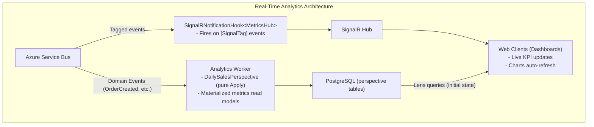

# Real-Time Analytics

Build **real-time analytics dashboards** with Whizbang featuring streaming metrics, SignalR updates, live KPIs, and event-driven data aggregation.

Two Whizbang building blocks do the work:

1. **Perspectives** materialize events into metrics read models. Perspectives are **pure functions** — each `Apply` takes the current state and an event and returns new state. No I/O, no injected services, no broadcasting.
2. **Message tags + hooks** handle the push. Tag an event with `[SignalTag]` and the built-in `SignalRNotificationHook<THub>` (from `Whizbang.SignalR`) broadcasts it to connected clients after the event is successfully processed.

---

## Architecture



---

## SignalR Hub

**MetricsHub.cs** — a plain ASP.NET Core hub. Whizbang pushes through it; you can also add your own methods:

```csharp{title="SignalR Hub" description="MetricsHub definition" category="Example" difficulty="ADVANCED" tags=["Learn", "Examples", "SignalR", "Hub"]}
using Microsoft.AspNetCore.SignalR;

public class MetricsHub : Hub {
  private readonly ILogger<MetricsHub> _logger;

  public MetricsHub(ILogger<MetricsHub> logger) {
    _logger = logger;
  }

  public override async Task OnConnectedAsync() {
    _logger.LogInformation(
      "Client {ConnectionId} connected to MetricsHub",
      Context.ConnectionId
    );

    await base.OnConnectedAsync();
  }

  public override Task OnDisconnectedAsync(Exception? exception) {
    _logger.LogInformation(
      "Client {ConnectionId} disconnected from MetricsHub",
      Context.ConnectionId
    );

    return base.OnDisconnectedAsync(exception);
  }
}
```

**Program.cs registration** — `AddWhizbangSignalR()` wires SignalR's JSON protocol to Whizbang's AOT-compatible `JsonContextRegistry`, and `options.Tags.UseSignalR<THub>()` registers the notification hook:

```csharp{title="Program.cs Registration" description="Register SignalR and the Whizbang notification hook" category="Example" difficulty="BEGINNER" tags=["Learn", "Examples", "SignalR", "Hub"]}
// AOT-compatible SignalR with Whizbang's JSON serialization
builder.Services.AddWhizbangSignalR();

// Register the SignalR notification hook for [SignalTag] events
builder.Services.AddWhizbang(options => {
  options.Tags.UseSignalR<MetricsHub>();
});

app.MapHub<MetricsHub>("/hubs/metrics");
```

---

## Tagging Events for Live Push

Tag the domain events you want streamed to dashboards. `Properties` narrows the payload to just the fields clients need; `Group` targets a SignalR group (with `{PropertyName}` placeholders):

```csharp{title="Tagged Domain Events" description="SignalTag drives the real-time push" category="Example" difficulty="BEGINNER" tags=["Learn", "Examples", "SignalTag", "Events"]}
[SignalTag(
  Tag = "order-created",
  Properties = ["OrderId", "TotalAmount"],
  Priority = SignalPriority.Normal)]
public sealed record OrderCreated(Guid OrderId, Guid CustomerId, decimal TotalAmount) : IEvent;

[SignalTag(
  Tag = "payment-processed",
  Properties = ["OrderId", "Amount"],
  Group = "tenant-{TenantId}")]  // resolved from payload/scope at runtime
public sealed record PaymentProcessed(Guid OrderId, decimal Amount) : IEvent;
```

After each tagged event is successfully processed, `SignalRNotificationHook<MetricsHub>` sends a `ReceiveNotification` message to all clients (or to the resolved group) with this shape:

```csharp{title="NotificationMessage" description="The wire shape pushed to SignalR clients" category="Example" difficulty="BEGINNER" tags=["Learn", "Examples", "SignalR", "Payload"]}
public sealed record NotificationMessage {
  public required string Tag { get; init; }            // "order-created"
  public required string Priority { get; init; }       // "Normal", "High", ...
  public required string MessageType { get; init; }    // "OrderCreated"
  public required JsonElement Payload { get; init; }   // { "OrderId": ..., "TotalAmount": ... }
  public required DateTimeOffset Timestamp { get; init; }
}
```

---

## Metrics Perspective

Perspectives materialize the metrics read model. They are pure — state in, state out. Whizbang persists the result and serves it through lenses:

```csharp{title="Real-Time Metrics Perspective" description="Pure Apply functions materialize the metrics read model" category="Example" difficulty="ADVANCED" tags=["Learn", "Examples", "Real-Time", "Metrics"]}
public class DailySalesPerspective :
  IPerspectiveFor<DailySalesMetrics, OrderCreated, PaymentProcessed> {

  public DailySalesMetrics Apply(DailySalesMetrics currentData, OrderCreated @event) {
    var totalOrders = (currentData?.TotalOrders ?? 0) + 1;
    var totalRevenue = (currentData?.TotalRevenue ?? 0) + @event.TotalAmount;

    return new DailySalesMetrics {
      TotalOrders = totalOrders,
      TotalRevenue = totalRevenue,
      AverageOrderValue = totalRevenue / totalOrders,
      TotalPaymentsProcessed = currentData?.TotalPaymentsProcessed ?? 0,
      LastUpdated = @event.CreatedAt
    };
  }

  public DailySalesMetrics Apply(DailySalesMetrics currentData, PaymentProcessed @event) {
    if (currentData == null) {
      return new DailySalesMetrics {
        TotalOrders = 0,
        TotalRevenue = 0,
        AverageOrderValue = 0,
        TotalPaymentsProcessed = 1,
        LastUpdated = DateTime.UtcNow
      };
    }

    return currentData with {
      TotalPaymentsProcessed = currentData.TotalPaymentsProcessed + 1,
      LastUpdated = DateTime.UtcNow
    };
  }
}

public record DailySalesMetrics {
  public long TotalOrders { get; init; }
  public decimal TotalRevenue { get; init; }
  public decimal AverageOrderValue { get; init; }
  public long TotalPaymentsProcessed { get; init; }
  public DateTime LastUpdated { get; init; }
}
```

Serve the current metrics for initial dashboard load through a lens query (an API endpoint or hub method):

```csharp{title="Initial Metrics Endpoint" description="Lens query serves current metrics on dashboard load" category="Example" difficulty="INTERMEDIATE" tags=["Learn", "Examples", "Lens", "Metrics"]}
app.MapGet("/api/metrics/current", async (
    ILensQuery<DailySalesMetrics> query,
    CancellationToken ct) => {
  var metrics = await query.DefaultScope.Query
    .Select(row => row.Data)
    .FirstOrDefaultAsync(ct);
  return metrics is null ? Results.NotFound() : Results.Ok(metrics);
});
```

---

## Client-Side (TypeScript)

**metrics-dashboard.ts** — subscribe to `ReceiveNotification` and route by `Tag`:

```typescript{title="Client-Side (TypeScript)" description="metrics-dashboard subscribing to Whizbang notifications" category="Example" difficulty="ADVANCED" tags=["Learn", "Examples", "Client-Side", "TypeScript"]}
import * as signalR from "@microsoft/signalr";

class MetricsDashboard {
  private connection: signalR.HubConnection;

  constructor() {
    // Connect to SignalR hub
    this.connection = new signalR.HubConnectionBuilder()
      .withUrl("/hubs/metrics")
      .withAutomaticReconnect()
      .build();

    this.setupEventHandlers();
    this.connect();
  }

  private setupEventHandlers() {
    // All Whizbang [SignalTag] pushes arrive as "ReceiveNotification"
    this.connection.on("ReceiveNotification", (notification: any) => {
      switch (notification.Tag) {
        case "order-created":
          this.onOrderCreated(notification.Payload, notification.Timestamp);
          break;
        case "payment-processed":
          this.onPaymentProcessed(notification.Payload);
          break;
      }
    });
  }

  private async connect() {
    try {
      await this.connection.start();
      console.log("Connected to MetricsHub");

      // Fetch current metrics for initial render
      const response = await fetch("/api/metrics/current");
      if (response.ok) {
        this.updateDashboard(await response.json());
      }
    } catch (err) {
      console.error("Error connecting to MetricsHub:", err);
      setTimeout(() => this.connect(), 5000);
    }
  }

  private onOrderCreated(payload: any, timestamp: string) {
    this.incrementCounter("total-orders");
    this.addToTotal("total-revenue", payload.TotalAmount);
    document.getElementById("last-updated")!.textContent =
      new Date(timestamp).toLocaleTimeString();
    this.showNotification(`New order: $${payload.TotalAmount}`);
  }

  private onPaymentProcessed(_payload: any) {
    this.incrementCounter("total-payments");
  }

  private updateDashboard(metrics: any) {
    document.getElementById("total-orders")!.textContent = metrics.TotalOrders;
    document.getElementById("total-revenue")!.textContent = `$${metrics.TotalRevenue.toFixed(2)}`;
    document.getElementById("avg-order-value")!.textContent = `$${metrics.AverageOrderValue.toFixed(2)}`;
    document.getElementById("last-updated")!.textContent = new Date(metrics.LastUpdated).toLocaleTimeString();
  }

  private incrementCounter(id: string) {
    const el = document.getElementById(id)!;
    el.textContent = String(Number(el.textContent) + 1);
  }

  private addToTotal(id: string, amount: number) {
    const el = document.getElementById(id)!;
    const current = Number(el.textContent!.replace(/[$,]/g, "")) || 0;
    el.textContent = `$${(current + amount).toFixed(2)}`;
  }

  private showNotification(message: string) {
    // Show toast notification
    const toast = document.createElement("div");
    toast.className = "toast";
    toast.textContent = message;
    document.body.appendChild(toast);

    setTimeout(() => toast.remove(), 3000);
  }
}

// Initialize dashboard
new MetricsDashboard();
```

**HTML**:

```html{title="Dashboard HTML" description="Static markup for the live KPI dashboard" category="Example" difficulty="ADVANCED" tags=["Learn", "Examples", "Client-Side", "TypeScript"]}
<!DOCTYPE html>
<html>
<head>
  <title>Real-Time Analytics Dashboard</title>
  <style>
    .metric-card {
      display: inline-block;
      padding: 20px;
      margin: 10px;
      background: #f5f5f5;
      border-radius: 8px;
    }
    .metric-value {
      font-size: 36px;
      font-weight: bold;
    }
    .metric-label {
      font-size: 14px;
      color: #666;
    }
    .toast {
      position: fixed;
      bottom: 20px;
      right: 20px;
      padding: 15px;
      background: #28a745;
      color: white;
      border-radius: 4px;
    }
  </style>
</head>
<body>
  <h1>Real-Time Analytics Dashboard</h1>

  <div class="metric-card">
    <div class="metric-value" id="total-orders">0</div>
    <div class="metric-label">Total Orders</div>
  </div>

  <div class="metric-card">
    <div class="metric-value" id="total-revenue">$0.00</div>
    <div class="metric-label">Total Revenue</div>
  </div>

  <div class="metric-card">
    <div class="metric-value" id="avg-order-value">$0.00</div>
    <div class="metric-label">Avg Order Value</div>
  </div>

  <div class="metric-card">
    <div class="metric-value" id="total-payments">0</div>
    <div class="metric-label">Total Payments</div>
  </div>

  <div>
    <small>Last updated: <span id="last-updated">-</span></small>
  </div>

  <script src="/dist/metrics-dashboard.js"></script>
</body>
</html>
```

---

## Custom Hooks for Aggregation, Throttling, and Batching

Unlike perspectives, **tag hooks can have dependencies and side effects** — that's what they're for. Implement `IMessageTagHook<TAttribute>` when the built-in hook isn't enough. Hooks are resolved as Scoped services and run after successful message handling.

### Sliding Window Aggregation

```csharp{title="Sliding Window Hook" description="Custom tag hook maintaining a 5-minute sliding window" category="Example" difficulty="ADVANCED" tags=["Learn", "Examples", "Streaming", "Aggregations"]}
public sealed class SlidingWindowAnalyticsHook : IMessageTagHook<SignalTagAttribute> {
  private readonly IHubContext<MetricsHub> _hubContext;
  private readonly IDistributedCache _cache;

  public SlidingWindowAnalyticsHook(IHubContext<MetricsHub> hubContext, IDistributedCache cache) {
    _hubContext = hubContext;
    _cache = cache;
  }

  public async ValueTask<JsonElement?> OnTaggedMessageAsync(
      TagContext<SignalTagAttribute> context,
      CancellationToken ct) {
    if (context.Attribute.Tag != "order-created") {
      return null; // only aggregate order events
    }

    var amount = context.Payload.GetProperty("TotalAmount").GetDecimal();

    // Maintain events for the last 5 minutes
    var windowKey = "orders:last5min";
    var events = await GetWindowEventsAsync(windowKey, ct);
    events.Add(new OrderEventData { Amount = amount, Timestamp = DateTime.UtcNow });

    var cutoff = DateTime.UtcNow.AddMinutes(-5);
    events = events.Where(e => e.Timestamp >= cutoff).ToList();
    await SaveWindowEventsAsync(windowKey, events, ct);

    // Broadcast sliding window metrics
    await _hubContext.Clients.All.SendAsync(
      "ReceiveSlidingWindowUpdate",
      new {
        OrderCount = events.Count,
        TotalRevenue = events.Sum(e => e.Amount),
        AverageOrderValue = events.Count > 0 ? events.Average(e => e.Amount) : 0,
        WindowStart = cutoff,
        WindowEnd = DateTime.UtcNow
      },
      ct
    );

    return null; // pass original payload to the next hook
  }

  private async Task<List<OrderEventData>> GetWindowEventsAsync(string key, CancellationToken ct) {
    var cached = await _cache.GetStringAsync(key, ct);
    return cached != null
      ? JsonSerializer.Deserialize<List<OrderEventData>>(cached)!
      : new List<OrderEventData>();
  }

  private async Task SaveWindowEventsAsync(string key, List<OrderEventData> events, CancellationToken ct) {
    var json = JsonSerializer.Serialize(events);
    await _cache.SetStringAsync(
      key,
      json,
      new DistributedCacheEntryOptions {
        AbsoluteExpirationRelativeToNow = TimeSpan.FromMinutes(10)
      },
      ct
    );
  }
}

public record OrderEventData {
  public required decimal Amount { get; init; }
  public required DateTime Timestamp { get; init; }
}
```

Register it alongside (or instead of) the built-in hook:

```csharp{title="Register Custom Hook" description="Custom hooks register through the same tag options" category="Example" difficulty="INTERMEDIATE" tags=["Learn", "Examples", "Hooks"]}
builder.Services.AddWhizbang(options => {
  options.Tags.UseSignalR<MetricsHub>();                                   // built-in push
  options.Tags.UseHook<SignalTagAttribute, SlidingWindowAnalyticsHook>();  // custom aggregation
});
```

### Throttling

Limit broadcast frequency to avoid overwhelming clients. Register the hook as a singleton dependency-holder or keep state in a shared service:

```csharp{title="Throttling" description="Limit broadcast frequency to avoid overwhelming clients" category="Example" difficulty="INTERMEDIATE" tags=["Learn", "Examples", "Throttling"]}
public sealed class ThrottledBroadcastHook : IMessageTagHook<SignalTagAttribute> {
  private static readonly SemaphoreSlim _semaphore = new(1, 1);
  private static DateTime _lastBroadcast = DateTime.MinValue;
  private static readonly TimeSpan BroadcastInterval = TimeSpan.FromSeconds(1);

  private readonly IHubContext<MetricsHub> _hubContext;

  public ThrottledBroadcastHook(IHubContext<MetricsHub> hubContext) {
    _hubContext = hubContext;
  }

  public async ValueTask<JsonElement?> OnTaggedMessageAsync(
      TagContext<SignalTagAttribute> context,
      CancellationToken ct) {
    // Throttle broadcasts (max once per second)
    await _semaphore.WaitAsync(ct);
    try {
      if (DateTime.UtcNow - _lastBroadcast >= BroadcastInterval) {
        await _hubContext.Clients.All.SendAsync(
          "ReceiveNotification",
          new { context.Attribute.Tag, context.Payload, Timestamp = DateTimeOffset.UtcNow },
          ct);
        _lastBroadcast = DateTime.UtcNow;
      }
    } finally {
      _semaphore.Release();
    }
    return null;
  }
}
```

### Batching

Buffer events in a channel and flush on an interval from a background service:

```csharp{title="Batching" description="Batch multiple updates before broadcasting" category="Example" difficulty="INTERMEDIATE" tags=["Learn", "Examples", "Batching"]}
public sealed class BatchingBroadcastHook : IMessageTagHook<SignalTagAttribute> {
  private readonly MetricsBatchChannel _channel;

  public BatchingBroadcastHook(MetricsBatchChannel channel) {
    _channel = channel;
  }

  public async ValueTask<JsonElement?> OnTaggedMessageAsync(
      TagContext<SignalTagAttribute> context,
      CancellationToken ct) {
    await _channel.Writer.WriteAsync(context.Payload, ct);
    return null;
  }
}

// Singleton channel shared by the hook and the broadcaster
public sealed class MetricsBatchChannel {
  private readonly Channel<JsonElement> _channel = Channel.CreateUnbounded<JsonElement>();
  public ChannelWriter<JsonElement> Writer => _channel.Writer;
  public ChannelReader<JsonElement> Reader => _channel.Reader;
}

// BackgroundService flushing once per second
public sealed class MetricsBatchBroadcaster : BackgroundService {
  private readonly MetricsBatchChannel _channel;
  private readonly IHubContext<MetricsHub> _hubContext;

  public MetricsBatchBroadcaster(MetricsBatchChannel channel, IHubContext<MetricsHub> hubContext) {
    _channel = channel;
    _hubContext = hubContext;
  }

  protected override async Task ExecuteAsync(CancellationToken stoppingToken) {
    using var timer = new PeriodicTimer(TimeSpan.FromSeconds(1));
    var batch = new List<JsonElement>();

    while (await timer.WaitForNextTickAsync(stoppingToken)) {
      while (_channel.Reader.TryRead(out var payload)) {
        batch.Add(payload);
      }
      if (batch.Count > 0) {
        await _hubContext.Clients.All.SendAsync(
          "ReceiveBatchUpdate",
          new { Count = batch.Count, Items = batch, Timestamp = DateTimeOffset.UtcNow },
          stoppingToken);
        batch.Clear();
      }
    }
  }
}
```

---

## Key Takeaways

✅ **Perspectives are pure** - `Apply(state, event) => state`; Whizbang persists the read model
✅ **[SignalTag] + hooks push** - `SignalRNotificationHook<THub>` broadcasts after successful handling
✅ **AddWhizbangSignalR** - AOT-compatible JSON over SignalR via `JsonContextRegistry`
✅ **Lenses serve initial state** - dashboards load current metrics, then apply live deltas
✅ **Custom hooks for side effects** - sliding windows, throttling, batching live in hooks, not perspectives
✅ **Properties narrows payloads** - only push the fields clients need

---

## Alternative Architectures

### Server-Sent Events (SSE)

Simpler than SignalR for one-way updates:

```csharp{title="Server-Sent Events (SSE)" description="Simpler than SignalR for one-way updates:" category="Example" difficulty="INTERMEDIATE" tags=["Learn", "Examples", "Server-Sent", "Events"]}
app.MapGet("/sse/metrics", async (HttpContext context, ILensQuery<DailySalesMetrics> query) => {
  context.Response.Headers.ContentType = "text/event-stream";
  context.Response.Headers.CacheControl = "no-cache";

  while (!context.RequestAborted.IsCancellationRequested) {
    var metrics = await query.DefaultScope.Query
      .Select(row => row.Data)
      .FirstOrDefaultAsync(context.RequestAborted);
    await context.Response.WriteAsync($"data: {JsonSerializer.Serialize(metrics)}\n\n");
    await context.Response.Body.FlushAsync();

    await Task.Delay(TimeSpan.FromSeconds(1), context.RequestAborted);
  }
});
```

---

*Version 1.0.0 - Foundation Release | Last Updated: 2026-07-16*
