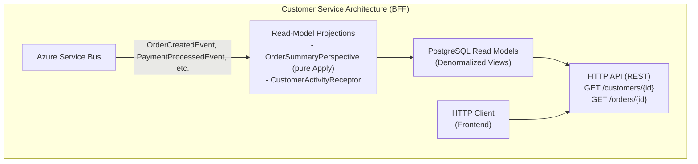
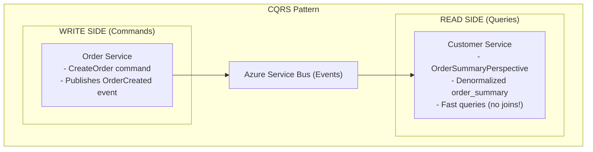
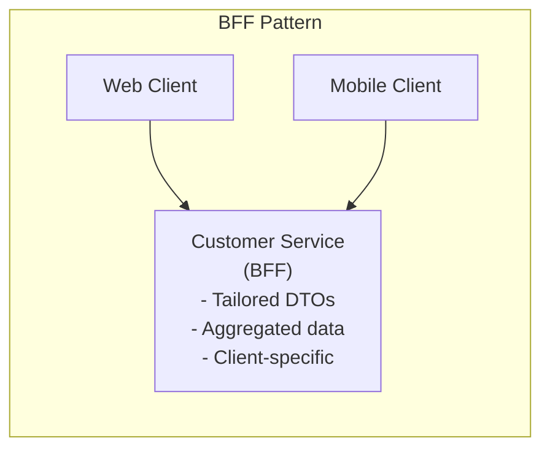

# Customer Service (BFF)

Build the **Customer Service** - a Backend for Frontend (BFF) API that provides denormalized read models via **Perspectives**, demonstrating the query side of CQRS.

:::note
This is **Part 6** of the ECommerce Tutorial. Complete [Shipping Service](shipping-service.md) first.
:::

---

## What You'll Build



**Features**:
- ✅ Perspectives (event-driven read models)
- ✅ Denormalized views (fast queries)
- ✅ CQRS query side
- ✅ BFF pattern (tailored to frontend needs)
- ✅ REST API with rich DTOs
- ✅ Event sourcing with time-travel queries

---

## Step 1: Read Models

### Order Summary Read Model

Whizbang perspectives materialize into **framework-managed tables** — each read model is stored as a `PerspectiveRow<TModel>` (data as JSONB plus indexed scope columns), created automatically by `EnsureWhizbangDatabaseInitializedAsync()` at startup. You don't hand-write a migration for it; you just declare the model:

**ECommerce.CustomerService.API/Lenses/OrderSummaryModel.cs**:

```csharp{title="Order Summary Read Model" description="**ECommerce." category="Example" difficulty="INTERMEDIATE" tags=["Learn", "Tutorial", "Order", "Summary"]}
using ECommerce.Contracts.Commands;
using Whizbang.Core;

namespace ECommerce.CustomerService.API.Lenses;

/// <summary>Denormalized order view - one row per order stream.</summary>
public record OrderSummaryModel {
  [StreamId]
  public required OrderId OrderId { get; init; }
  public required CustomerId CustomerId { get; init; }
  public required string Status { get; init; }  // 'Pending', 'PaymentProcessed', 'Shipped'
  public decimal TotalAmount { get; init; }
  public int ItemCount { get; init; }
  public DateTime CreatedAt { get; init; }
  public string? PaymentTransactionId { get; init; }
  public string? ShipmentId { get; init; }
  public string? TrackingNumber { get; init; }
}
```

The `[StreamId]` attribute marks the property that identifies the stream the model belongs to — here, one read model row per order.

### Customer Activity View

Customer activity aggregates **across many order streams** into one row per customer, so it doesn't fit the per-stream perspective model — we project it with a receptor into a custom table instead (the same pattern the [Analytics Service](analytics-service.md) uses):

**ECommerce.CustomerService.API/Database/Migrations/002_CreateCustomerActivityTable.sql**:

```sql{title="Customer Activity View" description="**ECommerce." category="Example" difficulty="INTERMEDIATE" tags=["Learn", "Tutorial", "Customer", "Activity"]}
CREATE TABLE IF NOT EXISTS customer_activity (
  customer_id TEXT PRIMARY KEY,
  total_orders INTEGER NOT NULL DEFAULT 0,
  total_spent NUMERIC(10, 2) NOT NULL DEFAULT 0,
  last_order_id TEXT,
  last_order_at TIMESTAMP,
  first_order_at TIMESTAMP,
  updated_at TIMESTAMP NOT NULL DEFAULT NOW()
);

CREATE INDEX idx_customer_activity_total_spent ON customer_activity(total_spent DESC);
CREATE INDEX idx_customer_activity_last_order_at ON customer_activity(last_order_at DESC);
```

---

## Step 2: Perspectives

### Order Summary Perspective

A perspective is a set of **pure `Apply` functions** — no I/O, no side effects. The perspective worker loads the current model, calls `Apply`, and persists the result through the framework-managed `IPerspectiveStore<T>`:

**ECommerce.CustomerService.API/Perspectives/OrderSummaryPerspective.cs**:

```csharp{title="Order Summary Perspective" description="**ECommerce." category="Example" difficulty="ADVANCED" tags=["Learn", "Tutorial", "Order", "Summary"]}
using ECommerce.Contracts.Events;
using ECommerce.CustomerService.API.Lenses;
using Whizbang.Core.Perspectives;

namespace ECommerce.CustomerService.API.Perspectives;

/// <summary>
/// Materializes order events into the OrderSummaryModel read model.
/// Apply methods are pure functions - no I/O, no side effects, deterministic.
/// </summary>
public class OrderSummaryPerspective :
  IPerspectiveFor<OrderSummaryModel, OrderCreatedEvent, PaymentProcessedEvent, ShipmentCreatedEvent> {

  // OrderCreatedEvent sets the initial state
  public OrderSummaryModel Apply(OrderSummaryModel currentData, OrderCreatedEvent @event) {
    return new OrderSummaryModel {
      OrderId = @event.OrderId,
      CustomerId = @event.CustomerId,
      Status = "Pending",
      TotalAmount = @event.TotalAmount,
      ItemCount = @event.LineItems.Count,
      CreatedAt = @event.CreatedAt
    };
  }

  // PaymentProcessedEvent updates payment info
  public OrderSummaryModel Apply(OrderSummaryModel currentData, PaymentProcessedEvent @event) {
    return currentData with {
      Status = "PaymentProcessed",
      PaymentTransactionId = @event.TransactionId
    };
  }

  // ShipmentCreatedEvent updates shipment info
  public OrderSummaryModel Apply(OrderSummaryModel currentData, ShipmentCreatedEvent @event) {
    return currentData with {
      Status = "Shipped",
      ShipmentId = @event.ShipmentId,
      TrackingNumber = @event.TrackingNumber
    };
  }
}
```

**Key pattern**: **Single perspective handles multiple events** to build a denormalized view — one type parameter for the model, one for each event type it applies.

:::note
Notice there's no logging, no `NpgsqlConnection`, no timestamps from `DateTime.UtcNow`. `Apply` must be a pure function so event replays reconstruct identical state. Persistence, retries, and exactly-once bookkeeping are the perspective worker's job.
:::

### Customer Activity Projection (Receptor)

Customer activity spans many order streams (one row per customer, aggregated across orders), so it's projected by a **receptor** into the custom `customer_activity` table:

**ECommerce.CustomerService.API/Receptors/CustomerActivityReceptor.cs**:

```csharp{title="Customer Activity Projection Receptor" description="**ECommerce." category="Example" difficulty="ADVANCED" tags=["Learn", "Tutorial", "Customer", "Activity"]}
using Whizbang.Core;
using ECommerce.Contracts.Events;
using Npgsql;
using Dapper;

namespace ECommerce.CustomerService.API.Receptors;

public class CustomerActivityReceptor : IReceptor<OrderCreatedEvent> {
  private readonly NpgsqlConnection _db;
  private readonly ILogger<CustomerActivityReceptor> _logger;

  public CustomerActivityReceptor(
    NpgsqlConnection db,
    ILogger<CustomerActivityReceptor> logger
  ) {
    _db = db;
    _logger = logger;
  }

  public async ValueTask HandleAsync(
    OrderCreatedEvent @event,
    CancellationToken ct = default
  ) {
    await _db.ExecuteAsync(
      """
      INSERT INTO customer_activity (
        customer_id, total_orders, total_spent, last_order_id, last_order_at, first_order_at, updated_at
      )
      VALUES (@CustomerId, 1, @TotalAmount, @OrderId, @CreatedAt, @CreatedAt, NOW())
      ON CONFLICT (customer_id) DO UPDATE SET
        total_orders = customer_activity.total_orders + 1,
        total_spent = customer_activity.total_spent + @TotalAmount,
        last_order_id = @OrderId,
        last_order_at = @CreatedAt,
        updated_at = NOW()
      """,
      new {
        CustomerId = @event.CustomerId.ToString(),
        TotalAmount = @event.TotalAmount,
        OrderId = @event.OrderId.ToString(),
        CreatedAt = @event.CreatedAt
      }
    );

    _logger.LogInformation(
      "Customer activity updated for customer {CustomerId}",
      @event.CustomerId
    );
  }
}
```

---

## Step 3: HTTP API

### DTOs

The order endpoints return the `OrderSummaryModel` read model directly — it was shaped for the frontend in the first place (that's the BFF pattern). The customer endpoints map the custom `customer_activity` table to a DTO:

**ECommerce.CustomerService.API/Models/CustomerActivityDto.cs**:

```csharp{title="DTOs - CustomerActivityDto" description="**ECommerce." category="Example" difficulty="INTERMEDIATE" tags=["Learn", "Tutorial", "DTOs"]}
namespace ECommerce.CustomerService.API.Models;

public record CustomerActivityDto(
  string CustomerId,
  int TotalOrders,
  decimal TotalSpent,
  string? LastOrderId,
  DateTime? LastOrderAt,
  DateTime? FirstOrderAt
);
```

### Controllers

**ECommerce.CustomerService.API/Controllers/CustomersController.cs**:

```csharp{title="Controllers" description="**ECommerce." category="Example" difficulty="ADVANCED" tags=["Learn", "Tutorial", "Controllers"]}
using Microsoft.AspNetCore.Mvc;
using Microsoft.EntityFrameworkCore;
using Npgsql;
using Dapper;
using ECommerce.CustomerService.API.Lenses;
using ECommerce.CustomerService.API.Models;
using Whizbang.Core.Lenses;

namespace ECommerce.CustomerService.API.Controllers;

[ApiController]
[Route("api/[controller]")]
public class CustomersController : ControllerBase {
  private readonly NpgsqlConnection _db;
  private readonly ILensQuery<OrderSummaryModel> _orders;

  public CustomersController(
    NpgsqlConnection db,
    ILensQuery<OrderSummaryModel> orders
  ) {
    _db = db;
    _orders = orders;
  }

  [HttpGet("{customerId}")]
  [ProducesResponseType(typeof(CustomerActivityDto), StatusCodes.Status200OK)]
  [ProducesResponseType(StatusCodes.Status404NotFound)]
  public async Task<IActionResult> GetCustomer(string customerId) {
    var customer = await _db.QuerySingleOrDefaultAsync<CustomerActivityRow>(
      """
      SELECT customer_id, total_orders, total_spent, last_order_id, last_order_at, first_order_at
      FROM customer_activity
      WHERE customer_id = @CustomerId
      """,
      new { CustomerId = customerId }
    );

    if (customer == null) {
      return NotFound();
    }

    return Ok(new CustomerActivityDto(
      CustomerId: customer.CustomerId,
      TotalOrders: customer.TotalOrders,
      TotalSpent: customer.TotalSpent,
      LastOrderId: customer.LastOrderId,
      LastOrderAt: customer.LastOrderAt,
      FirstOrderAt: customer.FirstOrderAt
    ));
  }

  [HttpGet("{customerId}/orders")]
  [ProducesResponseType(typeof(OrderSummaryModel[]), StatusCodes.Status200OK)]
  public async Task<IActionResult> GetCustomerOrders(string customerId, CancellationToken ct) {
    // Query the framework-managed read model through the lens.
    // row.Scope.CustomerId is an indexed scope column - no JSONB scan.
    var orders = await _orders.DefaultScope.Query
      .Where(row => row.Scope.CustomerId == customerId)
      .OrderByDescending(row => row.CreatedAt)
      .Select(row => row.Data)
      .ToListAsync(ct);

    return Ok(orders);
  }
}

public record CustomerActivityRow(
  string CustomerId,
  int TotalOrders,
  decimal TotalSpent,
  string? LastOrderId,
  DateTime? LastOrderAt,
  DateTime? FirstOrderAt
);
```

**ECommerce.CustomerService.API/Controllers/OrdersController.cs**:

```csharp{title="Controllers - OrdersController" description="**ECommerce." category="Example" difficulty="ADVANCED" tags=["Learn", "Tutorial", "Controllers"]}
using Microsoft.AspNetCore.Mvc;
using ECommerce.CustomerService.API.Lenses;
using Whizbang.Core.Lenses;

namespace ECommerce.CustomerService.API.Controllers;

[ApiController]
[Route("api/[controller]")]
public class OrdersController : ControllerBase {
  private readonly ILensQuery<OrderSummaryModel> _orders;

  public OrdersController(ILensQuery<OrderSummaryModel> orders) {
    _orders = orders;
  }

  [HttpGet("{orderId:guid}")]
  [ProducesResponseType(typeof(OrderSummaryModel), StatusCodes.Status200OK)]
  [ProducesResponseType(StatusCodes.Status404NotFound)]
  public async Task<IActionResult> GetOrder(Guid orderId, CancellationToken ct) {
    var order = await _orders.DefaultScope.GetByIdAsync(orderId, ct);

    if (order == null) {
      return NotFound();
    }

    return Ok(order);
  }
}
```

---

## Step 4: Service Configuration

**ECommerce.CustomerService.API/Program.cs**:

```csharp{title="Step 4: Service Configuration" description="**ECommerce." category="Example" difficulty="ADVANCED" tags=["Learn", "Tutorial", "Step", "Service"]}
using Whizbang.Core;
using Whizbang.Core.Messaging;
using Whizbang.Core.Observability;
using Whizbang.Core.Routing;
using Whizbang.Core.Workers;
using Whizbang.Data.EFCore.Postgres;
using Whizbang.Transports.AzureServiceBus;
using Npgsql;

var builder = WebApplication.CreateBuilder(args);

// 1. Aspire service defaults (telemetry, health checks, service discovery)
builder.AddServiceDefaults();

// 2. Azure Service Bus transport
var serviceBusConnection = builder.Configuration.GetConnectionString("servicebus")
    ?? throw new InvalidOperationException("Azure Service Bus connection string 'servicebus' not found");
builder.Services.AddAzureServiceBusTransport(serviceBusConnection);
builder.Services.AddAzureServiceBusHealthChecks();

// 3. Core plumbing
builder.Services.AddSingleton<IServiceInstanceProvider, ServiceInstanceProvider>();
builder.Services.AddSingleton<OrderedStreamProcessor>();

// 4. Unified Whizbang API — routing + EF Core Postgres driver + transport consumer.
//    Registers IInbox/IOutbox/IEventStore plus IPerspectiveStore<T> and
//    ILensQuery<T> for every discovered perspective model (OrderSummaryModel).
builder.Services
  .AddWhizbang()
  .WithRouting(routing => {
    routing
      .OwnDomains("ecommerce.customer.commands")
      .SubscribeTo("ecommerce.orders.events")
      .Inbox.UseSharedTopic("inbox");
  })
  .WithEFCore<CustomerDbContext>()
  .WithDriver.Postgres
  .AddTransportConsumer();

// 5. Receptors + perspectives (generated registrations)
builder.Services.AddReceptors();
builder.Services.AddPerspectiveRunners();
builder.Services.AddScoped<ECommerce.CustomerService.API.Perspectives.OrderSummaryPerspective>();
builder.Services.AddWhizbangDispatcher();
builder.Services.AddHostedService<PerspectiveWorker>();

// 6. Direct Npgsql connection for the custom customer_activity table
builder.Services.AddScoped<NpgsqlConnection>(_ => {
  var connectionString = builder.Configuration.GetConnectionString("CustomerDb");
  return new NpgsqlConnection(connectionString);
});

// 7. Controllers
builder.Services.AddControllers();
builder.Services.AddEndpointsApiExplorer();
builder.Services.AddSwaggerGen();

var app = builder.Build();

if (app.Environment.IsDevelopment()) {
  app.UseSwagger();
  app.UseSwaggerUI();
}

app.UseHttpsRedirection();
app.UseAuthorization();
app.MapControllers();

// Initialize Whizbang schema (Inbox/Outbox/EventStore + PerspectiveRow<T> tables)
using (var scope = app.Services.CreateScope()) {
  var dbContext = scope.ServiceProvider.GetRequiredService<CustomerDbContext>();
  var logger = scope.ServiceProvider.GetRequiredService<ILogger<Program>>();
  await dbContext.EnsureWhizbangDatabaseInitializedAsync(logger);
}

app.Run();
```

---

## Step 5: Test BFF API

### 1. Create Order (Full Flow)

```bash{title="Create Order (Full Flow)" description="Create Order (Full Flow)" category="Example" difficulty="BEGINNER" tags=["Learn", "Tutorial", "Create", "Order"]}
curl -X POST http://localhost:5000/api/orders \
  -H "Content-Type: application/json" \
  -d '{ ... }'
```

Wait for events to propagate through system (~10 seconds).

### 2. Query Customer Activity

```bash{title="Query Customer Activity" description="Query Customer Activity" category="Example" difficulty="BEGINNER" tags=["Learn", "Tutorial", "Query", "Customer"]}
curl http://localhost:5001/api/customers/0193d5a0-5678-7abc-9def-0123456789ab
```

**Response**:

```json{title="Query Customer Activity (2)" description="Query Customer Activity" category="Example" difficulty="BEGINNER" tags=["Learn", "Tutorial", "Query", "Customer"]}
{
  "customerId": "0193d5a0-5678-7abc-9def-0123456789ab",
  "totalOrders": 1,
  "totalSpent": 39.98,
  "lastOrderId": "0193d5a0-1234-7abc-9def-0123456789ab",
  "lastOrderAt": "2024-12-12T10:30:00Z",
  "firstOrderAt": "2024-12-12T10:30:00Z"
}
```

### 3. Query Customer Orders

```bash{title="Query Customer Orders" description="Query Customer Orders" category="Example" difficulty="BEGINNER" tags=["Learn", "Tutorial", "Query", "Customer"]}
curl http://localhost:5001/api/customers/0193d5a0-5678-7abc-9def-0123456789ab/orders
```

**Response**:

```json{title="Query Customer Orders (2)" description="Query Customer Orders" category="Example" difficulty="ADVANCED" tags=["Learn", "Tutorial", "Query", "Customer"]}
[
  {
    "orderId": "0193d5a0-1234-7abc-9def-0123456789ab",
    "customerId": "0193d5a0-5678-7abc-9def-0123456789ab",
    "status": "Shipped",
    "totalAmount": 39.98,
    "itemCount": 1,
    "createdAt": "2024-12-12T10:30:00Z",
    "paymentTransactionId": "txn-xyz789",
    "shipmentId": "ship-def456",
    "trackingNumber": "123456789012"
  }
]
```

### 4. Query Single Order

```bash{title="Query Single Order" description="Query Single Order" category="Example" difficulty="BEGINNER" tags=["Learn", "Tutorial", "Query", "Single"]}
curl http://localhost:5001/api/orders/0193d5a0-1234-7abc-9def-0123456789ab
```

**Response**: Same as above (single order).

---

## Key Concepts

### CQRS (Command Query Responsibility Segregation)



**Benefits**:
- ✅ **Write optimization**: Order Service optimized for writes (ACID, validation)
- ✅ **Read optimization**: Customer Service optimized for reads (denormalized, indexed)
- ✅ **Independent scaling**: Scale read replicas independently
- ✅ **Eventual consistency**: Acceptable for most read queries

### Event-Driven Read Models

```csharp{title="Event-Driven Read Models" description="Event-Driven Read Models" category="Example" difficulty="INTERMEDIATE" tags=["Learn", "Tutorial", "Event-Driven", "Read"]}
// Single perspective applies multiple events - pure functions only
public class OrderSummaryPerspective :
  IPerspectiveFor<OrderSummaryModel,
                  OrderCreatedEvent,       // Sets initial state
                  PaymentProcessedEvent,   // Updates payment info
                  ShipmentCreatedEvent> {  // Updates shipment info

  public OrderSummaryModel Apply(OrderSummaryModel currentData, OrderCreatedEvent @event) {
    // return initial order summary
  }

  public OrderSummaryModel Apply(OrderSummaryModel currentData, PaymentProcessedEvent @event) {
    // return currentData with payment details
  }

  public OrderSummaryModel Apply(OrderSummaryModel currentData, ShipmentCreatedEvent @event) {
    // return currentData with shipment details
  }
}
```

**Result**: A single `OrderSummaryModel` row with data from 3 different events — persistence handled by the perspective worker, not the perspective.

### BFF (Backend for Frontend)



**Key characteristics**:
- ✅ **Client-specific**: DTOs shaped for frontend needs
- ✅ **Aggregation**: Combines data from multiple events
- ✅ **Denormalization**: Pre-joins data for performance
- ✅ **Versioning**: API versions per client type

---

## Testing

### Unit Test - Perspective

```csharp{title="Unit Test - Perspective" description="Unit Test - Perspective" category="Example" difficulty="INTERMEDIATE" tags=["Learn", "Tutorial", "Unit", "Test"]}
[Test]
public async Task OrderSummaryPerspective_OrderCreated_CreatesOrderSummaryAsync() {
  // Arrange - pure functions need no mocks, no database
  var perspective = new OrderSummaryPerspective();
  var @event = new OrderCreatedEvent {
    OrderId = OrderId.New(),
    CustomerId = CustomerId.New(),
    LineItems = [new OrderLineItem {
      ProductId = ProductId.New(),
      ProductName = "Widget",
      Quantity = 2,
      UnitPrice = 19.99m
    }],
    TotalAmount = 39.98m,
    CreatedAt = new DateTime(2024, 12, 12, 10, 30, 0)
  };

  // Act
  var summary = perspective.Apply(null!, @event);

  // Assert
  await Assert.That(summary).IsNotNull();
  await Assert.That(summary.Status).IsEqualTo("Pending");
  await Assert.That(summary.ItemCount).IsEqualTo(1);
}
```

---

## Next Steps

Continue to **[Analytics Service](analytics-service.md)** to:
- Build real-time analytics dashboards
- Aggregate events across all services
- Implement time-series projection receptors
- Create daily/monthly reports

---

## Key Takeaways

✅ **CQRS** - Separate write (commands) and read (queries) models
✅ **Perspectives** - Event-driven read model updates
✅ **Denormalization** - Pre-join data for fast queries
✅ **BFF Pattern** - Tailor API to frontend needs
✅ **Eventual Consistency** - Acceptable for most read queries

---

*Version 1.0.0 - Foundation Release | Last Updated: 2024-12-12*
