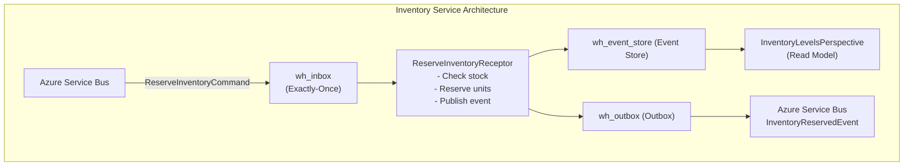
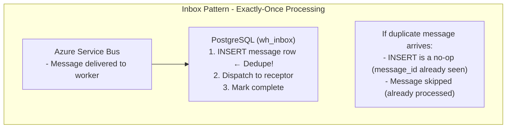
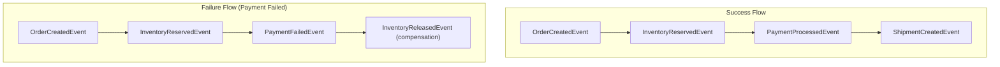

# Inventory Service

Build the **Inventory Worker** - a background service that handles inventory commands, publishes `InventoryReservedEvent`, and maintains read models via perspectives.

:::note
This is **Part 2** of the ECommerce Tutorial. Complete [Order Management](order-management.md) first.
:::

---

## What You'll Build



**Features**:
- ✅ Command subscription via shared inbox topic
- ✅ Inbox pattern (exactly-once processing, framework-managed)
- ✅ Inventory reservation logic
- ✅ Compensation event (`InventoryReleasedEvent`)
- ✅ Perspective read model (`InventoryLevelsPerspective`)
- ✅ Lens queries over materialized data

---

## Step 1: Define Messages

### ReserveInventoryCommand

**ECommerce.Contracts/Commands/ReserveInventoryCommand.cs**:

```csharp{title="ReserveInventoryCommand" description="**ECommerce." category="Example" difficulty="INTERMEDIATE" tags=["Learn", "Tutorial", "ReserveInventory", "Command"]}
using Whizbang.Core;

namespace ECommerce.Contracts.Commands;

/// <summary>
/// Command to reserve inventory for an order
/// </summary>
public record ReserveInventoryCommand : ICommand {
  public required OrderId OrderId { get; init; }
  [StreamId]
  public required ProductId ProductId { get; init; }
  public int Quantity { get; init; }
}
```

### InventoryReservedEvent

**ECommerce.Contracts/Events/InventoryReservedEvent.cs**:

```csharp{title="InventoryReserved Event" description="**ECommerce." category="Example" difficulty="INTERMEDIATE" tags=["Learn", "Tutorial", "InventoryReserved", "Event"]}
using Whizbang.Core;

namespace ECommerce.Contracts.Events;

/// <summary>
/// Event published when inventory is successfully reserved
/// </summary>
public record InventoryReservedEvent : IEvent {
  public required string OrderId { get; init; }
  [StreamId]
  public required Guid ProductId { get; init; }
  public int Quantity { get; init; }
  public DateTime ReservedAt { get; init; }
}
```

### InventoryReleasedEvent (Compensation)

**ECommerce.Contracts/Events/InventoryReleasedEvent.cs**:

```csharp{title="InventoryReleased Event (Compensation)" description="**ECommerce." category="Example" difficulty="INTERMEDIATE" tags=["Learn", "Tutorial", "InventoryReleased", "Event"]}
using Whizbang.Core;

namespace ECommerce.Contracts.Events;

/// <summary>
/// Event published when previously reserved inventory is released (e.g., order cancelled)
/// </summary>
public record InventoryReleasedEvent : IEvent {
  public required string OrderId { get; init; }
  [StreamId]
  public required Guid ProductId { get; init; }
  public int Quantity { get; init; }
  public DateTime ReleasedAt { get; init; }
}
```

**Why two events?**
- Success path: `InventoryReservedEvent` moves the order flow forward
- Compensation path: `InventoryReleasedEvent` returns stock when a downstream step (e.g., payment) fails

Note the `[StreamId]` on `ProductId`: inventory events are streamed **per product**, so perspective updates for the same product are processed in order.

---

## Step 2: Persistence (Framework-Managed)

:::updated
Earlier drafts hand-wrote `inventory`, `inventory_reservations`, and `inbox` tables with raw SQL. Whizbang provisions its own tables — `wh_inbox` (exactly-once dedup), `wh_outbox`, `wh_event_store`, and one table per perspective model (e.g., `inventory_levels` for `InventoryLevelDto`) — from the `[WhizbangDbContext]` attribute and perspective discovery. No migration SQL is required for the messaging infrastructure.
:::

**ECommerce.InventoryWorker/InventoryDbContext.cs** follows the same pattern as the Order Service:

```csharp{title="Step 2: Persistence" description="**ECommerce." category="Example" difficulty="INTERMEDIATE" tags=["Learn", "Tutorial", "Persistence", "DbContext"]}
using Microsoft.EntityFrameworkCore;
using Whizbang.Data.EFCore.Custom;

namespace ECommerce.InventoryWorker;

[WhizbangDbContext]
public partial class InventoryDbContext(DbContextOptions<InventoryDbContext> options) : DbContext(options) {
  // DbSet properties and OnModelCreating are auto-generated in partial class
}
```

---

## Step 3: Implement Receptor

**ECommerce.InventoryWorker/Receptors/ReserveInventoryReceptor.cs**:

```csharp{title="Step 3: Implement Receptor" description="**ECommerce." category="Example" difficulty="ADVANCED" tags=["Learn", "Tutorial", "Step", "Implement"]}
using ECommerce.Contracts.Commands;
using ECommerce.Contracts.Events;
using Whizbang.Core;

namespace ECommerce.InventoryWorker.Receptors;

/// <summary>
/// Handles ReserveInventoryCommand and publishes InventoryReservedEvent
/// </summary>
public class ReserveInventoryReceptor(IDispatcher dispatcher, ILogger<ReserveInventoryReceptor> logger) : IReceptor<ReserveInventoryCommand, InventoryReservedEvent> {
  public async ValueTask<InventoryReservedEvent> HandleAsync(
    ReserveInventoryCommand message,
    CancellationToken cancellationToken = default) {

    logger.LogInformation(
      "Reserving {Quantity} units of product {ProductId} for order {OrderId}",
      message.Quantity,
      message.ProductId,
      message.OrderId);

    // Check inventory availability (business logic would go here)
    // In a real system, this would query a lens over the InventoryLevels perspective

    // Reserve the inventory
    var inventoryReserved = new InventoryReservedEvent {
      OrderId = message.OrderId.Value.ToString(),
      ProductId = message.ProductId.Value,
      Quantity = message.Quantity,
      ReservedAt = DateTime.UtcNow
    };

    // Publish the event
    await dispatcher.PublishAsync(inventoryReserved);

    logger.LogInformation(
      "Inventory reserved for product {ProductId} in order {OrderId}",
      message.ProductId,
      message.OrderId);

    return inventoryReserved;
  }
}
```

**Key patterns**:
- ✅ **`ValueTask<TResponse> HandleAsync(TMessage, CancellationToken)`** — the receptor contract
- ✅ **No hand-rolled SQL**: stock state lives in the `InventoryLevels` perspective, updated from events
- ✅ **Compensation**: a failure path would publish `InventoryReleasedEvent` instead
- ✅ **Transactional**: event store append + outbox insert are atomic inside the framework

---

## Step 4: Perspective (Read Model)

Perspectives are **pure functions** — `Apply(currentData, event)` returns a new model. No I/O, no side effects; Whizbang's perspective runner handles loading, saving, and checkpointing.

**Model** (**ECommerce.Contracts/Lenses/InventoryLevelDto.cs**):

```csharp{title="Step 4: Perspective Model" description="**ECommerce." category="Example" difficulty="INTERMEDIATE" tags=["Learn", "Tutorial", "Step", "Perspective"]}
using Whizbang;
using Whizbang.Core;

namespace ECommerce.Contracts.Lenses;

[WhizbangSerializable]
public record InventoryLevelDto {
  [StreamId]
  public Guid ProductId { get; init; }
  public int Quantity { get; init; }
  public int Reserved { get; init; }
  public int Available { get; init; }
  public DateTime LastUpdated { get; init; }
}
```

**Perspective** (**ECommerce.InventoryWorker/Perspectives/InventoryLevelsPerspective.cs**, condensed):

```csharp{title="Step 4: Perspective (Read Model)" description="**ECommerce." category="Example" difficulty="ADVANCED" tags=["Learn", "Tutorial", "Step", "Perspective"]}
using ECommerce.Contracts.Events;
using ECommerce.Contracts.Lenses;
using Whizbang.Core.Perspectives;

namespace ECommerce.InventoryWorker.Perspectives;

/// <summary>
/// Materializes inventory events into InventoryLevelDto perspective.
/// Pure functions - no I/O, no side effects, deterministic.
/// </summary>
public class InventoryLevelsPerspective :
  IPerspectiveFor<InventoryLevelDto, ProductCreatedEvent, InventoryRestockedEvent, InventoryReservedEvent, InventoryAdjustedEvent> {

  /// <summary>New products start at 0 quantity.</summary>
  public InventoryLevelDto Apply(InventoryLevelDto currentData, ProductCreatedEvent @event) {
    return new InventoryLevelDto {
      ProductId = @event.ProductId,
      Quantity = 0,
      Reserved = 0,
      Available = 0,
      LastUpdated = @event.CreatedAt
    };
  }

  /// <summary>Restock sets a new total; preserves reserved count.</summary>
  public InventoryLevelDto Apply(InventoryLevelDto currentData, InventoryRestockedEvent @event) {
    var reserved = currentData?.Reserved ?? 0;
    return new InventoryLevelDto {
      ProductId = @event.ProductId,
      Quantity = @event.NewTotalQuantity,
      Reserved = reserved,
      Available = @event.NewTotalQuantity - reserved,
      LastUpdated = @event.RestockedAt
    };
  }

  /// <summary>Reservation increments the reserved count.</summary>
  public InventoryLevelDto Apply(InventoryLevelDto currentData, InventoryReservedEvent @event) {
    if (currentData == null) {
      return null!; // PerspectiveRunner will handle null return (skip)
    }

    var newReserved = currentData.Reserved + @event.Quantity;
    return new InventoryLevelDto {
      ProductId = currentData.ProductId,
      Quantity = currentData.Quantity,
      Reserved = newReserved,
      Available = currentData.Quantity - newReserved,
      LastUpdated = @event.ReservedAt
    };
  }

  /// <summary>Manual adjustment (damaged goods, audits) sets a new total.</summary>
  public InventoryLevelDto Apply(InventoryLevelDto currentData, InventoryAdjustedEvent @event) {
    if (currentData == null) {
      return null!;
    }

    return new InventoryLevelDto {
      ProductId = currentData.ProductId,
      Quantity = @event.NewTotalQuantity,
      Reserved = currentData.Reserved,
      Available = @event.NewTotalQuantity - currentData.Reserved,
      LastUpdated = @event.AdjustedAt
    };
  }
}
```

:::updated
There is no `IPerspectiveOf<TEvent>` interface with a `HandleAsync` that performs SQL. The real contract is `IPerspectiveFor<TModel, TEvent1, ..., TEventN>` (up to 20 event types) with pure `Apply(TModel currentData, TEvent eventData)` methods. Whizbang persists the returned model to a generated perspective table and tracks checkpoints for you.
:::

**Querying the read model — Lenses** (**ECommerce.InventoryWorker/Lenses/InventoryLens.cs**, condensed):

```csharp{title="Step 4: Lens Query" description="**ECommerce." category="Example" difficulty="INTERMEDIATE" tags=["Learn", "Tutorial", "Step", "Lens"]}
using ECommerce.Contracts.Lenses;
using Microsoft.EntityFrameworkCore;
using Whizbang.Core.Lenses;

namespace ECommerce.InventoryWorker.Lenses;

/// <summary>
/// EF Core implementation of IInventoryLens for fast readonly queries.
/// Uses ILensQuery abstraction with LINQ - zero reflection, AOT compatible.
/// </summary>
public class InventoryLens(ILensQuery<InventoryLevelDto> query) : IInventoryLens {

  public async Task<InventoryLevelDto?> GetByProductIdAsync(Guid productId, CancellationToken cancellationToken = default) {
    return await query.DefaultScope.GetByIdAsync(productId, cancellationToken);
  }

  public async Task<IReadOnlyList<InventoryLevelDto>> GetLowStockAsync(int threshold = 10, CancellationToken cancellationToken = default) {
    var results = await query.DefaultScope.Query
      .AsNoTracking()
      .Where(row => row.Data.Quantity - row.Data.Reserved <= threshold)
      .Select(row => row.Data)
      .ToListAsync(cancellationToken);

    return results.AsReadOnly();
  }
}
```

**Why perspectives?**
- ✅ **Denormalized Read Models**: Fast queries without joins
- ✅ **Event-Driven Updates**: Automatically updated from events
- ✅ **CQRS**: Separate read (perspective + lens) from write (receptor) models
- ✅ **Pure functions**: Trivially unit-testable, deterministic replay

---

## Step 5: Worker Configuration

**ECommerce.InventoryWorker/Program.cs** (condensed from the sample):

```csharp{title="Step 5: Worker Configuration" description="**ECommerce." category="Example" difficulty="ADVANCED" tags=["Learn", "Tutorial", "Step", "Worker"]}
using ECommerce.Contracts.Generated;
using ECommerce.InventoryWorker;
using ECommerce.InventoryWorker.Generated;
using ECommerce.InventoryWorker.Lenses;
using Whizbang.Core;
using Whizbang.Core.Generated;
using Whizbang.Core.Messaging;
using Whizbang.Core.Observability;
using Whizbang.Core.Routing;
using Whizbang.Core.Workers;
using Whizbang.Data.EFCore.Postgres;
using Whizbang.Transports.AzureServiceBus;

var builder = Host.CreateApplicationBuilder(args);

builder.AddServiceDefaults();

var serviceBusConnection = builder.Configuration.GetConnectionString("servicebus")
    ?? throw new InvalidOperationException("Azure Service Bus connection string 'servicebus' not found");

// Register Azure Service Bus transport
builder.Services.AddAzureServiceBusTransport(serviceBusConnection);
builder.Services.AddAzureServiceBusHealthChecks();

// Observability + worker infrastructure
builder.Services.AddSingleton<ITraceStore, InMemoryTraceStore>();
builder.Services.AddSingleton<IServiceInstanceProvider, ServiceInstanceProvider>();
builder.Services.AddSingleton<OrderedStreamProcessor>();

// Unified Whizbang API with routing + EF Core Postgres driver
// WithRouting() configures message routing; AddTransportConsumer() auto-generates subscriptions
_ = builder.Services
  .AddWhizbang()
  .WithRouting(routing => {
    routing
      .OwnDomains("ecommerce.inventory.commands")
      .SubscribeTo("ecommerce.products.events")
      .Inbox.UseSharedTopic("inbox");
  })
  .WithEFCore<InventoryDbContext>()
  .WithDriver.Postgres
  .AddTransportConsumer();

// Generated registrations: receptors, perspective runners, dispatcher
builder.Services.AddReceptors();
builder.Services.AddPerspectiveRunners();
builder.Services.AddScoped<ECommerce.InventoryWorker.Perspectives.ProductCatalogPerspective>();
builder.Services.AddScoped<ECommerce.InventoryWorker.Perspectives.InventoryLevelsPerspective>();
builder.Services.AddWhizbangDispatcher();
builder.Services.AddWhizbangLifecycleMessageDeserializer();

// Lenses (readonly repositories over perspective tables)
builder.Services.AddScoped<IProductLens, ProductLens>();
builder.Services.AddScoped<IInventoryLens, InventoryLens>();

// Perspective worker - processes perspective checkpoints
builder.Services.AddOptions<PerspectiveWorkerOptions>()
  .Bind(builder.Configuration.GetSection("PerspectiveWorker"));

// AOT-compatible polymorphic event deserialization
builder.Services.AddSingleton<IEventTypeProvider, ECommerce.Contracts.ECommerceEventTypeProvider>();

builder.Services.AddHostedService<PerspectiveWorker>();
builder.Services.AddHostedService<Worker>();

var host = builder.Build();

// Initialize Whizbang schema (Inbox/Outbox/EventStore + perspective tables)
using (var scope = host.Services.CreateScope()) {
  var dbContext = scope.ServiceProvider.GetRequiredService<InventoryDbContext>();
  var logger = scope.ServiceProvider.GetRequiredService<ILogger<Program>>();
  await dbContext.EnsureWhizbangDatabaseInitializedAsync(logger);
}

host.Run();
```

:::updated
There is no hand-written work-claiming loop. `AddTransportConsumer()` registers the transport consumer worker that receives messages, dedupes via `wh_inbox`, and dispatches to receptors; `PerspectiveWorker` drains perspective checkpoints. The service's own `Worker` class in the sample is just a heartbeat logger.
:::

---

## Step 6: Aspire Integration

**Update ECommerce.AppHost/Program.cs** (excerpt matching the sample):

```csharp{title="Step 6: Aspire Integration" description="**Update ECommerce." category="Example" difficulty="INTERMEDIATE" tags=["Learn", "Tutorial", "Step", "Aspire"]}
var inventoryDb = postgres.AddDatabase("inventorydb");  // NEW

// Topics + subscriptions for the inventory worker
var productsTopic = messagingInfra.AddServiceBusTopic("products");
productsTopic.AddServiceBusSubscription("sub-inventory-products");

// Shared "inbox" topic for point-to-point commands, filtered per service
var inboxTopic = messagingInfra.AddServiceBusTopic("inbox");
inboxTopic.AddServiceBusSubscription("sub-inbox-inventory").WithDestinationFilter("inventory-service");

// Inventory Worker (NEW)
var inventoryWorker = builder.AddProject("inventoryworker", "../ECommerce.InventoryWorker/ECommerce.InventoryWorker.csproj")
    .WithReference(inventoryDb)
    .WithReference(messagingInfra)
    .WaitFor(inventoryDb)
    .WaitFor(messagingInfra);
```

---

## Step 7: Test the Flow

### 1. Start Aspire

```bash{title="Start Aspire" description="Start Aspire" category="Example" difficulty="BEGINNER" tags=["Learn", "Tutorial", "Start", "Aspire"]}
cd ECommerce.AppHost
dotnet run
```

### 2. Create Order (Triggers Inventory Flow)

```bash{title="Create Order (Triggers Inventory Reservation)" description="Create Order (Triggers Inventory Reservation)" category="Example" difficulty="INTERMEDIATE" tags=["Learn", "Tutorial", "Create", "Order"]}
curl -X POST http://localhost:5000/api/orders \
  -H "Content-Type: application/json" \
  -d '{
    "customerId": "0195b3f0-1234-7abc-8def-0123456789ab",
    "lineItems": [
      {
        "productId": "0195b3f0-5678-7abc-8def-0123456789ab",
        "productName": "Widget",
        "quantity": 2,
        "unitPrice": 19.99
      }
    ]
  }'
```

### 3. Observe Event Flow

Check Aspire Dashboard:
1. **Order Service**: `OrderCreatedEvent` published to Service Bus
2. **Inventory Worker**: receives command via the shared `inbox` topic (dedup via `wh_inbox`)
3. **Inventory Worker**: `ReserveInventoryReceptor` publishes `InventoryReservedEvent`
4. **Perspective Worker**: `InventoryLevelsPerspective` updates the read model

### 4. Verify Database

```sql{title="Verify Database" description="Verify Database" category="Example" difficulty="BEGINNER" tags=["Learn", "Tutorial", "Verify", "Database"]}
-- Check the event store
SELECT stream_id, event_type FROM wh_event_store ORDER BY created_at DESC LIMIT 10;

-- Check the perspective read model (table generated for InventoryLevelDto)
SELECT * FROM inventory_levels;
```

**Expected**:
- `InventoryReservedEvent` row in `wh_event_store`
- `inventory_levels.reserved` incremented for the product

---

## Key Concepts

### Inbox Pattern (Exactly-Once Processing)



**Benefits**:
- ✅ **Exactly-Once**: Duplicate messages automatically skipped
- ✅ **Idempotent**: Safe to retry failed messages
- ✅ **Zero boilerplate**: `wh_inbox` is created and managed by the framework

### Compensation (Saga Pattern)



A compensation receptor subscribes to `PaymentFailedEvent` and publishes `InventoryReleasedEvent`:

```csharp{title="Compensation (Saga Pattern)" description="Compensation receptor sketch" category="Example" difficulty="ADVANCED" tags=["Learn", "Tutorial", "Compensation", "Saga"]}
public class ReleaseInventoryReceptor(IDispatcher dispatcher, ILogger<ReleaseInventoryReceptor> logger)
  : IReceptor<PaymentFailedEvent, InventoryReleasedEvent> {

  public async ValueTask<InventoryReleasedEvent> HandleAsync(
    PaymentFailedEvent message,
    CancellationToken cancellationToken = default) {

    logger.LogWarning("Payment failed for order {OrderId}; releasing reserved inventory", message.OrderId);

    // Look up the reservation for this order (via a lens over the reservations perspective),
    // then publish the release event for each reserved product.
    var released = new InventoryReleasedEvent {
      OrderId = message.OrderId,
      ProductId = /* product from reservation lookup */ default,
      Quantity = /* reserved quantity */ 0,
      ReleasedAt = DateTime.UtcNow
    };

    await dispatcher.PublishAsync(released);
    return released;
  }
}
```

The `InventoryLevelsPerspective` can then handle `InventoryReleasedEvent` with another pure `Apply` overload that decrements `Reserved`.

---

## Testing

Receptor unit tests use a recording `TestDispatcher` and `NullLogger` — no database required (see **tests/ECommerce.InventoryWorker.Tests**):

```csharp{title="Unit Test - Reserve Inventory" description="Unit Test - Reserve Inventory" category="Example" difficulty="INTERMEDIATE" tags=["Learn", "Tutorial", "Unit", "Test"]}
[Test]
public async Task ReserveInventoryReceptor_ValidCommand_PublishesEventAsync() {
  // Arrange
  var dispatcher = new TestDispatcher();
  var receptor = new ReserveInventoryReceptor(dispatcher, NullLogger<ReserveInventoryReceptor>.Instance);

  var command = new ReserveInventoryCommand {
    OrderId = OrderId.New(),
    ProductId = ProductId.New(),
    Quantity = 2
  };

  // Act
  var result = await receptor.HandleAsync(command);

  // Assert
  await Assert.That(result.Quantity).IsEqualTo(2);
  await Assert.That(result.ProductId).IsEqualTo(command.ProductId.Value);
  await Assert.That(dispatcher.PublishCount).IsEqualTo(1);
  await Assert.That(dispatcher.PublishedMessages[0]).IsTypeOf<InventoryReservedEvent>();
}
```

Perspective tests are even simpler — pure function in, model out:

```csharp{title="Unit Test - Perspective Apply" description="Unit Test - Perspective Apply" category="Example" difficulty="INTERMEDIATE" tags=["Learn", "Tutorial", "Unit", "Test"]}
[Test]
public async Task InventoryLevelsPerspective_Reserve_IncrementsReservedAsync() {
  // Arrange
  var perspective = new InventoryLevelsPerspective();
  var current = new InventoryLevelDto {
    ProductId = TrackedGuid.NewMedo().Value, Quantity = 100, Reserved = 0, Available = 100, LastUpdated = DateTime.UtcNow
  };
  var @event = new InventoryReservedEvent {
    OrderId = "order-1", ProductId = current.ProductId, Quantity = 2, ReservedAt = DateTime.UtcNow
  };

  // Act
  var updated = perspective.Apply(current, @event);

  // Assert
  await Assert.That(updated.Reserved).IsEqualTo(2);
  await Assert.That(updated.Available).IsEqualTo(98);
}
```

---

## Next Steps

Continue to **[Payment Processing](payment-processing.md)** to:
- Handle `ProcessPaymentCommand`
- Publish `PaymentProcessedEvent` / `PaymentFailedEvent`
- Handle payment failures (compensation)

---

## Key Takeaways

✅ **Inbox Pattern** - Exactly-once processing via framework-managed `wh_inbox`
✅ **Routing** - `WithRouting(...)` declares owned domains, subscriptions, and the shared inbox topic
✅ **Pure Perspectives** - `IPerspectiveFor<TModel, TEvents...>` with pure `Apply` methods
✅ **Lenses** - `ILensQuery<TModel>` for fast, typed, read-only queries
✅ **Compensation** - `InventoryReleasedEvent` reverses reservations on failure
✅ **Saga Pattern** - Distributed transactions with compensating actions

---

*Version 1.0.0 - Foundation Release | Last Updated: 2026-07-16*
