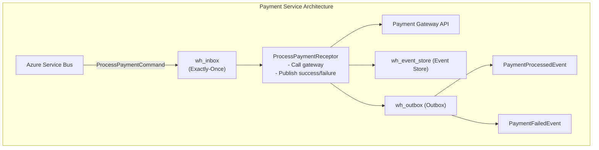
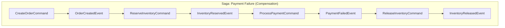

# Payment Processing Service

Build the **Payment Worker** - a background service that handles `ProcessPaymentCommand`, simulates a payment gateway, and publishes `PaymentProcessedEvent` on success or `PaymentFailedEvent` for compensation.

:::note
This is **Part 3** of the ECommerce Tutorial. Complete [Inventory Service](inventory-service.md) first.
:::

---

## What You'll Build



**Features**:
- ✅ Payment success/failure branching
- ✅ Compensation via `PaymentFailedEvent`
- ✅ Framework-managed inbox/outbox/event store
- ✅ Production-hardening patterns (gateway abstraction, retry, circuit breaker)

---

## Step 1: Define Messages

### ProcessPaymentCommand

**ECommerce.Contracts/Commands/ProcessPaymentCommand.cs**:

```csharp{title="ProcessPaymentCommand" description="**ECommerce." category="Example" difficulty="INTERMEDIATE" tags=["Learn", "Tutorial", "ProcessPayment", "Command"]}
using Whizbang.Core;

namespace ECommerce.Contracts.Commands;

/// <summary>
/// Command to process payment for an order after inventory is reserved
/// </summary>
public record ProcessPaymentCommand : ICommand {
  public required string OrderId { get; init; }
  public required string CustomerId { get; init; }
  public decimal Amount { get; init; }
}
```

### PaymentProcessedEvent

**ECommerce.Contracts/Events/PaymentProcessedEvent.cs**:

```csharp{title="PaymentProcessed Event" description="**ECommerce." category="Example" difficulty="INTERMEDIATE" tags=["Learn", "Tutorial", "PaymentProcessed", "Event"]}
using Whizbang.Core;

namespace ECommerce.Contracts.Events;

/// <summary>
/// Event published when payment is successfully processed
/// </summary>
public record PaymentProcessedEvent : IEvent {
  [StreamId]
  public required string OrderId { get; init; }
  public required string CustomerId { get; init; }
  public decimal Amount { get; init; }
  public required string TransactionId { get; init; }
}
```

### PaymentFailedEvent (Compensation)

**ECommerce.Contracts/Events/PaymentFailedEvent.cs**:

```csharp{title="PaymentFailed Event (Compensation)" description="**ECommerce." category="Example" difficulty="INTERMEDIATE" tags=["Learn", "Tutorial", "PaymentFailed", "Event"]}
using Whizbang.Core;

namespace ECommerce.Contracts.Events;

/// <summary>
/// Event published when payment processing fails
/// </summary>
public record PaymentFailedEvent : IEvent {
  [StreamId]
  public required string OrderId { get; init; }
  public required string CustomerId { get; init; }
  public required string Reason { get; init; }
}
```

---

## Step 2: Persistence (Framework-Managed)

:::updated
Earlier drafts hand-wrote a `payments` table plus outbox SQL. The sample's `PaymentDbContext` uses the `[WhizbangDbContext]` attribute — `wh_inbox`, `wh_outbox`, and `wh_event_store` are created by `EnsureWhizbangDatabaseInitializedAsync()`. Payment history lives in the event stream; add a perspective if you need a queryable `payments` read model.
:::

---

## Step 3: Implement Receptor

**ECommerce.PaymentWorker/Receptors/ProcessPaymentReceptor.cs**:

```csharp{title="Step 3: Implement Receptor" description="**ECommerce." category="Example" difficulty="ADVANCED" tags=["Learn", "Tutorial", "Step", "Implement"]}
using ECommerce.Contracts.Commands;
using ECommerce.Contracts.Events;
using Microsoft.Extensions.Logging;
using Whizbang.Core;

namespace ECommerce.PaymentWorker.Receptors;

/// <summary>
/// Handles ProcessPaymentCommand and publishes PaymentProcessedEvent or PaymentFailedEvent
/// </summary>
public class ProcessPaymentReceptor(IDispatcher dispatcher, ILogger<ProcessPaymentReceptor> logger) : IReceptor<ProcessPaymentCommand, PaymentProcessedEvent> {

  public async ValueTask<PaymentProcessedEvent> HandleAsync(
    ProcessPaymentCommand message,
    CancellationToken cancellationToken = default) {

    logger.LogInformation(
      "Processing payment of ${Amount} for customer {CustomerId} and order {OrderId}",
      message.Amount,
      message.CustomerId,
      message.OrderId);

    // Simulate payment processing logic
    // In a real system, this would call a payment gateway API
    var random = new Random();
    var shouldSucceed = random.Next(100) < 90; // 90% success rate for demo

    if (shouldSucceed) {
      // Payment successful
      var paymentProcessed = new PaymentProcessedEvent {
        OrderId = message.OrderId,
        CustomerId = message.CustomerId,
        Amount = message.Amount,
        TransactionId = $"TXN-{Guid.NewGuid():N}"
      };

      // Publish success event
      await dispatcher.PublishAsync(paymentProcessed);

      logger.LogInformation(
        "Payment processed successfully for order {OrderId} with transaction {TransactionId}",
        message.OrderId,
        paymentProcessed.TransactionId);

      return paymentProcessed;
    } else {
      // Payment failed
      var paymentFailed = new PaymentFailedEvent {
        OrderId = message.OrderId,
        CustomerId = message.CustomerId,
        Reason = "Insufficient funds"
      };

      // Publish failure event
      await dispatcher.PublishAsync(paymentFailed);

      logger.LogWarning(
        "Payment failed for order {OrderId}: {Reason}",
        message.OrderId,
        paymentFailed.Reason);

      // We still need to return a PaymentProcessedEvent to satisfy the interface
      // In a real system, you might use a Result<T> type or throw an exception
      throw new InvalidOperationException($"Payment failed: {paymentFailed.Reason}");
    }
  }
}
```

**Key patterns**:
- ✅ **Success/failure branching**: publish `PaymentProcessedEvent` OR `PaymentFailedEvent`
- ✅ **Compensation trigger**: `PaymentFailedEvent` drives inventory release downstream
- ✅ **`TransactionId` is a gateway reference string** — Whizbang message/stream ids are generated by the framework (UUIDv7); don't hand-roll them
- ✅ **Exception on failure**: the failure event is still published via the outbox before the throw surfaces the failure to the dispatcher

---

## Step 4: Production Hardening (Optional)

The sample simulates the gateway. In production, put the gateway behind an abstraction and wrap calls with retry + circuit breaker policies. These are standard .NET patterns (Polly) — Whizbang doesn't dictate them.

**Gateway abstraction**:

```csharp{title="Step 4: Payment Gateway Abstraction" description="**ECommerce." category="Example" difficulty="INTERMEDIATE" tags=["Learn", "Tutorial", "Step", "Payment"]}
namespace ECommerce.PaymentWorker.Services;

public interface IPaymentGateway {
  Task<PaymentResult> ChargeAsync(
    string idempotencyKey,
    decimal amount,
    string currency,
    string paymentMethod,
    CancellationToken ct = default
  );

  Task<RefundResult> RefundAsync(
    string transactionId,
    decimal amount,
    CancellationToken ct = default
  );
}

public record PaymentResult(
  bool Success,
  string? TransactionId,
  string? ErrorCode,
  string? ErrorMessage
);

public record RefundResult(
  bool Success,
  string? RefundId,
  string? ErrorMessage
);
```

**Retry + circuit breaker (Polly)**:

```csharp{title="Retry Logic with Polly" description="Retry Logic with Polly" category="Example" difficulty="INTERMEDIATE" tags=["Learn", "Tutorial", "Retry", "Logic"]}
// Exponential backoff: 2s, 4s, 8s
var retryPolicy = Policy
  .Handle<HttpRequestException>()
  .WaitAndRetryAsync(
    retryCount: 3,
    sleepDurationProvider: attempt => TimeSpan.FromSeconds(Math.Pow(2, attempt))
  );

// Open circuit after 5 failures, half-open after 30s
var circuitBreaker = Policy
  .Handle<HttpRequestException>()
  .CircuitBreakerAsync(
    exceptionsAllowedBeforeBreaking: 5,
    durationOfBreak: TimeSpan.FromSeconds(30)
  );

var result = await circuitBreaker.ExecuteAsync(() =>
  retryPolicy.ExecuteAsync(() =>
    gateway.ChargeAsync(idempotencyKey, amount, "usd", paymentMethod, ct)
  )
);
```

**When to retry**:
- ✅ Network errors (transient)
- ✅ Gateway timeouts (transient)
- ❌ Invalid card (permanent)
- ❌ Insufficient funds (permanent)

**Idempotency**: pass a stable idempotency key (e.g., derived from `OrderId`) to the gateway so redelivered commands can't double-charge. Whizbang's `wh_inbox` already dedupes redelivered messages before your receptor runs — the gateway key is defense-in-depth for the external call.

---

## Step 5: Service Configuration

**ECommerce.PaymentWorker/Program.cs** (condensed from the sample):

```csharp{title="Step 5: Service Configuration" description="**ECommerce." category="Example" difficulty="INTERMEDIATE" tags=["Learn", "Tutorial", "Step", "Service"]}
using Whizbang.Core;
using Whizbang.Core.Generated;
using Whizbang.Data.EFCore.Postgres;
using Whizbang.Transports.AzureServiceBus;
using ECommerce.Contracts.Generated;
using ECommerce.PaymentWorker;
using ECommerce.PaymentWorker.Generated;

var builder = Host.CreateApplicationBuilder(args);

builder.AddServiceDefaults();

var serviceBusConnection = builder.Configuration.GetConnectionString("servicebus")
    ?? throw new InvalidOperationException("Azure Service Bus connection string 'servicebus' not found");

builder.Services.AddAzureServiceBusTransport(serviceBusConnection);
builder.Services.AddAzureServiceBusHealthChecks();

// Unified Whizbang API: routing + EF Core Postgres driver + transport consumer
_ = builder.Services
  .AddWhizbang()
  .WithRouting(routing => {
    routing
      .OwnDomains("ecommerce.payment.commands")
      .SubscribeTo("ecommerce.orders.events")
      .Inbox.UseSharedTopic("inbox");
  })
  .WithEFCore<PaymentDbContext>()
  .WithDriver.Postgres
  .AddTransportConsumer();

builder.Services.AddReceptors();
builder.Services.AddWhizbangDispatcher();

var host = builder.Build();

using (var scope = host.Services.CreateScope()) {
  var dbContext = scope.ServiceProvider.GetRequiredService<PaymentDbContext>();
  var logger = scope.ServiceProvider.GetRequiredService<ILogger<Program>>();
  await dbContext.EnsureWhizbangDatabaseInitializedAsync(logger);
}

host.Run();
```

---

## Step 6: Test the Flow

### 1. Update Aspire Configuration

**ECommerce.AppHost/Program.cs** (excerpt matching the sample):

```csharp{title="Update Aspire Configuration" description="**ECommerce." category="Example" difficulty="BEGINNER" tags=["Learn", "Tutorial", "Update", "Aspire"]}
var paymentDb = postgres.AddDatabase("paymentdb");

ordersTopic.AddServiceBusSubscription("sub-payment-orders");
inboxTopic.AddServiceBusSubscription("sub-inbox-payment").WithDestinationFilter("payment-service");

var paymentWorker = builder.AddProject("paymentworker", "../ECommerce.PaymentWorker/ECommerce.PaymentWorker.csproj")
    .WithReference(paymentDb)
    .WithReference(messagingInfra)
    .WaitFor(paymentDb)
    .WaitFor(messagingInfra);
```

### 2. Create Order (Full Flow)

```bash{title="Create Order (Full Flow)" description="Create Order (Full Flow)" category="Example" difficulty="INTERMEDIATE" tags=["Learn", "Tutorial", "Create", "Order"]}
curl -X POST http://localhost:5000/api/orders \
  -H "Content-Type: application/json" \
  -d '{
    "customerId": "0195b3f0-1234-7abc-8def-0123456789ab",
    "lineItems": [
      { "productId": "0195b3f0-5678-7abc-8def-0123456789ab", "productName": "Widget", "quantity": 2, "unitPrice": 19.99 }
    ]
  }'
```

### 3. Observe Distributed Transaction

Aspire Dashboard shows:
1. **Order Service**: `OrderCreatedEvent` published
2. **Inventory Worker**: `InventoryReservedEvent` published
3. **Payment Worker**: `ProcessPaymentCommand` handled
4. **Payment Worker**: `PaymentProcessedEvent` (or `PaymentFailedEvent`) published

### 4. Verify Payment Events

```sql{title="Verify Payment" description="Verify Payment" category="Example" difficulty="BEGINNER" tags=["Learn", "Tutorial", "Verify", "Payment"]}
SELECT stream_id, event_type, created_at
FROM wh_event_store
WHERE event_type LIKE '%Payment%'
ORDER BY created_at DESC;
```

---

## Key Concepts

### Saga Pattern - Distributed Transactions

```mermaid
flowchart TD
    subgraph HappyPath["Saga: Order Processing (Happy Path)"]
        H1["CreateOrderCommand"] --> H2["OrderCreatedEvent"]
        H2 --> H3["ReserveInventoryCommand"] --> H4["InventoryReservedEvent"]
        H4 --> H5["ProcessPaymentCommand"] --> H6["PaymentProcessedEvent"]
        H6 --> H7["CreateShipmentCommand"] --> H8["ShipmentCreatedEvent"]
        H8 --> H9["SendNotificationCommand"] --> H10["NotificationSentEvent"]
    end

    class H1,H3,H5,H7,H9 layer-command
    class H2,H4,H6,H8,H10 layer-event
```





**Compensating transactions**:
- `PaymentFailedEvent` → release inventory (return stock to available)
- Order cancellation → refund payment via the gateway

### Circuit Breaker States

- **Closed**: Normal operation
- **Open**: Gateway unavailable, fail fast
- **Half-Open**: Test if gateway recovered

---

## Testing

The real tests live in **tests/ECommerce.PaymentWorker.Tests/ProcessPaymentReceptorTests.cs**. Because the demo receptor is randomized, the tests branch on the outcome:

```csharp{title="Unit Test - Payment Receptor" description="Unit Test - Payment Receptor" category="Example" difficulty="INTERMEDIATE" tags=["Learn", "Tutorial", "Unit", "Test"]}
[Test]
public async Task HandleAsync_ProcessesPayment_PublishesEventAsync() {
  // Arrange
  var dispatcher = new TestDispatcher();
  var receptor = new ProcessPaymentReceptor(dispatcher, NullLogger<ProcessPaymentReceptor>.Instance);

  var command = new ProcessPaymentCommand {
    OrderId = "order-123",
    CustomerId = "customer-456",
    Amount = 99.99m
  };

  try {
    // Act
    var result = await receptor.HandleAsync(command);

    // Assert (success path - ~90%)
    await Assert.That(result.OrderId).IsEqualTo("order-123");
    await Assert.That(result.TransactionId).StartsWith("TXN-");
    await Assert.That(dispatcher.PublishedEvents).Count().IsEqualTo(1);
  } catch (InvalidOperationException) {
    // Failure path (~10%): PaymentFailedEvent was published before the throw
    await Assert.That(dispatcher.PublishedEvents[0]).IsAssignableTo<PaymentFailedEvent>();
  }
}
```

In your own service, inject a deterministic `IPaymentGateway` fake instead of relying on randomness — then both branches become directly testable.

---

## Next Steps

Continue to **[Notification Service](notification-service.md)** to:
- Handle `SendNotificationCommand`
- Publish `NotificationSentEvent`
- Integrate with email/SMS providers

---

## Key Takeaways

✅ **Success/Failure Events** - `PaymentProcessedEvent` vs `PaymentFailedEvent`
✅ **Compensation** - Failure events trigger inventory release
✅ **Framework Dedup** - `wh_inbox` prevents double-processing; gateway idempotency keys add defense-in-depth
✅ **Retry Logic** - Exponential backoff for transient failures (Polly)
✅ **Circuit Breaker** - Fail fast when the gateway is down
✅ **Gateway Abstraction** - Swap payment providers easily

---

*Version 1.0.0 - Foundation Release | Last Updated: 2026-07-16*
