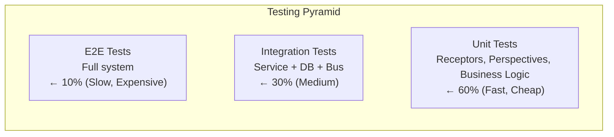

# Testing Strategy

Build a **comprehensive testing strategy** for the ECommerce system covering unit tests, integration tests, test fixtures, and mocking patterns — using **TUnit** and completion-signal-based waiting (never `Task.Delay` polling).

:::note
This is **Part 8** of the ECommerce Tutorial. Complete [Analytics Service](analytics-service.md) first.
:::

---

## Testing Pyramid



---

## Unit Tests

### Testing Receptors

Receptors take `IDispatcher` + `ILogger` — no database mocking needed. Use a recording `TestDispatcher` and `NullLogger`.

**tests/ECommerce.OrderService.Tests/CreateOrderReceptorTests.cs** (condensed):

```csharp{title="Testing Receptors" description="**ECommerce." category="Example" difficulty="ADVANCED" tags=["Learn", "Tutorial", "Testing", "Receptors"]}
using ECommerce.Contracts.Commands;
using ECommerce.Contracts.Events;
using ECommerce.OrderService.API.Receptors;
using Microsoft.Extensions.Logging.Abstractions;
using Whizbang.Core;
using Whizbang.Core.Observability;
using Whizbang.Core.ValueObjects;

namespace ECommerce.OrderService.Tests;

public class CreateOrderReceptorTests {
  /// <summary>
  /// Test double for IDispatcher that records published messages.
  /// (Implements the remaining IDispatcher members as NotImplementedException —
  /// see the sample file for the full implementation.)
  /// </summary>
  private class TestDispatcher : IDispatcher {
    public List<object> PublishedMessages { get; } = [];
    public int PublishCount => PublishedMessages.Count;

    public Task<IDeliveryReceipt> PublishAsync<TEvent>(TEvent @event) {
      PublishedMessages.Add(@event!);
      return Task.FromResult<IDeliveryReceipt>(DeliveryReceipt.Delivered(MessageId.New(), "test"));
    }

    // ... remaining IDispatcher members throw NotImplementedException
  }

  [Test]
  public async Task CreateOrderReceptor_ValidOrder_PublishesEventAsync() {
    // Arrange
    var dispatcher = new TestDispatcher();
    var logger = NullLogger<CreateOrderReceptor>.Instance;
    var receptor = new CreateOrderReceptor(dispatcher, logger);

    var command = new CreateOrderCommand {
      OrderId = OrderId.New(),
      CustomerId = CustomerId.New(),
      LineItems = [
        new OrderLineItem {
          ProductId = ProductId.New(),
          ProductName = "Widget",
          Quantity = 2,
          UnitPrice = 19.99m
        }
      ],
      TotalAmount = 39.98m
    };

    // Act
    var result = await receptor.HandleAsync(command);

    // Assert
    await Assert.That(result.OrderId).IsEqualTo(command.OrderId);
    await Assert.That(result.TotalAmount).IsEqualTo(39.98m);
    await Assert.That(dispatcher.PublishCount).IsEqualTo(1);
    await Assert.That(dispatcher.PublishedMessages[0]).IsTypeOf<OrderCreatedEvent>();
  }

  [Test]
  public async Task CreateOrderReceptor_EmptyLineItems_ThrowsInvalidOperationExceptionAsync() {
    // Arrange
    var dispatcher = new TestDispatcher();
    var receptor = new CreateOrderReceptor(dispatcher, NullLogger<CreateOrderReceptor>.Instance);

    var command = new CreateOrderCommand {
      OrderId = OrderId.New(),
      CustomerId = CustomerId.New(),
      LineItems = [],  // Empty list
      TotalAmount = 39.98m
    };

    // Act & Assert
    await Assert.That(async () => await receptor.HandleAsync(command))
      .Throws<InvalidOperationException>()
      .WithMessage("Order must contain at least one item");
  }
}
```

### Testing Perspectives

Perspectives are **pure functions** — no mocks at all. Call `Apply` with a model and an event, assert on the returned model:

```csharp{title="Testing Perspectives" description="**ECommerce." category="Example" difficulty="INTERMEDIATE" tags=["Learn", "Tutorial", "Testing", "Perspectives"]}
using ECommerce.Contracts.Events;
using ECommerce.Contracts.Lenses;
using ECommerce.InventoryWorker.Perspectives;

public class InventoryLevelsPerspectiveTests {
  [Test]
  public async Task Apply_InventoryReserved_IncrementsReservedAsync() {
    // Arrange - pure function, no dependencies
    var perspective = new InventoryLevelsPerspective();
    var current = new InventoryLevelDto {
      ProductId = TrackedGuid.NewMedo().Value,  // time-ordered UUIDv7
      Quantity = 100,
      Reserved = 0,
      Available = 100,
      LastUpdated = DateTime.UtcNow
    };
    var @event = new InventoryReservedEvent {
      OrderId = "order-123",
      ProductId = current.ProductId,
      Quantity = 2,
      ReservedAt = DateTime.UtcNow
    };

    // Act
    var updated = perspective.Apply(current, @event);

    // Assert
    await Assert.That(updated.Reserved).IsEqualTo(2);
    await Assert.That(updated.Available).IsEqualTo(98);
    await Assert.That(updated.Quantity).IsEqualTo(100);
  }

  [Test]
  public async Task Apply_InventoryReserved_NoExistingData_ReturnsNullAsync() {
    // Arrange
    var perspective = new InventoryLevelsPerspective();
    var @event = new InventoryReservedEvent {
      OrderId = "order-123",
      ProductId = TrackedGuid.NewMedo().Value,  // time-ordered UUIDv7
      Quantity = 2,
      ReservedAt = DateTime.UtcNow
    };

    // Act - reserving against unknown product is skipped
    var updated = perspective.Apply(null!, @event);

    // Assert
    await Assert.That(updated).IsNull();
  }
}
```

See **tests/ECommerce.BFF.API.Tests/PerspectiveModelsTests.cs** for the sample's perspective model tests.

---

## Integration Tests

### Completion Signals, Not Delays

:::warning
**Never use `Task.Delay` or polling loops to wait for eventual consistency in tests.** Flaky on slow CI, slow on fast machines. The ECommerce fixtures expose first-class completion hooks — `TaskCompletionSource` wired to worker events — so tests wait for *exactly* the work they triggered.
:::

The fixture pattern (from **tests/ECommerce.RabbitMQ.Integration.Tests/Fixtures/RabbitMqIntegrationFixture.cs**):

```csharp{title="Completion Signal Helper" description="Completion-signal helper from the sample fixture" category="Example" difficulty="ADVANCED" tags=["Learn", "Tutorial", "Testing", "Signals"]}
/// <summary>
/// Waits until the PerspectiveWorker has applied the expected number of events.
/// Uses the worker's OnPerspectiveEventProcessed hook + TaskCompletionSource —
/// no polling, no Task.Delay.
/// </summary>
public async Task WaitForPerspectiveProcessingAsync(
    int expectedCompletions,
    int timeoutMilliseconds = 30000,
    string? hostFilter = null,
    Guid? streamId = null) {

  var eventCount = 0;
  var tcs = new TaskCompletionSource<bool>(TaskCreationOptions.RunContinuationsAsynchronously);

  void handler(PerspectiveEventProcessedEvent e) {
    // Optional stream-id filter eliminates cross-test contamination
    if (streamId.HasValue && e.StreamId != streamId.Value) {
      return;
    }
    var current = Interlocked.Add(ref eventCount, e.EventCount);
    if (current >= expectedCompletions) {
      tcs.TrySetResult(true);
    }
  }

  perspectiveWorker.OnPerspectiveEventProcessed += handler;

  await tcs.Task.WaitAsync(TimeSpan.FromMilliseconds(timeoutMilliseconds));
}
```

Whizbang workers expose these hooks as first-class API (useful in production observability too, not just tests).

### Workflow Test

**tests/ECommerce.RabbitMQ.Integration.Tests/Workflows/CreateProductWorkflowTests.cs** (condensed):

```csharp{title="Testing Event Flow" description="**ECommerce." category="Example" difficulty="ADVANCED" tags=["Learn", "Tutorial", "Testing", "Event"]}
using ECommerce.Contracts.Commands;
using ECommerce.RabbitMQ.Integration.Tests.Fixtures;
using Medo;

[Category("Integration")]
[NotInParallel("RabbitMQ")]
public class CreateProductWorkflowTests {
  private static RabbitMqIntegrationFixture? _fixture;

  [Before(Test)]
  public async Task SetupAsync() {
    _fixture = await SharedRabbitMqFixtureSource.GetFixtureAsync();
    await _fixture.CleanupDatabaseAsync();
  }

  [Test]
  [Timeout(120000)]
  public async Task CreateProduct_PublishesEvent_MaterializesInBothPerspectivesAsync(CancellationToken cancellationToken) {
    // Arrange
    var fixture = _fixture ?? throw new InvalidOperationException("Fixture not initialized");

    var command = new CreateProductCommand {
      ProductId = ProductId.From(Uuid7.NewUuid7().ToGuid()),
      Name = "Integration Test Product",
      Description = "A test product for integration testing",
      Price = 99.99m,
      ImageUrl = "/images/test-product.png",
      InitialStock = 50
    };

    // Act - register the completion signal BEFORE sending the command
    var perspectiveTask = fixture.WaitForPerspectiveProcessingAsync(
      expectedCompletions: 4, timeoutMilliseconds: 90000);

    await fixture.Dispatcher.SendAsync(command);

    await perspectiveTask;                    // wait for perspectives (signal-based)
    await fixture.WaitForWorkersIdleAsync();  // ensure DB commits are flushed

    // Assert - query the read model via lenses
    var product = await fixture.InventoryProductLens.GetByIdAsync(command.ProductId.Value);
    await Assert.That(product).IsNotNull();
    await Assert.That(product!.Name).IsEqualTo(command.Name);

    var inventory = await fixture.InventoryLens.GetByProductIdAsync(command.ProductId.Value);
    await Assert.That(inventory!.Quantity).IsEqualTo(command.InitialStock);
  }
}
```

**Key elements**:
- ✅ Shared fixture spins up real hosts (worker + BFF) against per-test PostgreSQL databases and a shared broker container
- ✅ `WaitForPerspectiveProcessingAsync` — completion signal registered **before** the command is sent
- ✅ `WaitForWorkersIdleAsync` — worker-idle signal, not a sleep
- ✅ Assertions go through **lenses** (the same read path production uses)
- ✅ `Uuid7.NewUuid7()` for time-ordered test IDs (never `Guid.NewGuid()` for Whizbang ids)

### Transport Matrix

The sample runs the same workflow suites against multiple transports:

| Test project | Transport | Purpose |
|---|---|---|
| `ECommerce.InMemory.Integration.Tests` | In-memory | Fast feedback, no containers |
| `ECommerce.RabbitMQ.Integration.Tests` | RabbitMQ container | Real broker semantics |
| `ECommerce.AzureServiceBus.Integration.Tests` | ASB emulator | Production transport parity |
| `ECommerce.Lifecycle.Integration.Tests` | RabbitMQ | Lifecycle stage ordering (PostAllPerspectives etc.) |

---

## Test Fixtures & Data

Use **Bogus** for realistic test data, adapted to the real contract shapes:

```csharp{title="Test Fixtures" description="**ECommerce." category="Example" difficulty="INTERMEDIATE" tags=["Learn", "Tutorial", "Test", "Fixtures"]}
using Bogus;
using ECommerce.Contracts.Commands;

public static class OrderFixture {
  private static readonly Faker _faker = new();

  public static CreateOrderCommand GenerateCreateOrderCommand() {
    var lineItems = Enumerable.Range(0, _faker.Random.Int(1, 5))
      .Select(_ => new OrderLineItem {
        ProductId = ProductId.New(),
        ProductName = _faker.Commerce.ProductName(),
        Quantity = _faker.Random.Int(1, 10),
        UnitPrice = _faker.Finance.Amount(5, 100)
      })
      .ToList();

    return new CreateOrderCommand {
      OrderId = OrderId.New(),
      CustomerId = CustomerId.New(),
      LineItems = lineItems,
      TotalAmount = lineItems.Sum(i => i.Quantity * i.UnitPrice)
    };
  }
}
```

**Usage**:

```csharp{title="Test Fixtures (2)" description="Test Fixtures" category="Example" difficulty="INTERMEDIATE" tags=["Learn", "Tutorial", "Test", "Fixtures"]}
[Test]
public async Task SomeTest_WithRandomData_WorksCorrectlyAsync() {
  // Arrange
  var command = OrderFixture.GenerateCreateOrderCommand();

  // Act
  var result = await receptor.HandleAsync(command);

  // Assert
  await Assert.That(result).IsNotNull();
}
```

---

## Mocking External Services

Keep gateways behind interfaces (see [Payment Processing](payment-processing.md)) so unit tests stay deterministic:

```csharp{title="Mocking External Services" description="**ECommerce." category="Example" difficulty="ADVANCED" tags=["Learn", "Tutorial", "Mocking", "External"]}
using ECommerce.PaymentWorker.Services;

public class MockPaymentGateway : IPaymentGateway {
  private readonly Queue<PaymentResult> _results = new();

  public void SetupSuccessfulCharge(string transactionId) =>
    _results.Enqueue(new PaymentResult(true, transactionId, null, null));

  public void SetupFailedCharge(string errorCode, string errorMessage) =>
    _results.Enqueue(new PaymentResult(false, null, errorCode, errorMessage));

  public Task<PaymentResult> ChargeAsync(
    string idempotencyKey,
    decimal amount,
    string currency,
    string paymentMethod,
    CancellationToken ct = default
  ) {
    if (_results.Count == 0) {
      throw new InvalidOperationException("No payment results configured");
    }
    return Task.FromResult(_results.Dequeue());
  }

  public Task<RefundResult> RefundAsync(
    string transactionId,
    decimal amount,
    CancellationToken ct = default
  ) {
    return Task.FromResult(new RefundResult(true, $"REF-{Guid.NewGuid():N}", null));
  }
}
```

For interface mocking beyond hand-rolled doubles, the library repo uses **Rocks** (source-generated mocks, AOT-compatible) — not reflection-based mocking frameworks.

---

## Test Coverage

### Running Tests with Coverage

TUnit projects are executables — run them directly:

```bash{title="Running Tests with Coverage" description="Running Tests with Coverage" category="Example" difficulty="BEGINNER" tags=["Learn", "Tutorial", "Running", "Tests"]}
cd tests/ECommerce.OrderService.Tests
dotnet run -- --coverage --coverage-output-format cobertura --coverage-output coverage.xml
```

### Coverage Targets

| Component | Target | Rationale |
|-----------|--------|-----------|
| **Receptors** | 90%+ | Core business logic |
| **Perspectives** | 90%+ | Pure functions — cheap to cover fully |
| **Endpoints** | 70%+ | HTTP API mapping |
| **Services** | 80%+ | Infrastructure code |

---

## Key Takeaways

✅ **Testing Pyramid** - 60% unit, 30% integration, 10% e2e
✅ **Completion Signals** - `TaskCompletionSource` + worker hooks; NEVER `Task.Delay`/polling
✅ **Pure Perspective Tests** - `Apply(model, event)` in, model out — zero mocks
✅ **Recording TestDispatcher** - assert on published events without infrastructure
✅ **Transport Matrix** - same workflows against in-memory, RabbitMQ, and ASB
✅ **Bogus + UUIDv7** - realistic data, time-ordered ids

---

## Next Steps

Continue to **[Deployment](deployment.md)** to:
- Deploy to Azure Kubernetes Service (AKS)
- Configure CI/CD pipelines
- Set up monitoring and alerting
- Implement blue-green deployments

---

*Version 1.0.0 - Foundation Release | Last Updated: 2026-07-16*
