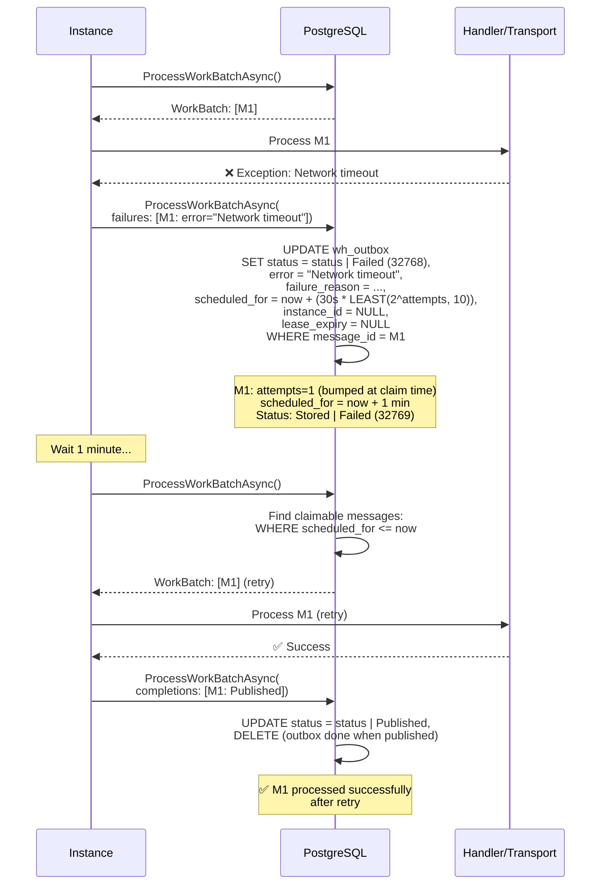
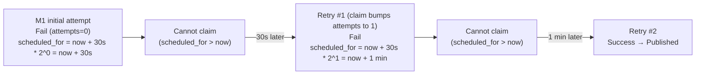
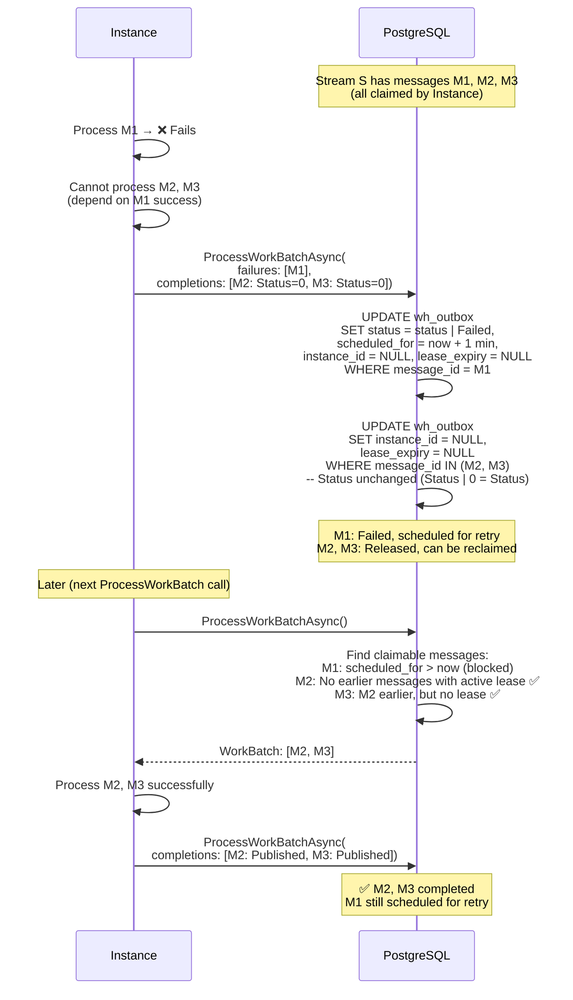

# Failure Handling

## Overview

Whizbang implements sophisticated failure handling mechanisms including exponential backoff retry scheduling, stream-based failure cascades, and poison message detection. This document details how failures are tracked, scheduled for retry, and how they impact stream processing.

## Core Concepts

### Message Processing Status

Messages track their processing state using bitwise flags in the `status` column:

```csharp{title="Message Processing Status" description="Messages track their processing state using bitwise flags in the status column:" category="Architecture" difficulty="BEGINNER" tags=["Messaging", "C#", "Message", "Processing", "Status"]}
[Flags]
public enum MessageProcessingStatus {
    None = 0,           // No processing stages completed
    Stored = 1 << 0,    // Bit 0: Message persisted to inbox/outbox table
    EventStored = 1 << 1, // Bit 1: Event written to the event store (events only)
    Published = 1 << 2, // Bit 2: Message published to transport (outbox only)
    // Bits 3-14 reserved for future pipeline stages
    Failed = 1 << 15    // Bit 15 (32768): Processing failed at some stage
}
```

**Key Properties**:
- **Bitwise Flags**: Multiple states can coexist (e.g., `Stored | Failed = 32769`)
- **Status Progression**: `Stored → EventStored → Published` (outbox)
- **Failure Overlay**: `Failed` flag added via bitwise OR when message fails
- **Partial Completion**: `CompletedStatus` tracks what was accomplished before failure

### Failure Classification

```csharp{title="Failure Classification" description="Failure Classification" category="Architecture" difficulty="INTERMEDIATE" tags=["Messaging", "C#", "Failure", "Classification"]}
public enum MessageFailureReason {
    None = 0,                                  // No failure
    TransportNotReady = 1,                     // Transport not yet available
    TransportException = 2,                    // Transport threw during publish
    SerializationError = 3,                    // Cannot (de)serialize message
    ValidationError = 4,                       // Message validation failed
    MaxAttemptsExceeded = 5,                   // Exceeded retry limit (dead-lettered)
    LeaseExpired = 6,                          // Work lease expired mid-processing
    EventStorageFailure = 7,                   // Event store append failed
    Throttled = 8,                             // Broker throttled the publish
    SecurityContextEstablishmentFailure = 10,  // Could not establish security context
    EmptyStreamId = 11,                        // Event arrived with an empty stream id
    MessageBodyTooLarge = 12,                  // Body exceeds transport limits
    BodyClaimProviderUnknown = 13,             // Offloaded-body claim provider unknown
    BodyClaimIntegrityFailure = 14,            // Offloaded-body integrity check failed
    CompositeInnerEventLimitExceeded = 15,     // Composite exceeded inner-event cap
    CompositeExpansionFailure = 16,            // Composite fan-out failed
    Unknown = 99                               // Default (not classified)
}
```

**Purpose**:
- Enable typed filtering (e.g., "retry only TransportUnavailable failures")
- Support different retry strategies per failure type
- Metrics and monitoring (failure classification dashboards)

### Retry Scheduling

**Exponential Backoff Formula** (from `process_outbox_failures` / `process_inbox_failures`):
```
scheduled_for = now + (30 seconds * LEAST(POWER(2, LEAST(attempts, 10)), 10))

Base interval: 30 seconds, multiplier capped at 10 (5-minute ceiling)
Attempts at failure time:
- 0: 30s * 2^0 = 30 seconds
- 1: 30s * 2^1 = 1 minute
- 2: 30s * 2^2 = 2 minutes
- 3: 30s * 2^3 = 4 minutes
- 4+: capped at 30s * 10 = 5 minutes
```

Note: the failure functions record the error and release the lease but do **not** increment `attempts` — attempt counting happens solely at claim time (`claim_orphaned_outbox` / `claim_orphaned_inbox` set `attempts = attempts + 1`), so each claim-process-fail cycle counts exactly once.

## Failure Processing Flow {#failure-flow}

### Basic Failure and Retry



### Retry Schedule Timeline



## Stream-Based Failure Cascades {#failure-cascade}

### Problem: Blocking Entire Stream

When message M1 in stream S fails, what happens to messages M2, M3, M4 that come after it?

**Options**:
1. **Block all**: M2, M3, M4 stuck until M1 succeeds (could wait forever)
2. **Continue**: Process M2, M3, M4 anyway (violates stream ordering)
3. **Cascade release**: Allow releasing M2, M3, M4 to unblock stream

**Whizbang's Approach**: Cascade release with explicit control

### Status=0 Release Pattern

**Mechanism**: Completing a message with `Status = 0` clears its lease without changing status flags, allowing it to be reprocessed.

```csharp{title="Status=0 Release Pattern" description="Mechanism: Completing a message with Status = 0 clears its lease without changing status flags, allowing it to be" category="Architecture" difficulty="INTERMEDIATE" tags=["Messaging", "C#", "Status=0", "Release", "Pattern"]}
// Release messages M2, M3 (let them be retried)
await coordinator.ProcessWorkBatchAsync(new ProcessWorkBatchRequest {
    // ... instance identity fields + other required arrays (empty) elided ...
    OutboxCompletions = [
        new MessageCompletion { MessageId = message2Id, Status = MessageProcessingStatus.None },  // Release
        new MessageCompletion { MessageId = message3Id, Status = MessageProcessingStatus.None }   // Release
    ],
    OutboxFailures = [
        new MessageFailure {
            MessageId = message1Id,
            CompletedStatus = MessageProcessingStatus.Stored,
            Error = "Processing failed",
            Reason = MessageFailureReason.TransportException
        }
    ]
});
```

**Effect**:
- M1: Marked as failed, scheduled for retry
- M2, M3: Leases cleared (`instance_id = NULL`, `lease_expiry = NULL`)
- M2, M3: Status unchanged (still `Stored`)
- M2, M3: Can be reclaimed by any instance

### Cascade Release Sequence Diagram



### Cascade Decision Matrix

| M1 State | M2 Lease Cleared? | M2 Claimable? | Ordering Impact |
|---|---|---|---|
| Failed, scheduled | No | ❌ Blocked | M2 waits for M1 retry |
| Failed, scheduled | Yes (Status=0) | ✅ Can claim | Stream continues without M1 |
| Failed, not scheduled | Yes | ✅ Can claim | Stream continues (M1 poisoned?) |
| Processing (active lease) | N/A | ❌ Blocked | Normal stream ordering |
| Completed | N/A | ✅ Can claim | Normal progression |

### Use Cases for Cascade Release

**1. Independent Events**:
```
M1: CustomerCreated (fails due to validation)
M2: CustomerAddressUpdated (can proceed without M1)
M3: CustomerEmailUpdated (can proceed without M1)

→ Release M2, M3 to continue processing
```

**2. Retry Later Strategy**:
```
M1: SendEmail (fails due to SMTP unavailable)
M2: LogEmailSent (depends on M1)
M3: UpdateCustomerPreferences (independent)

→ Release M3, keep M2 blocked
```

**3. Poison Message Handling**:
```
M1: ProcessLargeFile (exceeds memory, always fails)
M2, M3, M4: Other events (independent)

→ Mark M1 as poison (manual intervention)
→ Release M2, M3, M4 to continue stream
```

## Poison Message Detection {#poison-messages}

### What is a Poison Message?

**Definition**: A message that repeatedly fails processing and cannot succeed, blocking the queue.

**Characteristics**:
- High retry count (e.g., `attempts > 10`)
- Consistent failure reason (e.g., SerializationError)
- Blocks stream processing
- Requires manual intervention

### Detection Criteria

```sql{title="Detection Criteria" description="Detection Criteria" category="Architecture" difficulty="BEGINNER" tags=["Messaging", "Sql", "Detection", "Criteria"]}
-- Find potential poison messages
SELECT message_id, destination, message_type, attempts, error,
       failure_reason, scheduled_for, created_at
FROM wh_outbox
WHERE attempts >= 10  -- High retry count
  AND (status & 32768) = 32768  -- Failed flag set
  AND scheduled_for IS NOT NULL  -- Still scheduled for retry
ORDER BY attempts DESC, created_at ASC;
```

### Built-In Dead-Letter Promotion

Whizbang ships a first-class internal dead-letter queue (the `wh_dead_letters` table, written via `IDeadLetterStore`). Three internal paths promote rows whose `attempts` exceed a configurable cap — each cap defaults to **10**:

| Path | Worker | Option (default) |
|---|---|---|
| Inbox dispatch | `InboxDispatchWorker` | `InboxDispatchWorkerOptions.MaxInboxAttempts = 10` |
| Outbox publish | `OutboxPublishWorker` / `OutboxDrainWorker` | `MaxOutboxAttempts = 10` |
| Perspective apply | `PerspectiveWorker` (pre-apply filter) | `PerspectiveWorkerOptions.MaxPerspectiveEventAttempts = 10` |

When the cap is exceeded, the row is moved to `wh_dead_letters` with `MessageFailureReason.MaxAttemptsExceeded` (preserving the last real error text as the forensic snapshot) and deleted from its work table, unblocking the stream. Setting an option to `null` restores infinite-retry behavior. See the Dead Letter Queue operations pages for recovery flows.

### Additional Handling Strategies

**1. Manual Intervention**:
- Set `scheduled_for = NULL` (prevents retry)
- Alert operations team
- Release downstream messages (Status=0)

**2. Circuit Breaker**:
- Detect repeated failures of same type
- Temporarily stop processing that message type
- Alert and investigate root cause

## Partial Completion Tracking {#partial-completion}

### CompletedStatus Field

When a message fails, it may have completed some steps before failing. The `CompletedStatus` field tracks what was accomplished.

```csharp{title="CompletedStatus Field" description="When a message fails, it may have completed some steps before failing." category="Architecture" difficulty="BEGINNER" tags=["Messaging", "C#", "CompletedStatus", "Field"]}
public record MessageFailure {
    public required Guid MessageId { get; init; }
    public required MessageProcessingStatus CompletedStatus { get; init; }
    public required string Error { get; init; }
    public MessageFailureReason Reason { get; init; } = MessageFailureReason.Unknown;
}
```

**Example**:
```csharp{title="CompletedStatus Field (2)" description="CompletedStatus Field" category="Architecture" difficulty="INTERMEDIATE" tags=["Messaging", "C#", "CompletedStatus", "Field"]}
// Message M1: Store to DB ✅, Store to Event Store ✅, Publish to Transport ❌
await coordinator.ProcessWorkBatchAsync(
    outboxFailures: [
        new MessageFailure {
            MessageId = message1Id,
            CompletedStatus = MessageProcessingStatus.Stored | MessageProcessingStatus.EventStored,
            Error = "Transport unavailable"
        }
    ]
);

// Result:
// status = (Stored | EventStored) | (Stored | EventStored) | Failed
//        = Stored | EventStored | Failed
```

### SQL Update Logic

```sql{title="SQL Update Logic" description="SQL Update Logic (from 017_ProcessOutboxFailures.sql)" category="Architecture" difficulty="BEGINNER" tags=["Messaging", "Sql", "SQL", "Update", "Logic"]}
UPDATE wh_outbox o
SET status = o.status | v_failure.status_flags | 32768,  -- Add completed flags + Failed flag
    error = v_failure.error_message,
    failure_reason = COALESCE(v_failure.failure_reason, 0),
    -- Exponential backoff: 30s * 2^attempts, capped at 5 minutes
    scheduled_for = p_now + (INTERVAL '30 seconds' * LEAST(POWER(2, LEAST(o.attempts, 10)), 10)),
    instance_id = NULL,
    lease_expiry = NULL
WHERE o.message_id = v_failure.msg_id;
-- Note: attempts is NOT incremented here; claim_orphaned_outbox is the
-- sole source of attempt counting.
```

**Rationale**:
- Avoid re-executing already completed steps on retry
- Idempotency: Bitwise OR ensures flags only add, never remove
- Resume from failure point

## Failure Metrics and Monitoring

### Key Metrics to Track

**1. Retry Count Distribution**:
```sql{title="Key Metrics to Track" description="Key Metrics to Track" category="Architecture" difficulty="BEGINNER" tags=["Messaging", "Sql", "Key", "Metrics", "Track"]}
SELECT attempts, COUNT(*) as message_count
FROM wh_outbox
WHERE (status & 32768) = 32768  -- Failed messages
GROUP BY attempts
ORDER BY attempts;
```

**2. Failure Reasons**:
```sql{title="Key Metrics to Track (2)" description="Key Metrics to Track" category="Architecture" difficulty="BEGINNER" tags=["Messaging", "Sql", "Key", "Metrics", "Track"]}
SELECT failure_reason, COUNT(*) as count
FROM wh_outbox
WHERE (status & 32768) = 32768
GROUP BY failure_reason
ORDER BY count DESC;
```

**3. Scheduled Retry Backlog**:
```sql{title="Key Metrics to Track (3)" description="Key Metrics to Track" category="Architecture" difficulty="BEGINNER" tags=["Messaging", "Sql", "Key", "Metrics", "Track"]}
SELECT COUNT(*) as scheduled_count,
       MIN(scheduled_for) as next_retry,
       MAX(scheduled_for) as latest_retry
FROM wh_outbox
WHERE scheduled_for IS NOT NULL
  AND scheduled_for > NOW();
```

**4. Poison Message Candidates**:
```sql{title="Key Metrics to Track (4)" description="Key Metrics to Track" category="Architecture" difficulty="BEGINNER" tags=["Messaging", "Sql", "Key", "Metrics", "Track"]}
SELECT COUNT(*) as poison_candidates
FROM wh_outbox
WHERE attempts >= 10
  AND (status & 32768) = 32768;
```

## Configuration and Tuning

### Retry Configuration

**Base Interval** (fixed at 30 seconds in the SQL failure functions):
- The `30s * 2^attempts` schedule is baked into `process_outbox_failures` / `process_inbox_failures`.

**Backoff Cap** (built-in, 5 minutes):
- The multiplier is capped at 10 (`LEAST(POWER(2, LEAST(attempts, 10)), 10)`), so no retry waits longer than 5 minutes.

**Max Attempts** (worker options, default 10):
- `MaxInboxAttempts`, `MaxOutboxAttempts`, and `MaxPerspectiveEventAttempts` each default to 10; exceeding the cap promotes the row to `wh_dead_letters`.
- Low (5-10): Quick dead-letter promotion
- High (20+): Aggressive retry (long outages)
- `null`: Infinite retry (legacy behavior)

### Stream Ordering vs. Availability

**Trade-off**:
- **Strict Ordering**: Block stream on failure (wait for M1 to succeed)
- **High Availability**: Release downstream messages (allow M2, M3 to proceed)

**Decision Matrix**:

| Scenario | Strategy | Rationale |
|---|---|---|
| Financial transactions | Strict ordering | Cannot process M2 without M1 |
| Audit logs | Strict ordering | Preserve temporal order |
| Notifications | High availability | Independent messages, release OK |
| Analytics events | High availability | Eventually consistent, release OK |

## Troubleshooting

### Problem: Message Stuck in Retry Loop

**Symptoms**:
- Message has high `attempts` count
- `scheduled_for` keeps advancing
- Never succeeds

**Diagnostic Steps**:
1. Check error message:
   ```sql
   SELECT message_id, attempts, error, scheduled_for
   FROM wh_outbox
   WHERE message_id = '<stuck_message_id>';
   ```

2. Check failure reason classification:
   ```sql
   SELECT failure_reason FROM wh_outbox WHERE message_id = '<stuck_message_id>';
   ```

3. Inspect message data:
   ```sql
   SELECT event_data FROM wh_outbox WHERE message_id = '<stuck_message_id>';
   ```

**Common Causes**:
- Malformed message (SerializationError)
- Validation failure (will never pass)
- External dependency permanently unavailable
- Message too large (always exceeds limits)

**Solutions**:
- Move to dead letter queue
- Fix underlying issue and reset `attempts = 0`
- Release downstream messages (Status=0 cascade)

### Problem: Stream Completely Blocked

**Symptoms**:
- No messages in stream are processing
- All messages have `scheduled_for` in future
- Backlog growing

**Diagnostic Steps**:
1. Find blocking message:
   ```sql
   SELECT message_id, created_at, attempts, scheduled_for
   FROM wh_outbox
   WHERE stream_id = '<blocked_stream_id>'
   ORDER BY created_at ASC
   LIMIT 1;
   ```

2. Check if it's a poison message:
   ```sql
   SELECT attempts FROM wh_outbox WHERE message_id = '<blocking_message_id>';
   ```

**Solutions**:
- Release blocking message to dead letter queue
- Reset `scheduled_for = NOW()` to trigger immediate retry
- Cascade release downstream messages (Status=0)

## Related Documentation

- [Work Coordination](work-coordination.md) - Overview and architecture
- [Multi-Instance Coordination](multi-instance-coordination.md) - Cross-instance scenarios
- [Idempotency Patterns](idempotency-patterns.md) - Deduplication strategies
- [Outbox Pattern](outbox-pattern.md) - Transactional outbox implementation
- [Inbox Pattern](inbox-pattern.md) - Deduplication and handler invocation

## Implementation

### PostgreSQL Functions

The retry/failure machinery is split across per-concern migration functions (all called from `process_work_batch`, migration `029_ProcessWorkBatch.sql`):

- `017_ProcessOutboxFailures.sql` — `process_outbox_failures`: Failed flag, error text, failure_reason, exponential backoff
- `018_ProcessInboxFailures.sql` — `process_inbox_failures`: inbox-side equivalent
- `024_ClaimOrphanedOutbox.sql` / `025_ClaimOrphanedInbox.sql` — attempt counting (`attempts = attempts + 1` at claim time)
- `050_WhDeadLetters.sql` / `051_DeadLetterRecovery.sql` — internal dead-letter table + recovery functions

### C# Records

See: `src/Whizbang.Core/Messaging/IWorkCoordinator.cs` (the `MessageFailure` and `MessageCompletion` records live alongside the coordinator interface)

```csharp{title="C# Records" description="MessageFailure record from IWorkCoordinator.cs" category="Architecture" difficulty="BEGINNER" tags=["Messaging", "Records"]}
public record MessageFailure {
    public required Guid MessageId { get; init; }
    public required MessageProcessingStatus CompletedStatus { get; init; }
    public required string Error { get; init; }
    public MessageFailureReason Reason { get; init; } = MessageFailureReason.Unknown;
}
```

### Tests

- `tests/Whizbang.Data.Dapper.Postgres.Tests/PostgresFunctionTests.cs` — `ProcessOutboxFailures_SetsFailureFlagsAndSchedulesRetryAsync` and related SQL-function tests
- `tests/Whizbang.Core.Tests/Messaging/MessageFailureTests.cs` — failure record + reason classification
- `tests/Whizbang.Core.Tests/Workers/OutboxPublishWorkerDlqPromotionTests.cs` — outbox max-attempts dead-letter promotion
- `tests/Whizbang.Core.Tests/Workers/PerspectiveWorkerDeadLetterFilterTests.cs` — perspective pre-apply dead-letter filter
