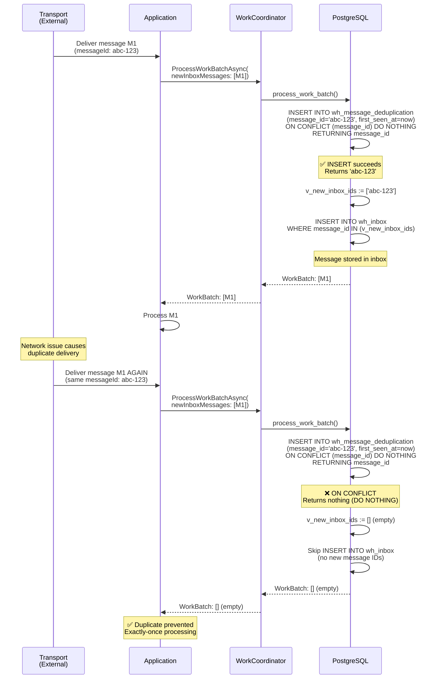
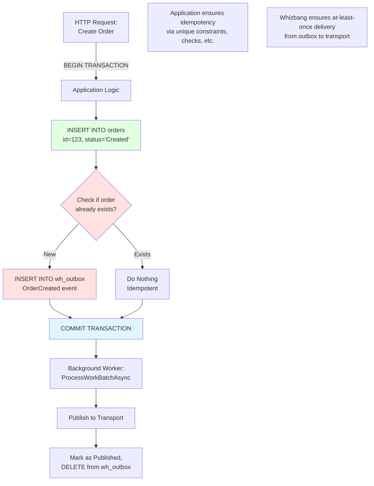
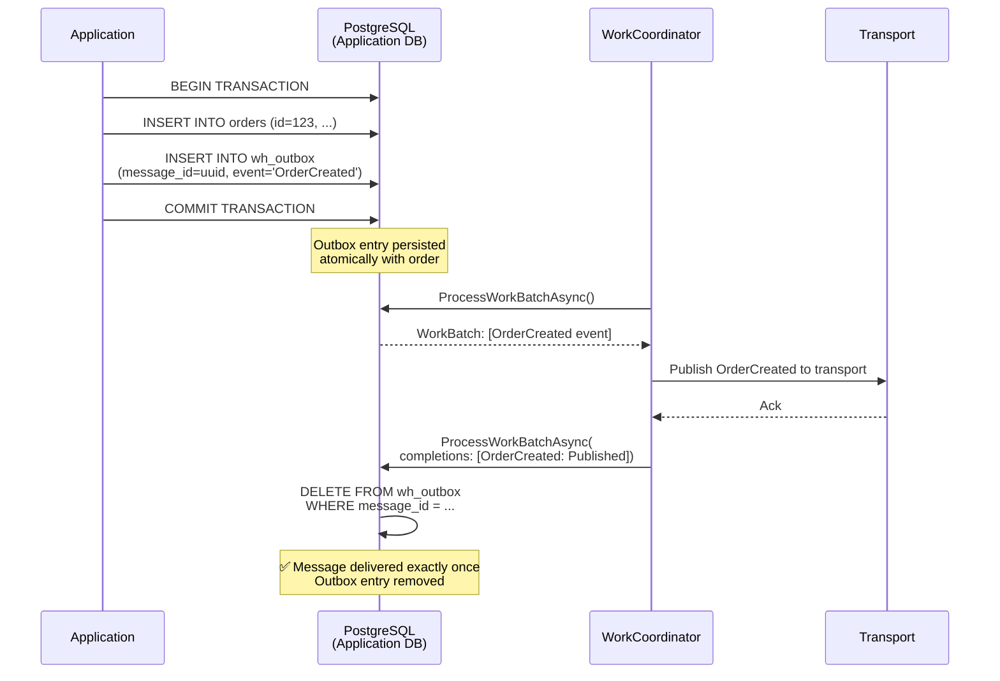

# Idempotency Patterns

## Overview

Idempotency ensures that processing the same message multiple times produces the same result as processing it once. Whizbang implements different idempotency strategies for inbox and outbox based on their roles in the system architecture.

## Core Concepts

### What is Idempotency?

**Definition**: An operation is idempotent if performing it multiple times has the same effect as performing it once.

**Why It Matters**:
- Message brokers often provide at-least-once delivery (duplicates possible)
- Network retries can cause duplicate message sends
- Distributed systems need to handle duplicate messages gracefully

**Example**:
- ✅ Idempotent: `SET balance = 100` (same result whether executed 1x or 10x)
- ❌ Not Idempotent: `SET balance = balance + 10` (different result each execution)

### Inbox vs. Outbox Strategies

| Aspect | Inbox | Outbox |
|---|---|---|
| **Deduplication** | Permanent table (wh_message_deduplication) | Transactional boundary responsibility |
| **Guarantee** | Exactly-once processing | At-least-once delivery |
| **Responsibility** | Whizbang framework | Application code |
| **Rationale** | Prevents duplicate external events | Part of application transaction |

## Inbox Idempotency {#inbox-idempotency}

### Strategy: Permanent Deduplication Table

**Mechanism**: The `wh_message_deduplication` table permanently tracks all inbox message IDs ever seen. Duplicate messages are rejected via `ON CONFLICT DO NOTHING`.

### Database Schema

```sql
CREATE TABLE wh_message_deduplication (
  message_id UUID PRIMARY KEY,
  first_seen_at TIMESTAMPTZ NOT NULL
);

-- Index for cleanup queries (if ever implemented)
CREATE INDEX idx_message_dedup_first_seen
  ON wh_message_deduplication(first_seen_at);
```

**Characteristics**:
- **Permanent**: Never deleted (grows over time)
- **Primary Key**: message_id ensures uniqueness
- **First Seen**: Tracks when message was first encountered
- **Cleanup**: Optional (could expire old entries if needed)

### Processing Flow



### Implementation Details

**PostgreSQL Function** (lines 348-404 in `014_CreateProcessWorkBatchFunction.sql`):

```sql
-- Store new inbox messages (with partition assignment and deduplication)
IF jsonb_array_length(p_new_inbox_messages) > 0 THEN
  -- First, record all message IDs in permanent deduplication table
  -- Only messages that are actually new will be returned
  WITH new_msgs AS (
    INSERT INTO wh_message_deduplication (message_id, first_seen_at)
    SELECT (elem->>'MessageId')::UUID, v_now
    FROM jsonb_array_elements(p_new_inbox_messages) as elem
    ON CONFLICT (message_id) DO NOTHING  -- ← Deduplication happens here
    RETURNING message_id
  )
  SELECT array_agg(message_id) INTO v_new_inbox_ids FROM new_msgs;

  -- Handle NULL case (no new messages, all were duplicates)
  v_new_inbox_ids := COALESCE(v_new_inbox_ids, '{}');

  -- Now insert only the truly new messages into inbox
  FOR v_new_msg IN
    SELECT ...
    FROM jsonb_array_elements(p_new_inbox_messages) as elem
    WHERE (elem->>'MessageId')::UUID = ANY(v_new_inbox_ids)  -- ← Only new IDs
  LOOP
    -- Insert into inbox...
  END LOOP;
END IF;
```

### Testing

**Test Case**: `ProcessWorkBatch_DuplicateInboxMessage_DeduplicationPreventsAsync`

**Scenario**:
1. Insert inbox message M1 with `message_id = abc-123`
2. Attempt to insert same message again with same `message_id`
3. Verify second insert is rejected
4. Verify only one record in `wh_inbox`

### Limitations and Trade-offs

**Advantages**:
- ✅ **Simple**: No complex logic, database constraint handles it
- ✅ **Reliable**: Primary key constraint is atomic and foolproof
- ✅ **Exactly-once**: Guaranteed single processing per message ID

**Disadvantages**:
- ❌ **Storage Growth**: Table grows indefinitely (one row per unique message ID)
- ❌ **Performance**: Index size grows over time (mitigated by UUIDs and btree)
- ❌ **No Expiration**: Old messages never removed (could implement cleanup)

**Mitigation Strategies**:
- Use UUIDv7 for time-ordered IDs (better index performance)
- Partition table by first_seen_at (if cleanup needed)
- Monitor table size and implement retention policy if needed

## Outbox Idempotency {#outbox-idempotency}

### Strategy: Transactional Boundary Responsibility

**Mechanism**: Outbox does NOT use a deduplication table. Duplicate prevention is the application's responsibility within its transaction boundary.

### Why No Deduplication?

**Rationale**:
1. **Transactional Outbox Pattern**: Outbox is part of the application's database transaction
2. **Application Control**: Application decides what messages to send
3. **Idempotent Commands**: Application should use idempotent command IDs
4. **Whizbang's Role**: Ensure at-least-once delivery (once in outbox → delivered to transport)

### Transactional Outbox Pattern



### Example: Idempotent Command Handler

```csharp
public async Task<Result> HandleCreateOrderAsync(CreateOrderCommand command) {
    // Start application transaction
    using var transaction = await _dbContext.Database.BeginTransactionAsync();

    // Check if order already exists (idempotency check)
    var existingOrder = await _dbContext.Orders
        .FirstOrDefaultAsync(o => o.Id == command.OrderId);

    if (existingOrder != null) {
        // Already processed - do nothing (idempotent)
        await transaction.CommitAsync();
        return Result.Success();
    }

    // Create new order
    var order = new Order {
        Id = command.OrderId,  // Deterministic ID (from command)
        CustomerId = command.CustomerId,
        Status = OrderStatus.Created
    };

    _dbContext.Orders.Add(order);

    // Publish OrderCreated event to outbox
    var orderCreatedEvent = new OrderCreatedEvent {
        OrderId = order.Id,
        CustomerId = order.CustomerId
    };

    await _dispatcher.PublishAsync(orderCreatedEvent);  // → Outbox

    // Commit application transaction (atomic)
    await _dbContext.SaveChangesAsync();
    await transaction.CommitAsync();

    return Result.Success();
}
```

**Key Points**:
- Command has deterministic ID (`command.OrderId`)
- Application checks for existing order before processing
- If order exists, do nothing (idempotent)
- Outbox insert happens within same transaction
- If transaction fails, both order AND outbox inserts roll back

### No Deduplication Table Needed

**Why?**:
- If the same command is executed twice:
  - First execution: Creates order + outbox entry → COMMIT
  - Second execution: Finds existing order → Do nothing → COMMIT (no outbox entry)
- Outbox only has one entry (from first execution)
- If application logic fails to check for duplicates, that's an application bug, not a framework responsibility

### Outbox Processing Flow



### Testing

**Test Case**: `ProcessWorkBatch_OutboxNoDuplication_TransactionalBoundaryAsync`

**Scenario**:
1. Application transaction creates order + outbox entry
2. Same command executed again (simulating duplicate request)
3. Verify application logic prevents duplicate order
4. Verify only ONE outbox entry created

## Comparison Matrix

| Aspect | Inbox Deduplication | Outbox Transactional |
|---|---|---|
| **Mechanism** | Permanent deduplication table | Application transaction control |
| **Guarantee** | Exactly-once processing | At-least-once delivery |
| **Responsibility** | Whizbang framework | Application code |
| **Storage** | One row per unique message ID (permanent) | No deduplication table |
| **Performance** | Index lookup on every message | No overhead |
| **Complexity** | Simple (database constraint) | Requires application design |
| **Use Case** | External events (from transports) | Internal events (from application) |

## Best Practices

### Inbox Best Practices

**1. Use Deterministic Message IDs**:
```csharp
// ✅ Good: Deterministic ID based on event content
var messageId = Uuid7.FromName(
    namespaceId: Uuid7.NamespaceOID,
    name: $"OrderCreated-{orderId}"
);

// ❌ Bad: Random ID (loses idempotency)
var messageId = Uuid7.NewUuid7();  // Different every time
```

**2. Include Correlation/Causation IDs**:
- Even with deduplication, include correlation and causation IDs
- Enables tracing and debugging
- Helps identify duplicate sources

**3. Monitor Deduplication Table Size**:
```sql
SELECT COUNT(*) FROM wh_message_deduplication;
SELECT pg_total_relation_size('wh_message_deduplication');
```

**4. Consider Retention Policy** (optional):
```sql
-- Delete deduplication records older than 90 days (if needed)
DELETE FROM wh_message_deduplication
WHERE first_seen_at < NOW() - INTERVAL '90 days';
```

### Outbox Best Practices

**1. Use Deterministic Command IDs**:
```csharp
public class CreateOrderCommand {
    public Guid OrderId { get; init; }  // Deterministic, from client
    // ... other properties
}

// Client generates ID
var command = new CreateOrderCommand {
    OrderId = Uuid7.NewUuid7(),  // Generated once, by client
    // ...
};

// Retry with same ID
await httpClient.PostAsync("/orders", command);  // Same OrderId
```

**2. Implement Idempotency Checks**:
```csharp
// Always check if entity already exists
var existing = await _dbContext.Orders
    .FirstOrDefaultAsync(o => o.Id == command.OrderId);

if (existing != null) {
    return Result.Success();  // Already processed
}
```

**3. Use Unique Constraints**:
```csharp
modelBuilder.Entity<Order>(entity => {
    entity.HasKey(e => e.Id);

    // Additional unique constraints for idempotency
    entity.HasIndex(e => new { e.CustomerId, e.OrderNumber })
          .IsUnique();  // Prevent duplicate order numbers
});
```

**4. Transaction Scope**:
```csharp
// Ensure outbox is in same transaction as business logic
using var transaction = await _dbContext.Database.BeginTransactionAsync();

// Business logic
// ...

// Outbox (same transaction)
await _dispatcher.PublishAsync(evt);

await _dbContext.SaveChangesAsync();
await transaction.CommitAsync();  // Atomic
```

## Troubleshooting

### Inbox: Duplicate Messages Still Processing

**Symptoms**:
- Same message processed multiple times
- Duplicate handler invocations
- Data inconsistencies

**Diagnostic Steps**:
1. Check if message IDs are actually unique:
   ```sql
   SELECT message_id, COUNT(*)
   FROM wh_message_deduplication
   GROUP BY message_id
   HAVING COUNT(*) > 1;
   ```

2. Verify deduplication table exists and has primary key:
   ```sql
   \d wh_message_deduplication
   ```

3. Check if messages have NULL message_id:
   ```sql
   SELECT * FROM wh_inbox WHERE message_id IS NULL;
   ```

**Common Causes**:
- Message IDs not set (NULL)
- Non-deterministic message ID generation
- Deduplication table missing or corrupted
- Multiple databases (each has separate deduplication table)

### Outbox: Duplicate Events Published

**Symptoms**:
- Same event published multiple times to transport
- Downstream systems receive duplicates

**Diagnostic Steps**:
1. Check if outbox has duplicate entries:
   ```sql
   SELECT destination, event_type, event_data::TEXT,
          COUNT(*)
   FROM wh_outbox
   GROUP BY destination, event_type, event_data::TEXT
   HAVING COUNT(*) > 1;
   ```

2. Verify application transaction scope:
   - Is outbox insert in same transaction as business logic?
   - Are there multiple code paths creating the same event?

**Common Causes**:
- Application logic executes multiple times (no idempotency check)
- Outbox insert outside application transaction
- Retry logic without idempotency checks
- Multiple application instances with separate databases

## Related Documentation

- [Work Coordination](work-coordination.md) - Overview and architecture
- [Multi-Instance Coordination](multi-instance-coordination.md) - Cross-instance scenarios
- [Failure Handling](failure-handling.md) - Retry scheduling and cascades
- [Outbox Pattern](outbox-pattern.md) - Transactional outbox implementation
- [Inbox Pattern](inbox-pattern.md) - Deduplication and handler invocation

## Implementation

### PostgreSQL Function

See: `014_CreateProcessWorkBatchFunction.sql`

**Key Sections**:
- Lines 348-404: Inbox deduplication with wh_message_deduplication table
- Lines 299-344: Outbox storage (no deduplication table)

### C# Coordinator

See: `Whizbang.Data.EFCore.Postgres/EFCoreWorkCoordinator.cs`

**Method**: `ProcessWorkBatchAsync`

**Responsibilities**:
- Serialize new inbox/outbox messages to JSON
- Call PostgreSQL `process_work_batch` function
- Return work batch with messages (duplicates already filtered by DB)

### Integration Tests

See: `Whizbang.Data.EFCore.Postgres.Tests/EFCoreWorkCoordinatorTests.cs`

**Test Cases**:
- `ProcessWorkBatch_DuplicateInboxMessage_DeduplicationPreventsAsync` - Inbox idempotency
- `ProcessWorkBatch_OutboxNoDuplication_TransactionalBoundaryAsync` - Outbox responsibility
