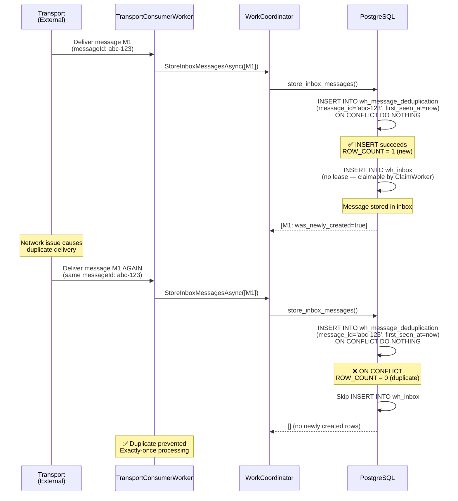
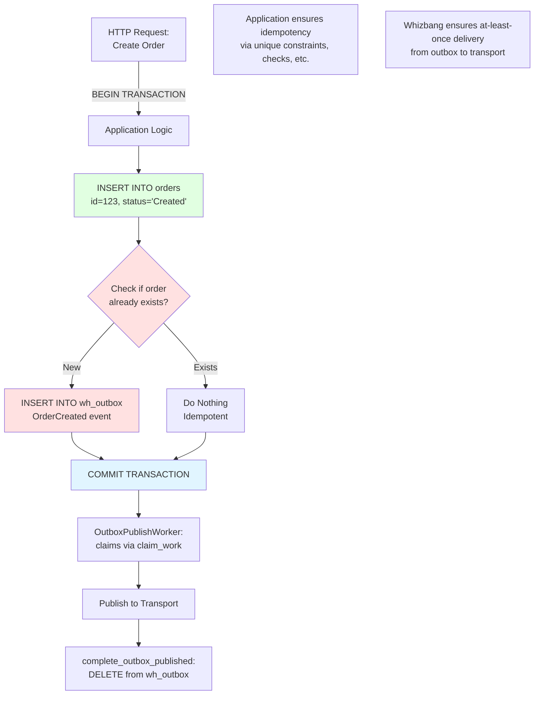
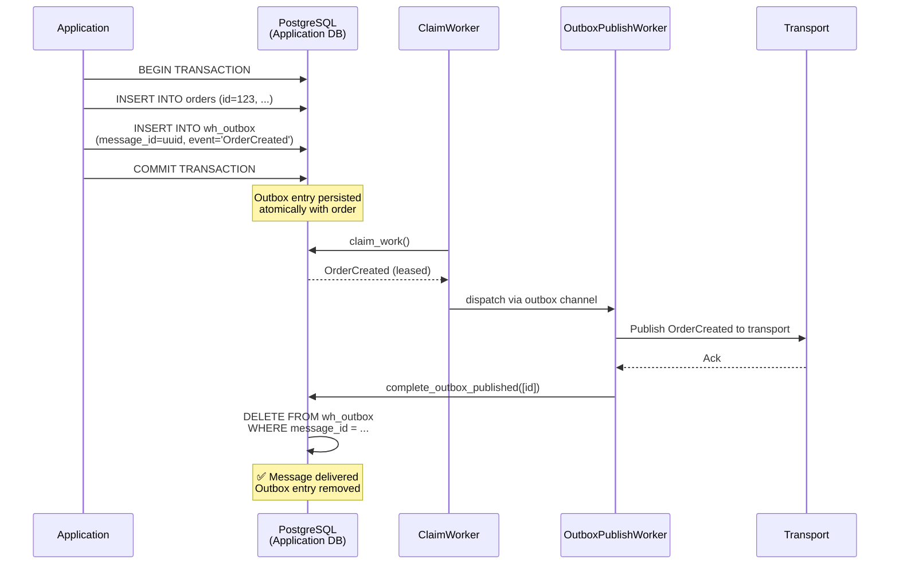

# Idempotency Patterns

## Overview

Idempotency ensures that processing the same message multiple times produces the same result as processing it once. Whizbang implements different idempotency strategies for inbox and outbox based on their roles in the system architecture.

## Core Concepts

### What is Idempotency?

**Definition**: An operation is idempotent if performing it multiple times has the same effect as performing it once.

**Why It Matters**:
- Message brokers often provide at-least-once delivery (duplicates possible)
- Network retries can cause duplicate message sends
- Distributed systems need to handle duplicate messages gracefully

**Example**:
- ✅ Idempotent: `SET balance = 100` (same result whether executed 1x or 10x)
- ❌ Not Idempotent: `SET balance = balance + 10` (different result each execution)

### Inbox vs. Outbox Strategies

| Aspect | Inbox | Outbox |
|---|---|---|
| **Deduplication** | Deduplication table (wh_message_deduplication) | Transactional boundary responsibility |
| **Guarantee** | Exactly-once processing | At-least-once delivery |
| **Responsibility** | Whizbang framework | Application code |
| **Rationale** | Prevents duplicate external events | Part of application transaction |

## Inbox Idempotency {#inbox-idempotency}

### Strategy: Deduplication Table

**Mechanism**: The `wh_message_deduplication` table tracks all inbox message IDs seen. Duplicate messages are rejected via `ON CONFLICT DO NOTHING` inside the `store_inbox_messages` PostgreSQL function. Entries are retained for a configurable window (default 30 days) and purged by the `perform_maintenance` function.

### Database Schema

```sql{title="Database Schema" description="Database Schema" category="Architecture" difficulty="BEGINNER" tags=["Messaging", "Sql", "Database", "Schema"]}
CREATE TABLE IF NOT EXISTS wh_message_deduplication (
  message_id UUID NOT NULL PRIMARY KEY,
  first_seen_at TIMESTAMPTZ NOT NULL DEFAULT CURRENT_TIMESTAMP
);

-- Index used by perform_maintenance retention purge
CREATE INDEX IF NOT EXISTS idx_message_dedup_first_seen
  ON wh_message_deduplication (first_seen_at);
```

**Characteristics**:
- **Primary Key**: message_id ensures uniqueness
- **First Seen**: Tracks when message was first encountered
- **Cleanup**: `perform_maintenance` purges entries older than the retention window (`dedup_retention_days` in `wh_settings`, default 30 days)

### Processing Flow


```mermaid
sequenceDiagram
    participant T as Transport<br/>(External)
    participant TCW as TransportConsumerWorker
    participant WC as WorkCoordinator
    participant DB as PostgreSQL

    T->>TCW: Deliver message M1<br/>(messageId: abc-123)
    TCW->>WC: StoreInboxMessagesAsync([M1])
    WC->>DB: store_inbox_messages()

    DB->>DB: INSERT INTO wh_message_deduplication<br/>(message_id='abc-123', first_seen_at=now)<br/>ON CONFLICT DO NOTHING
    Note over DB: ✅ INSERT succeeds<br/>ROW_COUNT = 1 (new)

    DB->>DB: INSERT INTO wh_inbox<br/>(no lease — claimable by ClaimWorker)
    Note over DB: Message stored in inbox

    DB-->>WC: [M1: was_newly_created=true]

    Note over T: Network issue causes<br/>duplicate delivery

    T->>TCW: Deliver message M1 AGAIN<br/>(same messageId: abc-123)
    TCW->>WC: StoreInboxMessagesAsync([M1])
    WC->>DB: store_inbox_messages()

    DB->>DB: INSERT INTO wh_message_deduplication<br/>(message_id='abc-123', first_seen_at=now)<br/>ON CONFLICT DO NOTHING
    Note over DB: ❌ ON CONFLICT<br/>ROW_COUNT = 0 (duplicate)

    DB->>DB: Skip INSERT INTO wh_inbox

    DB-->>WC: [] (no newly created rows)

    Note over TCW: ✅ Duplicate prevented<br/>Exactly-once processing
```

### Implementation Details

**PostgreSQL Function** (`store_inbox_messages`, defined in `021_StoreInboxMessages.sql`):

```sql{title="Implementation Details" description="PostgreSQL function store_inbox_messages in 021_StoreInboxMessages.sql" category="Architecture" difficulty="INTERMEDIATE" tags=["Messaging", "Sql", "Implementation", "Details"]}
-- Deduplication: Try to insert into deduplication table first
-- If message_id already exists, this returns 0 rows and we skip the inbox insert
INSERT INTO wh_message_deduplication (message_id, first_seen_at)
VALUES (v_msg.msg_id, p_now)
ON CONFLICT ON CONSTRAINT wh_message_deduplication_pkey DO NOTHING;

GET DIAGNOSTICS v_was_new = ROW_COUNT;

-- Only proceed if deduplication insert succeeded (message is new)
IF v_was_new = 1 THEN
  -- Calculate partition for stream-based load balancing
  -- Insert message without lease — immediately claimable via claim_work
  INSERT INTO wh_inbox (message_id, handler_name, message_type, ...)
  VALUES (...)
  ON CONFLICT ON CONSTRAINT wh_inbox_pkey DO NOTHING;

  -- Return message as newly created (deduplication succeeded)
  RETURN QUERY SELECT v_msg.msg_id, v_msg.stream_id, (v_was_new = 1);
END IF;
```

### Testing

**Test Case**: `DuplicateMessageId_SecondCallNoOpsViaDedupTableAsync` (in `StoreInboxMessagesSqlTests.cs`)

**Scenario**:
1. Insert inbox message M1 with `message_id = abc-123`
2. Attempt to insert same message again with same `message_id`
3. Verify second insert is rejected
4. Verify only one record in `wh_inbox`

### Limitations and Trade-offs

**Advantages**:
- ✅ **Simple**: No complex logic, database constraint handles it
- ✅ **Reliable**: Primary key constraint is atomic and foolproof
- ✅ **Exactly-once**: Guaranteed single processing per message ID

**Disadvantages**:
- ❌ **Storage Growth**: One row per unique message ID within the retention window
- ❌ **Performance**: Index lookup on every message store (mitigated by UUIDs and btree)
- ❌ **Bounded Window**: Duplicates arriving after the retention window (default 30 days) are no longer detected

**Mitigation Strategies**:
- Use UUIDv7 for time-ordered IDs (better index performance)
- Tune retention via the `dedup_retention_days` key in `wh_settings` (default 30 days)
- Monitor table size (`perform_maintenance` reports purge counts per run)

## Outbox Idempotency {#outbox-idempotency}

### Strategy: Transactional Boundary Responsibility

**Mechanism**: Outbox does NOT use a deduplication table. Duplicate prevention is the application's responsibility within its transaction boundary.

### Why No Deduplication?

**Rationale**:
1. **Transactional Outbox Pattern**: Outbox is part of the application's database transaction
2. **Application Control**: Application decides what messages to send
3. **Idempotent Commands**: Application should use idempotent command IDs
4. **Whizbang's Role**: Ensure at-least-once delivery (once in outbox → delivered to transport)

### Transactional Outbox Pattern


```mermaid
graph TD
    A[HTTP Request:<br/>Create Order] -->|BEGIN TRANSACTION| B[Application Logic]
    B --> C[INSERT INTO orders<br/>id=123, status='Created']
    C --> D{Check if order<br/>already exists?}
    D -->|Exists| E[Do Nothing<br/>Idempotent]
    D -->|New| F[INSERT INTO wh_outbox<br/>OrderCreated event]
    F --> G[COMMIT TRANSACTION]
    E --> G

    G --> H[OutboxPublishWorker:<br/>claims via claim_work]
    H --> I[Publish to Transport]
    I --> J[complete_outbox_published:<br/>DELETE from wh_outbox]

    style C fill:#e1ffe1
    style D fill:#ffe1e1
    style F fill:#ffe1e1
    style G fill:#e1f5ff

    Note1[Application ensures idempotency<br/>via unique constraints, checks, etc.]
    Note2[Whizbang ensures at-least-once delivery<br/>from outbox to transport]
```

### Example: Idempotent Command Handler

```csharp{title="Example: Idempotent Command Handler" description="Example: Idempotent Command Handler" category="Architecture" difficulty="INTERMEDIATE" tags=["Messaging", "C#", "Example:", "Idempotent", "Command"]}
public async Task<Result> HandleCreateOrderAsync(CreateOrderCommand command) {
    // Start application transaction
    using var transaction = await _dbContext.Database.BeginTransactionAsync();

    // Check if order already exists (idempotency check)
    var existingOrder = await _dbContext.Orders
        .FirstOrDefaultAsync(o => o.Id == command.OrderId);

    if (existingOrder != null) {
        // Already processed - do nothing (idempotent)
        await transaction.CommitAsync();
        return Result.Success();
    }

    // Create new order
    var order = new Order {
        Id = command.OrderId,  // Deterministic ID (from command)
        CustomerId = command.CustomerId,
        Status = OrderStatus.Created
    };

    _dbContext.Orders.Add(order);

    // Publish OrderCreated event to outbox
    var orderCreatedEvent = new OrderCreatedEvent {
        OrderId = order.Id,
        CustomerId = order.CustomerId
    };

    await _dispatcher.PublishAsync(orderCreatedEvent);  // → Outbox

    // Commit application transaction (atomic)
    await _dbContext.SaveChangesAsync();
    await transaction.CommitAsync();

    return Result.Success();
}
```

**Key Points**:
- Command has deterministic ID (`command.OrderId`)
- Application checks for existing order before processing
- If order exists, do nothing (idempotent)
- Outbox insert happens within same transaction
- If transaction fails, both order AND outbox inserts roll back

### No Deduplication Table Needed

**Why?**:
- If the same command is executed twice:
  - First execution: Creates order + outbox entry → COMMIT
  - Second execution: Finds existing order → Do nothing → COMMIT (no outbox entry)
- Outbox only has one entry (from first execution)
- If application logic fails to check for duplicates, that's an application bug, not a framework responsibility

### Outbox Processing Flow


```mermaid
sequenceDiagram
    participant App as Application
    participant DB as PostgreSQL<br/>(Application DB)
    participant CW as ClaimWorker
    participant OPW as OutboxPublishWorker
    participant T as Transport

    App->>DB: BEGIN TRANSACTION
    App->>DB: INSERT INTO orders (id=123, ...)
    App->>DB: INSERT INTO wh_outbox<br/>(message_id=uuid, event='OrderCreated')
    App->>DB: COMMIT TRANSACTION

    Note over DB: Outbox entry persisted<br/>atomically with order

    CW->>DB: claim_work()
    DB-->>CW: OrderCreated (leased)
    CW->>OPW: dispatch via outbox channel

    OPW->>T: Publish OrderCreated to transport
    T-->>OPW: Ack

    OPW->>DB: complete_outbox_published([id])
    DB->>DB: DELETE FROM wh_outbox<br/>WHERE message_id = ...

    Note over DB: ✅ Message delivered<br/>Outbox entry removed
```

### Testing

Duplicate prevention on the outbox side is application logic, so the framework tests cover the at-least-once delivery half of the contract: `CompleteOutboxPublishedSqlTests.cs` verifies that completions delete rows exactly once and that unknown IDs no-op idempotently.

**Application-level scenario** (yours to test):
1. Application transaction creates order + outbox entry
2. Same command executed again (simulating duplicate request)
3. Verify application logic prevents duplicate order
4. Verify only ONE outbox entry created

## Comparison Matrix

| Aspect | Inbox Deduplication | Outbox Transactional |
|---|---|---|
| **Mechanism** | Deduplication table with retention purge | Application transaction control |
| **Guarantee** | Exactly-once processing | At-least-once delivery |
| **Responsibility** | Whizbang framework | Application code |
| **Storage** | One row per unique message ID (retention window) | No deduplication table |
| **Performance** | Index lookup on every message | No overhead |
| **Complexity** | Simple (database constraint) | Requires application design |
| **Use Case** | External events (from transports) | Internal events (from application) |

## Best Practices

### Inbox Best Practices

**1. Use Stable Message IDs**:
```csharp{title="Inbox Best Practices" description="Inbox Best Practices" category="Architecture" difficulty="BEGINNER" tags=["Messaging", "C#", "Inbox", "Best", "Practices"]}
// ✅ Good: Generate the ID once, reuse it for every retry of the same message
var messageId = TrackedGuid.NewMedo();  // UUIDv7, time-ordered
await SendWithRetriesAsync(messageId, orderCreatedEvent);

// ❌ Bad: Fresh ID per attempt (loses idempotency)
await SendAsync(TrackedGuid.NewMedo(), orderCreatedEvent);  // Different every retry
```

**2. Include Correlation/Causation IDs**:
- Even with deduplication, include correlation and causation IDs
- Enables tracing and debugging
- Helps identify duplicate sources

**3. Monitor Deduplication Table Size**:
```sql{title="Inbox Best Practices (2)" description="Inbox Best Practices" category="Architecture" difficulty="BEGINNER" tags=["Messaging", "Sql", "Inbox", "Best", "Practices"]}
SELECT COUNT(*) FROM wh_message_deduplication;
SELECT pg_total_relation_size('wh_message_deduplication');
```

**4. Tune the Retention Window** (optional):
```sql{title="Inbox Best Practices (3)" description="Inbox Best Practices" category="Architecture" difficulty="BEGINNER" tags=["Messaging", "Sql", "Inbox", "Best", "Practices"]}
-- perform_maintenance purges entries older than dedup_retention_days (default 30)
INSERT INTO wh_settings (setting_key, setting_value, value_type, description)
VALUES ('dedup_retention_days', '90', 'integer', 'Days to retain message deduplication entries')
ON CONFLICT (setting_key) DO UPDATE SET setting_value = EXCLUDED.setting_value;
```

### Outbox Best Practices

**1. Use Deterministic Command IDs**:
```csharp{title="Outbox Best Practices" description="Outbox Best Practices" category="Architecture" difficulty="INTERMEDIATE" tags=["Messaging", "C#", "Outbox", "Best", "Practices"]}
public class CreateOrderCommand {
    public Guid OrderId { get; init; }  // Deterministic, from client
    // ... other properties
}

// Client generates ID
var command = new CreateOrderCommand {
    OrderId = TrackedGuid.NewMedo(),  // Generated once, by client
    // ...
};

// Retry with same ID
await httpClient.PostAsync("/orders", command);  // Same OrderId
```

**2. Implement Idempotency Checks**:
```csharp{title="Outbox Best Practices (2)" description="Outbox Best Practices" category="Architecture" difficulty="BEGINNER" tags=["Messaging", "C#", "Outbox", "Best", "Practices"]}
// Always check if entity already exists
var existing = await _dbContext.Orders
    .FirstOrDefaultAsync(o => o.Id == command.OrderId);

if (existing != null) {
    return Result.Success();  // Already processed
}
```

**3. Use Unique Constraints**:
```csharp{title="Outbox Best Practices (3)" description="Outbox Best Practices" category="Architecture" difficulty="BEGINNER" tags=["Messaging", "C#", "Outbox", "Best", "Practices"]}
modelBuilder.Entity<Order>(entity => {
    entity.HasKey(e => e.Id);

    // Additional unique constraints for idempotency
    entity.HasIndex(e => new { e.CustomerId, e.OrderNumber })
          .IsUnique();  // Prevent duplicate order numbers
});
```

**4. Transaction Scope**:
```csharp{title="Outbox Best Practices (4)" description="Outbox Best Practices" category="Architecture" difficulty="BEGINNER" tags=["Messaging", "C#", "Outbox", "Best", "Practices"]}
// Ensure outbox is in same transaction as business logic
using var transaction = await _dbContext.Database.BeginTransactionAsync();

// Business logic
// ...

// Outbox (same transaction)
await _dispatcher.PublishAsync(evt);

await _dbContext.SaveChangesAsync();
await transaction.CommitAsync();  // Atomic
```

## Troubleshooting

### Inbox: Duplicate Messages Still Processing

**Symptoms**:
- Same message processed multiple times
- Duplicate handler invocations
- Data inconsistencies

**Diagnostic Steps**:
1. Check if message IDs are actually unique:
   ```sql
   SELECT message_id, COUNT(*)
   FROM wh_message_deduplication
   GROUP BY message_id
   HAVING COUNT(*) > 1;
   ```

2. Verify deduplication table exists and has primary key:
   ```sql
   \d wh_message_deduplication
   ```

3. Check if messages have NULL message_id:
   ```sql
   SELECT * FROM wh_inbox WHERE message_id IS NULL;
   ```

**Common Causes**:
- Message IDs not set (NULL)
- Non-deterministic message ID generation
- Deduplication table missing or corrupted
- Multiple databases (each has separate deduplication table)

### Outbox: Duplicate Events Published

**Symptoms**:
- Same event published multiple times to transport
- Downstream systems receive duplicates

**Diagnostic Steps**:
1. Check if outbox has duplicate entries:
   ```sql
   SELECT destination, message_type, event_data::TEXT,
          COUNT(*)
   FROM wh_outbox
   GROUP BY destination, message_type, event_data::TEXT
   HAVING COUNT(*) > 1;
   ```

2. Verify application transaction scope:
   - Is outbox insert in same transaction as business logic?
   - Are there multiple code paths creating the same event?

**Common Causes**:
- Application logic executes multiple times (no idempotency check)
- Outbox insert outside application transaction
- Retry logic without idempotency checks
- Multiple application instances with separate databases

## Related Documentation

- [Work Coordination](work-coordination.md) - Overview and architecture
- [Multi-Instance Coordination](multi-instance-coordination.md) - Cross-instance scenarios
- [Failure Handling](failure-handling.md) - Retry scheduling and cascades
- [Outbox Pattern](outbox-pattern.md) - Transactional outbox implementation
- [Inbox Pattern](inbox-pattern.md) - Deduplication and handler invocation

## Implementation

### PostgreSQL Functions

- `store_inbox_messages` (`021_StoreInboxMessages.sql`) - Inbox deduplication via wh_message_deduplication table
- `store_outbox_messages` (`020_StoreOutboxMessages.sql`) - Outbox storage (no deduplication table)
- `perform_maintenance` (`032_PerformMaintenance.sql`) - Purges deduplication entries past retention

### C# Coordinator

See: `Whizbang.Data.EFCore.Postgres/EFCoreWorkCoordinator.cs`

**Method**: `StoreInboxMessagesAsync`

**Responsibilities**:
- Serialize new inbox messages to JSON
- Call PostgreSQL `store_inbox_messages` function
- Return newly created message IDs (duplicates already filtered by DB)

### Integration Tests

See: `Whizbang.Data.EFCore.Postgres.Tests/`

**Test Cases**:
- `StoreInboxMessagesSqlTests.DuplicateMessageId_SecondCallNoOpsViaDedupTableAsync` - Inbox idempotency
- `MaintenanceTests.PerformMaintenance_PurgesDeduplicationEntries_OlderThanRetentionAsync` - Retention purge
