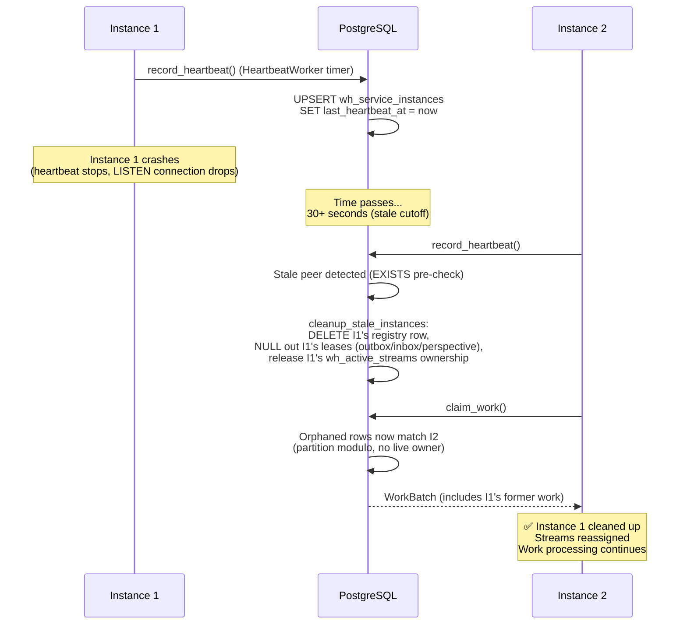
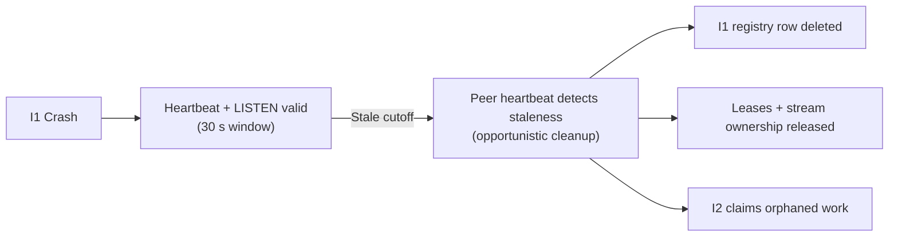
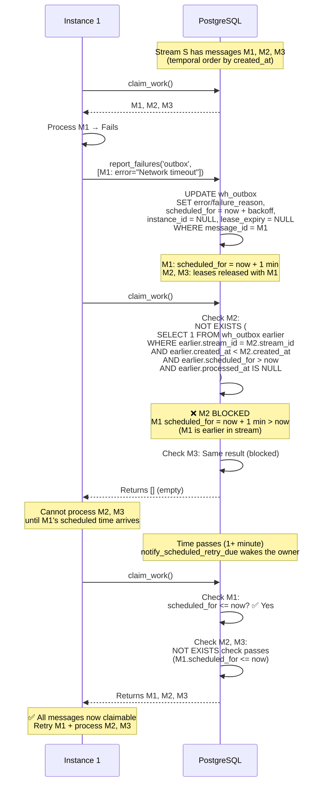
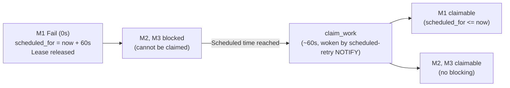
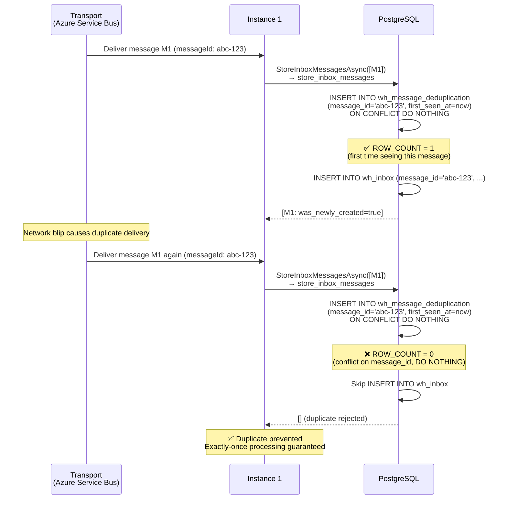
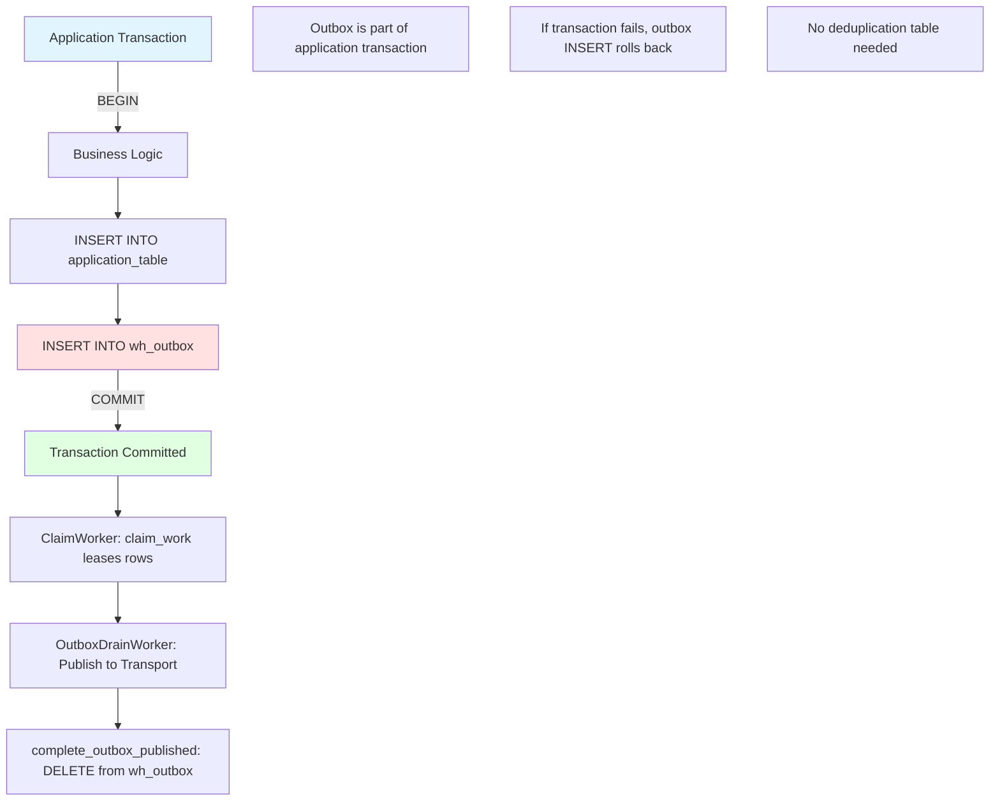
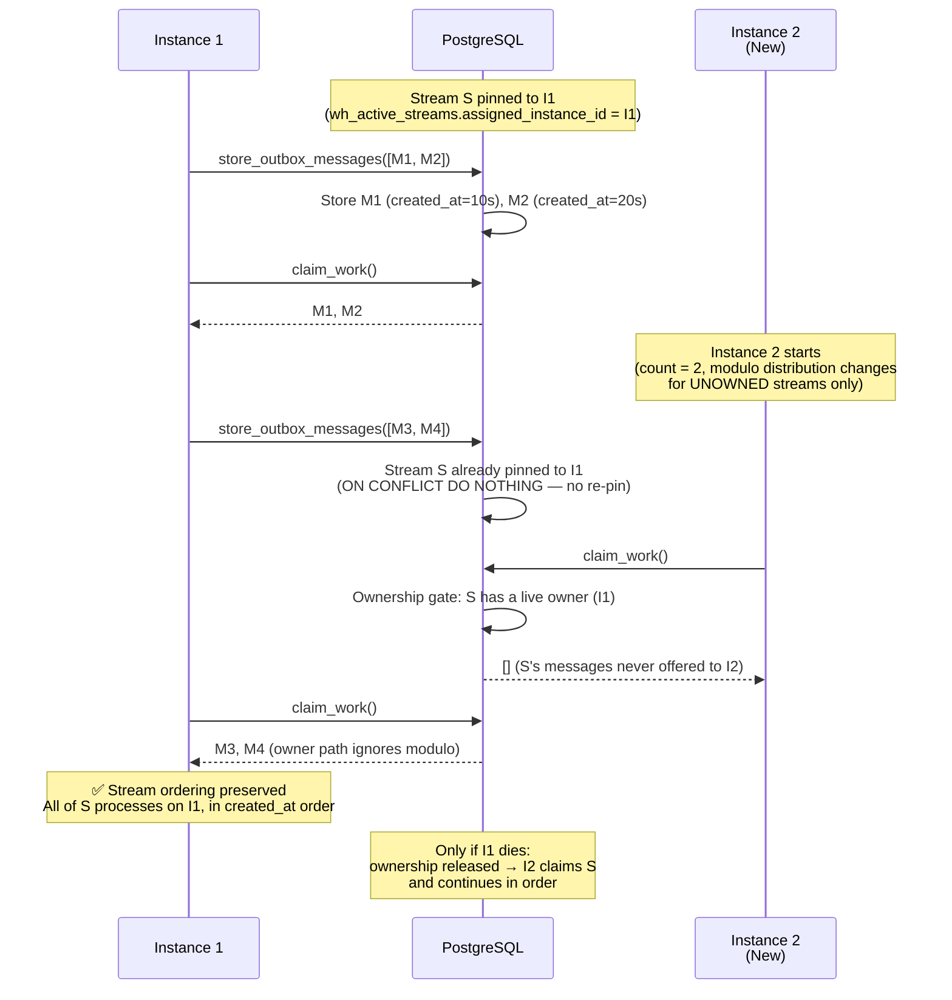

# Multi-Instance Coordination

## Overview

Multi-instance coordination ensures reliable, ordered message processing across multiple service instances. This document details the coordination mechanisms, decision points, and timing guarantees that enable distributed message processing.

## Core Coordination Mechanisms

### 1. Cross-Instance Stream Ordering {#cross-instance-stream-ordering}

**Rule**: A stream belongs to exactly one live instance at a time. When Instance A owns stream S (a live lease in `wh_active_streams`), Instance B cannot claim ANY messages from stream S — later messages included — until Instance A's ownership lapses.

**Why This Matters**: Prevents out-of-order processing when messages from the same stream would otherwise be distributed across multiple instances.

#### Sequence Diagram

```mermaid
sequenceDiagram
    participant I1 as Instance 1
    participant DB as PostgreSQL
    participant I2 as Instance 2

    Note over DB: Stream S has messages M1, M2, M3, M4<br/>(temporal order by created_at)

    I1->>DB: claim_work()
    DB->>DB: Stream S pinned to I1 in wh_active_streams<br/>(assigned_instance_id = I1, live lease)
    DB-->>I1: Returns M1, M2
    Note over I1: I1 holds leases on M1, M2<br/>lease_expiry = now + 5 min

    I2->>DB: claim_work()
    DB->>DB: Ownership gate:<br/>NOT EXISTS other live owner —<br/>wh_active_streams shows S owned by I1<br/>(live lease + alive per heartbeat/LISTEN)
    Note over DB: ❌ M3, M4 BLOCKED<br/>Stream S has a live owner (I1)
    DB-->>I2: Returns [] (empty)

    Note over I2: I2 cannot process M3, M4<br/>while I1 owns stream S

    I1->>DB: complete_outbox_published([M1, M2])
    DB->>DB: Delete M1, M2 (done)
    I1->>I1: I1 continues to own stream S<br/>and drains M3, M4 in order

    Note over DB: If I1 dies: heartbeat + LISTEN stale →<br/>ownership released, I2 claims via modulo

    I2->>DB: claim_work() (after I1 death)
    DB->>DB: No live owner; partition modulo matches I2
    DB-->>I2: Returns M3, M4 (in created_at order)
    Note over I2: ✅ Stream ordering preserved<br/>One owner at a time, FIFO within stream
```

**Decision Matrix**:

| Stream / Earlier Message State | Later Messages Claimable by Another Instance? | Reason |
|---|---|---|
| Stream has a live owner (other instance) | ❌ No | Stream ownership gate (`wh_active_streams`) |
| Stream unowned, no earlier scheduled retry | ✅ Yes (by the modulo-matching instance) | Message not claimed |
| Owner dead (stale heartbeat, no LISTEN connection) | ✅ Yes | Ownership released, work orphaned |
| Completed/deleted | ✅ Yes | Message finished |
| Earlier message scheduled for retry | ❌ No | See [Scheduled Retry Blocking](#scheduled-retry-blocking) |

### 2. Stale Instance Cleanup {#stale-instance-cleanup}

**Rule**: Instances that stop heartbeating past the 30-second stale cutoff — and have no live LISTEN connection and no advisory alive-lock — are automatically removed, releasing their messages and stream ownership.

Heartbeating runs on its own timer: `HeartbeatWorker` calls `record_heartbeat` every 30 seconds (60 s in the adaptive lock-aware mode). Stale-peer cleanup fires opportunistically inside `record_heartbeat` (guarded by a cheap `EXISTS` pre-check), with `MaintenanceWorker` running `cleanup_stale_instances` as a backstop. A 5-minute definitive-dead cutoff bypasses the alive-lock guard for OOMKilled pods on half-open TCP.

#### Sequence Diagram



**Timing Diagram**:



**Decision Matrix**:

| Liveness Signals | Instance State | Messages | Action |
|---|---|---|---|
| Heartbeat < 30 s old | Active | Retained | Normal operation |
| Heartbeat stale, LISTEN connection alive | Active | Retained | TCP-fresh LISTEN counts as alive |
| Heartbeat stale, alive-lock held, < 5 min | Active | Retained | Advisory lock counts as alive |
| All signals stale (or > 5 min definitive-dead) | Stale | Released | DELETE instance, release leases + stream ownership |

### 3. New Instance Joining {#new-instance-joining}

**Rule**: When a new instance joins, the modulo distribution for **unowned** work changes automatically. Streams already pinned to a live instance (`wh_active_streams`) stay with their owner — no stealing.

#### Sequence Diagram

```mermaid
sequenceDiagram
    participant I1 as Instance 1<br/>(Active)
    participant DB as PostgreSQL
    participant I2 as Instance 2<br/>(New)

    Note over I1: Instance 1 processing all streams<br/>(alone, active_instance_count=1, rank 0)

    I1->>DB: claim_work()
    DB-->>I1: WorkBatch (all streams)

    Note over I2: New Instance 2 starts

    I2->>DB: record_heartbeat()
    DB->>DB: UPSERT wh_service_instances<br/>(I2, ServiceName, Host, PID, now)
    DB->>DB: calculate_instance_rank:<br/>ROW_NUMBER over live instances<br/>→ I1 rank 0, I2 rank 1, count 2

    I2->>DB: claim_work()
    DB->>DB: Check unowned work:<br/>partition_number % 2 = 1 → I2's share
    Note over DB: Streams pinned to I1 stay with I1<br/>(no stealing from a live owner)
    DB-->>I2: [] (no unowned work yet)

    Note over DB: New messages arrive for NEW streams

    I1->>DB: store_outbox_messages / store_inbox_messages
    DB->>DB: New stream pins to storing instance;<br/>unowned streams follow the modulo split

    I2->>DB: claim_work()
    DB->>DB: Claim unowned streams where<br/>partition_number % 2 = 1
    DB-->>I2: Streams distributed to I2

    Note over I1,I2: Both instances process their streams<br/>Distribution balances as new streams arrive
```

**Stream Distribution Example** (unowned streams):

| Stream partition | Before (count=1) | After (count=2) | New Owner |
|---|---|---|---|
| partition % n = 0 | rank 0 (I1) | rank 0 (I1) | No change |
| partition % n = 1 | rank 0 (I1) | rank 1 (I2) | Redistributed |
| partition % n = 2 | rank 0 (I1) | rank 0 (I1) | No change |
| partition % n = 3 | rank 0 (I1) | rank 1 (I2) | Redistributed |
| ... | ... | ... | ... |

### 4. Scheduled Retry Blocking {#scheduled-retry-blocking}

**Rule**: When message M1 fails and is scheduled for retry (e.g., `scheduled_for = now + 5 minutes`), all later messages in the same stream are blocked until the scheduled time passes.

#### Sequence Diagram



**Timing Diagram**:



**Decision Matrix**:

| Earlier Message State | scheduled_for | Later Messages Claimable? | Reason |
|---|---|---|---|
| Failed | now + 5 min (future) | ❌ No | Scheduled retry blocks stream |
| Failed | now - 1 min (past) | ✅ Yes | Scheduled time passed |
| Failed | NULL | ✅ Yes | No schedule (poison message?) |
| Processing | N/A | ❌ No | Active lease blocks |
| Completed | N/A | ✅ Yes | Message done |

### 5. Message Reassignment After Instance Failure {#message-reassignment}

**Rule**: When an instance goes stale and its messages are released, they become claimable by any instance whose hash matches the stream.

**Note**: This section describes the same concept as [Stale Instance Cleanup](#stale-instance-cleanup) but focuses on message-level reassignment rather than instance-level cleanup. See also [Instance Joining - Hash Redistribution](#instance-joining-hash-redistribution) for how new instances claim messages.

### 6. Lease Expiry and Orphaned Work {#lease-expiry}

**Rule**: Messages with expired leases (`lease_expiry < now`) can be claimed by any instance, enabling automatic recovery from instance failures.

#### Sequence Diagram

```mermaid
sequenceDiagram
    participant I1 as Instance 1<br/>(Crashes)
    participant DB as PostgreSQL
    participant I2 as Instance 2

    I1->>DB: claim_work()
    DB-->>I1: M1, M2 (lease_expiry = now + 5 min)

    Note over I1: Instance 1 hangs mid-processing<br/>(lease not renewed)

    Note over DB: Time passes (5+ minutes)<br/>Lease expires; stream ownership lapses

    I2->>DB: claim_work()
    DB->>DB: claim_orphaned_outbox:<br/>rows WHERE (instance_id IS NULL<br/>  OR lease_expiry < now)<br/>AND no live stream owner<br/>AND partition_number % active_count = I2_rank
    DB->>DB: UPDATE wh_outbox<br/>SET instance_id = I2,<br/>lease_expiry = now + 5 min,<br/>attempts = attempts + 1<br/>WHERE message_id IN (M1, M2)
    DB-->>I2: WorkBatch: M1, M2 (reclaimed)

    Note over I2: ✅ Orphaned work recovered<br/>Processing continues
```

**Note**: `LeaseRenewalWorker` renews leases for healthy in-flight work approaching expiry, so orphaning normally indicates a genuinely stuck or dead worker. A per-item renewal cap stops stuck work from renewing forever.

**Lease State Machine**:

```
No Lease                Active Lease              Expired Lease
(instance_id = NULL) →  (lease_expiry > now)  →  (lease_expiry < now)
                        ↓                         ↓
                        Processing                Orphaned (reclaimable)
                        ↓
                        Completed/Failed
                        (lease cleared)
```

### 7. Idempotency - Inbox Deduplication {#idempotency-inbox}

**Rule**: The `wh_message_deduplication` table tracks inbox message IDs (default 30-day retention). Duplicate messages are rejected via `ON CONFLICT DO NOTHING` inside `store_inbox_messages`.

#### Sequence Diagram



**Deduplication Table**:

```sql{title="Sequence Diagram" description="Deduplication Table:" category="Architecture" difficulty="BEGINNER" tags=["Messaging", "Sql", "Sequence", "Diagram"]}
CREATE TABLE IF NOT EXISTS wh_message_deduplication (
  message_id UUID NOT NULL PRIMARY KEY,  -- Idempotency key
  first_seen_at TIMESTAMPTZ NOT NULL DEFAULT CURRENT_TIMESTAMP
);

-- Retention: perform_maintenance purges entries older than
-- dedup_retention_days (wh_settings, default 30 days)
-- Enables exactly-once inbox processing within the retention window
```

### 8. Idempotency - Outbox Transactional Boundary {#idempotency-outbox}

**Rule**: Outbox does NOT use the deduplication table. Duplicate prevention is the caller's responsibility (transactional outbox pattern).

#### Diagram



**Why No Deduplication?**:
- Outbox is part of the application's transaction boundary
- If the same message is inserted twice, it's because the application logic called it twice
- The application should handle deduplication (e.g., idempotent commands, unique constraints)
- Whizbang's responsibility: Ensure at-least-once delivery (once in outbox → delivered to transport)

### 9. Virtual Partition Assignment (Hash-Based) {#virtual-partition-assignment}

**Rule**: For unowned work, instance ownership is calculated algorithmically: the stream's partition number modulo the live instance count must equal the instance's rank. No partition assignments table is needed.

**Formulas**:
- `partition_number = abs(hashtext(stream_id::TEXT)) % partition_count` (`compute_partition`)
- Claimable by instance when `partition_number % active_instance_count = instance_rank` (`calculate_instance_rank` assigns ranks via `ROW_NUMBER()` over live instances)

#### Sequence Diagram

```mermaid
sequenceDiagram
    participant I1 as Instance 1<br/>(rank 0)
    participant DB as PostgreSQL
    participant I2 as Instance 2<br/>(rank 1)

    Note over DB: Stream S1: partition_number = 4726<br/>Messages M1, M2 created (unowned)

    I1->>DB: claim_work()
    DB->>DB: calculate_instance_rank: I1 → rank 0, count 2
    DB->>DB: 4726 % 2 = 0
    DB->>DB: ✅ Match! (0 = I1's rank)
    DB->>DB: Claim M1, M2 for I1; pin stream in wh_active_streams
    DB-->>I1: M1, M2 (instance_id=I1, lease_expiry=now+5min)

    Note over I1: I1 processes M1, M2

    I2->>DB: claim_work()
    DB->>DB: 4726 % 2 = 0, I2's rank = 1
    DB->>DB: ❌ No match (0 ≠ 1) — and stream now pinned to I1
    DB-->>I2: [] (empty)

    Note over I2: I2 cannot claim Stream S1 messages<br/>Modulo ownership + pin belong to I1
```

**Key Properties**:
- **Deterministic**: Same stream always maps to the same partition
- **Cheap**: Partition math is pure computation; rank is one indexed window query
- **Sticky**: Once claimed, `wh_active_streams` pins the stream to its owner (rank churn can't split a stream)
- **Automatic rebalancing**: Adding/removing instances changes the modulo distribution for unowned work

### 10. Instance Transition - Stream Ownership Across Scaling {#instance-transition-stream-split}

**Rule**: Streams never split across instances. Once a stream is pinned in `wh_active_streams`, ALL of its messages — including ones stored after a new instance joins — process on the owning instance. Ownership transitions only when the owner dies (or the stream goes idle and its pin is cleaned up).

**Critical Guarantee**: A stream has at most one live owner at any moment, so per-stream FIFO order holds across scaling events.

#### Sequence Diagram



**Decision Matrix**:

| Stream State | New Instance Can Claim? | Reason |
|---|---|---|
| Pinned to live I1 | ❌ No | Owner path — pin ignores modulo |
| Pinned to dead I1 | ✅ Yes (modulo match) | Ownership released on stale cleanup |
| Unowned (new stream) | ✅ Yes (modulo match) | Standard distribution |
| Earlier message scheduled for retry | ❌ No | Scheduled retry blocks the stream |

**Key Guarantees**:
- **Time-ordered processing**: M1 → M2 → M3 → M4 (by `created_at`)
- **Single owner**: A stream cannot be processed by two instances concurrently
- **Single-processing**: Each message claimed exactly once (within lease)
- **No mid-stream theft**: The owner path in `claim_orphaned_*` ignores partition modulo for pinned streams, so rank churn cannot wedge or split a stream

### 11. Instance Joining - Redistribution of Unowned Work {#instance-joining-hash-redistribution}

**Rule**: When a new instance joins, `active_instance_count` increases and ranks recompute, changing the modulo distribution for **unowned** streams. Pinned streams stay with their owners; new streams spread across the larger pool.

#### Sequence Diagram

```mermaid
sequenceDiagram
    participant I1 as Instance 1<br/>(Alone, rank 0)
    participant DB as PostgreSQL
    participant I2 as Instance 2<br/>(Joins, rank 1)

    Note over DB: Streams S1, S2 pinned to I1<br/>(only instance)

    I1->>DB: claim_work()
    DB-->>I1: Messages from S1, S2

    Note over I2: Instance 2 starts

    I2->>DB: record_heartbeat()
    DB->>DB: Register I2 → ranks recompute<br/>(I1 rank 0, I2 rank 1, count 2)

    I2->>DB: claim_work()
    DB->>DB: S1, S2 have a live owner (I1)<br/>❌ Cannot steal
    DB-->>I2: [] (no work yet)

    Note over DB: New stream S3 arrives<br/>(partition_number % 2 = 1)

    I2->>DB: claim_work()
    DB->>DB: S3 unowned; 1 = I2's rank ✅
    DB->>DB: Claim + pin S3 to I2
    DB-->>I2: S3's messages

    Note over I1,I2: I1 keeps S1, S2; I2 takes new streams<br/>Load balances as pins expire / new streams arrive
```

**Distribution Changes** (unowned streams):

| Stream | partition % n | Before (count=1) | After (count=2) | New Owner |
|---|---|---|---|---|
| S1 | 0 | rank 0 (I1) | pinned (I1) | No change |
| S2 | 1 | rank 0 (I1) | pinned (I1) | No change (pin wins) |
| S3 (new) | 1 | — | rank 1 (I2) | I2 |
| S4 (new) | 0 | — | rank 0 (I1) | I1 |

**Key Points**:
- ~50% of NEW streams land on the new instance when instance count doubles
- Existing pinned streams keep their owner (no stealing from a live instance)
- Pins release when the owner dies or the stream is cleaned up after inactivity
- The stream ownership gate ensures ordering across the transition

## Testing Scenarios

Each coordination mechanism has corresponding integration tests (all under `tests/Whizbang.Data.EFCore.Postgres.Tests/`) that validate the behavior under various conditions:

### Instance Lifecycle Tests
- **Stale instance cleanup** - `CleanupStaleInstancesDefinitiveDeathSqlTests.cs`, `CleanupStaleInstancesOrphanNotifySqlTests.cs`
- **Heartbeat + opportunistic cleanup** - `EFCoreRecordHeartbeatTests.cs`, `OpportunisticHeartbeatSqlTests.cs`
- **LISTEN-connection liveness** - `ListenLivenessSqlTests.cs`

### Ownership and Claiming Tests
- **Stream pinning across rank churn** - `ClaimOrphanedActiveStreamsPinningSqlTests.cs`
- **Attempt counting on re-claim** - `ClaimOrphanedAttemptsIncrementSqlTests.cs`
- **Claim distribution + empty-call short-circuit** - `ClaimWorkSqlTests.cs`, `EFCoreClaimWorkTests.cs`
- **Cross-pod ownership** - `ActiveStreamsOwnershipSqlTests.cs`, `GetStreamEventsCrossPodOwnershipTests.cs`

### Idempotency Tests
- **Inbox deduplication** - `StoreInboxMessagesSqlTests.cs` (`DuplicateMessageId_SecondCallNoOpsViaDedupTableAsync`)
- **Retention purge** - `MaintenanceTests.cs`

## Configuration Guidelines

### Lease Duration

Choose based on maximum expected processing time:

| Processing Time | Recommended Lease | Rationale |
|---|---|---|
| < 30 seconds | 2 minutes | Quick recovery, minimal orphaning risk |
| 30s - 2 minutes | 5 minutes (default) | Balanced recovery and stability |
| 2 - 5 minutes | 10 minutes | Long-running tasks, prioritize stability |
| > 5 minutes | Use lease renewal | Extend lease for long-running operations |

### Stale Detection

The stale cutoff is fixed at **30 seconds** in the SQL functions — it is safe to be aggressive because staleness is corroborated by multiple liveness signals before an instance is declared dead:

| Signal | Freshness Source | Notes |
|---|---|---|
| `last_heartbeat_at` | `HeartbeatWorker` timer (30 s default) | The primary signal |
| LISTEN connection | `pg_stat_activity` (`wh_live_instances` view) | TCP-fresh regardless of heartbeat cadence |
| Advisory alive-lock | Session-level lock (migration 055) | Enables the relaxed 60 s heartbeat cadence |
| Definitive-dead cutoff | 5 minutes without heartbeat | Bypasses the alive-lock guard (half-open TCP) |

**Rule of Thumb**: You generally don't tune staleness — tune `HeartbeatWorkerOptions.IntervalSeconds` only if your environment demands it, keeping it below the abandon threshold divided by three.

### Partition Count

Higher counts enable finer-grained distribution:

| Instance Count | Recommended Partitions | Distribution Granularity |
|---|---|---|
| 1-5 instances | 1,000 | 200-1000 partitions per instance |
| 5-20 instances | 10,000 (default) | 500-2000 partitions per instance |
| 20-100 instances | 50,000 | 500-2500 partitions per instance |
| 100+ instances | 100,000 | 1000+ partitions per instance |

## Troubleshooting Guide

### Problem: Messages Stuck (Not Being Claimed)

**Diagnostic Steps**:

1. **Check instance heartbeat**:
   ```sql
   SELECT instance_id, last_heartbeat_at,
          now() - last_heartbeat_at AS age
   FROM wh_service_instances;
   ```

2. **Check stream ownership and modulo distribution**:
   ```sql
   -- Is the stream pinned, and to whom?
   SELECT stream_id, assigned_instance_id, lease_expiry, last_activity_at
   FROM wh_active_streams
   WHERE stream_id = '<stream_id>';

   -- For unowned streams: which rank should claim it?
   SELECT
     (abs(hashtext('<stream_id>'::TEXT)) % <partition_count>) AS partition_number,
     (abs(hashtext('<stream_id>'::TEXT)) % <partition_count>) % <active_instance_count> AS expected_instance_rank;
   -- Compare with calculate_instance_rank output for each instance
   ```

3. **Check stream ordering**:
   ```sql
   SELECT message_id, created_at, instance_id, lease_expiry,
          scheduled_for, status
   FROM wh_outbox
   WHERE stream_id = <stream_id>
   ORDER BY created_at;
   ```

4. **Check lease status**:
   ```sql
   SELECT message_id, instance_id,
          lease_expiry,
          lease_expiry < now() AS is_expired
   FROM wh_outbox
   WHERE message_id = <stuck_message_id>;
   ```

**Common Causes**:
- Stream pinned to another instance with a live lease (`wh_active_streams`)
- Earlier message in stream is scheduled for future retry
- Message not in a partition matching any live instance's rank
- All instances stopped heartbeating (all stale)

### Problem: Out-of-Order Processing

**Diagnostic Steps**:

1. **Verify stream IDs are set correctly**:
   ```sql
   SELECT message_id, stream_id, created_at
   FROM wh_outbox
   ORDER BY stream_id, created_at;
   ```

2. **Check for lease bypass (should not happen)**:
   ```sql
   -- Find messages processed out of order
   SELECT later.message_id AS later_msg,
          later.processed_at AS later_processed,
          earlier.message_id AS earlier_msg,
          earlier.processed_at AS earlier_processed
   FROM wh_outbox later
   JOIN wh_outbox earlier
     ON later.stream_id = earlier.stream_id
     AND later.created_at > earlier.created_at
   WHERE later.processed_at < earlier.processed_at;
   ```

**Common Causes**:
- Stream IDs not set (NULL) → no ordering constraint
- Temporal order incorrect (created_at not sequential)
- Bug in NOT EXISTS logic (report if found!)

## Related Documentation

- [Work Coordination](work-coordination.md) - Overview and architecture
- [Idempotency Patterns](idempotency-patterns.md) - Deduplication strategies
- [Failure Handling](failure-handling.md) - Retry scheduling and cascades
- [Outbox Pattern](outbox-pattern.md) - Transactional outbox implementation
- [Inbox Pattern](inbox-pattern.md) - Deduplication and handler invocation

## Implementation

### PostgreSQL Functions (Core Logic)

The coordination logic lives in focused SQL functions:

- `claim_work` + `record_heartbeat` + `renew_leases` — `029_ProcessWorkBatch.sql` (also drops the legacy `process_work_batch` orchestrator)
- `claim_orphaned_outbox` / `claim_orphaned_inbox` — `024_ClaimOrphanedOutbox.sql` / `025_ClaimOrphanedInbox.sql` (owner path, modulo path, scheduled-retry ordering gate)
- `cleanup_stale_instances` — `011_CleanupStaleInstances.sql` (liveness-corroborated removal + lease release)
- `calculate_instance_rank` — `012_CalculateInstanceRank.sql`
- `compute_partition` — `001_CreateComputePartitionFunction.sql`

### C# Coordinator

See: `Whizbang.Data.EFCore.Postgres/EFCoreWorkCoordinator.cs`

**Responsibilities**:
- Implement each `IWorkCoordinator` operation as a call to its SQL function
- Deserialize returned work rows / stream ids
- Map database columns to C# types

### Integration Tests

See: `tests/Whizbang.Data.EFCore.Postgres.Tests/`

**Test Categories**:
- Instance lifecycle (heartbeat, stale cleanup, LISTEN liveness)
- Ownership stability (stream pinning, rank churn, reassignment)
- Stream ordering (scheduled retry gate, cross-pod ownership)
- Idempotency (inbox deduplication, retention purge)
- Failure recovery (lease expiry, orphaned work, attempt counting)
