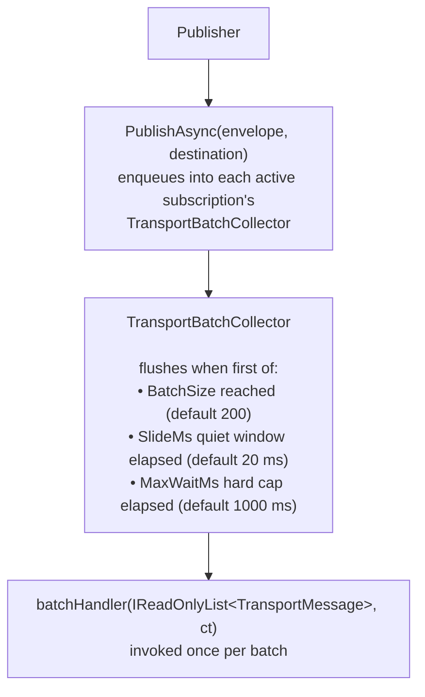

# In-Memory Transport

The **in-memory transport** (`InProcessTransport`, part of `Whizbang.Core` — there is no separate `Whizbang.Transports.InMemory` package) provides in-process message delivery without external dependencies. This transport is ideal for testing, development, and single-process applications where cross-process communication isn't needed.

:::updated
`InProcessTransport` now delivers messages through the same **batch-subscribe** surface as the wire transports (`SubscribeBatchAsync` + `TransportBatchCollector`). The older per-message `SubscribeAsync`/synchronous-delivery model described in earlier versions of this page no longer exists on the public `ITransport` interface.
:::

## Why In-Memory Transport?

**In-memory** offers simplicity and speed for local scenarios:

| Feature | Description | Benefit |
|---------|-------------|---------|
| **Zero Dependencies** | No external infrastructure | Simple setup |
| **In-Process Delivery** | Live CLR envelope reference handed to subscribers (no serialization) | Fast, no wire format |
| **Thread-Safe** | Concurrent publish/subscribe | Multi-threaded safety |
| **Full Capabilities** | Pub/sub + request/response | Complete feature set |
| **Instant Initialization** | No network checks | Fast startup |
| **Subscription Lifecycle** | Pause/resume/dispose | Fine-grained control |

**Use Cases**:
- ✅ **Unit Testing** - Test receptors without external infrastructure
- ✅ **Integration Testing** - Test message flows in-process
- ✅ **Single-Process Apps** - Modular applications without distributed messaging
- ✅ **Local Development** - No need for Service Bus/RabbitMQ during development
- ✅ **Prototyping** - Quick experimentation with messaging patterns

---

## Architecture

### Batch Delivery Model



**Key Characteristics**:
- **Batched, not synchronous**: `PublishAsync` returns after enqueueing — the batch handler runs when the collector's size/timer triggers fire, on a background task
- **No serialization**: the live envelope reference is handed to subscribers (`preSerializedBytes` is ignored)
- **Thread-safe**: `ConcurrentDictionary` keyed by destination address, with locking on the per-destination subscription list
- **Handler failure retry**: if a batch handler throws, the collector re-queues the failed batch for retry on the next flush — the exception does **not** propagate to the publisher

---

## Configuration

### 1. Register Transport (Built-In)

```csharp{title="Register Transport (Built-In)" description="Register Transport (Built-In)" category="Configuration" difficulty="BEGINNER" tags=["Messaging", "Transports", "Register", "Transport"]}
using Whizbang.Core.Transports;

var builder = WebApplication.CreateBuilder(args);

// In-memory transport is part of Whizbang.Core - no separate package needed
builder.Services.AddSingleton<ITransport, InProcessTransport>();

var app = builder.Build();
app.Run();
```

**Note**: No additional configuration needed - transport is ready immediately.

### 2. Initialization

```csharp{title="Initialization" description="Initialization" category="Configuration" difficulty="BEGINNER" tags=["Messaging", "Transports", "Initialization"]}
var transport = new InProcessTransport();
await transport.InitializeAsync();  // Returns immediately (idempotent)

// IsInitialized is true immediately
Console.WriteLine(transport.IsInitialized);  // True
```

---

## Usage Patterns

### Creating Envelopes

There is no `MessageEnvelope.Create(...)` factory — envelopes are constructed with an object initializer. `MessageId`, `Payload`, `Hops` (at least one), and `DispatchContext` are required:

```csharp{title="Constructing an envelope" description="Envelopes are built with object initializers; MessageId, Payload, Hops, and DispatchContext are required." category="Configuration" difficulty="INTERMEDIATE" tags=["Messaging", "Transports", "Envelope"]}
using Whizbang.Core.Dispatch;
using Whizbang.Core.Observability;
using Whizbang.Core.ValueObjects;

var envelope = new MessageEnvelope<OrderCreated> {
  MessageId = MessageId.New(),
  Payload = new OrderCreated(orderId, customerId, total),
  Hops = [
    new MessageHop {
      ServiceInstance = new ServiceInstanceInfo {
        ServiceName = "TestService",
        InstanceId = Guid.NewGuid(),
        HostName = "test-host",
        ProcessId = Environment.ProcessId
      },
      Timestamp = DateTimeOffset.UtcNow
    }
  ],
  DispatchContext = new MessageDispatchContext {
    Mode = DispatchModes.Local,
    Source = MessageSource.Local
  }
};
```

In application code you rarely build envelopes by hand — the `IDispatcher` wraps messages for you. Manual construction is mainly for transport-level tests.

### Publish/Subscribe

```csharp{title="Publish/Subscribe" description="Publish/Subscribe" category="Configuration" difficulty="INTERMEDIATE" tags=["Messaging", "Transports", "Publish", "Subscribe"]}
using Whizbang.Core.Transports;
using Whizbang.Core.Workers;

var transport = new InProcessTransport();

// Subscribe to messages (batch surface — handler receives a list)
var subscription = await transport.SubscribeBatchAsync(
  batchHandler: async (batch, ct) => {
    foreach (var msg in batch) {
      Console.WriteLine($"Received: {msg.Envelope.MessageId}");
      await ProcessMessageAsync(msg.Envelope);
    }
  },
  destination: new TransportDestination("orders"),
  batchOptions: new TransportBatchOptions { BatchSize = 1, SlideMs = 20, MaxWaitMs = 1000 }
);

// Publish message
await transport.PublishAsync(
  envelope,
  new TransportDestination("orders")
);

// Handler is invoked asynchronously when the batch collector flushes
// (BatchSize reached, SlideMs quiet window, or MaxWaitMs cap)
```

### Multiple Subscribers

```csharp{title="Multiple Subscribers" description="Multiple Subscribers" category="Configuration" difficulty="INTERMEDIATE" tags=["Messaging", "Transports", "Multiple", "Subscribers"]}
var batchOptions = new TransportBatchOptions { BatchSize = 1 };

// Multiple subscribers receive the same message
await transport.SubscribeBatchAsync(
  batchHandler: async (batch, ct) => {
    foreach (var msg in batch) {
      await _perspectiveStore.UpdateAsync(msg.Envelope.Payload);  // Update read model
    }
  },
  destination: new TransportDestination("orders"),
  batchOptions: batchOptions
);

await transport.SubscribeBatchAsync(
  batchHandler: async (batch, ct) => {
    foreach (var msg in batch) {
      await _emailService.SendOrderConfirmationAsync(msg.Envelope.Payload);  // Notify
    }
  },
  destination: new TransportDestination("orders"),
  batchOptions: batchOptions
);

// Publish once - both subscriptions' collectors receive the message
await transport.PublishAsync(envelope, new TransportDestination("orders"));
```

### Request/Response Pattern

```csharp{title="Request/Response Pattern" description="Request/Response Pattern" category="Configuration" difficulty="ADVANCED" tags=["Messaging", "Transports", "Request", "Response"]}
// Setup responder
await transport.SubscribeBatchAsync(
  batchHandler: async (batch, ct) => {
    foreach (var msg in batch) {
      var requestEnvelope = msg.Envelope;

      // Process request, then publish response to the per-request response destination
      var responseEnvelope = BuildResponseEnvelope(requestEnvelope);
      var responseDest = new TransportDestination($"response-{requestEnvelope.MessageId.Value}");
      await transport.PublishAsync(responseEnvelope, responseDest, cancellationToken: ct);
    }
  },
  destination: new TransportDestination("order-service"),
  batchOptions: new TransportBatchOptions { BatchSize = 1 }
);

// Send request and wait for response
var responseEnvelope = await transport.SendAsync<CreateOrder, OrderCreated>(
  requestEnvelope,
  new TransportDestination("order-service")
);

Console.WriteLine($"Order created: {responseEnvelope.Payload}");
```

**How SendAsync Works**:
1. Creates temporary response destination: `response-{messageId}`
2. Subscribes to the response destination (batch of 1, immediate flush)
3. Publishes request to target destination
4. Waits for response (via `TaskCompletionSource`)
5. Cleans up response subscription (in finally block)

---

## Subscription Lifecycle

### Pause and Resume

```csharp{title="Pause and Resume" description="Pause and Resume" category="Configuration" difficulty="INTERMEDIATE" tags=["Messaging", "Transports", "Pause", "Resume"]}
var subscription = await transport.SubscribeBatchAsync(
  batchHandler: async (batch, ct) => {
    foreach (var msg in batch) {
      await ProcessAsync(msg.Envelope);
    }
  },
  destination: new TransportDestination("orders"),
  batchOptions: new TransportBatchOptions { BatchSize = 1 }
);

// Pause subscription - published messages are NOT enqueued while paused
await subscription.PauseAsync();
Console.WriteLine(subscription.IsActive);  // False

await transport.PublishAsync(envelope, destination);  // Not delivered

// Resume subscription
await subscription.ResumeAsync();
Console.WriteLine(subscription.IsActive);  // True

await transport.PublishAsync(envelope, destination);  // Delivered
```

**Use Cases**:
- Temporarily stop processing during maintenance
- Rate limiting or backpressure handling
- Graceful shutdown (pause before disposing)

### Dispose

```csharp{title="Dispose" description="Dispose" category="Configuration" difficulty="BEGINNER" tags=["Messaging", "Transports", "Dispose"]}
// Remove subscription entirely
subscription.Dispose();

// Handler removed from transport
await transport.PublishAsync(envelope, destination);  // Handler NOT invoked

// Dispose is idempotent
subscription.Dispose();  // Safe to call multiple times
```

---

## Transport Capabilities

The in-memory transport declares these capabilities:

```csharp{title="Transport Capabilities" description="The in-memory transport declares these capabilities:" category="Configuration" difficulty="BEGINNER" tags=["Messaging", "Transports", "Transport", "Capabilities"]}
TransportCapabilities.RequestResponse |   // ✅ SendAsync support
TransportCapabilities.PublishSubscribe |  // ✅ PublishAsync/SubscribeBatchAsync
TransportCapabilities.Ordered |           // ✅ In-order enqueue per destination
TransportCapabilities.Reliable            // ✅ Direct invocation (no network failures)
```

**Not Supported**:
- ❌ `ExactlyOnce` - No deduplication (every publish is enqueued)
- ❌ `Streaming` - Not applicable to in-memory
- ❌ `BulkPublish` - `PublishBatchAsync` throws `NotSupportedException` (interface default)

**Other surface notes**:
- `MaxMessageSizeBytes` returns `null` (no size limit — nothing is serialized)
- `SubscribeToDeadLetterAsync` is not overridden — the interface default throws `NotSupportedException` (no DLQ semantics in-process)

---

## Thread Safety

### Concurrent Publishes

```csharp{title="Concurrent Publishes" description="Concurrent Publishes" category="Configuration" difficulty="INTERMEDIATE" tags=["Messaging", "Transports", "Concurrent", "Publishes"]}
var transport = new InProcessTransport();
var destination = new TransportDestination("orders");

// Subscribe once
await transport.SubscribeBatchAsync(
  batchHandler: async (batch, ct) => {
    foreach (var msg in batch) {
      await ProcessAsync(msg.Envelope);
    }
  },
  destination: destination,
  batchOptions: new TransportBatchOptions()
);

// Publish concurrently from multiple threads
var tasks = Enumerable.Range(0, 100)
  .Select(i => {
    var envelope = CreateEnvelope($"order-{i}");
    return transport.PublishAsync(envelope, destination);
  })
  .ToArray();

await Task.WhenAll(tasks);  // Thread-safe - all messages enqueued and delivered
```

### Concurrent Subscriptions

```csharp{title="Concurrent Subscriptions" description="Concurrent Subscriptions" category="Configuration" difficulty="INTERMEDIATE" tags=["Messaging", "Transports", "Concurrent", "Subscriptions"]}
// Subscribe concurrently from multiple threads
var subscribeTasks = Enumerable.Range(0, 50)
  .Select(i => transport.SubscribeBatchAsync(
    batchHandler: async (batch, ct) => {
      foreach (var msg in batch) {
        await ProcessAsync(msg.Envelope, handlerIndex: i);
      }
    },
    destination: new TransportDestination("orders"),
    batchOptions: new TransportBatchOptions { BatchSize = 1 }
  ))
  .ToArray();

await Task.WhenAll(subscribeTasks);  // Thread-safe - all registered

// Publish message - all 50 subscriptions receive it
await transport.PublishAsync(envelope, new TransportDestination("orders"));
```

**Implementation**:
- `ConcurrentDictionary<string, List<(collector, subscription)>>` keyed by destination address
- `lock` on subscription list during add/remove
- Thread-safe iteration with `.ToArray()` snapshot during publish

---

## Error Handling

### Handler Exceptions

Batch handler exceptions do **not** propagate to the publisher — `PublishAsync` has already returned by the time the collector flushes. Instead, the collector catches the exception and **re-queues the failed batch** for retry on the next flush.

```csharp{title="Handler Exceptions" description="Handler Exceptions" category="Configuration" difficulty="INTERMEDIATE" tags=["Messaging", "Transports", "Handler", "Exceptions"]}
await transport.SubscribeBatchAsync(
  batchHandler: (batch, ct) => {
    // Handle errors INSIDE the handler - the publisher never sees them
    try {
      return ProcessBatchAsync(batch, ct);
    } catch (Exception ex) {
      _logger.LogError(ex, "Batch processing failed - collector will retry");
      throw;  // Rethrow to trigger the collector's re-queue + retry
    }
  },
  destination: new TransportDestination("orders"),
  batchOptions: new TransportBatchOptions()
);

await transport.PublishAsync(envelope, destination);  // Completes normally
```

**Behavior**:
- Exception thrown in a batch handler → collector re-queues that batch and retries on the next flush trigger
- One subscription's failing handler does not affect other subscriptions on the same destination
- If you need at-most-once semantics, catch and swallow inside your handler

### Cancellation

```csharp{title="Cancellation" description="Cancellation" category="Configuration" difficulty="INTERMEDIATE" tags=["Messaging", "Transports", "Cancellation"]}
var cts = new CancellationTokenSource(TimeSpan.FromSeconds(5));

try {
  await transport.SendAsync<CreateOrder, OrderCreated>(
    requestEnvelope,
    destination,
    cts.Token  // Timeout after 5 seconds
  );
} catch (OperationCanceledException) {
  Console.WriteLine("Request timed out - no response received");
}
```

**SendAsync Cancellation**:
- Response subscription cleaned up (finally block)
- `TaskCompletionSource` cancelled
- No orphaned subscriptions

---

## Comparison: In-Memory vs Azure Service Bus

| Metric | In-Memory | Azure Service Bus |
|--------|-----------|-------------------|
| **Latency** | Microseconds + batch window | Network round-trips (ms) |
| **Cross-Process** | ❌ Same process only | ✅ Distributed |
| **Persistence** | ❌ No | ✅ Durable queues |
| **Retry** | ⚠️ Collector re-queues failed batches (in-memory only) | ✅ Broker redelivery + DLQ |
| **Dead Letter** | ❌ No | ✅ Yes |
| **Setup Complexity** | ✅ None | ⚠️ Infrastructure required |

**When to Use Each**:

| Scenario | Transport |
|----------|-----------|
| **Unit/Integration Tests** | In-Memory |
| **Single-Process App** | In-Memory |
| **Distributed Services** | Azure Service Bus / RabbitMQ |
| **High Availability** | Azure Service Bus / RabbitMQ |
| **Local Development** | In-Memory |
| **Production Multi-Service** | Azure Service Bus / RabbitMQ |

---

## Testing Patterns

### Capturing Published Messages

```csharp{title="Capturing Published Messages" description="Capture what a component publishes by subscribing with a batch size of 1." category="Configuration" difficulty="INTERMEDIATE" tags=["Messaging", "Transports", "Unit", "Testing"]}
[Test]
public async Task OrderFlow_PublishesOrderCreatedAsync() {
  // Arrange
  var transport = new InProcessTransport();
  await transport.InitializeAsync();

  var received = new TaskCompletionSource<TransportMessage>();
  await transport.SubscribeBatchAsync(
    batchHandler: (batch, ct) => {
      received.TrySetResult(batch[0]);
      return Task.CompletedTask;
    },
    destination: new TransportDestination("order-events"),
    batchOptions: new TransportBatchOptions { BatchSize = 1 }
  );

  // Act
  await transport.PublishAsync(orderCreatedEnvelope, new TransportDestination("order-events"));

  // Assert - await the completion signal (never poll with Task.Delay)
  var message = await received.Task;
  await Assert.That(message.Envelope.Payload).IsTypeOf<OrderCreated>();
}
```

**Testing tip**: use a `TaskCompletionSource` (as above) to await delivery — delivery is asynchronous via the batch collector, so asserting immediately after `PublishAsync` races the flush timers.

### Fan-Out Pattern

```csharp{title="Fan-Out Pattern" description="Fan-Out Pattern" category="Configuration" difficulty="INTERMEDIATE" tags=["Messaging", "Transports", "Fan-Out", "Pattern"]}
// Single publisher, multiple subscribers (fan-out)
var transport = new InProcessTransport();
var destination = new TransportDestination("order-created");
var batchOptions = new TransportBatchOptions { BatchSize = 1 };

// Subscribe multiple services
await transport.SubscribeBatchAsync(
  batchHandler: async (batch, ct) => {
    foreach (var m in batch) { await _inventoryService.ReserveStockAsync(m.Envelope.Payload); }
  },
  destination: destination, batchOptions: batchOptions
);

await transport.SubscribeBatchAsync(
  batchHandler: async (batch, ct) => {
    foreach (var m in batch) { await _notificationService.SendEmailAsync(m.Envelope.Payload); }
  },
  destination: destination, batchOptions: batchOptions
);

// Publish once - both subscriptions receive the message
await transport.PublishAsync(orderCreatedEnvelope, destination);
```

---

## Best Practices

### DO ✅

- ✅ **Use for unit and integration tests** - Fastest, no infrastructure
- ✅ **Dispose subscriptions** when done - Prevent handler leaks
- ✅ **Await completion signals** (`TaskCompletionSource`) in tests - delivery is asynchronous
- ✅ **Use pause/resume for backpressure** - Graceful flow control
- ✅ **Handle exceptions inside batch handlers** - the publisher never sees them
- ✅ **Use for single-process apps** - Simple modular architecture

### DON'T ❌

- ❌ Use for production distributed systems (use Azure Service Bus / RabbitMQ)
- ❌ Rely on dead-lettering (not supported - handle failures in the handler)
- ❌ Forget to dispose subscriptions (leaks collectors)
- ❌ Assume synchronous delivery (handlers run when the batch collector flushes)
- ❌ Use for cross-process communication (in-memory only)
- ❌ Poll with `Task.Delay` in tests (await a completion signal instead)

---

## Troubleshooting

### Problem: Handler Not Invoked

**Symptoms**: Published messages don't trigger the batch handler.

**Causes**:
1. Destination address mismatch (`TransportDestination.Address` must match exactly)
2. Subscription paused or disposed (paused subscriptions drop messages at enqueue time)
3. Test asserted before the collector flushed (delivery is asynchronous)

**Solution**:

```csharp{title="Problem: Handler Not Invoked" description="Problem: Handler Not Invoked" category="Configuration" difficulty="BEGINNER" tags=["Messaging", "Transports", "Problem:", "Handler"]}
// Verify destination addresses match EXACTLY
var publishDest = new TransportDestination("orders");
var subscribeDest = new TransportDestination("orders");

// Verify subscription is active
Console.WriteLine(subscription.IsActive);  // Should be true
await subscription.ResumeAsync();          // Resume if paused

// Await a completion signal instead of asserting immediately
```

### Problem: SendAsync Hangs Forever

**Symptoms**: `SendAsync` never returns, no timeout.

**Cause**: No responder subscribed to the request destination (or the responder never publishes to `response-{messageId}`).

**Solution**:

```csharp{title="Problem: SendAsync Hangs Forever" description="Problem: SendAsync Hangs Forever" category="Configuration" difficulty="INTERMEDIATE" tags=["Messaging", "Transports", "Problem:", "SendAsync"]}
// Always use timeout with SendAsync
var cts = new CancellationTokenSource(TimeSpan.FromSeconds(30));

try {
  var response = await transport.SendAsync<TRequest, TResponse>(
    requestEnvelope,
    destination,
    cts.Token  // ✅ Timeout after 30 seconds
  );
} catch (OperationCanceledException) {
  // No response received - handle timeout
  Console.WriteLine("Request timed out");
}
```

### Problem: Memory Leak with Subscriptions

**Symptoms**: Memory usage grows over time.

**Cause**: Subscriptions (and their batch collectors) not disposed when no longer needed.

**Solution**:

```csharp{title="Problem: Memory Leak with Subscriptions" description="Problem: Memory Leak with Subscriptions" category="Configuration" difficulty="INTERMEDIATE" tags=["Messaging", "Transports", "Problem:", "Memory"]}
// Always dispose subscriptions
var subscription = await transport.SubscribeBatchAsync(handler, destination, batchOptions);

try {
  // Use subscription...
} finally {
  subscription.Dispose();  // ✅ Removes handler and disposes the collector
}
```

---

## Further Reading

**Transports**:
- [Azure Service Bus Transport](azure-service-bus.md) - Distributed messaging for production
- [RabbitMQ Transport](rabbitmq.md) - Open-source broker alternative
- [Transports Overview](transports.md) - `ITransport` interface and batch-subscribe details

**Messaging Patterns**:
- [Outbox Pattern](../outbox-pattern.md) - Reliable event publishing (not needed for in-memory)
- [Inbox Pattern](../inbox-pattern.md) - Exactly-once processing (not needed for in-memory)

**Extensibility**:
- [Custom Transports](../../extending/extensibility/custom-transports.md) - Implementing custom transports

---

*Version 1.0.0 - Foundation Release*
