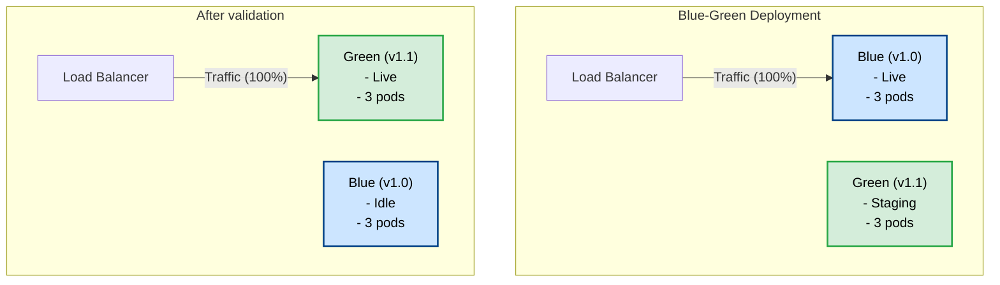
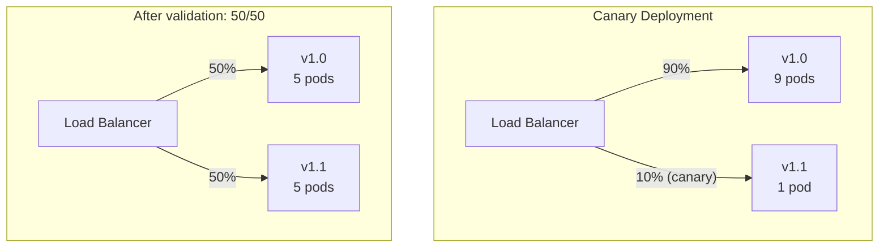

# Deployment Strategies

Comprehensive guide to **deployment strategies** for Whizbang applications - blue-green deployments, canary releases, rolling updates, feature flags, and safe rollback patterns.

---

## Deployment Strategy Comparison

| Strategy | Downtime | Risk | Rollback Speed | Cost |
|----------|----------|------|----------------|------|
| **Recreate** | ❌ Yes | ⚠️ High | Slow | Low |
| **Rolling Update** | ✅ No | ⚠️ Medium | Medium | Low |
| **Blue-Green** | ✅ No | ✅ Low | Fast | High |
| **Canary** | ✅ No | ✅ Very Low | Fast | Medium |

---

## Strategy 1: Blue-Green Deployment

**Zero downtime** - Run two identical environments (blue = production, green = staging), then swap.

### Architecture



### Kubernetes Manifests

**blue-deployment.yaml**:

```yaml{title="Kubernetes Manifests" description="**blue-deployment." category="Configuration" difficulty="INTERMEDIATE" tags=["Operations", "Deployment", "Kubernetes", "Manifests"]}
apiVersion: apps/v1
kind: Deployment
metadata:
  name: order-service-blue
  labels:
    app: order-service
    version: blue
spec:
  replicas: 3
  selector:
    matchLabels:
      app: order-service
      version: blue
  template:
    metadata:
      labels:
        app: order-service
        version: blue
    spec:
      containers:
      - name: order-service
        image: myregistry.azurecr.io/order-service:1.0.0
        ports:
        - containerPort: 8080
        env:
        - name: ASPNETCORE_ENVIRONMENT
          value: Production
```

**green-deployment.yaml**:

```yaml{title="Kubernetes Manifests (2)" description="**green-deployment." category="Configuration" difficulty="INTERMEDIATE" tags=["Operations", "Deployment", "Kubernetes", "Manifests"]}
apiVersion: apps/v1
kind: Deployment
metadata:
  name: order-service-green
  labels:
    app: order-service
    version: green
spec:
  replicas: 3
  selector:
    matchLabels:
      app: order-service
      version: green
  template:
    metadata:
      labels:
        app: order-service
        version: green
    spec:
      containers:
      - name: order-service
        image: myregistry.azurecr.io/order-service:1.1.0  # New version
        ports:
        - containerPort: 8080
        env:
        - name: ASPNETCORE_ENVIRONMENT
          value: Production
```

**service.yaml** (switch between blue/green):

```yaml{title="Kubernetes Manifests (3)" description="Kubernetes Manifests" category="Configuration" difficulty="INTERMEDIATE" tags=["Operations", "Deployment", "Kubernetes", "Manifests"]}
apiVersion: v1
kind: Service
metadata:
  name: order-service
spec:
  selector:
    app: order-service
    version: blue  # Switch to "green" after validation
  ports:
  - protocol: TCP
    port: 80
    targetPort: 8080
  type: LoadBalancer
```

### GitHub Actions Workflow

**.github/workflows/blue-green-deploy.yml**:

```yaml{title="GitHub Actions Workflow" description="GitHub Actions Workflow" category="Configuration" difficulty="ADVANCED" tags=["Operations", "Deployment", "GitHub", "Actions"]}
name: Blue-Green Deployment

on:
  push:
    branches: [main]

jobs:
  deploy:
    runs-on: ubuntu-latest
    steps:
      - uses: actions/checkout@v4

      - name: Build and push Docker image
        run: |
          docker build -t myregistry.azurecr.io/order-service:${{ github.sha }} .
          docker push myregistry.azurecr.io/order-service:${{ github.sha }}

      - name: Deploy to Green environment
        run: |
          kubectl set image deployment/order-service-green \
            order-service=myregistry.azurecr.io/order-service:${{ github.sha }}
          kubectl rollout status deployment/order-service-green

      - name: Run smoke tests on Green
        run: |
          GREEN_URL=$(kubectl get svc order-service-green -o jsonpath='{.status.loadBalancer.ingress[0].ip}')
          curl -f http://$GREEN_URL/health || exit 1

      - name: Switch traffic to Green
        run: |
          kubectl patch svc order-service -p '{"spec":{"selector":{"version":"green"}}}'

      - name: Wait for traffic switch
        run: sleep 30

      - name: Verify production traffic
        run: |
          curl -f http://order-service.myapp.com/health || exit 1

      - name: Scale down Blue (keep for rollback)
        run: |
          kubectl scale deployment/order-service-blue --replicas=1
```

### Rollback

```bash{title="Rollback" description="Rollback" category="Configuration" difficulty="BEGINNER" tags=["Operations", "Deployment", "Rollback"]}
# Instant rollback: Switch service back to blue
kubectl patch svc order-service -p '{"spec":{"selector":{"version":"blue"}}}'

# Scale blue back up
kubectl scale deployment/order-service-blue --replicas=3
```

---

## Strategy 2: Canary Deployment

**Gradual rollout** - Deploy new version to small percentage of users, then gradually increase.

### Architecture



### Kubernetes with Istio

**virtualservice.yaml**:

```yaml{title="Kubernetes with Istio" description="**virtualservice." category="Configuration" difficulty="INTERMEDIATE" tags=["Operations", "Deployment", "Kubernetes", "Istio"]}
apiVersion: networking.istio.io/v1beta1
kind: VirtualService
metadata:
  name: order-service
spec:
  hosts:
  - order-service.myapp.com
  http:
  - match:
    - headers:
        canary:
          exact: "true"  # Users with canary header get v1.1
    route:
    - destination:
        host: order-service
        subset: v1-1
      weight: 100
  - route:
    - destination:
        host: order-service
        subset: v1-0
      weight: 90  # 90% of traffic to v1.0
    - destination:
        host: order-service
        subset: v1-1
      weight: 10  # 10% of traffic to v1.1 (canary)
```

**destinationrule.yaml**:

```yaml{title="Kubernetes with Istio (2)" description="**destinationrule." category="Configuration" difficulty="INTERMEDIATE" tags=["Operations", "Deployment", "Kubernetes", "Istio"]}
apiVersion: networking.istio.io/v1beta1
kind: DestinationRule
metadata:
  name: order-service
spec:
  host: order-service
  subsets:
  - name: v1-0
    labels:
      version: "1.0.0"
  - name: v1-1
    labels:
      version: "1.1.0"
```

### Gradual Rollout Script

**canary-rollout.sh**:

```bash{title="Gradual Rollout Script" description="**canary-rollout." category="Configuration" difficulty="ADVANCED" tags=["Operations", "Deployment", "Gradual", "Rollout"]}
#!/bin/bash

WEIGHTS=(
  "90:10"   # Stage 1: 10% canary
  "75:25"   # Stage 2: 25% canary
  "50:50"   # Stage 3: 50% canary
  "25:75"   # Stage 4: 75% canary
  "0:100"   # Stage 5: 100% canary (full rollout)
)

for WEIGHT in "${WEIGHTS[@]}"; do
  IFS=':' read -r OLD_WEIGHT NEW_WEIGHT <<< "$WEIGHT"

  echo "Shifting traffic: $OLD_WEIGHT% v1.0, $NEW_WEIGHT% v1.1"

  kubectl apply -f - <<EOF
apiVersion: networking.istio.io/v1beta1
kind: VirtualService
metadata:
  name: order-service
spec:
  hosts:
  - order-service.myapp.com
  http:
  - route:
    - destination:
        host: order-service
        subset: v1-0
      weight: $OLD_WEIGHT
    - destination:
        host: order-service
        subset: v1-1
      weight: $NEW_WEIGHT
EOF

  echo "Waiting 5 minutes for metrics..."
  sleep 300

  # Check error rate
  ERROR_RATE=$(curl -s "http://prometheus:9090/api/v1/query?query=error_rate" | jq '.data.result[0].value[1]')

  if (( $(echo "$ERROR_RATE > 5" | bc -l) )); then
    echo "ERROR: Error rate exceeded 5% ($ERROR_RATE%). Rolling back."
    kubectl apply -f virtualservice-v1.0.yaml  # Rollback to 100% v1.0
    exit 1
  fi

  echo "Metrics look good. Proceeding to next stage."
done

echo "Canary deployment complete!"
```

---

## Strategy 3: Rolling Update

**Default Kubernetes strategy** - Replace pods one-by-one.

### Deployment Manifest

**deployment.yaml**:

```yaml{title="Deployment Manifest" description="**deployment." category="Configuration" difficulty="ADVANCED" tags=["Operations", "Deployment", "Yaml", "Manifest"]}
apiVersion: apps/v1
kind: Deployment
metadata:
  name: order-service
spec:
  replicas: 10
  strategy:
    type: RollingUpdate
    rollingUpdate:
      maxUnavailable: 1  # Max 1 pod unavailable during update
      maxSurge: 2        # Max 2 extra pods during update
  selector:
    matchLabels:
      app: order-service
  template:
    metadata:
      labels:
        app: order-service
    spec:
      containers:
      - name: order-service
        image: myregistry.azurecr.io/order-service:1.1.0
        ports:
        - containerPort: 8080
        readinessProbe:
          httpGet:
            path: /health/ready
            port: 8080
          initialDelaySeconds: 10
          periodSeconds: 5
        livenessProbe:
          httpGet:
            path: /health/live
            port: 8080
          initialDelaySeconds: 30
          periodSeconds: 10
```

### Rollout

```bash{title="Rollout" description="Rollout" category="Configuration" difficulty="INTERMEDIATE" tags=["Operations", "Deployment", "Rollout"]}
# Apply new version
kubectl apply -f deployment.yaml

# Watch rollout progress
kubectl rollout status deployment/order-service

# Output:
# Waiting for deployment "order-service" rollout to finish: 2 out of 10 new replicas have been updated...
# Waiting for deployment "order-service" rollout to finish: 5 out of 10 new replicas have been updated...
# Waiting for deployment "order-service" rollout to finish: 8 out of 10 new replicas have been updated...
# deployment "order-service" successfully rolled out
```

### Rollback

```bash{title="Rollback (2)" description="Rollback (2)" category="Configuration" difficulty="BEGINNER" tags=["Operations", "Deployment", "Rollback"]}
# Rollback to previous version
kubectl rollout undo deployment/order-service

# Rollback to specific revision
kubectl rollout undo deployment/order-service --to-revision=3

# View rollout history
kubectl rollout history deployment/order-service
```

---

## Strategy 4: Recreate (Downtime)

**Simple but with downtime** - Terminate all old pods, then start new pods.

**deployment.yaml**:

```yaml{title="Strategy 4: Recreate (Downtime)" description="**deployment." category="Configuration" difficulty="INTERMEDIATE" tags=["Operations", "Deployment", "Strategy", "Recreate"]}
apiVersion: apps/v1
kind: Deployment
metadata:
  name: order-service
spec:
  replicas: 3
  strategy:
    type: Recreate  # ❌ Causes downtime
  selector:
    matchLabels:
      app: order-service
  template:
    metadata:
      labels:
        app: order-service
    spec:
      containers:
      - name: order-service
        image: myregistry.azurecr.io/order-service:1.1.0
```

**When to use**:
- ⚠️ Only for non-critical services
- ⚠️ When database migrations require downtime
- ⚠️ Development/staging environments

---

## Feature Flags

**Decouple deployment from release** - Deploy new code with features disabled, then enable via feature flags.

### LaunchDarkly Integration

**Program.cs**:

```csharp{title="LaunchDarkly Integration" description="LaunchDarkly Integration" category="Configuration" difficulty="BEGINNER" tags=["Operations", "Deployment", "LaunchDarkly", "Integration"]}
builder.Services.AddSingleton<ILdClient>(sp => {
  var config = Configuration.Builder(builder.Configuration["LaunchDarkly:SdkKey"])
    .Build();
  return new LdClient(config);
});
```

**Usage**:

```csharp{title="LaunchDarkly Integration - CreateOrderReceptor" description="LaunchDarkly Integration - CreateOrderReceptor" category="Configuration" difficulty="INTERMEDIATE" tags=["Operations", "Deployment", "LaunchDarkly", "Integration"]}
public class CreateOrderReceptor(ILdClient featureFlags) : IReceptor<CreateOrderCommand, OrderCreatedEvent> {

  public async ValueTask<OrderCreatedEvent> HandleAsync(
    CreateOrderCommand command,
    CancellationToken cancellationToken = default
  ) {
    var ldContext = Context.New(command.CustomerId.ToString());

    // Check feature flag (LaunchDarkly evaluates from its in-memory store)
    var useNewPricingEngine = featureFlags.BoolVariation(
      "new-pricing-engine",
      ldContext,
      defaultValue: false
    );

    var totalAmount = useNewPricingEngine
      ? CalculateTotalWithNewEngine(command.LineItems)
      : CalculateTotalWithOldEngine(command.LineItems);

    // Process order...

    return new OrderCreatedEvent {
      OrderId = command.OrderId,
      CustomerId = command.CustomerId,
      LineItems = command.LineItems,
      TotalAmount = totalAmount,
      CreatedAt = DateTime.UtcNow
    };
  }
}
```

Whizbang receptors return `ValueTask` / `ValueTask<TResponse>` from `HandleAsync` (see `IReceptor<TMessage, TResponse>`), so flag evaluation composes naturally with async business logic.

### Gradual Rollout with Feature Flags

```csharp{title="Gradual Rollout with Feature Flags" description="Gradual Rollout with Feature Flags" category="Configuration" difficulty="BEGINNER" tags=["Operations", "Deployment", "Gradual", "Rollout"]}
// LaunchDarkly dashboard:
// Day 1: Enable for 10% of users
// Day 2: Enable for 25% of users
// Day 3: Enable for 50% of users
// Day 4: Enable for 100% of users

// Rollback: Disable feature flag instantly (no deployment needed)
```

---

## Database Migrations

### Backward-Compatible Migrations

**Step 1: Add new column (optional)**:

```sql{title="Backward-Compatible Migrations" description="Step 1: Add new column (optional):" category="Configuration" difficulty="BEGINNER" tags=["Operations", "Deployment", "Backward-Compatible", "Migrations"]}
ALTER TABLE orders ADD COLUMN payment_method TEXT NULL;
```

**Step 2: Deploy new code** (reads from `payment_method` if present, falls back to old logic)

**Step 3: Backfill data**:

```sql{title="Backward-Compatible Migrations (2)" description="Step 3: Backfill data:" category="Configuration" difficulty="BEGINNER" tags=["Operations", "Deployment", "Backward-Compatible", "Migrations"]}
UPDATE orders SET payment_method = 'credit_card' WHERE payment_method IS NULL;
```

**Step 4: Make column required**:

```sql{title="Backward-Compatible Migrations (3)" description="Step 4: Make column required:" category="Configuration" difficulty="BEGINNER" tags=["Operations", "Deployment", "Backward-Compatible", "Migrations"]}
ALTER TABLE orders ALTER COLUMN payment_method SET NOT NULL;
```

### Expand-Contract Pattern

**Expand phase**:
1. Add new column/table (optional)
2. Deploy code that writes to both old and new schema
3. Backfill data

**Contract phase**:
1. Deploy code that reads from new schema only
2. Remove old column/table

---

## Health Check Gates

**Prevent traffic to unhealthy pods**:

**deployment.yaml**:

```yaml{title="Health Check Gates" description="**deployment." category="Configuration" difficulty="INTERMEDIATE" tags=["Operations", "Deployment", "Health", "Check"]}
readinessProbe:
  httpGet:
    path: /health/ready
    port: 8080
  initialDelaySeconds: 10
  periodSeconds: 5
  failureThreshold: 3

livenessProbe:
  httpGet:
    path: /health/live
    port: 8080
  initialDelaySeconds: 30
  periodSeconds: 10
  failureThreshold: 3
```

**ReadinessProbe**: Pod receives traffic only when `/health/ready` returns 200
**LivenessProbe**: Kubernetes restarts pod if `/health/live` fails

The probe paths are whatever your app maps with ASP.NET Core's `MapHealthChecks(...)`. Whizbang packages contribute named checks to the standard health-check pipeline automatically:

- `subscriptions` (tags `transport`, `subscriptions`) - transport subscription state, reports `Degraded` when some subscriptions are down (Whizbang.Core)
- `whizbang_postgres` - Postgres storage driver connectivity (Whizbang.Data.Dapper.Postgres)
- `azure_servicebus` - Azure Service Bus transport connectivity (Whizbang.Transports.AzureServiceBus)
- `rabbitmq` - RabbitMQ transport connectivity, opt-in via `AddRabbitMQHealthChecks()` (Whizbang.Transports.RabbitMQ)

Gate your **readiness** endpoint on these so pods stop receiving traffic while the transport or database is unavailable; keep **liveness** limited to a self check so transient dependency outages don't cause restart loops.

---

## Pre-Deployment Checks

**pre-deploy.sh**:

```bash{title="Pre-Deployment Checks" description="**pre-deploy." category="Configuration" difficulty="INTERMEDIATE" tags=["Operations", "Deployment", "Pre-Deployment", "Checks"]}
#!/bin/bash

echo "Running pre-deployment checks..."

# 1. Check database connectivity
echo "Checking database..."
psql $DATABASE_URL -c "SELECT 1" > /dev/null || {
  echo "ERROR: Database unreachable"
  exit 1
}

# 2. Run database migrations
echo "Running migrations..."
dotnet ef database update || {
  echo "ERROR: Migrations failed"
  exit 1
}

# 3. Run integration tests
echo "Running integration tests..."
dotnet test --filter Category=Integration || {
  echo "ERROR: Integration tests failed"
  exit 1
}

# 4. Check external dependencies
echo "Checking external dependencies..."
curl -f https://api.stripe.com/v1/health || {
  echo "ERROR: Stripe API unreachable"
  exit 1
}

echo "Pre-deployment checks passed!"
```

---

## Post-Deployment Verification

**post-deploy.sh**:

```bash{title="Post-Deployment Verification" description="**post-deploy." category="Configuration" difficulty="INTERMEDIATE" tags=["Operations", "Deployment", "Post-Deployment", "Verification"]}
#!/bin/bash

echo "Running post-deployment verification..."

# 1. Health check
echo "Checking health endpoint..."
curl -f https://order-service.myapp.com/health || {
  echo "ERROR: Health check failed"
  exit 1
}

# 2. Smoke tests
echo "Running smoke tests..."
ORDER_ID=$(curl -s -X POST https://order-service.myapp.com/orders \
  -H "Content-Type: application/json" \
  -d '{"customerId":"test-123","items":[{"productId":"prod-456","quantity":1,"unitPrice":19.99}]}' \
  | jq -r '.orderId')

curl -f https://order-service.myapp.com/orders/$ORDER_ID || {
  echo "ERROR: Smoke test failed"
  exit 1
}

# 3. Check metrics
echo "Checking error rate..."
ERROR_RATE=$(curl -s "http://prometheus:9090/api/v1/query?query=error_rate" | jq -r '.data.result[0].value[1]')

if (( $(echo "$ERROR_RATE > 5" | bc -l) )); then
  echo "ERROR: Error rate exceeded 5% ($ERROR_RATE%)"
  exit 1
fi

echo "Post-deployment verification passed!"
```

---

## Key Takeaways

✅ **Blue-Green** - Zero downtime, instant rollback, high cost (2x resources)
✅ **Canary** - Gradual rollout, low risk, requires traffic splitting (Istio)
✅ **Rolling Update** - Default Kubernetes strategy, medium risk
✅ **Feature Flags** - Decouple deployment from release
✅ **Backward-Compatible Migrations** - Avoid downtime during schema changes
✅ **Health Checks** - Prevent traffic to unhealthy pods
✅ **Pre/Post-Deployment Checks** - Automated verification

---

## Decision Matrix

| Use Case | Recommended Strategy |
|----------|---------------------|
| **Critical production services** | Blue-Green or Canary |
| **Standard services** | Rolling Update |
| **Feature releases** | Feature Flags + Rolling Update |
| **Database migrations** | Expand-Contract + Blue-Green |
| **Non-critical services** | Rolling Update or Recreate |

---

*Version 1.0.0 - Foundation Release | Last Updated: 2024-12-12*
