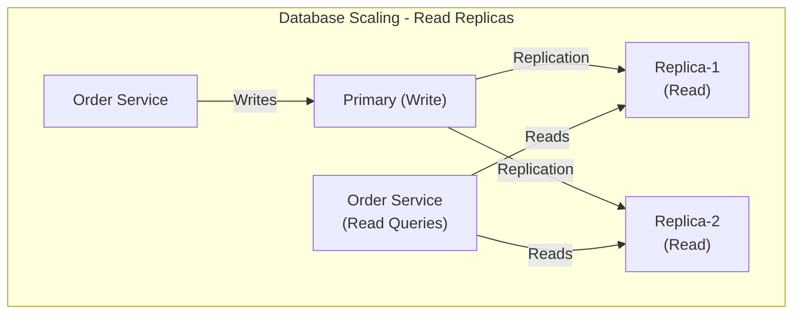

# Scaling Patterns

Comprehensive guide to **scaling Whizbang applications** - horizontal autoscaling, database partitioning, load balancing strategies, and performance optimization under load.

---

## Scaling Approaches

| Approach | When to Use | Cost | Complexity |
|----------|-------------|------|------------|
| **Vertical Scaling** | Quick fix, single database | Medium | Low |
| **Horizontal Scaling** | Production systems | Low per unit | Medium |
| **Database Partitioning** | > 100M rows | Medium | High |
| **Read Replicas** | Read-heavy workloads | Medium | Low |

---

## Horizontal Pod Autoscaling (HPA)

**Automatically scale pods** based on CPU, memory, or custom metrics.

### CPU-Based Autoscaling

**hpa.yaml**:

```yaml{title="CPU-Based Autoscaling" description="CPU-Based Autoscaling" category="Configuration" difficulty="ADVANCED" tags=["Operations", "Deployment", "CPU-Based", "Autoscaling"]}
apiVersion: autoscaling/v2
kind: HorizontalPodAutoscaler
metadata:
  name: order-service-hpa
spec:
  scaleTargetRef:
    apiVersion: apps/v1
    kind: Deployment
    name: order-service
  minReplicas: 3
  maxReplicas: 100
  metrics:
  - type: Resource
    resource:
      name: cpu
      target:
        type: Utilization
        averageUtilization: 70  # Target 70% CPU
  behavior:
    scaleUp:
      stabilizationWindowSeconds: 60  # Wait 60s before scaling up
      policies:
      - type: Percent
        value: 50  # Scale up by 50% of current pods
        periodSeconds: 60
      - type: Pods
        value: 5  # Or add 5 pods (whichever is larger)
        periodSeconds: 60
    scaleDown:
      stabilizationWindowSeconds: 300  # Wait 5min before scaling down
      policies:
      - type: Percent
        value: 10  # Scale down by 10% of current pods
        periodSeconds: 60
```

**deployment.yaml** (with resource limits):

```yaml{title="CPU-Based Autoscaling (2)" description="**deployment." category="Configuration" difficulty="INTERMEDIATE" tags=["Operations", "Deployment", "CPU-Based", "Autoscaling"]}
apiVersion: apps/v1
kind: Deployment
metadata:
  name: order-service
spec:
  replicas: 3
  template:
    spec:
      containers:
      - name: order-service
        image: myregistry.azurecr.io/order-service:1.0.0
        resources:
          requests:
            cpu: 500m      # 0.5 CPU cores
            memory: 512Mi
          limits:
            cpu: 1000m     # 1 CPU core
            memory: 1Gi
```

### Custom Metrics Autoscaling

**hpa-custom.yaml**:

```yaml{title="Custom Metrics Autoscaling" description="**hpa-custom." category="Configuration" difficulty="ADVANCED" tags=["Operations", "Deployment", "Custom", "Metrics"]}
apiVersion: autoscaling/v2
kind: HorizontalPodAutoscaler
metadata:
  name: order-service-hpa
spec:
  scaleTargetRef:
    apiVersion: apps/v1
    kind: Deployment
    name: order-service
  minReplicas: 3
  maxReplicas: 100
  metrics:
  - type: Pods
    pods:
      metric:
        name: http_requests_per_second
      target:
        type: AverageValue
        averageValue: "1000"  # 1000 req/sec per pod
  - type: Pods
    pods:
      metric:
        name: whizbang_queue_estimated_depth  # Whizbang.TableStatistics gauge (queue_name="outbox")
      target:
        type: AverageValue
        averageValue: "100"  # 100 unprocessed messages per pod
```

**Expose custom metrics** (Prometheus Adapter):

```yaml{title="Custom Metrics Autoscaling (2)" description="Expose custom metrics (Prometheus Adapter):" category="Configuration" difficulty="ADVANCED" tags=["Operations", "Deployment", "Custom", "Metrics"]}
apiVersion: v1
kind: ConfigMap
metadata:
  name: adapter-config
data:
  config.yaml: |
    rules:
    - seriesQuery: 'http_requests_total{namespace="production"}'
      resources:
        overrides:
          namespace: {resource: "namespace"}
          pod: {resource: "pod"}
      name:
        matches: "^http_requests_total$"
        as: "http_requests_per_second"
      metricsQuery: 'rate(http_requests_total[1m])'
```

---

## Database Scaling

### Read Replicas

**PostgreSQL with read replicas**:



**Connection factory**:

```csharp{title="Read Replicas" description="Connection factory:" category="Configuration" difficulty="INTERMEDIATE" tags=["Operations", "Deployment", "Read", "Replicas"]}
public interface IDbConnectionFactory {
  Task<IDbConnection> CreateWriteConnectionAsync(CancellationToken ct = default);
  Task<IDbConnection> CreateReadConnectionAsync(CancellationToken ct = default);
}

public class PostgresConnectionFactory : IDbConnectionFactory {
  private readonly IConfiguration _config;
  private readonly Random _random = new();

  public async Task<IDbConnection> CreateWriteConnectionAsync(CancellationToken ct) {
    var connectionString = _config["Database:Primary:ConnectionString"];
    var connection = new NpgsqlConnection(connectionString);
    await connection.OpenAsync(ct);
    return connection;
  }

  public async Task<IDbConnection> CreateReadConnectionAsync(CancellationToken ct) {
    // Load balance across read replicas
    var replicas = _config.GetSection("Database:ReadReplicas").Get<string[]>();
    var connectionString = replicas[_random.Next(replicas.Length)];

    var connection = new NpgsqlConnection(connectionString);
    await connection.OpenAsync(ct);
    return connection;
  }
}
```

**appsettings.json**:

```json{title="Read Replicas (2)" description="**appsettings." category="Configuration" difficulty="INTERMEDIATE" tags=["Operations", "Deployment", "Read", "Replicas"]}
{
  "Database": {
    "Primary": {
      "ConnectionString": "Host=primary.postgres;Database=orders;..."
    },
    "ReadReplicas": [
      "Host=replica1.postgres;Database=orders;...",
      "Host=replica2.postgres;Database=orders;..."
    ]
  }
}
```

**Usage**:

```csharp{title="Read Replicas (3)" description="Read Replicas" category="Configuration" difficulty="INTERMEDIATE" tags=["Operations", "Deployment", "Read", "Replicas"]}
// Write operations use primary
public async ValueTask<OrderCreatedEvent> HandleAsync(CreateOrderCommand command, CancellationToken ct = default) {
  await using var connection = await _dbFactory.CreateWriteConnectionAsync(ct);
  // Insert order...
}

// Read operations use replicas
public async Task<OrderRow?> GetOrderAsync(Guid orderId, CancellationToken ct) {
  await using var connection = await _dbFactory.CreateReadConnectionAsync(ct);
  return await connection.QuerySingleOrDefaultAsync<OrderRow>(
    "SELECT * FROM orders WHERE order_id = @OrderId",
    new { OrderId = orderId }
  );
}
```

**Important**: point **Whizbang's own connection string at the primary** - the outbox/inbox pipeline and perspective materialization are write-heavy and depend on read-your-writes consistency. Use replicas only for application-level read paths that tolerate replication lag.

### Table Partitioning

**Partition by date** (e.g., monthly partitions):

```sql{title="Table Partitioning" description="Partition by date (e." category="Configuration" difficulty="INTERMEDIATE" tags=["Operations", "Deployment", "Table", "Partitioning"]}
-- Create partitioned table
CREATE TABLE orders (
  order_id UUID NOT NULL,
  customer_id TEXT NOT NULL,
  total_amount DECIMAL(18,2) NOT NULL,
  created_at TIMESTAMP NOT NULL
) PARTITION BY RANGE (created_at);

-- Create partitions
CREATE TABLE orders_2024_12 PARTITION OF orders
  FOR VALUES FROM ('2024-12-01') TO ('2025-01-01');

CREATE TABLE orders_2025_01 PARTITION OF orders
  FOR VALUES FROM ('2025-01-01') TO ('2025-02-01');

CREATE TABLE orders_2025_02 PARTITION OF orders
  FOR VALUES FROM ('2025-02-01') TO ('2025-03-01');

-- Create indexes on each partition
CREATE INDEX idx_orders_2024_12_customer ON orders_2024_12(customer_id);
CREATE INDEX idx_orders_2025_01_customer ON orders_2025_01(customer_id);
CREATE INDEX idx_orders_2025_02_customer ON orders_2025_02(customer_id);
```

**Automated partition management**:

```csharp{title="Table Partitioning - PartitionManagementService" description="Automated partition management:" category="Configuration" difficulty="ADVANCED" tags=["Operations", "Deployment", "Table", "Partitioning"]}
public class PartitionManagementService : BackgroundService {
  private readonly IDbConnection _db;
  private readonly ILogger<PartitionManagementService> _logger;

  protected override async Task ExecuteAsync(CancellationToken ct) {
    while (!ct.IsCancellationRequested) {
      try {
        await CreateNextMonthPartitionAsync(ct);
        await DropOldPartitionsAsync(ct);
      } catch (Exception ex) {
        _logger.LogError(ex, "Failed to manage partitions");
      }

      // Run daily
      await Task.Delay(TimeSpan.FromDays(1), ct);
    }
  }

  private async Task CreateNextMonthPartitionAsync(CancellationToken ct) {
    var nextMonth = DateTime.UtcNow.AddMonths(2).ToString("yyyy-MM");
    var startDate = $"{nextMonth}-01";
    var endDate = DateTime.Parse(startDate).AddMonths(1).ToString("yyyy-MM-dd");

    _logger.LogInformation("Creating partition for {NextMonth}", nextMonth);

    await _db.ExecuteAsync($"""
      CREATE TABLE IF NOT EXISTS orders_{nextMonth.Replace("-", "_")} PARTITION OF orders
        FOR VALUES FROM ('{startDate}') TO ('{endDate}')
      """);

    await _db.ExecuteAsync($"""
      CREATE INDEX IF NOT EXISTS idx_orders_{nextMonth.Replace("-", "_")}_customer
        ON orders_{nextMonth.Replace("-", "_")}(customer_id)
      """);
  }

  private async Task DropOldPartitionsAsync(CancellationToken ct) {
    // Drop partitions older than 2 years
    var cutoffDate = DateTime.UtcNow.AddYears(-2);
    var cutoffMonth = cutoffDate.ToString("yyyy_MM");

    _logger.LogInformation("Dropping partitions older than {CutoffMonth}", cutoffMonth);

    await _db.ExecuteAsync($"DROP TABLE IF EXISTS orders_{cutoffMonth}");
  }
}
```

### Partition by Hash (Customer ID)

```sql{title="Partition by Hash (Customer ID)" description="Partition by Hash (Customer ID)" category="Configuration" difficulty="ADVANCED" tags=["Operations", "Deployment", "Partition", "Hash"]}
-- Partition by hash (distribute evenly across partitions)
CREATE TABLE orders (
  order_id UUID NOT NULL,
  customer_id TEXT NOT NULL,
  total_amount DECIMAL(18,2) NOT NULL,
  created_at TIMESTAMP NOT NULL
) PARTITION BY HASH (customer_id);

-- Create 8 partitions
CREATE TABLE orders_0 PARTITION OF orders FOR VALUES WITH (MODULUS 8, REMAINDER 0);
CREATE TABLE orders_1 PARTITION OF orders FOR VALUES WITH (MODULUS 8, REMAINDER 1);
CREATE TABLE orders_2 PARTITION OF orders FOR VALUES WITH (MODULUS 8, REMAINDER 2);
CREATE TABLE orders_3 PARTITION OF orders FOR VALUES WITH (MODULUS 8, REMAINDER 3);
CREATE TABLE orders_4 PARTITION OF orders FOR VALUES WITH (MODULUS 8, REMAINDER 4);
CREATE TABLE orders_5 PARTITION OF orders FOR VALUES WITH (MODULUS 8, REMAINDER 5);
CREATE TABLE orders_6 PARTITION OF orders FOR VALUES WITH (MODULUS 8, REMAINDER 6);
CREATE TABLE orders_7 PARTITION OF orders FOR VALUES WITH (MODULUS 8, REMAINDER 7);
```

**Benefits**:
- ✅ Queries scan only relevant partition(s)
- ✅ Easier maintenance (drop old partitions)
- ✅ Better index performance (smaller indexes)

---

## Outbox/Inbox Work Distribution (Built In)

You don't shard Whizbang's queues or write claim SQL yourself - horizontal scaling of the message pipeline is the library's job:

- **Add pods, get throughput**: each pod runs a `ClaimWorker` that claims pending work from `wh_outbox` / `wh_inbox` through the `process_work_batch` database function. Claiming uses skip-locked semantics, so competing pods never grab the same work and no static partition assignment (pod ordinals, partition numbers) is required.
- **Poller claims stream IDs, drainers fetch bodies**: the claim pass returns *stream identifiers only*; per-stream drain workers (`OutboxDrainWorker`, `InboxDrainWorker`) then fetch and process the message bodies. This split makes double-processing structurally impossible rather than merely unlikely.
- **Per-stream ordering is preserved**: a stream is processed by one pod at a time (cross-pod stream pinning plus per-stream serialization inside `PerspectiveWorker`), so scaling out never reorders a stream's events. Parallelism grows **across** streams.
- **Completed work is deleted**: finished `wh_outbox` / `wh_inbox` rows are removed on completion, keeping claim scans fast without manual partition maintenance.

**What you tune instead of building**: `MessageProcessingOptions.MaxConcurrentMessages` (per-pod handler concurrency), the inbox/outbox batch window options, and your pod replica count (HPA). Watch `whizbang.work_coordinator.*` and `whizbang.queue.estimated_depth` metrics to decide when to scale.

---

## Load Balancing

### Service Mesh (Istio)

**destinationrule.yaml** (connection pool settings):

```yaml{title="Service Mesh (Istio)" description="**destinationrule." category="Configuration" difficulty="INTERMEDIATE" tags=["Operations", "Deployment", "Service", "Mesh"]}
apiVersion: networking.istio.io/v1beta1
kind: DestinationRule
metadata:
  name: order-service
spec:
  host: order-service
  trafficPolicy:
    connectionPool:
      tcp:
        maxConnections: 100
      http:
        http1MaxPendingRequests: 50
        http2MaxRequests: 100
        maxRequestsPerConnection: 2
    loadBalancer:
      simple: LEAST_REQUEST  # Route to pod with fewest active requests
    outlierDetection:
      consecutiveErrors: 5
      interval: 30s
      baseEjectionTime: 30s
      maxEjectionPercent: 50
```

### Sticky Sessions (Session Affinity)

**service.yaml**:

```yaml{title="Sticky Sessions (Session Affinity)" description="Sticky Sessions (Session Affinity)" category="Configuration" difficulty="INTERMEDIATE" tags=["Operations", "Deployment", "Sticky", "Sessions"]}
apiVersion: v1
kind: Service
metadata:
  name: order-service
spec:
  selector:
    app: order-service
  sessionAffinity: ClientIP  # Route same client to same pod
  sessionAffinityConfig:
    clientIP:
      timeoutSeconds: 3600  # 1 hour
  ports:
  - protocol: TCP
    port: 80
    targetPort: 8080
```

---

## Caching

### Distributed Cache (Redis)

**Program.cs**:

```csharp{title="Distributed Cache (Redis)" description="Distributed Cache (Redis)" category="Configuration" difficulty="BEGINNER" tags=["Operations", "Deployment", "Distributed", "Cache"]}
builder.Services.AddStackExchangeRedisCache(options => {
  options.Configuration = builder.Configuration["Redis:ConnectionString"];
  options.InstanceName = "whizbang:";
});
```

**Usage**:

```csharp{title="Distributed Cache (Redis) - GetOrderReceptor" description="Distributed Cache (Redis) - GetOrderReceptor" category="Configuration" difficulty="INTERMEDIATE" tags=["Operations", "Deployment", "Distributed", "Cache"]}
public class GetOrderReceptor : IReceptor<GetOrderQuery, OrderRow?> {
  private readonly IDistributedCache _cache;
  private readonly IDbConnection _db;

  public async ValueTask<OrderRow?> HandleAsync(GetOrderQuery query, CancellationToken ct = default) {
    var cacheKey = $"order:{query.OrderId}";

    // Try cache first
    var cached = await _cache.GetStringAsync(cacheKey, ct);
    if (cached != null) {
      return JsonSerializer.Deserialize<OrderRow>(cached);
    }

    // Cache miss - query database
    var order = await _db.QuerySingleOrDefaultAsync<OrderRow>(
      "SELECT * FROM orders WHERE order_id = @OrderId",
      new { OrderId = query.OrderId }
    );

    if (order != null) {
      // Cache for 5 minutes
      await _cache.SetStringAsync(
        cacheKey,
        JsonSerializer.Serialize(order),
        new DistributedCacheEntryOptions {
          AbsoluteExpirationRelativeToNow = TimeSpan.FromMinutes(5)
        },
        ct
      );
    }

    return order;
  }
}
```

### Cache Invalidation

Perspectives are pure `Apply` functions - side effects like cache invalidation belong in a **lifecycle receptor**. `PostPerspectiveInline` fires after the perspective row is committed, so evicting there can never resurrect stale data:

```csharp{title="Cache Invalidation" description="Cache-evicting lifecycle receptor at PostPerspectiveInline" category="Configuration" difficulty="INTERMEDIATE" tags=["Operations", "Deployment", "Cache", "Invalidation"]}
[FireAt(LifecycleStage.PostPerspectiveInline)]  // after perspective data is committed
public sealed class OrderCacheInvalidationReceptor(IDistributedCache cache)
  : IReceptor<OrderCreatedEvent> {

  public async ValueTask HandleAsync(OrderCreatedEvent @event, CancellationToken cancellationToken = default) {
    await cache.RemoveAsync($"order:{@event.OrderId}", cancellationToken);
  }
}
```

---

## Connection Pooling

### Npgsql Connection Pool

**appsettings.json**:

```json{title="Npgsql Connection Pool" description="**appsettings." category="Configuration" difficulty="BEGINNER" tags=["Operations", "Deployment", "Npgsql", "Connection"]}
{
  "Database": {
    "ConnectionString": "Host=postgres;Database=orders;Username=app;Password=***;Pooling=true;MinPoolSize=10;MaxPoolSize=100;ConnectionIdleLifetime=300"
  }
}
```

**Connection pool metrics**: Npgsql publishes pool metrics (open/busy/idle connections, pending requests) through its built-in `Npgsql` meter - no custom gauge code required:

```csharp{title="Npgsql Connection Pool - Metrics" description="Subscribe to Npgsql's built-in meter" category="Configuration" difficulty="INTERMEDIATE" tags=["Operations", "Deployment", "Npgsql", "Connection"]}
builder.Services.AddOpenTelemetry()
  .WithMetrics(metrics => {
    metrics
      .AddMeter("Whizbang.*")
      .AddMeter("Npgsql");  // connection pool gauges (npgsql.connections.*, etc.)
  });
```

Size `MaxPoolSize` against `MessageProcessingOptions.MaxConcurrentMessages` - each concurrent Whizbang message handler holds a pooled connection during its `process_work_batch` flush, and the default of 40 assumes a 100-connection pool with headroom.

---

## Rate Limiting

### Distributed Rate Limiting (Redis)

**RateLimitingMiddleware.cs**:

```csharp{title="Distributed Rate Limiting (Redis)" description="**RateLimitingMiddleware." category="Configuration" difficulty="INTERMEDIATE" tags=["Operations", "Deployment", "Distributed", "Rate"]}
public class RateLimitingMiddleware {
  private readonly RequestDelegate _next;
  private readonly IDistributedCache _cache;

  public async Task InvokeAsync(HttpContext context) {
    var userId = context.User.FindFirst(ClaimTypes.NameIdentifier)?.Value ?? "anonymous";
    var key = $"rate-limit:{userId}:{DateTime.UtcNow:yyyyMMddHHmm}";

    var countStr = await _cache.GetStringAsync(key);
    var count = int.Parse(countStr ?? "0");

    if (count >= 100) {
      context.Response.StatusCode = 429;
      await context.Response.WriteAsync("Rate limit exceeded");
      return;
    }

    await _cache.SetStringAsync(
      key,
      (count + 1).ToString(),
      new DistributedCacheEntryOptions {
        AbsoluteExpirationRelativeToNow = TimeSpan.FromMinutes(1)
      }
    );

    await _next(context);
  }
}
```

---

## Load Testing

### k6 Load Test

**load-test.js**:

```javascript{title="k6 Load Test" description="**load-test." category="Configuration" difficulty="ADVANCED" tags=["Operations", "Deployment", "Load", "Test"]}
import http from 'k6/http';
import { check, sleep } from 'k6';

export const options = {
  stages: [
    { duration: '2m', target: 100 },   // Ramp up to 100 users
    { duration: '5m', target: 100 },   // Stay at 100 users
    { duration: '2m', target: 200 },   // Ramp up to 200 users
    { duration: '5m', target: 200 },   // Stay at 200 users
    { duration: '2m', target: 0 },     // Ramp down to 0
  ],
  thresholds: {
    http_req_duration: ['p(95)<500'],  // 95% of requests < 500ms
    http_req_failed: ['rate<0.01'],    // Error rate < 1%
  },
};

export default function () {
  const payload = JSON.stringify({
    customerId: 'cust-123',
    items: [
      { productId: 'prod-456', quantity: 2, unitPrice: 19.99 }
    ]
  });

  const params = {
    headers: {
      'Content-Type': 'application/json',
      'Authorization': 'Bearer ...'
    },
  };

  const res = http.post('https://order-service.myapp.com/orders', payload, params);

  check(res, {
    'status is 201': (r) => r.status === 201,
    'response time < 500ms': (r) => r.timings.duration < 500,
  });

  sleep(1);
}
```

**Run**:

```bash{title="k6 Load Test (2)" description="k6 Load Test" category="Configuration" difficulty="BEGINNER" tags=["Operations", "Deployment", "Load", "Test"]}
k6 run load-test.js
```

---

## Key Takeaways

✅ **HPA** - Autoscale pods based on CPU, memory, or custom metrics
✅ **Read Replicas** - Offload read traffic from primary database
✅ **Partitioning** - Improve query performance and maintenance
✅ **Load Balancing** - Distribute traffic evenly (LEAST_REQUEST)
✅ **Caching** - Reduce database load with Redis
✅ **Connection Pooling** - Reuse database connections
✅ **Rate Limiting** - Prevent abuse with distributed rate limiting

---

## Scaling Checklist

- [ ] HPA configured with appropriate min/max replicas
- [ ] Resource requests/limits set on all pods
- [ ] Read replicas configured for read-heavy workloads
- [ ] Tables partitioned for > 100M rows
- [ ] Indexes created for common queries
- [ ] Redis cache configured with TTL
- [ ] Connection pooling enabled (MinPoolSize=10, MaxPoolSize=100)
- [ ] Load testing performed with k6
- [ ] Metrics monitored (CPU, memory, request rate, error rate)

---

*Version 1.0.0 - Foundation Release | Last Updated: 2024-12-12*
