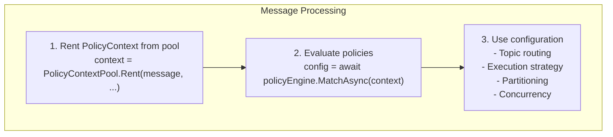
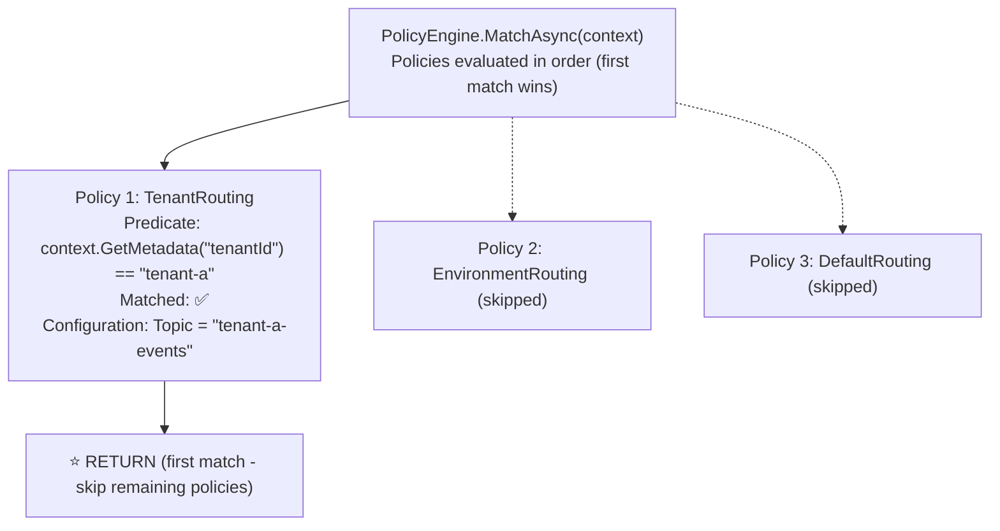

# Policy-Based Routing

**Policy-based routing** enables dynamic message configuration based on runtime conditions. Policies evaluate message context (type, aggregate ID, tenant, environment) and return routing configuration (topics, execution strategies, partitioning) without hardcoding business logic into handlers.

## Why Policies?

**Policies decouple routing decisions from business logic**:

| Without Policies | With Policies | Benefit |
|------------------|---------------|---------|
| **Hardcoded Routes** | Dynamic predicates | Flexible configuration |
| **If/Else Chains** | First-match evaluation | Clean code |
| **Per-Handler Config** | Centralized policy engine | Single source of truth |
| **No Audit Trail** | PolicyDecisionTrail | Full observability |
| **Multi-Tenant Logic Scattered** | Tenant-based policies | Centralized multi-tenancy |

**Use Cases**:
- ✅ **Multi-Tenancy** - Route messages to tenant-specific topics/databases
- ✅ **Environment-Based Routing** - Different config for dev/staging/prod
- ✅ **Aggregate-Based Routing** - Route by message aggregate type
- ✅ **Execution Strategies** - Serial vs parallel based on message type
- ✅ **Feature Flags** - Enable/disable routing based on tags/metadata

---

## Architecture

### Policy Evaluation Flow



PolicyEngine Evaluation:



PolicyDecisionTrail (Observability) - `context.Trail.Decisions`:

| Index | PolicyName | Rule | Matched | Reason |
|-------|------------|------|---------|--------|
| [0] | "TenantRouting" | "predicate" | ✅ | "Policy predicate matched" |
| [1] | "EnvironmentRouting" | "predicate" | ❌ | "Policy predicate did not match" |

---

## Core Components

### 1. PolicyEngine

**Purpose**: Evaluates policies in order, returns the first match.

**Registration** — the engine is a plain class with a parameterless constructor; register it (typically as a singleton) and add policies imperatively:

```csharp{title="Register PolicyEngine and add policies" description="Constructs a PolicyEngine and adds two named policies; policies evaluate in registration order and the first match wins." category="Configuration" difficulty="BEGINNER" tags=["policy-engine", "add-policy", "registration", "routing"]}
var policyEngine = new PolicyEngine();

// Add policies (evaluated in the order they are added)
policyEngine.AddPolicy(
  name: "TenantRouting",
  predicate: context =>
    context.GetMetadata("tenantId")?.ToString() == "tenant-a",
  configure: config =>
    config.PublishToServiceBus("tenant-a-events")
);

policyEngine.AddPolicy(
  name: "DefaultRouting",
  predicate: context => true,  // Always matches (fallback)
  configure: config =>
    config.PublishToServiceBus("default-events")
);

// Evaluate policies against a context
var config = await policyEngine.MatchAsync(context);
```

**`AddPolicy(string name, Func<PolicyContext, bool> predicate, Action<PolicyConfiguration> configure)`**:
- `name` is required — `AddPolicy` throws `ArgumentException` if it is null, empty, or whitespace.
- `predicate` and `configure` are required — `AddPolicy` throws `ArgumentNullException` if either is null.

**`MatchAsync(PolicyContext context)`** evaluation rules:
- Policies are evaluated in registration order.
- The first matched policy's `configure` delegate runs against a fresh `PolicyConfiguration`, which is returned.
- Subsequent policies are skipped once a match is found.
- If no policy matches, `MatchAsync` returns `null`.
- `MatchAsync` throws `ArgumentNullException` if `context` is null.

### 2. PolicyContext

**Purpose**: Universal context with message, envelope, services, environment, and the decision trail.

**Properties**:
```csharp{title="PolicyContext properties" description="Read-only surface exposed to predicates and configure delegates: the message, its runtime type, envelope, DI services, environment name, execution time, and the decision trail." category="API" difficulty="INTERMEDIATE" tags=["policy-context", "message", "envelope", "environment"]}
public class PolicyContext {
  public object Message { get; }               // The message being processed
  public Type MessageType { get; }             // Runtime type of the message
  public IMessageEnvelope? Envelope { get; }   // Envelope with metadata (may be null)
  public IServiceProvider? Services { get; }   // DI container (may be null)
  public string Environment { get; }           // Default: "development" (lowercase)
  public DateTimeOffset ExecutionTime { get; } // When the context was created (UTC)
  public PolicyDecisionTrail Trail { get; }    // Decision audit trail
}
```

The public constructor is `PolicyContext(object message, IMessageEnvelope? envelope = null, IServiceProvider? services = null, string environment = "development")`. The **first** positional argument is the message (not the envelope), and `Environment` defaults to the lowercase string `"development"` — match on that exact casing in predicates.

**Helper Methods**:
```csharp{title="PolicyContext helper methods" description="Service resolution, metadata/tag/flag checks, aggregate-type matching, and stream-id extraction available inside predicates." category="API" difficulty="INTERMEDIATE" tags=["policy-context", "helpers", "metadata", "aggregate-id"]}
// Service resolution (throws if Services is null or the service isn't registered)
var repository = context.GetService<IOrderRepository>();

// Metadata access (reads from the envelope; null-safe)
var tenantId = context.GetMetadata("tenantId");

// Tags — read from the "tags" metadata key (string array / JSON array)
var hasHighPriority = context.HasTag("high-priority");

// Flags — read bitwise from the "flags" metadata key; accepts any [Flags] enum
var isUrgent = context.HasFlag(ProcessingOptions.Urgent);

// Aggregate matching — true when the message type name contains the aggregate name
bool isOrderMessage = context.MatchesAggregate<Order>();

// Aggregate/stream ID extraction (zero reflection).
// Requires a [StreamId] Guid property on the message AND a registered
// IStreamIdExtractor (call services.AddWhizbang() at startup); throws otherwise.
var orderId = context.GetAggregateId();
```

Notes on the helpers:
- `GetService<T>()` is constrained to `where T : class`. It throws `InvalidOperationException` when `Services` is null, and again when the requested service is not registered.
- `HasFlag` takes any `Enum` (typically a user-defined `[Flags]` enum) and reads the `"flags"` metadata value as a bitwise mask.
- `HasTag` matches a string against the `"tags"` metadata value (supports a `JsonElement` array, `string[]`, or `IEnumerable<string>`).
- `MatchesAggregate<T>()` uses a naming convention — it returns true when the message type name contains the aggregate type name (case-insensitive), e.g. `CreateOrder` matches `Order`.
- `GetAggregateId()` returns a `Guid` and requires all of: a configured `IServiceProvider`, a registered `IStreamIdExtractor`, and a `[StreamId]`-marked `Guid` property on the message.

**Pooling** — `PolicyContext` is designed to be reused to minimize allocations. Rent from the static pool and always return it:
```csharp{title="Rent and return a pooled PolicyContext" description="Uses PolicyContextPool to reuse context instances; Return resets the context and re-pools it (or lets it be collected when the pool is full)." category="Configuration" difficulty="INTERMEDIATE" tags=["object-pool", "policy-context", "allocations", "rent-return"]}
// Rent from the pool (creates a new instance only when the pool is empty)
var context = PolicyContextPool.Rent(message, envelope, services, "production");

try {
  var config = await policyEngine.MatchAsync(context);
  // Use config...
} finally {
  // Always return to the pool (safe to call with null)
  PolicyContextPool.Return(context);
}
```

### 3. PolicyDecisionTrail

**Purpose**: Records every policy decision for debugging and time-travel.

**Usage**:
```csharp{title="Inspect the policy decision trail" description="MatchAsync records one PolicyDecision per evaluated policy; query matched/unmatched rules or enumerate the full trail for diagnostics." category="Observability" difficulty="INTERMEDIATE" tags=["decision-trail", "observability", "debugging", "audit"]}
// PolicyEngine records a decision for every policy it evaluates.
var config = await policyEngine.MatchAsync(context);

// Query the trail
var matchedPolicies = context.Trail.GetMatchedRules();
var unmatchedPolicies = context.Trail.GetUnmatchedRules();

foreach (var decision in context.Trail.Decisions) {
  Console.WriteLine($"{decision.PolicyName}: {decision.Matched} - {decision.Reason}");
}
```

Each `PolicyDecision` carries `PolicyName`, `Rule`, `Matched`, `Configuration`, `Reason`, and `Timestamp`. The engine records `Rule = "predicate"` with `Reason = "Policy predicate matched"` / `"Policy predicate did not match"`, and `"Evaluation failed: {message}"` when a predicate throws.

**Benefits**:
- **Debugging**: See why a specific configuration was applied.
- **Auditing**: Track policy decisions over time.
- **Time-Travel**: Replay message processing with decision history.

### 4. PolicyConfiguration

**Purpose**: Routing and execution configuration returned by the matched policy.

**Properties**:
```csharp{title="PolicyConfiguration properties" description="The configuration surface a matched policy produces: transport targets, topic/stream identity, execution strategy, partitioning, concurrency, and persistence-size limits." category="API" difficulty="INTERMEDIATE" tags=["policy-configuration", "topic", "stream-id", "execution-strategy"]}
public class PolicyConfiguration {
  // Publishing (outbound) and subscribing (inbound) transport targets
  public List<PublishTarget> PublishTargets { get; }
  public List<SubscriptionTarget> SubscriptionTargets { get; }

  // Routing
  public string? Topic { get; }
  public string? StreamId { get; }

  // Execution / partitioning
  public Type? ExecutionStrategyType { get; }
  public Type? PartitionRouterType { get; }
  public Type? SequenceProviderType { get; }
  public int? PartitionCount { get; }
  public int? MaxConcurrency { get; }

  // Persistence size limits (JSONB columns)
  public int? MaxDataSizeBytes { get; }
  public bool SuppressSizeWarnings { get; }
  public bool ThrowOnSizeExceeded { get; }
}
```

**Fluent API** — the `configure` delegate receives a `PolicyConfiguration` (not the context), so every setter takes a constant value. Per-message stream derivation (e.g. building a stream key from an aggregate ID at evaluation time) is **not** available inside `configure` today; `UseStreamId` takes a fixed string.

```csharp{title="Configure routing, execution, and persistence" description="Chains the verified fluent setters: logical topic, constant stream id, execution strategy, partition router, sequence provider, partition/concurrency counts, and a persistence-size guard." category="Configuration" difficulty="BEGINNER" tags=["fluent-api", "use-topic", "use-stream-id", "persistence-size"]}
configure: config => config
  .UseTopic("order-events")
  .UseStreamId("order-stream")
  .UseExecutionStrategy<SerialExecutor>()
  .UsePartitionRouter<HashPartitionRouter>()
  .UseSequenceProvider<InMemorySequenceProvider>()
  .WithPartitions(count: 100)
  .WithConcurrency(maxConcurrency: 10)
  .WithPersistenceSize(maxDataSizeBytes: 7000, throwOnExceeded: true)
```

- `UseTopic(string)` sets the logical `Topic`; `UseStreamId(string)` sets the `StreamId` (ordering/partitioning key).
- `UseExecutionStrategy<T>()` — the shipped strategies are `SerialExecutor` (strict FIFO, one message at a time) and `ParallelExecutor` (concurrent, bounded by `WithConcurrency`).
- `UsePartitionRouter<T>()` — `HashPartitionRouter` (consistent hashing over the stream key) ships in `Whizbang.Core.Partitioning`.
- `UseSequenceProvider<T>()` — `InMemorySequenceProvider` (monotonic per-stream sequence numbers) ships in `Whizbang.Core.Sequencing`.
- `WithPartitions(int)`, `WithConcurrency(int)`, and `WithPersistenceSize(maxDataSizeBytes: …)` each throw `ArgumentOutOfRangeException` when the supplied value is `<= 0`.

**Transport targets** — beyond the logical `Topic`, `PolicyConfiguration` can add concrete publish and subscribe targets per transport:

```csharp{title="Add transport publish and subscribe targets" description="Appends per-transport publish (outbound) and subscribe (inbound) targets across Kafka, Azure Service Bus, and RabbitMQ; each call adds one PublishTarget/SubscriptionTarget." category="Configuration" difficulty="INTERMEDIATE" tags=["transports", "kafka", "service-bus", "rabbitmq"]}
configure: config => config
  // Publishing (outbound)
  .PublishToKafka("orders")
  .PublishToServiceBus("order-events")
  .PublishToRabbitMQ("orders-exchange", routingKey: "orders.created")
  // Subscribing (inbound)
  .SubscribeFromKafka("orders", consumerGroup: "order-workers")
  .SubscribeFromServiceBus("order-events", subscriptionName: "order-sub")
  .SubscribeFromRabbitMQ("orders-exchange", queueName: "orders-queue");
```

---

## Common Policies

### 1. Multi-Tenant Routing

```csharp{title="Multi-tenant routing by tenant metadata" description="Routes messages to per-tenant Service Bus topics and stream ids based on the tenantId metadata value, with a fallback policy for unknown tenants." category="Configuration" difficulty="INTERMEDIATE" tags=["multi-tenancy", "routing", "metadata", "fallback"]}
policyEngine.AddPolicy(
  name: "TenantARouting",
  predicate: context =>
    context.GetMetadata("tenantId")?.ToString() == "tenant-a",
  configure: config => config
    .PublishToServiceBus("tenant-a-events")
    .UseStreamId("tenant-a-orders")
);

policyEngine.AddPolicy(
  name: "TenantBRouting",
  predicate: context =>
    context.GetMetadata("tenantId")?.ToString() == "tenant-b",
  configure: config => config
    .PublishToServiceBus("tenant-b-events")
    .UseStreamId("tenant-b-orders")
);

// Fallback for unknown tenants
policyEngine.AddPolicy(
  name: "DefaultTenantRouting",
  predicate: context => true,
  configure: config => config
    .PublishToServiceBus("default-events")
);
```

### 2. Environment-Based Routing

Match on `context.Environment`, which defaults to the lowercase `"development"`:

```csharp{title="Environment-based routing" description="Selects topic and concurrency per environment by matching the lowercase Environment value (development/staging/production)." category="Configuration" difficulty="INTERMEDIATE" tags=["environment", "routing", "concurrency", "staging-production"]}
policyEngine.AddPolicy(
  name: "ProductionRouting",
  predicate: context => context.Environment == "production",
  configure: config => config
    .PublishToServiceBus("prod-events")
    .WithConcurrency(maxConcurrency: 50)
);

policyEngine.AddPolicy(
  name: "StagingRouting",
  predicate: context => context.Environment == "staging",
  configure: config => config
    .PublishToServiceBus("staging-events")
    .WithConcurrency(maxConcurrency: 10)
);

policyEngine.AddPolicy(
  name: "DevelopmentRouting",
  predicate: context => context.Environment == "development",
  configure: config => config
    .PublishToServiceBus("dev-events")
    .WithConcurrency(maxConcurrency: 1)  // Serial processing in dev
);
```

### 3. Aggregate-Based Routing

Match on the aggregate type via the naming convention, then set a stream id and partitioning:

```csharp{title="Aggregate-based routing and partitioning" description="Uses MatchesAggregate<T>() to route each aggregate type to its own stream id and partition count via the hash partition router." category="Configuration" difficulty="INTERMEDIATE" tags=["aggregate", "partitioning", "hash-router", "stream-id"]}
policyEngine.AddPolicy(
  name: "OrderPartitioning",
  predicate: context => context.MatchesAggregate<Order>(),
  configure: config => config
    .UseStreamId("orders")
    .UsePartitionRouter<HashPartitionRouter>()
    .WithPartitions(count: 100)
);

policyEngine.AddPolicy(
  name: "CustomerPartitioning",
  predicate: context => context.MatchesAggregate<Customer>(),
  configure: config => config
    .UseStreamId("customers")
    .UsePartitionRouter<HashPartitionRouter>()
    .WithPartitions(count: 50)
);
```

### 4. Message Type-Based Execution

```csharp{title="Execution strategy by message type" description="Chooses parallel vs serial execution by inspecting the message type name — parallel for bulk imports, serial for order commands." category="Configuration" difficulty="INTERMEDIATE" tags=["execution-strategy", "message-type", "parallel", "serial"]}
policyEngine.AddPolicy(
  name: "BulkImportExecutionStrategy",
  predicate: context => context.MessageType.Name.Contains("BulkImport"),
  configure: config => config
    .UseExecutionStrategy<ParallelExecutor>()
    .WithConcurrency(maxConcurrency: 100)
);

policyEngine.AddPolicy(
  name: "OrderExecutionStrategy",
  predicate: context => context.MessageType.Name.Contains("Order"),
  configure: config => config
    .UseExecutionStrategy<SerialExecutor>()  // Strict ordering for orders
);
```

### 5. Tag-Based Routing

```csharp{title="Tag-based routing" description="Routes by envelope tags via HasTag — a high-priority tag to a priority topic, an archival tag to a low-concurrency archive topic." category="Configuration" difficulty="INTERMEDIATE" tags=["tags", "routing", "priority", "archival"]}
policyEngine.AddPolicy(
  name: "HighPriorityRouting",
  predicate: context => context.HasTag("high-priority"),
  configure: config => config
    .PublishToServiceBus("priority-events")
    .WithConcurrency(maxConcurrency: 100)
);

policyEngine.AddPolicy(
  name: "ArchivalRouting",
  predicate: context => context.HasTag("archival"),
  configure: config => config
    .PublishToServiceBus("archive-events")
    .WithConcurrency(maxConcurrency: 1)  // Low priority
);
```

---

## Advanced Patterns

### Composite Policies

```csharp{title="Composite predicate combining conditions" description="A single policy whose predicate ANDs aggregate type, a metadata amount threshold, and environment to route high-value production orders serially." category="Configuration" difficulty="INTERMEDIATE" tags=["composite", "predicate", "high-value", "serial"]}
policyEngine.AddPolicy(
  name: "HighValueOrderRouting",
  predicate: context => {
    bool isOrder = context.MatchesAggregate<Order>();
    bool isHighValue = context.GetMetadata("totalAmount") is decimal amount && amount > 10000;
    bool isProduction = context.Environment == "production";

    return isOrder && isHighValue && isProduction;
  },
  configure: config => config
    .PublishToServiceBus("high-value-orders")
    .UseExecutionStrategy<SerialExecutor>()
    .WithConcurrency(maxConcurrency: 1)
);
```

### Service-Injected Policies

```csharp{title="Resolve a service inside a predicate" description="Uses context.GetService<T>() to consult a feature-flag service from the DI container before deciding whether the policy matches." category="Configuration" difficulty="INTERMEDIATE" tags=["dependency-injection", "feature-flags", "predicate", "get-service"]}
policyEngine.AddPolicy(
  name: "FeatureFlagRouting",
  predicate: context => {
    // Resolve a service from the context's IServiceProvider
    var featureFlags = context.GetService<IFeatureFlagService>();
    return featureFlags.IsEnabled("new-event-routing");
  },
  configure: config => config
    .PublishToServiceBus("new-events-topic")
);
```

### Time-Based Policies

```csharp{title="Time-based routing on ExecutionTime" description="Branches concurrency on the hour of context.ExecutionTime to give peak-hours traffic more concurrency and off-hours traffic less." category="Configuration" difficulty="INTERMEDIATE" tags=["time-based", "execution-time", "concurrency", "peak-hours"]}
policyEngine.AddPolicy(
  name: "PeakHoursRouting",
  predicate: context => {
    var hour = context.ExecutionTime.Hour;
    return hour >= 9 && hour <= 17;  // 9 AM - 5 PM
  },
  configure: config => config
    .WithConcurrency(maxConcurrency: 100)  // High concurrency during peak
);

policyEngine.AddPolicy(
  name: "OffHoursRouting",
  predicate: context => true,  // Fallback
  configure: config => config
    .WithConcurrency(maxConcurrency: 10)  // Lower concurrency off-peak
);
```

---

## Testing Policies

### Unit Testing Predicates

```csharp{title="Unit test a tenant predicate and its publish target" description="Builds a PolicyContext with tenant metadata, adds one policy, and asserts MatchAsync returns a configuration whose PublishTargets destination is the tenant topic." category="Configuration" difficulty="INTERMEDIATE" tags=["testing", "predicate", "publish-target", "match-async"]}
[Test]
public async Task TenantARouting_WithTenantA_MatchesAsync() {
  // Arrange
  var context = new PolicyContext(
    message: new CreateOrder(),
    envelope: CreateEnvelope(metadata: new Dictionary<string, object> {
      ["tenantId"] = "tenant-a"
    }),
    services: null,
    environment: "production"
  );

  var policyEngine = new PolicyEngine();
  policyEngine.AddPolicy(
    name: "TenantARouting",
    predicate: ctx => ctx.GetMetadata("tenantId")?.ToString() == "tenant-a",
    configure: config => config.PublishToServiceBus("tenant-a-events")
  );

  // Act
  var result = await policyEngine.MatchAsync(context);

  // Assert
  await Assert.That(result).IsNotNull();
  await Assert.That(result!.PublishTargets).HasCount().EqualTo(1);
  await Assert.That(result.PublishTargets[0].Destination).IsEqualTo("tenant-a-events");
}
```

### Testing Topic and Stream Id

```csharp{title="Assert Topic and StreamId on the matched configuration" description="Adds a policy that sets a topic and a constant stream id, then asserts config.Topic and config.StreamId on the returned PolicyConfiguration." category="Configuration" difficulty="INTERMEDIATE" tags=["testing", "topic", "stream-id", "configuration"]}
[Test]
public async Task OrderPolicy_SetsTopicAndStreamIdAsync() {
  // Arrange
  var context = new PolicyContext(new CreateOrder(), null, null, "production");

  var policyEngine = new PolicyEngine();
  policyEngine.AddPolicy(
    name: "OrderPolicy",
    predicate: ctx => true,
    configure: config => config
      .UseTopic("orders")
      .UseStreamId("order-123")
  );

  // Act
  var config = await policyEngine.MatchAsync(context);

  // Assert
  await Assert.That(config).IsNotNull();
  await Assert.That(config!.Topic).IsEqualTo("orders");
  await Assert.That(config.StreamId).IsEqualTo("order-123");
}
```

### Testing Policy Order

```csharp{title="Verify first-match-wins and skip" description="Registers two always-true policies and asserts only the first ran — its topic is returned and only one matched rule appears in the trail." category="Configuration" difficulty="INTERMEDIATE" tags=["testing", "first-match", "ordering", "decision-trail"]}
[Test]
public async Task PolicyEngine_FirstMatchWins_SkipsSubsequentPoliciesAsync() {
  // Arrange
  var context = new PolicyContext(new CreateOrder(), null, null, "production");

  var policyEngine = new PolicyEngine();

  policyEngine.AddPolicy("FirstPolicy",
    predicate: ctx => true,  // Always matches
    configure: config => config.PublishToServiceBus("first-topic")
  );

  policyEngine.AddPolicy("SecondPolicy",
    predicate: ctx => true,  // Would match, but skipped
    configure: config => config.PublishToServiceBus("second-topic")
  );

  // Act
  var result = await policyEngine.MatchAsync(context);

  // Assert
  await Assert.That(result!.PublishTargets[0].Destination).IsEqualTo("first-topic");

  // Verify decision trail
  var matched = context.Trail.GetMatchedRules().ToList();
  await Assert.That(matched).HasCount().EqualTo(1);
  await Assert.That(matched[0].PolicyName).IsEqualTo("FirstPolicy");
}
```

### Testing PolicyDecisionTrail

```csharp{title="Assert every policy is recorded in the trail" description="Registers a non-matching and a matching policy and asserts both appear in context.Trail.Decisions in order with the correct Matched flags." category="Observability" difficulty="INTERMEDIATE" tags=["testing", "decision-trail", "matched", "observability"]}
[Test]
public async Task PolicyEngine_RecordsDecisionTrail_ForAllPoliciesAsync() {
  // Arrange
  var context = new PolicyContext(new CreateOrder(), null, null, "production");

  var policyEngine = new PolicyEngine();
  policyEngine.AddPolicy("Policy1", ctx => false, config => { });
  policyEngine.AddPolicy("Policy2", ctx => true, config => { });

  // Act
  await policyEngine.MatchAsync(context);

  // Assert
  var decisions = context.Trail.Decisions.ToList();
  await Assert.That(decisions).HasCount().EqualTo(2);

  // First policy did not match
  await Assert.That(decisions[0].PolicyName).IsEqualTo("Policy1");
  await Assert.That(decisions[0].Matched).IsFalse();

  // Second policy matched
  await Assert.That(decisions[1].PolicyName).IsEqualTo("Policy2");
  await Assert.That(decisions[1].Matched).IsTrue();
}
```

---

## Best Practices

### DO ✅

- ✅ **Register policies in order of specificity** (most specific first, fallback last)
- ✅ **Give every policy a non-empty name** (`AddPolicy` throws on null/empty/whitespace names)
- ✅ **Return contexts to the pool** after policy evaluation
- ✅ **Test policies with various inputs** (unit test predicates)
- ✅ **Use service injection** for complex predicates (feature flags, config)
- ✅ **Add a fallback policy** with `predicate: ctx => true` at the end
- ✅ **Monitor PolicyDecisionTrail** in logs for debugging

### DON'T ❌

- ❌ Perform expensive operations in predicates (database queries, API calls)
- ❌ Mutate context in predicates (side effects)
- ❌ Rely on a predicate exception to route — a throwing predicate is caught, recorded as a failed decision, and the engine continues to the next policy
- ❌ Skip returning contexts to the pool (extra allocations)
- ❌ Hardcode business logic in predicates (use services instead)
- ❌ Expect per-message stream derivation inside `configure` (it only sees a `PolicyConfiguration`, so `UseStreamId` is a constant string)

---

## Troubleshooting

### Problem: No Policy Matches, Null Configuration

**Symptoms**: `MatchAsync()` returns `null`, no configuration applied.

**Cause**: No policies registered or all predicates return `false`.

**Solution**:
```csharp{title="Add a fallback policy and inspect the trail" description="Registers an always-true fallback and, when MatchAsync still returns null, logs each PolicyDecision to diagnose why nothing matched." category="Diagnostics" difficulty="INTERMEDIATE" tags=["troubleshooting", "fallback", "null-config", "decision-trail"]}
// Add fallback policy
policyEngine.AddPolicy(
  name: "DefaultPolicy",
  predicate: context => true,  // Always matches (last resort)
  configure: config => config
    .PublishToServiceBus("default-events")
);

// Verify policies registered
var config = await policyEngine.MatchAsync(context);
if (config is null) {
  logger.LogWarning("No policy matched for message {MessageType}", context.MessageType.Name);

  // Check decision trail
  foreach (var decision in context.Trail.Decisions) {
    logger.LogDebug("Policy {PolicyName}: {Matched} - {Reason}",
      decision.PolicyName, decision.Matched, decision.Reason);
  }
}
```

### Problem: Wrong Policy Matched

**Symptoms**: Unexpected configuration returned.

**Cause**: Policy order incorrect (fallback registered before specific policies).

**Solution**:
```csharp{title="Order specific policies before the fallback" description="Contrasts a broken ordering (always-true fallback first) with the correct order — specific predicate first, fallback last." category="Diagnostics" difficulty="BEGINNER" tags=["troubleshooting", "ordering", "fallback", "first-match"]}
// ❌ WRONG: Fallback first (always matches)
policyEngine.AddPolicy("Fallback", ctx => true, config => config.PublishToServiceBus("default"));
policyEngine.AddPolicy("Specific", ctx => ctx.HasTag("high-priority"), config => config.PublishToServiceBus("priority"));

// ✅ CORRECT: Specific first, fallback last
policyEngine.AddPolicy("Specific", ctx => ctx.HasTag("high-priority"), config => config.PublishToServiceBus("priority"));
policyEngine.AddPolicy("Fallback", ctx => true, config => config.PublishToServiceBus("default"));
```

### Problem: Predicate Throws Exception

**Symptoms**: Policy skipped with an error recorded in the decision trail.

**Cause**: An exception thrown in the predicate. The engine catches it, records a failed decision (`Reason: "Evaluation failed: …"`), and continues to the next policy.

**Solution**:
```csharp{title="Make predicates null-safe" description="Shows a predicate that throws on missing metadata (caught and recorded as a failed decision) versus a null-safe pattern-matched predicate." category="Diagnostics" difficulty="INTERMEDIATE" tags=["troubleshooting", "predicate", "null-safety", "exceptions"]}
// Predicate that can throw — the engine catches it and records the failure
policyEngine.AddPolicy(
  name: "FaultyPolicy",
  predicate: context => {
    var metadata = context.GetMetadata("value");
    return (int)metadata! > 100;  // NullReferenceException if missing
  },
  configure: config => { }
);

// Decision trail shows:
//   PolicyName: "FaultyPolicy"
//   Matched: false
//   Reason: "Evaluation failed: Object reference not set to an instance of an object."

// FIX: null-safe predicate
policyEngine.AddPolicy(
  name: "SafePolicy",
  predicate: context => {
    var metadata = context.GetMetadata("value");
    return metadata is int value && value > 100;  // ✅ Null-safe
  },
  configure: config => { }
);
```

---

## Further Reading

**Infrastructure**:
- [Object Pooling](pooling.md) - PolicyContext pooling for performance
- [Policy Engine Component](policy-engine.md) - Component reference for the policy engine
- [Aspire Integration](aspire-integration.md) - Service configuration injection

**Core Concepts**:
- [Message Context](../../fundamentals/messages/message-context.md) - MessageId, CorrelationId, CausationId
- [Observability](../../fundamentals/persistence/observability.md) - Distributed tracing with hops

**Source Generators**:
- [Aggregate IDs](../../extending/source-generators/aggregate-ids.md) - Zero-reflection stream ID extraction

**Advanced**:
- [Multi-Tenancy](../../fundamentals/security/multi-tenancy.md) - Tenant isolation patterns

---

*Version 1.0.0 - Foundation Release*
