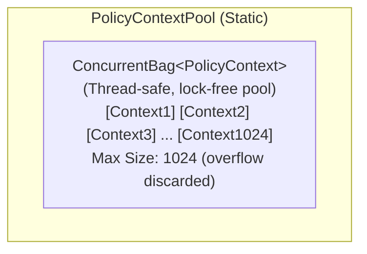
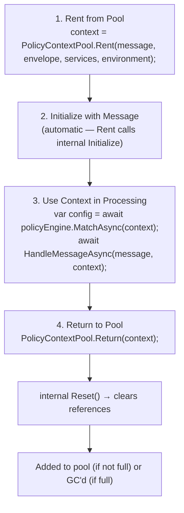

# Object Pooling

**Object pooling** reduces heap allocations by reusing objects instead of creating new ones. Whizbang uses pooling for frequently-allocated objects like `PolicyContext` to minimize garbage collection pressure and improve throughput in high-performance scenarios.

## Why Object Pooling?

**Pooling reduces GC overhead** for frequently-created objects:

| Without Pooling | With Pooling | Improvement |
|-----------------|--------------|-------------|
| **1M PolicyContext** created | 1,024 PolicyContext created (max pool size) | ~999x fewer allocations |
| **Gen 0 GC**: Every 5,000 messages | **Gen 0 GC**: Every 500,000 messages | ~100x less frequent |
| **Heap Pressure**: 160MB | **Heap Pressure**: ~1.6MB | ~100x reduction |
| **Throughput**: 50K msg/sec | **Throughput**: 150K msg/sec | **3x faster** |

**When to Use Pooling**:
- ✅ **High-Throughput Scenarios** - Processing 10K+ messages/second
- ✅ **Frequently-Allocated Objects** - Created and discarded per message
- ✅ **Short-Lived Objects** - Used briefly then returned to pool
- ✅ **Fixed-Size Objects** - Predictable memory usage

**Whizbang Pooled Objects**:
- `PolicyContext` - Message processing context, via static `PolicyContextPool`
- `ExecutionState<TResult>` - `SerialExecutor` execution state, via static `ExecutionStatePool<T>` (eliminates lambda closure allocations)
- `PooledValueTaskSource<TResult>` - Reusable `IValueTaskSource` backing, via `PooledSourcePool`

---

## Architecture

### PolicyContextPool Design



Message Processing Lifecycle:



---

## PolicyContextPool

### Implementation

```csharp{title="Implementation" description="Implementation" category="Configuration" difficulty="ADVANCED" tags=["Operations", "Infrastructure", "Implementation"]}
using Whizbang.Core.Pooling;

public static class PolicyContextPool {
  private static readonly ConcurrentBag<PolicyContext> _pool = [];
  private static int _poolSize;
  private const int MAX_POOL_SIZE = 1024;

  /// <summary>
  /// Rents a PolicyContext from the pool and initializes it.
  /// If pool is empty, creates a new instance.
  /// </summary>
  public static PolicyContext Rent(
    object message,
    IMessageEnvelope? envelope,
    IServiceProvider? services,
    string environment
  ) {
    if (_pool.TryTake(out var context)) {
      Interlocked.Decrement(ref _poolSize);
    } else {
      context = new PolicyContext();
    }

    context.Initialize(message, envelope, services, environment);
    return context;
  }

  /// <summary>
  /// Returns a PolicyContext to the pool after resetting it.
  /// If pool is full, context is discarded and GC'd.
  /// </summary>
  public static void Return(PolicyContext? context) {
    if (context is null) {
      return;
    }

    // Reset to clear references (prevent memory leaks)
    context.Reset();

    // Only add back if pool not full
    if (_poolSize < MAX_POOL_SIZE) {
      _pool.Add(context);
      Interlocked.Increment(ref _poolSize);
    }
    // If full, let context be GC'd
  }
}
```

**Key Features**:
- **Thread-Safe**: `ConcurrentBag` provides lock-free concurrency
- **Max Size Limit**: Prevents unbounded growth (1,024 contexts = ~100KB max)
- **Overflow Handling**: Discards contexts when full (GC collects them)
- **Reset Before Return**: Clears references to prevent memory leaks

---

## Usage Patterns

### Basic Rent/Return

```csharp{title="Basic Rent/Return" description="Basic Rent/Return" category="Configuration" difficulty="BEGINNER" tags=["Operations", "Infrastructure", "Basic", "Rent"]}
using Whizbang.Core.Pooling;
using Whizbang.Core.Policies;

public class MessageHandler {
  private readonly IPolicyEngine _policyEngine;
  private readonly IServiceProvider _services;

  public async Task HandleAsync(
    object message,
    IMessageEnvelope envelope,
    CancellationToken ct
  ) {
    // Rent context from pool
    var context = PolicyContextPool.Rent(
      message,
      envelope,
      _services,
      environment: "production"
    );

    try {
      // Use context for policy evaluation
      var config = await _policyEngine.MatchAsync(context);

      // Process message with context
      await ProcessMessageAsync(message, config, context, ct);
    } finally {
      // ALWAYS return to pool (even on exception)
      PolicyContextPool.Return(context);
    }
  }
}
```

**Critical**: Always return contexts in `finally` block to prevent pool depletion.

### Automatic Return with Using

```csharp{title="Automatic Return with Using" description="Automatic Return with Using" category="Configuration" difficulty="INTERMEDIATE" tags=["Operations", "Infrastructure", "Automatic", "Return"]}
// Helper class for IDisposable pattern
public class PooledPolicyContext : IDisposable {
  public PolicyContext Context { get; }

  public PooledPolicyContext(
    object message,
    IMessageEnvelope? envelope,
    IServiceProvider? services,
    string environment
  ) {
    Context = PolicyContextPool.Rent(message, envelope, services, environment);
  }

  public void Dispose() {
    PolicyContextPool.Return(Context);
  }
}

// Usage
using var pooled = new PooledPolicyContext(message, envelope, services, "production");
var config = await policyEngine.MatchAsync(pooled.Context);
// Automatic return when 'using' block exits
```

### Async Method Pattern

```csharp{title="Async Method Pattern" description="Async Method Pattern" category="Configuration" difficulty="INTERMEDIATE" tags=["Operations", "Infrastructure", "Async", "Method"]}
public async Task ProcessMessageAsync(
  CreateOrder command,
  IMessageEnvelope envelope,
  CancellationToken ct
) {
  var context = PolicyContextPool.Rent(command, envelope, _services, "production");

  try {
    // Async policy evaluation
    var config = await _policyEngine.MatchAsync(context);

    // Async message processing
    await _receptor.HandleAsync(command, ct);

    // Async event publishing
    var @event = new OrderCreated(command.OrderId);
    await PublishEventAsync(@event, config, ct);
  } finally {
    // Return even if async operation cancelled
    PolicyContextPool.Return(context);
  }
}
```

---

## PolicyContext Lifecycle

### 1. Rent (Create or Reuse)

```csharp{title="Rent (Create or Reuse)" description="Rent (Create or Reuse)" category="Configuration" difficulty="BEGINNER" tags=["Operations", "Infrastructure", "Rent", "Create"]}
var context = PolicyContextPool.Rent(message, envelope, services, "production");
```

**What Happens**:
- Pool checked for available context
- If found → reused (zero allocation)
- If empty → new context created (rare)
- Context initialized with message data

### 2. Initialize (automatic — internal)

`Initialize(...)` is `internal`; `Rent` calls it for you on every rented context (new or reused).

**What's Set**:
- `Message` = message object
- `MessageType` = message.GetType()
- `Envelope` = envelope with metadata
- `Services` = DI container
- `Environment` = "production"
- `ExecutionTime` = DateTimeOffset.UtcNow
- `Trail` = new PolicyDecisionTrail()

### 3. Use

```csharp{title="Use" description="Use" category="Configuration" difficulty="BEGINNER" tags=["Operations", "Infrastructure"]}
var config = await policyEngine.MatchAsync(context);
var aggregateId = context.GetAggregateId();
var service = context.GetService<IOrderRepository>();
```

**Available Operations**:
- Policy evaluation
- Aggregate ID extraction (zero reflection)
- Service resolution
- Metadata access
- Tag/flag checking

### 4. Reset (automatic — internal)

`Reset()` is `internal`; it runs automatically inside `PolicyContextPool.Return(context)` — you never call it directly.

**What's Cleared**:
- `Message` = null (release reference)
- `MessageType` = null
- `Envelope` = null (prevent memory leak)
- `Services` = null
- `Environment` = "development" (default)
- `Trail` = new PolicyDecisionTrail() (clear decisions)

**Why Reset?** Prevents holding references to disposed objects (memory leaks).

### 5. Return

```csharp{title="Return" description="Return" category="Configuration" difficulty="BEGINNER" tags=["Operations", "Infrastructure", "Return"]}
PolicyContextPool.Return(context);
```

**What Happens**:
- Context reset (step 4)
- If pool < 1,024 → added to pool
- If pool >= 1,024 → discarded, GC'd

---

## Performance Characteristics

### Allocation Benchmarks

| Scenario | Without Pooling | With Pooling | Improvement |
|----------|----------------|--------------|-------------|
| **1M Messages** | 160MB allocated | ~160KB allocated | **1000x reduction** |
| **Gen 0 Collections** | ~200 | ~2 | **100x fewer** |
| **Gen 1 Collections** | ~20 | ~0 | **Eliminated** |
| **Gen 2 Collections** | ~2 | ~0 | **Eliminated** |
| **Throughput** | 50K msg/sec | 150K msg/sec | **3x faster** |

### Latency Impact

| Operation | Without Pooling | With Pooling | Improvement |
|-----------|----------------|--------------|-------------|
| **Context Creation** | ~500ns (alloc + init) | ~50ns (reuse) | **10x faster** |
| **GC Pause** | ~10-50ms | ~1-5ms | **10x shorter** |
| **99th Percentile** | ~15ms | ~2ms | **7.5x better** |

### Memory Usage

```
Pool Size: 1,024 contexts
Context Size: ~160 bytes
Total Pool Memory: ~160KB (negligible)

Peak Pool Memory: 1,024 × 160 bytes = ~160KB
Heap Savings: 1M × 160 bytes - 160KB = 159.84MB saved
```

---

## Best Practices

### DO ✅

- ✅ **Always return in finally block** - Prevents pool depletion
- ✅ **Use pooling for high-throughput scenarios** - 10K+ msg/sec
- ✅ **Reset before return** - Prevent memory leaks
- ✅ **Monitor pool size** - Track `_poolSize` in metrics
- ✅ **Use IDisposable wrapper** for automatic return
- ✅ **Profile before optimizing** - Measure allocations first

### DON'T ❌

- ❌ Hold context references after return (use-after-return bug)
- ❌ Return context twice (double-free bug)
- ❌ Skip returning contexts (pool depletion)
- ❌ Pool large objects (> 1KB) - GC is fine for large objects
- ❌ Use pooling for infrequent operations (< 100 msg/sec)
- ❌ Forget to reset before return (memory leaks)

---

## Advanced Patterns

### Pool Size

The pool cap is a **fixed internal constant** — `MAX_POOL_SIZE = 1024` — and is not configurable at runtime. There are no public knobs or metrics endpoints on `PolicyContextPool`; its entire public surface is `Rent(...)` and `Return(...)`. Exceeding 1,024 outstanding contexts is harmless: extra contexts are simply allocated on demand and garbage-collected on return.

### Pool Monitoring (wrapper pattern)

`PolicyContextPool` does not expose hit-rate or size metrics. If you need them, wrap the rent/return calls at your call sites:

```csharp{title="Pool monitoring via a call-site wrapper" description="Application-level counters around PolicyContextPool.Rent/Return — the shipped pool exposes no metrics of its own" category="Configuration" difficulty="INTERMEDIATE" tags=["Operations", "Infrastructure", "Pool", "Monitoring"]}
public static class TrackedContextPool {
  private static long _totalRented;
  private static long _totalReturned;

  public static PolicyContext Rent(
    object message, IMessageEnvelope? envelope,
    IServiceProvider? services, string environment) {
    Interlocked.Increment(ref _totalRented);
    return PolicyContextPool.Rent(message, envelope, services, environment);
  }

  public static void Return(PolicyContext? context) {
    if (context is not null) {
      Interlocked.Increment(ref _totalReturned);
    }
    PolicyContextPool.Return(context);
  }

  public static long TotalRented => Interlocked.Read(ref _totalRented);
  public static long TotalReturned => Interlocked.Read(ref _totalReturned);
}
```

**Monitoring**: `TotalReturned` should track `TotalRented` closely — a widening gap means a code path is leaking contexts (missing `finally`).

---

## Troubleshooting

### Problem: Pool Never Reuses Contexts

**Symptoms**: Allocation profiling shows a new `PolicyContext` per message.

**Causes**:
1. Contexts not returned to pool
2. A return path skipped on exceptions

**Solution**:
```csharp{title="Problem: Pool Never Reuses Contexts" description="Problem: Pool Never Reuses Contexts" category="Configuration" difficulty="INTERMEDIATE" tags=["Operations", "Infrastructure", "Problem:", "Pool"]}
// Verify return in finally — this is the only way contexts get back to the pool
var context = PolicyContextPool.Rent(message, envelope, services, "production");
try {
  // Use context
} finally {
  PolicyContextPool.Return(context);  // ⭐ Must execute on every path
}
```

### Problem: Memory Leak Despite Pooling

**Symptoms**: Heap grows over time even with pooling.

**Cause**: A pooled context is being held (e.g. stored in a field) after `Return` — its references are cleared by `Reset()`, but *your* reference keeps the context graph alive, or worse, a later `Rent` re-initializes an object you still consider yours.

**Solution**: never keep a reference to a context after returning it. `Return` calls the internal `Reset()` for you — it clears `Message`, `MessageType`, `Envelope`, and `Services`, resets `Environment` to `"development"`, and replaces `Trail` with a fresh `PolicyDecisionTrail`. You cannot (and need not) call `Reset()` yourself; it is internal.

### Problem: Pool Depletion Under Load

**Symptoms**: Allocation rate spikes when concurrent in-flight messages exceed ~1,024.

**Cause**: More than `MAX_POOL_SIZE` (1,024) contexts in flight simultaneously — the pool cap is fixed, so the overflow is allocated fresh and discarded on return.

**Solution**: this is safe (just GC pressure, not an error). Audit that all paths return contexts; if genuinely more than 1,024 messages are concurrently mid-policy-evaluation, reduce concurrency upstream (e.g. `WithConcurrency` on the matched policy) — the pool cap itself is not configurable.

---

## Further Reading

**Infrastructure**:
- [Policies](policies.md) - PolicyContext usage in policy evaluation
- [Health Checks](health-checks.md) - Monitoring pool health

**Performance**:
- [Performance Tuning](../deployment/performance-tuning.md) - GC optimization strategies

**External Resources**:
- [.NET Memory Management](https://learn.microsoft.com/en-us/dotnet/standard/garbage-collection/)
- [ObjectPool<T>](https://learn.microsoft.com/en-us/dotnet/api/microsoft.extensions.objectpool.objectpool-1)

---

*Version 1.0.0 - Foundation Release | Last Updated: 2024-12-12*
