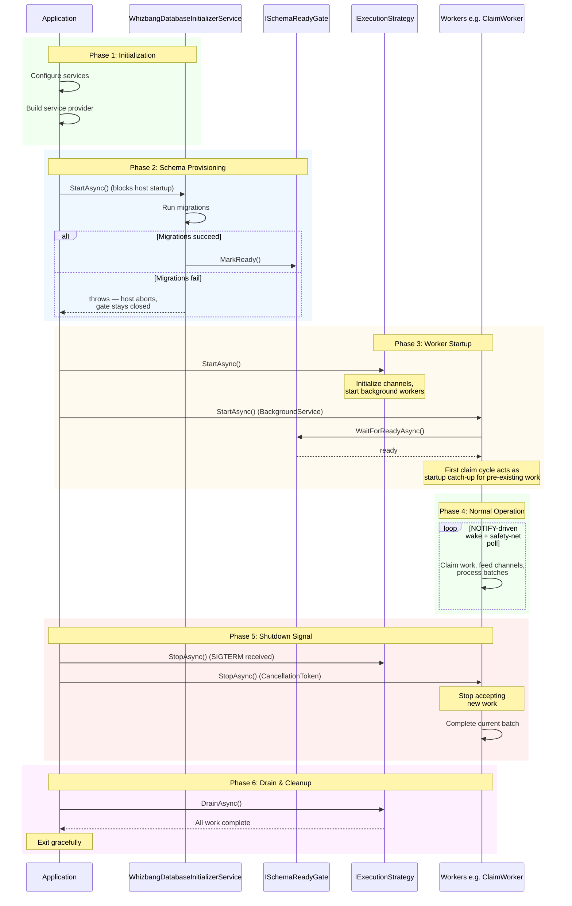

# Execution Lifecycle

The **Execution Lifecycle** defines how Whizbang coordinates application startup, normal operation, and graceful shutdown. It's built around the `IExecutionStrategy` interface which provides lifecycle hooks (`StartAsync`, `StopAsync`, `DrainAsync`) for controlled initialization and cleanup.

## Overview

### Why Lifecycle Management Matters

Without proper lifecycle coordination:
- ❌ Workers start before database is ready → exceptions on startup
- ❌ Application shuts down mid-processing → data loss
- ❌ In-flight work abandoned → orphaned leases
- ❌ No graceful cleanup → resource leaks

With `IExecutionStrategy` lifecycle:
- ✅ Workers wait for dependencies (database ready) before starting
- ✅ Clean shutdown signal → no new work accepted
- ✅ Work draining → in-flight operations complete
- ✅ Graceful cleanup → resources released properly

---

## IExecutionStrategy Interface

**IExecutionStrategy.cs**:
```csharp{title="IExecutionStrategy Interface" description="**IExecutionStrategy." category="Implementation" difficulty="ADVANCED" tags=["Operations", "Workers", "IExecutionStrategy", "Interface"]}
/// <summary>
/// Defines a strategy for executing message handlers.
/// Implementations control ordering, concurrency, and lifecycle.
/// </summary>
public interface IExecutionStrategy {
  /// <summary>
  /// Name of the execution strategy (e.g., "Serial", "Parallel")
  /// </summary>
  string Name { get; }

  /// <summary>
  /// Executes a message handler with the given envelope and context.
  /// </summary>
  ValueTask<TResult> ExecuteAsync<TResult>(
    IMessageEnvelope envelope,
    Func<IMessageEnvelope, PolicyContext, ValueTask<TResult>> handler,
    PolicyContext context,
    CancellationToken ct = default
  );

  /// <summary>
  /// Starts the execution strategy (initializes any background workers/channels)
  /// </summary>
  Task StartAsync(CancellationToken ct = default);

  /// <summary>
  /// Stops the execution strategy (stops accepting new work)
  /// </summary>
  Task StopAsync(CancellationToken ct = default);

  /// <summary>
  /// Drains any pending work and waits for completion
  /// </summary>
  Task DrainAsync(CancellationToken ct = default);
}
```

**Three Lifecycle Phases**:
1. **StartAsync**: Initialize workers, channels, background tasks
2. **StopAsync**: Stop accepting new work, signal shutdown
3. **DrainAsync**: Wait for in-flight work to complete

---

## Startup Lifecycle Flow



**Key Phases**:
1. **Initialization**: Configure services, build DI container
2. **Schema Provisioning**: Initializer runs migrations, then marks `ISchemaReadyGate` ready (on failure the gate stays closed and the host aborts)
3. **Worker Startup**: Workers await the schema gate, then enter their main loops; the first claim cycle catches up on pre-existing work
4. **Normal Operation**: NOTIFY-driven wake with safety-net polling
5. **Shutdown Signal**: Stop accepting new work
6. **Drain & Cleanup**: Wait for in-flight work, release resources

---

## StartAsync: Initialization

**Purpose**: Initialize execution strategy infrastructure before accepting work.

### Execution Strategy Responsibilities

**Example: SerialExecutor** (the built-in serial strategy):
```csharp{title="Execution Strategy Responsibilities" description="Example: SerialExecutor StartAsync" category="Implementation" difficulty="INTERMEDIATE" tags=["Operations", "Workers", "Execution", "Strategy"]}
public Task StartAsync(CancellationToken ct = default) {
  lock (_stateLock) {
    if (_state == State.Running) {
      return Task.CompletedTask; // Idempotent
    }

    if (_state == State.Stopped) {
      throw new InvalidOperationException("Cannot restart a stopped SerialExecutor");
    }

    _state = State.Running;
    _workerCts = new CancellationTokenSource();
    _workerTask = Task.Run(() => _processWorkItemsAsync(_workerCts.Token), _workerCts.Token);
  }

  return Task.CompletedTask;
}

private async Task _processWorkItemsAsync(CancellationToken ct) {
  await foreach (var workItem in _channel.Reader.ReadAllAsync(ct)) {
    // Process work items serially
    await workItem.ExecuteAsync();
  }
}
```

**What happens**:
- Create channels, queues, or other work coordination structures (SerialExecutor creates its channel in the constructor — bounded or unbounded via `channelCapacity`)
- Start background workers or task processors
- `StartAsync` is **idempotent** while running; restarting a stopped executor throws
- Log startup completion

### BackgroundService Integration

**PerspectiveWorker (BackgroundService)** — startup sequence at the top of `ExecuteAsync`:
```csharp{title="BackgroundService Integration" description="PerspectiveWorker (BackgroundService) startup sequence" category="Implementation" difficulty="ADVANCED" tags=["Operations", "Workers", "BackgroundService", "Integration"]}
protected override async Task ExecuteAsync(CancellationToken stoppingToken) {
  LogWorkerStarting(_logger, _instanceProvider.InstanceId, _instanceProvider.ServiceName,
    _instanceProvider.HostName, _instanceProvider.ProcessId, _options.PollingIntervalMilliseconds);

  // Hook the perspective NOTIFY signal so we wake on every new
  // wh_perspective_events insert instead of polling at PollingIntervalMilliseconds.
  if (_perspectiveNotificationListener is not null && !_perspectiveSignalSubscribed) {
    _perspectiveNotificationListener.OnSignal += _onPerspectiveSignal;
    _perspectiveSignalSubscribed = true;
  }

  await _initializePerspectiveRegistryAsync();          // build event-type → perspectives map
  _processInitialCheckpoints();                          // ClaimWorker feeds leftovers via channels
  await _reconcileOrphanedLifecyclesAsync(stoppingToken); // replay lifecycles orphaned by a crash
  await _scanAndRepairRewindsOnStartupAsync(stoppingToken);

  // ... spawn MaxConcurrentDrainConsumers channel-consumer loops
}
```

**Best Practices**:
- ✅ **Let upstream workers gate on dependencies** — `ClaimWorker` awaits `ISchemaReadyGate` before its first SQL; `PerspectiveWorker` consumes channels that only carry work after the gate opens
- ✅ **Reconcile orphaned state on startup** (crashed-pod lifecycles, interrupted rewinds)
- ✅ **Log startup events** for observability
- ✅ **Handle startup exceptions** gracefully (don't crash worker)

---

## StopAsync: Shutdown Signal

**Purpose**: Stop accepting new work and signal workers to begin shutdown.

### Execution Strategy Responsibilities

**Example: SerialExecutor**:
```csharp{title="Execution Strategy Responsibilities (2)" description="Example: SerialExecutor StopAsync" category="Implementation" difficulty="BEGINNER" tags=["Operations", "Workers", "Execution", "Strategy"]}
public async Task StopAsync(CancellationToken ct = default) {
  lock (_stateLock) {
    if (_state == State.Stopped) {
      return; // Already stopped
    }

    _state = State.Stopped;

    // Stop accepting new work
    if (!_channelCompleted) {
      _channel.Writer.Complete();
      _channelCompleted = true;
    }
  }

  // Cancel + await the background worker so it exits its read loop
  if (_workerCts != null) {
    await _workerCts.CancelAsync();
  }
  if (_workerTask != null) {
    try {
      await _workerTask;
    } catch (OperationCanceledException) {
      // Expected when cancelling worker
    }
  }
}
```

**What happens**:
- Close channels (no new writes accepted)
- Flip internal state (`State.Stopped`) — subsequent `ExecuteAsync` calls throw `InvalidOperationException`
- Signal background workers to stop after current work
- Log shutdown initiated

**DO NOT**:
- ❌ Wait for work to complete (that's `DrainAsync`)
- ❌ Forcefully terminate workers (allow graceful completion)
- ❌ Throw exceptions (shutdown should always succeed)

### BackgroundService Integration

**PerspectiveWorker**:
```csharp{title="BackgroundService Integration (2)" description="PerspectiveWorker shutdown: unsubscribe signals, drain background lifecycle work" category="Implementation" difficulty="ADVANCED" tags=["Operations", "Workers", "BackgroundService", "Integration"]}
public override Task StopAsync(CancellationToken cancellationToken) {
  // Unsubscribe from the NOTIFY signal so no new wakes arrive during shutdown
  if (_perspectiveSignalSubscribed && _perspectiveNotificationListener is not null) {
    _perspectiveNotificationListener.OnSignal -= _onPerspectiveSignal;
    _perspectiveSignalSubscribed = false;
  }
  return base.StopAsync(cancellationToken);
}

// Inside ExecuteAsync — the consumer loops exit on cancellation, then a finally block
// drains the in-flight PostLifecycle task so background work completes before the host
// disposes scoped services (DbContext, etc.) out from under it:
finally {
  var finalPending = Interlocked.Exchange(ref _pendingPostLifecycle, null);
  if (finalPending is not null) {
    try {
      await finalPending;
    } catch (Exception ex) when (ex is not OperationCanceledException) {
      LogPriorPostLifecycleFaulted(_logger, ex);
    }
  }
}
```

**How BackgroundService works**:
1. `IHostApplicationLifetime.ApplicationStopping` event fires
2. `BackgroundService.StopAsync()` called → sets `CancellationToken`
3. Worker detects cancellation → completes current batch
4. Worker exits `ExecuteAsync()` loop
5. `BackgroundService.StopAsync()` awaits `ExecuteAsync()` completion

**Timeline Example**:
```
t=0ms:    SIGTERM received (Ctrl+C or docker stop)
t=5ms:    ApplicationStopping event fires
t=10ms:   BackgroundService.StopAsync() called
t=15ms:   CancellationToken set
t=100ms:  Worker detects cancellation
t=150ms:  Current batch completes
t=200ms:  Worker exits ExecuteAsync()
t=250ms:  StopAsync() returns
```

---

## DrainAsync: Work Completion

**Purpose**: Wait for all in-flight work to complete before final shutdown.

### Execution Strategy Responsibilities

**Example: SerialExecutor**:
```csharp{title="Execution Strategy Responsibilities (3)" description="Example: SerialExecutor DrainAsync" category="Implementation" difficulty="INTERMEDIATE" tags=["Operations", "Workers", "Execution", "Strategy"]}
public async Task DrainAsync(CancellationToken ct = default) {
  lock (_stateLock) {
    if (_state != State.Running) {
      return; // Nothing to drain
    }

    // Complete the channel writer to signal no more work
    if (!_channelCompleted) {
      _channel.Writer.Complete();
      _channelCompleted = true;
    }
  }

  // Wait for worker to finish processing all items
  if (_workerTask != null) {
    try {
      await _workerTask;
    } catch (OperationCanceledException) {
      // Defensive: channel completes before worker cancellation
    }
  }
}
```

**What happens**:
- Complete the channel writer (no more work can be queued)
- Await the background worker until it has processed everything already queued
- Log/trace drain completion

**Timeout Handling**:
- `DrainAsync` itself awaits completion; bound it with the `CancellationToken` (or `Task.WaitAsync(timeout)`) at the call site if your host imposes a shutdown budget
- Log a warning if the budget is exceeded
- Allow shutdown to proceed (don't block forever)

### Application Integration

**ASP.NET Core Program.cs**:
```csharp{title="Application Integration" description="Application Integration" category="Implementation" difficulty="INTERMEDIATE" tags=["Operations", "Workers", "Application", "Integration"]}
var builder = WebApplication.CreateBuilder(args);

// Configure services
builder.Services.AddSingleton<IExecutionStrategy, SerialExecutor>();
builder.Services.AddHostedService<PerspectiveWorker>();

var app = builder.Build();

// Application startup
await app.StartAsync();

// Lifecycle: StartAsync called automatically by .NET host
// - IExecutionStrategy.StartAsync()
// - BackgroundService.StartAsync() → ExecuteAsync()

// Normal operation
// - Workers process events
// - Application serves requests

// Shutdown signal (SIGTERM, Ctrl+C, etc.)
var lifetime = app.Services.GetRequiredService<IHostApplicationLifetime>();
lifetime.ApplicationStopping.Register(() => {
  // IExecutionStrategy.StopAsync() called
  // BackgroundService.StopAsync() sets CancellationToken
});

await app.WaitForShutdownAsync();

// Lifecycle: DrainAsync called before final shutdown
// - IExecutionStrategy.DrainAsync()
// - BackgroundService awaits ExecuteAsync completion

await app.StopAsync();
```

---

## Schema Readiness Coordination

Workers coordinate startup with database availability through the **`ISchemaReadyGate`** signal:

### Why Schema Readiness Matters

**Without the gate**, workers race the migration runner:
```csharp{title="Why Schema Readiness Matters" description="Without the gate:" category="Implementation" difficulty="ADVANCED" tags=["Operations", "Workers", "Why", "Database"]}
// ❌ Worker starts before migrations have run
protected override async Task ExecuteAsync(CancellationToken ct) {
  while (!ct.IsCancellationRequested) {
    try {
      await _claimOnceAsync(ct);  // EXCEPTION: relation "wh_outbox" does not exist
    } catch (Npgsql.NpgsqlException ex) {
      // Startup race or runtime failure? Can't tell from here.
    }
  }
}
```

**With the gate**, workers wait once before their first SQL call:
```csharp{title="Why Schema Readiness Matters (2)" description="With the gate:" category="Implementation" difficulty="ADVANCED" tags=["Operations", "Workers", "Why", "Database"]}
// ✅ Worker holds off on any SQL until the schema is provisioned
protected override async Task ExecuteAsync(CancellationToken stoppingToken) {
  try {
    await _schemaReadyGate.WaitForReadyAsync(stoppingToken);
  } catch (OperationCanceledException) {
    return;
  }

  // Schema is provisioned — safe to enter the main loop
  while (!stoppingToken.IsCancellationRequested) {
    // ... claim and process work
  }
}
```

**Benefits**:
- ✅ **No startup/runtime ambiguity** — after the gate opens, database exceptions are genuine runtime failures
- ✅ **Registration order stops mattering** — workers registered before the driver's initializer still wait
- ✅ **One signal, many waiters** — no per-worker polling or table-existence probes
- ✅ **Fail-safe on migration failure** — the gate stays closed and the host aborts

The gate is marked ready by `WhizbangDatabaseInitializerService` after migrations succeed. See [Database Readiness](database-readiness.md) for full details.

---

## Graceful Shutdown Best Practices

### DO ✅

**1. Complete Current Batch**:
```csharp{title="DO ✅" description="DO ✅" category="Implementation" difficulty="ADVANCED" tags=["Operations", "Workers"]}
protected override async Task ExecuteAsync(CancellationToken ct) {
  while (!ct.IsCancellationRequested) {
    var workBatch = await GetWorkBatchAsync(ct);

    foreach (var workItem in workBatch) {
      // ✅ Check cancellation BETWEEN items, not during
      if (ct.IsCancellationRequested) {
        _logger.LogInformation("Shutdown requested - completing current batch");
        break;
      }

      await ProcessWorkItemAsync(workItem, ct);
    }

    // Report results for completed items
    await ReportResults(ct);
  }
}
```

**2. Set Reasonable Drain Timeout**:
```csharp{title="DO ✅ (2)" description="DO ✅ (2)" category="Implementation" difficulty="BEGINNER" tags=["Operations", "Workers"]}
public async Task DrainAsync(CancellationToken ct = default) {
  var timeout = TimeSpan.FromSeconds(30);  // ✅ 30 seconds max

  try {
    await _worker.WaitAsync(timeout, ct);
  } catch (TimeoutException) {
    _logger.LogWarning("Drain timeout - forcing shutdown");
  }
}
```

**3. Use Shutdown Token for New Work**:
```csharp{title="DO ✅ (3)" description="DO ✅ (3)" category="Implementation" difficulty="INTERMEDIATE" tags=["Operations", "Workers"]}
public ValueTask<TResult> ExecuteAsync<TResult>(
  IMessageEnvelope envelope,
  Func<IMessageEnvelope, PolicyContext, ValueTask<TResult>> handler,
  PolicyContext context,
  CancellationToken ct = default
) {
  if (_shutdownToken.IsCancellationRequested) {
    throw new InvalidOperationException("Execution strategy is shutting down");
  }

  // Accept new work only if not shutting down
  return _channel.Writer.WriteAsync(new WorkItem(...), ct);
}
```

### DON'T ❌

**1. Don't Abandon In-Flight Work**:
```csharp{title="DON'T ❌" description="DON'T ❌" category="Implementation" difficulty="ADVANCED" tags=["Operations", "Workers", "DON'T"]}
// ❌ BAD: Immediately exit on cancellation
protected override async Task ExecuteAsync(CancellationToken ct) {
  while (!ct.IsCancellationRequested) {
    var workBatch = await GetWorkBatchAsync(ct);

    foreach (var workItem in workBatch) {
      if (ct.IsCancellationRequested) {
        return;  // ❌ Abandoned rest of batch!
      }

      await ProcessWorkItemAsync(workItem, ct);
    }
  }
}
```

**2. Don't Block Shutdown Indefinitely**:
```csharp{title="DON'T ❌ (2)" description="DON'T ❌ (2)" category="Implementation" difficulty="BEGINNER" tags=["Operations", "Workers", "DON'T"]}
// ❌ BAD: No timeout on drain
public async Task DrainAsync(CancellationToken ct = default) {
  await _worker;  // ❌ Could wait forever if worker is stuck
}
```

**3. Don't Throw on Shutdown**:
```csharp{title="DON'T ❌ (3)" description="DON'T ❌ (3)" category="Implementation" difficulty="INTERMEDIATE" tags=["Operations", "Workers", "DON'T"]}
// ❌ BAD: Throwing exceptions during shutdown
public async Task StopAsync(CancellationToken ct = default) {
  if (_worker == null) {
    throw new InvalidOperationException("Not started");  // ❌ Crashes shutdown
  }

  _channel.Writer.Complete();
}

// ✅ GOOD: Log and continue
public async Task StopAsync(CancellationToken ct = default) {
  if (_worker == null) {
    _logger.LogWarning("StopAsync called but worker was never started");
    return;  // ✅ Graceful
  }

  _channel.Writer.Complete();
}
```

---

## Observability

### Logging Startup

```csharp{title="Logging Startup" description="Logging Startup" category="Implementation" difficulty="INTERMEDIATE" tags=["Operations", "Workers", "Logging", "Startup"]}
public async Task StartAsync(CancellationToken ct = default) {
  _logger.LogInformation(
    "Starting {StrategyName} execution strategy",
    Name
  );

  // ... initialization

  _logger.LogInformation(
    "{StrategyName} started successfully",
    Name
  );
}
```

### Logging Shutdown

```csharp{title="Logging Shutdown" description="Logging Shutdown" category="Implementation" difficulty="INTERMEDIATE" tags=["Operations", "Workers", "Logging", "Shutdown"]}
public async Task StopAsync(CancellationToken ct = default) {
  _logger.LogInformation(
    "{StrategyName} stopping - no new work will be accepted",
    Name
  );

  _channel.Writer.Complete();
}

public async Task DrainAsync(CancellationToken ct = default) {
  _logger.LogInformation(
    "{StrategyName} draining - waiting for {PendingCount} pending work items",
    Name,
    _channel.Reader.Count
  );

  await _worker.WaitAsync(TimeSpan.FromSeconds(30), ct);

  _logger.LogInformation(
    "{StrategyName} drained successfully",
    Name
  );
}
```

### Metrics

**Track shutdown duration**:
```csharp{title="Metrics" description="Track shutdown duration:" category="Implementation" difficulty="INTERMEDIATE" tags=["Operations", "Workers", "Metrics"]}
private readonly Stopwatch _shutdownTimer = new();

public async Task StopAsync(CancellationToken ct = default) {
  _shutdownTimer.Start();
  _channel.Writer.Complete();
}

public async Task DrainAsync(CancellationToken ct = default) {
  await _worker.WaitAsync(TimeSpan.FromSeconds(30), ct);

  _shutdownTimer.Stop();
  _logger.LogInformation(
    "Shutdown completed in {ElapsedMs}ms",
    _shutdownTimer.ElapsedMilliseconds
  );
}
```

---

## Testing Lifecycle

### Testing StartAsync

```csharp{title="Testing StartAsync" description="Testing StartAsync" category="Implementation" difficulty="INTERMEDIATE" tags=["Operations", "Workers", "Testing", "StartAsync"]}
[Test]
public async Task StartAsync_ShouldBeIdempotentAsync() {
  // Arrange
  var strategy = new SerialExecutor();

  // Act
  await strategy.StartAsync();
  await strategy.StartAsync();  // Second call should not throw

  // Assert - no exception
  await strategy.StopAsync();
}
```

### Testing StopAsync

```csharp{title="Testing StopAsync" description="Testing StopAsync" category="Implementation" difficulty="INTERMEDIATE" tags=["Operations", "Workers", "Testing", "StopAsync"]}
[Test]
public async Task StopAsync_ShouldPreventNewExecutionsAsync() {
  // Arrange
  var strategy = new SerialExecutor();
  await strategy.StartAsync();

  // Act
  await strategy.StopAsync();

  // Assert - new executions should throw
  await Assert.That(async () => {
    await strategy.ExecuteAsync<int>(
      envelope,
      (env, ctx) => ValueTask.FromResult(0),
      context
    );
  }).Throws<InvalidOperationException>();
}
```

### Testing DrainAsync

```csharp{title="Testing DrainAsync" description="Testing DrainAsync" category="Implementation" difficulty="INTERMEDIATE" tags=["Operations", "Workers", "Testing", "DrainAsync"]}
[Test]
public async Task DrainAsync_ShouldWaitForPendingWorkAsync() {
  // Arrange
  var strategy = new SerialExecutor();
  await strategy.StartAsync();
  var handlerStarted = new TaskCompletionSource<bool>();
  var handlerCompleted = new TaskCompletionSource<bool>();

  // Act - start a long-running handler (completion signals, never Task.Delay)
  var executionTask = strategy.ExecuteAsync<int>(
    envelope,
    async (env, ctx) => {
      handlerStarted.SetResult(true);
      await handlerCompleted.Task;
      return 0;
    },
    context
  );

  await handlerStarted.Task;
  var drainTask = strategy.DrainAsync();  // should wait for the handler

  handlerCompleted.SetResult(true);
  await executionTask;

  // Assert - DrainAsync now completes
  await drainTask;
  await strategy.StopAsync();
}
```

---

## Common Patterns

### Pattern 1: Initialization Dependencies

**Problem**: Worker needs database migrations before starting.

**Solution** — await `ISchemaReadyGate` (signal-based, no polling):
```csharp{title="Pattern 1: Initialization Dependencies" description="Pattern 1: Initialization Dependencies" category="Implementation" difficulty="ADVANCED" tags=["Operations", "Workers", "Pattern", "Initialization"]}
public class MyDatabaseWorker : BackgroundService {
  private readonly ISchemaReadyGate _schemaReadyGate;

  protected override async Task ExecuteAsync(CancellationToken ct) {
    // Block until WhizbangDatabaseInitializerService marks the gate ready
    // (returns immediately if migrations already completed)
    await _schemaReadyGate.WaitForReadyAsync(ct);

    _logger.LogInformation("Schema ready - starting processing");

    // Begin normal operation
    while (!ct.IsCancellationRequested) {
      await ProcessBatchAsync(ct);
    }
  }
}
```

### Pattern 2: Multi-Phase Shutdown

**Problem**: Need to drain work from multiple channels.

**Solution**:
```csharp{title="Pattern 2: Multi-Phase Shutdown" description="Pattern 2: Multi-Phase Shutdown" category="Implementation" difficulty="INTERMEDIATE" tags=["Operations", "Workers", "Pattern", "Multi-Phase"]}
public async Task DrainAsync(CancellationToken ct = default) {
  // Phase 1: Drain primary work queue
  _primaryChannel.Writer.Complete();
  await _primaryWorker.WaitAsync(TimeSpan.FromSeconds(15), ct);

  // Phase 2: Drain secondary work queue (depends on primary)
  _secondaryChannel.Writer.Complete();
  await _secondaryWorker.WaitAsync(TimeSpan.FromSeconds(15), ct);

  _logger.LogInformation("All work drained");
}
```

### Pattern 3: Startup Health Checks

**Problem**: Expose readiness to container orchestrator (Kubernetes).

**Solution**:
```csharp{title="Pattern 3: Startup Health Checks" description="Pattern 3: Startup Health Checks" category="Implementation" difficulty="BEGINNER" tags=["Operations", "Workers", "Pattern", "Startup"]}
// ASP.NET Core health checks (SchemaReadyHealthCheck wraps ISchemaReadyGate.IsReady —
// see the Database Readiness page for the implementation)
builder.Services.AddHealthChecks()
  .AddCheck<SchemaReadyHealthCheck>("schema")
  .AddCheck<ExecutionStrategyHealthCheck>("execution");

app.MapHealthChecks("/health/ready", new HealthCheckOptions {
  Predicate = check => check.Tags.Contains("ready")
});
```

---

## Troubleshooting

### Problem: Worker Starts Before Database Ready

**Symptoms**: Exceptions on startup, "relation does not exist" or "connection refused" errors.

**Solution**: Await `ISchemaReadyGate` before the first SQL call:
```csharp{title="Problem: Worker Starts Before Database Ready" description="Solution: Await ISchemaReadyGate before the first SQL call:" category="Implementation" difficulty="BEGINNER" tags=["Operations", "Workers", "Problem:", "Worker"]}
try {
  await _schemaReadyGate.WaitForReadyAsync(stoppingToken);
} catch (OperationCanceledException) {
  return;
}
// ... safe to issue SQL from here
```

### Problem: Shutdown Hangs Indefinitely

**Symptoms**: Application doesn't exit after SIGTERM.

**Causes**:
1. `DrainAsync()` has no timeout
2. Background worker stuck in infinite loop
3. Deadlock in work processing

**Solution**: Add timeout to drain:
```csharp{title="Problem: Shutdown Hangs Indefinitely" description="Solution: Add timeout to drain:" category="Implementation" difficulty="BEGINNER" tags=["Operations", "Workers", "Problem:", "Shutdown"]}
public async Task DrainAsync(CancellationToken ct = default) {
  try {
    await _worker.WaitAsync(TimeSpan.FromSeconds(30), ct);
  } catch (TimeoutException) {
    _logger.LogWarning("Drain timeout - forcing shutdown");
  }
}
```

### Problem: Work Abandoned on Shutdown

**Symptoms**: In-flight work not completed, data loss.

**Causes**:
1. Worker exits immediately on cancellation
2. `StopAsync()` kills worker instead of signaling
3. `DrainAsync()` not awaited

**Solution**: Complete current batch before exiting:
```csharp{title="Problem: Work Abandoned on Shutdown" description="Solution: Complete current batch before exiting:" category="Implementation" difficulty="ADVANCED" tags=["Operations", "Workers", "Problem:", "Work"]}
protected override async Task ExecuteAsync(CancellationToken ct) {
  while (!ct.IsCancellationRequested) {
    var batch = await GetWorkBatchAsync(ct);

    foreach (var item in batch) {
      // Check cancellation BETWEEN items
      if (ct.IsCancellationRequested) {
        _logger.LogInformation("Completing current batch before shutdown");
        break;
      }

      await ProcessWorkItemAsync(item, ct);
    }

    // Report results for completed items
    await ReportResultsAsync(ct);
  }
}
```

---

## Further Reading

**Related Workers**:
- [Perspective Worker](perspective-worker.md) - Concrete BackgroundService implementation
- [Database Readiness](database-readiness.md) - Startup dependency coordination

**Core Concepts**:
- [Dispatcher](../../fundamentals/dispatcher/dispatcher.md) - Message routing and execution

**Messaging**:
- [Work Coordinator](../../messaging/work-coordinator.md) - Atomic batch processing
- [Outbox Pattern](../../messaging/outbox-pattern.md) - Reliable event publishing

**Testing**:
- Testing Guide - Testing lifecycle hooks

---

*Version 1.0.0 - Foundation Release | Last Updated: 2026-07-16*
