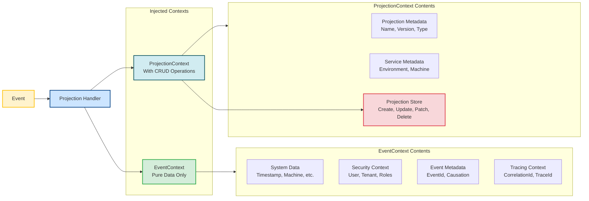

# Projection Contexts

Whizbang provides two types of context for projections:

1. **EventContext** - Rich event metadata (pure data, no side effects)
2. **ProjectionContext** - Projection-specific operations and metadata (CRUD operations, projection info)

Both can be injected at the method level or constructor level.



## EventContext Injection

EventContext is **pure data** (no side effects) that provides rich metadata about every event.

### EventContext Structure

```csharp{
title: "EventContext Structure"
description: "Complete structure of EventContext with system metadata, security context, event metadata, and tracing information"
framework: "NET8"
category: "Projections"
difficulty: "INTERMEDIATE"
tags: ["Projections", "EventContext", "Structure", "Metadata"]
filename: "EventContext.cs"
usingStatements: ["System", "System.Collections.Generic"]
showLineNumbers: true
}
public class EventContext {
    // System metadata
    public SystemData System { get; init; }

    // Security and multi-tenancy context
    public SecurityContext Security { get; init; }

    // Event-specific metadata
    public EventMetadata Event { get; init; }

    // Distributed tracing information
    public TracingContext Tracing { get; init; }
}

public class SystemData {
    // System-generated metadata
    public DateTime Timestamp { get; init; }
    public string MachineName { get; init; }
    public string Environment { get; init; }
    public long EventSequenceNumber { get; init; }

    // Custom system metadata (extensible)
    public IReadOnlyDictionary<string, object> CustomMetadata { get; init; }
}

public class SecurityContext {
    // User information
    public Guid? UserId { get; init; }
    public string UserName { get; init; }
    public IReadOnlyList<string> Roles { get; init; }

    // Multi-tenancy
    public Guid? TenantId { get; init; }
    public string TenantName { get; init; }

    // Permissions (evaluated at command/event creation time)
    public IReadOnlyList<string> Permissions { get; init; }

    // Service trust boundary
    public bool IsTrustedService { get; init; }
    public string ServiceName { get; init; }
}

public class EventMetadata {
    // Event identification
    public Guid EventId { get; init; }
    public string EventType { get; init; }
    public int EventVersion { get; init; }

    // Causation (what caused this event)
    public Guid? CausationId { get; init; }  // Command that caused this event
    public string CausationType { get; init; }

    // Custom event metadata
    public IReadOnlyDictionary<string, object> CustomMetadata { get; init; }
}

public class TracingContext {
    // Distributed tracing
    public string CorrelationId { get; init; }  // End-to-end request tracking
    public string TraceId { get; init; }        // OpenTelemetry trace ID
    public string SpanId { get; init; }         // OpenTelemetry span ID

    // Message journey
    public int HopCount { get; init; }          // Number of services traversed
    public DateTime InitiatedAt { get; init; }  // When the original request started
}
```

### EventContext Usage Example

```csharp{
title: "EventContext Usage in Projections"
description: "Accessing system metadata, security context, and tracing information"
framework: "NET8"
category: "Projections"
difficulty: "INTERMEDIATE"
tags: ["Projections", "EventContext", "Security", "Multi-Tenancy"]
nugetPackages: ["Whizbang.Core", "Whizbang.Projections"]
usingStatements: ["System", "System.Threading", "System.Threading.Tasks"]
showLineNumbers: true
}
using System;
using System.Threading;
using System.Threading.Tasks;

[WhizbangProjection]
public class TenantOrderHistoryProjection {
    private readonly Dictionary<Guid, List<TenantOrderRecord>> _ordersByTenant = new();

    public Task OnOrderPlaced(
        [WhizbangSubscribe] OrderPlaced @event,
        EventContext context,
        CancellationToken ct) {
        // Use security context for tenant isolation
        if (!context.Security.TenantId.HasValue) {
            throw new InvalidOperationException("TenantId is required for order events");
        }

        var tenantId = context.Security.TenantId.Value;

        // Create tenant-scoped record with rich context
        var record = new TenantOrderRecord {
            OrderId = @event.OrderId,
            TenantId = tenantId,
            TenantName = context.Security.TenantName,
            CustomerId = @event.CustomerId,
            Total = @event.Total,

            // System metadata
            PlacedAt = context.System.Timestamp,
            PlacedBy = context.Security.UserName,
            PlacedByUserId = context.Security.UserId,

            // Tracing
            CorrelationId = context.Tracing.CorrelationId,
            OriginatedAt = context.Tracing.InitiatedAt,

            // Event metadata
            EventId = context.Event.EventId,
            CausationId = context.Event.CausationId  // The PlaceOrder command ID
        };

        if (!_ordersByTenant.ContainsKey(tenantId)) {
            _ordersByTenant[tenantId] = new List<TenantOrderRecord>();
        }

        _ordersByTenant[tenantId].Add(record);

        return Task.CompletedTask;
    }

    // Query methods (tenant-scoped)
    public IEnumerable<TenantOrderRecord> GetOrdersForTenant(Guid tenantId) {
        return _ordersByTenant.TryGetValue(tenantId, out var orders)
            ? orders
            : Enumerable.Empty<TenantOrderRecord>();
    }
}

public record TenantOrderRecord {
    public Guid OrderId { get; init; }
    public Guid TenantId { get; init; }
    public string TenantName { get; init; }
    public Guid CustomerId { get; init; }
    public decimal Total { get; init; }

    // System metadata
    public DateTime PlacedAt { get; init; }
    public string PlacedBy { get; init; }
    public Guid? PlacedByUserId { get; init; }

    // Tracing
    public string CorrelationId { get; init; }
    public DateTime OriginatedAt { get; init; }

    // Event lineage
    public Guid EventId { get; init; }
    public Guid? CausationId { get; init; }
}
```

### EventContext Benefits

1. **Multi-Tenancy**: Access tenant context for data isolation
2. **Security**: User, roles, permissions available for authorization
3. **Auditing**: Track who did what and when
4. **Tracing**: End-to-end request tracking with correlation IDs
5. **Causation**: Link events back to originating commands
6. **Pure Data**: All context is immutable, enabling pure function projections
7. **Extensible**: Custom metadata dictionaries for app-specific data

### Purity Guarantees

EventContext is designed to maintain projection purity:

- **Immutable**: All properties are `init`-only
- **No side effects**: Contains only data, no methods with side effects
- **No I/O**: No database, file system, or network access
- **Deterministic**: Same event + context always produces same projection state
- **Roslyn Analyzers**: Whizbang.Analyzers enforces purity rules at compile time

---

## ProjectionContext Injection

While EventContext is pure data, **ProjectionContext** provides database operations and projection metadata. It can be injected at the method level or constructor level.

### ProjectionContext Structure

```csharp{
title: "ProjectionContext Structure"
description: "Complete structure of ProjectionContext with projection metadata, service information, and projection store operations"
framework: "NET8"
category: "Projections"
difficulty: "INTERMEDIATE"
tags: ["Projections", "ProjectionContext", "Structure", "CRUD Operations"]
filename: "ProjectionContext.cs"
usingStatements: ["System", "System.Collections.Generic", "System.Threading", "System.Threading.Tasks"]
showLineNumbers: true
}
public class ProjectionContext {
    // Projection metadata
    public ProjectionMetadata Projection { get; init; }

    // Service information
    public ServiceMetadata Service { get; init; }

    // Database operations (Create, Update, Patch, Delete)
    public IProjectionStore Store { get; init; }
}

public class ProjectionMetadata {
    public string ProjectionName { get; init; }
    public string ProjectionVersion { get; init; }
    public Type ProjectionType { get; init; }
    public DateTime StartedAt { get; init; }

    // Custom projection metadata
    public IReadOnlyDictionary<string, object> CustomMetadata { get; init; }
}

public class ServiceMetadata {
    public string ServiceName { get; init; }
    public string ServiceVersion { get; init; }
    public string Environment { get; init; }
    public string MachineName { get; init; }
}

public interface IProjectionStore {
    // Create
    Task CreateAsync<TProjection>(TProjection projection, CancellationToken ct = default)
        where TProjection : class;

    // Read (for checking existence or retrieving current state)
    Task<TProjection?> GetAsync<TProjection>(object key, CancellationToken ct = default)
        where TProjection : class;

    // Update (replace entire document)
    Task UpdateAsync<TProjection>(object key, TProjection projection, CancellationToken ct = default)
        where TProjection : class;

    // Patch (partial update)
    Task PatchAsync<TProjection>(object key, Action<TProjection> patchAction, CancellationToken ct = default)
        where TProjection : class;

    // Delete
    Task DeleteAsync<TProjection>(object key, CancellationToken ct = default)
        where TProjection : class;

    // Batch operations
    Task CreateManyAsync<TProjection>(IEnumerable<TProjection> projections, CancellationToken ct = default)
        where TProjection : class;
}

// Return values for projection methods
public enum ProjectionReturnType {
    Accepted,  // Event was processed successfully (default)
    Ignored    // Event was intentionally ignored/skipped
}

public static class ProjectionContextExtensions {
    // Return a projection outcome (metadata only, no side effects)
    public static Task Return(this ProjectionContext context, ProjectionReturnType returnType) {
        context.RecordOutcome(returnType);
        return Task.CompletedTask;
    }
}
```

### ProjectionContext Usage Examples

See the complete examples in [Projection Return Values](./projection-return-values.md).

### ProjectionContext Benefits

1. **Database Operations**: Built-in CRUD operations (Create, Update, Patch, Delete)
2. **Projection Metadata**: Access projection name, version, and custom metadata
3. **Service Context**: Know which service and environment the projection is running in
4. **Flexible Injection**: Inject at method or constructor level based on your needs
5. **Batch Operations**: Efficient bulk creates for high-throughput scenarios
6. **Return Values**: Signal processing outcomes with `Return()` method

---

## Next Steps

- [Projection Subscriptions](./projection-subscriptions.md) - Event subscription patterns
- [Projection Purity](./projection-purity.md) - Maintaining pure, deterministic projections
- [Projection Return Values](./projection-return-values.md) - Using return values for observability
