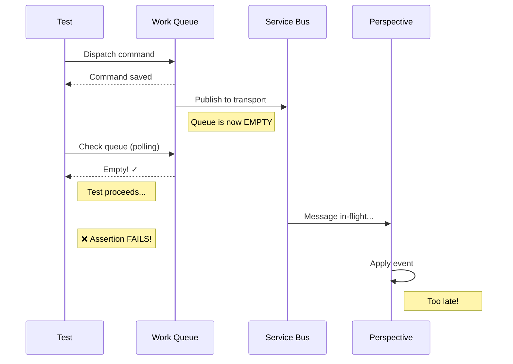
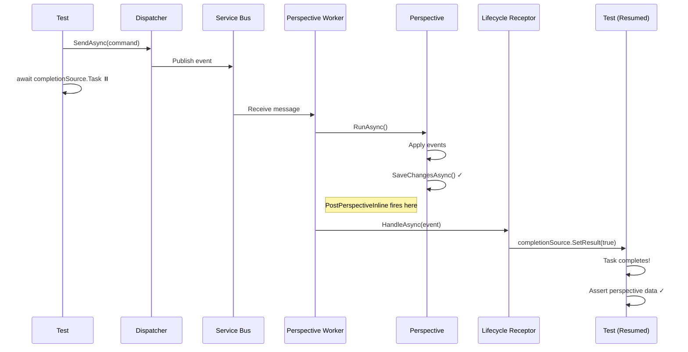

# Lifecycle Synchronization

Integration tests must wait for **asynchronous perspective processing** to complete before asserting on perspective data. **Polling-based approaches have race conditions**. Lifecycle synchronization provides **deterministic completion detection** using the `PostPerspectiveInline` lifecycle stage.

## The Race Condition Problem

### Why Polling Fails

Traditional polling approach checks if database queues are empty:

```csharp
// ❌ RACE CONDITION!
public async Task WaitForEventProcessingAsync() {
  for (var i = 0; i < 100; i++) {
    var hasPendingWork = await _dbContext.WorkItems.AnyAsync();
    if (!hasPendingWork) {
      return;  // Queue empty = done?
    }
    await Task.Delay(100);
  }
}
```

**The Problem**:


**The queue is empty while message is in-flight through Service Bus!**

### Test Failures

```csharp
[Test]
public async Task CreateProduct_UpdatesProductCatalog_FailsRandomlyAsync() {
  // Arrange
  var command = new CreateProductCommand("Widget", 9.99m);

  // Act
  await _dispatcher.SendAsync(command);
  await WaitForEventProcessingAsync();  // ❌ Returns too early!

  // Assert
  var product = await _productLens.GetByIdAsync(command.ProductId);
  Assert.That(product).IsNotNull();  // ❌ FAILS randomly!
}
```

**Failure Rate**: 20-40% depending on system load and Service Bus latency.

---

## The Solution: `PostPerspectiveInline`

### Lifecycle Stage Guarantee

The **`PostPerspectiveInline` lifecycle stage** fires:
- ✅ **After** perspective `RunAsync()` completes
- ✅ **After** database writes are committed
- ✅ **Before** checkpoint is reported to coordinator
- ✅ **Blocks** checkpoint reporting until receptors complete

**Timing Diagram**:


**Key Guarantee**: When `PostPerspectiveInline` fires, **database writes are committed** - safe to query!

---

## Basic Test Pattern

### Step 1: Create Completion Receptor

```csharp
using Whizbang.Core;
using Whizbang.Core.Messaging;

[FireAt(LifecycleStage.PostPerspectiveInline)]
public sealed class PerspectiveCompletionReceptor<TEvent> : IReceptor<TEvent>
  where TEvent : IEvent {

  private readonly TaskCompletionSource<bool> _completionSource;
  private readonly string? _perspectiveName;
  private readonly ILifecycleContext? _context;

  public PerspectiveCompletionReceptor(
      TaskCompletionSource<bool> completionSource,
      string? perspectiveName = null,
      ILifecycleContext? context = null) {

    _completionSource = completionSource;
    _perspectiveName = perspectiveName;
    _context = context;
  }

  public ValueTask HandleAsync(TEvent message, CancellationToken ct) {
    // Filter by perspective if specified
    if (_context is not null && _perspectiveName is not null) {
      if (_context.PerspectiveName != _perspectiveName) {
        return ValueTask.CompletedTask;  // Not our perspective
      }
    }

    // Signal test to proceed
    _completionSource.TrySetResult(true);
    return ValueTask.CompletedTask;
  }
}
```

### Step 2: Register at Runtime

```csharp
[Test]
public async Task CreateProduct_UpdatesProductCatalog_DeterministicallyAsync() {
  // Arrange
  var completionSource = new TaskCompletionSource<bool>();
  var receptor = new PerspectiveCompletionReceptor<ProductCreatedEvent>(
    completionSource,
    perspectiveName: "ProductCatalog"  // Optional: filter by perspective
  );

  var registry = _host.Services.GetRequiredService<ILifecycleReceptorRegistry>();
  registry.Register<ProductCreatedEvent>(receptor, LifecycleStage.PostPerspectiveInline);

  try {
    var command = new CreateProductCommand("Widget", 9.99m);

    // Act
    await _dispatcher.SendAsync(command);

    // Wait for perspective processing to complete (deterministic!)
    await completionSource.Task.WaitAsync(TimeSpan.FromSeconds(15));

    // Assert - perspective data is guaranteed to be saved
    var product = await _productLens.GetByIdAsync(command.ProductId);
    Assert.That(product).IsNotNull();
    Assert.That(product!.Name).IsEqualTo("Widget");
    Assert.That(product.Price).IsEqualTo(9.99m);

  } finally {
    // Always unregister
    registry.Unregister<ProductCreatedEvent>(receptor, LifecycleStage.PostPerspectiveInline);
  }
}
```

**Success Rate**: 100% - no more race conditions!

---

## Helper Method Pattern

### Extension Method

Create a reusable helper method in your test fixtures:

```csharp
// File: tests/ECommerce.Integration.Tests/Fixtures/LifecycleReceptorTestExtensions.cs
using Microsoft.Extensions.DependencyInjection;
using Microsoft.Extensions.Hosting;
using Whizbang.Core;
using Whizbang.Core.Messaging;

public static class LifecycleReceptorTestExtensions {

  /// <summary>
  /// Waits for perspective processing to complete for a specific event type.
  /// Uses PostPerspectiveInline lifecycle stage for deterministic synchronization.
  /// </summary>
  public static async Task WaitForPerspectiveCompletionAsync<TEvent>(
      this IHost host,
      string? perspectiveName = null,
      int timeoutMilliseconds = 15000)
      where TEvent : IEvent {

    ArgumentNullException.ThrowIfNull(host);

    var completionSource = new TaskCompletionSource<bool>();
    var receptor = new PerspectiveCompletionReceptor<TEvent>(completionSource, perspectiveName);
    var registry = host.Services.GetRequiredService<ILifecycleReceptorRegistry>();

    registry.Register<TEvent>(receptor, LifecycleStage.PostPerspectiveInline);

    try {
      await completionSource.Task.WaitAsync(TimeSpan.FromMilliseconds(timeoutMilliseconds));
    } finally {
      registry.Unregister<TEvent>(receptor, LifecycleStage.PostPerspectiveInline);
    }
  }
}
```

### Simplified Test Usage

```csharp
[Test]
public async Task CreateProduct_UpdatesProductCatalog_SimpleAsync() {
  // Arrange
  var command = new CreateProductCommand("Widget", 9.99m);

  // Act
  await _dispatcher.SendAsync(command);

  // Wait for perspective completion (one line!)
  await _host.WaitForPerspectiveCompletionAsync<ProductCreatedEvent>(
    perspectiveName: "ProductCatalog",
    timeoutMilliseconds: 15000
  );

  // Assert
  var product = await _productLens.GetByIdAsync(command.ProductId);
  Assert.That(product).IsNotNull();
  Assert.That(product!.Name).IsEqualTo("Widget");
}
```

**Benefits**:
- ✅ One-line synchronization
- ✅ Automatic registration/cleanup
- ✅ Consistent timeout handling
- ✅ Reusable across all tests

---

## Advanced Patterns

### Pattern 1: Multiple Event Types

Wait for multiple different events (e.g., command triggers multiple perspectives):

```csharp
public static async Task WaitForMultiplePerspectiveCompletionsAsync(
    this IHost host,
    Type[] eventTypes,
    string? perspectiveName = null,
    int timeoutMilliseconds = 15000) {

  ArgumentNullException.ThrowIfNull(host);
  ArgumentNullException.ThrowIfNull(eventTypes);

  if (eventTypes.Length == 0) {
    return;
  }

  var completionSources = eventTypes.Select(_ => new TaskCompletionSource<bool>()).ToArray();
  var receptors = new List<object>();
  var registry = host.Services.GetRequiredService<ILifecycleReceptorRegistry>();

  try {
    // Register receptors for each event type
    for (var i = 0; i < eventTypes.Length; i++) {
      var eventType = eventTypes[i];
      var completionSource = completionSources[i];

      // Create receptor using reflection (dynamic event type)
      var receptorType = typeof(PerspectiveCompletionReceptor<>).MakeGenericType(eventType);
      var receptor = Activator.CreateInstance(receptorType, completionSource, perspectiveName, null)
        ?? throw new InvalidOperationException($"Failed to create receptor for {eventType.Name}");

      receptors.Add(receptor);

      // Register using reflection
      var registerMethod = typeof(ILifecycleReceptorRegistry)
        .GetMethod(nameof(ILifecycleReceptorRegistry.Register))!
        .MakeGenericMethod(eventType);
      registerMethod.Invoke(registry, new[] { receptor, LifecycleStage.PostPerspectiveInline });
    }

    // Wait for ALL completions
    await Task.WhenAll(completionSources.Select(cs => cs.Task))
      .WaitAsync(TimeSpan.FromMilliseconds(timeoutMilliseconds));

  } finally {
    // Unregister all receptors
    for (var i = 0; i < eventTypes.Length; i++) {
      var eventType = eventTypes[i];
      var receptor = receptors[i];

      var unregisterMethod = typeof(ILifecycleReceptorRegistry)
        .GetMethod(nameof(ILifecycleReceptorRegistry.Unregister))!
        .MakeGenericMethod(eventType);
      unregisterMethod.Invoke(registry, new[] { receptor, LifecycleStage.PostPerspectiveInline });
    }
  }
}
```

**Usage**:
```csharp
[Test]
public async Task UpdateInventory_UpdatesMultiplePerspectives_DeterministicallyAsync() {
  // Arrange
  var command = new UpdateInventoryCommand(productId: _productId, quantity: 100);

  // Act
  await _dispatcher.SendAsync(command);

  // Wait for BOTH events to be processed
  await _host.WaitForMultiplePerspectiveCompletionsAsync(
    new[] { typeof(InventoryUpdatedEvent), typeof(ProductModifiedEvent) },
    timeoutMilliseconds: 20000
  );

  // Assert - both perspectives updated
  var inventory = await _inventoryLens.GetByProductIdAsync(_productId);
  var product = await _productLens.GetByIdAsync(_productId);

  Assert.That(inventory!.Quantity).IsEqualTo(100);
  Assert.That(product!.LastModified).IsNotNull();
}
```

### Pattern 2: Perspective-Specific Filtering

Wait for a specific perspective to complete (useful when multiple perspectives process same event):

```csharp
[Test]
public async Task CreateProduct_UpdatesOnlyProductCatalog_NotInventoryAsync() {
  // Arrange
  var command = new CreateProductCommand("Widget", 9.99m);

  // Act
  await _dispatcher.SendAsync(command);

  // Wait for ProductCatalog perspective specifically
  await _host.WaitForPerspectiveCompletionAsync<ProductCreatedEvent>(
    perspectiveName: "ProductCatalog"  // Only this perspective
  );

  // Assert - ProductCatalog updated
  var product = await _productLens.GetByIdAsync(command.ProductId);
  Assert.That(product).IsNotNull();

  // But Inventory perspective NOT updated yet (different event)
  var inventory = await _inventoryLens.GetByProductIdAsync(command.ProductId);
  Assert.That(inventory).IsNull();  // Expected!
}
```

### Pattern 3: Timeout Handling

Handle timeouts gracefully with diagnostic information:

```csharp
[Test]
public async Task SlowPerspective_TimesOut_WithDiagnosticsAsync() {
  // Arrange
  var command = new CreateProductCommand("Widget", 9.99m);

  // Act & Assert
  await _dispatcher.SendAsync(command);

  try {
    await _host.WaitForPerspectiveCompletionAsync<ProductCreatedEvent>(
      timeoutMilliseconds: 1000  // Short timeout for demonstration
    );

    Assert.Fail("Expected TimeoutException");

  } catch (TimeoutException ex) {
    // Gather diagnostics
    var pendingWork = await _dbContext.WorkItems.CountAsync();
    var lastCheckpoint = await _dbContext.PerspectiveCheckpoints
      .Where(p => p.PerspectiveName == "ProductCatalog")
      .FirstOrDefaultAsync();

    Assert.Fail(
      $"Perspective processing timed out. " +
      $"Pending work items: {pendingWork}, " +
      $"Last checkpoint: {lastCheckpoint?.LastProcessedEventId}");
  }
}
```

### Pattern 4: Any-Of-Multiple Events

Wait for **any one** of multiple events (first to complete):

```csharp
[Test]
public async Task Command_TriggersOneOfSeveralEvents_FlexiblyAsync() {
  // Arrange
  var command = new ProcessOrderCommand(orderId: _orderId);

  // Create completion sources for each possible event
  var orderCompletedSource = new TaskCompletionSource<bool>();
  var orderFailedSource = new TaskCompletionSource<bool>();

  var registry = _host.Services.GetRequiredService<ILifecycleReceptorRegistry>();

  var completedReceptor = new PerspectiveCompletionReceptor<OrderCompletedEvent>(orderCompletedSource);
  var failedReceptor = new PerspectiveCompletionReceptor<OrderFailedEvent>(orderFailedSource);

  registry.Register<OrderCompletedEvent>(completedReceptor, LifecycleStage.PostPerspectiveInline);
  registry.Register<OrderFailedEvent>(failedReceptor, LifecycleStage.PostPerspectiveInline);

  try {
    // Act
    await _dispatcher.SendAsync(command);

    // Wait for EITHER event (first to complete)
    var completedTask = await Task.WhenAny(
      orderCompletedSource.Task,
      orderFailedSource.Task
    ).WaitAsync(TimeSpan.FromSeconds(15));

    // Assert based on which event fired
    if (completedTask == orderCompletedSource.Task) {
      var order = await _orderLens.GetByIdAsync(_orderId);
      Assert.That(order!.Status).IsEqualTo(OrderStatus.Completed);
    } else {
      var order = await _orderLens.GetByIdAsync(_orderId);
      Assert.That(order!.Status).IsEqualTo(OrderStatus.Failed);
    }

  } finally {
    registry.Unregister<OrderCompletedEvent>(completedReceptor, LifecycleStage.PostPerspectiveInline);
    registry.Unregister<OrderFailedEvent>(failedReceptor, LifecycleStage.PostPerspectiveInline);
  }
}
```

---

## Integration Test Fixture Pattern

### Base Fixture Setup

```csharp
public class ServiceBusIntegrationFixture : IAsyncDisposable {
  protected IHost _inventoryHost = null!;
  protected IHost _bffHost = null!;
  protected IDispatcher _dispatcher = null!;

  [Before(Test)]
  public async Task SetupAsync() {
    // Start hosts
    _inventoryHost = await InventoryHostBuilder.BuildAsync();
    _bffHost = await BffHostBuilder.BuildAsync();

    await _inventoryHost.StartAsync();
    await _bffHost.StartAsync();

    _dispatcher = _bffHost.Services.GetRequiredService<IDispatcher>();
  }

  [After(Test)]
  public async Task CleanupAsync() {
    await _inventoryHost.StopAsync();
    await _bffHost.StopAsync();
    await DisposeAsync();
  }

  // Helper method available to all tests
  protected Task WaitForPerspectiveAsync<TEvent>(
      string? perspectiveName = null,
      int timeoutMs = 15000)
      where TEvent : IEvent {

    return _inventoryHost.WaitForPerspectiveCompletionAsync<TEvent>(
      perspectiveName,
      timeoutMs
    );
  }

  public async ValueTask DisposeAsync() {
    if (_inventoryHost is not null) await _inventoryHost.DisposeAsync();
    if (_bffHost is not null) await _bffHost.DisposeAsync();
  }
}
```

### Test Class Usage

```csharp
public class CreateProductWorkflowTests : ServiceBusIntegrationFixture {

  [Test]
  public async Task CreateProduct_FlowsFromBffToInventory_DeterministicallyAsync() {
    // Arrange
    var command = new CreateProductCommand("Widget", 9.99m);

    // Act
    await _dispatcher.SendAsync(command);

    // Wait for perspective (uses helper from base fixture)
    await WaitForPerspectiveAsync<ProductCreatedEvent>(
      perspectiveName: "ProductCatalog"
    );

    // Assert
    var inventoryDbContext = _inventoryHost.Services
      .GetRequiredService<InventoryDbContext>();

    var product = await inventoryDbContext.Products
      .FirstOrDefaultAsync(p => p.Id == command.ProductId);

    Assert.That(product).IsNotNull();
    Assert.That(product!.Name).IsEqualTo("Widget");
  }
}
```

---

## Troubleshooting

### Problem: TimeoutException

**Symptoms**: Test times out waiting for perspective completion.

**Possible Causes**:
1. **Perspective not running** - Check that perspective worker is started
2. **Different event type** - Verify you're waiting for correct event
3. **Perspective name mismatch** - Check perspective name filter
4. **Message routing issue** - Event not reaching perspective

**Debugging**:
```csharp
// Check pending work items
var pendingWork = await _dbContext.WorkItems.ToListAsync();
Console.WriteLine($"Pending work: {pendingWork.Count}");

// Check perspective checkpoints
var checkpoint = await _dbContext.PerspectiveCheckpoints
  .FirstOrDefaultAsync(p => p.PerspectiveName == "ProductCatalog");
Console.WriteLine($"Last checkpoint: {checkpoint?.LastProcessedEventId}");

// Check if event was published
var events = await _dbContext.Events
  .Where(e => e.EventType == "ProductCreatedEvent")
  .ToListAsync();
Console.WriteLine($"ProductCreatedEvent count: {events.Count}");
```

### Problem: Test Passes But Assertions Fail

**Symptoms**: WaitForPerspectiveCompletionAsync returns, but data not in database.

**Possible Causes**:
1. **Wrong perspective** - Waiting for perspective that doesn't update target data
2. **Multiple perspectives** - Need to wait for multiple perspectives
3. **Async stage instead of Inline** - Use `PostPerspectiveInline`, not `PostPerspectiveAsync`

**Fix**:
```csharp
// ❌ WRONG: PostPerspectiveAsync (non-blocking, no guarantee)
[FireAt(LifecycleStage.PostPerspectiveAsync)]
public class CompletionReceptor : IReceptor<ProductCreatedEvent> { }

// ✅ CORRECT: PostPerspectiveInline (blocking, guarantees persistence)
[FireAt(LifecycleStage.PostPerspectiveInline)]
public class CompletionReceptor : IReceptor<ProductCreatedEvent> { }
```

### Problem: Receptor Not Firing

**Symptoms**: WaitForPerspectiveCompletionAsync times out, receptor never called.

**Possible Causes**:
1. **Not registered** - Forgot to call `registry.Register()`
2. **Wrong event type** - Generic type mismatch
3. **Wrong stage** - Using different stage than `PostPerspectiveInline`
4. **Perspective name filter excludes event** - Check filter logic

**Debugging**:
```csharp
// Add logging to receptor
public ValueTask HandleAsync(ProductCreatedEvent evt, CancellationToken ct) {
  Console.WriteLine($"RECEPTOR FIRED: {evt.GetType().Name}");
  Console.WriteLine($"Perspective: {_context?.PerspectiveName}");
  Console.WriteLine($"Stream: {_context?.StreamId}");

  _completionSource.TrySetResult(true);
  return ValueTask.CompletedTask;
}
```

### Problem: Registry Not Found

**Symptoms**: `GetRequiredService<ILifecycleReceptorRegistry>()` throws exception.

**Fix**: Register in DI container:
```csharp
// In Startup.cs or Program.cs
services
  .AddWhizbang()  // Automatically registers ILifecycleReceptorRegistry
  .WithEFCore<MyDbContext>()
  .WithDriver.Postgres;
```

---

## Performance Considerations

### Lifecycle Receptor Overhead

**Inline receptors add < 1ms per event**:
- Registration: One-time cost (< 0.1ms)
- Invocation: Pattern matching + delegate call (< 0.5ms)
- Completion signal: `TaskCompletionSource.SetResult()` (< 0.1ms)

**For tests with 1000+ events**:
- Traditional polling: 100ms * 100 iterations = ~10 seconds
- Lifecycle sync: 1ms * 1000 events = ~1 second

**Lifecycle synchronization is 10x faster than polling!**

### Timeout Recommendations

```csharp
// Local development (fast)
timeoutMilliseconds: 5000   // 5 seconds

// CI/CD pipeline (slower)
timeoutMilliseconds: 15000  // 15 seconds

// Slow integration tests (Azure Service Bus)
timeoutMilliseconds: 30000  // 30 seconds
```

---

## Migration Guide

### Before: Polling-Based Tests

```csharp
[Test]
public async Task OldTest_UsesPollingSyncAsync() {
  // Arrange
  var command = new CreateProductCommand("Widget", 9.99m);

  // Act
  await _dispatcher.SendAsync(command);

  // ❌ OLD: Polling (race condition!)
  await WaitForEventProcessingAsync();

  // Assert
  var product = await _productLens.GetByIdAsync(command.ProductId);
  Assert.That(product).IsNotNull();
}

private async Task WaitForEventProcessingAsync() {
  for (var i = 0; i < 100; i++) {
    var hasPendingWork = await _dbContext.WorkItems.AnyAsync();
    if (!hasPendingWork) return;
    await Task.Delay(100);
  }
}
```

### After: Lifecycle Synchronization

```csharp
[Test]
public async Task NewTest_UsesLifecycleSyncAsync() {
  // Arrange
  var command = new CreateProductCommand("Widget", 9.99m);

  // Act
  await _dispatcher.SendAsync(command);

  // ✅ NEW: Deterministic lifecycle synchronization
  await _host.WaitForPerspectiveCompletionAsync<ProductCreatedEvent>(
    perspectiveName: "ProductCatalog"
  );

  // Assert
  var product = await _productLens.GetByIdAsync(command.ProductId);
  Assert.That(product).IsNotNull();
}
```

**Migration Steps**:
1. Add `PerspectiveCompletionReceptor<TEvent>` to test project
2. Add `WaitForPerspectiveCompletionAsync<TEvent>()` extension method
3. Replace `WaitForEventProcessingAsync()` calls with lifecycle sync
4. Remove polling helper methods
5. Run tests 100 times to verify 100% reliability

---

## Related Topics

- [Lifecycle Stages](../core-concepts/lifecycle-stages.md) - All 18 stages with timing guarantees
- [Lifecycle Receptors](../core-concepts/lifecycle-receptors.md) - API reference for [FireAt] attribute
- [Integration Testing](integration-testing.md) - Complete integration test patterns
- [PerspectiveWorker](../workers/perspective-worker.md) - Perspective processing architecture

---

## Summary

- **Problem**: Polling has race conditions (in-flight messages not visible in queue)
- **Solution**: `PostPerspectiveInline` lifecycle stage guarantees persistence
- **Pattern**: Register `PerspectiveCompletionReceptor<TEvent>` at runtime
- **Helper**: `WaitForPerspectiveCompletionAsync<TEvent>()` extension method
- **Benefits**: 100% test reliability, 10x faster than polling
- **Advanced**: Multiple events, perspective filtering, any-of patterns
- **Migration**: Replace polling with lifecycle sync in existing tests
