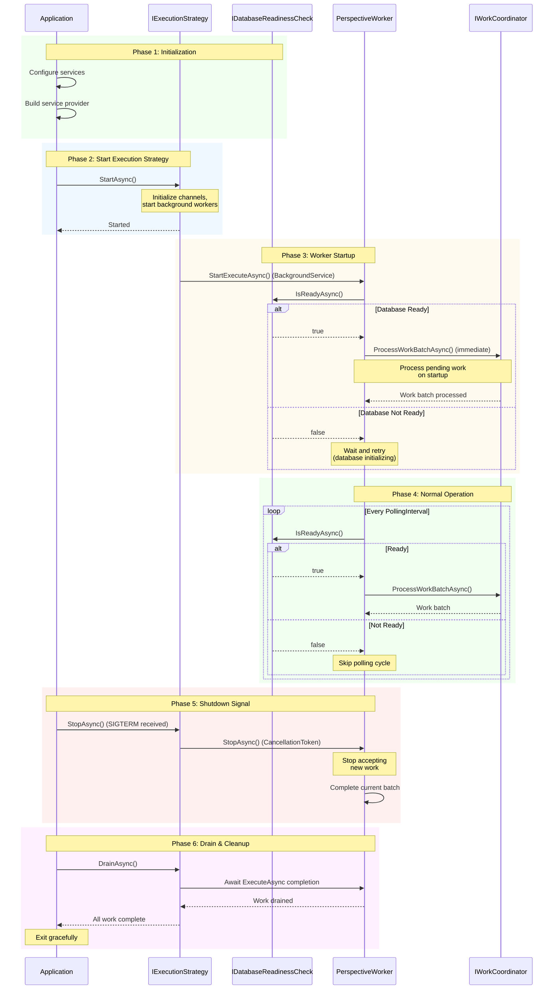

# Execution Lifecycle

The **Execution Lifecycle** defines how Whizbang coordinates application startup, normal operation, and graceful shutdown. It's built around the `IExecutionStrategy` interface which provides lifecycle hooks (`StartAsync`, `StopAsync`, `DrainAsync`) for controlled initialization and cleanup.

## Overview

### Why Lifecycle Management Matters

Without proper lifecycle coordination:
- ❌ Workers start before database is ready → exceptions on startup
- ❌ Application shuts down mid-processing → data loss
- ❌ In-flight work abandoned → orphaned leases
- ❌ No graceful cleanup → resource leaks

With `IExecutionStrategy` lifecycle:
- ✅ Workers wait for dependencies (database ready) before starting
- ✅ Clean shutdown signal → no new work accepted
- ✅ Work draining → in-flight operations complete
- ✅ Graceful cleanup → resources released properly

---

## IExecutionStrategy Interface

**IExecutionStrategy.cs**:
```csharp
/// <summary>
/// Defines a strategy for executing message handlers.
/// Implementations control ordering, concurrency, and lifecycle.
/// </summary>
/// <docs>components/dispatcher</docs>
/// <docs>workers/execution-lifecycle</docs>
public interface IExecutionStrategy {
  /// <summary>
  /// Name of the execution strategy (e.g., "Serial", "Parallel")
  /// </summary>
  string Name { get; }

  /// <summary>
  /// Executes a message handler with the given envelope and context.
  /// </summary>
  ValueTask<TResult> ExecuteAsync<TResult>(
    IMessageEnvelope envelope,
    Func<IMessageEnvelope, PolicyContext, ValueTask<TResult>> handler,
    PolicyContext context,
    CancellationToken ct = default
  );

  /// <summary>
  /// Starts the execution strategy (initializes any background workers/channels)
  /// </summary>
  Task StartAsync(CancellationToken ct = default);

  /// <summary>
  /// Stops the execution strategy (stops accepting new work)
  /// </summary>
  Task StopAsync(CancellationToken ct = default);

  /// <summary>
  /// Drains any pending work and waits for completion
  /// </summary>
  Task DrainAsync(CancellationToken ct = default);
}
```

**Three Lifecycle Phases**:
1. **StartAsync**: Initialize workers, channels, background tasks
2. **StopAsync**: Stop accepting new work, signal shutdown
3. **DrainAsync**: Wait for in-flight work to complete

---

## Startup Lifecycle Flow



**Key Phases**:
1. **Initialization**: Configure services, build DI container
2. **Start Execution Strategy**: Initialize execution infrastructure
3. **Worker Startup**: Workers start, check database readiness, process pending work
4. **Normal Operation**: Polling loop with database readiness checks
5. **Shutdown Signal**: Stop accepting new work
6. **Drain & Cleanup**: Wait for in-flight work, release resources

---

## StartAsync: Initialization

**Purpose**: Initialize execution strategy infrastructure before accepting work.

### Execution Strategy Responsibilities

**Example: SerialExecutionStrategy**:
```csharp
public class SerialExecutionStrategy : IExecutionStrategy {
  private Channel<WorkItem>? _channel;
  private Task? _worker;

  public async Task StartAsync(CancellationToken ct = default) {
    // 1. Create bounded channel for work items
    _channel = Channel.CreateBounded<WorkItem>(new BoundedChannelOptions(1000) {
      FullMode = BoundedChannelFullMode.Wait
    });

    // 2. Start background worker
    _worker = Task.Run(() => ProcessWorkItemsAsync(ct), ct);

    _logger.LogInformation("SerialExecutionStrategy started");
  }

  private async Task ProcessWorkItemsAsync(CancellationToken ct) {
    await foreach (var workItem in _channel.Reader.ReadAllAsync(ct)) {
      // Process work items serially
      await workItem.Handler(workItem.Envelope, workItem.Context, ct);
    }
  }
}
```

**What happens**:
- Create channels, queues, or other work coordination structures
- Start background workers or task processors
- Initialize connections (if needed)
- Log startup completion

### BackgroundService Integration

**PerspectiveWorker (BackgroundService)**:
```csharp
public class PerspectiveWorker : BackgroundService {
  protected override async Task ExecuteAsync(CancellationToken stoppingToken) {
    _logger.LogInformation(
      "Perspective worker starting: Instance {InstanceId}",
      _instanceProvider.InstanceId
    );

    // IMMEDIATE processing on startup (before first poll delay)
    try {
      var isDatabaseReady = await _databaseReadinessCheck.IsReadyAsync(stoppingToken);
      if (isDatabaseReady) {
        await ProcessWorkBatchAsync(stoppingToken);
        _logger.LogDebug("Initial perspective checkpoint processing complete");
      } else {
        _logger.LogWarning("Database not ready on startup - skipping initial processing");
      }
    } catch (Exception ex) when (ex is not OperationCanceledException) {
      _logger.LogError(ex, "Error processing initial perspective checkpoints");
    }

    // Enter normal polling loop
    while (!stoppingToken.IsCancellationRequested) {
      // ... polling logic
    }
  }
}
```

**Best Practices**:
- ✅ **Check dependencies** before starting work (database readiness)
- ✅ **Process pending work immediately** on startup (don't wait for first poll)
- ✅ **Log startup events** for observability
- ✅ **Handle startup exceptions** gracefully (don't crash worker)

---

## StopAsync: Shutdown Signal

**Purpose**: Stop accepting new work and signal workers to begin shutdown.

### Execution Strategy Responsibilities

**Example: SerialExecutionStrategy**:
```csharp
public async Task StopAsync(CancellationToken ct = default) {
  // 1. Stop accepting new work
  _channel?.Writer.Complete();

  _logger.LogInformation("SerialExecutionStrategy stopped accepting new work");

  // NOTE: Do NOT wait for work to complete here - that's DrainAsync's job
}
```

**What happens**:
- Close channels (no new writes accepted)
- Set internal flags (`_stopping = true`)
- Signal background workers to stop after current work
- Log shutdown initiated

**DO NOT**:
- ❌ Wait for work to complete (that's `DrainAsync`)
- ❌ Forcefully terminate workers (allow graceful completion)
- ❌ Throw exceptions (shutdown should always succeed)

### BackgroundService Integration

**PerspectiveWorker**:
```csharp
protected override async Task ExecuteAsync(CancellationToken stoppingToken) {
  while (!stoppingToken.IsCancellationRequested) {
    try {
      // ... process work batch
    } catch (OperationCanceledException) {
      // Graceful shutdown - exit loop
      _logger.LogInformation("Perspective worker stopping (cancellation requested)");
      break;
    }
  }

  _logger.LogInformation("Perspective worker stopped");
}
```

**How BackgroundService works**:
1. `IHostApplicationLifetime.ApplicationStopping` event fires
2. `BackgroundService.StopAsync()` called → sets `CancellationToken`
3. Worker detects cancellation → completes current batch
4. Worker exits `ExecuteAsync()` loop
5. `BackgroundService.StopAsync()` awaits `ExecuteAsync()` completion

**Timeline Example**:
```
t=0ms:    SIGTERM received (Ctrl+C or docker stop)
t=5ms:    ApplicationStopping event fires
t=10ms:   BackgroundService.StopAsync() called
t=15ms:   CancellationToken set
t=100ms:  Worker detects cancellation
t=150ms:  Current batch completes
t=200ms:  Worker exits ExecuteAsync()
t=250ms:  StopAsync() returns
```

---

## DrainAsync: Work Completion

**Purpose**: Wait for all in-flight work to complete before final shutdown.

### Execution Strategy Responsibilities

**Example: SerialExecutionStrategy**:
```csharp
public async Task DrainAsync(CancellationToken ct = default) {
  // 1. Wait for background worker to complete
  if (_worker != null) {
    try {
      await _worker.WaitAsync(TimeSpan.FromSeconds(30), ct);
      _logger.LogInformation("SerialExecutionStrategy drained all work");
    } catch (TimeoutException) {
      _logger.LogWarning("Drain timeout - some work may not have completed");
    }
  }

  // 2. Cleanup resources
  _channel = null;
  _worker = null;
}
```

**What happens**:
- Wait for background workers to complete (with timeout)
- Await any pending task completion
- Release resources (channels, connections)
- Log drain completion

**Timeout Handling**:
- Set reasonable timeout (e.g., 30 seconds)
- Log warning if timeout exceeded
- Allow shutdown to proceed (don't block forever)

### Application Integration

**ASP.NET Core Program.cs**:
```csharp
var builder = WebApplication.CreateBuilder(args);

// Configure services
builder.Services.AddScoped<IExecutionStrategy, SerialExecutionStrategy>();
builder.Services.AddHostedService<PerspectiveWorker>();

var app = builder.Build();

// Application startup
await app.StartAsync();

// Lifecycle: StartAsync called automatically by .NET host
// - IExecutionStrategy.StartAsync()
// - BackgroundService.StartExecuteAsync()

// Normal operation
// - Workers process events
// - Application serves requests

// Shutdown signal (SIGTERM, Ctrl+C, etc.)
var lifetime = app.Services.GetRequiredService<IHostApplicationLifetime>();
lifetime.ApplicationStopping.Register(() => {
  // IExecutionStrategy.StopAsync() called
  // BackgroundService.StopAsync() sets CancellationToken
});

await app.WaitForShutdownAsync();

// Lifecycle: DrainAsync called before final shutdown
// - IExecutionStrategy.DrainAsync()
// - BackgroundService awaits ExecuteAsync completion

await app.StopAsync();
```

---

## Database Readiness Coordination

Workers use `IDatabaseReadinessCheck` to coordinate startup with database availability:

### Why Database Readiness Matters

**Without readiness checks**:
```csharp
// ❌ Worker starts before database is ready
protected override async Task ExecuteAsync(CancellationToken ct) {
  while (!ct.IsCancellationRequested) {
    try {
      await _workCoordinator.ProcessWorkBatchAsync(...);  // EXCEPTION: database not ready
    } catch (Npgsql.NpgsqlException ex) {
      // Database connection failed - but why?
      // - Migrations not run yet?
      // - Connection pool not initialized?
      // - Database server not started?
      // Can't distinguish startup from runtime failures
    }
  }
}
```

**With readiness checks**:
```csharp
// ✅ Worker waits for database before processing
protected override async Task ExecuteAsync(CancellationToken ct) {
  while (!ct.IsCancellationRequested) {
    var isDatabaseReady = await _databaseReadinessCheck.IsReadyAsync(ct);
    if (!isDatabaseReady) {
      _logger.LogInformation("Database not ready, skipping processing");
      await Task.Delay(_pollingInterval, ct);
      continue;  // Skip this cycle
    }

    // Database is ready - safe to process work
    await _workCoordinator.ProcessWorkBatchAsync(...);
  }
}
```

**Benefits**:
- ✅ **Distinguish startup from runtime failures** (not ready vs connection failed)
- ✅ **Avoid exception noise** during startup (clean logs)
- ✅ **Graceful waiting** (poll until ready)
- ✅ **Coordination** (multiple workers wait for same signal)

### Implementation Example

**PostgresDatabaseReadinessCheck**:
```csharp
public class PostgresDatabaseReadinessCheck : IDatabaseReadinessCheck {
  private readonly IDbConnectionFactory _connectionFactory;
  private readonly ILogger<PostgresDatabaseReadinessCheck> _logger;

  private bool? _isReady;  // Cache result (avoid repeated checks)

  public async Task<bool> IsReadyAsync(CancellationToken ct = default) {
    if (_isReady == true) {
      return true;  // Already ready - skip check
    }

    try {
      await using var connection = _connectionFactory.CreateConnection();
      await connection.OpenAsync(ct);

      // Check for required tables
      var tableExists = await connection.ExecuteScalarAsync<bool>(
        """
        SELECT EXISTS (
          SELECT 1 FROM information_schema.tables
          WHERE table_name IN ('wh_outbox', 'wh_inbox', 'wh_events', 'wh_perspective_checkpoints')
        )
        """,
        cancellationToken: ct
      );

      _isReady = tableExists;
      return tableExists;

    } catch (Npgsql.NpgsqlException ex) {
      _logger.LogDebug("Database not ready: {Error}", ex.Message);
      _isReady = false;
      return false;
    }
  }
}
```

**Caching Strategy**:
- Cache `true` result (once ready, stays ready)
- Re-check on `false` result (may become ready later)
- No TTL expiry (database doesn't "become not ready" during runtime)

See [Database Readiness](database-readiness.md) for full details.

---

## Graceful Shutdown Best Practices

### DO ✅

**1. Complete Current Batch**:
```csharp
protected override async Task ExecuteAsync(CancellationToken ct) {
  while (!ct.IsCancellationRequested) {
    var workBatch = await GetWorkBatchAsync(ct);

    foreach (var workItem in workBatch) {
      // ✅ Check cancellation BETWEEN items, not during
      if (ct.IsCancellationRequested) {
        _logger.LogInformation("Shutdown requested - completing current batch");
        break;
      }

      await ProcessWorkItemAsync(workItem, ct);
    }

    // Report results for completed items
    await ReportResults(ct);
  }
}
```

**2. Set Reasonable Drain Timeout**:
```csharp
public async Task DrainAsync(CancellationToken ct = default) {
  var timeout = TimeSpan.FromSeconds(30);  // ✅ 30 seconds max

  try {
    await _worker.WaitAsync(timeout, ct);
  } catch (TimeoutException) {
    _logger.LogWarning("Drain timeout - forcing shutdown");
  }
}
```

**3. Use Shutdown Token for New Work**:
```csharp
public ValueTask<TResult> ExecuteAsync<TResult>(
  IMessageEnvelope envelope,
  Func<IMessageEnvelope, PolicyContext, ValueTask<TResult>> handler,
  PolicyContext context,
  CancellationToken ct = default
) {
  if (_shutdownToken.IsCancellationRequested) {
    throw new InvalidOperationException("Execution strategy is shutting down");
  }

  // Accept new work only if not shutting down
  return _channel.Writer.WriteAsync(new WorkItem(...), ct);
}
```

### DON'T ❌

**1. Don't Abandon In-Flight Work**:
```csharp
// ❌ BAD: Immediately exit on cancellation
protected override async Task ExecuteAsync(CancellationToken ct) {
  while (!ct.IsCancellationRequested) {
    var workBatch = await GetWorkBatchAsync(ct);

    foreach (var workItem in workBatch) {
      if (ct.IsCancellationRequested) {
        return;  // ❌ Abandoned rest of batch!
      }

      await ProcessWorkItemAsync(workItem, ct);
    }
  }
}
```

**2. Don't Block Shutdown Indefinitely**:
```csharp
// ❌ BAD: No timeout on drain
public async Task DrainAsync(CancellationToken ct = default) {
  await _worker;  // ❌ Could wait forever if worker is stuck
}
```

**3. Don't Throw on Shutdown**:
```csharp
// ❌ BAD: Throwing exceptions during shutdown
public async Task StopAsync(CancellationToken ct = default) {
  if (_worker == null) {
    throw new InvalidOperationException("Not started");  // ❌ Crashes shutdown
  }

  _channel.Writer.Complete();
}

// ✅ GOOD: Log and continue
public async Task StopAsync(CancellationToken ct = default) {
  if (_worker == null) {
    _logger.LogWarning("StopAsync called but worker was never started");
    return;  // ✅ Graceful
  }

  _channel.Writer.Complete();
}
```

---

## Observability

### Logging Startup

```csharp
public async Task StartAsync(CancellationToken ct = default) {
  _logger.LogInformation(
    "Starting {StrategyName} execution strategy",
    Name
  );

  // ... initialization

  _logger.LogInformation(
    "{StrategyName} started successfully",
    Name
  );
}
```

### Logging Shutdown

```csharp
public async Task StopAsync(CancellationToken ct = default) {
  _logger.LogInformation(
    "{StrategyName} stopping - no new work will be accepted",
    Name
  );

  _channel.Writer.Complete();
}

public async Task DrainAsync(CancellationToken ct = default) {
  _logger.LogInformation(
    "{StrategyName} draining - waiting for {PendingCount} pending work items",
    Name,
    _channel.Reader.Count
  );

  await _worker.WaitAsync(TimeSpan.FromSeconds(30), ct);

  _logger.LogInformation(
    "{StrategyName} drained successfully",
    Name
  );
}
```

### Metrics

**Track shutdown duration**:
```csharp
private readonly Stopwatch _shutdownTimer = new();

public async Task StopAsync(CancellationToken ct = default) {
  _shutdownTimer.Start();
  _channel.Writer.Complete();
}

public async Task DrainAsync(CancellationToken ct = default) {
  await _worker.WaitAsync(TimeSpan.FromSeconds(30), ct);

  _shutdownTimer.Stop();
  _logger.LogInformation(
    "Shutdown completed in {ElapsedMs}ms",
    _shutdownTimer.ElapsedMilliseconds
  );
}
```

---

## Testing Lifecycle

### Testing StartAsync

```csharp
[Test]
public async Task StartAsync_ShouldBeIdempotentAsync() {
  // Arrange
  var strategy = new SerialExecutionStrategy();

  // Act
  await strategy.StartAsync();
  await strategy.StartAsync();  // Call twice

  // Assert - should not throw
  await Assert.That(strategy.Name).IsNotNull();
}
```

### Testing StopAsync

```csharp
[Test]
public async Task StopAsync_ShouldPreventNewExecutionsAsync() {
  // Arrange
  var strategy = new SerialExecutionStrategy();
  await strategy.StartAsync();

  // Act
  await strategy.StopAsync();

  // Assert - new executions should throw
  await Assert.ThrowsAsync<InvalidOperationException>(async () => {
    await strategy.ExecuteAsync(envelope, handler, context);
  });
}
```

### Testing DrainAsync

```csharp
[Test]
public async Task DrainAsync_ShouldWaitForPendingWorkAsync() {
  // Arrange
  var strategy = new SerialExecutionStrategy();
  await strategy.StartAsync();

  var workCompleted = false;
  var handler = async (envelope, context, ct) => {
    await Task.Delay(500, ct);  // Simulate 500ms work
    workCompleted = true;
    return new object();
  };

  // Queue work
  var workTask = strategy.ExecuteAsync(envelope, handler, context);

  // Act - drain immediately
  await strategy.StopAsync();
  await strategy.DrainAsync();

  // Assert - work should have completed
  await Assert.That(workCompleted).IsTrue();
}
```

---

## Common Patterns

### Pattern 1: Initialization Dependencies

**Problem**: Worker needs database migrations before starting.

**Solution**:
```csharp
public class PerspectiveWorker : BackgroundService {
  private readonly IDatabaseReadinessCheck _dbCheck;

  protected override async Task ExecuteAsync(CancellationToken ct) {
    // Wait for database readiness before starting
    while (!await _dbCheck.IsReadyAsync(ct)) {
      _logger.LogInformation("Waiting for database initialization...");
      await Task.Delay(TimeSpan.FromSeconds(5), ct);
    }

    _logger.LogInformation("Database ready - starting perspective processing");

    // Begin normal operation
    while (!ct.IsCancellationRequested) {
      await ProcessWorkBatchAsync(ct);
    }
  }
}
```

### Pattern 2: Multi-Phase Shutdown

**Problem**: Need to drain work from multiple channels.

**Solution**:
```csharp
public async Task DrainAsync(CancellationToken ct = default) {
  // Phase 1: Drain primary work queue
  _primaryChannel.Writer.Complete();
  await _primaryWorker.WaitAsync(TimeSpan.FromSeconds(15), ct);

  // Phase 2: Drain secondary work queue (depends on primary)
  _secondaryChannel.Writer.Complete();
  await _secondaryWorker.WaitAsync(TimeSpan.FromSeconds(15), ct);

  _logger.LogInformation("All work drained");
}
```

### Pattern 3: Startup Health Checks

**Problem**: Expose readiness to container orchestrator (Kubernetes).

**Solution**:
```csharp
// ASP.NET Core health checks
builder.Services.AddHealthChecks()
  .AddCheck<DatabaseReadinessHealthCheck>("database")
  .AddCheck<ExecutionStrategyHealthCheck>("execution");

app.MapHealthChecks("/health/ready", new HealthCheckOptions {
  Predicate = check => check.Tags.Contains("ready")
});
```

---

## Troubleshooting

### Problem: Worker Starts Before Database Ready

**Symptoms**: Exceptions on startup, "connection refused" errors.

**Solution**: Implement `IDatabaseReadinessCheck` and poll until ready:
```csharp
var isDatabaseReady = await _databaseReadinessCheck.IsReadyAsync(ct);
if (!isDatabaseReady) {
  await Task.Delay(_pollingInterval, ct);
  continue;
}
```

### Problem: Shutdown Hangs Indefinitely

**Symptoms**: Application doesn't exit after SIGTERM.

**Causes**:
1. `DrainAsync()` has no timeout
2. Background worker stuck in infinite loop
3. Deadlock in work processing

**Solution**: Add timeout to drain:
```csharp
public async Task DrainAsync(CancellationToken ct = default) {
  try {
    await _worker.WaitAsync(TimeSpan.FromSeconds(30), ct);
  } catch (TimeoutException) {
    _logger.LogWarning("Drain timeout - forcing shutdown");
  }
}
```

### Problem: Work Abandoned on Shutdown

**Symptoms**: In-flight work not completed, data loss.

**Causes**:
1. Worker exits immediately on cancellation
2. `StopAsync()` kills worker instead of signaling
3. `DrainAsync()` not awaited

**Solution**: Complete current batch before exiting:
```csharp
protected override async Task ExecuteAsync(CancellationToken ct) {
  while (!ct.IsCancellationRequested) {
    var batch = await GetWorkBatchAsync(ct);

    foreach (var item in batch) {
      // Check cancellation BETWEEN items
      if (ct.IsCancellationRequested) {
        _logger.LogInformation("Completing current batch before shutdown");
        break;
      }

      await ProcessWorkItemAsync(item, ct);
    }

    // Report results for completed items
    await ReportResultsAsync(ct);
  }
}
```

---

## Further Reading

**Related Workers**:
- [Perspective Worker](perspective-worker.md) - Concrete BackgroundService implementation
- [Database Readiness](database-readiness.md) - Startup dependency coordination

**Core Concepts**:
- [Dispatcher](../components/dispatcher.md) - Message routing and execution

**Messaging**:
- [Work Coordinator](../messaging/work-coordinator.md) - Atomic batch processing
- [Outbox Pattern](../messaging/outbox-pattern.md) - Reliable event publishing

**Testing**:
- [Testing Guide](../testing/foundation.md) - Testing lifecycle hooks

---

*Version 1.0.0 - Foundation Release | Last Updated: 2025-12-21*
