# The Dispatcher Pattern

**"Command and event routing with multiple execution modes"**

```mermaid
graph TB
    subgraph Whizbang["Whizbang Dispatcher - Type-Safe Multi-Mode Routing"]
        Client["Client Code"]
        
        subgraph DispatcherCore["IDispatcher Interface"]
            Send["Send<T><br/>🎯 Inline await"]
            Fire["Fire<br/>🔥 Fire and forget"]
            Callback["SendWithCallback<br/>📞 Async callback"]
            SendAll["SendAll<br/>📡 Multi-receptor"]
        end
        
        subgraph Receptors["Auto-Routed Receptors"]
            Receptor1["OrderReceptor<br/>💼 Business logic"]
            Receptor2["AuditReceptor<br/>📋 Compliance"]
            Receptor3["FraudReceptor<br/>🛡️ Security"]
        end
        
        Client --> DispatcherCore
        DispatcherCore --> Receptors
        
        TypeSafety["✅ Compile-time type checking"]
        AutoRouting["✅ Automatic receptor discovery"]
        MultiMode["✅ Multiple execution modes"]
        DispatcherCore -.-> TypeSafety
        DispatcherCore -.-> AutoRouting
        DispatcherCore -.-> MultiMode
    end

    class Send,Fire,Callback,SendAll layer-core
    class Receptor1,Receptor2,Receptor3 layer-event
    class Whizbang fill:#d4edda,stroke:#28a745,stroke-width:2px
```



## The Whizbang Solution

The Dispatcher provides a unified interface for sending commands and events with multiple execution modes. Using compile-time type safety and automatic receptor discovery, the Dispatcher eliminates manual routing configuration while providing flexible execution patterns: inline await, fire-and-forget, async callbacks, and multi-receptor responses.

```csharp{
title: "Core Dispatcher Pattern - Unified Type-Safe Routing"
description: "Single dispatcher interface with multiple execution modes and automatic routing"
framework: "NET8"
category: "Message Routing"
difficulty: "BEGINNER"
tags: ["dispatcher", "type-safe", "routing", "execution-modes"]
nugetPackages: ["Whizbang.Core"]
filename: "CoreDispatcherPattern.cs"
testFile: "DispatcherPatternTests.cs"
testMethod: "Core_TypeSafeRouting_HandlesMultipleModes"
usingStatements: ["System", "System.Threading.Tasks", "Whizbang"]
}
// Whizbang Dispatcher - Unified & Type-Safe

public class OrderController {
    private readonly IDispatcher _dispatcher;
    
    // Inline await - wait for typed response
    public async Task<IActionResult> CreateOrder(CreateOrderRequest request) {
        var command = new CreateOrder(request.CustomerId, request.Items);
        var result = await _dispatcher.Send<OrderCreated>(command);
        return Ok(result);
    }
    
    // Fire and forget - no response needed
    public async Task<IActionResult> LogAction(string action) {
        var command = new LogAuditEvent(action, GetUserId());
        await _dispatcher.Fire(command); // Returns immediately
        return Ok();
    }
    
    // Callback - handle response asynchronously
    public async Task<IActionResult> ProcessLargeOrder(CreateOrderRequest request) {
        var command = new CreateOrder(request.CustomerId, request.Items);
        
        await _dispatcher.SendWithCallback<OrderCreated>(command, async orderCreated => {
            if (orderCreated.Total > 10000) {
                await _notificationService.NotifyManager(orderCreated);
            }
        });
        
        return Accepted();
    }
    
    // Multi-receptor - get all responses
    public async Task<IActionResult> CreateOrderWithDetails(CreateOrderRequest request) {
        var command = new CreateOrder(request.CustomerId, request.Items);
        var results = await _dispatcher.SendAll(command);
        
        var orderCreated = results.OfType<OrderCreated>().First();
        var auditEvent = results.OfType<AuditEvent>().First();
        var fraudResult = results.OfType<FraudCheckResult>().First();
        
        return Ok(new {
            Order = orderCreated,
            Audit = auditEvent,
            Fraud = fraudResult
        });
    }
}

// Automatic registration - no manual configuration needed
public void ConfigureServices(IServiceCollection services) {
    services.AddWhizbangReceptors(typeof(OrderReceptor).Assembly);
    services.AddWhizbangDispatcher();
    // All receptors automatically discovered and registered
}
```

## Key Differentiators

What makes the Dispatcher pattern unique:

1. **Unified Interface**: Single interface for commands and events
2. **Multiple Execution Modes**: Inline, fire-and-forget, callback, multi-receptor
3. **Type Safety**: Compile-time checking for message and response types
4. **Automatic Routing**: Framework discovers and routes to receptors
5. **Zero Configuration**: No manual handler registration required
6. **Performance**: Source generation eliminates reflection overhead

**Command Bus Pattern**
- **Similarity:** Routes commands to handlers
- **Difference:** Dispatcher adds multiple execution modes (fire-and-forget, callback, multi-receptor)

**Event Bus Pattern**
- **Similarity:** Publishes events to subscribers  
- **Difference:** Dispatcher unifies commands and events in a single interface

**Mediator Pattern**
- **Similarity:** Very similar - decouples senders from handlers
- **Difference:** Dispatcher is essentially a specialized mediator with built-in execution modes

**Message Queue Pattern**
- **Similarity:** Handles asynchronous messaging
- **Difference:** Dispatcher is in-process only, while message queues are typically distributed

## Core Interface

```csharp{
title: "IDispatcher Core Interface"
description: "Complete dispatcher interface with all execution modes"
framework: "NET8"
category: "Core Interfaces"
difficulty: "BEGINNER"
tags: ["dispatcher", "interface", "execution-modes"]
filename: "IDispatcher.cs"
usingStatements: ["System", "System.Collections.Generic", "System.Threading.Tasks"]
showLineNumbers: true
}
public interface IDispatcher {
    /// <summary>
    /// Send message and wait for typed response (inline await)
    /// </summary>
    Task<TResponse> Send<TResponse>(object message);
    
    /// <summary>
    /// Send message without waiting for response (fire and forget)
    /// </summary>
    Task Fire(object message);
    
    /// <summary>
    /// Send message and handle response via callback
    /// </summary>
    Task SendWithCallback<TResponse>(object message, Func<TResponse, Task> callback);
    
    /// <summary>
    /// Send message to all receptors and get all responses
    /// </summary>
    Task<IEnumerable<object>> SendAll(object message);
}
```

## Execution Modes

### 1. Inline Await (`Send<T>`)

Best for: Request-response scenarios where you need the result immediately.

```csharp{
title: "Inline Await Execution Mode"
description: "Send message and wait for typed response"
framework: "NET8"
category: "Execution Modes"
difficulty: "BEGINNER"
tags: ["dispatcher", "inline-await", "request-response"]
filename: "InlineAwaitMode.cs"
usingStatements: ["System", "System.Threading.Tasks", "Microsoft.AspNetCore.Mvc", "Whizbang"]
showLineNumbers: true
}
public class OrderController : ControllerBase {
    private readonly IDispatcher _dispatcher;
    
    [HttpPost]
    public async Task<IActionResult> CreateOrder(CreateOrderRequest request) {
        var command = new CreateOrder {
            OrderId = Guid.NewGuid(),
            CustomerId = request.CustomerId,
            Items = request.Items
        };
        
        // Wait for the OrderCreated response
        var result = await _dispatcher.Send<OrderCreated>(command);
        
        return Ok(new {
            OrderId = result.OrderId,
            Total = result.Total,
            Status = "Created"
        });
    }
    
    [HttpGet("{id}")]
    public async Task<IActionResult> GetOrderDetails(Guid id) {
        var query = new GetOrderDetails(id);
        
        // Wait for the typed response
        var orderDetails = await _dispatcher.Send<OrderDetailsResponse>(query);
        
        return Ok(orderDetails);
    }
}
```

**Characteristics:**
- Blocks until response is received
- Type-safe response handling
- Exception propagation from receptors
- Best for synchronous workflows

### 2. Fire and Forget (`Fire`)

Best for: Logging, auditing, notifications where you don't need confirmation.

```csharp{
title: "Fire and Forget Execution Mode"
description: "Send message without waiting for response"
framework: "NET8"
category: "Execution Modes"
difficulty: "BEGINNER"
tags: ["dispatcher", "fire-and-forget", "async", "logging"]
filename: "FireAndForgetMode.cs"
usingStatements: ["System", "System.Threading.Tasks", "Microsoft.AspNetCore.Mvc", "Whizbang"]
showLineNumbers: true
}
public class UserController : ControllerBase {
    private readonly IDispatcher _dispatcher;
    
    [HttpPost("login")]
    public async Task<IActionResult> Login(LoginRequest request) {
        // Validate credentials (synchronous)
        var user = await _authService.ValidateCredentials(request);
        if (user == null) {
            return Unauthorized();
        }
        
        // Log successful login (fire and forget)
        var auditCommand = new LogUserAction {
            UserId = user.Id,
            Action = "Login",
            Timestamp = DateTimeOffset.UtcNow,
            IpAddress = GetClientIpAddress()
        };
        
        await _dispatcher.Fire(auditCommand); // Returns immediately
        
        // Send welcome email (fire and forget)
        var emailCommand = new SendWelcomeEmail {
            UserId = user.Id,
            Email = user.Email
        };
        
        await _dispatcher.Fire(emailCommand); // Returns immediately
        
        return Ok(GenerateAuthToken(user));
    }
    
    [HttpPost("activity")]
    public async Task<IActionResult> TrackActivity(ActivityRequest request) {
        // Track user activity asynchronously
        var command = new TrackUserActivity {
            UserId = GetCurrentUserId(),
            Activity = request.Activity,
            Metadata = request.Metadata
        };
        
        await _dispatcher.Fire(command); // Don't wait for completion
        
        return Ok(); // Return immediately to user
    }
}
```

**Characteristics:**
- Returns immediately without waiting
- No response or exception handling
- Perfect for background tasks
- Excellent performance for non-critical operations

### 3. Async Callback (`SendWithCallback`)

Best for: Long-running operations where you want to handle the response when it's ready.

```csharp{
title: "Async Callback Execution Mode"
description: "Send message and handle response via callback"
framework: "NET8"
category: "Execution Modes"
difficulty: "INTERMEDIATE"
tags: ["dispatcher", "callback", "async", "long-running"]
filename: "CallbackMode.cs"
usingStatements: ["System", "System.Threading.Tasks", "Microsoft.AspNetCore.Mvc", "Whizbang"]
showLineNumbers: true
}
public class ProcessingController : ControllerBase {
    private readonly IDispatcher _dispatcher;
    private readonly INotificationService _notifications;
    
    [HttpPost("process-large-order")]
    public async Task<IActionResult> ProcessLargeOrder(LargeOrderRequest request) {
        var command = new ProcessLargeOrder {
            OrderId = Guid.NewGuid(),
            CustomerId = request.CustomerId,
            Items = request.Items // Potentially thousands of items
        };
        
        // Start processing and handle result when ready
        await _dispatcher.SendWithCallback<LargeOrderProcessed>(command, async result => {
            // This callback runs when processing completes
            if (result.Success) {
                // Notify customer of successful processing
                await _notifications.NotifyCustomer(result.CustomerId, 
                    $"Your large order {result.OrderId} has been processed successfully!");
                
                // Trigger fulfillment workflow
                await _dispatcher.Fire(new StartFulfillment(result.OrderId));
            } else {
                // Handle processing failure
                await _notifications.NotifyCustomer(result.CustomerId,
                    $"Your order {result.OrderId} encountered issues: {result.ErrorMessage}");
                
                // Trigger support ticket creation
                await _dispatcher.Fire(new CreateSupportTicket(result.OrderId, result.ErrorMessage));
            }
        });
        
        return Accepted(new { OrderId = command.OrderId, Status = "Processing started" });
    }
    
    [HttpPost("export-data")]
    public async Task<IActionResult> ExportUserData(ExportRequest request) {
        var command = new ExportUserData {
            UserId = request.UserId,
            DataTypes = request.DataTypes,
            Format = request.Format
        };
        
        // Handle export completion asynchronously
        await _dispatcher.SendWithCallback<DataExportCompleted>(command, async export => {
            // Send download link when export is ready
            await _emailService.SendExportLink(export.UserId, export.DownloadUrl);
            
            // Schedule cleanup after 7 days
            await _dispatcher.Fire(new ScheduleFileCleanup(export.FilePath, TimeSpan.FromDays(7)));
        });
        
        return Accepted("Export started. You'll receive an email when ready.");
    }
}
```

**Characteristics:**
- Returns immediately to caller
- Callback executes when response is ready
- Ideal for long-running operations
- Enables fire-and-continue patterns

### 4. Multi-Receptor (`SendAll`)

Best for: When you need responses from all receptors that handle a message type.

```csharp{
title: "Multi-Receptor Execution Mode"
description: "Send message to all receptors and collect all responses"
framework: "NET8"
category: "Execution Modes"
difficulty: "INTERMEDIATE"
tags: ["dispatcher", "multi-receptor", "parallel", "aggregation"]
filename: "MultiReceptorMode.cs"
usingStatements: ["System", "System.Collections.Generic", "System.Linq", "System.Threading.Tasks", "Microsoft.AspNetCore.Mvc", "Whizbang"]
showLineNumbers: true
}
public class OrderController : ControllerBase {
    private readonly IDispatcher _dispatcher;
    
    [HttpPost("comprehensive-order")]
    public async Task<IActionResult> CreateComprehensiveOrder(CreateOrderRequest request) {
        var command = new CreateOrder {
            OrderId = Guid.NewGuid(),
            CustomerId = request.CustomerId,
            Items = request.Items
        };
        
        // Get responses from ALL receptors that handle CreateOrder
        var results = await _dispatcher.SendAll(command);
        
        // Extract specific response types
        var orderCreated = results.OfType<OrderCreated>().FirstOrDefault();
        var auditEvent = results.OfType<AuditEvent>().FirstOrDefault();
        var fraudCheck = results.OfType<FraudCheckResult>().FirstOrDefault();
        var inventoryReserved = results.OfType<InventoryReserved>().FirstOrDefault();
        
        // Return comprehensive result
        return Ok(new ComprehensiveOrderResponse {
            Order = orderCreated,
            AuditTrail = auditEvent,
            FraudScore = fraudCheck?.RiskScore ?? 0,
            InventoryStatus = inventoryReserved?.Status ?? "Unknown",
            ProcessingTime = DateTime.UtcNow
        });
    }
    
    [HttpPost("validate-order")]
    public async Task<IActionResult> ValidateOrder(ValidateOrderRequest request) {
        var command = new ValidateOrder {
            CustomerId = request.CustomerId,
            Items = request.Items
        };
        
        // Collect all validation results
        var results = await _dispatcher.SendAll(command);
        
        var validationResults = results.OfType<ValidationResult>().ToArray();
        var isValid = validationResults.All(v => v.IsValid);
        var errors = validationResults
            .Where(v => !v.IsValid)
            .SelectMany(v => v.Errors)
            .ToArray();
        
        return Ok(new OrderValidationResponse {
            IsValid = isValid,
            Errors = errors,
            ValidatedBy = validationResults.Select(v => v.ValidatorName).ToArray()
        });
    }
}

// Multiple receptors handle the same message
public class OrderBusinessReceptor : IReceptor<CreateOrder, OrderCreated> {
    public async Task<OrderCreated> Receive(CreateOrder cmd) {
        // Main business logic
        return new OrderCreated(cmd.OrderId, cmd.Items);
    }
}

public class OrderAuditReceptor : IReceptor<CreateOrder, AuditEvent> {
    public async Task<AuditEvent> Receive(CreateOrder cmd) {
        // Audit logging
        return new AuditEvent("OrderCreated", cmd.OrderId);
    }
}

public class OrderFraudReceptor : IReceptor<CreateOrder, FraudCheckResult> {
    public async Task<FraudCheckResult> Receive(CreateOrder cmd) {
        // Fraud detection
        var riskScore = await CalculateRiskScore(cmd);
        return new FraudCheckResult(cmd.OrderId, riskScore);
    }
}
```

**Characteristics:**
- Waits for all receptors to complete
- Returns collection of all responses
- Perfect for aggregation scenarios
- Enables comprehensive processing

## Registration and Setup

```csharp{
title: "Dispatcher Registration and Setup"
description: "How to register and configure the dispatcher in your application"
framework: "NET8"
category: "Configuration"
difficulty: "BEGINNER"
tags: ["dispatcher", "registration", "setup", "dependency-injection"]
filename: "DispatcherSetup.cs"
usingStatements: ["Microsoft.Extensions.DependencyInjection", "Whizbang"]
showLineNumbers: true
}
public class Startup {
    public void ConfigureServices(IServiceCollection services) {
        // Register all receptors from assembly (source generated)
        services.AddWhizbangReceptors(typeof(OrderReceptor).Assembly);
        
        // Register the dispatcher
        services.AddWhizbangDispatcher();
        
        // Optional: Configure dispatcher behavior
        services.Configure<DispatcherOptions>(options => {
            options.EnableParallelExecution = true;
            options.DefaultTimeout = TimeSpan.FromSeconds(30);
            options.EnablePerformanceCounters = true;
        });
    }
}

// Dependency injection in controllers
public class OrderController : ControllerBase {
    private readonly IDispatcher _dispatcher;
    
    public OrderController(IDispatcher dispatcher) {
        _dispatcher = dispatcher;
    }
    
    // Use dispatcher in action methods...
}

// Dependency injection in services
public class OrderService {
    private readonly IDispatcher _dispatcher;
    
    public OrderService(IDispatcher dispatcher) {
        _dispatcher = dispatcher;
    }
    
    public async Task ProcessOrderWorkflow(Guid orderId) {
        // Use dispatcher for internal messaging
        await _dispatcher.Fire(new StartOrderProcessing(orderId));
    }
}
```

## Performance Characteristics

### Source Generation Benefits

```csharp{
title: "Performance Through Source Generation"
description: "How source generation eliminates reflection overhead"
framework: "NET8"
category: "Performance"
difficulty: "INTERMEDIATE"
tags: ["dispatcher", "performance", "source-generation", "reflection"]
filename: "DispatcherPerformance.cs"
usingStatements: ["System", "System.Threading.Tasks"]
showLineNumbers: true
}
// Generated by Whizbang source generator (conceptual)
public class WhizbangDispatcher : IDispatcher {
    private readonly IServiceProvider _serviceProvider;
    
    public async Task<TResponse> Send<TResponse>(object message) {
        // No reflection - direct method calls generated at compile time
        return message switch {
            CreateOrder cmd => (TResponse)(object)await HandleCreateOrder(cmd),
            ProcessPayment cmd => (TResponse)(object)await HandleProcessPayment(cmd),
            _ => throw new InvalidOperationException($"No handler for {message.GetType()}")
        };
    }
    
    private async Task<OrderCreated> HandleCreateOrder(CreateOrder cmd) {
        // Direct instantiation - no reflection
        var receptor = _serviceProvider.GetRequiredService<OrderReceptor>();
        return await receptor.Receive(cmd);
    }
    
    private async Task<PaymentProcessed> HandleProcessPayment(ProcessPayment cmd) {
        // Direct instantiation - no reflection
        var receptor = _serviceProvider.GetRequiredService<PaymentReceptor>();
        return await receptor.Receive(cmd);
    }
    
    // Similar generated methods for Fire, SendWithCallback, SendAll...
}
```

**Performance Benefits:**
- Zero reflection overhead
- Direct method calls
- Compile-time error checking
- Optimal memory allocation patterns

## Common Use Cases

### 1. Web API Controllers

```csharp{
title: "Web API Integration"
description: "Using dispatcher in ASP.NET Core controllers"
framework: "NET8"
category: "Integration"
difficulty: "INTERMEDIATE"
tags: ["dispatcher", "web-api", "controllers", "aspnet-core"]
filename: "WebApiIntegration.cs"
usingStatements: ["System", "System.Threading.Tasks", "Microsoft.AspNetCore.Mvc", "Whizbang"]
showLineNumbers: true
}
[ApiController]
[Route("api/[controller]")]
public class OrdersController : ControllerBase {
    private readonly IDispatcher _dispatcher;
    
    public OrdersController(IDispatcher dispatcher) {
        _dispatcher = dispatcher;
    }
    
    [HttpPost]
    public async Task<IActionResult> CreateOrder(CreateOrderRequest request) {
        var command = new CreateOrder(request.CustomerId, request.Items);
        var result = await _dispatcher.Send<OrderCreated>(command);
        return CreatedAtAction(nameof(GetOrder), new { id = result.OrderId }, result);
    }
    
    [HttpGet("{id}")]
    public async Task<IActionResult> GetOrder(Guid id) {
        var query = new GetOrder(id);
        var order = await _dispatcher.Send<OrderResponse>(query);
        return Ok(order);
    }
    
    [HttpPost("{id}/cancel")]
    public async Task<IActionResult> CancelOrder(Guid id) {
        var command = new CancelOrder(id);
        await _dispatcher.Fire(command); // Fire and forget
        return Accepted();
    }
}
```

### 2. Background Services

```csharp{
title: "Background Service Integration"
description: "Using dispatcher in hosted background services"
framework: "NET8"
category: "Integration"
difficulty: "INTERMEDIATE"
tags: ["dispatcher", "background-service", "hosted-service"]
filename: "BackgroundServiceIntegration.cs"
usingStatements: ["System", "System.Threading", "System.Threading.Tasks", "Microsoft.Extensions.Hosting", "Whizbang"]
showLineNumbers: true
}
public class OrderProcessingBackgroundService : BackgroundService {
    private readonly IDispatcher _dispatcher;
    
    public OrderProcessingBackgroundService(IDispatcher dispatcher) {
        _dispatcher = dispatcher;
    }
    
    protected override async Task ExecuteAsync(CancellationToken stoppingToken) {
        while (!stoppingToken.IsCancellationRequested) {
            // Process pending orders
            var command = new ProcessPendingOrders();
            await _dispatcher.Fire(command);
            
            // Wait before next processing cycle
            await Task.Delay(TimeSpan.FromMinutes(5), stoppingToken);
        }
    }
}
```

### 3. Event-Driven Workflows

```csharp{
title: "Event-Driven Workflow Integration"
description: "Building complex workflows with dispatcher routing"
framework: "NET8"
category: "Integration"
difficulty: "ADVANCED"
tags: ["dispatcher", "workflow", "event-driven", "orchestration"]
filename: "WorkflowIntegration.cs"
usingStatements: ["System", "System.Threading.Tasks", "Whizbang"]
showLineNumbers: true
}
public class OrderFulfillmentWorkflow {
    private readonly IDispatcher _dispatcher;
    
    public async Task StartFulfillment(Guid orderId) {
        // Step 1: Validate inventory
        var inventoryResult = await _dispatcher.Send<InventoryValidated>(
            new ValidateInventory(orderId));
        
        if (!inventoryResult.IsValid) {
            await _dispatcher.Fire(new CancelOrder(orderId, "Insufficient inventory"));
            return;
        }
        
        // Step 2: Process payment (with callback)
        await _dispatcher.SendWithCallback<PaymentProcessed>(
            new ProcessPayment(orderId),
            async payment => {
                if (payment.Success) {
                    // Step 3: Ship order
                    await _dispatcher.Fire(new ShipOrder(orderId));
                } else {
                    // Handle payment failure
                    await _dispatcher.Fire(new HandlePaymentFailure(orderId, payment.ErrorCode));
                }
            });
    }
}
```

## When to Use This Pattern

Use the Dispatcher when:
- You need unified command and event routing
- Multiple execution modes are valuable (sync, async, fire-and-forget, callback)
- Type safety for message routing is important
- Automatic receptor discovery simplifies configuration
- Performance through source generation is beneficial

Don't use the Dispatcher when:
- Simple direct method calls are sufficient
- Message routing adds unnecessary complexity
- Performance overhead is critical and benefits aren't needed
- Legacy systems require specific bus implementations

## Common Misconceptions

### "Dispatcher adds overhead compared to direct calls"
**No**: Source generation creates direct method calls with zero reflection overhead.

### "You lose control over execution order"
**No**: Different execution modes provide precise control over when and how responses are handled.

### "Fire and forget means unreliable"
**No**: Fire and forget ensures the message is delivered to receptors; it just doesn't wait for completion.

### "Multi-receptor mode is always slower"
**No**: Receptors execute in parallel, and you only pay for the aggregation you actually need.

## Implementation Checklist

- [ ] **Choose execution modes** - Which patterns (sync, async, fire-and-forget, callback) fit your use cases?
- [ ] **Define message types** - What commands and events will flow through your dispatcher?
- [ ] **Implement receptors** - Create `IReceptor<TMessage, TResponse>` implementations
- [ ] **Register services** - Use `services.AddWhizbangDispatcher()` and `services.AddWhizbangReceptors()`
- [ ] **Inject dispatcher** - Add `IDispatcher` to your controllers and services
- [ ] **Handle errors** - Plan error handling for each execution mode
- [ ] **Monitor performance** - Verify source generation is working correctly
- [ ] **Test scenarios** - Ensure all execution modes work as expected

## Benefits

- **Unified Interface**: Single interface for all message routing needs
- **Multiple Execution Modes**: Choose the right pattern for each scenario
- **Type Safety**: Compile-time checking prevents runtime routing errors
- **Zero Configuration**: Automatic receptor discovery eliminates manual setup
- **Performance**: Source generation provides direct method call performance
- **Flexibility**: Easy to change execution modes without changing business logic

## Next Steps

- Learn about message handling in [Receptor Pattern](receptor-pattern.md)
- See how to build read models with [Perspective Pattern](perspective-pattern.md)
- Understand secure querying with [Lens Pattern](lens-pattern.md)
- Explore cross-cutting concerns in [Policy Pattern](policy-pattern.md)