# The Ledger Pattern

**"The permanent memory of your system"**

```mermaid
graph TB
    subgraph Traditional["🚫 Traditional Logging - Fragmented & Incomplete"]
        Service["OrderService"]
        AppLog["Application Log<br/>❌ _logger.Info()"]
        AuditLog["Audit Log<br/>❌ _auditLog.Write()"]
        EventLog["Event Log<br/>❌ _eventLog.Append()"]
        
        Service --> AppLog
        Service --> AuditLog
        Service --> EventLog
        
        Problem1["❌ Scattered logs"]
        Problem2["❌ Lost causality"]
        Problem3["❌ No replay ability"]
        AppLog --> Problem1
        AuditLog --> Problem2
        EventLog --> Problem3
    end

    subgraph Whizbang["✅ Whizbang Ledger - Complete Timeline"]
        App["Application"]
        
        subgraph LedgerCore["Immutable Ledger"]
            Timeline["Complete Timeline<br/>📝 Commands → Decisions → Events"]
            Causality["Causality Chain<br/>🔗 Full traceability"]
            Integrity["Cryptographic Integrity<br/>🔐 Tamper-evident"]
        end
        
        subgraph Capabilities["Ledger Capabilities"]
            TimeTravel["Time Travel<br/>⏰ Navigate any point"]
            Replay["Perfect Replay<br/>🔄 Reproduce scenarios"]
            Audit["Complete Audit<br/>📊 Full compliance"]
        end
        
        App --> Timeline
        Timeline --> Causality
        Causality --> Integrity
        
        LedgerCore --> Capabilities
        
        Context["Temporal Context<br/>🕐 Point-in-time views"]
        Capabilities -.-> Context
        Context -.-> Capabilities
    end

    class Timeline,Causality,Integrity layer-event
    class TimeTravel,Replay,Audit layer-observability
    class App layer-core
    class Traditional fill:#f8d7da,stroke:#dc3545,stroke-width:2px
    class Whizbang fill:#d4edda,stroke:#28a745,stroke-width:2px
```



## The Problem

Traditional logging and auditing solutions are incomplete, scattered, and brittle. You get fragmented logs across multiple systems, lose causality chains, can't reproduce issues, and struggle with compliance requirements. Event stores only capture domain events while missing commands and decisions. Audit logs are passive records that can't help you debug or understand what really happened.

## The Whizbang Solution

The Ledger is an immutable, append-only timeline of everything that happens in your system. Every command, every decision, every event is permanently recorded with full context. The Ledger doesn't just log - it enables time-travel debugging, complete replay, and perfect audit trails. It's the source of truth that makes your entire system reproducible.

```csharp{
title: "Core Ledger Pattern - Complete System Memory"
description: "Core example demonstrating complete recording and replay capabilities"
framework: "NET8"
category: "Storage"
difficulty: "BEGINNER"
tags: ["ledger", "recording", "replay", "core-pattern"]
nugetPackages: ["Whizbang.Core"]
filename: "CoreLedgerPattern.cs"
testFile: "LedgerPatternTests.cs"
testMethod: "Core_CompleteRecording_EnablesReplay"
usingStatements: ["System", "System.Threading.Tasks", "Whizbang"]
}
// Traditional Logging - Fragmented & Incomplete
public class TraditionalLogger {
    public async Task ProcessOrder(OrderCommand cmd) {
        // Scattered logging
        _logger.Info($"Order received: {cmd.OrderId}");
        
        var riskOk = await _riskEngine.Check(cmd);
        _auditLog.Write($"Risk check: {riskOk}"); // Different log!
        
        if (riskOk) {
            var result = await _orderService.Execute(cmd);
            _eventLog.Append($"Order executed: {result}"); // Yet another log!
        }
        
        // Can't replay, can't time-travel, can't see causality
    }
}

// Whizbang Ledger - Complete & Replayable
[WhizbangLedger]
public class OrderLedger : ILedger {
    public async Task ProcessOrder(OrderCommand cmd) {
        // Everything goes in one immutable timeline
        await Append(cmd); // Command recorded
        
        var riskOk = await _riskEngine.Check(cmd);
        await Append(new RiskDecision { OrderId = cmd.OrderId, Passed = riskOk }); // Decision recorded
        
        if (riskOk) {
            var result = await _orderService.Execute(cmd);
            await Append(result); // Event recorded
        }
        
        // Complete causality chain enables time-travel & replay
    }
}
```

### Key Characteristics

1. **Complete Recording**: Every command, decision, and event
2. **Temporal Navigation**: Instant access to any point in time
3. **Causality Chains**: Full traceability of cause and effect
4. **Perfect Replay**: Reproduce any scenario exactly
5. **Cryptographic Integrity**: Tamper-evident history

**Event Store**
- **Similarity:** Stores events
- **Difference:** Event stores focus on domain events; Ledger records everything including commands and decisions

**Audit Log**
- **Similarity:** Records changes
- **Difference:** Audit logs are passive; Ledger enables active replay and time-travel

**Blockchain**
- **Similarity:** Immutable chain
- **Difference:** Blockchain is distributed consensus; Ledger is system memory

**Write-Ahead Log (WAL)**
- **Similarity:** Sequential writes
- **Difference:** WAL is for recovery; Ledger is for complete system history

### When to Use Ledgers

Use Ledgers when:
- Complete audit trail is required
- Time-travel debugging is valuable
- System must be reproducible
- Compliance requires immutable history
- You need to analyze patterns over time

Don't use Ledgers when:
- History has no value
- Storage costs are prohibitive
- Real-time performance is critical

## Implementation

### Core Concepts

#### Ledger Entry Structure

```csharp{
title: "Ledger Entry Pattern"
description: "Demonstrates how ledger entries capture complete context and causality"
framework: "NET8"
category: "Design Patterns"
difficulty: "BEGINNER"
tags: ["ledger", "entry", "context", "causality"]
nugetPackages: ["Whizbang.Core"]
filename: "LedgerEntry.cs"
testFile: "LedgerPatternTests.cs"
testMethod: "Implementation_LedgerEntry_CapturesContext"
usingStatements: ["System", "Whizbang"]
}
public class LedgerEntry {
    public Guid Id { get; init; }
    public string Type { get; init; } // "Command", "Decision", "Event"
    public object Data { get; init; } // The actual payload
    public DateTimeOffset Timestamp { get; init; }
    
    // Context and traceability
    public Guid CorrelationId { get; init; } // Groups related entries
    public Guid? CausationId { get; init; } // What caused this entry
    public string UserId { get; init; } // Who initiated this
    public string Source { get; init; } // Which service/component
    
    // Integrity and ordering
    public string Hash { get; init; } // Cryptographic integrity
    public string PreviousHash { get; init; } // Chain integrity
    public long SequenceNumber { get; init; } // Total ordering
    
    // Metadata
    public Dictionary<string, object> Metadata { get; init; } = new();
}
```

### Temporal Operations

```csharp{
title: "Temporal Navigation Pattern"
description: "Shows how to navigate through time using the ledger for debugging and analysis"
framework: "NET8"
category: "Time-Travel"
difficulty: "INTERMEDIATE"
tags: ["ledger", "time-travel", "navigation", "debugging"]
nugetPackages: ["Whizbang.Core", "Whizbang.TimeTravelDebug"]
filename: "TemporalNavigation.cs"
testFile: "LedgerPatternTests.cs"
testMethod: "Implementation_TemporalNav_EnablesTimeTravel"
usingStatements: ["System", "System.Linq", "System.Threading.Tasks", "Whizbang"]
}
// Time-travel operations
public interface ITemporalLedger : ILedger {
    // Navigate to specific points in time
    Task<SystemState> GetStateAt(DateTimeOffset pointInTime);
    Task<Timeline> GetTimelineBetween(DateTimeOffset from, DateTimeOffset to);
    
    // Causality analysis
    Task<CausalityChain> TraceCausality(Guid correlationId);
    Task<IEnumerable<LedgerEntry>> GetRelatedEntries(Guid entryId);
    
    // Replay operations
    Task<TState> ReplayTo<TState>(DateTimeOffset pointInTime, TState initialState);
    Task<IEnumerable<TEvent>> ReplayEvents(DateTimeOffset from, DateTimeOffset to);
}
```

## Code Examples

### Simple Ledger Implementation

```csharp{
title: "Simple Ledger Implementation"
description: "Basic order ledger demonstrating core ledger concepts with complete recording"
framework: "NET8"
category: "Storage"
difficulty: "BEGINNER"
tags: ["ledger", "order", "simple-example", "recording"]
nugetPackages: ["Whizbang.Core"]
filename: "SimpleOrderLedger.cs"
testFile: "LedgerPatternTests.cs"
testMethod: "Examples_SimpleLedger_RecordsOrderHistory"
usingStatements: ["System", "System.Threading.Tasks", "Whizbang"]
}
[WhizbangLedger]
public class OrderLedger : ILedger {
    public async Task RecordOrderCreation(CreateOrderCommand command) {
        await Append(new LedgerEntry {
            Type = "Command",
            Data = command,
            CorrelationId = command.OrderId,
            UserId = command.CustomerId.ToString(),
            Source = "OrderService"
        });
    }
    
    public async Task RecordRiskDecision(Guid orderId, bool approved, string reason) {
        await Append(new LedgerEntry {
            Type = "Decision",
            Data = new RiskDecision { OrderId = orderId, Approved = approved, Reason = reason },
            CorrelationId = orderId,
            Source = "RiskEngine"
        });
    }
    
    public async Task RecordOrderEvent(OrderEvent evt) {
        await Append(new LedgerEntry {
            Type = "Event",
            Data = evt,
            CorrelationId = evt.OrderId,
            Source = "OrderService"
        });
    }
    
    // Complete audit trail for any order
    public async Task<OrderAuditTrail> GetOrderHistory(Guid orderId) {
        var entries = await GetByCorrelationId(orderId);
        return new OrderAuditTrail {
            OrderId = orderId,
            Timeline = entries.OrderBy(e => e.Timestamp).ToList()
        };
    }
}
```

### Advanced Time-Travel Debugging

```csharp{
title: "Advanced Time-Travel Debugging"
description: "Advanced trading ledger demonstrating time-travel debugging and compliance reporting"
framework: "NET8"
category: "Time-Travel"
difficulty: "INTERMEDIATE"
tags: ["ledger", "time-travel", "trading", "compliance"]
nugetPackages: ["Whizbang.Core", "Whizbang.TimeTravelDebug"]
filename: "TradingTimeTravelLedger.cs"
testFile: "LedgerPatternTests.cs"
testMethod: "Examples_TimeTravelDebugging_ReproducesPortfolioState"
usingStatements: ["System", "System.Threading.Tasks", "Whizbang"]
}
// Advanced time-travel capabilities
[WhizbangLedger]
public class TradingLedger : ILedger {
    public async Task<Portfolio> GetPortfolioAt(string traderId, DateTimeOffset pointInTime) {
        // Get all entries for this trader up to the point in time
        var entries = await GetEntriesWhere(
            e => e.Metadata.ContainsKey("TraderId") && 
                 e.Metadata["TraderId"].ToString() == traderId &&
                 e.Timestamp <= pointInTime
        );
        
        // Replay to reconstruct exact portfolio state
        var portfolio = new Portfolio();
        foreach (var entry in entries.OrderBy(e => e.Timestamp)) {
            portfolio = ApplyEntry(portfolio, entry);
        }
        
        return portfolio;
    }
    
    public async Task<ComplianceReport> GenerateComplianceReport(
        DateTimeOffset from, 
        DateTimeOffset to
    ) {
        var entries = await GetEntriesBetween(from, to);
        
        return new ComplianceReport {
            Period = new { From = from, To = to },
            TotalTrades = entries.Count(e => e.Type == "TradeExecuted"),
            RiskViolations = entries.Where(e => e.Type == "RiskViolation").ToList(),
            AuditTrail = entries.Select(e => new ComplianceEvent {
                Timestamp = e.Timestamp,
                User = e.UserId,
                Action = e.Type,
                Details = e.Data
            }).ToList()
        };
    }
    
    // Debug a specific scenario by replaying events
    public async Task<DebugSession> CreateDebugSession(Guid correlationId) {
        var entries = await GetByCorrelationId(correlationId);
        
        return new DebugSession {
            CorrelationId = correlationId,
            Timeline = entries.OrderBy(e => e.Timestamp).ToList(),
            CanReplay = true,
            CanStepThrough = true
        };
    }
}

## When to Use This Pattern

Use Ledgers when:
- Complete audit trail is required
- Time-travel debugging is valuable
- System must be reproducible
- Compliance requires immutable history
- You need to analyze patterns over time

Don't use Ledgers when:
- History has no value
- Storage costs are prohibitive
- Real-time performance is critical

## Common Misconceptions

### "The Ledger is just an event store"
**No**: The Ledger records everything - commands, decisions, events - not just domain events.

### "Ledgers require infinite storage"
**No**: Ledgers can use checkpointing, archiving, and compression strategies.

### "Reading from the Ledger is slow"
**No**: Proper indexing and caching make reads fast; only replay might be slower.

### "The Ledger is append-only forever"
**No**: Ledgers can implement archival and deletion policies while maintaining integrity.

## Implementation Checklist

- [ ] **Choose storage strategy** - File, database, or distributed
- [ ] **Design entry schema** - How will entries be structured?
- [ ] **Plan indexing** - What queries need to be fast?
- [ ] **Implement integrity** - How will you ensure immutability?
- [ ] **Handle storage growth** - Archival and compression strategy
- [ ] **Add replay capability** - How will you rebuild state?
- [ ] **Plan for scale** - Partitioning and distribution strategy
- [ ] **Test extensively** - Especially replay and recovery scenarios

## Example: Financial Trading System

```csharp{
title: "Financial Trading System Example"
description: "Complete trading system with audit trail and time-travel debugging"
framework: "NET8"
category: "Complete Examples"
difficulty: "ADVANCED"
tags: ["ledger", "trading", "audit", "time-travel", "compliance"]
filename: "TradingLedgerSystem.cs"
usingStatements: ["System", "System.Threading.Tasks", "Whizbang"]
showLineNumbers: true
}
// Trading system with complete audit trail
public record TradeCommand(Guid OrderId, string Symbol, decimal Quantity, decimal Price);
public record TradeExecuted(Guid OrderId, string Symbol, decimal Quantity, decimal Price, DateTimeOffset ExecutedAt);
public record RiskCheckPassed(Guid OrderId, decimal ExposureLimit, decimal CurrentExposure);

[WhizbangLedger]
public class TradingLedger : ILedger {
    public async Task RecordTrade(TradeCommand command) {
        // Every command goes in the ledger first
        await Append(new LedgerEntry {
            Type = "TradeCommand",
            Data = command,
            Timestamp = DateTimeOffset.UtcNow,
            UserId = GetCurrentUser(),
            CorrelationId = command.OrderId
        });
        
        // Risk check decision is recorded
        var riskOk = await _riskEngine.CheckRisk(command);
        await Append(new LedgerEntry {
            Type = "RiskDecision", 
            Data = new { OrderId = command.OrderId, Passed = riskOk, Reason = "..." },
            CorrelationId = command.OrderId
        });
        
        if (riskOk) {
            // Trade execution is recorded
            var executed = await _exchange.ExecuteTrade(command);
            await Append(new LedgerEntry {
                Type = "TradeExecuted",
                Data = executed,
                CorrelationId = command.OrderId
            });
        }
    }
    
    // Time-travel debugging
    public async Task<Portfolio> GetPortfolioAt(DateTimeOffset pointInTime) {
        var entries = await GetEntriesUntil(pointInTime);
        return await ReplayPortfolio(entries);
    }
    
    // Compliance reporting
    public async Task<AuditReport> GenerateAuditTrail(Guid orderId) {
        var entries = await GetEntriesByCorrelationId(orderId);
        return new AuditReport {
            OrderId = orderId,
            Timeline = entries.Select(e => new AuditEvent {
                Timestamp = e.Timestamp,
                Action = e.Type,
                Details = e.Data,
                User = e.UserId
            }).ToList()
        };
    }
}

// Testing replay capability
[Test]
public async Task TradingSystem_ShouldReproduceExactPortfolioState() {
    // Arrange
    var ledger = new TradingLedger(inMemoryStorage);
    var portfolio = new Portfolio();
    
    // Act - record a series of trades
    await ExecuteTradeSequence(ledger);
    var snapshotTime = DateTimeOffset.UtcNow;
    await ExecuteMoreTrades(ledger);
    
    // Assert - replay to exact point in time
    var replayedPortfolio = await ledger.GetPortfolioAt(snapshotTime);
    Assert.Equal(expectedPortfolioState, replayedPortfolio);
}
```

## Benefits

- **Complete History**: Nothing is ever lost
- **Perfect Audit**: Who did what when is always known
- **Time Travel**: Debug by going back in time
- **Reproducibility**: Replay any scenario exactly
- **Compliance**: Immutable, tamper-evident records

## Evolution

### Ledger Pattern Roadmap

The Ledger pattern evolves across Whizbang versions, growing from simple append-only storage to sophisticated, globally-distributed cryptographic timelines. Here's how Ledgers will develop:

### Version Timeline

```mermaid
flowchart LR
    A[v0.1.0 Foundation<br/>━━━━━━━━━━━<br/>• Memory Storage<br/>• Basic Append<br/>• Simple Replay<br/>• No Indexing] 
    
    B[v0.2.0 Persistent<br/>━━━━━━━━━━━<br/>• Persistent Storage<br/>• Indexed Access<br/>• Correlation Tracking<br/>• Basic Integrity]
    
    C[v0.3.0 Temporal<br/>━━━━━━━━━━━<br/>• Time Travel<br/>• Causality Chains<br/>• Checkpointing<br/>• Compression]
    
    D[v0.4.0 Secure<br/>━━━━━━━━━━━<br/>• Cryptographic Integrity<br/>• Merkle Trees<br/>• Digital Signatures<br/>• Tamper Detection]
    
    E[v0.5.0 Distributed<br/>━━━━━━━━━━━<br/>• Distributed Ledger<br/>• Multi-Region Sync<br/>• Consensus Protocol<br/>• Global Timeline]
    
    A --> B --> C --> D --> E
    
    classDef foundation fill:#ffc107,stroke:#333,stroke-width:2px,color:#000
    classDef persistent fill:#e91e63,stroke:#333,stroke-width:2px,color:#fff
    classDef temporal fill:#2196f3,stroke:#333,stroke-width:2px,color:#fff
    classDef secure fill:#8bc34a,stroke:#333,stroke-width:2px,color:#000
    classDef distributed fill:#4caf50,stroke:#333,stroke-width:2px,color:#fff
    
    class A foundation
    class B persistent
    class C temporal
    class D secure
    class E distributed
```



### Capability Growth by Version

#### v0.1.0 - Foundation Release
**Basic append-only storage with simple replay**

```csharp{
title: "v0.1.0 Foundation - Memory Ledger"
description: "Basic in-memory ledger with append-only semantics and simple replay"
framework: "NET8"
category: "Storage"
difficulty: "BEGINNER"
tags: ["ledger", "memory", "foundation", "v0.1.0"]
nugetPackages: ["Whizbang.Core"]
filename: "MemoryLedger.cs"
testFile: "LedgerPatternTests.cs"
testMethod: "Foundation_MemoryLedger_AppendsEvents"
usingStatements: ["System", "System.Collections.Generic", "Whizbang"]
}
// Simple in-memory ledger
public class MemoryLedger : ILedger {
    private readonly List<LedgerEntry> entries = new();
    
    public async Task Append(object evt) {
        entries.Add(new LedgerEntry {
            Id = Guid.NewGuid(),
            Event = evt,
            Timestamp = DateTimeOffset.Now
        });
    }
    
    public async Task<IEnumerable<object>> Replay() {
        return entries.Select(e => e.Event);
    }
}
```

**Features:**
- Basic append-only operations
- In-memory storage only
- Simple chronological replay
- No integrity checking

#### v0.2.0 - Persistent Storage
**Indexed access with correlation tracking**

```csharp{
title: "v0.2.0 Persistent - Indexed Ledger"
description: "Persistent ledger with indexed access and correlation tracking"
framework: "NET8"
category: "Storage"
difficulty: "INTERMEDIATE"
tags: ["ledger", "persistent", "indexed", "v0.2.0"]
nugetPackages: ["Whizbang.Core", "Whizbang.Storage"]
filename: "PersistentLedger.cs"
testFile: "LedgerPatternTests.cs"
testMethod: "Persistent_IndexedLedger_QueriesEfficiently"
usingStatements: ["System", "System.Threading.Tasks", "Whizbang", "Whizbang.Storage"]
}
// Persistent with indexing
public class PersistentLedger : ILedger {
    public async Task Append(object evt, CorrelationContext context) {
        var entry = new IndexedLedgerEntry {
            Id = Guid.NewGuid(),
            Event = evt,
            Timestamp = DateTimeOffset.Now,
            CorrelationId = context.CorrelationId,
            CausationId = context.CausationId
        };
        
        await storage.Append(entry);
        await index.AddCorrelation(entry);
    }
    
    public async Task<IEnumerable<object>> GetByCorrelation(Guid correlationId) {
        var entries = await index.GetByCorrelation(correlationId);
        return entries.Select(e => e.Event);
    }
}
```

**Features:**
- Persistent storage backend
- Correlation ID indexing
- Causation chain tracking
- Basic integrity verification

#### v0.3.0 - Time-Travel Operations
**Complete temporal navigation with checkpointing**

```csharp{
title: "v0.3.0 Temporal - Time-Travel Ledger"
description: "Advanced ledger with time-travel operations and checkpointing"
framework: "NET8"
category: "Time-Travel"
difficulty: "ADVANCED"
tags: ["ledger", "time-travel", "checkpoints", "v0.3.0"]
nugetPackages: ["Whizbang.Core", "Whizbang.TimeTravelDebug"]
filename: "TimeTravelLedger.cs"
testFile: "LedgerPatternTests.cs"
testMethod: "Temporal_TimeTravelLedger_NavigatesTime"
usingStatements: ["System", "System.Threading.Tasks", "Whizbang", "Whizbang.TimeTravelDebug"]
}
// Time-travel enabled ledger
public class TimeTravelLedger : ILedger {
    public async Task<Timeline> CreateTimeline(DateTimeOffset from, DateTimeOffset to) {
        var entries = await storage.GetRange(from, to);
        return new Timeline {
            Entries = entries,
            CausalityChains = await BuildCausalityChains(entries),
            Checkpoints = await checkpoint.GetInRange(from, to)
        };
    }
    
    public async Task<SystemState> ReplayTo(DateTimeOffset point) {
        var nearestCheckpoint = await checkpoint.GetNearest(point);
        var replayEvents = await storage.GetFrom(nearestCheckpoint.Timestamp);
        
        return await replayer.ReplayFrom(nearestCheckpoint.State, replayEvents);
    }
}
```

**Features:**
- Time-travel navigation
- Causality chain visualization
- Automatic checkpointing
- Efficient state reconstruction

#### v0.4.0 - Cryptographic Security
**Tamper-proof ledger with digital signatures**

```csharp{
title: "v0.4.0 Secure - Cryptographic Ledger"
description: "Cryptographically secure ledger with tamper detection and digital signatures"
framework: "NET8"
category: "Security"
difficulty: "ADVANCED"
tags: ["ledger", "cryptography", "security", "v0.4.0"]
nugetPackages: ["Whizbang.Core", "Whizbang.Cryptography"]
filename: "CryptographicLedger.cs"
testFile: "LedgerPatternTests.cs"
testMethod: "Secure_CryptographicLedger_DetectsTampering"
usingStatements: ["System", "System.Threading.Tasks", "Whizbang", "Whizbang.Cryptography"]
}
// Cryptographically secure ledger
public class CryptographicLedger : ILedger {
    public async Task Append(object evt, SecureContext context) {
        var entry = new SecureLedgerEntry {
            Event = evt,
            Timestamp = DateTimeOffset.Now,
            PreviousHash = await GetLastHash(),
            Signature = await signer.Sign(evt, context.Principal)
        };
        
        entry.Hash = await hasher.ComputeHash(entry);
        
        await storage.Append(entry);
        await merkleTree.AddLeaf(entry.Hash);
    }
    
    public async Task<bool> VerifyIntegrity() {
        return await merkleTree.VerifyIntegrity() && 
               await VerifySignatureChain();
    }
}
```

**Features:**
- Cryptographic hashing
- Digital signature verification
- Merkle tree integrity
- Tamper detection

#### v0.5.0 - Distributed Consensus
**Global ledger with multi-region synchronization**

```csharp{
title: "v0.5.0 Distributed - Global Ledger"
description: "Globally distributed ledger with consensus protocol and multi-region sync"
framework: "NET8"
category: "Distributed Systems"
difficulty: "ADVANCED"
tags: ["ledger", "distributed", "consensus", "global", "v0.5.0"]
nugetPackages: ["Whizbang.Core", "Whizbang.Distributed", "Whizbang.Consensus"]
filename: "GlobalLedger.cs"
testFile: "LedgerPatternTests.cs"
testMethod: "Distributed_GlobalLedger_SyncsGlobally"
usingStatements: ["System", "System.Threading.Tasks", "Whizbang", "Whizbang.Distributed"]
}
// Globally distributed ledger
public class GlobalLedger : ILedger {
    public async Task Append(object evt, GlobalContext context) {
        var entry = await PrepareGlobalEntry(evt, context);
        
        // Achieve consensus across regions
        var consensus = await consensusProtocol.ProposeEntry(entry);
        if (!consensus.Achieved) {
            throw new ConsensusFailedException();
        }
        
        // Append to all regions
        await Task.WhenAll(
            regions.Select(r => r.Append(entry))
        );
        
        await globalTimeline.Commit(entry, consensus);
    }
}
```

**Features:**
- Multi-region distribution
- Consensus protocol
- Global timeline coordination
- Partition tolerance

### Evolution Benefits

Each version builds essential capabilities:
- **v0.1.0**: Establishes append-only patterns
- **v0.2.0**: Adds persistence and correlation
- **v0.3.0**: Enables time-travel debugging  
- **v0.4.0**: Provides cryptographic security
- **v0.5.0**: Achieves global distribution

### Migration Path

Your ledger code remains compatible across versions:

```csharp{
title: "Migration Path - Version Compatibility"
description: "Demonstrates how ledger code remains compatible across versions with opt-in features"
framework: "NET8"
category: "Migration"
difficulty: "INTERMEDIATE"
tags: ["ledger", "migration", "compatibility", "versioning"]
nugetPackages: ["Whizbang.Core"]
filename: "CompatibilityLedgers.cs"
testFile: "LedgerPatternTests.cs"
testMethod: "Migration_VersionCompatibility_MaintainsBackwardCompatibility"
usingStatements: ["System", "System.Threading.Tasks", "Whizbang"]
}
// This v0.1.0 ledger works in all versions
public class SimpleLedger {
    public async Task Append(object evt) {
        // Simple append logic works everywhere
        await storage.Append(evt);
    }
}

// Opt into advanced features when ready
[GlobalLedger] // v0.5.0 feature
[CryptographicLedger] // v0.4.0 feature
public class AdvancedLedger : ITimeTravelLedger { // v0.3.0 feature
    // Your advanced logic here
}
```

### Capability Matrix


## Next Steps

- See how the Ledger enables time-travel in [Receptor Pattern](receptor-pattern.md)
- Learn how events flow into the Ledger via [Receptor Pattern](receptor-pattern.md)
- Understand how Perspectives read from Ledger history in [Perspective Pattern](perspective-pattern.md)

