# The Lens Pattern

**"The Query side of CQRS with secure, scoped data access"**

```mermaid
graph TB
    subgraph Traditional["🚫 Traditional Data Access - Manual Optimization"]
        Service1["OrderService"]
        Cache["Manual Cache<br/>❌ Cache.Get/Set"]
        Query["Manual Query<br/>❌ .Include().Where()"]
        Batch["Manual Batching<br/>❌ N+1 Problems"]
        
        Service1 --> Cache
        Service1 --> Query
        Service1 --> Batch
        
        Problem1["❌ Scattered logic"]
        Problem2["❌ Performance issues"]
        Problem3["❌ Maintenance burden"]
        Cache --> Problem1
        Query --> Problem2
        Batch --> Problem3
    end

    subgraph Whizbang["✅ Whizbang Lenses - Composable Views"]
        App["Application"]
        
        subgraph LensLayer["Lens Layer"]
            OrderLens["OrderLens<br/>🔍 Focused view"]
            ProductLens["ProductLens<br/>🔍 Optimized queries"]
        end
        
        subgraph Security["Built-in Security"]
            TenantFilter["Tenant Isolation<br/>🏢 Automatic tenant filtering"]
            UserScope["User Scoping<br/>👤 Permission-based filtering"]
            AuthCheck["Authorization<br/>🔐 Automatic access control"]
        end
        
        App --> LensLayer
        LensLayer --> Security
        Security --> Database["Database"]
        
        Context["Security Context<br/>🛡️ User & tenant context"]
        Security -.-> Context
        Context -.-> Security
    end

    class OrderLens,ProductLens layer-read
    class TenantFilter,UserScope,AuthCheck layer-observability
    class App layer-core
    class Traditional fill:#f8d7da,stroke:#dc3545,stroke-width:2px
    class Whizbang fill:#d4edda,stroke:#28a745,stroke-width:2px
```



## The Problem

Traditional data access patterns suffer from security context leakage, manual tenant isolation, and scattered authorization logic. Repository patterns become bloated with filtering logic, query objects lack security awareness, and developers constantly struggle with data scope violations. You end up writing repetitive security filtering across multiple data access layers, with constant risk of exposing unauthorized data.

## The Whizbang Solution

Lenses are the Query side of CQRS - secure, composable read operations that automatically carry security context and enforce data scoping. They provide a clean abstraction for querying read models while automatically handling concerns like tenant isolation, user-based filtering, and authorization checks. Unlike traditional data access patterns, lenses are security-aware by default, ensuring that all queries are automatically scoped to the current user's permissions and tenant context.

```csharp{
title: "Core Lens Pattern - Secure Scoped Data Access"
description: "Core example demonstrating automatic security context and tenant isolation"
framework: "NET8"
category: "Security"
difficulty: "BEGINNER"
tags: ["lens", "security", "tenant-isolation", "core-pattern"]
nugetPackages: ["Whizbang.Core"]
filename: "CoreLensPattern.cs"
testFile: "LensPatternTests.cs"
testMethod: "Core_SecureDataAccess_EnforcesTenantIsolation"
usingStatements: ["System", "System.Threading.Tasks", "Whizbang"]
}
// Traditional Data Access - Security Risks
public class OrderService {
    public async Task<Order> GetOrder(int id) {
        // ❌ Manual tenant filtering - easy to forget!
        var currentTenantId = GetCurrentTenantId();
        
        // ❌ Manual user scope checking
        var currentUserId = GetCurrentUserId();
        var userRole = GetUserRole();
        
        var query = context.Orders.Where(o => o.Id == id);
        
        // ❌ Scattered security logic
        if (userRole != "Admin") {
            query = query.Where(o => o.CustomerId == currentUserId);
        }
        
        // ❌ Easy to forget tenant isolation
        query = query.Where(o => o.TenantId == currentTenantId);
        
        return await query.FirstAsync(); // ❌ Can still leak data!
    }
}

// Whizbang Lenses - Secure & Scoped
public class OrderLens : ILens<Order> {
    public IQueryable<Order> Focus(LensContext context) {
        return context
            .Query<Order>()
            .Include(o => o.Items.Products()) 
            // ✅ Automatic tenant isolation - applied by framework
            // ✅ Automatic user scope filtering - based on security context
            // ✅ Automatic authorization checks - no data leakage possible
            // Returns IQueryable for further composition
            ;
    }
    
    // Example of composable usage
    public async Task<Order> GetOrder(int id) {
        return await Focus(context)
            .Where(o => o.Id == id)
            .FirstAsync();
    }
    
    public async Task<List<Order>> GetRecentOrders(int days = 30) {
        return await Focus(context)
            .Where(o => o.CreatedAt >= DateTime.UtcNow.AddDays(-days))
            .OrderByDescending(o => o.CreatedAt)
            .ToListAsync();
    }
}
```

### Key Characteristics

1. **IQueryable Returns**: Lenses return `IQueryable<T>` for full LINQ composability
2. **Security Context**: Lenses automatically carry and enforce security context
3. **Tenant Isolation**: Built-in tenant filtering prevents data leakage across tenants
4. **User Scoping**: Automatic filtering based on user permissions and ownership
5. **Authorization Aware**: Automatic authorization checks before data access
6. **Composable Queries**: Multiple queries can be composed while maintaining security

**Repository Pattern**
- **Similarity:** Abstracts data access
- **Difference:** Repositories are CRUD-focused; Lenses are the Query side of CQRS

**CQRS Query Side**
- **Similarity:** Lenses ARE the Query side of CQRS - they're the same thing
- **Difference:** Lenses add automatic security context and tenant isolation

**Query Object Pattern**
- **Similarity:** Encapsulates query logic
- **Difference:** Query objects are static; Lenses carry security context automatically

**Specification Pattern**
- **Similarity:** Composable query logic
- **Difference:** Specifications define criteria; Lenses include security enforcement

### When to Use Lenses

Use Lenses when:
- You're implementing the Query side of CQRS
- You need secure, tenant-isolated read operations
- Multi-user applications require user scoping
- Complex authorization rules need enforcement
- You want composable, secure query logic

Don't use Lenses when:
- You're handling Commands (use Receptors instead)
- Simple single-user applications with no security concerns
- Write operations are the primary concern
- No tenant isolation or user scoping needed

## Implementation

### Core Concepts

#### Lens Context

```csharp{
title: "Lens Context Pattern"
description: "Demonstrates how lenses share context and coordinate data access operations"
framework: "NET8"
category: "Design Patterns"
difficulty: "BEGINNER"
tags: ["lens", "context", "coordination", "data-access"]
nugetPackages: ["Whizbang.Core"]
filename: "LensContext.cs"
testFile: "LensPatternTests.cs"
testMethod: "Implementation_LensContext_CoordsDataAccess"
usingStatements: ["System", "System.Linq", "System.Threading.Tasks", "Whizbang"]
}
public interface ILensContext {
    // Query building
    IQueryable<T> Query<T>() where T : class;
    Task<T> ExecuteAsync<T>(IQueryable<T> query);
    
    // Caching integration
    Task<T> CacheGet<T>(string key);
    Task CacheSet<T>(string key, T value, TimeSpan? expiration = null);
    Task CacheInvalidate(string pattern);
    
    // Performance tracking
    IMetrics Metrics { get; }
    void RecordQuery(string operation, TimeSpan duration);
    
    // Composition support
    IEnumerable<ILens> ActiveLenses { get; }
    bool HasLens<TLens>() where TLens : ILens;
    
    // Optimization
    IQueryOptimizer Optimizer { get; }
    IBatchManager Batching { get; }
}
```

### Lens Composition

```csharp{
title: "Lens Composition Pattern"
description: "Shows how multiple lenses compose together for complex data access scenarios"
framework: "NET8"
category: "Data Access"
difficulty: "INTERMEDIATE"
tags: ["lens", "composition", "coordination", "complex-queries"]
nugetPackages: ["Whizbang.Core", "Whizbang.Lenses"]
filename: "LensComposition.cs"
testFile: "LensPatternTests.cs"
testMethod: "Implementation_LensComposition_CombinesDataSources"
usingStatements: ["System", "System.Linq", "System.Threading.Tasks", "Whizbang"]
}
// Lenses compose naturally
public class OrderDetailLens : ILens<OrderDetail> {
    private readonly OrderLens _orderLens;
    private readonly ProductLens _productLens;
    
    public async Task<OrderDetail> Focus(int orderId, LensContext context) {
        // Compose other lenses
        var order = await _orderLens.Focus(orderId, context);
        
        // Batch load products for all order items
        var productIds = order.Items.Select(i => i.ProductId).ToArray();
        var products = await _productLens.FocusMany(productIds, context);
        
        return new OrderDetail {
            Order = order,
            Products = products.ToDictionary(p => p.Id)
        };
    }
}
```

## Code Examples

### Simple Lens Implementation

```csharp{
title: "Simple Lens Implementation"
description: "Basic user lens demonstrating core lens concepts with caching"
framework: "NET8"
category: "Data Access"
difficulty: "BEGINNER"
tags: ["lens", "user-data", "simple-example", "caching"]
nugetPackages: ["Whizbang.Core"]
filename: "SimpleUserLens.cs"
testFile: "LensPatternTests.cs"
testMethod: "Examples_SimpleLens_LoadsUserData"
usingStatements: ["System", "System.Threading.Tasks", "Whizbang"]
}
public class UserLens : ILens<User> {
    public async Task<User> Focus(int userId, LensContext context) {
        return await context
            .Query<User>()
            .Where(u => u.Id == userId && u.IsActive)
            .CacheFor(TimeSpan.FromMinutes(10))
            .ExecuteAsync();
    }
    
    public async Task<User[]> FocusMany(int[] userIds, LensContext context) {
        return await context
            .Query<User>()
            .Where(u => userIds.Contains(u.Id) && u.IsActive)
            .BatchLoad() // Automatic batching
            .CacheFor(TimeSpan.FromMinutes(10))
            .ExecuteAsync();
    }
}
```

### Complex Lens Composition

```csharp{
title: "Complex Lens Composition"
description: "Advanced dashboard lens demonstrating parallel data loading and efficient composition"
framework: "NET8"
category: "Data Access"
difficulty: "INTERMEDIATE"
tags: ["lens", "composition", "parallel-loading", "dashboard"]
nugetPackages: ["Whizbang.Core", "Whizbang.Lenses"]
filename: "DashboardLens.cs"
testFile: "LensPatternTests.cs"
testMethod: "Examples_ComplexComposition_LoadsDashboardData"
usingStatements: ["System", "System.Threading.Tasks", "Whizbang"]
}
// Domain-specific lens with multiple compositions
public class DashboardLens : ILens<DashboardData> {
    private readonly UserLens _userLens;
    private readonly OrderLens _orderLens;
    private readonly MetricsLens _metricsLens;
    
    public async Task<DashboardData> Focus(int userId, LensContext context) {
        // Parallel composition with efficient batching
        var tasks = new[]
        {
            _userLens.Focus(userId, context),
            _orderLens.FocusRecent(userId, 30, context),
            _metricsLens.FocusSummary(userId, context)
        };
        
        await Task.WhenAll(tasks);
        
        return new DashboardData {
            User = tasks[0].Result,
            RecentOrders = tasks[1].Result,
            Metrics = tasks[2].Result
        };
    }
}

// Usage in service
public class DashboardService {
    private readonly DashboardLens _lens;
    
    public async Task<DashboardData> GetUserDashboard(int userId) {
        using var context = _lensContextFactory.Create();
        return await _lens.Focus(userId, context);
    }
}
```

## When to Use This Pattern

Use Lenses when:
- You need optimized read operations
- Data access patterns are complex
- Caching and performance are important
- You want composable query logic
- Multiple data sources need coordination

Don't use Lenses when:
- Simple CRUD operations are sufficient
- Write operations are primary concern
- No performance optimization needed
- Single-table access only

## Common Misconceptions

### "Lenses are just repositories with caching"
**No**: Lenses are composable read operations with configurable optimization strategies.

### "Lenses make queries too complex"
**No**: Lenses simplify complex data access by handling optimization automatically.

### "All data access should go through lenses"
**No**: Use lenses for reads; use other patterns for writes and simple operations.

### "Lenses are always faster"
**No**: Lenses provide security and composition benefits; simple queries might be faster direct.

## Implementation Checklist

- [ ] **Identify read patterns** - What data access patterns exist?
- [ ] **Design lens hierarchy** - How do lenses compose?
- [ ] **Configure caching** - What cache strategies apply?
- [ ] **Set up batching** - Which operations can be batched?
- [ ] **Add monitoring** - How will performance be tracked?
- [ ] **Test compositions** - Verify lenses work together
- [ ] **Optimize queries** - Review generated SQL/queries
- [ ] **Monitor performance** - Track cache hit rates and query performance

## Example: E-Commerce Product Catalog

```csharp{
title: "E-Commerce Product Lens System"
description: "Complete product lens system with efficient loading and multi-level focus"
framework: "NET8"
category: "Complete Examples"
difficulty: "ADVANCED"
tags: ["lens", "e-commerce", "product", "efficient-loading", "complete-example"]
filename: "ProductLensSystem.cs"
usingStatements: ["System", "System.Collections.Generic", "System.Linq", "System.Threading.Tasks", "Whizbang"]
showLineNumbers: true
}
// Product lens with efficient loading
public class ProductLens : ILens<Product> {
    public async Task<Product> Focus(int productId, LensContext context) {
        return await context
            .Query<Product>()
            .Include(p => p.Category)
            .Include(p => p.Reviews.Where(r => r.IsApproved))
            .Where(p => p.Id == productId && p.IsActive)
            .CacheFor(TimeSpan.FromHours(1))
            .ExecuteAsync();
    }
    
    public async Task<Product[]> FocusByCategory(int categoryId, LensContext context) {
        return await context
            .Query<Product>()
            .Where(p => p.CategoryId == categoryId && p.IsActive)
            .OrderBy(p => p.SortOrder)
            .CacheFor(TimeSpan.FromMinutes(30))
            .ExecuteAsync();
    }
}

// Category lens with product prefetching
public class CategoryLens : ILens<Category> {
    private readonly ProductLens _productLens;
    
    public async Task<CategoryWithProducts> Focus(int categoryId, LensContext context) {
        // Load category and products in parallel
        var categoryTask = context
            .Query<Category>()
            .Where(c => c.Id == categoryId && c.IsActive)
            .CacheFor(TimeSpan.FromHours(2))
            .ExecuteAsync();
            
        var productsTask = _productLens.FocusByCategory(categoryId, context);
        
        await Task.WhenAll(categoryTask, productsTask);
        
        return new CategoryWithProducts {
            Category = categoryTask.Result,
            Products = productsTask.Result
        };
    }
}

// Search lens with efficient result composition
public class SearchLens : ILens<SearchResults> {
    private readonly ProductLens _productLens;
    private readonly CategoryLens _categoryLens;
    
    public async Task<SearchResults> Focus(SearchQuery query, LensContext context) {
        // Parallel search across different entities
        var productSearch = SearchProducts(query, context);
        var categorySearch = SearchCategories(query, context);
        
        await Task.WhenAll(productSearch, categorySearch);
        
        // Compose results with configurable ranking
        return new SearchResults {
            Products = productSearch.Result,
            Categories = categorySearch.Result,
            Query = query,
            TotalResults = productSearch.Result.Length + categorySearch.Result.Length
        };
    }
    
    private async Task<Product[]> SearchProducts(SearchQuery query, LensContext context) {
        return await context
            .Query<Product>()
            .Where(p => p.Name.Contains(query.Term) || p.Description.Contains(query.Term))
            .Where(p => p.IsActive)
            .OrderByRelevance(query.Term) // Custom ordering
            .Take(query.PageSize)
            .CacheFor(TimeSpan.FromMinutes(15)) // Shorter cache for search
            .ExecuteAsync();
    }
}

// Testing lens composition
[Test]
public async Task Lens_Should_Compose_Efficiently() {
    // Arrange
    var context = new TestLensContext();
    var categoryLens = new CategoryLens();
    
    // Act
    var result = await categoryLens.Focus(1, context);
    
    // Assert
    Assert.NotNull(result.Category);
    Assert.True(result.Products.Any());
    
    // Verify batching occurred
    context.VerifyQueryCount(2); // Category + Products in parallel
    
    // Verify caching
    context.VerifyCacheSet("category:1");
    context.VerifyCacheSet("products:category:1");
}
```

## Benefits

- **Performance**: Configurable optimization and efficient caching
- **Composability**: Lenses combine naturally for complex operations
- **Maintainability**: Clean separation of read concerns
- **Flexibility**: Easy to modify and extend data access patterns
- **Security**: Built-in tenant isolation and access control

## Evolution

### Lens Pattern Roadmap

The Lens pattern evolves across Whizbang versions, growing from simple read operations to sophisticated, optimized view systems. Here's how Lenses develop:

### Version Timeline

```mermaid
flowchart LR
    A[v0.1.0 Foundation<br/>━━━━━━━━━━━<br/>• Basic Lenses<br/>• Manual Queries<br/>• Simple Projections<br/>• No Optimization] 
    
    B[v0.2.0 Composable<br/>━━━━━━━━━━━<br/>• Lens Composition<br/>• Auto Caching<br/>• Query Batching<br/>• Basic Metrics]
    
    C[v0.3.0 Advanced<br/>━━━━━━━━━━━<br/>• Query Optimization<br/>• Batch Loading<br/>• Configurable Caching<br/>• Query Composition]
    
    D[v0.4.0 Distributed<br/>━━━━━━━━━━━<br/>• Cross-Service Lenses<br/>• Global Cache<br/>• Federation<br/>• Consistency Management]
    
    E[v0.5.0 Production<br/>━━━━━━━━━━━<br/>• Performance Monitoring<br/>• Comprehensive Logging<br/>• Error Recovery<br/>• Enterprise Features]
    
    A --> B --> C --> D --> E
    
    classDef foundation fill:#ffc107,stroke:#333,stroke-width:2px,color:#000
    classDef composable fill:#e91e63,stroke:#333,stroke-width:2px,color:#fff
    classDef advanced fill:#2196f3,stroke:#333,stroke-width:2px,color:#fff
    classDef distributed fill:#8bc34a,stroke:#333,stroke-width:2px,color:#000
    classDef production fill:#4caf50,stroke:#333,stroke-width:2px,color:#fff
    
    class A foundation
    class B composable
    class C advanced
    class D distributed
    class E production
```



### Capability Growth by Version

#### v0.1.0 - Foundation Release
**Basic read operations with manual projections**

```csharp{
title: "v0.1.0 Foundation - Basic Lens"
description: "Basic user lens with simple query operations and manual configuration"
framework: "NET8"
category: "Data Access"
difficulty: "BEGINNER"
tags: ["lens", "query", "foundation", "v0.1.0"]
nugetPackages: ["Whizbang.Core"]
filename: "BasicUserLens.cs"
testFile: "LensPatternTests.cs"
testMethod: "Foundation_BasicLens_QueriesData"
usingStatements: ["System", "System.Threading.Tasks", "Whizbang"]
}
// Simple, manual lens implementation
public class UserLens {
    private readonly IDbContext _context;
    
    public UserLens(IDbContext context) {
        _context = context;
    }
    
    public async Task<User> GetById(int id) {
        return await _context.Users
            .Where(u => u.Id == id && u.IsActive)
            .FirstOrDefaultAsync();
    }
    
    public async Task<User[]> GetByIds(int[] ids) {
        return await _context.Users
            .Where(u => ids.Contains(u.Id) && u.IsActive)
            .ToArrayAsync();
    }
}
```

**Features:**
- Basic lens implementations
- Manual query construction
- Simple projections
- No caching or optimization

#### v0.2.0 - Composable Operations
**Lens composition and automatic caching**

```csharp{
title: "v0.2.0 Composable - Auto-Caching Lens"
description: "Composable lens with automatic caching and query batching capabilities"
framework: "NET8"
category: "Data Access"
difficulty: "INTERMEDIATE"
tags: ["lens", "composition", "caching", "v0.2.0"]
nugetPackages: ["Whizbang.Core", "Whizbang.Lenses"]
filename: "ComposableUserLens.cs"
testFile: "LensPatternTests.cs"
testMethod: "Composable_LensComposition_CachesAndBatches"
usingStatements: ["System", "System.Threading.Tasks", "Whizbang", "Whizbang.Lenses"]
}
// Composable lens with IQueryable returns
public class UserLens : ILens<User> {
    public IQueryable<User> Focus(LensContext context) {
        return context
            .Query<User>()
            .Where(u => u.IsActive)
            // ✅ Automatic tenant isolation and user scoping applied
            // Returns IQueryable for further composition
            ;
    }
    
    // Example usage patterns
    public async Task<User> GetUser(int userId) {
        return await Focus(context)
            .Where(u => u.Id == userId)
            .FirstOrDefaultAsync();
    }
    
    public async Task<List<User>> GetActiveUsersInRole(string role) {
        return await Focus(context)
            .Where(u => u.Role == role)
            .OrderBy(u => u.Name)
            .ToListAsync();
    }
}

// IQueryable composition example
public class OrderReportingService {
    private readonly OrderLens _orderLens;
    private readonly UserLens _userLens;
    
    public async Task<List<OrderSummary>> GetOrderReportAsync(DateRange range) {
        // ✅ Compose IQueryable results from multiple lenses
        var ordersQuery = _orderLens.Focus(context)
            .Where(o => o.CreatedAt >= range.Start && o.CreatedAt <= range.End);
            
        var usersQuery = _userLens.Focus(context);
        
        // ✅ Full LINQ composition with automatic security
        return await (from order in ordersQuery
                      join user in usersQuery on order.CustomerId equals user.Id
                      select new OrderSummary {
                          OrderId = order.Id,
                          CustomerName = user.Name,
                          Total = order.Total,
                          Status = order.Status
                      })
                      .OrderByDescending(s => s.Total)
                      .ToListAsync();
    }
}
```

**Features:**
- IQueryable returns for full LINQ composability
- Automatic security context and tenant isolation
- Cross-lens query composition with joins
- Built-in authorization enforcement

#### v0.3.0 - Advanced Query Optimization
**Configurable optimization and batch loading**

```csharp{
title: "v0.3.0 Advanced - Query Optimization"
description: "Advanced lens with configurable query optimization and batch loading capabilities"
framework: "NET8"
category: "Query Optimization"
difficulty: "ADVANCED"
tags: ["lens", "optimization", "batch-loading", "configuration", "v0.3.0"]
nugetPackages: ["Whizbang.Core", "Whizbang.Lenses", "Whizbang.Optimization"]
filename: "OptimizedProductLens.cs"
testFile: "LensPatternTests.cs"
testMethod: "Advanced_QueryOptimization_ConfigurableBatching"
usingStatements: ["System", "System.Threading.Tasks", "Whizbang", "Whizbang.Optimization"]
}
// Advanced lens with configurable optimization
public class OptimizedProductLens : ILens<Product> {
    private readonly IQueryOptimizer _optimizer;
    private readonly LensConfiguration _config;
    
    public async Task<Product> Focus(int productId, LensContext context) {
        var query = context.Query<Product>().Where(p => p.Id == productId);
        
        // Apply configured optimizations
        if (_config.IncludeCategory) {
            query = query.Include(p => p.Category);
        }
        
        if (_config.IncludeReviews) {
            query = query.Include(p => p.Reviews.Take(_config.MaxReviews));
        }
        
        if (_config.IncludeRelatedProducts) {
            query = query.Include(p => p.RelatedProducts.Take(_config.MaxRelatedProducts));
        }
        
        // Apply query optimization strategies
        query = _optimizer.OptimizeQuery(query, _config.OptimizationLevel);
        
        return await query.ExecuteAsync();
    }
}
```

**Features:**
- Configurable query optimization
- Batch loading strategies
- Performance monitoring
- Flexible caching configuration

#### v0.4.0 - Distributed Federation
**Cross-service lens composition and global caching**

```csharp{
title: "v0.4.0 Distributed - Federated Lens"
description: "Distributed lens that federates data across multiple services with global optimization"
framework: "NET8"
category: "Distributed Systems"
difficulty: "ADVANCED"
tags: ["lens", "distributed", "federation", "cross-service", "v0.4.0"]
nugetPackages: ["Whizbang.Core", "Whizbang.Lenses", "Whizbang.Distributed"]
filename: "FederatedCustomerLens.cs"
testFile: "LensPatternTests.cs"
testMethod: "Distributed_FederatedLens_AggregatesAcrossServices"
usingStatements: ["System", "System.Threading.Tasks", "Whizbang", "Whizbang.Distributed"]
}
// Distributed lens federation
[FederatedLens(Services = new[] { "UserService", "OrderService", "PaymentService" })]
public class CustomerLens : ILens<CustomerView> {
    private readonly IServiceFederation _federation;
    
    public async Task<CustomerView> Focus(int customerId, LensContext context) {
        // Federate data across multiple services
        var federatedQuery = _federation.CreateQuery<CustomerView>()
            .FromService("UserService")
                .Select(s => s.Users.Where(u => u.Id == customerId))
            .FromService("OrderService")
                .Select(s => s.Orders.Where(o => o.CustomerId == customerId))
            .FromService("PaymentService")
                .Select(s => s.PaymentMethods.Where(p => p.CustomerId == customerId))
            .WithGlobalCache(TimeSpan.FromMinutes(15))
            .OptimizeGlobally();
        
        return await federatedQuery.ExecuteAsync();
    }
}
```

**Features:**
- Cross-service data federation
- Global cache coordination
- Distributed query optimization
- Service mesh integration

#### v0.5.0 - Production Features
**Enterprise-ready lenses with comprehensive monitoring**

```csharp{
title: "v0.5.0 Production - Enterprise Lens"
description: "Production-ready lens with comprehensive monitoring, error handling, and performance tracking"
framework: "NET8"
category: "Production"
difficulty: "ADVANCED"
tags: ["lens", "production", "monitoring", "error-handling", "v0.5.0"]
nugetPackages: ["Whizbang.Core", "Whizbang.Lenses", "Whizbang.Monitoring", "Whizbang.Diagnostics"]
filename: "ProductionInventoryLens.cs"
testFile: "LensPatternTests.cs"
testMethod: "Production_EnterpriseFeatures_ComprehensiveMonitoring"
usingStatements: ["System", "System.Threading.Tasks", "Whizbang", "Whizbang.Monitoring"]
}
// Production-ready lens with comprehensive monitoring
public class ProductionInventoryLens : ILens<InventoryView> {
    private readonly IMetricsCollector _metrics;
    private readonly IErrorHandler _errorHandler;
    private readonly IDataValidator _validator;
    
    public async Task<InventoryView> Focus(int productId, LensContext context) {
        var stopwatch = System.Diagnostics.Stopwatch.StartNew();
        _metrics.IncrementCounter("lens.inventory.focus.requests");
        
        try {
            // Validate input parameters
            if (productId <= 0) {
                throw new ArgumentException("Invalid product ID", nameof(productId));
            }
            
            var query = context.Query<InventoryView>()
                .Where(i => i.ProductId == productId)
                .Include(i => i.Product)
                .Include(i => i.Warehouse);
            
            var result = await query.ExecuteAsync();
            
            // Validate data consistency
            if (result != null) {
                await _validator.ValidateInventoryData(result);
            }
            
            stopwatch.Stop();
            _metrics.RecordTiming("lens.inventory.focus.duration", stopwatch.ElapsedMilliseconds);
            
            return result;
        } catch (Exception ex) {
            stopwatch.Stop();
            _metrics.IncrementCounter("lens.inventory.focus.errors");
            
            var handled = await _errorHandler.HandleLensError(ex, productId, context);
            if (handled.Recovered) {
                return handled.Result;
            }
            
            throw;
        }
    }
}
```

**Features:**
- Comprehensive performance monitoring
- Robust error handling and recovery
- Data validation and consistency checks
- Production-ready diagnostics

### Evolution Benefits

Each version builds on the previous capabilities:

- **v0.1.0**: Simple, predictable data access
- **v0.2.0**: Composable operations with automatic optimization
- **v0.3.0**: Advanced query optimization and configurable caching
- **v0.4.0**: Distributed data access with global optimization
- **v0.5.0**: Production features with comprehensive monitoring

### Migration Path

Your lens code remains compatible across versions:

```csharp{
title: "Migration Path - Version Compatibility"
description: "Demonstrates how lens code remains compatible across versions with opt-in features"
framework: "NET8"
category: "Migration"
difficulty: "INTERMEDIATE"
tags: ["lens", "migration", "compatibility", "versioning"]
nugetPackages: ["Whizbang.Core"]
filename: "CompatibilityLenses.cs"
testFile: "LensPatternTests.cs"
testMethod: "Migration_VersionCompatibility_MaintainsBackwardCompatibility"
usingStatements: ["System", "System.Threading.Tasks", "Whizbang"]
}
// This v0.1.0 lens works in all versions
public class SimpleLens {
    public async Task<User> GetUser(int id) {
        // Simple query logic works everywhere
        return await context.Users.FindAsync(id);
    }
}

// Opt into advanced features when ready
[AutonomousLens] // v0.5.0 feature
// v0.4.0 feature
public class AdvancedLens : IAdaptiveLens<Product> { // v0.3.0 feature
    // Your advanced logic here
}
```

### Capability Matrix


## Next Steps

- Learn how lenses integrate with [Receptor Pattern](receptor-pattern.md)
- See how lens data flows to [Perspective Pattern](perspective-pattern.md)
- Understand lens caching in [Policy Pattern](policy-pattern.md)