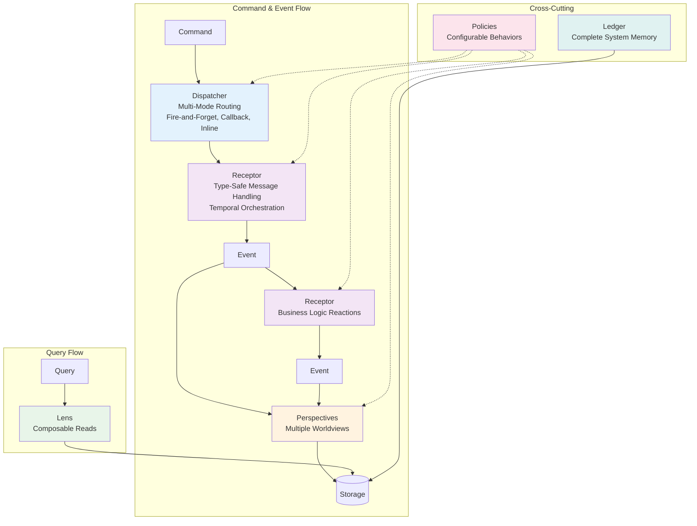
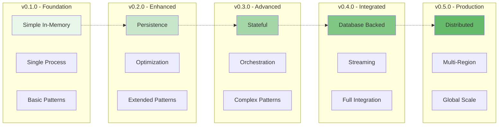

# Whizbang Patterns Overview

## Why New Patterns?

Traditional software patterns like Repository, Service Layer, and Command Handler have served us well. But modern distributed systems with event sourcing, CQRS, and time-travel debugging need new thinking. Whizbang introduces patterns that are:

- **Temporally Aware**: Built-in support for time-travel and replay
- **Architecturally Aware**: Adapt behavior based on context and environment
- **Source Generated**: Zero runtime reflection through compile-time optimization
- **Progressively Complex**: Start simple, evolve to distributed

## The Pattern Language



## Pattern Comparison Matrix

| Whizbang Pattern | Traditional Pattern | Key Difference |
|------------------|-------------------|----------------|
| **Receptor** | Command Handler + Message Bus | Type-safe message handling with temporal orchestration and multi-destination routing |
| **Dispatcher** | Command Bus + Event Bus | Unified interface with multiple execution modes (inline, fire-and-forget, callback, multi-receptor) |
| **Perspective** | Event Handler/Projection | Multiple worldviews, not just denormalized data |
| **Lens** | CQRS Query Side/Repository | The Query side of CQRS with automatic security context and tenant isolation |
| **Policy** | Decorator/AOP | Composable behaviors that attach and provide configurable cross-cutting concerns |
| **Ledger** | Event Store | Complete system memory with time-travel capabilities |

## Pattern Evolution

Each pattern follows a clear evolution path:



## How Patterns Work Together

### Example: Order Processing

```csharp{
title: "Complete Pattern Integration Example"
description: "How all Whizbang patterns work together in an order processing scenario"
framework: "NET8"
category: "Pattern Integration"
difficulty: "INTERMEDIATE"
tags: ["patterns", "integration", "order-processing", "complete-example"]
filename: "PatternIntegrationExample.cs"
usingStatements: ["System", "System.Threading.Tasks", "Whizbang"]
showLineNumbers: true
}
// 1. Command enters via Dispatcher (multiple invocation modes available)
var command = new CreateOrder { CustomerId = customerId, Items = items };
var result = await dispatcher.Send<OrderCreated>(command); // Inline async
// OR: await dispatcher.Fire(command); // Fire and forget
// OR: await dispatcher.SendWithCallback<OrderCreated>(command, HandleResult); // Callback

// 2. Type-safe Receptor with generic message/response types

public class OrderReceptor : IReceptor<CreateOrder, OrderCreated> {
    public async Task<OrderCreated> Receive(CreateOrder cmd) {
        // Business logic and validation
        if (!ValidateOrder(cmd)) {
            throw new ValidationException("Invalid items");
        }
        
        var order = new Order(cmd);
        
        // Architecture-dependent: Database operations allowed in non-Event Sourcing
        if (!_config.IsEventSourcing) {
            await _orderRepository.Save(order);
        }
        
        // External side effects (always allowed)
        await _emailService.SendOrderConfirmation(cmd.CustomerId);
        
        return new OrderCreated {
            OrderId = order.Id,
            CustomerId = cmd.CustomerId,
            Items = cmd.Items,
            Total = order.Total
        };
    }
}

// Multiple Receptors can handle the same command type

public class AuditReceptor : IReceptor<CreateOrder, AuditEvent> {
    public async Task<AuditEvent> Receive(CreateOrder cmd) {
        // Compliance logging runs in parallel
        await _auditLog.RecordOrderAttempt(cmd);
        return new AuditEvent("OrderCreationAttempt", cmd.OrderId);
    }
}

// 3. Events flow to Receptors that handle them (automatic routing)

public class InventoryReceptor : IReceptor<OrderCreated, InventoryReserved> {
    public async Task<InventoryReserved> Receive(OrderCreated evt) {
        // Business logic for inventory management
        await _inventory.ReserveItems(evt.Items);
        return new InventoryReserved(evt.OrderId, evt.Items);
    }
}

// 4. Events also flow to Perspectives (multiple worldviews)
public class OrderPerspective : IPerspective {
    // Order-focused worldview
    public async Task Update(OrderCreated evt) {
        var orderView = new OrderView {
            Id = evt.OrderId,
            CustomerId = evt.CustomerId,
            Total = evt.Total,
            Status = "Created",
            CreatedAt = evt.CreatedAt
        };
        
        await _readModelRepo.Upsert(orderView);
    }
}

// 5. Queries use Lenses (composable read operations)
public class OrderLens : ILens<Order> {
    public async Task<Order> Focus(Guid orderId, LensContext context) {
        return await context
            .Query<Order>()
            .Where(o => o.Id == orderId)
            .ExecuteAsync();
    }
    
    public async Task<Order[]> FocusMany(Guid[] orderIds, LensContext context) {
        return await context
            .Query<Order>()
            .Where(o => orderIds.Contains(o.Id))
            .ExecuteAsync();
    }
}

// 6. Policies apply configurable cross-cutting concerns
[WhizbangPolicy]
[ApplyTo<OrderReceptor>]
public class ConfigurableRetryPolicy : IPolicy {
    public async Task<T> Execute<T>(Func<Task<T>> next, IPolicyContext context) {
        // Policies understand their environment and configure behavior
        var retryCount = DetermineRetryCount(context);
        var delay = CalculateDelay(context);
        
        // Policies cooperate with others
        if (context.Has<CachePolicy>() && context.Get<bool>("cache.hit")) {
            return await next(); // Don't retry cached results
        }
        
        return await ExecuteWithRetry(next, retryCount, delay);
    }
}

// 7. Framework automatically captures everything in Ledger
// All Receptor inputs/outputs recorded for time-travel & replay
// Causality tracking handled by framework infrastructure
```

## Pattern Benefits

### For Developers
- **Clear Boundaries**: Each pattern has a single, well-defined responsibility
- **Testability**: Clear interfaces and configurable behavior make testing straightforward
- **Debugging**: Time-travel debugging built into the architecture
- **Evolution**: Start simple, grow to distributed without rewrites

### For Systems
- **Scalability**: Patterns designed for distribution from day one
- **Resilience**: Policies provide configurable retry, timeout, circuit breaking
- **Auditability**: Complete event history with replay capability
- **Performance**: Source generation eliminates reflection overhead

## Getting Started

1. **Start with Receptors**: Define your type-safe message handlers using `IReceptor<TMessage, TResponse>`
2. **Add Perspectives**: Create multiple worldviews for different consumers
3. **Implement Lenses**: Build the Query side of CQRS with secure read operations
4. **Apply Policies**: Add configurable cross-cutting concerns with runtime behavior
5. **Trust the Framework**: Automatic routing, causality tracking, and temporal orchestration
6. **Trust the Ledger**: Your complete system memory with time-travel capabilities

## Pattern Deep Dives

Ready to explore each pattern in detail?

- [Receptor Pattern](receptor-pattern.md) - Type-safe message handling with temporal orchestration
- [Dispatcher Pattern](dispatcher-pattern.md) - Command and event routing with multiple execution modes
- [Perspective Pattern](perspective-pattern.md) - Multiple worldviews
- [Lens Pattern](lens-pattern.md) - The Query side of CQRS with security context and tenant isolation
- [Policy Pattern](policy-pattern.md) - Configurable cross-cutting concerns with composable behavior
- [Ledger Pattern](ledger-pattern.md) - Complete system memory with time-travel capabilities

## Key Principles

All Whizbang patterns follow these principles:

1. **Architecture Awareness**: Patterns adapt their behavior based on architectural context
2. **Temporal Awareness**: Time and causality are first-class concerns
3. **Zero Reflection**: Everything is source-generated for performance
4. **Progressive Enhancement**: Simple patterns evolve to handle complexity
5. **Coordinated Integration**: Patterns work together through well-defined interfaces

## Next Steps

Start with the [Receptor Pattern](receptor-pattern.md) to understand how Whizbang provides type-safe message handling with automatic temporal orchestration, then explore how events flow through [Perspectives](perspective-pattern.md) to create multiple worldviews of your data.