# The Perspective Pattern

**"Pure projections that build read models - no side effects, completely replayable"**

```mermaid
graph TB
    subgraph Traditional["🚫 Traditional Read Models - Manual & Fragmented"]
        Events["Event Stream"]
        Manual["Manual Projections<br/>❌ Hand-written SQL"]
        Sync["Sync Maintenance<br/>❌ Constant updates"]
        SideEffects["Side Effects<br/>❌ Email/notifications"]
        
        Events --> Manual
        Manual --> Sync
        Manual --> SideEffects
        
        Problem1["❌ Breaks on event changes"]
        Problem2["❌ Can't replay safely"]
        Problem3["❌ Out of sync data"]
        Manual --> Problem1
        SideEffects --> Problem2
        Sync --> Problem3
    end

    subgraph Whizbang["✅ Whizbang Perspectives - Pure & Deterministic"]
        EventStream["Event Stream"]
        
        subgraph PerspectiveLayer["Perspective Layer"]
            OrderPerspective["OrderPerspective<br/>📊 Order summaries"]
            InventoryPerspective["InventoryPerspective<br/>📦 Stock levels"]
            AnalyticsPerspective["AnalyticsPerspective<br/>📈 Business metrics"]
        end
        
        subgraph Intelligence["Pure Intelligence"]
            DeterministicProjection["Deterministic Projection<br/>🔄 Consistent builds"]
            TimeTravel["Time Travel<br/>⏰ Replay at any point"]
            Materialized["Materialized Views<br/>💾 Optimized storage"]
        end
        
        EventStream --> PerspectiveLayer
        PerspectiveLayer --> Intelligence
        Intelligence --> ReadModels["Optimized Read Models"]
        
        Context["Perspective Context<br/>📊 Query analytics"]
        Intelligence -.-> Context
        Context -.-> Intelligence
    end

    class OrderPerspective,InventoryPerspective,AnalyticsPerspective layer-read
    class DeterministicProjection,TimeTravel,Materialized layer-observability
    class EventStream layer-event
    class Traditional fill:#f8d7da,stroke:#dc3545,stroke-width:2px
    class Whizbang fill:#d4edda,stroke:#28a745,stroke-width:2px
```



## The Problem

Traditional read models are static, manual, and fragmented. You end up with scattered queries, hand-written projections that break when events change, and read models that get out of sync with your event stream. Rebuilding projections is painful, time-travel debugging is impossible, and you can't replay events because your read models have side effects mixed in.

## The Whizbang Solution

Perspectives are pure read model builders that use **source generation** to provide type-safe, high-performance event routing. They project events into query-optimized structures using declarative `ProjectionResult` operations. Unlike traditional projections, Perspectives are deterministic, zero-reflection, and completely replayable because they have no side effects.

### Source Generation Benefits

- **Zero Reflection**: Framework generates compile-time routing code from `[ProjectionEvent]` attributes
- **Type Safety**: `IPerspective<TModel>` interface ensures compile-time validation
- **Performance**: Direct method dispatch without runtime type checking
- **IntelliSense**: Full autocomplete and type information for developers

## Implementation

### Core Concepts

#### Generic Interface Pattern

```csharp{
title: "Generic Interface Pattern"
description: "How IPerspective<TModel> provides type-safe read model projections"
framework: "NET8"
category: "Pattern Design"
difficulty: "BEGINNER"
tags: ["perspective", "interface", "generics", "type-safety"]
nugetPackages: ["Whizbang.Core"]
filename: "GenericInterfacePattern.cs"
testFile: "PerspectivePatternTests.cs"
testMethod: "Core_GenericInterface_ProvidesTypeSafety"
usingStatements: ["System", "System.Threading.Tasks", "Whizbang"]
}
// Generic interface provides compile-time type safety
public interface IPerspective<TModel> {
    // Source generation discovers Apply methods with [ProjectionEvent] parameters
    // No explicit method definitions required - attribute-based discovery
}

// Strongly-typed perspective implementation
public class OrderSummaryPerspective : IPerspective<OrderSummaryView> {
    // Framework automatically routes events to matching Apply methods
    public ProjectionResult Apply([ProjectionEvent] OrderCreated evt) {
        var summary = new OrderSummaryView {
            OrderId = evt.OrderId,
            CustomerId = evt.CustomerId,
            Total = evt.Total,
            Status = "Created",
            CreatedAt = evt.CreatedAt
        };
        
        return ProjectionResult.Upsert(summary);
    }
    
    public ProjectionResult Apply([ProjectionEvent] OrderCompleted evt) {
        return ProjectionResult.Update<OrderSummaryView>(
            where: o => o.OrderId == evt.OrderId,
            update: o => {
                o.Status = "Completed";
                o.CompletedAt = evt.CompletedAt;
            }
        );
    }
    
    // Priority needed when handling inheritance hierarchies
    [Priority(10)]
    public ProjectionResult Apply([ProjectionEvent] OrderCreated evt) {
        // High-priority special handling
        return ProjectionResult.Custom(() => LogOrderCreation(evt));
    }
    
    [Priority(1)] 
    public ProjectionResult Apply([ProjectionEvent] IOrderEvent evt) {
        // Low-priority catch-all for any order event
        return ProjectionResult.Update<OrderSummaryView>(
            where: o => o.OrderId == evt.OrderId,
            update: o => o.LastModified = evt.Timestamp
        );
    }
}
```

#### ProjectionResult Operations

```csharp{
title: "ProjectionResult Operations"
description: "Declarative read model operations using ProjectionResult"
framework: "NET8"
category: "Operations"
difficulty: "INTERMEDIATE"
tags: ["perspective", "projections", "operations", "declarative"]
nugetPackages: ["Whizbang.Core"]
filename: "ProjectionResultOperations.cs"
testFile: "PerspectivePatternTests.cs"
testMethod: "Core_ProjectionResult_SupportsAllOperations"
usingStatements: ["System", "System.Linq.Expressions", "Whizbang"]
}
// ProjectionResult provides declarative read model operations
public static class ProjectionResult {
    // Create or update a read model entity
    public static ProjectionResult Upsert<T>(T entity) { ... }
    
    // Update existing entities with LINQ expressions
    public static ProjectionResult Update<T>(
        Expression<Func<T, bool>> where,
        Action<T> update,
        Func<T> createIfNotExists = null
    ) { ... }
    
    // Custom operations for complex scenarios
    public static ProjectionResult Custom(Action operation) { ... }
    
    // Batch operations for performance
    public static ProjectionResult Batch(params ProjectionResult[] operations) { ... }
    
    // No-op for conditional projections
    public static ProjectionResult None { get; }
}

// Usage examples
public class ProductInventoryPerspective : IPerspective<ProductInventoryView> {
    public ProjectionResult Apply([ProjectionEvent] ProductCreated evt) {
        // Upsert: Create new read model entity
        var inventory = new ProductInventoryView {
            ProductId = evt.ProductId,
            Name = evt.Name,
            CurrentStock = evt.InitialStock,
            ReservedStock = 0,
            LastRestocked = evt.CreatedAt
        };
        
        return ProjectionResult.Upsert(inventory);
    }
    
    public ProjectionResult Apply([ProjectionEvent] StockReplenished evt) {
        // Update: Modify existing entity
        return ProjectionResult.Update<ProductInventoryView>(
            where: p => p.ProductId == evt.ProductId,
            update: p => {
                p.CurrentStock += evt.Quantity;
                p.LastRestocked = evt.ReplenishedAt;
            }
        );
    }
    
    public ProjectionResult Apply([ProjectionEvent] StockReserved evt) {
        // Update with create fallback
        return ProjectionResult.Update<ProductInventoryView>(
            where: p => p.ProductId == evt.ProductId,
            update: p => {
                p.CurrentStock -= evt.Quantity;
                p.ReservedStock += evt.Quantity;
            },
            createIfNotExists: () => new ProductInventoryView {
                ProductId = evt.ProductId,
                CurrentStock = -evt.Quantity, // Negative stock indicates issue
                ReservedStock = evt.Quantity
            }
        );
    }
    
    public ProjectionResult Apply([ProjectionEvent] ProductDiscontinued evt) {
        // Custom operation for complex logic
        return ProjectionResult.Custom(() => {
            // Mark as discontinued - complex operations handled by framework
            MarkProductAsDiscontinued(evt.ProductId, evt.AlternateProductId);
        });
    }
    
    public ProjectionResult Apply([ProjectionEvent] BulkStockUpdate evt) {
        // Batch operation for performance
        var operations = evt.Updates.Select(update => 
            ProjectionResult.Update<ProductInventoryView>(
                where: p => p.ProductId == update.ProductId,
                update: p => p.CurrentStock = update.NewStock
            )
        ).ToArray();
        
        return ProjectionResult.Batch(operations);
    }
    
    public ProjectionResult Apply([ProjectionEvent] InventoryCheckSkipped evt) {
        // Conditional no-op
        if (evt.Reason == "Maintenance") {
            return ProjectionResult.None; // Skip projection during maintenance
        }
        
        return ProjectionResult.Update<ProductInventoryView>(
            where: p => p.ProductId == evt.ProductId,
            update: p => p.LastChecked = evt.SkippedAt
        );
    }
}
```

#### Priority System for Event Inheritance

```csharp{
title: "Priority System for Event Inheritance"
description: "How Priority attributes resolve event inheritance ambiguity"
framework: "NET8"
category: "Event Handling"
difficulty: "ADVANCED"
tags: ["perspective", "priority", "inheritance", "event-routing"]
nugetPackages: ["Whizbang.Core"]
filename: "PrioritySystemExample.cs"
testFile: "PerspectivePatternTests.cs"
testMethod: "Core_PrioritySystem_ResolvesInheritance"
usingStatements: ["System", "System.Threading.Tasks", "Whizbang"]
}
// Event inheritance hierarchy
public interface INotificationEvent {
    DateTime Timestamp { get; }
    Guid UserId { get; }
}

public interface IOrderEvent : INotificationEvent {
    Guid OrderId { get; }
}

public record OrderCreated(Guid OrderId, Guid UserId, DateTime Timestamp) : IOrderEvent;
public record OrderShipped(Guid OrderId, Guid UserId, DateTime Timestamp) : IOrderEvent;

// Perspective handling inheritance with priorities
public class NotificationLogPerspective : IPerspective<NotificationLogView> {
    // Specific event handlers (highest priority - no attribute needed)
    public ProjectionResult Apply([ProjectionEvent] OrderCreated evt) {
        var logEntry = new NotificationLogView {
            EventId = Guid.NewGuid(),
            EventType = "OrderCreated",
            UserId = evt.UserId,
            OrderId = evt.OrderId,
            Message = "Your order has been created",
            Timestamp = evt.Timestamp,
            Priority = "High"
        };
        
        return ProjectionResult.Upsert(logEntry);
    }
    
    public ProjectionResult Apply([ProjectionEvent] OrderShipped evt) {
        var logEntry = new NotificationLogView {
            EventId = Guid.NewGuid(),
            EventType = "OrderShipped",
            UserId = evt.UserId,
            OrderId = evt.OrderId,
            Message = "Your order has been shipped",
            Timestamp = evt.Timestamp,
            Priority = "Medium"
        };
        
        return ProjectionResult.Upsert(logEntry);
    }
    
    // Medium priority - handles any order event for order tracking
    [Priority(5)]
    public ProjectionResult Apply([ProjectionEvent] IOrderEvent evt) {
        return ProjectionResult.Update<NotificationLogView>(
            where: n => n.UserId == evt.UserId && n.OrderId == evt.OrderId,
            update: n => n.LastOrderActivity = evt.Timestamp
        );
    }
    
    // Lowest priority - catch-all for any notification event
    [Priority(1)]
    public ProjectionResult Apply([ProjectionEvent] INotificationEvent evt) {
        return ProjectionResult.Update<NotificationLogView>(
            where: n => n.UserId == evt.UserId,
            update: n => n.LastActivity = evt.Timestamp
        );
    }
}

// Source generation execution order for OrderCreated:
// 1. Apply(OrderCreated evt) - Specific (highest priority)
// 2. [Priority(5)] Apply(IOrderEvent evt) - Medium priority  
// 3. [Priority(1)] Apply(INotificationEvent evt) - Lowest priority
```

#### Read Model Building

```csharp{
title: "Read Model Building Pattern"
description: "Demonstrates how Perspectives build optimized read models from events"
framework: "NET8"
category: "Read Models"
difficulty: "BEGINNER"
tags: ["perspective", "read-models", "projections", "materialized-views"]
nugetPackages: ["Whizbang.Core"]
filename: "ReadModelBuilding.cs"
testFile: "PerspectivePatternTests.cs"
testMethod: "Implementation_ReadModelBuilding_CreatesOptimizedViews"
usingStatements: ["System", "System.Linq", "System.Threading.Tasks", "Whizbang"]
}
// Pure read model building
public class UserSummaryPerspective : IPerspective<UserSummaryView> {
    // Build user summary view
    public ProjectionResult Apply([ProjectionEvent] UserRegistered evt) {
        var userSummary = new UserSummaryView {
            UserId = evt.UserId,
            Email = evt.Email,
            DisplayName = evt.Email.Split('@')[0], // Extract username
            RegistrationDate = evt.RegisteredAt.Date,
            IsActive = true,
            OrderCount = 0,
            TotalSpent = 0m,
            LastActivity = evt.RegisteredAt
        };
        
        return ProjectionResult.Upsert(userSummary);
    }
    
    // Update summary when user places order
    public ProjectionResult Apply([ProjectionEvent] OrderCreated evt) {
        return ProjectionResult.Update<UserSummaryView>(
            where: u => u.UserId == evt.CustomerId,
            update: u => {
                u.OrderCount++;
                u.TotalSpent += evt.Total;
                u.LastActivity = evt.CreatedAt;
            }
        );
    }
}
```

### Query Optimization

```csharp{
title: "Query Optimization Pattern"
description: "Shows how Perspectives build different optimized views for different query patterns"
framework: "NET8"
category: "Read Models"
difficulty: "INTERMEDIATE"
tags: ["perspective", "optimization", "queries", "materialized-views"]
nugetPackages: ["Whizbang.Core", "Whizbang.Perspectives"]
filename: "QueryOptimization.cs"
testFile: "PerspectivePatternTests.cs"
testMethod: "Implementation_QueryOptimization_BuildsSpecializedViews"
usingStatements: ["System", "System.Linq", "System.Threading.Tasks", "Whizbang"]
}
// Order list view - optimized for listing/searching
public class OrderListPerspective : IPerspective<OrderListItemView> {
    public ProjectionResult Apply([ProjectionEvent] OrderCreated evt) {
        var orderListItem = new OrderListItemView {
            OrderId = evt.OrderId,
            CustomerId = evt.CustomerId,
            Total = evt.Total,
            ItemCount = evt.Items.Count,
            Status = "Created",
            CreatedAt = evt.CreatedAt
        };
        
        return ProjectionResult.Upsert(orderListItem);
    }
}

// Order details view - optimized for single order display
public class OrderDetailsPerspective : IPerspective<OrderDetailsView> {
    public ProjectionResult Apply([ProjectionEvent] OrderCreated evt) {
        var orderDetails = new OrderDetailsView {
            OrderId = evt.OrderId,
            CustomerId = evt.CustomerId,
            Items = evt.Items.Select(i => new OrderItemView {
                ProductId = i.ProductId,
                Quantity = i.Quantity,
                UnitPrice = i.UnitPrice
            }).ToList(),
            Total = evt.Total,
            CreatedAt = evt.CreatedAt,
            Timeline = new List<OrderTimelineEvent> {
                new() { Event = "Order Created", Timestamp = evt.CreatedAt }
            }
        };
        
        return ProjectionResult.Upsert(orderDetails);
    }
    
    public ProjectionResult Apply([ProjectionEvent] OrderShipped evt) {
        return ProjectionResult.Update<OrderDetailsView>(
            where: o => o.OrderId == evt.OrderId,
            update: o => o.Timeline.Add(new OrderTimelineEvent {
                Event = "Order Shipped",
                Timestamp = evt.ShippedAt,
                Details = $"Tracking: {evt.TrackingNumber}"
            })
        );
    }
}
```

## Code Examples

### Simple Perspective Implementation

```csharp{
title: "Simple Perspective Implementation"
description: "Basic customer summary perspective demonstrating pure read model building"
framework: "NET8"
category: "Read Models"
difficulty: "BEGINNER"
tags: ["perspective", "read-models", "simple-example", "projections"]
nugetPackages: ["Whizbang.Core"]
filename: "SimpleCustomerSummaryPerspective.cs"
testFile: "PerspectivePatternTests.cs"
testMethod: "Examples_SimplePerspective_BuildsReadModels"
usingStatements: ["System", "System.Threading.Tasks", "Whizbang"]
}
public class CustomerSummaryPerspective : IPerspective<CustomerSummaryView> {
    public ProjectionResult Apply([ProjectionEvent] UserRegistered evt) {
        // ✅ Pure projection - declarative read model building
        var customerSummary = new CustomerSummaryView {
            CustomerId = evt.UserId,
            Email = evt.Email,
            DisplayName = evt.Email.Split('@')[0],
            RegistrationDate = evt.RegisteredAt,
            TotalOrders = 0,
            TotalSpent = 0m,
            LastActivity = evt.RegisteredAt,
            Status = "Active"
        };
        
        return ProjectionResult.Upsert(customerSummary);
        
        // ❌ NO side effects - emails would be handled by Receptors
    }
    
    public ProjectionResult Apply([ProjectionEvent] OrderCreated evt) {
        // ✅ Declarative update - no manual lens operations
        return ProjectionResult.Update<CustomerSummaryView>(
            where: c => c.CustomerId == evt.CustomerId,
            update: c => {
                c.TotalOrders++;
                c.TotalSpent += evt.Total;
                c.LastActivity = evt.CreatedAt;
            }
        );
    }
    
    public ProjectionResult Apply([ProjectionEvent] PaymentFailed evt) {
        // ✅ Declarative update with conditional logic
        return ProjectionResult.Update<CustomerSummaryView>(
            where: c => c.CustomerId == evt.CustomerId,
            update: c => {
                c.FailedPayments++;
                c.LastActivity = evt.FailedAt;
                if (c.FailedPayments >= 3) {
                    c.Status = "Payment Issues";
                }
            }
        );
    }
}
```

### Complex Read Model Building

```csharp{
title: "Complex Read Model Building"
description: "Advanced order processing perspectives demonstrating multiple coordinated read model projections"
framework: "NET8"
category: "Read Models"
difficulty: "INTERMEDIATE"
tags: ["perspective", "projections", "read-models", "order-processing"]
nugetPackages: ["Whizbang.Core", "Whizbang.Perspectives"]
filename: "OrderReadModelPerspectives.cs"
testFile: "PerspectivePatternTests.cs"
testMethod: "Examples_ComplexReadModels_BuildsMultipleViews"
usingStatements: ["System", "System.Threading.Tasks", "Whizbang"]
}
// Order timeline perspective - builds complete order history view
public class OrderTimelinePerspective : IPerspective<OrderTimelineView> {
    public ProjectionResult Apply([ProjectionEvent] OrderCreated evt) {
        // ✅ Pure projection - build order timeline read model
        var timeline = new OrderTimelineView {
            OrderId = evt.OrderId,
            CustomerId = evt.CustomerId,
            Events = new List<TimelineEvent> {
                new TimelineEvent {
                    Type = "OrderCreated",
                    Timestamp = evt.CreatedAt,
                    Description = $"Order created with {evt.Items.Length} items",
                    Data = new { Total = evt.Total, ItemCount = evt.Items.Length }
                }
            },
            Status = "Created",
            LastUpdated = evt.CreatedAt
        };
        
        return ProjectionResult.Upsert(timeline);
    }
    
    public ProjectionResult Apply([ProjectionEvent] PaymentProcessed evt) {
        // ✅ Declarative timeline update
        return ProjectionResult.Update<OrderTimelineView>(
            where: t => t.OrderId == evt.OrderId,
            update: t => {
                t.Events.Add(new TimelineEvent {
                    Type = "PaymentProcessed",
                    Timestamp = evt.ProcessedAt,
                    Description = "Payment successfully processed",
                    Data = new { PaymentId = evt.PaymentId, Amount = evt.Amount }
                });
                t.Status = "Paid";
                t.LastUpdated = evt.ProcessedAt;
            }
        );
    }
    
    public ProjectionResult Apply([ProjectionEvent] OrderShipped evt) {
        // ✅ Declarative timeline update
        return ProjectionResult.Update<OrderTimelineView>(
            where: t => t.OrderId == evt.OrderId,
            update: t => {
                t.Events.Add(new TimelineEvent {
                    Type = "OrderShipped",
                    Timestamp = evt.ShippedAt,
                    Description = $"Order shipped with tracking {evt.TrackingNumber}",
                    Data = new { TrackingNumber = evt.TrackingNumber }
                });
                t.Status = "Shipped";
                t.LastUpdated = evt.ShippedAt;
            }
        );
    }
}

// Payment tracking perspective - builds payment history view
public class PaymentTrackingPerspective : IPerspective<PaymentTrackingView> {
    public ProjectionResult Apply([ProjectionEvent] PaymentProcessed evt) {
        // ✅ Pure projection - build payment tracking read model
        var paymentRecord = new PaymentTrackingView {
            PaymentId = evt.PaymentId,
            OrderId = evt.OrderId,
            CustomerId = evt.CustomerId,
            Amount = evt.Amount,
            Status = "Processed",
            ProcessedAt = evt.ProcessedAt,
            Method = evt.PaymentMethod
        };
        
        return ProjectionResult.Upsert(paymentRecord);
    }
    
    public ProjectionResult Apply([ProjectionEvent] PaymentFailed evt) {
        // ✅ Track payment failures in read model
        var paymentRecord = new PaymentTrackingView {
            PaymentId = evt.PaymentId,
            OrderId = evt.OrderId,
            CustomerId = evt.CustomerId,
            Amount = evt.Amount,
            Status = "Failed",
            FailedAt = evt.FailedAt,
            FailureReason = evt.Reason
        };
        
        return ProjectionResult.Upsert(paymentRecord);
    }
}

// Shipping status perspective - builds shipping tracking view
public class ShippingStatusPerspective : IPerspective<ShippingStatusView> {
    public ProjectionResult Apply([ProjectionEvent] OrderShipped evt) {
        // ✅ Pure projection - build shipping status read model
        var shippingStatus = new ShippingStatusView {
            OrderId = evt.OrderId,
            TrackingNumber = evt.TrackingNumber,
            ShippedAt = evt.ShippedAt,
            EstimatedDelivery = evt.EstimatedDelivery,
            Status = "Shipped",
            Carrier = evt.Carrier
        };
        
        return ProjectionResult.Upsert(shippingStatus);
    }
    
    public ProjectionResult Apply([ProjectionEvent] OrderDelivered evt) {
        // ✅ Declarative shipping status update
        return ProjectionResult.Update<ShippingStatusView>(
            where: s => s.OrderId == evt.OrderId,
            update: s => {
                s.Status = "Delivered";
                s.DeliveredAt = evt.DeliveredAt;
                s.ReceivedBy = evt.ReceivedBy;
            }
        );
    }
}
```

## When to Use This Pattern

Use Perspectives when:
- You need to build read models from events
- You want query-optimized materialized views
- Time-travel debugging and replay are important
- You need automatic caching and view maintenance
- You're implementing Event Sourcing or CQRS read side

Don't use Perspectives when:
- You need side effects (use Receptors instead)
- Simple data queries with no optimization needed (use Lenses instead)
- Command handling or business logic (use Receptors instead)
- Static configuration or routing (use Receptor features instead)

## Common Misconceptions

### "Perspectives are just event handlers"
**No**: Perspectives are pure projections that build read models, not general event handlers with side effects.

### "All read model updates should go through perspectives"
**No**: Use Perspectives for event-sourced read models; use Lenses for direct data queries.

### "Perspectives can have side effects"
**No**: Perspectives are pure projections only. Side effects belong in Receptors.

### "Perspectives are eventually consistent"
**Maybe**: Perspectives build read models that may be eventually consistent, but the projections themselves must be deterministic and replayable.

## Implementation Checklist

- [ ] **Identify read models** - What views do you need to build?
- [ ] **Design projections** - How do events map to read model updates?
- [ ] **Ensure purity** - No side effects, only read model building
- [ ] **Plan replayability** - Can projections be run multiple times safely?
- [ ] **Apply failures** - What happens when projections fail?
- [ ] **Add monitoring** - How will projection health be tracked?
- [ ] **Test scenarios** - Verify all projection paths work correctly
- [ ] **Plan scaling** - How will read models scale with load?

## Example: E-Commerce Order Processing

```csharp{
title: "E-Commerce Order Processing Perspectives"
description: "Multiple coordinated perspectives building different worldviews from order events"
framework: "NET8"
category: "Complete Examples"
difficulty: "ADVANCED"
tags: ["perspective", "e-commerce", "order", "worldviews", "complete-example"]
filename: "OrderPerspectiveSystem.cs"
usingStatements: ["System", "System.Collections.Generic", "System.Linq", "System.Threading.Tasks", "Whizbang"]
showLineNumbers: true
}
// Order creation triggers multiple pure read model perspectives
public record OrderCreated(Guid OrderId, Guid CustomerId, OrderItem[] Items, decimal Total, DateTime CreatedAt);

// Order List Perspective - builds order list view
public class OrderListPerspective : IPerspective<OrderListView> {
    public ProjectionResult Apply([ProjectionEvent] OrderCreated evt) {
        // ✅ Pure projection - declarative read model building
        var orderView = new OrderListView {
            OrderId = evt.OrderId,
            CustomerId = evt.CustomerId,
            ItemCount = evt.Items.Length,
            Total = evt.Total,
            Status = "Created",
            CreatedAt = evt.CreatedAt
        };
        
        return ProjectionResult.Upsert(orderView);
        
        // ❌ NO side effects - inventory would be handled by Receptors
    }
}

// Customer Summary Perspective - builds customer analytics view
public class CustomerSummaryPerspective : IPerspective<CustomerSummary> {
    public ProjectionResult Apply([ProjectionEvent] OrderCreated evt) {
        // ✅ Pure projection - declarative customer summary update
        return ProjectionResult.Update<CustomerSummary>(
            where: c => c.CustomerId == evt.CustomerId,
            update: c => {
                c.TotalOrders++;
                c.TotalSpent += evt.Total;
                c.LastOrderDate = evt.CreatedAt;
            },
            createIfNotExists: () => new CustomerSummary {
                CustomerId = evt.CustomerId,
                TotalOrders = 1,
                TotalSpent = evt.Total,
                LastOrderDate = evt.CreatedAt
            }
        );
    }
}

// Product Analytics Perspective - builds product sales analytics
public class ProductAnalyticsPerspective : IPerspective<ProductStats> {
    public ProjectionResult Apply([ProjectionEvent] OrderCreated evt) {
        // ✅ Pure projection - declarative product analytics updates
        var operations = evt.Items.Select(item => 
            ProjectionResult.Update<ProductStats>(
                where: p => p.ProductId == item.ProductId,
                update: p => {
                    p.TotalSold += item.Quantity;
                    p.Revenue += item.Price * item.Quantity;
                    p.LastSaleDate = evt.CreatedAt;
                },
                createIfNotExists: () => new ProductStats {
                    ProductId = item.ProductId,
                    TotalSold = item.Quantity,
                    Revenue = item.Price * item.Quantity,
                    LastSaleDate = evt.CreatedAt
                }
            )
        ).ToArray();
        
        return ProjectionResult.Batch(operations);
        
        // ❌ NO side effects - inventory updates would be handled by Receptors
    }
}

// Search Index Perspective - builds search-optimized read model
public class OrderSearchPerspective : IPerspective<OrderSearchDocument> {
    public ProjectionResult Apply([ProjectionEvent] OrderCreated evt) {
        // ✅ Pure projection - declarative search index building
        var searchDocument = new OrderSearchDocument {
            OrderId = evt.OrderId,
            CustomerId = evt.CustomerId,
            Total = evt.Total,
            ItemNames = evt.Items.Select(i => i.ProductName).ToArray(),
            SearchableText = $"Order {evt.OrderId} {string.Join(" ", evt.Items.Select(i => i.ProductName))}",
            CreatedAt = evt.CreatedAt,
            Status = "Created"
        };
        
        return ProjectionResult.Upsert(searchDocument);
        
        // ❌ NO side effects - notifications would be handled by Receptors
    }
}

// Replay capability for read model rebuilding
public class PerspectiveReplayService {
    public async Task RebuildReadModel<TPerspective>(DateTime fromDate) 
        where TPerspective : IPerspective<TModel>, new() {
        // ✅ Pure projections can be safely replayed via framework
        var events = await GetEventsFrom(fromDate);
        
        foreach (var evt in events) {
            var result = await ApplyEventToPerspective<TPerspective>(evt);
            await ExecuteProjectionResult(result);
        }
    }
    
    // Replay specific read model from beginning
    public async Task RebuildFromScratch<TPerspective>() 
        where TPerspective : IPerspective<TModel>, new() {
        // Framework handles clearing and rebuilding
        await ClearPerspectiveReadModels<TPerspective>();
        
        // Replay all events - safe because perspectives return ProjectionResults
        var allEvents = await GetAllEvents();
        
        foreach (var evt in allEvents) {
            var result = await ApplyEventToPerspective<TPerspective>(evt);
            await ExecuteProjectionResult(result);
        }
    }
    
    // Test replay capability - run twice, should get same result
    public async Task VerifyReplayability() {
        var events = await GetTestEvents();
        
        // First run
        var results1 = new List<ProjectionResult>();
        var perspective1 = new OrderListPerspective();
        foreach (var evt in events) {
            results1.Add(perspective1.Apply(evt));
        }
        
        // Second run - should produce identical ProjectionResults
        var results2 = new List<ProjectionResult>();
        var perspective2 = new OrderListPerspective();
        foreach (var evt in events) {
            results2.Add(perspective2.Apply(evt));
        }
        
        // ✅ Pure projections produce identical ProjectionResults
        Assert.Equal(results1.Count, results2.Count);
        Assert.True(ProjectionResultsAreEqual(results1, results2));
    }
}

// Testing perspective projections
[Test]
public async Task Perspectives_Should_Build_Read_Models_Without_Side_Effects() {
    // Arrange
    var orderCreated = new OrderCreated(
        OrderId: Guid.NewGuid(),
        CustomerId: Guid.NewGuid(),
        Items: new[] { new OrderItem("Product1", 2, 10.00m) },
        Total: 20.00m,
        CreatedAt: DateTime.UtcNow
    );
    
    // Act - Process event through perspectives
    var orderResult = _orderListPerspective.Apply(orderCreated);
    var customerResult = _customerSummaryPerspective.Apply(orderCreated);
    var productResult = _productAnalyticsPerspective.Apply(orderCreated);
    var searchResult = _orderSearchPerspective.Apply(orderCreated);
    
    // Assert - All ProjectionResults were returned correctly
    var orderResult = _orderListPerspective.Apply(orderCreated);
    Assert.IsType<UpsertProjectionResult>(orderResult);
    
    var customerResult = _customerSummaryPerspective.Apply(orderCreated);
    Assert.IsType<UpdateProjectionResult>(customerResult);
    
    var productResult = _productAnalyticsPerspective.Apply(orderCreated);
    Assert.IsType<BatchProjectionResult>(productResult);
    
    var searchResult = _orderSearchPerspective.Apply(orderCreated);
    Assert.IsType<UpsertProjectionResult>(searchResult);
    
    // ✅ NO side effects were performed - only read models built
}
```

## Benefits

- **Zero Reflection**: Source generation eliminates runtime overhead and provides optimal performance
- **Type Safety**: Compile-time validation prevents runtime errors and provides full IntelliSense
- **Purity**: No side effects means projections are deterministic and replayable
- **Declarative Operations**: `ProjectionResult` provides clean, testable read model operations
- **Priority Resolution**: Automatic handling of event inheritance scenarios through `[Priority]` attributes
- **Testability**: Pure read model building with declarative operations makes testing straightforward
- **Scalability**: Read models can be rebuilt and optimized independently
- **Time-Travel**: Pure projections enable time-travel debugging and replay
- **Query Optimization**: Build multiple optimized views for different query patterns

## Evolution

### Perspective Pattern Roadmap

The Perspective pattern evolves across Whizbang versions, growing from simple read model builders to sophisticated projection systems with advanced capabilities. Here's how Perspectives develop:

### Version Timeline

```mermaid
flowchart LR
    A[v0.1.0 Foundation<br/>━━━━━━━━━━━<br/>• Basic Projections<br/>• Manual Updates<br/>• Simple Read Models<br/>• Single Table Views] 
    
    B[v0.2.0 Optimized<br/>━━━━━━━━━━━<br/>• Auto Subscriptions<br/>• Bulk Updates<br/>• Indexed Views<br/>• Query Optimization]
    
    C[v0.3.0 Meta<br/>━━━━━━━━━━━<br/>• Metadata-Driven Pivots<br/>• Dynamic Aggregations<br/>• Queryable Projections<br/>• Schema Evolution]
    
    D[v0.4.0 Production<br/>━━━━━━━━━━━<br/>• Cross-Service Views<br/>• Global Read Models<br/>• Federated Queries<br/>• Production Ready]
    
    A --> B --> C --> D
    
    classDef foundation fill:#ffc107,stroke:#333,stroke-width:2px,color:#000
    classDef optimized fill:#e91e63,stroke:#333,stroke-width:2px,color:#fff
    classDef meta fill:#2196f3,stroke:#333,stroke-width:2px,color:#fff
    classDef production fill:#4caf50,stroke:#333,stroke-width:2px,color:#fff
    
    class A foundation
    class B optimized
    class C meta
    class D production
```



### Capability Growth by Version

#### v0.1.0 - Foundation Release
**Basic read model building with manual registration**

```csharp{
title: "v0.1.0 Foundation - Basic Perspective"
description: "Basic user perspective that builds simple read models from events"
framework: "NET8"
category: "Read Models"
difficulty: "BEGINNER"
tags: ["perspective", "read-models", "foundation", "v0.1.0"]
nugetPackages: ["Whizbang.Core"]
filename: "BasicUserPerspective.cs"
testFile: "PerspectivePatternTests.cs"
testMethod: "Foundation_BasicPerspective_BuildsReadModel"
usingStatements: ["System", "System.Threading.Tasks", "Whizbang"]
}
// Simple perspective implementation
public class UserListPerspective : IPerspective<UserView> {
    public ProjectionResult Apply([ProjectionEvent] UserRegistered evt) {
        // Build read model - pure projection
        var userView = new UserView {
            Id = evt.UserId,
            Email = evt.Email,
            DisplayName = evt.Email,
            RegisteredAt = evt.RegisteredAt,
            IsActive = true
        };
        
        return ProjectionResult.Upsert(userView);
    }
    
    public ProjectionResult Apply([ProjectionEvent] UserDeactivated evt) {
        // Declarative update - no manual store operations
        return ProjectionResult.Update<UserView>(
            where: u => u.Id == evt.UserId,
            update: u => {
                u.IsActive = false;
                u.DeactivatedAt = evt.DeactivatedAt;
            }
        );
    }
}
```

**Features:**
- Basic read model building
- Manual event subscriptions
- Simple view projections
- Single table materialized views

#### v0.2.0 - Reactive Processing
**Event subscriptions and automatic registration**

```csharp{
title: "v0.2.0 Reactive - Auto-Subscribing Perspective"
description: "Reactive perspective with automatic event subscriptions and bulk operations"
framework: "NET8"
category: "Event Handling"
difficulty: "INTERMEDIATE"
tags: ["perspective", "reactive", "subscriptions", "v0.2.0"]
nugetPackages: ["Whizbang.Core", "Whizbang.Perspectives"]
filename: "ReactiveOrderPerspective.cs"
testFile: "PerspectivePatternTests.cs"
testMethod: "Reactive_AutoSubscribing_ProcessesEvents"
usingStatements: ["System", "System.Threading.Tasks", "Whizbang", "Whizbang.Perspectives"]
}
// Reactive perspective with declarative updates
public class OrderPerspective : IPerspective<OrderView> {
    public ProjectionResult Apply([ProjectionEvent] OrderCreated evt) {
        // Pure projection - declarative read model building
        var orderView = new OrderView {
            Id = evt.OrderId,
            CustomerId = evt.CustomerId,
            Total = evt.Total,
            ItemCount = evt.Items.Count,
            Status = "Created",
            CreatedAt = evt.CreatedAt
        };
        
        return ProjectionResult.Upsert(orderView);
    }
    
    public ProjectionResult Apply([ProjectionEvent] OrderShipped evt) {
        // ✅ Pure projection - declarative update
        return ProjectionResult.Update<OrderView>(
            where: o => o.Id == evt.OrderId,
            update: o => {
                o.Status = "Shipped";
                o.ShippedAt = evt.ShippedAt;
            }
        );
    }
    
    // Priority needed when handling base class/interface events
    [Priority(1)]
    public ProjectionResult Apply([ProjectionEvent] IOrderEvent evt) {
        return ProjectionResult.Update<OrderView>(
            where: o => o.Id == evt.OrderId,
            update: o => o.LastModified = evt.Timestamp
        );
    }
}
```

**Features:**
- Automatic event subscriptions
- Source-generated registration
- Bulk operation support
- Basic coordination between perspectives

#### v0.3.0 - Meta Perspectives
**Metadata-driven pivoted data and dynamic aggregations**

```csharp{
title: "v0.3.0 Meta - Metadata-Driven Perspectives"
description: "Meta perspective that builds queryable pivoted data using metadata definitions"
framework: "NET8"
category: "Meta Programming"
difficulty: "ADVANCED"
tags: ["perspective", "meta", "pivot", "metadata", "aggregation", "v0.3.0"]
nugetPackages: ["Whizbang.Core", "Whizbang.Perspectives", "Whizbang.Meta"]
filename: "MetaSalesPerspective.cs"
testFile: "PerspectivePatternTests.cs"
testMethod: "Meta_PivotedData_BuildsQueryableViews"
usingStatements: ["System", "System.Threading.Tasks", "Whizbang", "Whizbang.Meta"]
}
// Meta perspective that builds pivoted data from metadata
[MetaPerspective]
public class SalesAnalyticsPerspective : IPerspective {
    [PivotDefinition]
    public static readonly PivotMetadata SalesByRegionAndMonth = new() {
        Name = "SalesByRegionAndMonth",
        RowDimensions = ["Region", "Country"],
        ColumnDimensions = ["Year", "Month"],
        Measures = [
            new Measure("TotalSales", MeasureType.Sum, "Amount"),
            new Measure("OrderCount", MeasureType.Count, "OrderId"),
            new Measure("AvgOrderValue", MeasureType.Average, "Amount")
        ],
        Filters = ["Status = 'Completed'"]
    };
    
    [PivotDefinition]
    public static readonly PivotMetadata ProductPerformance = new() {
        Name = "ProductPerformance",
        RowDimensions = ["Category", "ProductName"],
        ColumnDimensions = ["Quarter"],
        Measures = [
            new Measure("Revenue", MeasureType.Sum, "Amount"),
            new Measure("Units", MeasureType.Sum, "Quantity"),
            new Measure("Margin", MeasureType.Average, "ProfitMargin")
        ]
    };
    
    public async Task Update(OrderCompleted evt) {
        // ✅ Pure projection - build pivoted read models from metadata
        var pivotData = new PivotDataBuilder()
            .FromEvent(evt)
            .WithDimensions(
                Region: await GetRegion(evt.CustomerId),
                Country: await GetCountry(evt.CustomerId),
                Year: evt.CompletedAt.Year,
                Month: evt.CompletedAt.Month,
                Category: evt.Items.First().Category,
                ProductName: evt.Items.First().ProductName,
                Quarter: $"Q{(evt.CompletedAt.Month - 1) / 3 + 1}"
            )
            .WithMeasures(
                Amount: evt.Total,
                OrderId: evt.OrderId,
                Quantity: evt.Items.Sum(i => i.Quantity),
                ProfitMargin: CalculateMargin(evt.Items)
            );
        
        // Build all registered pivots automatically
        await _metaPerspectiveEngine.UpdateAllPivots(pivotData);
    }
}

// Querying meta perspectives - treated as normal perspectives
public class SalesReportLens : ILens<PivotResult> {
    public async Task<PivotResult> Focus(PivotQuery query, LensContext context) {
        // Query pivoted data like any other read model
        return await context
            .QueryPivot("SalesByRegionAndMonth")
            .Where(query.Filters)
            .GroupBy(query.Dimensions)
            .Aggregate(query.Measures)
            .ExecuteAsync();
    }
}
```

**Features:**
- Metadata-driven pivot definitions
- Dynamic aggregation generation
- Queryable pivoted data structures
- Schema evolution support
- Automatic pivot maintenance

#### v0.4.0 - Distributed Coordination
**Cross-service synchronization and saga coordination**

```csharp{
title: "v0.4.0 Distributed - Saga Coordination"
description: "Distributed perspective that coordinates sagas across services with global consistency"
framework: "NET8"
category: "Distributed Systems"
difficulty: "ADVANCED"
tags: ["perspective", "distributed", "saga", "coordination", "v0.4.0"]
nugetPackages: ["Whizbang.Core", "Whizbang.Perspectives", "Whizbang.Distributed"]
filename: "DistributedPaymentPerspective.cs"
testFile: "PerspectivePatternTests.cs"
testMethod: "Distributed_SagaCoordination_MaintainsConsistency"
usingStatements: ["System", "System.Threading.Tasks", "Whizbang", "Whizbang.Distributed"]
}
// Distributed perspective with saga coordination
[DistributedPerspective(Services = new[] { "PaymentService", "OrderService", "InventoryService" })]
public class PaymentPerspective : IPerspective {
    private readonly ISagaCoordinator _sagaCoordinator;
    
    [SubscribesTo, SagaStep(1)]
    public async Task Update(OrderCreated evt) {
        // Start distributed saga
        var saga = await _sagaCoordinator.StartSaga<OrderProcessingSaga>(evt);
        
        // Reserve payment method
        var reservation = await ReservePaymentMethod(evt.CustomerId, evt.Total);
        
        if (reservation.Success) {
            await saga.Complete(new PaymentReserved { 
                OrderId = evt.OrderId,
                ReservationId = reservation.Id 
            });
        } else {
            await saga.Compensate(new PaymentReservationFailed { 
                OrderId = evt.OrderId,
                Reason = reservation.FailureReason 
            });
        }
    }
    
    [CompensationApplyr]
    public async Task Compensate(PaymentReservationFailed evt) {
        // Automatic compensation
        await ReleasePaymentReservation(evt.OrderId);
        await NotifyCustomer(evt.OrderId, "Payment failed: " + evt.Reason);
    }
}
```

**Features:**
- Distributed saga coordination
- Cross-service event streaming
- Global consistency management
- Automatic compensation handling

### Evolution Benefits

Each version builds essential projection capabilities:

- **v0.1.0**: Establishes basic read model projections
- **v0.2.0**: Optimizes projection performance and indexing
- **v0.3.0**: Enables metadata-driven pivot generation and view optimization
- **v0.4.0**: Scales to distributed systems and achieves production readiness

### Migration Path

Your perspective code remains compatible across versions:

```csharp{
title: "Migration Path - Version Compatibility"
description: "How perspective projections remain compatible across versions with opt-in features"
framework: "NET8"
category: "Migration"
difficulty: "INTERMEDIATE"
tags: ["perspective", "migration", "compatibility", "versioning"]
nugetPackages: ["Whizbang.Core"]
filename: "CompatibilityPerspectives.cs"
testFile: "PerspectivePatternTests.cs"
testMethod: "Migration_VersionCompatibility_MaintainsBackwardCompatibility"
usingStatements: ["System", "System.Threading.Tasks", "Whizbang"]
}
// This v0.1.0 perspective works in all versions
public class SimpleUserPerspective : IPerspective<UserView> {
    public ProjectionResult Apply([ProjectionEvent] UserCreated evt) {
        // ✅ Pure projection logic works everywhere
        var userView = new UserView {
            Id = evt.UserId,
            Email = evt.Email,
            DisplayName = evt.DisplayName,
            CreatedAt = evt.Timestamp
        };
        return ProjectionResult.Upsert(userView);
    }
}

// Opt into advanced features when ready
[DistributedPerspective] // v0.4.0 feature
public class AdvancedPerspective : IMetaPerspective<PivotView> { // v0.3.0 feature
    // Your advanced logic here with metadata-driven pivots
}
```

### Capability Matrix


```csharp{
title: "Core Perspective Pattern - Pure Read Model Building"
description: "Core example demonstrating pure projection behavior for read model building"
framework: "NET8"
category: "Read Models"
difficulty: "BEGINNER"
tags: ["perspective", "projections", "read-models", "core-pattern"]
nugetPackages: ["Whizbang.Core"]
filename: "CorePerspectivePattern.cs"
testFile: "PerspectivePatternTests.cs"
testMethod: "Core_PureProjections_BuildsReadModels"
usingStatements: ["System", "System.Threading.Tasks", "Whizbang"]
}
// Traditional Projection - Manual & Fragile
public class OrderProjectionApplyr {
    public async Task Apply(OrderCreated evt) {
        // Manual read model building
        var orderView = new OrderView {
            Id = evt.OrderId,
            CustomerId = evt.CustomerId,
            Total = evt.Total,
            Status = "Created",
            CreatedAt = evt.CreatedAt
        };
        
        // Fragile - breaks when events change
        await _readDb.OrderViews.AddAsync(orderView);
        await _readDb.SaveChangesAsync();
        
        // ❌ SIDE EFFECTS - prevents replay!
        await _emailService.SendOrderConfirmation(evt.CustomerId, evt.OrderId);
        await _analyticsService.TrackOrder(evt);
    }
}

// Whizbang Perspectives - Pure & Replayable
public class OrderListPerspective : IPerspective<OrderView> {
    public ProjectionResult Apply([ProjectionEvent] OrderCreated evt) {
        // ✅ Pure projection - declarative read model building
        var orderView = new OrderView {
            Id = evt.OrderId,
            CustomerId = evt.CustomerId,
            Total = evt.Total,
            ItemCount = evt.Items.Count,
            Status = "Created",
            CreatedAt = evt.CreatedAt
        };
        
        // ✅ Declarative upsert - replay safe
        return ProjectionResult.Upsert(orderView);
    }
    
    public ProjectionResult Apply([ProjectionEvent] OrderCompleted evt) {
        // ✅ Declarative update - no manual store operations
        return ProjectionResult.Update<OrderView>(
            where: o => o.Id == evt.OrderId,
            update: o => {
                o.Status = "Completed";
                o.CompletedAt = evt.CompletedAt;
            }
        );
    }
}
```

### Key Characteristics

1. **Pure Projections**: Build read models from events with no side effects using declarative `ProjectionResult` operations
2. **Source Generated**: Framework generates optimal routing code at compile-time from `[ProjectionEvent]` attributes
3. **Type-Safe**: `IPerspective<TModel>` provides compile-time validation and IntelliSense support
4. **Replay-Safe**: Can be run multiple times with identical results due to pure, deterministic operations
5. **Event-Only Input**: Only receive events via `Apply([ProjectionEvent] EventType evt)` methods
6. **Query-Optimized**: Build materialized views optimized for specific query patterns
7. **Priority-Aware**: `[Priority]` attributes resolve event inheritance scenarios at compile-time
8. **Time-Travel Compatible**: Enable time-travel debugging and replay scenarios

**Event Storming Read Models**
- **Similarity:** Build query views from events
- **Difference:** Read models are manual; Perspectives are automatically maintained and replayable

**CQRS Read Models**
- **Similarity:** Separate read and write concerns
- **Difference:** CQRS read models are static; Perspectives are dynamically maintained and time-travel enabled

**Materialized View Pattern**
- **Similarity:** Pre-computed query results
- **Difference:** Materialized views are database-specific; Perspectives are application-level with replay capability

**Projection Pattern**
- **Similarity:** Perspectives ARE projections - they're the same concept
- **Difference:** Perspectives add automatic maintenance, type safety, and replay capability

### When to Use Perspectives

Use Perspectives when:
- You need to build read models from events
- You want query-optimized materialized views
- Time-travel debugging and replay are important
- You need automatic caching and view maintenance
- You're implementing Event Sourcing or CQRS read side

Don't use Perspectives when:
- You need side effects (use Receptors instead)
- Simple data queries with no optimization needed (use Lenses instead)
- Command handling or business logic (use Receptors instead)
- Static configuration or routing (use Receptor features instead)

## Next Steps

- Learn how perspectives receive events from [Receptor Pattern](receptor-pattern.md)
- See how perspectives use data from [Lens Pattern](lens-pattern.md)
- Understand perspective coordination with [Policy Pattern](policy-pattern.md)