# The Policy Pattern

**"Universal configuration scoping mechanism for flexible, rule-based system behavior"**

```mermaid
graph TB
    subgraph Traditional["🚫 Traditional Approach - Scattered Configuration"]
        Config1["appsettings.json<br/>Static values"]
        Config2["Environment variables<br/>Limited scoping"]
        Config3["Feature flags<br/>Boolean toggles"]
        Config4["Hard-coded constants<br/>No flexibility"]
        Problem1["❌ No context awareness"]
        Problem2["❌ Configuration scattered"]
        Problem3["❌ Limited scoping rules"]
        Config1 --> Problem1
        Config2 --> Problem2
        Config3 --> Problem3
    end

    subgraph Whizbang["✅ Policy Engine - Universal Configuration"]
        Message["Message + Context"]
        
        subgraph PolicyEngine["Policy Engine"]
            Evaluator["Policy Evaluator<br/>🧠 Context-aware decisions"]
            Rules["Configuration Rules<br/>📋 When/Then logic"]
            Actions["Policy Actions<br/>⚙️ Apply configuration"]
        end
        
        subgraph ConfigAspects["All Configuration Aspects"]
            Concurrency["Concurrency Strategy"]
            Observability["Observability Level"]
            Performance["Performance Budget"]
            Security["Security Policy"]
            Routing["Handler Routing"]
            Serialization["Serialization Format"]
        end
        
        Message --> PolicyEngine
        PolicyEngine --> ConfigAspects
        
        Context["Universal Context<br/>🌐 Message, environment, system state"]
        PolicyEngine -.-> Context
        Context -.-> PolicyEngine
    end

    class Message,Context layer-core
    class Evaluator,Rules,Actions layer-observability
    class Traditional fill:#f8d7da,stroke:#dc3545,stroke-width:2px
    class Whizbang fill:#d4edda,stroke:#28a745,stroke-width:2px
```



## The Problem

Traditional configuration systems scatter settings across multiple files, use limited scoping mechanisms, and lack context awareness. You end up with hard-coded values, environment-specific configuration files, and boolean feature flags that can't handle complex business rules. Modern applications need configuration that can evaluate message content, system state, user context, and environmental conditions to make deterministic decisions about behavior.

```csharp{
title: "Policy-Based vs Direct Configuration"
description: "Policy-based vs direct configuration showing separation of infrastructure and behavioral settings"
category: "Design"
difficulty: "INTERMEDIATE"
tags: ["Design", "Policy-Engine", "Configuration", "Behavioral-Configuration"]
framework: "NET8"
}
services.AddWhizbang(options => {
    // INFRASTRUCTURE CONFIGURATION (Direct)
    // - Connection strings, driver selection, basic setup
    options.UseEventStoreDriver<PostgresDriver>(connectionString);
    options.UseMessageBrokerDriver<KafkaDriver>(kafkaConfig);
    
    // BEHAVIORAL CONFIGURATION (Policy-Based)
    // - Strategies, levels, rules that change based on context
    options.Policies(policies => {
        // Environment-based behavior
        policies.When(ctx => ctx.IsEnvironment("production"))
                .Then(config => config.UseConcurrencyStrategy(ConcurrencyStrategy.ExpectedVersion))
                .And(config => config.SetObservabilityLevel(ObservabilityLevel.Standard));
        
        // Message type-based behavior
        policies.WhenMessageName(name => name.Contains("Payment"))
                .Then(config => config.SetStrictSecurity())
                .And(config => config.EnableDetailedAuditing());
        
        // Load/context-based behavior
        policies.When(ctx => ctx.HasFlag(WhizbangFlags.LoadTesting))
                .Then(config => config.UseOptimizedForThroughput());
    });
});
```

**When to use Policies vs Direct Configuration**:

| Configuration Type | Use Policies | Use Direct |
|-------------------|-------------|------------|
| **Concurrency Strategies** | ✅ Context-dependent | ❌ |
| **Observability Levels** | ✅ Environment/load dependent | ❌ |
| **Security Policies** | ✅ Message/tenant dependent | ❌ |
| **Performance Budgets** | ✅ Handler/context dependent | ❌ |
| **Multi-tenancy Strategy** | ✅ Tenant-type dependent | ❌ |
| **Connection Strings** | ❌ | ✅ Infrastructure |
| **Driver Selection** | ✅ Environment dependent | ✅ Simple cases |
| **Basic DI Registration** | ❌ | ✅ Infrastructure |

## The Policy Engine Solution

Whizbang includes a sophisticated Policy Engine that serves as the **universal configuration scoping mechanism** for the entire system. Rather than having separate configuration systems for each feature, policies provide a unified way to apply configuration based on context, conditions, and scope.

**Every configurable aspect of Whizbang uses policies** to determine when and how configuration should be applied:

- **Concurrency strategies** - Which concurrency approach based on message type/context
- **Observability levels** - How much detail to capture based on flags/environment
- **Performance budgets** - Different expectations for different scenarios
- **Serialization formats** - Which serializer for different drivers/contexts
- **Multi-tenancy isolation** - Tenant-specific behavior and storage strategies
- **Domain ownership** - Dynamic ownership rules based on context
- **Error handling** - Different resilience policies for different message types
- **Routing decisions** - Which handlers to use based on flags/tags
- **Security policies** - Authentication/authorization rules based on context

**Policies can evaluate any aspect of the system state**:
- **Message content** - Properties, types, values within commands/events
- **Message context** - Flags, tags, correlation IDs, tenant information
- **System state** - Current load, resource utilization, error rates
- **Environment** - Development, staging, production, feature flags
- **User context** - Authentication, authorization, user roles
- **Time-based conditions** - Business hours, maintenance windows, seasons
- **Domain context** - Which domain owns the message, cross-domain interactions
- **Infrastructure state** - Database health, message broker status
- **Custom conditions** - Any developer-defined evaluation criteria

## Core Architecture

### Policy-Based vs Direct Configuration

**Policies handle behavioral configuration** that varies by context, environment, message type, or runtime conditions:

```csharp{
title: "Core Policy Pattern - Deterministic Cross-Cutting Concerns"
description: "Core example demonstrating deterministic policy behavior with context evaluation"
framework: "NET8"
category: "Cross-Cutting Concerns"
difficulty: "BEGINNER"
tags: ["policy", "cross-cutting", "deterministic", "core-pattern"]
nugetPackages: ["Whizbang.Core"]
filename: "CorePolicyPattern.cs"
testFile: "PolicyPatternTests.cs"
testMethod: "Core_DeterministicBehavior_EvaluatesContext"
usingStatements: ["System", "System.Threading.Tasks", "Whizbang"]
}
// Whizbang Policies - Deterministic & Composable
[WhizbangPolicy]
public class ConfigurableRetryPolicy : IPolicy {
    public async Task<T> Execute<T>(Func<Task<T>> next, IPolicyContext context) {
        // Policies know their environment
        var circuitState = context.Get<CircuitBreakerState>();
        if (circuitState?.IsOpen == true) {
            throw new CircuitOpenException();
        }
        
        // Policies modify their behavior based on context
        var retryCount = GetConfiguredRetryCount(context);
        var delay = GetConfiguredDelay(context);
        
        // Policies cooperate with others
        if (context.Has<CachePolicy>() && context.Get<bool>("cache.hit")) {
            return await next(); // Don't retry cached results
        }
        
        // Execute with deterministic retry
        return await ExecuteWithRetry(next, retryCount, delay);
    }
}
```

## Policy Engine Architecture

### Universal Configuration via Policies

**All Whizbang configuration can be scoped using policies**:

```csharp{
title: "Universal Configuration via Policies"
description: "Comprehensive example showing all Whizbang features configured through unified policy system"
category: "Design"
difficulty: "ADVANCED"
tags: ["Design", "Policy-Engine", "Universal-Configuration", "Complex-Policies"]
framework: "NET8"
}
services.AddWhizbang(options => {
    options.Policies(policies => {
        // === CONCURRENCY STRATEGY POLICIES ===
        policies.When(ctx => ctx.MatchesMessage<HighVolumeCommand>())
                .Then(config => config.UseConcurrencyStrategy(ConcurrencyStrategy.AutomaticRetry))
                .And(config => config.SetMaxRetries(5));
                
        policies.When(ctx => ctx.HasTag("critical-transaction"))
                .Then(config => config.UseConcurrencyStrategy(ConcurrencyStrategy.ExpectedVersion))
                .And(config => config.SetIsolationLevel(IsolationLevel.Serializable));
        
        // === OBSERVABILITY POLICIES ===
        policies.When(ctx => ctx.HasFlag(WhizbangFlags.Production))
                .Then(config => config.SetObservabilityLevel(ObservabilityLevel.Standard))
                .And(config => config.SetSampleRate(0.1));
                
        policies.When(ctx => ctx.HasTag("customer-vip") || ctx.HasFlag(WhizbangFlags.VerboseLogging))
                .Then(config => config.SetObservabilityLevel(ObservabilityLevel.Verbose))
                .And(config => config.SetSampleRate(1.0))
                .And(config => config.EnableCustomFields());
        
        // === PERFORMANCE BUDGET POLICIES ===
        policies.WhenMessageName(name => name.EndsWith("Command"))
                .Then(config => config.SetPerformanceBudget(new PerformanceBudget {
                    MaxLatency = TimeSpan.FromMilliseconds(500),
                    MaxMemoryMB = 10
                }));
                
        policies.When(ctx => ctx.HasTag("real-time"))
                .Then(config => config.SetPerformanceBudget(new PerformanceBudget {
                    MaxLatency = TimeSpan.FromMilliseconds(50),
                    AlertOnViolation = true
                }));
        
        // === SERIALIZATION POLICIES ===
        policies.WhenDriverType<KafkaDriver>()
                .Then(config => config.UseSerializer<AvroSerializer>())
                .And(config => config.EnableCompression(CompressionType.Gzip));
                
        policies.WhenDriverType<PostgresDriver>()
                .Then(config => config.UseSerializer<JsonSerializer>())
                .And(config => config.EnableJsonbOptimizations());
        
        // === MULTI-TENANCY POLICIES ===
        policies.When(ctx => ctx.TenantId != null && ctx.HasTag("enterprise-tenant"))
                .Then(config => config.UseTenancyStrategy(TenancyStrategy.SeparateDatabases))
                .And(config => config.EnableTenantIsolation());
                
        policies.When(ctx => ctx.TenantId != null && ctx.HasTag("startup-tenant"))
                .Then(config => config.UseTenancyStrategy(TenancyStrategy.SingleDatabaseWithIsolation))
                .And(config => config.EnableSharedResources());
        
        // === ERROR HANDLING POLICIES ===
        policies.WhenMessageName(name => name.Contains("Payment"))
                .Then(config => config.UseResiliencePolicy(StrictRetryPolicy))
                .And(config => config.SetMaxRetries(3))
                .And(config => config.EnableCircuitBreaker());
                
        policies.When(ctx => ctx.HasFlag(WhizbangFlags.LoadTesting))
                .Then(config => config.UseResiliencePolicy(FastFailPolicy))
                .And(config => config.DisableRetries());
        
        // === ROUTING POLICIES ===
        policies.When(ctx => ctx.HasTag("customer-vip"))
                .Then(config => config.RouteToHandler<PremiumOrderHandler>())
                .And(config => config.SetPriority(MessagePriority.High));
                
        policies.When(ctx => ctx.SystemLoad > 0.8)
                .Then(config => config.RouteToHandler<LightweightOrderHandler>())
                .And(config => config.DeferNonCriticalProcessing());
        
        // === SECURITY POLICIES ===
        policies.When(ctx => ctx.HasTag("pci-data") || ctx.HasTag("sensitive"))
                .Then(config => config.RequireEncryption())
                .And(config => config.EnableAuditLogging())
                .And(config => config.RequireAuthorization("pci-access"));
                
        policies.When(ctx => ctx.IsEnvironment("production") && ctx.HasTag("external-api"))
                .Then(config => config.EnableRateLimiting(100, TimeSpan.FromMinutes(1)))
                .And(config => config.RequireApiKey());
    });
});
```

### Policy Combination Strategies

```csharp{
title: "Policy Combination Strategies"
description: "Advanced policy combination strategies using intersection, union, and exclusion operations"
category: "Design"
difficulty: "ADVANCED"
tags: ["Design", "Policy-Engine", "Policy-Combination", "Venn-Diagrams"]
framework: "NET8"
}
// Venn diagram-style policy combinations
policies.Combine(
    // Policy A: High-priority customers
    policies.When(ctx => ctx.HasTag("customer-vip")),
    
    // Policy B: Large orders with custom condition
    policies.When(ctx => ctx.MatchesEvent<OrderPlaced>() && ctx.GetEvent<OrderPlaced>()?.Total > 10000),
    
    // Combination strategies
    CombinationStrategy.Intersection  // Both A AND B
);

policies.Combine(
    policies.When(ctx => ctx.HasFlag(WhizbangFlags.LoadTesting)),
    policies.When(ctx => ctx.HasFlag(WhizbangFlags.DryRun)),
    CombinationStrategy.Union        // Either A OR B
);

policies.Combine(
    policies.When(ctx => ctx.HasTag("batch-import")),
    policies.When(ctx => ctx.HasFlag(WhizbangFlags.Migration)),
    CombinationStrategy.Exclusion    // A XOR B (one but not both)
);
```

### Canned/Static Policies

```csharp{
title: "Canned/Static Policies"
description: "Pre-defined reusable policies for common scenarios with override capabilities"
category: "Design"
difficulty: "INTERMEDIATE"
tags: ["Design", "Policy-Engine", "Canned-Policies", "Reusable-Patterns"]
framework: "NET8"
}
// Pre-defined policies for common scenarios
public static class WhizbangPolicies {
    public static Policy LoadTestingPolicy => new PolicyBuilder()
        .When(ctx => ctx.HasFlag(WhizbangFlags.LoadTesting))
        .Then(action => action.SkipProjections())
        .And(action => action.DisableSlowOperations())
        .And(action => action.AddTag("load-test-ignored"))
        .Build();
        
    public static Policy ProductionSafetyPolicy => new PolicyBuilder()
        .When(ctx => ctx.HasFlag(WhizbangFlags.Production))
        .Then(action => action.EnableDataScrubbing())
        .And(action => action.EnforceRateLimits())
        .And(action => action.EnableAuditLogging())
        .Build();
        
    public static Policy DevelopmentDebuggingPolicy => new PolicyBuilder()
        .When(ctx => ctx.HasFlag(WhizbangFlags.Development))
        .Then(action => action.EnableVerboseLogging())
        .And(action => action.EnableBreakpoints())
        .And(action => action.DisableTimeouts())
        .Build();
}

// Apply canned policies
services.AddWhizbang(options => {
    options.Policies(policies => {
        policies.Apply(WhizbangPolicies.LoadTestingPolicy);
        policies.Apply(WhizbangPolicies.ProductionSafetyPolicy);
        policies.Apply(WhizbangPolicies.DevelopmentDebuggingPolicy);
        
        // Custom policies can override or extend canned policies
        policies.When(ctx => ctx.HasTag("special-case"))
                .OverridePolicy(WhizbangPolicies.ProductionSafetyPolicy)
                .Then(action => action.DisableDataScrubbing()); // Override for this case
    });
});
```

## Advanced Policy Scenarios

### Cross-Service Flag Propagation

**Flags carry through entire message journey**:

```csharp{
title: "Cross-Service Flag Propagation"
description: "Flag propagation across service boundaries maintaining context through entire message journey"
category: "Design"
difficulty: "INTERMEDIATE"
tags: ["Design", "Policy-Engine", "Cross-Service-Propagation", "Debugging"]
framework: "NET8"
}
// Initial command with debugging flags
var command = new PlaceOrder(orderId, customerId, items);
await _mediator.Send(command, context => {
    context.WithFlags(WhizbangFlags.VerboseLogging | WhizbangFlags.TraceReplay)
           .WithTag("debug-session-123");
});

// Flags automatically propagate to:
// 1. Command handler execution
// 2. Event publishing
// 3. Cross-service event delivery
// 4. Projection updates
// 5. Saga execution

// Service 2 receives event with same flags
public class InventoryHandler : IEventHandler<OrderPlaced> {
    public async Task Handle(OrderPlaced @event, EventContext context) {
        // context.Flags contains VerboseLogging | TraceReplay
        // context.Tags contains "debug-session-123"
        
        if (context.HasFlag(WhizbangFlags.VerboseLogging)) {
            _logger.LogInformation("Processing order with verbose logging enabled");
        }
    }
}
```

### Data Scrubbing with Policy-Based Duplication

```csharp{
title: "Data Scrubbing with Policy-Based Duplication"
description: "Policy-based data scrubbing when promoting production data to QA environment"
category: "Design"
difficulty: "ADVANCED"
tags: ["Design", "Policy-Engine", "Data-Scrubbing", "Environment-Promotion"]
framework: "NET8"
}
// Production to QA data flow with scrubbing
policies.When(ctx => ctx.HasTag("production-data") && ctx.HasFlag(WhizbangFlags.QA))
        .Then(action => action.DuplicateMessage())
        .And(action => action.ScrubSensitiveData())
        .And(action => action.AddFlag(WhizbangFlags.DataScrubbing))
        .And(action => action.RouteToEnvironment("qa"));

// Handler that applies scrubbing
public class DataScrubbingHandler : IMessageInterceptor {
    public async Task<TResponse> Intercept<TRequest, TResponse>(
        TRequest message, 
        MessageContext context, 
        MessageHandlerDelegate<TRequest, TResponse> next) {
        
        if (context.HasFlag(WhizbangFlags.DataScrubbing)) {
            message = _dataScrubber.Scrub(message);
        }
        
        return await next(message, context);
    }
}
```

### Dynamic Handler Routing

```csharp{
title: "Dynamic Handler Routing"
description: "Dynamic handler routing based on flags and tags with conditional registration"
category: "Design"
difficulty: "INTERMEDIATE"
tags: ["Design", "Policy-Engine", "Dynamic-Routing", "Handler-Selection"]
framework: "NET8"
}
// Route to different handlers based on flags/tags
policies.When(ctx => ctx.HasTag("high-value-customer"))
        .Then(action => action.RouteToHandler<PremiumOrderHandler>())
        .Else(action => action.RouteToHandler<StandardOrderHandler>());

policies.When(ctx => ctx.HasFlag(WhizbangFlags.LoadTesting))
        .Then(action => action.RouteToHandler<LoadTestOrderHandler>())
        .And(action => action.SkipProjections());

// Alternative handler registration
services.AddWhizbang(options => {
    options.RegisterHandler<PlaceOrder, StandardOrderHandler>(); // Default
    options.RegisterHandler<PlaceOrder, PremiumOrderHandler>(
        condition: ctx => ctx.Tags.Contains("high-value-customer"));
    options.RegisterHandler<PlaceOrder, LoadTestOrderHandler>(
        condition: ctx => ctx.Flags.HasFlag(WhizbangFlags.LoadTesting));
});
```

### IDE Debugging Support

```csharp{
title: "IDE Debugging Support"
description: "Advanced debugging support with IDE integration, breakpoints, and state inspection"
category: "Design"
difficulty: "ADVANCED"
tags: ["Design", "Policy-Engine", "IDE-Integration", "Debugging", "Time-Travel"]
framework: "NET8"
}
// IDE cursor/scrubbing mode
policies.When(ctx => ctx.HasFlag(WhizbangFlags.CursorMode))
        .Then(action => action.EnableStepByStepExecution())
        .And(action => action.CaptureStateSnapshots())
        .And(action => action.AllowTimeTravel());

// Breakpoint support
policies.When(ctx => ctx.HasFlag(WhizbangFlags.Breakpoint))
        .Then(action => action.PauseExecution())
        .And(action => action.NotifyIDE())
        .And(action => action.CaptureFullContext());

// State inspection
public class StateInspectionInterceptor : IMessageInterceptor {
    public async Task<TResponse> Intercept<TRequest, TResponse>(
        TRequest message,
        MessageContext context,
        MessageHandlerDelegate<TRequest, TResponse> next) {
        
        if (context.HasFlag(WhizbangFlags.CursorMode)) {
            await _stateCapture.CapturePreExecutionState(message, context);
        }
        
        var response = await next(message, context);
        
        if (context.HasFlag(WhizbangFlags.CursorMode)) {
            await _stateCapture.CapturePostExecutionState(response, context);
        }
        
        return response;
    }
}
```

## Policy Engine Implementation

### Core Interfaces

```csharp{
title: "Core Interfaces"
description: "Core policy engine interfaces and action types for implementing the policy system"
category: "Design"
difficulty: "ADVANCED"
tags: ["Design", "Policy-Engine", "Core-Interfaces", "Implementation"]
framework: "NET8"
}
public interface IPolicyEngine {
    Task<PolicyResult> EvaluateAsync<T>(T message, MessageContext context);
    void RegisterPolicy(IPolicy policy);
    void RegisterPolicies(IEnumerable<IPolicy> policies);
    IPolicy CombinePolicies(IEnumerable<IPolicy> policies, CombinationStrategy strategy);
}

public interface IPolicy {
    string Name { get; }
    int Priority { get; }
    Task<bool> ShouldApplyAsync<T>(T message, MessageContext context);
    Task<PolicyAction[]> GetActionsAsync<T>(T message, MessageContext context);
}

public abstract class PolicyAction {
    public abstract Task ExecuteAsync<T>(T message, MessageContext context);
}

// Specific policy actions
public class RouteToHandlerAction<THandler> : PolicyAction { }
public class AddFlagAction : PolicyAction { }
public class AddTagAction : PolicyAction { }
public class SkipProjectionsAction : PolicyAction { }
public class EnableVerboseLoggingAction : PolicyAction { }
public class ScrubDataAction : PolicyAction { }
```

### Typed Policy Methods

**Context provides strongly-typed matching methods**:

```csharp{
title: "Typed Policy Methods"
description: "Typed policy methods with strongly-typed context matching and clean policy configuration"
category: "Design"
difficulty: "INTERMEDIATE"
tags: ["Design", "Policy-Engine", "Message-Context", "Strongly-Typed"]
framework: "NET8"
}
public class MessageContext {
    // Core properties
    public string CorrelationId { get; set; }
    public WhizbangFlags Flags { get; set; }
    public HashSet<string> Tags { get; set; }
    public string Environment { get; set; }
    public string TenantId { get; set; }
    public Type MessageType { get; set; }
    public Type AggregateType { get; set; }
    public Type HandlerType { get; set; }
    
    // Strongly-typed matching methods (for types)
    public bool MatchesMessage<T>() => MessageType == typeof(T);
    public bool MatchesEvent<T>() where T : IEvent => MessageType == typeof(T);
    public bool MatchesCommand<T>() where T : ICommand => MessageType == typeof(T);
    public bool MatchesAggregate<T>() where T : Aggregate => AggregateType == typeof(T);
    public bool MatchesHandler<T>() => HandlerType == typeof(T);
    public bool MatchesDriver<T>() => DriverType == typeof(T);
    
    // Convenience methods
    public bool HasFlag(WhizbangFlags flag) => Flags.HasFlag(flag);
    public bool HasTag(string tag) => Tags.Contains(tag);
    public bool IsEnvironment(string env) => Environment.Equals(env, StringComparison.OrdinalIgnoreCase);
}

// Simple policy builder
public interface IPolicyBuilder {
    IPolicyBuilder When(Func<MessageContext, bool> condition);
    IPolicyBuilder Then(Action<ConfigurationBuilder> action);
    IPolicyBuilder And(Action<ConfigurationBuilder> action);
}
```

## Best Practices

### Policy Design Guidelines

1. **Keep policies focused** - One policy per concern
2. **Use clear naming** - Policy names should describe their purpose
3. **Document side effects** - Policies can change behavior significantly
4. **Test policy interactions** - Multiple policies can interact unexpectedly
5. **Monitor policy performance** - Complex policies can impact performance

### Flag Usage Guidelines

1. **Use library flags first** - Prefer built-in flags over custom tags
2. **Document custom flags** - Make user-defined flags clear to the team
3. **Be conservative with propagation** - Not all flags should cross service boundaries
4. **Consider flag lifetime** - How long should flags persist in the system
5. **Audit flag usage** - Track which flags are used and where

### Security Considerations

1. **Validate flag sources** - Ensure flags come from trusted sources
2. **Limit dangerous flags** - SecurityBypass should be heavily restricted
3. **Audit policy changes** - Log all policy modifications
4. **Encrypt sensitive tags** - Some tags may contain sensitive information
5. **Principle of least privilege** - Policies should grant minimal necessary permissions

## Benefits

- **Universal Configuration** - Single system for all configuration scoping
- **Context Awareness** - Policies understand message, system, and environment state
- **Runtime Flexibility** - Configuration changes without code changes
- **Deterministic Decisions** - Rule-based behavior modification
- **Unified Architecture** - Consistent approach across all Whizbang features

## Evolution

### Policy Engine Roadmap

The Policy Engine evolves across Whizbang versions, growing from basic configuration scoping to advanced, rule-based configuration systems. Here's how the Policy Engine will develop:

### Version Timeline

```mermaid
flowchart LR
    A[v0.1.0 Foundation<br/>━━━━━━━━━━━<br/>• Basic Configuration<br/>• Static Rules<br/>• Manual Setup<br/>• Limited Context] 
    
    B[v0.2.0 Universal<br/>━━━━━━━━━━━<br/>• All Features Use Policies<br/>• Context Evaluation<br/>• Rule Combinations<br/>• Canned Policies]
    
    C[v0.3.0 Advanced<br/>━━━━━━━━━━━<br/>• Complex Rule Logic<br/>• Performance Monitoring<br/>• Configuration Optimization<br/>• Metric-Based Adjustments]
    
    D[v0.4.0 Distributed<br/>━━━━━━━━━━━<br/>• Cross-Service Policies<br/>• Global Context<br/>• Mesh Configuration<br/>• Coordinated Decisions]
    
    E[v0.5.0 Production<br/>━━━━━━━━━━━<br/>• Enterprise Features<br/>• Configuration Templates<br/>• Rule Validation<br/>• Performance Tuning]
    
    A --> B --> C --> D --> E
    
    classDef foundation fill:#ffc107,stroke:#333,stroke-width:2px,color:#000
    classDef universal fill:#e91e63,stroke:#333,stroke-width:2px,color:#fff
    classDef advanced fill:#2196f3,stroke:#333,stroke-width:2px,color:#fff
    classDef distributed fill:#8bc34a,stroke:#333,stroke-width:2px,color:#000
    classDef production fill:#4caf50,stroke:#333,stroke-width:2px,color:#fff
    
    class A foundation
    class B universal
    class C advanced
    class D distributed
    class E production
```



### Capability Growth by Version

#### v0.1.0 - Foundation Release
**Basic configuration scoping with static rules**

- **Basic configuration rules** - Simple when/then logic
- **Environment-based scoping** - Production vs development configuration
- **Message type matching** - Configure behavior based on command/event types
- **Manual policy registration** - Explicit policy setup

#### v0.2.0 - Universal Configuration
**All Whizbang features use policies for configuration**

- **Universal coverage** - Every configurable aspect uses policies
- **Context evaluation** - Policies evaluate message content, system state, environment
- **Rule combinations** - Complex policy logic with AND/OR/XOR operations
- **Canned policies** - Pre-built policies for common scenarios

#### v0.3.0 - Advanced Configuration
**Complex rule logic and performance monitoring**

- **Complex rule logic** - Multi-condition policy evaluation with boolean operators
- **Performance monitoring** - Metrics collection and threshold-based configuration
- **Configuration optimization** - Manual tuning based on collected metrics
- **Metric-based adjustments** - Configuration changes based on measured performance

#### v0.4.0 - Distributed Configuration
**Cross-service policy coordination and global context**

- **Cross-service policies** - Configuration decisions span multiple services
- **Global context** - Shared state across service boundaries
- **Mesh configuration** - Distributed policy decision network
- **Coordinated decisions** - Services make configuration decisions together

#### v0.5.0 - Production Configuration
**Enterprise features and configuration management**

- **Enterprise features** - Advanced policy management and governance
- **Configuration templates** - Pre-built policy configurations for common scenarios
- **Rule validation** - Static analysis and testing of policy configurations
- **Performance tuning** - Manual optimization tools and configuration recommendations

### Evolution Benefits

Each version builds on the previous capabilities:

- **v0.1.0**: Simple, reliable configuration scoping
- **v0.2.0**: Universal configuration system for all features
- **v0.3.0**: Advanced, metric-based configuration decisions
- **v0.4.0**: Distributed coordination and global configuration
- **v0.5.0**: Production-ready configuration with enterprise features


## Next Steps

- Learn how policies integrate with [Receptor Pattern](receptor-pattern.md)
- See how events flow through policies in [Perspective Pattern](perspective-pattern.md)
- Understand policy persistence in [Ledger Pattern](ledger-pattern.md)