# The Receptor Pattern

**"Type-safe messages with automatic temporal orchestration"**

```mermaid
graph TB
    subgraph Traditional["🚫 Traditional Approach - Fragmented Handling"]
        Command["Command"]
        Handler1["Command Handler<br/>❌ Single destination"]
        Event["Event"]
        Handler2["Event Handler<br/>❌ Manual routing"]
        
        Command --> Handler1
        Event --> Handler2
        
        Problem1["❌ No type safety"]
        Problem2["❌ Manual routing"]
        Problem3["❌ No causality tracking"]
        Handler1 --> Problem1
        Handler2 --> Problem2
        Problem1 --> Problem3
    end

    subgraph Whizbang["✅ Whizbang Receptors - Type-Safe Orchestration"]
        Message["Message<T>"]
        
        subgraph Framework["Framework Routing"]
            TypeRouting["Type-Based Routing<br/>🎯 IReceptor<T, R>"]
            MultiDest["Multi-Destination<br/>📡 Multiple handlers"]
            Temporal["Temporal Context<br/>⏰ Automatic causality"]
        end
        
        subgraph Receptors["Multiple Receptors"]
            Receptor1["OrderReceptor<br/>🎯 Business logic"]
            Receptor2["AuditReceptor<br/>📋 Compliance"]
            Receptor3["NotificationReceptor<br/>📧 Communications"]
        end
        
        Message --> Framework
        Framework --> Receptor1
        Framework --> Receptor2
        Framework --> Receptor3
        
        SourceGen["Source Generation<br/>🚀 Zero reflection"]
        Framework -.-> SourceGen
        SourceGen -.-> Framework
    end

    class Receptor1,Receptor2,Receptor3 layer-core
    class TypeRouting,MultiDest,Temporal layer-event
    class Traditional fill:#f8d7da,stroke:#dc3545,stroke-width:2px
    class Whizbang fill:#d4edda,stroke:#28a745,stroke-width:2px
```



## The Problem

Traditional message handling approaches lack type safety, require manual routing, and provide no temporal awareness. Command handlers and event handlers are separate concepts that don't coordinate well. You end up with fragmented handling logic, no automatic causality tracking, and complex manual wiring for multi-destination scenarios.

```csharp{
title: "Traditional Approach - Manual Message Handling"
description: "Traditional command and event handlers with manual routing and no coordination"
framework: "NET8"
category: "Traditional Patterns"
difficulty: "BEGINNER"
tags: ["traditional", "command-handler", "event-handler", "manual-routing"]
filename: "TraditionalHandlers.cs"
usingStatements: ["System", "System.Threading.Tasks"]
showLineNumbers: true
}
// Traditional Approach - Manual and Error-Prone
public class OrderCommandHandler : ICommandHandler<CreateOrder> {
    public async Task Handle(CreateOrder command) {
        // Manual routing to multiple handlers
        await _auditHandler.Handle(command);
        await _fraudHandler.Handle(command);
        await _businessHandler.Handle(command);
        
        // No type safety, no causality tracking
    }
}

public class OrderEventHandler : IEventHandler<OrderCreated> {
    public async Task Handle(OrderCreated evt) {
        // Separate handler - no coordination
        // No connection to command that caused this
    }
}
```

## The Whizbang Solution

Receptors provide type-safe message handling with automatic temporal orchestration. Using the generic `IReceptor<TMessage, TResponse>` interface, multiple receptors can handle the same message type. The **Dispatcher** provides the interface for invoking receptors with different execution modes (fire-and-forget, inline async, callback), while the framework automatically routes messages, tracks causality, and enables time-travel debugging - all with zero reflection through source generation.

```csharp{
title: "Core Receptor Pattern - Type-Safe Message Handling"
description: "Core example demonstrating type-safe receptors with automatic multi-destination routing"
framework: "NET8"
category: "Message Handling"
difficulty: "BEGINNER"
tags: ["receptor", "type-safe", "routing", "core-pattern"]
nugetPackages: ["Whizbang.Core"]
filename: "CoreReceptorPattern.cs"
testFile: "ReceptorPatternTests.cs"
testMethod: "Core_TypeSafeHandling_RoutesToMultipleReceptors"
usingStatements: ["System", "System.Threading.Tasks", "Whizbang"]
}
// Whizbang Receptors - Type-Safe & Orchestrated

// Multiple receptors can handle the same message type

public class OrderReceptor : IReceptor<CreateOrder, OrderCreated> {
    public async Task<OrderCreated> Receive(CreateOrder cmd) {
        // Main business logic
        var order = new Order(cmd);
        await _repository.Save(order);
        
        return new OrderCreated {
            OrderId = order.Id,
            CustomerId = cmd.CustomerId,
            Items = cmd.Items,
            Total = order.Total
        };
    }
}


public class AuditReceptor : IReceptor<CreateOrder, AuditEvent> {
    public async Task<AuditEvent> Receive(CreateOrder cmd) {
        // Compliance logging runs in parallel
        await _auditLog.RecordOrderAttempt(cmd);
        return new AuditEvent("OrderCreationAttempt", cmd.OrderId);
    }
}

// Framework automatically routes CreateOrder to both receptors
// Causality tracking and time-travel capabilities built-in
```

## Key Differentiators

What makes the Receptor pattern unique:

1. **Type Safety**: Compile-time checking for message and response types
2. **Automatic Routing**: Framework routes messages based on type signatures
3. **Multi-Destination**: Multiple receptors can handle the same message naturally
4. **Temporal Orchestration**: Built-in causality tracking and time-travel debugging
5. **Zero Reflection**: Source generation eliminates runtime reflection
6. **Policy Integration**: Policies can be applied at receptor or method level

**Command Handler Pattern**
- **Similarity:** Handles commands
- **Difference:** Receptors provide type-safe routing and temporal orchestration

**Event Handler Pattern**
- **Similarity:** Reacts to events
- **Difference:** Receptors unify command and event handling with causality tracking

**Mediator Pattern**
- **Similarity:** Decouples senders from handlers
- **Difference:** Receptors provide automatic multi-destination routing and temporal awareness

**Message Bus Pattern**
- **Similarity:** Routes messages to handlers
- **Difference:** Receptors combine routing with business logic and temporal orchestration

## Core Concepts

### Generic Interface

```csharp{
title: "IReceptor Generic Interface"
description: "Core interface for type-safe message handling with flexible response types"
framework: "NET8"
category: "Core Interfaces"
difficulty: "BEGINNER"
tags: ["receptor", "interface", "generic", "type-safe"]
filename: "IReceptor.cs"
usingStatements: ["System", "System.Threading.Tasks"]
showLineNumbers: true
}
public interface IReceptor<TMessage, TResponse> {
    Task<TResponse> Receive(TMessage message);
}
```

### Flexible Response Types

```csharp{
title: "Flexible Response Types"
description: "Examples of single, tuple, and array response types for different receptor scenarios"
framework: "NET8"
category: "Message Handling"
difficulty: "INTERMEDIATE"
tags: ["receptor", "response-types", "tuple", "array", "flexible"]
filename: "FlexibleResponseTypes.cs"
usingStatements: ["System", "System.Collections.Generic", "System.Linq", "System.Threading.Tasks"]
showLineNumbers: true
}
// Single response
public class OrderReceptor : IReceptor<CreateOrder, OrderCreated> {
    public async Task<OrderCreated> Receive(CreateOrder cmd) {
        return new OrderCreated(cmd.OrderId);
    }
}

// Multiple responses via tuple
public class PaymentReceptor : IReceptor<ProcessPayment, (PaymentProcessed, AuditEvent)> {
    public async Task<(PaymentProcessed, AuditEvent)> Receive(ProcessPayment cmd) {
        var payment = await ProcessPayment(cmd);
        return (
            new PaymentProcessed(payment.Id),
            new AuditEvent("PaymentProcessed", payment.Id)
        );
    }
}

// Array for dynamic responses
public class NotificationReceptor : IReceptor<OrderCreated, NotificationEvent[]> {
    public async Task<NotificationEvent[]> Receive(OrderCreated evt) {
        var notifications = new List<NotificationEvent>();
        
        notifications.Add(new EmailSent(evt.CustomerId));
        
        if (evt.Total > 1000) {
            notifications.Add(new HighValueAlert(evt.OrderId));
        }
        
        return notifications.ToArray();
    }
}
```

### Dispatcher Interface

The Dispatcher provides different ways to invoke receptors:

```csharp{
title: "Dispatcher Invocation Modes"
description: "Different ways to invoke receptors through the Dispatcher interface"
framework: "NET8"
category: "Message Dispatching"
difficulty: "INTERMEDIATE"
tags: ["dispatcher", "invocation", "async", "fire-and-forget", "callback"]
filename: "DispatcherModes.cs"
usingStatements: ["System", "System.Threading.Tasks", "Whizbang"]
showLineNumbers: true
}
public interface IDispatcher {
    // Inline async - wait for response
    Task<TResponse> Send<TResponse>(object message);
    
    // Fire and forget - no response needed
    Task Fire(object message);
    
    // Callback - handle response asynchronously
    Task SendWithCallback<TResponse>(object message, Func<TResponse, Task> callback);
    
    // Multiple responses (from multiple receptors)
    Task<IEnumerable<object>> SendAll(object message);
}

// Usage examples
public class OrderController {
    private readonly IDispatcher _dispatcher;
    
    // Inline async - wait for result
    public async Task<IActionResult> CreateOrder(CreateOrderRequest request) {
        var command = new CreateOrder(request.CustomerId, request.Items);
        var result = await _dispatcher.Send<OrderCreated>(command);
        return Ok(result);
    }
    
    // Fire and forget - audit logging
    public async Task LogAction(string action) {
        var auditCommand = new LogAuditEvent(action, GetUserId());
        await _dispatcher.Fire(auditCommand); // Don't wait for completion
    }
    
    // Callback - handle async notification
    public async Task ProcessLargeOrder(CreateOrder command) {
        await _dispatcher.SendWithCallback<OrderCreated>(command, async orderCreated => {
            if (orderCreated.Total > 10000) {
                await _notificationService.NotifyManager(orderCreated);
            }
        });
    }
}
```

### Source-Generated Registration

```csharp{
title: "Source-Generated Registration"
description: "Automatic discovery and registration of receptors with zero reflection"
framework: "NET8"
category: "Dependency Injection"
difficulty: "BEGINNER"
tags: ["receptor", "registration", "source-generation", "di"]
filename: "ReceptorRegistration.cs"
usingStatements: ["Microsoft.Extensions.DependencyInjection"]
showLineNumbers: true
}
// Automatic discovery and registration
services.AddWhizbangReceptors(typeof(OrderReceptor).Assembly);

// Also registers the Dispatcher
services.AddWhizbangDispatcher();

// Generated registration code (zero reflection):
// services.AddScoped<IReceptor<CreateOrder, OrderCreated>, OrderReceptor>();
// services.AddScoped<IReceptor<CreateOrder, AuditEvent>, AuditReceptor>();
// services.AddScoped<IDispatcher, WhizbangDispatcher>();
```

## Implementation

### Basic Usage

```csharp{
title: "Basic Receptor Usage"
description: "Simple order receptor demonstrating core receptor concepts"
framework: "NET8"
category: "Message Handling"
difficulty: "BEGINNER"
tags: ["receptor", "order", "simple-example", "basic"]
nugetPackages: ["Whizbang.Core"]
filename: "BasicOrderReceptor.cs"
testFile: "ReceptorPatternTests.cs"
testMethod: "Implementation_BasicUsage_HandlesOrders"
usingStatements: ["System", "System.Threading.Tasks", "Whizbang"]
}

public class OrderReceptor : IReceptor<CreateOrder, OrderCreated> {
    private readonly IOrderRepository _orders;
    private readonly IEmailService _email;
    
    public OrderReceptor(IOrderRepository orders, IEmailService email) {
        _orders = orders;
        _email = email;
    }
    
    public async Task<OrderCreated> Receive(CreateOrder cmd) {
        // Validate the order
        if (!IsValidOrder(cmd)) {
            throw new ValidationException("Invalid order data");
        }
        
        // Create and save order
        var order = new Order {
            CustomerId = cmd.CustomerId,
            Items = cmd.Items,
            Total = cmd.Items.Sum(i => i.Price * i.Quantity)
        };
        
        await _orders.Save(order);
        
        // Send confirmation email
        await _email.SendOrderConfirmation(cmd.CustomerId, order.Id);
        
        return new OrderCreated {
            OrderId = order.Id,
            CustomerId = cmd.CustomerId,
            Items = cmd.Items,
            Total = order.Total
        };
    }
}
```

### Multi-Destination Routing

```csharp{
title: "Multi-Destination Routing"
description: "Multiple receptors handling the same message type with automatic routing"
framework: "NET8"
category: "Message Handling"
difficulty: "INTERMEDIATE"
tags: ["receptor", "multi-destination", "routing", "parallel"]
nugetPackages: ["Whizbang.Core"]
filename: "MultiDestinationReceptors.cs"
testFile: "ReceptorPatternTests.cs"
testMethod: "Implementation_MultiDestination_RoutesInParallel"
usingStatements: ["System", "System.Threading.Tasks", "Whizbang"]
}
// Multiple receptors can handle the same message

public class OrderBusinessReceptor : IReceptor<CreateOrder, OrderCreated> {
    public async Task<OrderCreated> Receive(CreateOrder cmd) {
        // Main business logic
        var order = await ProcessOrder(cmd);
        return new OrderCreated(order.Id, order.Items);
    }
}


public class OrderAuditReceptor : IReceptor<CreateOrder, AuditEvent> {
    public async Task<AuditEvent> Receive(CreateOrder cmd) {
        // Audit logging runs in parallel
        await _auditLog.Record("OrderCreationAttempt", cmd);
        return new AuditEvent("OrderCreationAttempt", cmd.OrderId);
    }
}


public class OrderFraudReceptor : IReceptor<CreateOrder, FraudCheckResult> {
    public async Task<FraudCheckResult> Receive(CreateOrder cmd) {
        // Fraud detection runs in parallel
        var riskScore = await _fraudEngine.Analyze(cmd);
        return new FraudCheckResult(cmd.OrderId, riskScore);
    }
}

// Framework automatically routes CreateOrder to all three receptors
// All run in parallel, each returning their specific response type
```

### Complex Response Types

```csharp{
title: "Complex Response Types"
description: "Receptors with tuple and array response types for flexible outputs"
framework: "NET8"
category: "Message Handling"
difficulty: "INTERMEDIATE"
tags: ["receptor", "response-types", "tuple", "array"]
nugetPackages: ["Whizbang.Core"]
filename: "ComplexResponseReceptors.cs"
testFile: "ReceptorPatternTests.cs"
testMethod: "Implementation_ComplexResponses_HandlesTuplesAndArrays"
usingStatements: ["System", "System.Threading.Tasks", "Whizbang"]
}
// Tuple responses for multiple related outputs

public class PaymentReceptor : IReceptor<ProcessPayment, (PaymentProcessed, AuditEvent)> {
    public async Task<(PaymentProcessed, AuditEvent)> Receive(ProcessPayment cmd) {
        var payment = await ProcessPayment(cmd);
        
        return (
            new PaymentProcessed(payment.Id, payment.Amount),
            new AuditEvent("PaymentProcessed", payment.Id)
        );
    }
}

// Array responses for dynamic number of outputs

public class NotificationReceptor : IReceptor<OrderCreated, NotificationEvent[]> {
    public async Task<NotificationEvent[]> Receive(OrderCreated evt) {
        var notifications = new List<NotificationEvent>();
        
        // Always send email
        notifications.Add(new EmailSent(evt.CustomerId, "Order confirmation"));
        
        // Conditional notifications
        if (evt.Total > 1000) {
            notifications.Add(new HighValueOrderAlert(evt.OrderId));
        }
        
        if (evt.Items.Any(i => i.Category == "Electronics")) {
            notifications.Add(new ExtendedWarrantyOffer(evt.OrderId));
        }
        
        return notifications.ToArray();
    }
}

// Framework automatically handles tuple and array unpacking
```

## When to Use This Pattern

Use Receptors when:
- You need type-safe message handling
- Multiple handlers should process the same message
- Temporal orchestration and causality tracking are valuable
- You want automatic routing without manual wiring
- Cross-cutting concerns need to be applied consistently

Don't use Receptors when:
- Simple request-response is sufficient
- No message routing is needed
- Performance overhead is critical and benefits aren't needed

## Common Misconceptions

### "Receptors are just fancy command handlers"
**No**: Receptors provide automatic multi-destination routing, temporal orchestration, and zero-reflection performance.

### "You need separate interfaces for commands and events"
**No**: Receptors unify command and event handling with the same `IReceptor<TMessage, TResponse>` interface.

### "Framework routing adds overhead"
**No**: Source generation creates direct method calls with zero reflection overhead.

### "You lose control over execution order"
**No**: Policies and attributes provide fine-grained control over execution behavior.

## Implementation Checklist

- [ ] **Define message types** - What commands and events will flow through your system?
- [ ] **Design response types** - Single, tuple, or array responses for each receptor?
- [ ] **Implement receptors** - Create `IReceptor<TMessage, TResponse>` implementations
- [ ] **Configure registration** - Use `services.AddWhizbangReceptors()` for automatic discovery
- [ ] **Apply policies** - Add cross-cutting concerns via attributes
- [ ] **Test multi-destination** - Verify multiple receptors handle same message type
- [ ] **Monitor performance** - Ensure source generation is working correctly
- [ ] **Plan for scale** - Consider distributed routing for multi-service scenarios

## Example: E-Commerce Order Processing

```csharp{
title: "E-Commerce Order Processing Example"
description: "Complete e-commerce system demonstrating multiple receptors with parallel processing"
framework: "NET8"
category: "Complete Examples"
difficulty: "ADVANCED"
tags: ["receptor", "e-commerce", "multi-destination", "parallel", "complete-example"]
filename: "ECommerceOrderSystem.cs"
usingStatements: ["System", "System.Collections.Generic", "System.Linq", "System.Threading.Tasks", "Microsoft.AspNetCore.Mvc", "Microsoft.Extensions.DependencyInjection", "Whizbang"]
showLineNumbers: true
}
// Define your messages
public record CreateOrder(Guid OrderId, Guid CustomerId, OrderItem[] Items);
public record OrderCreated(Guid OrderId, Guid CustomerId, OrderItem[] Items, decimal Total);
public record AuditEvent(string Action, Guid EntityId);
public record FraudCheckResult(Guid OrderId, double RiskScore);

// Main business logic receptor

public class OrderBusinessReceptor : IReceptor<CreateOrder, OrderCreated> {
    private readonly IOrderRepository _orders;
    private readonly IEmailService _email;
    
    public async Task<OrderCreated> Receive(CreateOrder cmd) {
        // Validate order
        if (!IsValidOrder(cmd)) {
            throw new ValidationException("Invalid order");
        }
        
        // Create order entity
        var order = new Order {
            Id = cmd.OrderId,
            CustomerId = cmd.CustomerId,
            Items = cmd.Items,
            Total = CalculateTotal(cmd.Items),
            Status = OrderStatus.Created,
            CreatedAt = DateTimeOffset.UtcNow
        };
        
        // Save to database
        await _orders.Save(order);
        
        // Send confirmation email
        await _email.SendOrderConfirmation(order);
        
        return new OrderCreated(
            order.Id, 
            order.CustomerId, 
            order.Items, 
            order.Total
        );
    }
}

// Parallel audit logging

public class OrderAuditReceptor : IReceptor<CreateOrder, AuditEvent> {
    private readonly IAuditLog _auditLog;
    
    public async Task<AuditEvent> Receive(CreateOrder cmd) {
        await _auditLog.Record(new AuditEntry {
            Action = "OrderCreationAttempt",
            EntityId = cmd.OrderId,
            UserId = GetCurrentUserId(),
            Data = cmd,
            Timestamp = DateTimeOffset.UtcNow
        });
        
        return new AuditEvent("OrderCreationAttempt", cmd.OrderId);
    }
}

// Parallel fraud detection

[ApplyPolicy<TimeoutPolicy>(5000)] // 5 second timeout
public class OrderFraudReceptor : IReceptor<CreateOrder, FraudCheckResult> {
    private readonly IFraudEngine _fraudEngine;
    
    public async Task<FraudCheckResult> Receive(CreateOrder cmd) {
        var riskScore = await _fraudEngine.AnalyzeOrder(cmd);
        
        if (riskScore > 0.9) {
            await _alertService.SendHighRiskAlert(cmd.OrderId, riskScore);
        }
        
        return new FraudCheckResult(cmd.OrderId, riskScore);
    }
}

// React to order creation

public class InventoryReceptor : IReceptor<OrderCreated, InventoryReserved> {
    public async Task<InventoryReserved> Receive(OrderCreated evt) {
        // Reserve inventory for the order
        var reservations = new List<ItemReservation>();
        
        foreach (var item in evt.Items) {
            var reservation = await _inventory.Reserve(item.ProductId, item.Quantity);
            reservations.Add(reservation);
        }
        
        return new InventoryReserved(evt.OrderId, reservations.ToArray());
    }
}

// Setup and usage
public class Startup {
    public void ConfigureServices(IServiceCollection services) {
        // Automatic receptor registration (source generated)
        services.AddWhizbangReceptors(typeof(OrderBusinessReceptor).Assembly);
        
        // Framework services
        services.AddWhizbangFramework();
    }
}

public class OrderController : ControllerBase {
    private readonly IDispatcher _dispatcher;
    
    [HttpPost]
    public async Task<IActionResult> CreateOrder(CreateOrderRequest request) {
        var command = new CreateOrder(
            Guid.NewGuid(),
            request.CustomerId,
            request.Items
        );
        
        // Dispatcher routes to all receptors automatically
        // OrderBusinessReceptor, OrderAuditReceptor, OrderFraudReceptor all run in parallel
        var result = await _dispatcher.Send<OrderCreated>(command);
        
        return Ok(result);
    }
    
    [HttpPost]
    public async Task<IActionResult> LogUserAction(LogActionRequest request) {
        var command = new LogUserAction(request.Action, GetUserId());
        
        // Fire and forget - don't wait for logging to complete
        await _dispatcher.Fire(command);
        
        return Ok();
    }
}

// Testing
[Test]
public async Task Order_Creation_Should_Trigger_All_Receptors() {
    // Arrange
    var command = new CreateOrder(Guid.NewGuid(), customerId, items);
    
    // Act - Get all results from multiple receptors
    var results = await _dispatcher.SendAll(command);
    
    // Assert - All receptors executed
    var orderCreated = results.OfType<OrderCreated>().Single();
    var auditEvent = results.OfType<AuditEvent>().Single();
    var fraudResult = results.OfType<FraudCheckResult>().Single();
    
    Assert.Equal(command.OrderId, orderCreated.OrderId);
    Assert.Equal("OrderCreationAttempt", auditEvent.Action);
    Assert.True(fraudResult.RiskScore >= 0);
}

[Test]
public async Task Fire_And_Forget_Should_Not_Block() {
    // Arrange
    var command = new LogUserAction("UserLogin", userId);
    var stopwatch = Stopwatch.StartNew();
    
    // Act - Fire and forget
    await _dispatcher.Fire(command);
    stopwatch.Stop();
    
    // Assert - Should return immediately (under 10ms)
    Assert.True(stopwatch.ElapsedMilliseconds < 10);
}
```

## Benefits

- **Type Safety**: Compile-time checking prevents runtime errors
- **Automatic Routing**: Framework handles multi-destination routing
- **Temporal Awareness**: Built-in causality tracking and time-travel debugging
- **Zero Reflection**: Source generation provides maximum performance
- **Policy Integration**: Cross-cutting concerns applied consistently
- **Testing Simplicity**: Easy to test individual receptors in isolation

## Evolution

### Receptor Pattern Roadmap

The Receptor pattern evolves across Whizbang versions, growing from simple type-safe handlers to sophisticated, production-ready distributed message orchestrators. Here's how Receptors will develop:

### Version Timeline

```mermaid
flowchart LR
    A[v0.1.0 Foundation<br/>━━━━━━━━━━━<br/>• Type-Safe Interface<br/>• Basic Routing<br/>• Single Process<br/>• Manual Registration] 
    
    B[v0.2.0 Generated<br/>━━━━━━━━━━━<br/>• Source Generation<br/>• Auto Registration<br/>• Policy Integration<br/>• Framework Routing]
    
    C[v0.3.0 Temporal<br/>━━━━━━━━━━━<br/>• Causality Tracking<br/>• Time-Travel Debug<br/>• Replay Capability<br/>• Context Awareness]
    
    D[v0.4.0 Production<br/>━━━━━━━━━━━<br/>• Cross-Service Routing<br/>• Distributed Context<br/>• Global Coordination<br/>• Production Ready]
    
    A --> B --> C --> D
    
    classDef foundation fill:#ffc107,stroke:#333,stroke-width:2px,color:#000
    classDef generated fill:#e91e63,stroke:#333,stroke-width:2px,color:#fff
    classDef temporal fill:#2196f3,stroke:#333,stroke-width:2px,color:#fff
    classDef production fill:#4caf50,stroke:#333,stroke-width:2px,color:#fff
    
    class A foundation
    class B generated
    class C temporal
    class D production
```



### Capability Growth by Version

#### v0.1.0 - Foundation Release
**Basic type-safe message handling**

```csharp{
title: "v0.1.0 Foundation - Basic Type-Safe Receptor"
description: "Basic receptor with type-safe interface and manual registration"
framework: "NET8"
category: "Message Handling"
difficulty: "BEGINNER"
tags: ["receptor", "type-safe", "foundation", "v0.1.0"]
nugetPackages: ["Whizbang.Core"]
filename: "BasicReceptor.cs"
testFile: "ReceptorPatternTests.cs"
testMethod: "Foundation_BasicReceptor_HandlesTypeSafely"
usingStatements: ["System", "System.Threading.Tasks", "Whizbang"]
}
// Simple type-safe interface
public class OrderReceptor : IReceptor<CreateOrder, OrderCreated> {
    public async Task<OrderCreated> Receive(CreateOrder cmd) {
        // Type-safe handling
        var order = await ProcessOrder(cmd);
        return new OrderCreated(order.Id, order.Items);
    }
}

// Manual registration
services.AddScoped<IReceptor<CreateOrder, OrderCreated>, OrderReceptor>();
```

**Features:**
- Type-safe `IReceptor<TMessage, TResponse>` interface
- Basic single-destination routing
- Manual DI registration
- Compile-time type checking

#### v0.2.0 - Source Generation
**Automatic registration and policy integration**

```csharp{
title: "v0.2.0 Generated - Source-Generated Receptor"
description: "Auto-registered receptor with source generation and policy integration"
framework: "NET8"
category: "Message Handling"
difficulty: "INTERMEDIATE"
tags: ["receptor", "source-generation", "policies", "v0.2.0"]
nugetPackages: ["Whizbang.Core", "Whizbang.SourceGeneration"]
filename: "GeneratedReceptor.cs"
testFile: "ReceptorPatternTests.cs"
testMethod: "Generated_AutoRegistration_DiscoverReceptors"
usingStatements: ["System", "System.Threading.Tasks", "Whizbang"]
}
// Automatic discovery via attribute

[ApplyPolicy<RetryPolicy>]
public class OrderReceptor : IReceptor<CreateOrder, OrderCreated> {
    public async Task<OrderCreated> Receive(CreateOrder cmd) {
        // Policies automatically applied
        return await ProcessOrder(cmd);
    }
}

// Source-generated registration
services.AddWhizbangReceptors(typeof(OrderReceptor).Assembly);
// Generates: services.AddScoped<IReceptor<CreateOrder, OrderCreated>, OrderReceptor>();
```

**Features:**
- Source-generated automatic registration
- Multi-destination routing via DI
- Policy integration through attributes
- Zero-reflection performance

#### v0.3.0 - Temporal Awareness
**Causality tracking and time-travel debugging**

```csharp{
title: "v0.3.0 Temporal - Time-Travel Receptor"
description: "Receptor with causality tracking and time-travel debugging capabilities"
framework: "NET8"
category: "Time-Travel"
difficulty: "ADVANCED"
tags: ["receptor", "temporal", "causality", "time-travel", "v0.3.0"]
nugetPackages: ["Whizbang.Core", "Whizbang.TimeTravelDebug"]
filename: "TemporalReceptor.cs"
testFile: "ReceptorPatternTests.cs"
testMethod: "Temporal_CausalityTracking_EnablesTimeTravel"
usingStatements: ["System", "System.Threading.Tasks", "Whizbang", "Whizbang.TimeTravelDebug"]
}
// Temporal awareness built-in

public class OrderReceptor : IReceptor<CreateOrder, OrderCreated> {
    public async Task<OrderCreated> Receive(CreateOrder cmd) {
        // Framework automatically captures causality
        using var context = TemporalContext.Current;
        
        var order = await ProcessOrder(cmd);
        
        // All inputs/outputs recorded for replay
        return new OrderCreated(order.Id) {
            CausationId = context.MessageId,
            CorrelationId = context.CorrelationId
        };
    }
}

// Time-travel debugging
var state = await framework.TravelTo(DateTime.Yesterday);
var replayedResult = await framework.ReplayMessage(originalCommand);
```

**Features:**
- Automatic causality tracking
- Complete time-travel debugging
- Replay capability from any point
- Context-aware message handling

#### v0.4.0 - Production Ready
**Cross-service routing and production-grade coordination**

```csharp{
title: "v0.4.0 Distributed - Cross-Service Receptor"
description: "Distributed receptor with cross-service routing and global coordination"
framework: "NET8"
category: "Distributed Systems"
difficulty: "ADVANCED"
tags: ["receptor", "distributed", "cross-service", "coordination", "v0.4.0"]
nugetPackages: ["Whizbang.Core", "Whizbang.Distributed"]
filename: "DistributedReceptor.cs"
testFile: "ReceptorPatternTests.cs"
testMethod: "Distributed_CrossService_CoordsGlobally"
usingStatements: ["System", "System.Threading.Tasks", "Whizbang", "Whizbang.Distributed"]
}
// Cross-service coordination

[DistributedRouting(Services = new[] { "OrderService", "InventoryService" })]
public class GlobalOrderReceptor : IReceptor<CreateOrder, OrderCreated> {
    public async Task<OrderCreated> Receive(CreateOrder cmd) {
        // Framework coordinates across services
        var distributedContext = await DistributedContext.EstablishConsensus(cmd);
        
        var order = await ProcessOrder(cmd, distributedContext);
        
        // Automatic cross-service causality
        return new OrderCreated(order.Id);
    }
}
```

**Features:**
- Cross-service message routing
- Distributed causality tracking
- Global coordination protocols
- Performance profiling integration


### Evolution Benefits

Each version builds essential capabilities:
- **v0.1.0**: Establishes type-safe foundations
- **v0.2.0**: Eliminates reflection and manual wiring
- **v0.3.0**: Enables powerful debugging capabilities
- **v0.4.0**: Scales to distributed systems and achieves production readiness

## Next Steps

- Learn about read model building in [Perspective Pattern](perspective-pattern.md)
- See how to query data efficiently with [Lens Pattern](lens-pattern.md)
- Understand cross-cutting concerns in [Policy Pattern](policy-pattern.md)
- Explore time-travel capabilities in [Ledger Pattern](ledger-pattern.md)